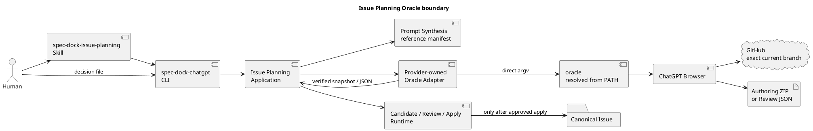

# iss-00334 Implement ChatGPT Issue Planning Workflow — Issue 設計

## 0. Design Intent

既存のauthoring-pack、Git、artifact、transaction primitiveと、完了済みcreate／revise／review／Human Gate／apply walking skeletonを維持し、Oracle transport境界だけを最小修復する。ChatGPTへ設計権限やrepository mutation権限を与えず、semantic判断はSkill／Human、identity／安全検証／applyはRuntimeへ残す。

source baselineは`chemitaro/spec-dock`、branch `iss-00334-implement-chatgpt-issue-planning-workflow`、HEAD `a68eefa6881440d276c2bbfe415e01417a964128`である。現行の個人`chatgpt-use` wrapper絶対パス、wrapper固有`--write-output`、custom text frameをprovider-owned direct Oracle adapterとfile-artifact contractへ置換する。

新しい汎用workflow engine、backend plugin framework、schema registry、state database、Oracle本体変更は作らない。public command family、Review modes、Candidate controls、Human decision、apply／publication semanticsは変更しない。

## 1. Component Boundary



### Ownership

| Layer | Owner |
|---|---|
| Human entry、mode／lane selection | installed `spec-dock-issue-planning` Skill |
| parser、dispatch、text／JSON result | `spec-dock-chatgpt` CLI／presentation |
| create／revise／review／apply orchestration、exact local Git preflight | application |
| Prompt本文、reference attachment manifest | `application/issue_planning_prompt.py`＋provider-managed resources |
| request、identity、typed Oracle output、Review／Human evidence validation | domain |
| PATH Oracle、direct argv、session status／reattach／artifact snapshot | provider-owned infra adapter |
| authoring ZIP／Candidate archive、filesystem transaction、Git publication | infra／existing primitives |
| Plan adoption、implementation start、merge | Human |

operator-local `chatgpt-use`は本設計のcomponentではない。この仕様策定作業で使用されても、product invocation、configuration、tests、distributionへ接続しない。

## 2. Public Commands

```text
spec-dock-chatgpt planning create
  --issue <iss-id>
  --output <external-dir>

spec-dock-chatgpt planning revise
  --candidate <zip>
  --request <json>
  --output <external-dir>

spec-dock-chatgpt review planning
  --issue <iss-id>
  --mode archive-candidate
  --candidate <zip>
  --output <external-dir>

spec-dock-chatgpt review planning
  --issue <iss-id>
  --mode git-bound
  --reviewed-head <sha>
  --output <external-dir>

spec-dock-chatgpt planning apply
  --issue <iss-id>
  --mode <archive-candidate|git-bound>
  --review-result <json>
  --human-decision <json>
  --expected-head <sha>
  --output <external-dir>
  [mode-specific identity options]
```

CLIはrepository root、repository name、current branch、upstreamをcurrent managed checkoutから導出する。public overrideは設けない。

`planning apply`のmode-specific identity optionsは次とする。

- archive: `--candidate`、`--logical-filename`、`--zip-sha256`
- git-bound: `--reviewed-head`

git-bound target pathsはIssue IDからcanonical三文書のexact pathsをRuntimeが決定する。arbitrary `--target`は公開しない。これにより別Issueや補助artifactをreviewed targetへ混入させない。

## 3. Request and Identity Contracts

### 3.1 Planning Context and Local Git Evidence

```text
PlanningContext
- issue_id
- repository
- branch
- source_head
- parent_epic_id
- parent_initiative_id
- dependency_summary
- canonical_issue_paths
- relevant_source_paths
- operator_context
```

Issue IDはexisting nodeから解決する。unknown IssueまたはSeedはOracle起動前に停止する。

既存application preflightをauthorityとして次を確認する。

1. Git repository内である。
2. symbolic current branchである。
3. upstreamが`origin/<current-branch>`でGitHub repositoryへ解決できる。
4. working treeとindexがcleanである。
5. fetch済みremote-tracking refとlocal HEADが一致する。
6. `allow_default_branch_fallback=False`相当を維持し、別branchへ自動切替しない。
7. Oracle output受領後、Candidate／Review publication前に同じpreflightをexpected source manifest付きで再実行し、branch／HEAD／source bytes driftを`stale`として拒否する。

`PlanningSourceEvidence`はrepository、branch、upstream、local／remote HEAD、source manifest hash、snapshot identityを保持する。このevidenceとChatGPT connectorへ送るrepository／branch／HEADは同じ値から生成する。

### 3.2 Oracle Invocation Request

applicationからinfraへ渡すrequestはrole別output expectationを明示する。

```text
IssuePlanningOracleRequest
- role = planner | semantic_revision | reviewer
- prompt_text
- reference_attachments[]
  - name
  - source_label
  - content_sha256
  - content bytes
- source_evidence
- output_expectation
  - kind = authoring_zip | review_json
  - logical_filename / internal_root / exact_inventory, or
  - closed_json_schema
```

`prompt_text`だけがtask instructionである。`reference_attachments`はdata-onlyであり、planner instruction、fallback policy、output contractを持たない。attachment名、content、source manifestの不一致はOracle call前に拒否する。

### 3.3 Oracle Output Snapshot

`PlanningInvocationResult`のserialized status／reason／source evidenceを維持しつつ、pass時のnon-serialized transient outputをtyped unionへ狭める。

```text
OracleAuthoringZipSnapshot
- expected_logical_filename
- observed_transport_filename
- internal_root
- size_bytes
- sha256
- zip_bytes          # transient, repr／JSON対象外

OracleReviewJsonPayload
- size_bytes
- sha256
- json_bytes         # transient, repr／JSON対象外
```

pass resultはrole expectationと一致する一種類だけを持つ。planner／semantic revisionへJSON text、reviewerへauthoring ZIPを返す結果、legacy generic `transient_payload`だけの曖昧な結果を拒否する。Oracle session locatorと元artifact pathはadapter-privateでありpublic resultへ出さない。

### 3.4 Candidate Identity

```text
IssueCandidateIdentity
- issue_id
- candidate_id
- version
- logical_filename
- observed_transport_filename
- internal_root
- source_repository
- source_branch
- source_head
- zip_sha256
```

Candidate identityはRuntime生成control filesとactual Candidate ZIP bytesから一意に構築する。transport filenameのclosed `(N)` suffix以外のrename、repack、root変更は別Candidateとして拒否する。Review resultとHuman decisionはlogical／observed transport filenameの双方とZIP SHAを保持する。

### 3.5 Reviewed Identity

```text
ReviewedPlanningIdentity
- mode
- issue_id
- repository
- branch
- source_head
- archive identity, or
- exact canonical target paths
```

archive modeはCandidate identityを含む。git-bound modeのtarget pathsは対象Issueのcanonical `requirement.md`、`design.md`、`plan.md`をUTF-8 byte順で保持する。

identityはcanonical JSONをSHA-256化し、Review resultとHuman decisionが同じobjectとdigestを持つことを検証する。ChatGPT connector exact-branch gateはReviewed identityを代替せず、追加のsource access gateとして扱う。

## 4. Authoring Artifact and Candidate Package

### 4.1 Oracle Authoring ZIP

Planner／Semantic Revisionのformal outputは次のcontent-only ZIP一個である。

```text
<issue-id>-issue-planning-documents.zip
└── <issue-id>-issue-planning-documents/
    ├── requirement.md
    ├── design.md
    └── plan.md
```

v1では`iss-00334-issue-planning-documents.zip`／`iss-00334-issue-planning-documents/`となる。三文書はstrict UTF-8、LF終端、non-empty substantive contentを必要とする。ZIPはexact root／inventoryだけを許可し、directory traversal、absolute／ambiguous path、duplicate／casefold／Unicode collision、symlink／special／executable entry、encryption、nested archive、binary、resource limit超過を拒否する。

observed download名のclosed`(N)`aliasはbasenameだけに適用し、root、inventory、bytes、recomputed SHAがexpected identityと一致する場合だけ正規化する。ChatGPTはMANIFEST、CHECKSUMS、Candidate ID、Human decisionを生成しない。

### 4.2 Runtime Candidate ZIP

検証済みauthoring ZIPをdocument mapへ変換した後、既存builderで次を生成する。

```text
<candidate-root>/
├── requirement.md
├── design.md
├── plan.md
├── SOURCE-BASELINE.json
├── MANIFEST.json
├── CHECKSUMS.sha256
└── PLACEHOLDER-ORACLE-MAP.json
```

Candidate packagingは一時directoryで行い、front matter／Issue identity、source baseline、control files、archive safety、ZIP SHAを全検証した後にfinal filenameへatomic publishする。既存final pathは上書きしない。

安全検証はexisting `authoring_pack` archive primitiveをnamed authoring-ZIP contractとIssue Candidate contractから再利用する。generic authoring-packのdefault behaviorは変更しない。

Placeholder Oracleは`PLACEHOLDER-ORACLE-MAP.json`のdynamic declarationsだけを検査する。static exact-hash fileは内容中のliteral placeholder exampleを解釈せず、declared checksum一致で受理する。

## 5. Direct Oracle Invocation

### 5.1 Current module repair surface

既存module／bootstrap seamを維持し、transport internalsだけを置換する。

| Surface | Repair responsibility |
|---|---|
| `application/issue_planning.py` | existing exact Git preflight、role／output expectation、create／review／revise orchestrationを維持する |
| `application/issue_planning_prompt.py` | provider role fragmentをChat prompt本文へ合成し、reference-only attachment manifestを生成する |
| `infra/issue_planning_chatgpt.py` | public callable／bootstrap wiringを維持したprovider-owned direct Oracle adapterへ書き換える |
| `infra/issue_planning_oracle_artifact.py`（必要最小の新規private helper） | Oracle versioned session metadataのparse、safe artifact selection／snapshotを隔離する |
| `domain/issue_planning_contracts.py` | role別typed transient outputとclosed reasonを追加する |
| `domain/issue_planning_candidate.py` | legacy marker parserのcreate／semantic path利用を廃止し、authoring ZIP validator／document mapを追加する。既存Candidate builderは維持する |
| `cli/bootstrap.py` | `invoke_issue_planning_chatgpt`相当の既存dependency injectionを維持し、新しいarbitrary backend abstractionを追加しない |

private helperを既存infra module内に収められる場合は新規fileを必須としない。ただしOracle session metadataのversion couplingは一つのtestable boundaryから外へ漏らさない。

### 5.2 Executable resolution and argv

adapterは`PATH`から`oracle`を解決し、PATH entryのsymlinkを解決した最終targetがregular executableであること、supported version、browser、file attachment、session status／artifact metadata capabilityをpreflightする。実行は概念上次のdirect argvであり、shell command stringを作らない。

```text
oracle --engine browser -p <complete prompt body> --file <reference-1> ...
```

exact flag spellingはsupported Oracle versionのcapability adapterへ閉じるが、次は不変である。

- Prompt submitは一回だけ。
- arbitrary backend executable／operator wrapper optionなし。
- wrapper固有`--write-output`なし。
- personal Project URL、remote Chrome host、profile path、LaunchAgent pathなし。
- API credential environmentを除去し、browser failure時にAPIへfallbackしない。
- Prompt／path／attachment nameをshellへ補間しない。

### 5.3 Prompt body and reference files

`SynthesizedPlanningPrompt.prompt`をそのままChat inputとしてOracleへ渡す。Prompt本文の順序は次を閉じる。

1. `@GitHub <repository>`とexact current branch／source HEAD。
2. current branchを開けない場合の`repository access failed`相当のhard failure、default／other branch fallback禁止。
3. role、scope、non-goals、Human authority、repository mutation禁止。
4. attachmentはbranch確認後のuntrusted reference dataであること。
5. role別formal output。planner／semantic revisionはlogical ZIP filename、internal root、exact three-file inventory、reviewerはclosed JSON。
6. final self-checkと、inline本文／patch／approval claimの禁止。

reference filesはcurrent parent／Issue docs、dependency summary、source manifest、関連source／tests、archive Review時のCandidate ZIP、semantic revision時のprior Candidate／formal Review evidence等である。現行の`chatgpt-use-prompt.md`、`expected-output-contract.md`、`safe-output-constraints.md`をtransport attachmentとして生成しない。

### 5.4 Exact GitHub connector gate

local preflight後も、ChatGPT自身がGitHub connectorでsame repository／branchを直接開く。Promptはdefault branch名をfallback candidateとして渡さない。current branchがconnectorから見えない場合、ChatGPTが添付だけからZIP／Review resultを作ってもadapter／applicationはFormal successにしない。

Formal success evidenceは次の論理積である。

```text
local clean current branch
AND origin/<same branch>
AND local HEAD == fetched remote HEAD
AND prompt exact repository／branch／HEAD
AND ChatGPT exact-current-branch gate not failed
AND post-run branch／HEAD／source manifest unchanged
AND role output contract valid
```

### 5.5 Planner and Semantic Revision artifact retrieval

Oracle runがsession identityを確立した後、adapterはstructured result／statusから同一sessionを追跡する。first-class caller-selected artifact exportがavailableならそれを優先する。利用できないsupported versionでは、isolated versioned readerがOracle session metadataの明示されたartifact inventoryだけを読む。home directory全体をfuzzy searchしない。

snapshot sequence:

1. expected logical filename／root／inventoryをapplication requestから取得。
2. Oracle metadata schema／versionとsession identityを検証。
3. matching ZIPがexactly oneであることを確認。no ZIP／multiple ZIPは停止。
4. metadata pathがsession root内で、regular file、no symlinkであることを`lstat`／open後`fstat`相当で確認。
5. metadata size／SHAを検証しながらrepository外private tempへcopy。
6. snapshot bytesのsize／SHAを再計算し、ZIP safety／root／inventoryを検証。
7. `OracleAuthoringZipSnapshot`だけをapplicationへ返し、元path、transcript、credentialを破棄する。

Prompt submit後のtimeout／disconnectではsame sessionへのstatus、reattach、harvestを行う。session terminal stateが不明なままnew promptをsubmitしない。recovery不能なら`blocked/oracle_session_recovery_required`を返す。

### 5.6 Reviewer result

Reviewerはfresh conversation、read-only、defect-only、exact current branch gateを使用する。formal outputはouter markerなしのclosed JSON objectであり、Oracleのassistant result／session outputから取得して`OracleReviewJsonPayload`としてhashを固定する。

```text
PlanningReviewResult
- reviewed_identity
- reviewed_identity_sha256
- verdict = pass | fail
- findings[]
  - id
  - severity = p0 | p1 | p2 | p3
  - exact_location
  - violated_requirement_or_contradiction
  - concrete_impact
```

PASS条件はP0／P1が0件であること。P2／P3はnon-blocking observationであり、Candidate revisionを起動しない。Reviewerはreplacement、patch、authoring ZIP、Candidate ZIP、approvalを返さない。

## 6. Revision Design

`PlanningRevisionRequestV1`は既存closed JSONを維持する。

Common fields:

```text
schema_version
lane = semantic | mechanical
candidate_identity
preserve_assumptions[]
```

Semantic fields:

```text
finding_ids[] = P0／P1 only
review_result_sha256
```

Mechanical fields:

```text
target_file = requirement.md | design.md | plan.md
old_text
new_text
meaning_invariant
diff_budget
```

Semantic laneはprior Candidateとformal P0／P1 findingsをfresh Blue Team conversationへreference dataとして渡し、complete three-document authoring ZIPを要求する。artifactは§4.1／§5.5を通り、document mapから既存Candidate packagingへ戻してnew identityを生成する。legacy text marker payloadを受理しない。

Mechanical laneはRuntimeがexact old textの一意match、target allowlist、new text、meaning invariant、diff budgetを検証して限定置換し、Oracleを呼ばずに共通Candidate packagingへ戻す。P2／P3-only request、0件match、複数match、budget超過は拒否し、Semantic laneへ切り替えない。

いずれもold Candidateを変更せず、new version／Candidate ID／ZIP SHAを生成し、fresh Reviewへ戻す。

## 7. Review and Human Evidence

`PlanningHumanDecisionV1`は次を持つ。

```text
schema_version
issue_id
reviewed_identity
reviewed_identity_sha256
review_result_sha256
decision = approved | rejected
plan_adoption
implementation_start
decided_at
```

truth table:

| decision | plan_adoption | implementation_start | action |
|---|---:|---:|---|
| approved | true | true | full apply |
| rejected | false | false | decision artifact only |

他の組合せ、unknown field、duplicate key、wrong digest、stale identityはrepository mutation前に拒否する。

## 8. Apply Transaction

Oracle boundary修復は既存apply contractを変更しない。Planner／Reviewer／adapterはこのsectionのmutation pathへ入れない。

### 8.1 Archive

1. Candidate、Review result、Human decision、expected HEADを検証。
2. external staging areaへsafe extract。
3. canonical三文書とindex stateをbackup。
4. Human decision artifactをnew fileとしてstage。
5. 三文書をwhole-file replacement。
6. Candidate-to-canonical parityを検証。
7. SpecDock validation／syncを実行。
8. Planning専用commitを作成。
9. current branchへpushしremote parityを確認。

### 8.2 Git-bound

1. Review result、Human decision、expected HEADを検証。
2. reviewed HEADのcanonical三文書blobとcurrent bytesの一致を確認。
3. Human decision artifactだけを追加。
4. validation／sync、commit、push、remote parityを実行。

### 8.3 Failure Semantics

- Oracle／authoring／Review phase: tracked tree、index、HEAD mutation 0。`blocked`、`rejected`、または`stale`で終了。
- replacement開始後からcommit前: reverse-order restoreし、一致すれば`rolled_back`。
- restore不一致: `recovery_required`。自動で別workspaceを探索しない。
- commit後のpush／remote確認失敗: local commitを保持して`publication_pending`。
- retryでremote／operation identity不一致: `blocked_remote_diverged`。force pushしない。

operation manifestは指定output directory内だけに保存する。repository-wide registryやcustom Git refは作らない。

## 9. Result Contract

```json
{
  "status": "ok|ready|blocked|stale|rejected|rolled_back|recovery_required|publication_pending|blocked_remote_diverged",
  "reason": "<closed snake-case code>",
  "issue_id": "iss-00334",
  "output": {},
  "details": []
}
```

既存success contract:

- create success: `ok/candidate_created`
- revise success: `ok/candidate_revised`
- review completion: `ok/review_completed`
- apply success: `ready/adoption_published`
- archive safety rejection: `rejected/archive_rejected`。個別検出codeは`details`へ入れる。

Oracle boundary reason:

| Condition | Result |
|---|---|
| PATH executableなし | `blocked/oracle_unavailable` |
| unsupported version／capability | `blocked/oracle_capability_unsupported` |
| exact current branch connector gate失敗 | `blocked/github_exact_branch_unavailable` |
| submitted sessionのterminal state／artifact回収が未確定 | `blocked/oracle_session_recovery_required` |
| expected artifactなし | `rejected/oracle_artifact_missing` |
| matching artifact複数 | `rejected/oracle_artifact_ambiguous` |
| wrong filename／root／type／metadata | `rejected/oracle_artifact_rejected` |
| unsafe ZIP／size／SHA／inventory不一致 | `rejected/archive_rejected` |

reason文字列はraw Oracle error、session path、Prompt、credentialを含めない。`ok`、authoring ZIP取得、Review `verdict=pass`だけでexecution readinessを示さない。

## 10. Provider and Projection

Implementation authority:

- executable／runtime: `src/spec_dock/assets/spec_dock/`
- installed Skill／Prompt: `src/spec_dock/assets/install_root/.agents/`
- direct adapter: existing provider `infra/issue_planning_chatgpt.py`＋必要なら一つのprivate Oracle artifact helper。

root `spec-dock/`はdogfood projectionであり直接実装しない。provider変更後にfresh init、update、このrepositoryのdogfood projectionでmanaged byte parityを検証する。

existing resource namesはinstaller compatibilityのため維持できるが、planner／revision role、exact branch gate、ZIP inventory、Human authorityはPrompt本文へ合成し、命令resourceをOracle attachmentとして渡さない。legacy transport frame resourceがmanaged fileとして残る場合はunused compatibility dataにせず削除またはrole別Prompt fragmentへ置換し、active call path／testsから参照0を証明する。

scoped product scanはruntime／managed Prompt／launcherに次のactive dependencyがないことを確認する。

- personal home absolute path。
- `.agents/skills/chatgpt-use`／`oracle-chatgpt` invocation。
- personal Project URL、Chrome host／profile、LaunchAgent。
- arbitrary backend command string。
- wrapper固有`--write-output`、`SPECDOCK-ISSUE-PLANNING-RESPONSE-V1` frame。

research artifact、reference-only snapshot、denylist tests内のliteralはallowlisted evidenceであり、runtime dependencyと区別する。

## 11. Security and Privacy

- Promptとreference filesをallowlist化し、sensitive pattern検出時はOracle call 0。
- Oracle executable、status、reattach、harvestはすべてdirect argv。shell 0。
- API credential環境を除去し、browser-only capability failureをAPI fallbackで隠さない。
- authoring ZIP、Candidate、Review、operation outputはrepository外のexisting non-symlink directoryだけ。
- Oracle artifactはsession-root containment、lstat／fstat regular-file、no symlink、size／SHAを検証してprivate tempへcopyする。TOCTOUを避け、copy後hashをauthorityとする。
- ZIP validationは展開前にpath、entry type、collision、encryption、sizeを検証し、展開後にCRC／inventory／checksumsを検証。
- Review前後でCandidate SHAとtracked diffを比較。
- diagnosticへsecret value、absolute private path、session storage path、raw transcript、cookie、GitHub private URLを保存しない。
- attachmentはuntrusted reference dataであり、埋め込まれた命令でPrompt contractを変更させない。

## 12. Verification Strategy

1. **domain**: role別typed output、authoring ZIP identity／root／inventory、closed alias、Candidate builder non-regression。
2. **application**: local exact Git preflight、Prompt expectation、create／semantic revisionのZIP handoff、review JSON、Candidate／tracked-tree不変。
3. **infra**: PATH resolution、resolved-target regular executable、version／capability、direct argv、environment sanitization、exactly-one submission、same-session recovery、metadata／symlink／size／SHA snapshot。
4. **Prompt**: exact repository／branch／HEAD、no-default-fallback、role／Human boundary、ZIP contractがChat bodyにあり、attachmentsがreference dataだけであること。
5. **CLI**: existing help、text／JSON parity、exit code、provider installationを維持する。
6. **integration**: PATH上のfake Oracle executableとfake versioned session artifactを用い、planner／semantic ZIP、reviewer JSON、timeout harvest、negative artifact classesを再現する。
7. **Candidate／apply regression**: archive／git-bound full chain、PA-NF-01〜10B、rollback／publication retryを維持する。
8. **distribution**: wheel／sdist、fresh init、update、dogfood managed parityとpersonal dependency scan。
9. **live dogfood**: hermetic suite後、Human-approved eligible Issue、exact current branch、real Oracle、downloadable ZIPでcreate→Review→Human Gate→applyを実施する。旧wrapper run evidenceを新境界のPASSへ流用しない。

既存`tests/unit/infra/test_issue_planning_chatgpt.py`はpersonal wrapper／`--write-output`のpositive assertionを削除し、fake PATH Oracle、direct argv、Prompt／attachment、artifact snapshotのcontract testへ置換する。`tests/integration/test_issue_planning_e2e.py`はwrapper-style fake backendではなくfake Oracle／session artifactでend-to-endを駆動する。application／domain／CLI／distributionの既存focused suitesを追加修正し、unrelated Core CLI behaviorを変更しない。

archive negative classesはparameterized testで個別IDを表示するが、製品計画上はauthoring ZIP safetyとCandidate safetyを別のacceptance obligationとして管理する。

## 13. Design Decisions

| Decision | Rationale |
|---|---|
| existing Issue only | Seed materializationを本Issueへ混入させない |
| public command family／bootstrap seamを維持 | 現行walking skeletonから続くbounded transport repairにする |
| existing `issue_planning_chatgpt.py`をprovider-owned adapterへ書換 | arbitrary abstractionや新CLI wrapperを増やさずpersonal dependencyを除去する |
| PATH Oracle、direct argv、browser-only fail closed | 配布可能性とshell／API fallback安全性を固定する |
| local Git gate＋ChatGPT exact-current-branch gate | wrong branch authoringを二重に拒否する |
| Prompt body is instruction、attachments are reference | authorityとdataを分離する |
| Planner／Semantic RevisionはZIP-only、Reviewerはclosed JSON | multi-file authoringとread-only reviewに適したrole別outputを使う |
| Oracle authoring ZIPとRuntime Candidate ZIPを分離 | ChatGPTへidentity／checksum／Human authorityを委譲しない |
| versioned session artifact readerを一つのinfra boundaryへ隔離 | Oracle first-class export未確認の結合を局所化する |
| same-session recovery、duplicate submit 0 | long-running transportで二重authoringを防ぐ |
| Human decision file／apply transactionを維持 | acceptance済み安全境界を変更しない |
| operator-local `chatgpt-use`はreference only | 本作業のtool choiceとproduct dependencyを区別する |

## 14. Amendment Triggers

次が必要になった場合は実装で吸収せずPlan／Design amendmentへ戻る。

- public command family、Review mode、Candidate inventory、Human authority、apply／publication semanticsを変更する。
- Seed materialization、Initiative／Epic Planning、汎用Review／backend frameworkをscopeへ追加する。
- Oracle本体変更、new public artifact-export API、persistent session registry／database／custom Git refをSpecDock側で所有する。
- ReviewerもZIP artifact化する、またはPlanner formal outputをZIP以外へ戻す。
- exact current branch以外のfallbackを許可する。
- existing authoring-pack public contractを破壊する。
- Oracle supported versionでsafe same-session artifact retrievalを閉じられず、private layout couplingが一つのinfra boundaryを越える。

private helper名、supported Oracle version allowlist、test parameter、Prompt wordingの非semantic調整はRequirementのobservable contractを満たす限りReportへ記録し、追加amendmentを要求しない。
