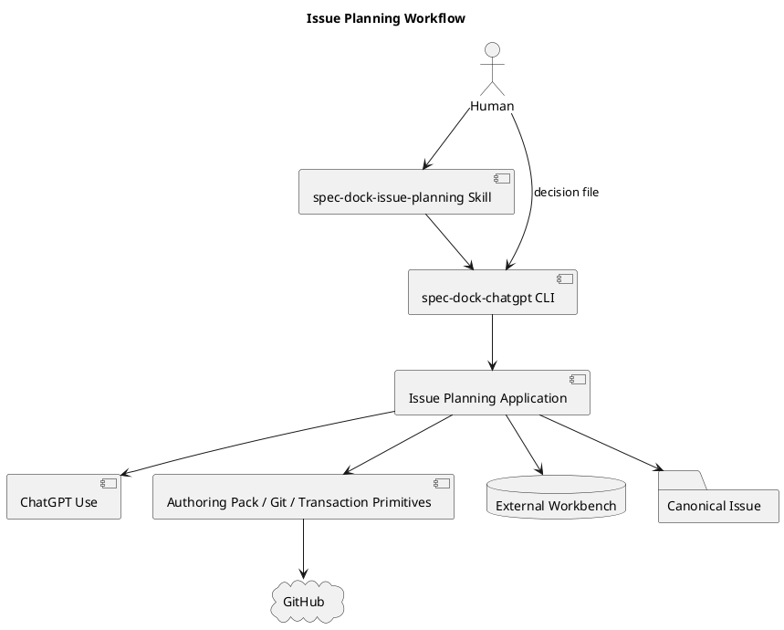

# iss-00334 Implement ChatGPT Issue Planning Workflow — Issue 設計

## 0. Design Intent

既存のauthoring-pack、Git、artifact、transaction primitiveを組み合わせ、Issue Planningに必要な薄いvertical workflowを追加する。ChatGPTへ設計権限やrepository mutation権限を与えず、semantic判断はSkill／Human、決定的処理はRuntimeへ分離する。

新しい汎用workflow engine、schema registry、state databaseは作らない。

## 1. Component Boundary



### Ownership

| Layer | Owner |
|---|---|
| Human entry、mode／lane selection | installed `spec-dock-issue-planning` Skill |
| parser、dispatch、text／JSON result | `spec-dock-chatgpt` CLI／presentation |
| create／revise／review／apply orchestration | application |
| request、identity、result、decision validation | domain |
| Git、archive、filesystem transaction、backend process | infra／existing primitives |
| Prompt content | provider-managed Skill resources |

## 2. Public Commands

```text
spec-dock-chatgpt planning create
  --issue <iss-id>
  --output <external-dir>

spec-dock-chatgpt planning revise
  --candidate <zip>
  --request <json>
  --output <external-dir>

spec-dock-chatgpt review planning
  --issue <iss-id>
  --mode archive-candidate
  --candidate <zip>
  --output <external-dir>

spec-dock-chatgpt review planning
  --issue <iss-id>
  --mode git-bound
  --reviewed-head <sha>
  --output <external-dir>

spec-dock-chatgpt planning apply
  --issue <iss-id>
  --mode <archive-candidate|git-bound>
  --review-result <json>
  --human-decision <json>
  --expected-head <sha>
  --output <external-dir>
  [mode-specific identity options]
```

CLIはrepository root、repository name、current branch、upstreamをcurrent managed checkoutから導出する。public overrideは設けない。

`planning apply`のmode-specific identity optionsは次とする。

- archive: `--candidate`、`--logical-filename`、`--zip-sha256`
- git-bound: `--reviewed-head`

git-bound target pathsはIssue IDからcanonical三文書のexact pathsをRuntimeが決定する。arbitrary `--target`は公開しない。これにより別Issueや補助artifactをreviewed targetへ混入させない。

## 3. Request and Identity Contracts

### 3.1 Planning Context

```text
PlanningContext
- issue_id
- repository
- branch
- source_head
- parent_epic_id
- parent_initiative_id
- dependency_summary
- canonical_issue_paths
- relevant_source_paths
- operator_context
```

Issue IDはexisting nodeから解決する。unknown IssueまたはSeedはbackend起動前に停止する。

Git preflightは次を確認する。

1. Git repository内である。
2. symbolic branchである。
3. upstreamがGitHub repositoryへ解決できる。
4. working treeとindexがcleanである。
5. local HEADとupstream branch HEADが一致する。

### 3.2 Candidate Identity

```text
IssueCandidateIdentity
- issue_id
- candidate_id
- version
- logical_filename
- observed_transport_filename
- internal_root
- source_repository
- source_branch
- source_head
- zip_sha256
```

control filesとactual ZIP bytesから一意に構築する。transport filenameのclosed `(N)` suffix以外のrename、repack、root変更は別Candidateとして拒否する。Review resultとHuman decisionはlogical／observed transport filenameの双方とZIP SHAを保持する。

### 3.3 Reviewed Identity

```text
ReviewedPlanningIdentity
- mode
- issue_id
- repository
- branch
- source_head
- archive identity, or
- exact canonical target paths
```

archive modeはCandidate identityを含む。git-bound modeのtarget pathsは対象Issueのcanonical `requirement.md`、`design.md`、`plan.md`をUTF-8 byte順で保持する。

identityはcanonical JSONをSHA-256化し、Review resultとHuman decisionが同じobjectとdigestを持つことを検証する。

## 4. Candidate Package

```text
<candidate-root>/
├── requirement.md
├── design.md
├── plan.md
├── SOURCE-BASELINE.json
├── MANIFEST.json
├── CHECKSUMS.sha256
└── PLACEHOLDER-ORACLE-MAP.json
```

Planner responseは三文書だけを返す。Runtimeがfront matter、control files、Candidate identity、ZIPを生成する。PlannerにMANIFESTやchecksumを生成させない。

packagingは一時directoryで行い、全validationとZIP SHA算出後にfinal filenameへatomic publishする。既存final pathは上書きしない。

安全検証はexisting `authoring_pack` archive primitiveをnamed Issue Candidate contractで再利用する。既存generic contractのdefault behaviorは変更しない。

Placeholder Oracleは`PLACEHOLDER-ORACLE-MAP.json`のdynamic declarationsだけを検査する。static exact-hash fileは内容中のliteral placeholder exampleを解釈せず、declared checksum一致で受理する。

## 5. ChatGPT Invocation

### 5.1 Planner

closed Promptへ次だけを合成する。

- PlanningContext。
- current parent／Issue三文書。
-必要最小限の関連source／docs。
- scope、non-goals、output contract。

ChatGPT Useをdirect argvで起動し、GitHub repository／branch参照を有効にする。secret scannerがblocking inputを検出した場合はbackendを呼ばない。

Planner responseはexact three Markdown documentsとしてparseする。partial response、unexpected fourth document、empty substantive sectionはCandidate化しない。

### 5.2 Reviewer

Reviewer Promptはread-only、fresh conversation、defect-only scopeを固定する。出力はmachine-readable resultとHuman-readable summaryをrepository外へ保存する。

```text
PlanningReviewResult
- reviewed_identity
- verdict = pass | fail
- findings[]
  - id
  - severity = p0 | p1 | p2
  - exact_location
  - violated_requirement_or_contradiction
  - concrete_impact
```

PASS条件はP0／P1が0件であること。P2はnon-blocking observationであり、改善提案をP1へ昇格しない。Reviewerはreplacement、patch、Candidate ZIPを返さない。

## 6. Revision Design

`PlanningRevisionRequestV1`はclosed JSONとする。

Common fields:

```text
schema_version
lane = semantic | mechanical
candidate_identity
preserve_assumptions[]
```

Semantic fields:

```text
finding_ids[]
review_result_sha256
```

Mechanical fields:

```text
target_file = requirement.md | design.md | plan.md
old_text
new_text
meaning_invariant
diff_budget
```

Semantic laneはprior Candidateとformal findingsを同じBlue Team conversationへ渡し、complete三文書responseを要求する。Mechanical laneはRuntimeがexact old textの一意match、target allowlist、new text、meaning invariant、diff budgetを検証して限定置換する。0件match、複数match、budget超過は拒否し、Semantic laneへ切り替えない。

いずれも共通packaging pathへ渡し、新identityを生成する。partial patchのままReviewへ渡さない。

## 7. Review and Human Evidence

`PlanningHumanDecisionV1`は次を持つ。

```text
schema_version
issue_id
reviewed_identity
reviewed_identity_sha256
review_result_sha256
decision = approved | rejected
plan_adoption
implementation_start
decided_at
```

truth table:

| decision | plan_adoption | implementation_start | action |
|---|---:|---:|---|
| approved | true | true | full apply |
| rejected | false | false | decision artifact only |

他の組合せ、unknown field、duplicate key、wrong digest、stale identityはrepository mutation前に拒否する。

## 8. Apply Transaction

### 8.1 Archive

1. Candidate、Review result、Human decision、expected HEADを検証。
2. external staging areaへsafe extract。
3. canonical三文書とindex stateをbackup。
4. Human decision artifactをnew fileとしてstage。
5. 三文書をwhole-file replacement。
6. Candidate-to-canonical parityを検証。
7. SpecDock validation／syncを実行。
8. Planning専用commitを作成。
9. current branchへpushしremote parityを確認。

### 8.2 Git-bound

1. Review result、Human decision、expected HEADを検証。
2. reviewed HEADのcanonical三文書blobとcurrent bytesの一致を確認。
3. Human decision artifactだけを追加。
4. validation／sync、commit、push、remote parityを実行。

### 8.3 Failure Semantics

- repository mutation前: `blocked`、`rejected`、または`stale`。
- replacement開始後からcommit前: reverse-order restoreし、一致すれば`rolled_back`。
- restore不一致: `recovery_required`。自動で別workspaceを探索しない。
- commit後のpush／remote確認失敗: local commitを保持して`publication_pending`。
- retryでremote／operation identity不一致: `blocked_remote_diverged`。force pushしない。

operation manifestは指定output directory内だけに保存する。repository-wide registryやcustom Git refは作らない。

## 9. Result Contract

```json
{
  "status": "ok|ready|blocked|stale|rejected|rolled_back|recovery_required|publication_pending|blocked_remote_diverged",
  "reason": "<closed snake-case code>",
  "issue_id": "iss-00334",
  "output": {},
  "details": []
}
```

- create success: `ok/candidate_created`
- revise success: `ok/candidate_revised`
- review completion: `ok/review_completed`
- apply success: `ready/adoption_published`
- archive safety rejection: `rejected/archive_rejected`。個別検出codeは`details`へ入れる。

`ok`またはReview `verdict=pass`だけでexecution readinessを示さない。

## 10. Provider and Projection

Implementation authority:

- executable／runtime: `src/spec_dock/assets/spec_dock/`
- installed Skill／Prompt: `src/spec_dock/assets/install_root/.agents/`

root `spec-dock/`はdogfood projectionであり直接実装しない。provider変更後にfresh init、update、このrepositoryのdogfood projectionでparityを検証する。

## 11. Security

- Promptとexplicit filesをallowlist化し、sensitive pattern検出時はbackend call 0。
- backend processはdirect argv。
- Candidate／Review／operation outputはrepository外のexisting non-symlink directoryだけ。
- ZIP validationは展開前にpath、entry type、collision、encryption、sizeを検証し、展開後にCRC／inventory／checksumsを検証。
- Review前後でCandidate SHAとtracked diffを比較。
- diagnosticへsecret value、absolute private path、raw transcriptを保存しない。

## 12. Verification Strategy

1. domain: request、identity、revision、Review／Human evidence、result mapping。
2. application: create／revise／review／apply orchestration、fault recovery。
3. infra: Git preflight、backend argv、archive、transaction。
4. CLI: help、text／JSON parity、exit code、provider installation。
5. integration: fake backendとfake remoteによるarchive／git-bound full chain。
6. distribution: wheel／sdist、fresh init、update、dogfood parity。
7. live dogfood: Human-approved eligible Issue一件。

archive negative classesはparameterized testで個別IDを表示するが、製品計画上は一つのarchive safety acceptance obligationとして管理する。

## 13. Design Decisions

| Decision | Rationale |
|---|---|
| existing Issue only | Seed materializationを本Issueへ混入させない |
| archive default／git-bound explicit fallback | pre-canonical iterationをGit historyから分離しつつactual path reviewも許可する |
| git-bound targetはcanonical三文書固定 | reviewed identityの曖昧さをなくす |
| explicit revision request | reviewer findingと修正対象の取り違えを防ぐ |
| Runtime owns packaging | ChatGPT outputとartifact identityを分離する |
| Human decision file | approvalを推測せずexact Reviewへbindする |
| `ok`と`ready`を分離 | authoring／review完了をimplementation readinessと誤認しない |
| existing primitives再利用 | security／transaction機能の重複を避ける |

## 14. Amendment Triggers

次が必要になった場合は実装で吸収せずPlan amendmentへ戻る。

- Seed materializationをCLIへ追加する。
- reviewed targetを三文書以外へ拡張する。
- new persistent registry／database／custom Git refを追加する。
- Human authority、Review verdict、merge／finish semanticsを変更する。
- existing authoring-pack public contractを破壊する。
