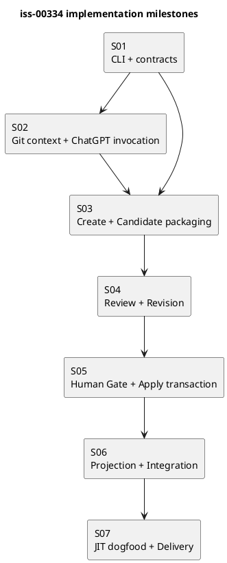

# iss-00334 Implement ChatGPT Issue Planning Workflow — Issue 実装計画

## 0. Goal

ChatGPT-first Issue Planningのcreate→revise→review→Human Gate→applyを、existing SpecDock primitivesを再利用した一つのwalking skeletonとして実装する。

本計画は実装順序、主要target、検証、停止条件を定義する。個々のtest parameterや内部helperまで事前にclosure ID化しない。各milestoneはfocused testとreviewで閉じ、同じ証明を後続stepで重複管理しない。

## 1. Preconditions

- active Issueは`iss-00334`。
- current branchはIssue専用branchで、GitHub upstreamと同期している。
- canonical Requirement／Design／Planがfresh defect-only spec reviewを通過している。
- Humanがimplementation startを承認している。
- provider authorityとdogfood projectionの区別を維持する。

## 2. Delivery Model

- one Issue／one branch／one Delivery PR。
- Issue内はmilestoneごとにfocused commitを作成できる。
- 各milestone後にtargeted code reviewを行う。
- merge、Issue finishはHumanとshared workflowへhandoffする。
- workerはcanonical `report.md`や`.assurance.json`を変更せず、Mainが証跡を統合する。

## 3. Planned File Surfaces

Exact filenamesはS01のrepository inspectionで既存命名へ合わせる。新規責務の予定surfaceは次のとおり。

### Provider runtime

- `src/spec_dock/assets/spec_dock/scripts/spec-dock-chatgpt`
- `src/spec_dock/assets/spec_dock/scripts/spec_dock_runtime/cli/`
- `src/spec_dock/assets/spec_dock/scripts/spec_dock_runtime/commands/`
- `src/spec_dock/assets/spec_dock/scripts/spec_dock_runtime/application/issue_planning.py`
- `src/spec_dock/assets/spec_dock/scripts/spec_dock_runtime/domain/issue_planning_contracts.py`
- `src/spec_dock/assets/spec_dock/scripts/spec_dock_runtime/infra/`
- `src/spec_dock/assets/spec_dock/scripts/spec_dock_runtime/presentation/`

### Installed assets

- `src/spec_dock/assets/install_root/.agents/skills/spec-dock-issue-planning/`
- provider-managed Issue Planning／Review Prompt resources。

### Tests

- focused unit tests under `tests/unit/{domain,application,infra,presentation}/`
- CLI tests under `tests/cli_runtime/`
- fake backend／fake remote tests under `tests/integration/`
- installer／projection assertions in existing installer test surface。

既存moduleに明確なownerがある場合は新規fileを増やさず、そのmoduleへ最小追加する。

## 4. Milestone Graph



S02のGit／backend adapterとS03のCandidate domain部分はS01後に並列実装可能だが、S03 integrationはS02完了後に行う。

## 5. S01 — CLI Skeleton and Domain Contracts

### Goal

四commandのparser、help、result envelope、主要data contractを実装し、後続stepの公開境界を固定する。

### Work

1. repo-local `spec-dock-chatgpt` executableとdispatchを追加する。
2. create／revise／review／applyのargumentsをDesign §2どおり定義する。
3. PlanningContext、Candidate identity、Reviewed identity、Revision request、Review result、Human decision、Command resultのvalidationを追加する。
4. existing Issueのcanonical三文書path resolverを追加する。
5. Seed、unknown Issue、cross-mode options、unknown fieldsをfail closedにする。

### Tests

- top-level／subcommand help。
- JSONとtextのstatus／reason一致。
- `ok`と`ready`の区別。
- revision requestのsemantic／mechanical positiveとmalformed negative。
- Human decision truth table、digest／identity mismatch。
- git-bound targetがexact canonical 3 pathsになること。

### Exit

- focused CLI／domain tests Green。
- public interfaceがRequirement／Designと一致。
- new registry、database、arbitrary target／Prompt optionがない。

## 6. S02 — Git Context and ChatGPT Invocation

### Goal

exact GitHub sourceへbindした安全なPlanner／Reviewer invocationを実装する。

### Work

1. current repository、branch、upstream、local／remote HEADを解決する。
2. clean tree、non-detached、GitHub upstream、HEAD equality preflightを実装する。
3. Issue、親、依存、relevant sourceをbounded PlanningContextへまとめる。
4. provider-managed Promptを合成する。
5. ChatGPT Use wrapperをdirect argvで起動し、timeout／nonzero／missing outputを分類する。
6. secret／private path redactionをbackend call前とdiagnostic出力前に適用する。

### Tests

- clean synced branch positive。
- dirty、detached、missing upstream、remote mismatch negativeでbackend call 0。
- repository／branch／HEADがPrompt transportへ渡る。
- secret／shell metacharacter fixtureで漏えい／shell実行 0。
- backend missing、timeout、nonzero、partial response。

### Exit

- fake backend test Green。
- source identityがresult evidenceへ残る。
- raw transcript、credential、private absolute pathを保存しない。

## 7. S03 — Create and Candidate Packaging

### Goal

complete Planner responseからimmutable Issue Candidate ZIPを生成する。

### Work

1. Planner responseを三文書としてparse／validateする。
2. front matterとIssue identityを検証する。
3. Runtimeがcontrol filesとCandidate identityを生成する。
4. existing authoring-pack ZIP validationをIssue Candidate contractで再利用する。
5. temp build→validation→atomic final publishを実装する。
6. final ZIP SHAと`ok/candidate_created` resultを返す。

### Tests

- complete三文書からexact inventoryを持つCandidateを生成。
- incomplete／extra document、wrong Issue、control mismatch、existing output collisionでfinal ZIP 0。
- unsafe path、special file、collision、encryption、nested archive、binary、CRC／checksum mismatch、resource limitをparameterized negativeで拒否。
- existing generic authoring-pack behaviorのcharacterization test。
- reproducible identity fieldsとexternal ZIP SHA。
- closed`(N)`transport alias positive、fuzzy rename／hash mismatch negative、Human evidenceのlogical／transport filename保持。
- dynamic placeholder positive／remaining token negativeと、static exact-hash literal example positive。

### Exit

- create→Candidate ZIPのfake backend integration Green。
- generic authoring-pack regressionなし。
- Candidate source、manifest、checksumsを独立検証できる。

## 8. S04 — Review and Revision

### Goal

fresh read-only Reviewと、明示requestに基づく二つのrevision laneを実装する。

### Work

1. archive／git-bound Reviewed identityを構築する。
2. archiveではexact ZIP、git-boundではexact canonical三文書をReviewerへ渡す。
3. defect-only Promptとmachine-readable Review result validatorを追加する。
4. Review前後のCandidate SHA／tracked diff不変を確認する。
5. Semantic revisionでprior Candidate＋formal findingsからcomplete replacementを取得する。
6. Mechanical revisionでexact target／old／new／invariantに限定した置換を行う。
7. 両laneをS03 packagingへ戻してnew Candidateを生成する。

### Tests

- archive／git-bound positive、mode mismatch／stale identity negative。
- git-bound exact three targetsとsupplemental contextの分離。
- Reviewer repository mutationを検出して失敗。
- Review result schema、P0／P1 verdict rule。
- Semantic complete replacement、Mechanical unique-match replacement。
- undeclared finding、wrong Candidate、old text 0件／複数match、diff budget超過、scope expansionでnew ZIP 0。
- old Candidate不変、new version／Candidate ID／ZIP SHA。

### Exit

- create→Review、revise→fresh Reviewのfake backend chain Green。
- Review thread再利用やPASS継承を行わない。
- Reviewerがpatch／replacement／ZIPをauthority outputとして返さない。

## 9. S05 — Human Gate and Apply Transaction

### Goal

exact ReviewへbindしたHuman decisionだけを受け、safe adoption、validation、commit、pushを実行する。

### Work

1. Review resultとHuman decisionのbytes、digest、identity、freshnessを検証する。
2. rejected decisionはdecision artifactだけを記録する。
3. archive applyはsafe extract後、三文書をwhole-file replacementする。
4. git-bound applyはreviewed target blobsの不変性を確認する。
5. scoped transactionでdecision artifact、三文書、indexをstage／backup／restoreする。
6. required validation／syncを実行する。
7. Planning専用commitを作成しpush／remote parityを確認する。
8. rollback、publication retry、remote divergenceをDesignどおり分類する。

### Tests

- archive／git-bound approved positiveは全条件成立時だけ`ready`。
- PA-NF-01〜09、10A、10Bをnamed parameterとして独立実行し、Requirementのexact statusとreadinessなしを確認。
- Review-only、Human-only、wrong identity、Review fail＋approval、stale sourceはnon-ready。
- rejected decisionは三文書不変、decision artifactだけをpublish。
- archive whole-file parity、decision artifact以外のunexpected external diff 0、git-bound target blob parity。
- archive PASS後のReview省略条件positiveと、source drift／Candidate-external changeによるfresh Review分岐。
- requirement／design／plan置換中、validation、commit前のfault injectionでexact rollback。
- restore mismatchは`recovery_required`。
- push failureはlocal commit保持＋`publication_pending`、same operation retryで収束。
- remote divergenceはforce／reset／amend 0。

### Exit

- fake remote integrationでpositive／fault paths Green。
- repository／index／HEADのpost-conditionを各resultで確認。
- `ready`がReview、Human、parity、validation、remote publicationの論理積からだけ導出される。

## 10. S06 — Provider Projection and End-to-End Regression

### Goal

shipped provider、distribution、installed／dogfood projectionを完成させる。

### Work

1. official SkillとPrompt resourcesをprovider authorityへ反映する。
2. new executableをinit／update対象にする。
3. user-facing workflow／command referenceを更新する。
4. wheel／sdist、fresh init、updateを検証する。
5. dogfood projectionをofficial update経路で更新する。
6. archive／git-bound full fake E2Eとexisting regressionを実行する。

### Tests

- provider／wheel／sdist／fresh init／update／dogfoodのmanaged byte parity。
- installed Skillからrepo-local commandへ到達。
- existing Core CLI、Issue lifecycle、authoring-pack focused tests。
- full fake chain:
  - create→archive Review→approved apply→ready。
  - create→git-bound Review→approved apply→ready。
  - failed Review→Semantic revise→new Candidate→fresh PASS。
- `.assurance.json`、Portfolio、sibling／downstream Issueへのunauthorized mutation 0。

### Exit

- focused suitesと関連full regression Green。
- provider-first ownershipが維持される。
- docsとactual helpが一致する。

## 11. S07 — JIT Dogfood and Delivery

### Goal

製品能力を一件の実Issueで確認し、Delivery PRをmerge-readyへ進める。

### Preconditions

Humanが次を明示承認する。

- target Issue。
- dedicated clean worktree／branch。
- archiveまたはgit-bound mode。
- live ChatGPT／GitHub利用。
- canonical mutation／commit／push範囲。
- evidence destination。

### Work

1. eligible targetとpreflightを確認する。
2. `planning create`を実行する。
3. fresh defect-only `review planning`を実行する。
4. findingがあれば必要最小限のrevisionを一回ずつ行い、new Candidateをfresh reviewする。
5. exact identityへHuman decisionを取得する。
6. `planning apply`を実行し`ready`とremote parityを確認する。
7. intervention count、handoff量、wall-clock、failure modeをreportへ記録する。
8. Issue implementation全体のcode／QA reviewを行う。
9. Delivery PRを作成し、required checks後にHuman mergeへhandoffする。

### Stop Conditions

- eligible targetまたはHuman authorizationなし。
- reviewが設計改善提案だけで修正を要求する。
- Candidate／HEAD drift。
- scope外mutation。
- required test／review／remote parity失敗。

### Exit

- AC-001〜AC-014のevidenceが揃う。
- worktree clean、branch pushed、PR checks確認済み。
- merge／Issue finishはHuman decision待ちで停止する。

## 12. Verification Commands

実装中は存在するtargetに合わせてnarrowest commandから実行する。予定lane:

```bash
uv run pytest tests/unit/domain tests/unit/application tests/unit/infra tests/unit/presentation
uv run pytest tests/cli_runtime
uv run pytest tests/integration
uv run pytest
uv build
./spec-dock/scripts/spec-dock validate
git diff --check
```

全suiteを各milestoneで繰り返さず、S01〜S05はfocused tests、S06で関連full regression、S07でlive dogfoodを行う。

## 13. Requirement Traceability

| Requirement | Milestone |
|---|---|
| REQ-001〜003 | S01、S02、S06 |
| REQ-004 | S03 |
| REQ-005〜007 | S04 |
| REQ-008〜011 | S01、S05 |
| REQ-012 | S02、S03、S05 |
| REQ-013 | S06 |
| REQ-014 | S07 |

| Acceptance | Evidence owner |
|---|---|
| AC-001〜004 | S01〜S04 focused tests |
| AC-005〜006 | S03／S04 integration |
| AC-007〜010 | S05 fake remote／fault tests |
| AC-011 | S02／S03 security tests |
| AC-012 | S06 distribution／projection tests |
| AC-013 | S07 dogfood report |
| AC-014 | S07 Delivery PR |

## 14. Review Focus

Spec reviewは次だけをblocking対象とする。

- Requirement、Design、Plan間の直接矛盾。
- public commandまたはidentityの実装不能な欠落。
- exact path、owner、step dependencyのずれ。
- Human authority bypass。
- concrete security／data-loss risk。
- Acceptanceに対応する実装stepまたはtestの欠落。

より良いarchitecture、新しいschema、追加matrix、将来拡張の提案はblocking findingにしない。

## 15. Plan Amendment Triggers

- public command family、Candidate inventory、Human authorityを変更する。
- Seed materialization、Initiative／Epic Planning、汎用Reviewをscopeへ追加する。
- persistent registry／database、custom Git refが必要になる。
- target surfaceが別Epic／shared lifecycleへ拡張する。
- rollbackまたはpublication semanticsを変更する。
- Acceptanceを満たせないことがfocused testで判明する。

小さなfile placement、private helper名、test parameter追加はReportへ記録し、Plan amendmentを要求しない。
