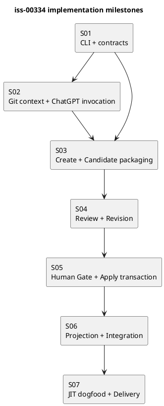
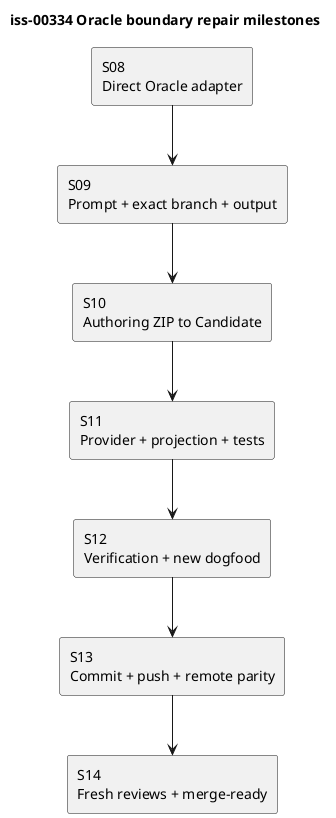

# iss-00334 Implement ChatGPT Issue Planning Workflow — Issue 実装計画

## 0. Goal

ChatGPT-first Issue Planningのcreate→revise→review→Human Gate→applyを、existing SpecDock primitivesを再利用した一つのwalking skeletonとして実装する。

本計画は実装順序、主要target、検証、停止条件を定義する。個々のtest parameterや内部helperまで事前にclosure ID化しない。各milestoneはfocused testとreviewで閉じ、同じ証明を後続stepで重複管理しない。

## 1. Preconditions

- active Issueは`iss-00334`。
- current branchはIssue専用branchで、GitHub upstreamと同期している。
- canonical Requirement／Design／Planがfresh defect-only spec reviewを通過している。
- Humanがimplementation startを承認している。
- provider authorityとdogfood projectionの区別を維持する。

## 2. Delivery Model

- one Issue／one branch／one Delivery PR。
- Issue内はmilestoneごとにfocused commitを作成できる。
- 各milestone後にtargeted code reviewを行う。
- merge、Issue finishはHumanとshared workflowへhandoffする。
- workerはcanonical `report.md`や`.assurance.json`を変更せず、Mainが証跡を統合する。

## 3. Planned File Surfaces

Exact filenamesはS01のrepository inspectionで既存命名へ合わせる。新規責務の予定surfaceは次のとおり。

### Provider runtime

- `src/spec_dock/assets/spec_dock/scripts/spec-dock-chatgpt`
- `src/spec_dock/assets/spec_dock/scripts/spec_dock_runtime/cli/`
- `src/spec_dock/assets/spec_dock/scripts/spec_dock_runtime/commands/`
- `src/spec_dock/assets/spec_dock/scripts/spec_dock_runtime/application/issue_planning.py`
- `src/spec_dock/assets/spec_dock/scripts/spec_dock_runtime/domain/issue_planning_contracts.py`
- `src/spec_dock/assets/spec_dock/scripts/spec_dock_runtime/infra/`
- `src/spec_dock/assets/spec_dock/scripts/spec_dock_runtime/presentation/`

### Installed assets

- `src/spec_dock/assets/install_root/.agents/skills/spec-dock-issue-planning/`
- provider-managed Issue Planning／Review Prompt resources。

### Tests

- focused unit tests under `tests/unit/{domain,application,infra,presentation}/`
- CLI tests under `tests/cli_runtime/`
- fake backend／fake remote tests under `tests/integration/`
- installer／projection assertions in existing installer test surface。

既存moduleに明確なownerがある場合は新規fileを増やさず、そのmoduleへ最小追加する。

## 4. Milestone Graph



S02のGit／backend adapterとS03のCandidate domain部分はS01後に並列実装可能だが、S03 integrationはS02完了後に行う。

## 実装ステップ

S01〜S07を一つずつ実行する。各stepの開始前にChatGPT Proでcurrent HEADと該当sourceを確認し、exact allowed paths、テストケース、実装順、停止条件、サブエージェントへの指示をIssue `artifacts/`へ保存する。このstep execution artifactは本計画の範囲を拡張せず、各stepの`Work`、`Tests`、`Exit`を具体化する実行入力として扱う。Mainはartifactをsourceと照合してからbounded workerへ渡し、結果を`report.md`へ記録する。

## 5. S01 — CLI Skeleton and Domain Contracts

### Goal

四commandのparser、help、result envelope、主要data contractを実装し、後続stepの公開境界を固定する。

### Work

1. repo-local `spec-dock-chatgpt` executableとdispatchを追加する。
2. create／revise／review／applyのargumentsをDesign §2どおり定義する。
3. PlanningContext、Candidate identity、Reviewed identity、Revision request、Review result、Human decision、Command resultのvalidationを追加する。
4. existing Issueのcanonical三文書path resolverを追加する。
5. Seed、unknown Issue、cross-mode options、unknown fieldsをfail closedにする。

### Tests

- top-level／subcommand help。
- JSONとtextのstatus／reason一致。
- `ok`と`ready`の区別。
- revision requestのsemantic／mechanical positiveとmalformed negative。
- Human decision truth table、digest／identity mismatch。
- git-bound targetがexact canonical 3 pathsになること。

### Exit

- focused CLI／domain tests Green。
- public interfaceがRequirement／Designと一致。
- new registry、database、arbitrary target／Prompt optionがない。

## 6. S02 — Git Context and ChatGPT Invocation

### Goal

exact GitHub sourceへbindした安全なPlanner／Reviewer invocationを実装する。

### Work

1. current repository、branch、upstream、local／remote HEADを解決する。
2. clean tree、non-detached、GitHub upstream、HEAD equality preflightを実装する。
3. Issue、親、依存、relevant sourceをbounded PlanningContextへまとめる。
4. provider-managed Promptを合成する。
5. ChatGPT Use wrapperをdirect argvで起動し、timeout／nonzero／missing outputを分類する。
6. secret／private path redactionをbackend call前とdiagnostic出力前に適用する。

### Tests

- clean synced branch positive。
- dirty、detached、missing upstream、remote mismatch negativeでbackend call 0。
- repository／branch／HEADがPrompt transportへ渡る。
- secret／shell metacharacter fixtureで漏えい／shell実行 0。
- backend missing、timeout、nonzero、partial response。

### Exit

- fake backend test Green。
- source identityがresult evidenceへ残る。
- raw transcript、credential、private absolute pathを保存しない。

## 7. S03 — Create and Candidate Packaging

### Goal

complete Planner responseからimmutable Issue Candidate ZIPを生成する。

### Work

1. Planner responseを三文書としてparse／validateする。
2. front matterとIssue identityを検証する。
3. Runtimeがcontrol filesとCandidate identityを生成する。
4. existing authoring-pack ZIP validationをIssue Candidate contractで再利用する。
5. temp build→validation→atomic final publishを実装する。
6. final ZIP SHAと`ok/candidate_created` resultを返す。

### Tests

- complete三文書からexact inventoryを持つCandidateを生成。
- incomplete／extra document、wrong Issue、control mismatch、existing output collisionでfinal ZIP 0。
- unsafe path、special file、collision、encryption、nested archive、binary、CRC／checksum mismatch、resource limitをparameterized negativeで拒否。
- existing generic authoring-pack behaviorのcharacterization test。
- reproducible identity fieldsとexternal ZIP SHA。
- closed`(N)`transport alias positive、fuzzy rename／hash mismatch negative、Human evidenceのlogical／transport filename保持。
- dynamic placeholder positive／remaining token negativeと、static exact-hash literal example positive。

### Exit

- create→Candidate ZIPのfake backend integration Green。
- generic authoring-pack regressionなし。
- Candidate source、manifest、checksumsを独立検証できる。

## 8. S04 — Review and Revision

### Goal

fresh read-only Reviewと、明示requestに基づく二つのrevision laneを実装する。

### Work

1. archive／git-bound Reviewed identityを構築する。
2. archiveではexact ZIP、git-boundではexact canonical三文書をReviewerへ渡す。
3. defect-only Promptとmachine-readable Review result validatorを追加する。
4. Review前後のCandidate SHA／tracked diff不変を確認する。
5. Semantic revisionでprior Candidate＋formal findingsからcomplete replacementを取得する。
6. Mechanical revisionでexact target／old／new／invariantに限定した置換を行う。
7. 両laneをS03 packagingへ戻してnew Candidateを生成する。

### Tests

- archive／git-bound positive、mode mismatch／stale identity negative。
- git-bound exact three targetsとsupplemental contextの分離。
- Reviewer repository mutationを検出して失敗。
- Review result schema、P0／P1 verdict rule。
- Semantic complete replacement、Mechanical unique-match replacement。
- P2／P3-only ReviewではCandidate不変、revision backend call 0。
- undeclared finding、P2／P3 finding trigger、wrong Candidate、old text 0件／複数match、diff budget超過、scope expansionでnew ZIP 0。
- old Candidate不変、new version／Candidate ID／ZIP SHA。

### Exit

- create→Review、revise→fresh Reviewのfake backend chain Green。
- Review thread再利用やPASS継承を行わない。
- Reviewerがpatch／replacement／ZIPをauthority outputとして返さない。

## 9. S05 — Human Gate and Apply Transaction

### Goal

exact ReviewへbindしたHuman decisionだけを受け、safe adoption、validation、commit、pushを実行する。

### Work

1. Review resultとHuman decisionのbytes、digest、identity、freshnessを検証する。
2. rejected decisionはdecision artifactだけを記録する。
3. archive applyはsafe extract後、三文書をwhole-file replacementする。
4. git-bound applyはreviewed target blobsの不変性を確認する。
5. scoped transactionでdecision artifact、三文書、indexをstage／backup／restoreする。
6. required validation／syncを実行する。
7. Planning専用commitを作成しpush／remote parityを確認する。
8. rollback、publication retry、remote divergenceをDesignどおり分類する。

### Tests

- archive／git-bound approved positiveは全条件成立時だけ`ready`。
- PA-NF-01〜09、10A、10Bをnamed parameterとして独立実行し、Requirementのexact statusとreadinessなしを確認。
- Review-only、Human-only、wrong identity、Review fail＋approval、stale sourceはnon-ready。
- rejected decisionは三文書不変、decision artifactだけをpublish。
- archive whole-file parity、decision artifact以外のunexpected external diff 0、git-bound target blob parity。
- archive PASS後のReview省略条件positiveと、source drift／Candidate-external changeによるfresh Review分岐。
- requirement／design／plan置換中、validation、commit前のfault injectionでexact rollback。
- restore mismatchは`recovery_required`。
- push failureはlocal commit保持＋`publication_pending`、same operation retryで収束。
- remote divergenceはforce／reset／amend 0。

### Exit

- fake remote integrationでpositive／fault paths Green。
- repository／index／HEADのpost-conditionを各resultで確認。
- `ready`がReview、Human、parity、validation、remote publicationの論理積からだけ導出される。

## 10. S06 — Provider Projection and End-to-End Regression

### Goal

shipped provider、distribution、installed／dogfood projectionを完成させる。

### Work

1. official SkillとPrompt resourcesをprovider authorityへ反映する。
2. new executableをinit／update対象にする。
3. user-facing workflow／command referenceを更新する。
4. wheel／sdist、fresh init、updateを検証する。
5. dogfood projectionをofficial update経路で更新する。
6. archive／git-bound full fake E2Eとexisting regressionを実行する。

### Tests

- provider／wheel／sdist／fresh init／update／dogfoodのmanaged byte parity。
- installed Skillからrepo-local commandへ到達。
- existing Core CLI、Issue lifecycle、authoring-pack focused tests。
- full fake chain:
  - create→archive Review→approved apply→ready。
  - create→git-bound Review→approved apply→ready。
  - failed Review→Semantic revise→new Candidate→fresh PASS。
- `.assurance.json`、Portfolio、sibling／downstream Issueへのunauthorized mutation 0。

### Exit

- focused suitesと関連full regression Green。
- provider-first ownershipが維持される。
- docsとactual helpが一致する。

## 11. S07 — JIT Dogfood and Delivery

### Goal

製品能力を一件の実Issueで確認し、Delivery PRをmerge-readyへ進める。

### Preconditions

Humanが次を明示承認する。

- target Issue。
- dedicated clean worktree／branch。
- archiveまたはgit-bound mode。
- live ChatGPT／GitHub利用。
- canonical mutation／commit／push範囲。
- evidence destination。

### Work

1. eligible targetとpreflightを確認する。
2. `planning create`を実行する。
3. fresh defect-only `review planning`を実行する。
4. P0／P1 findingがあれば必要最小限のrevisionを一回ずつ行い、new Candidateをfresh reviewする。P2／P3だけの場合はCandidateを変更しない。
5. exact identityへHuman decisionを取得する。
6. `planning apply`を実行し`ready`とremote parityを確認する。
7. intervention count、handoff量、wall-clock、failure modeをreportへ記録する。
8. Issue implementation全体のcode／QA reviewを行う。
9. Delivery PRを作成し、required checks後にHuman mergeへhandoffする。

### Stop Conditions

- eligible targetまたはHuman authorizationなし。
- reviewが設計改善提案だけで修正を要求する。
- Candidate／HEAD drift。
- scope外mutation。
- required test／review／remote parity失敗。

### Exit

- AC-001〜AC-014のevidenceが揃う。
- worktree clean、branch pushed、PR checks確認済み。
- merge／Issue finishはHuman decision待ちで停止する。

## 12. Verification Commands

実装中は存在するtargetに合わせてnarrowest commandから実行する。予定lane:

```bash
uv run pytest tests/unit/domain tests/unit/application tests/unit/infra tests/unit/presentation
uv run pytest tests/cli_runtime
uv run pytest tests/integration
uv run pytest
uv build
./spec-dock/scripts/spec-dock validate
git diff --check
```

全suiteを各milestoneで繰り返さず、S01〜S05はfocused tests、S06で関連full regression、S07でlive dogfoodを行う。

## 13. Requirement Traceability

| Requirement | Milestone |
|---|---|
| REQ-001〜003 | S01、S02、S06 |
| REQ-004 | S03 |
| REQ-005〜007 | S04 |
| REQ-008〜011 | S01、S05 |
| REQ-012 | S02、S03、S05 |
| REQ-013 | S06 |
| REQ-014 | S07 |

| Acceptance | Evidence owner |
|---|---|
| AC-001〜004 | S01〜S04 focused tests |
| AC-005〜006 | S03／S04 integration |
| AC-007〜010 | S05 fake remote／fault tests |
| AC-011 | S02／S03 security tests |
| AC-012 | S06 distribution／projection tests |
| AC-013 | S07 dogfood report |
| AC-014 | S07 Delivery PR |

## 14. Review Focus

Spec reviewは次だけをblocking対象とする。

- Requirement、Design、Plan間の直接矛盾。
- public commandまたはidentityの実装不能な欠落。
- exact path、owner、step dependencyのずれ。
- Human authority bypass。
- concrete security／data-loss risk。
- Acceptanceに対応する実装stepまたはtestの欠落。

より良いarchitecture、新しいschema、追加matrix、将来拡張の提案はblocking findingにしない。

## 15. Plan Amendment Triggers

- public command family、Candidate inventory、Human authorityを変更する。
- Seed materialization、Initiative／Epic Planning、汎用Reviewをscopeへ追加する。
- persistent registry／database、custom Git refが必要になる。
- target surfaceが別Epic／shared lifecycleへ拡張する。
- rollbackまたはpublication semanticsを変更する。
- Acceptanceを満たせないことがfocused testで判明する。

小さなfile placement、private helper名、test parameter追加はReportへ記録し、Plan amendmentを要求しない。


## 16. 2026-07-29 Oracle Boundary Repair Amendment

### 16.1 Baseline and preservation rule

- repair source baseline: repository `chemitaro/spec-dock`、branch `iss-00334-implement-chatgpt-issue-planning-workflow`、HEAD `a68eefa6881440d276c2bbfe415e01417a964128`。
- S01〜S07は完了済みwalking skeletonの実施履歴として保持し、未実施へ戻さない。本amendmentはS02で導入されたtransport境界の欠陥をS08以降で修復する。
- 旧personal-wrapper／text-frame contractで得た実装・dogfood evidenceは履歴として保持できるが、S08以降のOracle boundary Acceptance Evidenceとして流用しない。
- public command family、Candidate／Review／Human decision／apply transaction、既存source identity、既存実施済み履歴を置換しない。
- 本追補は将来の実装順序を定義するものであり、実装、repository変更、commit、push、Review PASS、merge-readyを実施済みとは主張しない。

### 16.2 Repair target surfaces

Provider authorityを先に変更し、projectionを後から生成する。主要targetは次である。

- `src/spec_dock/assets/spec_dock/scripts/spec_dock_runtime/infra/issue_planning_chatgpt.py`
- 必要時だけ追加するprivate Oracle artifact helper under `src/spec_dock/assets/spec_dock/scripts/spec_dock_runtime/infra/`
- `src/spec_dock/assets/spec_dock/scripts/spec_dock_runtime/application/issue_planning.py`
- `src/spec_dock/assets/spec_dock/scripts/spec_dock_runtime/application/issue_planning_prompt.py`
- `src/spec_dock/assets/spec_dock/scripts/spec_dock_runtime/domain/issue_planning_contracts.py`
- `src/spec_dock/assets/spec_dock/scripts/spec_dock_runtime/domain/issue_planning_candidate.py`
- provider-managed Issue Planning／Review／Revision Prompt resources。
- `tests/unit/infra/test_issue_planning_chatgpt.py`
- existing focused application／domain／CLI／installer tests。
- `tests/integration/test_issue_planning_e2e.py`
- official updateで生成するroot `spec-dock/` dogfood projection。

個人`chatgpt-use` snapshot、research artifact、operator Project／profile／configはread-only referenceでありmutation target／runtime dependencyにしない。

## 17. Amended Milestone Graph



各stepは直前stepのfocused tests、fresh reviewer PASS、Mainによるevidence統合、実際のcommitまたはevidence-qualified approved-no-op、post-commit／no-op clean確認、close state記録、Step Result Approval後だけ次stepをadmitする。approved-no-opは対象contractが既にexactに満たされ、差分0とtestsで証明できる場合だけ許可する。S13は実際のrepair commit／pushを必須としapproved-no-opを許可しない。S14はmergeを実行せずHumanへhandoffする。

## 18. S08 — Provider-owned Direct Oracle Adapter

### Goal

個人`chatgpt-use` wrapper絶対パス、arbitrary backend command string、wrapper固有`--write-output`を除去し、provider-owned adapterがPATH Oracleをdirect argvで安全に起動・回収する境界を実装する。

### Depends on

- S01〜S07の完了済みcodeとtests。
- amended Requirement／Designの承認。
- exact source HEADの再確認とclean current branch。

### Work

1. 既存`infra/issue_planning_chatgpt.py`のpublic callable／bootstrap seamを維持し、`_FIXED_CHATGPT_USE`、personal path、generic shell-style backend commandを削除する。
2. `PATH`から`oracle`を解決し、PATH entryのsymlinkを解決した最終targetがregular executableであること、supported version、browser／attachment／session artifact capabilityをpreflightする。
3. Oracle、status、reattach、harvestをshellなしのdirect argvで実行し、API credential環境を除去する。個人Project URL、Chrome host／profile、LaunchAgentをargv／configへ入れない。
4. role別typed outputを`domain/issue_planning_contracts.py`へ追加し、planner／semantic revisionのauthoring ZIP snapshotとreviewer JSON payloadを区別する。private bytes、session locator、source pathをserialized resultへ含めない。
5. Oracle session artifact metadataのversioned readerを一つのprivate infra boundaryへ隔離する。exactly-one expected artifact、session-root containment、regular file、no symlink、size、SHA、private staging copy、copy後rehashを実装する。
6. Prompt submitを一回に限定し、timeout／disconnect後はsame-session status／reattach／harvestだけを行う。terminal state不明時のduplicate submitを禁止する。
7. unsupported version／capability、missing／ambiguous artifact、metadata mismatchをclosed reasonへmapし、personal wrapper／API／text outputへfallbackしない。

### Tests

- PATH fake Oracleがexact argvとenvironmentを記録し、submit countが1である。
- Oracle missing、non-executable、unsupported version／capabilityでblocked、wrapper fallback 0。
- personal path、Project／profile／host、`--write-output`、shell invocationがactive argv／runtime sourceにない。
- same-session successful harvest、terminal timeout、duplicate-submit negative。
- metadata schema／version、path escape、symlink、non-regular、size／SHA mismatch、0／2 matching artifactを個別に拒否する。
- formal result／diagnosticにsession path、raw transcript、credentialがない。

### Stop Conditions

- supported Oracle versionからsession identityまたはartifact inventoryをboundedに取得できず、home-wide fuzzy scanが必要になる。
- Oracle本体変更または新persistent registryが必要になる。
- existing public command／Candidate／apply contractの変更が必要になる。

### Exit

- focused infra／domain tests Green。
- PATH Oracle direct adapterとsafe artifact snapshotがprovider authorityで閉じる。
- personal wrapper dependencyとlegacy `--write-output` active call pathが0。
- fresh code-reviewer PASS、actual commit／approved-no-op、clean state、S08 Result Approval。

## 19. S09 — Prompt Body, Exact Branch, and Role Output Contract

### Goal

ChatフォームのPrompt本文をinstruction authorityとし、reference attachmentをdata-onlyへ限定し、全Formal runでGitHub exact current branchとrole別outputをfail closedにする。

### Work

1. provider-managed Planner／Reviewer／Semantic Revision resourcesを、role、task、scope、Human authority、exact repository／branch／HEAD、fallback禁止、output contractのPrompt fragmentへ改訂する。
2. `application/issue_planning_prompt.py`がcomplete Promptを`-p`等のChat inputへ渡し、source／evidenceだけをreference attachment manifestへ入れるよう変更する。
3. `chatgpt-use-prompt.md`、`expected-output-contract.md`、`safe-output-constraints.md`等のattached instruction transportをactive pathから除去する。
4. local exact Git preflightの同一repository／branch／HEADをPromptへ入れ、ChatGPTに`@GitHub` exact current branchを直接確認させる。current branchを開けない場合はdefault／other branch、添付、memoryへfallbackしないhard failureを要求する。Oracle output受領後はsame branch／HEAD／source manifestを再検証し、drift時はpublication前に停止する。
5. Planner／Semantic Revisionは`<issue-id>-issue-planning-documents.zip`、same-stem root、exact三文書のdownloadable ZIP一個だけをformal outputとする。inline本文、marker frame、patch、第四文書を禁止する。
6. Reviewerはfresh read-only closed JSONを維持し、outer text frame、replacement ZIP、approval claimを禁止する。
7. Promptとattachment inventoryのcaptured evidenceを保存するが、secret／private path／raw contentをpublic diagnosticへ露出しない。

### Tests

- Prompt本文にrepository、exact branch、HEAD、connector gate、default fallback禁止、role、ZIP／JSON contract、Human boundaryが存在する。
- attachment inventoryはreference dataだけで、instruction template／output contract fileが0。
- current branch connector failure、default-branch-only fixture、attached-context-only continuationでFormal output／Candidate 0。run中branch／HEAD／source manifest driftは`stale`でpublication 0。
- Planner／revisionはZIP expectation、ReviewerはJSON expectationとなり、cross-kind outputを拒否する。
- legacy `SPECDOCK-ISSUE-PLANNING-RESPONSE-V1`、三文書marker、`--write-output`をPrompt／adapter contractとして参照しない。
- secret、shell metacharacter、attachment hash mismatchでOracle call 0。

### Exit

- focused prompt／application／infra tests Green。
- exact current branch only、Prompt instruction／reference attachment split、role output contractがprovider resourcesとcaptured argvで一致。
- fresh spec-reviewer＋code-reviewer PASS、actual commit／approved-no-op、clean state、S09 Result Approval。

## 20. S10 — Oracle Authoring ZIP to Existing Candidate Workflow

### Goal

verified Oracle authoring ZIPを既存Candidate builderへ接続し、create／Semantic RevisionをZIP-onlyへ移行しながらReview／Human Gate／apply安全境界を維持する。

### Work

1. `domain/issue_planning_candidate.py`へauthoring ZIP contractを追加する。expected／observed filename、closed`(N)`alias、same-stem root、exact `requirement.md`／`design.md`／`plan.md` inventory、strict UTF-8／LF、archive safetyを検証する。
2. legacy marker-framed `parse_planner_payload`をcreate／Semantic Revision active pathから外し、inline textだけではCandidateを作らない。
3. `application/issue_planning.py`のcreate／Semantic Revisionが`OracleAuthoringZipSnapshot`を受け、document mapから既存`build_candidate_material`／atomic publisherへ渡すよう変更する。
4. Candidate ID／version、SOURCE-BASELINE、MANIFEST、CHECKSUMS、PLACEHOLDER-ORACLE-MAP、logical／observed filename、ZIP SHAの既存contractを維持する。
5. Mechanical Revisionはlocal deterministic pathを維持し、Oracleを呼ばずに同じCandidate packagingへ戻す。
6. Reviewer JSON validation、archive／git-bound identity、Human decision、safe staging、rollback、validation、commit／push、remote parityを変更しない。
7. create／revise／reviewの全phaseでtracked tree、index、HEAD mutation 0を再証明する。

### Tests

- exactly-one expected authoring ZIP positiveから既存exact Candidate inventory／identityを生成する。
- no ZIP、two ZIP、wrong basename／alias／root、missing／extra file、duplicate／Unicode collision、symlink、nested archive、binary、oversize、CRC、metadata SHA mismatchでCandidate 0。
- inline-only legacy payload、partial response、fourth documentを拒否する。
- createとSemantic reviseがnew Candidateを生成し、old Candidate不変。Mechanical laneはOracle call 0。
- Candidate MANIFEST／CHECKSUMS／source binding／placeholder testsが既存期待と一致する。
- archive／git-bound Review、PA-NF-01〜10B、rollback／publication retryのfocused regression Green。
- Human decision前の`git status --porcelain`、index、HEADがbaselineと一致する。

### Exit

- fake Oracle create→Candidate、semantic revise→new Candidate、review JSON chain Green。
- existing Candidate／Review／Human／apply acceptanceにregression 0。
- fresh code-reviewer＋QA reviewer PASS、actual commit／approved-no-op、clean state、S10 Result Approval。

## 21. S11 — Provider Authority, Dogfood Projection, and Test Migration

### Goal

修復contractをprovider、installed assets、wheel／sdist、fresh init／update、dogfood projectionへ一貫して配布し、旧personal-wrapper positive assertionsを新Oracle boundary testsへ置換する。

### Work

1. provider runtimeとprovider-managed Prompt resourcesをsource authorityとして完成させる。
2. installer／managed inventoryがnew private helper／resource変更を含むことを確認する。不要になったlegacy transport resourceはmanaged removalまたはexplicit non-active migrationを行う。
3. `tests/unit/infra/test_issue_planning_chatgpt.py`をfake PATH Oracle、direct argv、Prompt／reference split、artifact snapshot／recovery testsへ置換する。
4. existing application／domain／CLI testsをtyped output、authoring ZIP、new reasonへ更新する。
5. `tests/integration/test_issue_planning_e2e.py`のpersonal-wrapper／`--write-output` fakeをfake Oracle executable＋versioned session artifactへ置換する。
6. official init／update経路でroot `spec-dock/` dogfood projectionを再生成し、providerとのmanaged byte parityを確認する。projectionを直接修正しない。
7. executable／provider runtime／managed Promptへのscoped denylist testを追加する。reference-only snapshot、research artifact、negative-test literalはallowlistで区別する。
8. command reference／workflow docsをdirect Oracle、exact branch、ZIP-only contractへ更新し、operator-local `chatgpt-use`利用はproduct dependencyでないと明記する。

### Tests

- provider／wheel／sdist／fresh init／update／dogfoodでsame command、Prompt、adapter、artifact contract。
- installed Skillからrepo-local CLI→PATH fake Oracleへ到達する。
- product runtimeにpersonal home、wrapper invocation、personal Project／profile／host、arbitrary backend、legacy `--write-output` active dependency 0。
- dogfood projectionのmanaged filesがprovider bytesと一致する。
- existing Core CLI、authoring-pack、Issue lifecycle、unrelated installer regressionなし。

### Exit

- focused unit／integration／installer／projection suites Green。
- provider-first authorityとdogfood parity成立。
- fresh code-reviewer＋spec-reviewer PASS、actual commit／approved-no-op、clean state、S11 Result Approval。

## 22. S12 — Full Verification and New-boundary Dogfood

### Goal

hermetic、distribution、static、liveの順に新Oracle boundaryを検証し、旧transport evidenceへ依存しないAcceptance Evidenceを揃える。

### Work

1. narrowest focused suiteから関連full regressionへ拡張する。
2. wheel／sdistをbuildし、repository外temporary environmentでfresh init／update、installed command、fake Oracleを検証する。
3. scoped static scans、`git diff --check`、SpecDock validate／sync、clean-tree確認を実行する。
4. AC-016〜AC-022と既存AC-001〜AC-015のtraceability ledgerを更新し、旧wrapper dogfood evidenceをnew-boundary PASSから除外する。
5. live runはHumanがtarget Issue、clean worktree／branch、Oracle browser/account precondition、repository mutation／commit／push範囲、evidence destinationを明示承認した場合だけ実施する。
6. real PATH Oracleでexact current branch createを実行し、downloadable authoring ZIP→Candidate→fresh Reviewを確認する。P0／P1時だけnew ZIP revisionを行う。
7. Humanがexact reviewed identityを承認した場合だけapplyへ進み、`ready`とremote parityを確認する。Human approvalなしではpre-apply evidenceまでで停止する。
8. intervention、handoff量、wall-clock、session recovery、failure modeをreportへ統合する。

### Verification Commands

```bash
uv run pytest tests/unit/infra/test_issue_planning_chatgpt.py
uv run pytest tests/unit/domain tests/unit/application
uv run pytest tests/cli_runtime
uv run pytest tests/integration/test_issue_planning_e2e.py
uv run pytest tests/integration
uv run pytest
uv build
./spec-dock/scripts/spec-dock validate
git diff --check
git status --short
```

static scanはdocs／reference-only evidenceとruntime dependencyを分け、active provider／managed execution surfaceを対象にする。

### Stop Conditions

- focusedまたはfull regression failure。
- wheel／fresh install／updateでprovider contract不一致。
- personal wrapper、default branch fallback、legacy text-frame active dependencyの残存。
- Human authorizationなしのlive Oracle／GitHub／canonical mutation。
- exact branch、artifact identity、Candidate／Review／Human binding、remote parityの不一致。

### Exit

- relevant suites、build、distribution、validate、static checks Green。
- Human-approved場合はnew-boundary live evidence成立。未承認ならlive mutation未実施を明記し、merge-readyへ進めない。
- fresh QA＋security review PASS、actual commit／approved-no-op、clean state、S12 Result Approval。

## 23. S13 — Evidence Commit, Push, and Remote Parity

### Goal

S08〜S12のapproved repairだけを明示commitし、current branchへnon-force pushしてremote identityを確立する。

### Work

1. Mainがworker／reviewer evidenceをcanonical `report.md`／Issue evidence destinationへ統合し、Requirement／Design／Plan traceability、tests、known residual risk、ready／blocked dispositionをpre-commitで確定する。
2. `git diff --check`、target inventory、unauthorized diff 0、base／current branch、expected HEAD、clean staging scopeを確認する。
3. provider authority、managed projection、tests、docsのrepair diffだけをstageし、explicit repair commitを作成する。S13自身はapproved-no-op不可。
4. commit後に`git rev-parse HEAD`、`git status --porcelain`、commit tree target inventoryを外部evidenceとして記録する。
5. current branchへnon-force pushし、remote branch HEADがlocal HEADと一致することを確認する。force push、reset、amendで失敗を隠さない。
6. push／remote verification失敗時はlocal commitを保持し、`publication_pending`／blocked evidenceとして停止する。

### Tests and Checks

- required suiteのcommit-SHA-bound evidence。
- post-commit clean tree。
- remote branch exact SHA／tree parity。
- reportのpost-commit second mutation 0。commit SHA／clean／remote evidenceはreport外のGit／remote／handoff ledgerへ記録する。

### Exit

- mandatory repair commit存在。
- local HEAD == remote branch HEAD、post-push clean。
- fresh code-reviewerがexact pushed SHAをPASS。
- committed close stateとS13 Result Approval。失敗時はS14をadmitしない。

## 24. S14 — Fresh Final Reviews and Merge-ready Handoff

### Goal

exact pushed SHAをfresh read-only reviewersが再検査し、zero blockerの場合だけDelivery PRをmerge-readyとしてHumanへhandoffする。

### Work

1. exact repository／branch／pushed HEADをsource identityとして固定する。
2. fresh spec reviewerがEpic／Issue Requirement、Design、append-only Plan、source／tests／projectionの整合を確認する。
3. fresh code reviewerがdirect argv、PATH resolution、artifact snapshot、same-session recovery、security／privacy、failure semantics、no personal dependencyを確認する。
4. fresh QA reviewerがfocused／full／distribution／dogfood evidence、negative fixture、clean／remote parityを確認する。
5. unresolved P0／P1、required check failure、source drift、missing live evidence、dirty／remote mismatchがあればmerge-readyを拒否し、該当stepへ戻す。
6. zero blockerの場合だけDelivery PR description／evidence index／residual risk／Human-only merge boundaryを更新し、merge-ready recommendationを出す。
7. merge、Issue finish、Epic completionは実行せずHuman decision待ちで停止する。

### Exit

- fresh spec／code／QA verdict PASS on exact pushed SHA。
- required checks Green、branch clean、remote parity成立、blocking finding 0。
- PRがmerge-readyとしてHumanへhandoff済み。
- merge／Issue finishの実施claim 0。

## 25. Amendment Traceability

| Amended Requirement | Milestone |
|---|---|
| REQ-003、REQ-016 | S08、S09 |
| REQ-017、REQ-018 | S09 |
| REQ-019、REQ-020 | S08、S09、S10 |
| REQ-004、REQ-021 | S10 |
| REQ-012、REQ-013、REQ-015 | S08、S11 |
| REQ-014 | S12 |

| Acceptance | Evidence owner |
|---|---|
| AC-016 | S08 infra／distribution evidence |
| AC-017〜AC-018 | S09 prompt／connector tests |
| AC-019〜AC-021 | S10 domain／application／E2E regression |
| AC-022 | S11 package／projection／denylist evidence |
| AC-001〜AC-015 regression | S10〜S12 |
| commit／push／remote parity | S13 |
| final zero-blocker／merge-ready | S14 |

## 26. Additional Stop and Amendment Triggers

- default branch fallback、personal wrapper、API fallbackを許容しなければ実装できない。
- Oracle session artifact retrievalがsupported versionでもbounded metadata／safe snapshotで閉じず、home-wide search、manual private path、Oracle本体変更を必要とする。
- public command、Candidate control inventory、Review／Human authority、apply／publication semanticsの変更が必要になる。
- new persistent registry／database／custom Git ref、generic backend frameworkが必要になる。
- Reviewer outputまでZIP化する、またはPlanner formal outputをZIP以外へ戻す必要が生じる。
- Human authorizationなしにlive repository mutation／commit／pushが必要になる。

上記は実装で暗黙吸収せず、Requirement／Design／Plan amendmentへ戻す。private helper名、supported-version allowlist、test parameter、Prompt wordingのnon-semantic調整はReportへ記録し、observable contractを変更しない限り再amendmentを要求しない。
