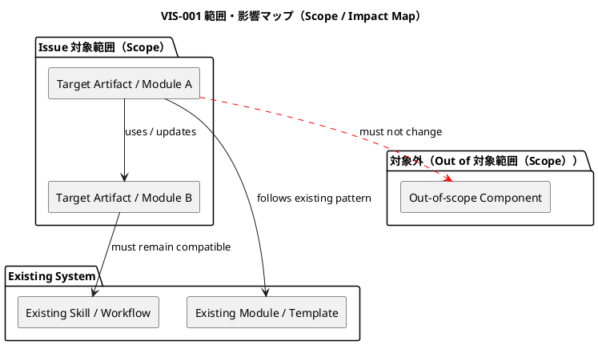
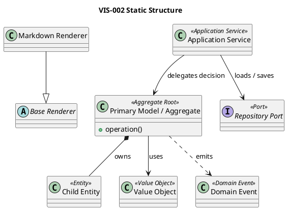
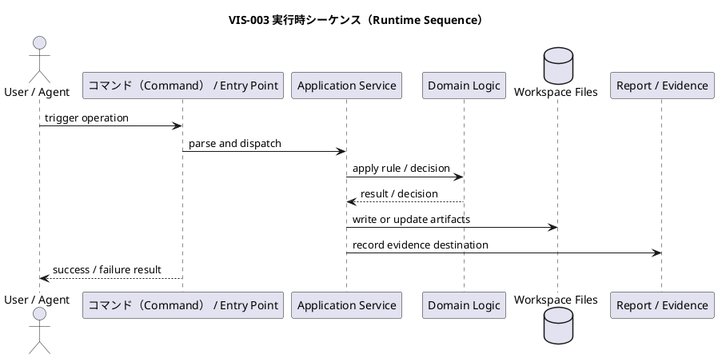
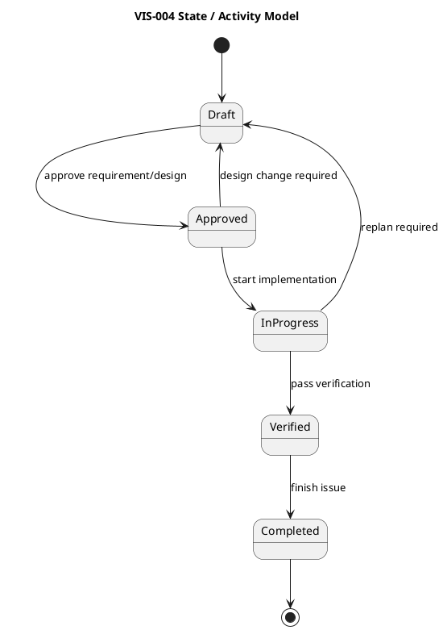

# iss-00354 Define ChatGPT Context and Attachment Contract — Issue 設計書（Standard）

この文書は、Issue要件を実装計画へ落とす前に、この Issue 固有の **設計差分、責任配置、境界、契約、失敗時の扱い、検証上の含意** を定義する。

この文書は実装手順書ではない。実装順序、TDDサイクル、具体的なテストケース一覧、変更ファイルの詳細な作業順は `plan.md` で扱う。

---

## 0. 文書の位置づけ

### この文書が定義すること

- この Issue 固有の設計差分
- 要件をどの責任・境界・契約で成立させるか
- 上位設計から継承する制約
- 変更しない既存設計
- 主要な振る舞いの意味論
- 主要な失敗・例外・互換性の扱い
- 実装計画で検証すべき設計保証
- TDDや実装中に判断してよい内部設計の自由度
- 人間が設計構造を理解するための任意のPlantUML図

### この文書が定義しないこと

- Red-Green-Refactorの具体的な順序
- 各TDDサイクルの期待結果（Expected） Red
- 具体的なテスト関数名
- ファイルごとの編集順序
- privateメソッド、ヘルパー、内部リファクタリングの詳細
- 実装後の最終的なクラス構造の完全固定

### 設計コミットメント

| タグ | 意味 | 変更条件 |
|---|---|---|
| `[N]` | 実装が必ず従う設計契約 | 設計書の更新が必要 |
| `[P]` | 現時点の有力な設計仮説 | 意味論を維持すればTDD中に変更可能 |
| `[I]` | 理解のための例示 | 実装を拘束しない |
| `[O]` | 未解決事項 | 指定された段階までに解決する |
| `[E]` | この Issue の判断範囲外 | 上位文書（Epic・Initiative・ADR）へ昇格する |

---

## 1. 等級 Standard（Standard Grade）確認

### 1.1 Standardとして扱う理由

- 理由:
  - ...
- 主な変更対象:
  - ...
- 主なリスク:
  - ...
- 想定される検証:
  - ...

### 1.2 Standardの前提

- [ ] 公開API、公開CLI contract、外部Event Schemaを変更しない
- [ ] 既存workspace layoutの破壊的変更を行わない
- [ ] migrationまたは永続データ変換を伴わない
- [ ] セキュリティ・プライバシー（security / privacy） / secret / credential の高リスク領域を扱わない
- [ ] 切り戻し（rollback）困難な変更を行わない
- [ ] 複数EpicまたはInitiativeにまたがる設計判断を含まない
- [ ] この Issue 固有の局所的な振る舞い・template・docs・内部実装差分である

### 1.3 引き上げガード（Escalation Guard）

`strict` へ引き上げる条件:

- [ ] 公開CLI挙動を変更する
- [ ] 公開API / Event / Schema / generated metadata を変更する
- [ ] ワークスペース scaffold結果の互換性に影響する
- [ ] テンプレート契約（template contract） を変更する
- [ ] sync / validate / active / lifecycle 挙動を変更する
- [ ] migrationまたは既存ファイル変換が必要になる
- [ ] 複数Issueが依存する設計判断を含む

`critical` へ引き上げる条件:

- [ ] セキュリティ・プライバシー（security / privacy） / secret / credential に関係する
- [ ] データ損失または破壊的変更のリスクがある
- [ ] GitHub上の状態変更を伴う
- [ ] 既存workspace layoutの移行を伴う
- [ ] rollback不能またはforward-only migrationになる

---

## 2. 設計意図

### 2.1 解決したい設計問題

- 問題:
  - ...
- 現状の制約:
  - ...
- 要件上必要な変化:
  - ...

### 2.2 採用する設計方針

- `[N]` ...
- `[N]` ...
- `[P]` ...

### 2.3 採用しない方針

| 方針 | 採用しない理由 | 備考 |
|---|---|---|
| ... | ... | ... |

---

## 3. 正本・根拠（Normative Sources）

| 種別 | パス・識別子（Path / ID） | 関連箇所 | このIssueへの意味 |
|---|---|---|---|
| 課題要件（Issue Requirement） | `requirement.md` | `AC-...` / `BH-...` / `CON-...` | ... |
| エピック設計（Epic Design） | ... | ... | ... |
| イニシアチブ設計（Initiative Design） | ... | ... | ... |
| ADR（意思決定記録） | ... | ... | ... |
| 現行文書（Current docs） | ... | ... | ... |
| 既存コードパターン（Existing code pattern） | ... | ... | ... |
| 既存テスト（Existing tests） | ... | ... | ... |
| 作業成果物・調査（Artifact / research） | ... | ... | ... |

正本の優先順位: ADR / architecture rule → Initiative design → Epic design → Issue requirement → Issue design → Issue plan → artifacts / draft。

---

## 4. 要件から設計への追跡（Requirement-to-Design Traceability）

| 要件識別子（Requirement ID） | 内容の要約 | 設計識別子（Design ID） | 設計上の扱い | 備考 |
|---|---|---|---|---|
| AC-001 | ... | DES-001 | ... | ... |
| AC-002 | ... | DES-002 | ... | ... |
| BH-001 | ... | DES-003 | ... | ... |
| CON-001 | ... | DES-004 | ... | ... |
| REQ-XXX | 必要に応じて要件・振る舞い・制約を連番で追加する。`XXX` は実IDへ置換するか削除する。 | DES-... | ... | ... |

---

## 5. 継承制約と変更禁止領域

### 5.1 上位から継承する制約

- `[N]` ...
- `[N]` ...

### 5.2 このIssueで変更しないもの

| 対象 | 変更しない理由 | 備考 |
|---|---|---|
| ... | ... | ... |

### 5.3 このIssueで判断してはいけないもの

| 判断 | 昇格先 | 理由 |
|---|---|---|
| ... | 上位文書（Epic・Initiative・ADR） | ... |

---

## 6. 現状（Current State）

### 6.1 現在の振る舞い

- 現在成立していること:
  - ...
- 現在成立していないこと:
  - ...
- 現在曖昧なこと:
  - ...

### 6.2 現在の構造

| 種別 | パス・対象（Path / Target） | 現在の責務 | 備考 |
|---|---|---|---|
| 文書（docs） | ... | ... | ... |
| テンプレート（template） | ... | ... | ... |
| script / CLI | ... | ... | ... |
| スキル（skill） | ... | ... | ... |
| metadata | ... | ... | ... |
| テスト（test） | ... | ... | ... |
| コード（code） | ... | ... | ... |

### 6.3 既存パターン

| パターン | 参照先 | 今回の適用方針 |
|---|---|---|
| ... | ... | ... |

---

## 7. 目標設計差分（Target Design Delta）

### 7.1 設計差分一覧（Design Delta）

| 設計識別子（Design ID） | 種別 | 現在（Current） | 目標（Target） | 固定度 |
|---|---|---|---|---|
| DES-001 | 振る舞い（behavior） | ... | ... | `[N]` |
| DES-002 | 責任（responsibility） | ... | ... | `[N]` |
| DES-003 | インターフェース（interface） | ... | ... | `[P]` |
| DES-004 | 文書・テンプレート（docs / template） | ... | ... | `[N]` |
| DES-005 | 検証（verification） | ... | ... | `[N]` |

### 7.2 目標の要約（Target）

- ...
- ...

### 7.3 非目標（Non-Target）

- ...
- ...

---

## 8. 視覚的な設計概要（Visual Design Overview）

PlantUML図は必須ではない。ただし、構造・依存・状態・メッセージ処理・分岐ロジックが人間レビューで誤解されやすい場合は図示する。

### 8.1 図表一覧（Diagram Index）

| 図識別子（Diagram ID） | 種類 | 固定度 | 目的 | 関連設計識別子（Design ID） | 状態 |
|---|---|---|---|---|---|
| VIS-001 | component / package | `[P]` | 変更対象と依存関係を示す | `DES-...` | draft |
| VIS-002 | class | `[P]` | 主要な構造関係を示す | `DES-...` | draft |
| VIS-003 | sequence | `[P]` | 実行時の協調を示す | `DES-...` | draft |
| VIS-004 | state / activity | `[P]` | 状態遷移または分岐を示す | `DES-...` | draft |

### 8.2 VIS-001: 範囲・影響マップ（Scope / Impact Map）

### 8.3 VIS-002: 静的構造・クラス図（Static Structure / Class Diagram）

継承・実装関係を表す場合は、親クラス・抽象クラス・インターフェースを上側、子クラス・実装クラスを下側に置く。PlantUMLでは原則 `Child --|> Parent` または `Implementation ..|> Interface` の形で記述し、見た目として矢印が下から上へ向くようにする。

### 8.4 VIS-003: 実行時シーケンス図（Runtime Sequence Diagram）

### 8.5 VIS-004: 状態・アクティビティ図（State / Activity Diagram）

---

## 9. 振る舞い設計（Behavioral Design）

### 振る舞い設計 DES-BEH-001:

- 固定度:
  - `[N]`
- 関連Requirement:
  - `AC-...`
  - `BH-...`
- 関連Diagram:
  - `VIS-...`
- 開始条件（Trigger）:
  - ...
- Actor / Caller:
  - ...
- Inputs and meaning:
  - ...
- Preconditions:
  - ...
- Decision rules:
  - ...
- Postconditions:
  - ...
- Observable result:
  - ...
- Failures:
  - ...
- Must not happen:
  - ...

---

## 10. 責任モデル（Responsibility Model）

| 構成要素・作業成果物（Building Block / Artifact） | 責任 | 禁止事項（Must Not Do） | 関連設計識別子（Design ID） | 関連図（Diagram） |
|---|---|---|---|---|
| ... | ... | ... | `DES-...` | `VIS-...` |
| ... | ... | ... | `DES-...` | `VIS-...` |

### 10.1 判断の所有者

| 判断 | 所有者 | 理由 |
|---|---|---|
| ... | ... | ... |

### 10.2 境界

| 境界 | 内側 | 外側 | このIssueでの扱い |
|---|---|---|---|
| ... | ... | ... | ... |

---

## 11. インターフェース・契約差分（Interface / Contract Delta）

Standard gradeでは、原則として公開contractの破壊的変更を扱わない。公開contract変更が判明した場合は `strict` 以上へ引き上げる。

### 11.1 契約影響要約（Contract 影響（Impact） Summary）

| Contract種別 | 影響 | 備考 |
|---|---|---|
| 公開CLI契約（Public CLI contract） | none / local / unknown | ... |
| 公開API契約（Public API contract） | none / local / unknown | ... |
| イベント・メッセージ契約（Event / message contract） | none / local / unknown | ... |
| テンプレート契約（Template contract） | none / local / unknown | ... |
| メタデータ・生成インデックス（Metadata / generated index） | none / local / unknown | ... |
| 内部interface（Internal interface） | なし / 変更あり / 不明（なし / 変更あり / 不明（none / changed / unknown）） | ... |
| 文書・workflow契約（Docs / workflow contract） | なし / 変更あり / 不明（なし / 変更あり / 不明（none / changed / unknown）） | ... |

### 11.2 局所インターフェース差分（Local Interface Delta）

| 設計識別子（Design ID） | 対象 | 変更内容 | 互換性 | 固定度 | 関連Diagram |
|---|---|---|---|---|---|
| DES-INT-001 | ... | ... | 互換 / N/A（compatible / N/A） / unknown | `[N]` | `VIS-...` |
| DES-INT-002 | ... | ... | 互換 / N/A（compatible / N/A） / unknown | `[P]` | `VIS-...` |

---

## 12. データ・状態・メタデータ差分（Data / State / Metadata Delta）

Standard gradeでは、原則としてmigrationや破壊的な既存データ変換を扱わない。

### 12.1 状態差分要約（State Delta Summary）

| 対象 | 現在（Current） | 目標（Target） | 互換性 | 関連図（Diagram） |
|---|---|---|---|---|
| ... | ... | ... | ... | `VIS-...` |

### 12.2 生成物・管理対象作業成果物（Generated / Managed Artifacts）への影響

| 作業成果物（Artifact） | 影響 | 備考 |
|---|---|---|
| `.meta.json` | なし / 変更あり / 不明（なし / 変更あり / 不明（none / changed / unknown）） | ... |
| `.assurance.json` | なし / 変更あり / 不明（なし / 変更あり / 不明（none / changed / unknown）） | ... |
| `.agent/index*.json` | なし / 変更あり / 不明（なし / 変更あり / 不明（none / changed / unknown）） | ... |
| `.agent/tree*.json` | なし / 変更あり / 不明（なし / 変更あり / 不明（none / changed / unknown）） | ... |
| テンプレート（templates） | なし / 変更あり / 不明（なし / 変更あり / 不明（none / changed / unknown）） | ... |
| 文書（docs） | なし / 変更あり / 不明（なし / 変更あり / 不明（none / changed / unknown）） | ... |

---

## 13. 失敗・境界・互換性設計（Failure / Edge / Compatibility Design）

### 13.1 失敗時の意味論（Failure Semantics）

| Failure 識別子（ID） | 条件 | 期待される扱い | 状態変更 | 観測点 | 関連Diagram |
|---|---|---|---|---|---|
| FAIL-001 | ... | ... | なし / 部分的 / rollback / N/A（none / partial / rollback / N/A） | ... | `VIS-...` |

### 13.2 互換性メモ（Compatibility Notes）

- 既存利用者への影響:
  - ...
- 既存workspaceへの影響:
  - ...
- 既存テンプレート利用者への影響:
  - ...
- rollback方法:
  - ...

---

## 14. セキュリティ・プライバシー確認（Security / Privacy Check）

| 項目 | 影響 | 備考 |
|---|---|---|
| 認証 | なし / 不明（none / unknown） | ... |
| 認可 | なし / 不明（none / unknown） | ... |
| 機密情報（secret / token / credential） | なし / 不明（none / unknown） | ... |
| 個人情報 / 機微情報 | なし / 不明（none / unknown） | ... |
| ログ出力 | なし / 不明（none / unknown） | ... |
| 外部API権限（GitHub API） | なし / 不明（none / unknown） | ... |

影響がある、または不明な場合は `critical` への引き上げを検討する。

---

## 15. 観測性・証跡設計（Observability / Evidence Design）

| 証跡ID（Evidence ID） | 観測対象 | 証拠の種類 | 関連設計識別子（Design ID） | 関連Diagram |
|---|---|---|---|---|
| EVD-001 | ... | test / CLI output / file diff / docs diff / 手動（manual） review | `DES-...` | `VIS-...` |
| EVD-002 | ... | test / CLI output / file diff / docs diff / 手動（manual） review | `DES-...` | `VIS-...` |

Reportに残すべき証拠:

- ...
- ...

---

## 16. 文書・テンプレート・スキル影響（Docs / Template / Skill 影響（Impact））

| パス（Path） | 更新理由 | 必須 |
|---|---|---|
| ... | ... | はい / いいえ（yes / no） |

提供側・利用側反映（Provider / Consumer）:

| 対象 | 影響 | 対応 |
|---|---|---|
| `src/spec_dock/assets/...` | はい / いいえ / 不明（yes / no / unknown） | ... |
| ワークスペース（root `spec-dock/...`） | はい / いいえ / 不明（yes / no / unknown） | ... |

---

## 17. 検討した代替案（Alternatives Considered）

| Alternative 識別子（ID） | 代替案 | 利点 | 欠点 | 採否 |
|---|---|---|---|---|
| ALT-001 | ... | ... | ... | adopted / rejected |

---

## 18. 実装へ委譲する設計仮説（Design Hypotheses Left to Implementation）

| Hypothesis 識別子（ID） | 内容 | 制約 | 判断タイミング |
|---|---|---|---|
| HYP-001 | ... | ... | during implementation / during refactor |

実装中に変更してはいけないもの:

- `[N]` ...
- `[N]` ...

---

## 19. 検証への含意（検証（Verification） Implications）

| 設計識別子（Design ID） | 検証すべき内容 | 推奨検証レベル（Verification Level） | 報告証跡（Report Evidence） | 関連図（Diagram） |
|---|---|---|---|---|
| DES-001 | ... | unit / integration / CLI / docs / テンプレート / 手動 | `EVD-...` | `VIS-...` |
| DES-002 | ... | unit / integration / CLI / docs / テンプレート / 手動 | `EVD-...` | `VIS-...` |

検証レベル（Verification Level）:

- `unit`: 小さな純粋ロジックまたは関数単位
- `integration`: 複数コンポーネントの連携
- `CLI`: CLIコマンド実行
- `docs`: 文書整合性
- `template`: scaffold / template生成確認
- `contract`: 契約互換性確認
- `手動（manual）`: 人間による確認
- `none`: 変更性質上不要。ただし理由を記述する

---

## 20. 計画への引き渡し（Plan Handoff）

### 20.1 固定設計契約（Fixed Design Contracts）

`plan.md` と実装が必ず守る設計契約。

- `DES-...`
- `DES-...`

### 20.2 振る舞いバックログ種（Behavior Backlog Seeds）

| 種識別子（Seed ID） | 振る舞い / 成果 | 関連設計識別子（Design ID） | 関連Requirement | 関連Diagram |
|---|---|---|---|---|
| B-SEED-001 | ... | `DES-...` | `AC-...` | `VIS-...` |
| B-SEED-002 | ... | `DES-...` | `AC-...` | `VIS-...` |

### 20.3 推奨検証ゲート（推奨検証（Suggested 検証（Verification）） Gates）

- ...
- ...

### 20.4 停止・再計画条件（Stop / Replan Triggers）

- [ ] Redの理由が設計上の想定と異なる
- [ ] 要件の期待値を変更したくなる
- [ ] 公開contract変更が必要になる
- [ ] 移行（migration）が必要になる
- [ ] セキュリティ・プライバシー（security / privacy）影響が見つかる
- [ ] 上位Epic / Initiativeの設計を変更する必要がある
- [ ] rollbackが難しい変更になった
- [ ] 複数Issueへ影響する設計判断が必要になった
- [ ] Standard gradeの前提を満たさなくなった

---

## 21. 未確定事項（Open Questions）

### 未解決事項 OQ-001:

- 質問:
  - ...
- 影響:
  - requirement / design / plan / implementation / test / release
- 解決期限:
  - before plan / before implementation / can defer
- 推奨:
  - ...
- 解決状態:
  - open / resolved / escalated

---

## 22. 図表レビューチェックリスト（Diagram Review Checklist）

- [ ] 各図にDiagram IDがある
- [ ] 各図に固定度 `[N] / [P] / [I]` が明示されている
- [ ] 各図が設計識別子（Design ID）と対応している
- [ ] 図だけにしか存在しない設計契約がない
- [ ] 図で表現した制約が本文または表にも記載されている
- [ ] 図が実装詳細を過剰に固定していない
- [ ] UMLが不要なIssueでは、図を省略した理由が明確である

---

## 23. 設計承認チェックリスト（Design Approval Checklist）

- [ ] すべての関連ACが設計識別子（Design ID）へ対応している
- [ ] すべての関連BHが振る舞い設計（Behavioral Design）へ反映されている
- [ ] 関連するCONが設計制約として扱われている
- [ ] `standard` gradeに留まる理由が明記されている
- [ ] `strict` / `critical` escalation triggerを確認した
- [ ] public contract変更がない、またはescalation済み
- [ ] migrationがない、またはescalation済み
- [ ] セキュリティ・プライバシー（security / privacy） sensitiveな影響がない、またはescalation済み
- [ ] 設計意図が明確である
- [ ] Current Stateと目標設計差分（Target Design Delta）が区別されている
- [ ] 責任所有者が曖昧でない
- [ ] 実装詳細を過剰に固定していない
- [ ] TDDへ委ねる内部設計が明示されている
- [ ] 固定設計契約（Fixed Design Contracts）が列挙されている
- [ ] 振る舞いバックログ種（Behavior Backlog Seeds）がある
- [ ] 検証への含意（検証（Verification） Implications）がある

---

## 24. 変更履歴

| 日付（Date） | 変更（Change） | 理由（Reason） | 作成者（Author） |
|---|---|---|---|
| 2026-08-03 | 初稿（Initial draft） | ... | ... |
