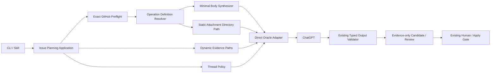
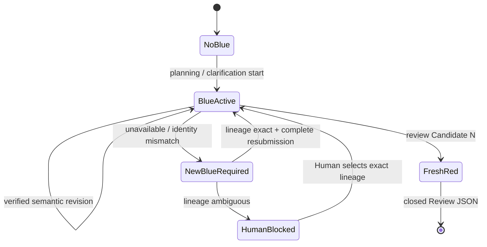
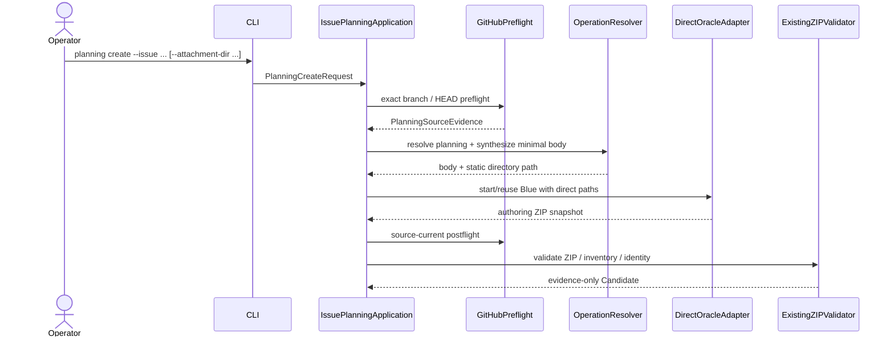

# iss-00354 ChatGPT Context and Attachment Contract 設計書

> **Candidate / evidence-only**  
> 本設計は `CAND-ISS-00354-20260803T172642Z` の Blue Team 案であり、canonical design、review PASS、実装承認ではない。

## 1. 設計の目的

既存 Issue Planning runtime の強い output / authority boundary を維持したまま、ChatGPT input を次へ変更する。

- 長い合成 prompt + generated prompt pack
- から
- minimal body + direct attachment paths

入力 directory は SpecDock が materialize しない。詳細 instruction は provider-owned attachment directory へ
置き、directory path を direct Oracle に渡す。Candidate / Review / Revision の dynamic evidence は original
path のまま追加する。

同時に、Blue authoring thread の継続と Candidate ごとの fresh Red thread を provider-owned direct Oracle
adapter 内で表現する。ただし exact Oracle capability を実装前に確認し、unsupported interface を推測しない。

## 2. 設計原則

1. **Input と output の safety boundary を分離する。**  
   Option C は input attachment directory に適用する。output ZIP / JSON、Candidate identity、Human binding の
   検証は維持する。
2. **Directory を data として扱わない。**  
   application は directory 内 entry を読まず、path を transport へ渡すだけとする。
3. **Provider-owned resources を正本とする。**  
   `src/spec_dock/assets/...` を編集し、installed / dogfood projection を同期する。
4. **No fallback.**  
   default branch、personal wrapper、API、alternate backend、automatic conversion を用いない。
5. **Blue と Red を分離する。**  
   Blue continuity は authoring convenience、Red fresh は review independence であり、一つの session policy に
   統合しない。
6. **Existing lifecycle を増分変更する。**  
   `planning create` / `review planning` / `planning revise` / `planning apply` と output parser を作り直さない。
7. **Capability gap は停止条件である。**  
   unsupported Oracle behavior を temporary wrapper で埋めない。

## 3. 現行アーキテクチャ

| Layer / file | 現行責務 | Issue #354 での扱い |
|---|---|---|
| `application/issue_planning_prompt.py` | source file safe-read、content scan、role resource連結、attachment index / SHA | input materialization を除去し minimal body / path contract へ置換 |
| `application/issue_planning.py` | preflight、context manifest、planning / review / revision orchestration、postflight | lifecycle 維持。old input checks / manifest matching を削除 |
| `domain/issue_planning_contracts.py` | typed identity、Candidate / Review / Human contracts | identity / output contracts 維持。operation input / thread policy を追加または分離 |
| `infra/issue_planning_chatgpt.py` | direct Oracle、managed Chrome、temporary prompt pack、session recovery、typed output | direct Oracle / output取得維持。temporary input pack を direct path argv へ置換 |
| `commands/issue_planning.py` | CLI parse、`--context-manifest` | directory-oriented attachment option へ hard cutover |
| operation resources | planner / reviewer / revision / transport text | minimal prompt template と per-operation attachments へ再配置 |
| tests | old input safetyと成熟した lifecycle/outputを混在固定 | old input contract testsを置換し、output/lifecycle regressionsを保持 |
| docs / skills | context manifest、reference-only attachments、input manifest safety | Option A/Cへ更新。output evidence laneは維持 |

現行 provider / dogfood runtime file は同一 SHA で投影されている。変更は両面の parity を壊さない。

## 4. Target architecture



`Operation Definition Resolver` は operation 名から既知の prompt template path、attachment directory path、
output expectation、thread lane を選ぶ。attachment directory の内容は解決しない。

## 5. Provider resource layout

### 5.1 Issue Planning

provider 正本を次の self-contained operation directory へ整理する。

```text
src/spec_dock/assets/install_root/.agents/skills/spec-dock-issue-planning/
└── resources/
    └── operations/
        ├── planning/
        │   ├── prompt.md
        │   └── attachments/
        │       ├── authoring-instructions.md
        │       ├── authority-boundary.md
        │       └── output-contract.md
        ├── review/
        │   ├── prompt.md
        │   └── attachments/
        │       ├── defect-review-instructions.md
        │       ├── authority-boundary.md
        │       └── output-contract.md
        └── revision/
            ├── prompt.md
            └── attachments/
                ├── semantic-revision-instructions.md
                ├── authority-boundary.md
                └── output-contract.md
```

設計上重要なのは file 名の固定 inventory ではなく、次の二つだけである。

- `prompt.md` は application が読む既知の minimal body template。
- `attachments/` は direct Oracle へ path を渡す opaque directory。

`attachments/` 配下 file の追加・削除・階層変更を application registry へ列挙しない。共通 material の共有を
symlink に依存させず、各 operation directory を transport 単位として self-contained にする。

### 5.2 Clarification convention

clarification は source HEAD 時点で skill-owned workflow であり、Issue Planning public runtime command ではない。
再利用する場合の provider convention は次とする。

```text
src/spec_dock/assets/install_root/.agents/skills/spec-dock-clarification/
└── resources/
    └── chatgpt-operation/
        ├── prompt.md
        └── attachments/
            ├── clarification-loop.md
            └── handoff-contract.md
```

Issue #354 では resource convention と docs / skill guidance までを定義する。direct Oracle runtime wiring を
追加する場合は clarification owning scope の後続 Issue で行う。

### 5.3 Projection

provider tree は次へ投影する。

- `.agents/skills/spec-dock-issue-planning/resources/operations/...`
- `.agents/skills/spec-dock-clarification/resources/chatgpt-operation/...`
- installed target の同一 path。

projection test は tree inventory を「許可 file の固定一覧」として制限せず、provider と projection の
recursive byte parity を比較する。

## 6. Operation definition

application 内部の operation registry は file content ではなく root path と policy を保持する。

```python
@dataclass(frozen=True)
class ChatGptOperationDefinition:
    operation: Literal["planning", "review", "revision", "clarification"]
    prompt_template_path: Path
    attachment_directory_path: Path
    output_kind: Literal["authoring_zip", "review_json", "advisory_text"]
    thread_lane: Literal["blue", "fresh_red"]
```

`clarification` は reusable definition として表現できるが、公開 command へ登録されるまでは invocation registry
へ露出しない。未登録 operation を generic fallback で送信しない。

known root の選択と `prompt.md` の読取りは product configuration であり、Option C の entry inspection ではない。
`attachment_directory_path` に対し `rglob`、`iterdir`、`walk`、`stat`、`resolve`、`read_*` を実行しない。

## 7. Synthesized input contract

現行 `SynthesizedPlanningPrompt` を byte materialized attachment から path reference へ変更する。

```python
@dataclass(frozen=True)
class SynthesizedChatGptOperation:
    operation: Literal["planning", "review", "revision"]
    prompt: str
    attachment_paths: tuple[Path, ...]
    output_expectation: PlanningOutputExpectation
    thread_request: ThreadRequest
```

廃止対象:

- `PlanningPromptAttachment.content`
- `classification`
- `source_label`
- per-attachment `sha256`
- `attachments: tuple[tuple[str, str], ...]`
- exact attachment index の本文生成
- `_safe_source_file`
- descriptor-relative input file read
- input content scan / hard byte count
- `_attachments_match_source_manifest`
- `_exact_attachments_have_sensitive_content`

維持対象:

- typed repository / branch / HEAD / Issue identity。
- output expectation。
- exact GitHub hard-failure instruction。
- source preflight / postflight。
- output artifact validation。

## 8. Minimal body contract

### 8.1 共通 field

本文は human-readable Markdown とし、次の field だけを operation template へ埋め込む。

```text
operation
objective
repository
branch
source_head
initiative_id
epic_id
issue_id
authority
mutation_prohibition
expected_output
github_exact_access_failure
attachments_instruction
```

本文へ static attachment inventory、entry name、entry hash、size、content summary を入れない。

### 8.2 Planning

Planning 本文は「既存 Issue の requirement / design / plan と exactly-one onboarding companion を
authoring ZIP で作成する」という目的までを含む。具体的な completeness 観点、標準構造、出力 path は attached
Markdown が所有する。

### 8.3 Review

Review 本文は fresh read-only defect-only operation、review target identity、expected closed JSON を含む。
Candidate ZIP 自体は dynamic path として添付する。Candidate SHA / reviewed identity digest は formal evidence
identity であり、directory manifest ではない。

### 8.4 Revision

Revision 本文は selected P0 / P1 finding ID、prior Candidate identity、Review result identity、preserve
assumption identifiers を含められる。finding の全文と revision 手順は attached Review JSON と static revision
instruction が所有する。

### 8.5 Clarification

Clarification 本文は現在の一問、scope identity、mode、期待する advisory answer を含む。source list、
interview semantics、handoff template は attached Markdown が所有する。

## 9. Attachment path assembly

operation ごとの path list は entry を materialize せず、次の順で組み立てる。

1. provider-owned static `attachments/` directory。
2. operation が必須とする original dynamic evidence paths。
3. optional operator-supplied attachment directory paths。

| Operation | Static path | Dynamic paths |
|---|---|---|
| planning | `.../operations/planning/attachments/` | optional external attachment directories |
| review | `.../operations/review/attachments/` | Candidate ZIP、必要時の reviewed identity evidence |
| revision | `.../operations/revision/attachments/` | prior Candidate ZIP、exact Review JSON、revision request |
| clarification | `.../chatgpt-operation/attachments/` | current interview / research artifacts as supplied by owner |

application は top-level path の semantic order だけを決める。directory 配下 order は再構成しない。

### 9.1 禁止される実装

```python
# 禁止例
for entry in attachment_dir.rglob("*"):
    if entry.is_file() and entry.suffix in ALLOWED:
        copy_and_hash(entry)
```

```python
# 目標
argv.extend(["--file", os.fspath(attachment_dir)])
```

複数 path が必要な場合の exact argv は direct Oracle capability characterization で確定する。repeatable
`--file` が supported なら各 path をそのまま追加する。unsupported の場合、temporary pack、symlink farm、
automatic archive で代替せず STOP / REPLAN とする。

## 10. Oracle adapter boundary

### 10.1 維持する処理

- PATH から executable を解決し、identity を再検証する。
- supported Oracle version / capability を preflight する。
- loopback managed Chrome endpoint を検証する。
- sanitized child environment を使う。
- `shell=False`、direct argv、single submission を使う。
- same invocation の timeout / harvest recovery を維持する。
- terminal session artifact から typed ZIP / JSON を snapshot する。
- private transcript / session path を public result へ露出しない。

### 10.2 削除する処理

- `TemporaryDirectory` 配下の `prompt-pack/` 生成。
- `_write_transport_pack`。
- `context-NNN.md` への text conversion。
- input manifest / provenance / source-manifest / stale-if file 生成。
- exact attachment copy / re-read / SHA verification。
- input pack marker file。

temporary `staging` は Oracle output artifact の private snapshot に必要な範囲で残せる。input directory を
再構成する用途へ使わない。

### 10.3 Failure normalization

entry-specific error vocabulary を追加しない。attachment submission failure は existing transport boundary で
content-free に正規化する。既存の `oracle_unavailable`、`oracle_capability_unsupported`、
`oracle_session_recovery_required`、`oracle_artifact_*` などを再利用し、filename や content を public details へ
含めない。

## 11. Thread continuity design

### 11.1 Thread policy



Red thread は state store へ reusable binding として登録しない。

### 11.2 Adapter-private binding

```python
@dataclass(frozen=True)
class BlueThreadBinding:
    schema_version: int
    repository: str
    branch: str
    source_head: str
    issue_id: str
    candidate_identity_sha256: str | None
    provider_thread_handle: str
    supersedes_binding_digest: str | None
```

保存先は repository と Candidate の外側にある provider-owned private operational state とする。候補は
Oracle home 配下の SpecDock namespace だが、既存 Oracle retention / permissions と衝突しないことを S01 で
確認してから確定する。

禁止事項:

- Candidate ZIP / Review JSON / canonical docs への handle 埋込み。
- public command result / log / report への raw handle 出力。
- raw transcript の新規永続化。
- source HEAD または Candidate lineage が変わった binding の黙示 reuse。

### 11.3 Reuse 判定

Blue binding reuse は次がすべて一致する場合だけ許す。

- repository
- branch
- source HEAD
- Issue ID
- operation lane = Blue
- revision の場合、prior Candidate identity が binding lineage と一意に接続する
- direct Oracle が binding の継続可能性を確認できる

static attachment directory の hash / inventory は判定に使わない。resource tree の更新は current complete input を
次 turn に添付することで反映する。

### 11.4 Recovery

- handle が missing / expired / invalid: new Blue。
- repository / branch / HEAD mismatch: old binding を invalidate し new Blue。
- Candidate lineage exact: automatic new Blue + complete current inputs。
- Candidate lineage ambiguous: `continuity_confirmation_required` 相当の content-free blocked result。
- new Blue は old handle を本文へ書かず、internal supersession digest だけを持てる。

exact public reason 名は existing status vocabulary と CLI compatibility を確認して決める。新 reason が必要な場合も
session ID や filename を details へ含めない。

### 11.5 Oracle continuation port

application は exact CLI flag を知らない。

```python
class ChatGptThreadPort(Protocol):
    def start(self, request: OracleInvocationRequest) -> OracleInvocationResult: ...
    def continue_verified(
        self,
        binding: BlueThreadBinding,
        request: OracleInvocationRequest,
    ) -> OracleInvocationResult: ...
```

infra adapter は supported direct Oracle interface のみを実装する。Oracle に continuation interface がなければ、
port を fake で埋めず S01 stop condition を発火する。

## 12. Application flow

### 12.1 Planning create



### 12.2 Review

- Candidate を existing validator で読み、identity を固定する。
- fresh Red request を必ず作る。
- static review directory + original Candidate path を direct attachment とする。
- Red output を strict `PlanningReviewResult` として検証する。
- Blue binding を変更しない。

### 12.3 Semantic revision

- exact Candidate、Review result、revision request を既存 validator で検証する。
- P0 / P1 selected findings だけを semantic revision trigger とする。
- Blue binding を照合する。
- static revision directory + original evidence paths を direct attachment とする。
- revised ZIP を既存 authoring validator へ渡す。
- Candidate publication 後、Blue binding の candidate lineage を新 identity へ更新する。
- mechanical revision は ChatGPT operation ではないため変更しない。

## 13. Output contract

Issue #354 は input simplification を理由に output validation を緩めない。

### 13.1 Authoring ZIP

維持する条件:

- expected logical filename。
- expected internal root。
- `requirement.md`、`design.md`、`plan.md`。
- runtime-selected exactly-one onboarding companion。
- path traversal / unsupported ZIP feature / malformed archive の rejection。
- Candidate material / source baseline / SHA / byte count。
- no canonical mutation before Human-approved apply。

content-level では、13固定 H2 / 4固定 PlantUML のような過剰な prompt hardcode を削除し、semantic completeness、
subordinate onboarding status、少なくとも一つの有効 diagram など必要最小限を validator / review で確認する。

### 13.2 Review JSON

維持する top-level key:

```json
{
  "reviewed_identity": {},
  "reviewed_identity_sha256": "<sha256>",
  "verdict": "pass|fail",
  "findings": []
}
```

duplicate key、NaN、unknown key、identity mismatch、invalid severity を reject する。

### 13.3 Clarification

clarification の output は existing skill handoff に従う advisory text / artifact であり、Issue #354 は global
closed schema を強制しない。

## 14. CLI migration

### 14.1 Before

```text
planning create --issue <id> --output <dir> --context-manifest <json>
```

JSON は `relevant_source_paths` と `operator_context` を持ち、Runtime が個別 file を読み、検査、text attachment へ
変換する。

### 14.2 After

推奨形:

```text
planning create --issue <id> --output <dir> [--attachment-dir <path>]...
```

- no JSON parsing。
- no individual path extraction。
- no content read。
- no directory tree validation。
- provider static directory は常に operation definition から追加。
- operator path は指定文字列を transport path として保持する。

`argparse` の path conversion や relative path resolution が Oracle cwd semantics を変えないよう、string / Path の
exact handoff を focused test で固定する。missing path を preflight で独自分類せず Oracle failure へ委ねる。

旧 flag は deprecation translation せず hard cutover する。help / skill / docs / CLI tests を同時更新する。

## 15. Source freshness と attachment identity

existing GitHub preflight の `PlanningSourceEvidence` と postflight は維持する。これは repository source state の
証拠であり、input attachment manifest ではない。

- local / remote HEAD parity。
- named branch / upstream。
- canonical Issue source path の source snapshot。
- post-invocation staleness check。

`source-manifest.json` を attachment として生成する処理は削除する。内部 `source_manifest_hash` が publication race
検出に必要なら result object 内で保持できるが、operation attachment directory の contents を hash してはならない。

## 16. Security / privacy boundary

Option C は「input directory を安全と判定する scanner を持たない」という product decision である。これは
添付内容が安全であることを SpecDock が保証するという意味ではない。

- operation pack maintainer / operator が material を選ぶ。
- Runtime は secrets / path / special entry を検査しない。
- direct Oracle / ChatGPT が受理または失敗する。
- failure diagnostics は content-free。
- child environment sanitization、managed Chrome boundary、executable identity、output artifact isolation は維持。
- session / conversation identifier、private URL、raw transcript を Candidate / Review / public result に残さない。
- output ZIP を展開 / adopt する側の safety validator は維持。

## 17. Provider / dogfood implementation mapping

| Provider source | Dogfood / installed target |
|---|---|
| `src/spec_dock/assets/spec_dock/scripts/spec_dock_runtime/application/issue_planning_prompt.py` | `spec-dock/scripts/spec_dock_runtime/application/issue_planning_prompt.py` |
| `src/.../application/issue_planning.py` | `spec-dock/scripts/.../application/issue_planning.py` |
| `src/.../domain/issue_planning_contracts.py` | `spec-dock/scripts/.../domain/issue_planning_contracts.py` |
| `src/.../infra/issue_planning_chatgpt.py` | `spec-dock/scripts/.../infra/issue_planning_chatgpt.py` |
| `src/.../commands/issue_planning.py` | `spec-dock/scripts/.../commands/issue_planning.py` |
| `src/spec_dock/assets/install_root/.agents/skills/...` | `.agents/skills/...` |
| `src/spec_dock/assets/spec_dock/docs/...` | `spec-dock/docs/...` |

provider を先に変更し、project の既存 projection mechanism で dogfood を再生成する。二重手編集をしない。

## 18. Test architecture

### 18.1 新しい positive tests

- minimal body に identity / authority / output があり、attached instruction body がない。
- operation resource file を増減しても application object / test inventory を変えない。
- static directory、nested / hidden / symlink / FIFO を含む fixture で adapter が tree を一度も走査しない。
- original Candidate / Review path が direct Oracle argv へそのまま渡る。
- planning / review / revision の expected top-level attachment path order。
- verified Blue continuation、new Blue recovery、fresh Red。
- installed runtime が new resource root を解決する。
- provider / projection recursive byte parity。

### 18.2 削除または置換する tests

- relevant source file safe-read / descriptor race。
- attachment secret / private path scan。
- attachment size / count limits。
- attachment SHA index。
- generated `context-NNN.md` / manifest / source-manifest。
- exact 13 heading / 4 PlantUML prompt text。
- prompt character budget based on old concatenated contract。
- `--context-manifest` parse / help。

### 18.3 維持する regression tests

- exact GitHub branch / HEAD / no default fallback。
- managed Chrome / Oracle capability / environment。
- direct argv / no shell / no personal wrapper。
- session artifact / harvest recovery。
- authoring ZIP / Review JSON strict parser。
- Candidate / Review / Human / apply identity。
- source stale / publication race。
- output directory safety / transaction。
- public result no transcript / no private path。
- end-to-end create / review / revise / apply。
- provider / dogfood projection。

## 19. 親 docs の整合更新

親 Epic の Requirement / Design に残る次を更新する。

- 「詳細 instruction は prompt body が正本」。
- 「attachments は reference-only / data-only で instruction を含まない」。
- attachment manifest / exact SHA index を formal input contract とする記述。
- phase ごとに常に fresh session を作る記述。

更新後も維持するもの:

- ChatGPT is non-authoritative。
- fresh formal Review。
- exact GitHub branch / HEAD。
- direct Oracle。
- Candidate / Review / Human / apply。
- output ZIP / closed JSON。

Issue-local decisionを親 scope の別目的へ広げず、矛盾している contract wording のみを反映する。

## 20. Alternatives

### A. 現行 prompt pack を維持し scanner だけ無効化

不採用。directory の file 増減に応じて `context-NNN.md` / manifest を生成する責務が残り、Option C の
「そのまま渡す」を満たさない。

### B. Directory を ZIP 化して一つ添付

不採用。automatic conversion であり、entry semantics と transport failure を SpecDock が変更する。

### C. Symlink を解決し regular file だけ添付

不採用。input の内容を変更し、operator が置いた directory と ChatGPT input が一致しない。

### D. Personal wrapper の follow-up を runtime から呼ぶ

不採用。product dependency / evidence boundary に違反する。

### E. 全 operation 共通の versioned attachment schema

不採用。ユーザーが求める operation-specific flexibility と file 増減による保守性を損なう。

### F. Input と output の全 validator を削除

不採用。Option C は input directory だけの決定であり、output evidence / Human authority を緩める根拠ではない。

## 21. 設計停止条件

- Oracle directory attachment contract を primary capability test で確認できない。
- dynamic file と static directory を同一 invocation へ direct に渡せない。
- direct Oracle continuation を確認できない。
- path を direct に渡す前に Runtime が tree materialization を必要とする。
- Candidate / Review output validator の regression が必要になる。
- clarification public surface を owning scope なしで追加する必要が生じる。

停止条件に該当した場合、Issue #354 の実装を partial success として押し切らず、capability evidence と再設計点を
Issue report へ記録する。
