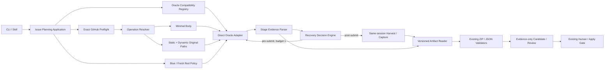
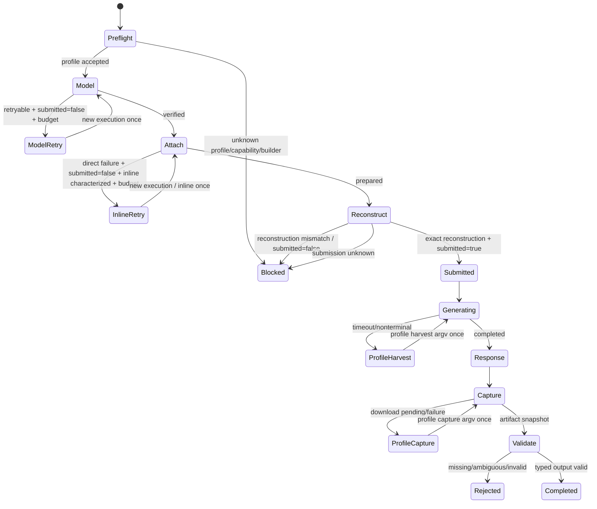

# iss-00354 ChatGPT Context and Attachment Contract 設計書

> **Candidate / evidence-only / unreviewed**  
> 本設計は `CAND-ISS-00354-ORACLE017-V2-20260804T043533Z` の増分案であり、canonical design、review PASS、実装承認ではない。

## 1. 設計目的

source HEAD `d0659cfa83bf97a05ceab01f4d9ce76162a2baa1` の既存設計は、long synthesized prompt + generated prompt packを
minimal body + direct attachment pathsへ移行し、Blue continuity / fresh Redとtyped output validationを維持する。
本改訂はそのtarget architectureを変えず、Oracle `0.17.0` のversion/config/browser behaviorを次の四境界へ局所化する。

1. exact version と capabilityを束ねる compatibility profile。
2. model / attachment / reconstruction / submission / response / download / snapshot のstage evidence。
3. pre-submit new execution と post-submit same-session recoveryを分けるbounded decision engine。
4. Oracle `0.17.0` session artifact schemaを扱うversioned decoder。

Target identity:

| Field | Value |
|---|---|
| Repository | `chemitaro/spec-dock` |
| Branch | `codex/iss-00354-chatgpt-context-contract` |
| Source HEAD | `d0659cfa83bf97a05ceab01f4d9ce76162a2baa1` |
| Verification | branch and requested HEAD identical; default fallback not used |

本manual Candidateのexpanded inventory（ADR / artifactsを含む）はdelivery evidenceであり、production authoring ZIPのexact inventoryを
変更する設計ではない。

## 2. 設計原則

1. **既存 lifecycle を増分変更する。** Issue #334のcreate/review/revise/applyと#354 S01–S08を作り直さない。
2. **Option A / Cを維持する。** bodyとattachmentsを分離し、directory entryをmaterializeしない。
3. **Versionをcapabilityの代理にしない。** exact version、help surface、runtime evidence、artifact schemaをprofileとして検証する。
4. **Config isolationをしない。** Oracle-native user/project configを尊重し、formal必須値はexplicit argvにする。
5. **Logical modelとUI labelを分ける。** generic codeは`GPT-5.6 Sol`を前提にしない。
6. **Submissionが回復境界である。** pre-submitは限定new execution、post-submitはsame-sessionのみ。
7. **One successful submission.** 一つのoperation lineageで自動的に複数ChatGPT responseを生成しない。
8. **Failureをstageで分類する。** reconstruction、model、attachment、downloadを混同しない。
9. **Output safetyを維持する。** input simplification / compatibility updateを理由にZIP/JSON validatorを緩めない。
10. **Unsupportedは停止する。** wrapper、API、default model、default branch、automatic conversionへ逃げない。

## 3. Current architecture と確認済みbaseline

| Layer / file | Source HEADで確認した責務 | 0.17増分 |
|---|---|---|
| `application/issue_planning_prompt.py` | source safe-read、scanner、long prompt、materialized attachments | 既存#354設計どおりminimal body/pathへ。prompt exactness fixture追加 |
| `application/issue_planning.py` | pre/postflight、create/review/revise/apply orchestration | recovery decisionとattempt budgetを注入、lifecycle維持 |
| `domain/issue_planning_contracts.py` | typed identity、Candidate/Review/Human/result contracts | content-free attempt evidence、closed public reason mapping追加 |
| `infra/issue_planning_chatgpt.py` | PATH Oracle、exact 0.16.1、managed Chrome、explicit `Pro/select`、one submit | profile selection、stage parser、direct/inline argv、bounded orchestration |
| `infra/issue_planning_oracle_artifact.py` | private Oracle 0.16.1 metadata / artifact reader | version-dispatched decoder。定数置換禁止 |
| `commands/issue_planning.py` | current CLI / `--context-manifest` | 既存#354のdirectory cutoverを維持。retry modeをpublic flag化しない |
| unit / integration tests | 0.16.1 exact version、argv、strict artifacts | 0.17 profile fixtures、stage matrix、exact public mapping、browser receipt tests追加 |

Source HEADのrecovery baselineはstage-blindである。`invoke_issue_planning_chatgpt`はnonzero/timeoutまたはsession nonterminalで
`promptSubmitted`をdecodeせず`_recover_same_session`を呼び、同helperは
`oracle session <session-id> --harvest --no-recover`をgeneric adapter内で直接構築する。これは「submit後だけのharvest」ではない。

実施済みbaselineとして維持するもの:

- PATH Oracle executable resolution / identity check。
- managed Chrome loopback preflight。
- `shell=False`、one `--prompt`、sanitized environment。
- current logical model request `Pro` / strategy `select`。
- typed ZIP / JSON snapshotとstrict validation。
- exact GitHub source gate、Candidate / Review / Human authority。

移行で置換するbaseline:

- stage-blind recovery gateを`prompt_submitted is True` gateへ置換する。
- generic adapterのhardcoded session harvest argvを0.16.1 profileへ移し、0.17ではcharacterized profile buildersだけを使う。

実施済みとみなさないもの:

- Option A / C production migration。
- Oracle `0.17.0` profile、declared inline capability、harvest/capture builders。
- 0.17 stage evidence / model mapping / inline recovery。
- 0.17 artifact decoder / browser smoke PASS。

## 4. Target architecture



applicationはOracle CLI field名やsession metadata field名を知らない。infra profile / parserがactual `0.17.0` contractを
adapter-neutral evidenceへ翻訳する。

## 5. Operation input architecture の保持

### 5.1 Resource layout

```text
resources/operations/
├── planning/
│   ├── prompt.md
│   └── attachments/
├── review/
│   ├── prompt.md
│   └── attachments/
└── revision/
    ├── prompt.md
    └── attachments/
```

`prompt.md`だけをknown templateとして読む。`attachments/`はopaque directory pathであり、file inventoryをregistryに持たない。

### 5.2 Synthesized operation

```python
@dataclass(frozen=True)
class SynthesizedChatGptOperation:
    operation: Literal["planning", "review", "revision"]
    prompt: str
    attachment_paths: tuple[Path, ...]
    output_expectation: PlanningOutputExpectation
    thread_request: ThreadRequest
```

current `PlanningPromptAttachment.content`、classification、per-file SHA、input manifestは既存#354 targetどおり廃止する。
prompt textはapplicationが生成したexact stringとしてinfraへ渡す。

## 6. Oracle compatibility profile

以下は概念contractであり、0.17.0のactual flag / commandはS09 characterizationで確定する。generic adapterが
undocumented argvを発明してはならない。

```python
OracleSessionCommandBuilder = Callable[[Path, str], tuple[str, ...]]

@dataclass(frozen=True)
class OracleCompatibilityProfile:
    version: str
    required_root_capabilities: frozenset[str]
    required_session_capabilities: frozenset[str]
    browser_argv_policy: BrowserArgvPolicy
    model_policy: OracleModelPolicy
    attachment_policy: OracleAttachmentPolicy
    inline_mode_characterized: bool
    stage_evidence_decoder: StageEvidenceDecoder
    artifact_reader: OracleArtifactReader
    harvest_argv_builder: OracleSessionCommandBuilder | None
    capture_argv_builder: OracleSessionCommandBuilder | None
```

`harvest_argv_builder`は`prompt_submitted=true`かつresponse incomplete用、`capture_argv_builder`は
`prompt_submitted=true`かつresponse complete / artifact pending用である。0.17で同じOracle commandを使う場合も、同じ
characterized builderを二つのfieldへ明示bindする。generic adapterはliteral `session` / `--harvest` / `--no-recover`を持たない。

### 6.1 Registry selection

```text
oracle --version
  -> exact normalized version
  -> registry lookup
  -> help/capability validation
  -> stage decoder + inline declaration + recovery builders validation
  -> profile-specific session fixture validation
  -> executable identity recheck
  -> invocation
```

- `0.16.1` profileは現行hardcoded harvest commandをbehavior-preserving builderとして所有するが、automatic downgrade targetではない。
- `0.17.0` profileはS09でcharacterizedされたinline capabilityとharvest/capture buildersが揃う場合だけ登録する。
- `0.17.x` wildcard、major/minor range、unknown patchを自動受理しない。
- builder欠落、profile selection後のhelp / session evidence mismatch、submission state undecodableは
  `blocked` / `oracle_capability_unsupported`で停止する。

### 6.2 Config boundary

child environmentは既存allowlistを維持し、`HOME` / `ORACLE_HOME_DIR` / cwdをinvocation専用値へ差し替えてOracle configを
無効化しない。SpecDockは次をexplicit argvにする。

- browser engine。
- logical model requestとmodel strategy。
- managed Chrome endpointとcookie sync policy。
- wait / attachment mode。
- session slug。
- exact prompt。
- original attachment paths。

standard/project target URLはOracle-native config / browser stateであり、SpecDockはraw URLをread / log / public resultへ出さない。
smoke evidenceは`target_kind=standard|project`のcontent-free categoryだけを残せる。

## 7. Stage evidence contract

```python
class OracleStage(str, Enum):
    PREFLIGHT = "preflight"
    BROWSER_READY = "browser_ready"
    MODEL_SELECTED = "model_selected"
    ATTACHMENTS_PREPARED = "attachments_prepared"
    PROMPT_RECONSTRUCTED = "prompt_reconstructed"
    PROMPT_SUBMITTED = "prompt_submitted"
    RESPONSE_COMPLETED = "response_completed"
    ARTIFACT_DOWNLOADED = "artifact_downloaded"
    ARTIFACT_SNAPSHOTTED = "artifact_snapshotted"
```

```python
@dataclass(frozen=True)
class OracleAttemptEvidence:
    profile_version: str
    terminal_stage: OracleStage
    logical_model: str
    observed_model_label: str | None
    model_verified: bool | None
    attachment_mode: Literal["direct", "inline", "none"]
    prompt_submitted: bool | None
    response_completed: bool | None
    artifact_state: Literal["none", "pending", "downloaded", "snapshotted", "invalid"]
    failure_class: OracleFailureClass | None
```

actual Oracle metadata / stdout / session artifactをどのfieldからdecodeするかはprofile-privateである。evidenceがambiguousなら
`None`を推測で`False`/`True`に変換せず、formal operationをunsupportedまたはrecovery-requiredとして停止する。

public `PlanningInvocationResult`へ出すのはstatus、content-free reason、backend exit code、response size/SHA等の既存安全fieldと、
必要最小限のstage enumだけとする。raw prompt、label以外のUI text、URL、handle、transcriptは出さない。

## 8. Prompt synthesis / reconstruction design

### 8.1 Application guarantee

- promptは一つのPython `str`としてdeterministicに生成する。
- infraは一つの`--prompt` operandへそのまま渡す。
- `shell=False`、stdin disabled、encoding conversion fileを作らない。
- line ending、quotation、Unicode、末尾改行をadapterがnormalizeしない。
- internal correlation用に`sha256(prompt.encode("utf-8"))`、UTF-8 byte length、ends-with-newline flagを保持できる。

### 8.2 Oracle evidence

0.17 profileは少なくとも次を区別できる必要がある。

- reconstruction succeeded and submission occurred。
- reconstruction mismatch and `promptSubmitted=false`。
- submission state unknown。

mismatchはattachment modeやmodel strategyを自動変更して再試行しない。外部証跡ではdirect / inline / none、standard / project、
select / currentにまたがって再現しており、単一transport retryで回復すると仮定できないためである。

### 8.3 Test corpus

- ASCII short control。
- 日本語、絵文字、combining character。
- single/double quotes、backticks、shell-like text。
- CR/LF input policyを明示したLF canonical body。
- trailing newlineあり/なし。
- representative Issue #354 brief相当の長さとMarkdown fence。
- attachmentあり/なしの同一prompt digest。

unit testはsubprocess argv exact equalityを証明し、browser smokeはOracle stage evidenceでsuccessful reconstruction / submissionを確認する。

## 9. Model selection design

### 9.1 Logical request

applicationは`logical_model="pro"`を要求する。current adapterの`--model Pro` / `select`は0.16.1 baselineであり、0.17 profileが
同じargvを使えるかS09でcharacterizeする。

### 9.2 Verified evidence

success判定には次が必要である。

- profileが要求したlogical selector。
- Oracleがmodel selectionをverifiedとしたこと。
- observed non-empty UI label。
- successful prompt submissionとの同一attempt binding。

`GPT-5.6 Sol`は外部smokeのobserved labelとしてledgerに残すが、generic enum、prompt、test global constantへ埋め込まない。
0.17 direct smokeでmappingを確認した場合、profile fixture / receipt expectationに局所化する。

### 9.3 Transient model failure

`Available: Got it.`の観測はUI readiness / overlayの可能性を示すが、root causeは未確認である。profileがこのfailureを
retryable pre-submit classとして安全に識別できる場合だけ、recovery engineはnew executionを一度許可する。

- logical modelとstrategyは変更しない。
- `current`へfallbackしない。
- new executionはoverall automatic new-execution budgetを消費する。
- retry後もunverifiedならblockする。

## 10. Attachment transport design

### 10.1 Direct primary

path assembly orderは既存設計どおりである。

1. provider static attachment directory。
2. required dynamic evidence original paths。
3. optional operator-supplied directory paths。

adapterはtop-level pathsをOracle `0.17.0` profileのdirect attachment syntaxで渡し、tree APIを呼ばない。

### 10.2 Inline fallback

inlineはgeneric fallbackではなく、profile contractに存在する`inline_mode_characterized`を含む次のpredicateをすべて満たす
場合のone-shot recoveryである。

```text
failure_class == attachment_submission_failed
AND prompt_submitted is false
AND profile.inline_mode_characterized is true
AND overall_new_execution_budget_remaining == 1
AND all required original paths are retained
```

`prompt_submitted is None`はfalseとして扱わずblockする。false / unknownのどちらでもsame-session harvest / capture builderは呼ばない。

実行時:

- new Oracle execution / new session slugを使う。
- same logical Blue/Red operation lineageを維持する。
- same exact promptとoriginal pathsを渡す。
- pathをread / copy / convert / ZIP / filterしない。
- required attachmentsを`none`へ落とさない。
- inline failure後はblockし、directへ戻るthird attemptをしない。

### 10.3 No-attachment smoke

attachmentなしはdiagnostic smoke variationとしてのみ使用できる。formal Planning / Review / Revisionでrequired evidenceを
削除するproduction fallbackではない。

## 11. Recovery state machine



### 11.1 Decision contract

```python
class RecoveryAction(str, Enum):
    BLOCK = "block"
    NEW_EXECUTION_SAME_MODEL = "new_execution_same_model"
    NEW_EXECUTION_INLINE = "new_execution_inline"
    SAME_SESSION_HARVEST = "same_session_harvest"
    SAME_SESSION_CAPTURE = "same_session_capture"
    ACCEPT = "accept"

@dataclass(frozen=True)
class RecoveryBudget:
    automatic_new_executions_remaining: int = 1
    same_session_harvest_remaining: int = 1
    same_session_capture_remaining: int = 1
```

Decision invariants:

1. `prompt_submitted is False or None`なら`SAME_SESSION_HARVEST` / `SAME_SESSION_CAPTURE`を構築できず、builder call countは0。
2. `prompt_submitted is True`かつresponse incompleteなら、selected profileの`harvest_argv_builder`だけを一度使う。
3. `prompt_submitted is True`かつresponse complete / artifact pendingなら、selected profileの`capture_argv_builder`だけを一度使う。
4. generic adapterはsession recovery argvを組み立てない。builderが`None`ならcapability unsupported。
5. model retryとinline retryは同じnew-execution budgetを共有する。post-submit actionはnew-execution budgetを使用せず、prompt再送を
   構築できないAPIにする。
6. characterized builder実行後にknown generation/download stageが終端しなければ、REQ-030のstage-specific reasonを返す。
   builder自体を安全に実行できない場合だけ既存`oracle_session_recovery_required`を使う。

## 12. Blue / Red thread integration

### 12.1 Attemptとconversation

- pre-submit failure: ChatGPT conversation turnを作成していない。Blue binding / Red review stateをadvanceしない。
- successful Blue submission: verified Blue bindingへcommitする。
- successful Red submission: Candidate versionのfresh Redを消費する。二度目のsuccessful submissionを自動で作らない。
- post-submit timeout/download failure:同一session recoveryのみで、same conversationのoutputを回収する。

### 12.2 Binding transaction

```text
prepare operation identity
-> select Blue/fresh Red policy
-> execute Oracle attempt(s) pre-submit within budget
-> on first successful submission, bind private session/thread evidence
-> recover same session if needed
-> validate output
-> update Blue candidate lineage only after valid Candidate publication
```

Red bindingは再利用可能storeへ残さない。provider handleはprivate operational stateであり、public serializationしない。

## 13. Versioned artifact reader / download capture

### 13.1 Reader dispatch

current `SUPPORTED_ORACLE_VERSION = "0.16.1"`を`"0.17.0"`へ単純置換しない。

```python
reader = profile.artifact_reader
metadata = reader.read_session_metadata(session_root, session_id)
receipt = profile.stage_evidence_decoder.decode(metadata, diagnostics)
artifact = reader.snapshot_expected_output(metadata, staging)
```

0.16.1 readerのstrict invariantsを保持し、0.17.0のactual schema用にseparate fixture / decoderを作る。共通化は、
mode、contained path、bounded size、SHA、validation、ZIP/JSON strictnessの意味が同じとcharacterizeできた部分だけに限定する。

### 13.2 Download failure

response completion evidenceと`prompt_submitted=true`があり、expected file artifactがpending / download-failedである場合、selected
profileの`capture_argv_builder`が返すexact argvを一度だけ実行する。generic adapterは0.16.1 harvest commandを代用しない。
`prompt_submitted=false` / unknownではcaptureを行わない。

次の場合はrecoveryを行わずrejectする。

- artifact path traversal / symlink / wrong session root。
- ambiguous file artifacts。
- validation false / size-SHA mismatch。
- malformed ZIP / unsupported feature。
- response completion evidenceがないのにartifactだけ推測するcase。

### 13.3 Output identity

Planning / Revision:

- expected logical filename。
- expected internal root。
- `requirement.md`、`design.md`、`plan.md`、exactly-one onboarding。
- source baseline / Candidate SHA / evidence-only。

Review:

- strict closed JSON。
- reviewed identity equality。
- duplicate / unknown key rejection。

## 14. Application / infra ports

### 14.1 Application request

applicationはtransport mode retryをpublic CLI optionにしない。policyはprofile + failure evidence + fixed budgetから決定する。
operatorが`--force-inline`や`--retry-unlimited`を指定できるsurfaceを作らない。

### 14.2 Infra result

infraはprivate receiptとpublic resultを分ける。

```python
@dataclass(frozen=True)
class OracleTransportOutcome:
    public_result: PlanningInvocationResult
    private_attempt_evidence: tuple[OracleAttemptEvidence, ...]
```

private evidenceはreportへraw dumpせず、implementation completion時にcontent-free summaryとして採用台帳へ反映する。

## 15. Failure normalization

Internal failure classからpublic resultへのmappingは設計時点で閉じ、S10の調査事項へ先送りしない。

| Internal failure class | Public status | Public reason | Contract status |
|---|---|---|---|
| executable / managed Chrome unavailable | `blocked` | `oracle_unavailable` | existing reason retained |
| `profile_unsupported` / required capability missing / `prompt_submitted=unknown` / required profile builder missing | `blocked` | `oracle_capability_unsupported` | existing reason retained; allowed many-to-one capability family |
| `model_selection_unavailable` after the permitted retry is unavailable or exhausted | `blocked` | `oracle_model_selection_unavailable` | new public reason |
| `attachment_submission_failed` after the permitted inline path is unavailable or exhausted | `blocked` | `oracle_attachment_submission_failed` | new public reason |
| `prompt_reconstruction_mismatch` | `blocked` | `oracle_prompt_reconstruction_mismatch` | new public reason |
| `generation_incomplete` after one characterized same-session harvest | `blocked` | `oracle_generation_incomplete` | new public reason |
| characterized recovery command cannot be executed safely, or same-session state remains undecidable for infrastructure reasons | `blocked` | `oracle_session_recovery_required` | existing reason retained; not a known-stage catch-all |
| `output_download_failed` after one characterized same-session capture | `blocked` | `oracle_output_download_failed` | new public reason |
| expected artifact absent after terminal capture | `rejected` | `oracle_artifact_missing` | existing reason retained |
| multiple candidate artifacts | `rejected` | `oracle_artifact_ambiguous` | existing reason retained |
| path / mode / size / SHA / validation / ZIP / JSON defect | `rejected` | `oracle_artifact_rejected` | existing reason retained; allowed many-to-one validation family |

The mapping is closed and authoritative. The five stage-specific classes—model selection, attachment submission,
prompt reconstruction, generation, and output download—must not be collapsed into one another, into
`oracle_capability_unsupported`, or into `oracle_session_recovery_required`. Many-to-one normalization is allowed only for the
three explicitly listed same-semantics families: capability/profile validation, runtime unavailability, and artifact validation.
An unknown internal failure class has no default public mapping and must fail the mapper contract before serialization.

`planning_context_rejected`、`github_exact_branch_unavailable`、successful `transport_received`などOracle stage taxonomy外の既存pairは
この表で変更しない。domain constructor / CLI testsは各internal classについて表以外のstatus/reason pairをrejectする。

## 16. Security / privacy boundary

- raw personal wrapper pathはCandidateへ複製しない。source evidenceは「personal wrapperを使用した外部観測」として識別する。
- target URLは`standard|project` categoryだけを保持し、raw private URLを保存しない。
- promptはhash/lengthのみをcontent-free diagnosticsに使用し、raw textをsession summaryへ再保存しない。
- observed model labelはcredentialではないが、UI full dumpやoverlay textをpublic resultへ出さない。
- session handle、browser endpoint、Oracle home、private absolute path、transcriptをpublic outputへ含めない。
- child environment sanitization、executable identity、loopback managed Chrome、output staging isolationを維持する。

## 17. Test architecture

### 17.1 Unit — profile / version / argv

- exact `0.17.0` profile selection。
- unknown `0.17.1` / `0.18.0` rejection until explicit profile。
- required root/session help flag checks。
- profile contractに`inline_mode_characterized`、harvest builder、capture builderが存在する。
- Oracle configを隔離するenv rewriteがない。
- explicit logical model / strategy / managed Chrome / prompt / paths。
- direct and inline argv builders preserve original paths。
- generic adapterにliteral `session` / `--harvest` / `--no-recover` recovery assemblyがない。
- 0.16.1 profile builderが旧exact argvを返し、0.17 builderはcharacterized fixtureのexact argvだけを返す。
- generic codeに`GPT-5.6 Sol` literalがない。

### 17.2 Unit — prompt / stage / recovery

- migration characterization: source baselineはnonzero/nonterminalでsubmission evidenceを見ずhardcoded harvestを呼ぶstage-blind behavior。
- target: every failure class with `prompt_submitted=False` or `None` -> harvest builder calls 0 / capture builder calls 0。
- reconstruction mismatch -> action BLOCK、new execution 0、harvest 0、capture 0。
- model transient -> new execution maximum 1、logical model unchanged。
- direct attachment failure -> inline maximum 1、tree syscall 0。
- model retry後のattachment failure -> second new execution 0。
- `prompt_submitted=True`, response incomplete -> selected profile harvest exact argv once; generic hardcoded argv 0。
- `prompt_submitted=True`, response complete/artifact pending -> selected profile capture exact argv once; new execution 0。
- missing builder -> `blocked` / `oracle_capability_unsupported` before recovery command execution。

### 17.3 Unit — authoritative public mapping

- each internal class in Design §15 maps to exactly the listed status/reason pair。
- five new reasons are accepted by domain validation and CLI serialization。
- existing `oracle_unavailable`、`oracle_capability_unsupported`、`oracle_session_recovery_required`、`oracle_artifact_*` remain accepted。
- many-to-one is accepted only for capability/profile、runtime unavailable、artifact validation families。
- model / attachment / reconstruction / generation / download classes cannot map to each other or a generic reason。
- unknown internal failure class has no default mapping and is rejected before serialization。

### 17.4 Unit — artifact reader

- sanitized Oracle 0.17 fixture for completed ZIP / Review JSON。
- pending / download failed / missing / ambiguous / malformed schema。
- 0.16.1 and 0.17.0 decoder isolation。
- wrong version/profile binding rejects。
- size/SHA/contained path/ZIP limits unchanged。

### 17.5 Integration / fake Oracle

- preflight -> model -> attach -> reconstruct -> submit -> response -> artifact stage receipts。
- false/unknown submission across exit-code and session-state combinations never invokes harvest/capture。
- one prompt submission across timeout/profile harvest。
- direct failure then one inline execution with same digest/paths。
- model failure then retry success。
- mismatch blocks before output publication。
- response complete then delayed artifact appears after profile capture command。
- exact public status/reason assertions for every terminal class。
- Candidate / Review / source postflight unchanged。

### 17.6 Opt-in browser smoke

Matrix dimensions:

| Dimension | Values |
|---|---|
| Prompt | short control / representative Issue #354 |
| Target kind | standard / project, Oracle-native configuration only |
| Attachment | required direct / characterized inline diagnostic / none diagnostic |
| Model | logical Pro request, observed label + verified evidence |
| Output | simple answer control / authoring ZIP capture |

formal compatibility evidence requires at least representative prompt + required direct attachment + verified model + submitted + response completed + ZIP
captured. None/inline tests alone do not prove production compatibility。

## 18. Migration sequence

1. Preserve current 0.16.1 tests and explicitly characterize its stage-blind hardcoded harvest behavior。
2. Extract the exact 0.16.1 recovery argv into the 0.16.1 compatibility profile without behavior change。
3. Remove hardcoded same-session recovery argv construction from generic `issue_planning_chatgpt.py`。
4. Characterize 0.17.0 help / session / model / attachment / reconstruction / exact harvest / exact capture / artifact schema。
5. Add 0.17 profile with declared inline capability、harvest builder、capture builder、sanitized fixtures; keep unknown versions blocked。
6. Introduce stage evidence parser and enforce false/unknown -> harvest/capture 0 before enabling any recovery。
7. Add the closed Design §15 public mapping, new reason acceptance, and exact CLI/domain tests。
8. Wire direct path transport from existing #354 S03/S04 target and enable one-shot inline only after evidence。
9. Add versioned artifact reader and profile-owned same-session download capture。
10. Run provider / installed / dogfood projection and full output/source regressions。
11. Record evidence in report and run fresh review / Human gate。

No dual hidden fallback modeを作らない。rollbackは0.17 profile registration / deploymentをreviewed changeとしてrevertし、runtimeが
0.16.1へ自動downgradeしない。

## 19. Alternatives

### A. `SUPPORTED_ORACLE_VERSION = "0.17.0"`への定数置換
不採用。help、session metadata、artifact schema、model/prompt evidence差分を検証しない。

### B. `>=0.17.0`を許可
不採用。fast-moving CLIでunknown patchをformal evidence laneへ入れる。

### C. Personal wrapperでreconstructionを補正
不採用。product dependency / provenance boundary違反。

### D. mismatch時にpromptをnormalize / shortenしてretry
不採用。exact inputを変更し、failure root causeとauthoring intentを隠す。

### E. model `current` / observed `GPT-5.6 Sol`へhardcode
不採用。silent model driftまたは一時UI labelへの過適合になる。

### F. direct failure時にattachmentを落とす / ZIP化する
不採用。required evidenceとOption Cを変更する。

### G. post-submit failureでnew execution
不採用。duplicate Candidate / Red review / thread ambiguityを生む。

### H. Oracle configをtemporary HOMEで隔離
不採用。accepted Oracle-native config boundaryを覆す。

## 20. 設計停止条件

- stage evidenceでsubmission前後を識別できず、false/unknown時のharvest/capture 0を保証できない。
- observed model verificationをattemptへbindできない。
- inline transportがoriginal pathを保持せずmaterializationを要求する。
- 0.17 artifact schemaをstrict readerで扱えない。
- representative prompt reconstructionが安定しない。
- bounded recoveryを越えるretryが必要になる。
- output validator、exact GitHub、Blue/Red、Human gateを緩める必要がある。
- external wrapper / API / alternate backendが必要になる。

停止時は本ADRのwithdrawal条件を適用し、Issue-local再設計へ戻す。
