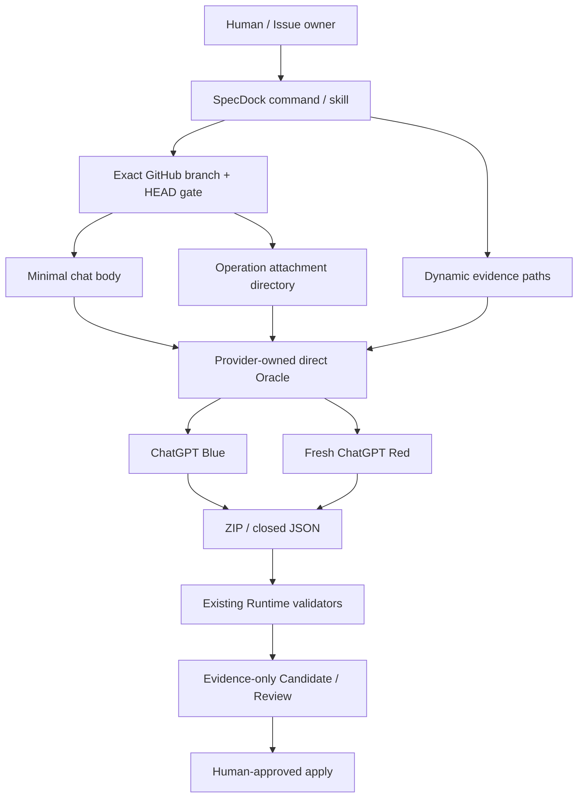

# 新規参加者向け: SpecDock ChatGPT 入力契約の読み方

> **補助資料 / non-canonical**  
> この文書は `CAND-ISS-00354-20260803T172642Z` の onboarding companion である。`requirement.md`、`design.md`、`plan.md` に
> 従属し、第四の canonical specification ではない。矛盾時は三文書が優先する。

## 1. この Issue が解決する問題

従来の Issue Planning runtime は、ChatGPT へ渡す情報を安全に整形するため、source file を一件ずつ読み、
UTF-8、symlink、size、secret、path を検査し、temporary prompt pack と manifest を生成していた。

Issue #354 の最終判断は、この入力処理を単純化する。

- Chat body: 作業開始に必要な最小 identity と命令。
- Attachments: 詳細 instruction と evidence。
- Attachment directory: SpecDock は中身を理解せず、directory path のまま direct Oracle へ渡す。
- Output: 既存の ZIP / JSON validator で厳格に検証する。

つまり「入力を信頼済み directory としてそのまま渡す」ことと、「ChatGPT output を無条件に信頼する」ことは
全く別である。

## 2. 一枚で見る全体像



## 3. 変わるもの / 変わらないもの

### 変わるもの

- role instruction を本文へ全部連結しない。
- individual source file を `context-NNN.md` に変換しない。
- input manifest / checksum を生成しない。
- attachment directory を prewalk しない。
- `--context-manifest` を directory-oriented input へ置き換える。
- Planning と Semantic Revision で verified Blue thread を継続する。
- onboarding の見出し数や diagram 数を過剰に hardcode しない。

### 変わらないもの

- named current branch / exact HEAD。
- default branch fallback 禁止。
- direct Oracle / managed Chrome。
- personal wrapper / API fallback 禁止。
- Candidate は evidence-only。
- Review は fresh read-only Red。
- Planner / Revision は ZIP、Reviewer は closed JSON。
- output parser、Candidate identity、Review identity、Human approval。
- ChatGPT に repository mutation をさせない。

## 4. Option C を誤解しない

Option C は「何でも安全」という意味ではない。責任の置き場所を変える。

| 項目 | Owner |
|---|---|
| attachment directory に何を置くか | pack maintainer / operator |
| directory entry の意味判断 | SpecDock は行わない |
| transport が受け取れるか | direct Oracle / ChatGPT の実結果 |
| transport failure からの除外・変換 | 行わない |
| exact GitHub source identity | SpecDock preflight |
| ChatGPT output の形式・identity | SpecDock output validator |
| canonical adoption | Human-approved apply |

directory に hidden file、symlink、特殊 entry があっても、SpecDock は「安全だから採用」「危険だから除外」と
判定しない。directory path を渡し、transport の通常結果を扱う。

## 5. Operation ごとの入力

### Planning

- Body: Issue の目的、repository / branch / HEAD、scope identity、authority、ZIP expectation。
- Static attachments: authoring instructions、authority、output contract。
- Dynamic attachments: optional operator attachment directory。
- Thread: existing verified Blue または new Blue。

### Review

- Body: fresh read-only defect review、reviewed identity、closed JSON expectation。
- Static attachments: review criteria、severity rule、output schema。
- Dynamic attachments: exact Candidate ZIP。
- Thread: Candidate version ごとに必ず fresh Red。

### Semantic Revision

- Body: exact Candidate / Review identity、selected P0 / P1 IDs、ZIP expectation。
- Static attachments: revision rules、preservation rule、output contract。
- Dynamic attachments: prior Candidate ZIP、exact Review JSON、revision request。
- Thread: verified Blue。不能なら complete current input で new Blue。

### Clarification

- Body: one essential question、scope identity、advisory output。
- Static attachments: grill loop、handoff contract。
- Dynamic attachments: owner が選んだ interview / research material。
- Thread: target convention は Blue。ただし current source HEAD では public runtime wiring は別 scope。

## 6. Blue / Red thread boundary

```mermaid
sequenceDiagram
    actor Human
    participant Blue as Blue thread
    participant Runtime
    participant Red1 as Fresh Red for Candidate v1
    participant Red2 as Fresh Red for Candidate v2

    Human->>Runtime: clarify / plan
    Runtime->>Blue: minimal body + current attachments
    Blue-->>Runtime: Candidate v1 ZIP
    Runtime->>Red1: fresh review + Candidate v1
    Red1-->>Runtime: FAIL JSON
    Runtime->>Blue: exact Review + Candidate v1
    Blue-->>Runtime: Candidate v2 ZIP
    Runtime->>Red2: fresh review + Candidate v2
    Red2-->>Runtime: PASS JSON
    Runtime-->>Human: evidence only; Human decision still required
```

Red は Blue の follow-up ではない。PASS を別 Candidate へ流用しない。

## 7. Blue thread が壊れたら

1. 旧 thread を正本扱いしない。
2. repository、branch、HEAD、Issue、Candidate lineage を再検証する。
3. lineage が一意なら、新 Blue に current body と current attachments を完全送信する。
4. lineage が曖昧なら Human に止める。
5. default branch、本文だけ再送、古い Candidate、personal wrapper へ fallback しない。
6. attachment manifest SHA は再開判定に使わない。

## 8. 最初に読む code

1. `application/issue_planning_prompt.py`
2. `application/issue_planning.py`
3. `infra/issue_planning_chatgpt.py`
4. `domain/issue_planning_contracts.py`
5. `commands/issue_planning.py`
6. `tests/unit/application/test_issue_planning_prompt.py`
7. `tests/unit/infra/test_issue_planning_chatgpt.py`
8. `tests/integration/test_issue_planning_e2e.py`

provider path は `src/spec_dock/assets/...`、dogfood path は `spec-dock/...` または `.agents/...` である。
provider を正本として projection する。

## 9. 最初の一日チェックリスト

- [ ] exact branch / HEAD を確認した。
- [ ] Issue / Epic / Initiative と親 #334 を読んだ。
- [ ] 17件の clarification artifact の最新版 Option C を理解した。
- [ ] input directory と output ZIP safety を混同していない。
- [ ] old scanner test の削除と output regression test の維持を区別した。
- [ ] Oracle directory / multiple path / continuation capability を実測した。
- [ ] unsupported の場合に wrapper fallback せず停止した。
- [ ] provider と dogfood を手で二重編集していない。
- [ ] Red は fresh、Blue だけが継続である。
- [ ] Candidate / Review を canonical adoption と呼んでいない。

## 10. よくある誤り

- **誤り:** Option C だから output ZIP parser も削除する。  
  **正:** Option C は input attachment directory に限定される。

- **誤り:** detailed instruction は untrusted なので添付できない。  
  **正:** authority は body / Runtime が保持するが、添付は operation instruction を含める。

- **誤り:** directory を一度 ZIP にしてから渡せば同じ。  
  **正:** automatic conversion であり、採用決定に反する。

- **誤り:** symlink を解決して regular file だけ選べば親切。  
  **正:** input を変更する独自 policy であり、採用決定に反する。

- **誤り:** Review も Blue thread で続ければ効率的。  
  **正:** Red independence を壊す。

- **誤り:** direct Oracle に continuation がなければ personal wrapper を使う。  
  **正:** product boundary 違反。STOP / REPLAN する。

## 11. 完了の見分け方

implementation が終わったと言えるのは、minimal body と no-prewalk direct attachment が test で証明され、
direct Oracle / exact GitHub / output validation / Human gate が回帰せず、provider / dogfood / docs / parent Epic
が整合し、fresh review と Human gate を通過したときだけである。
