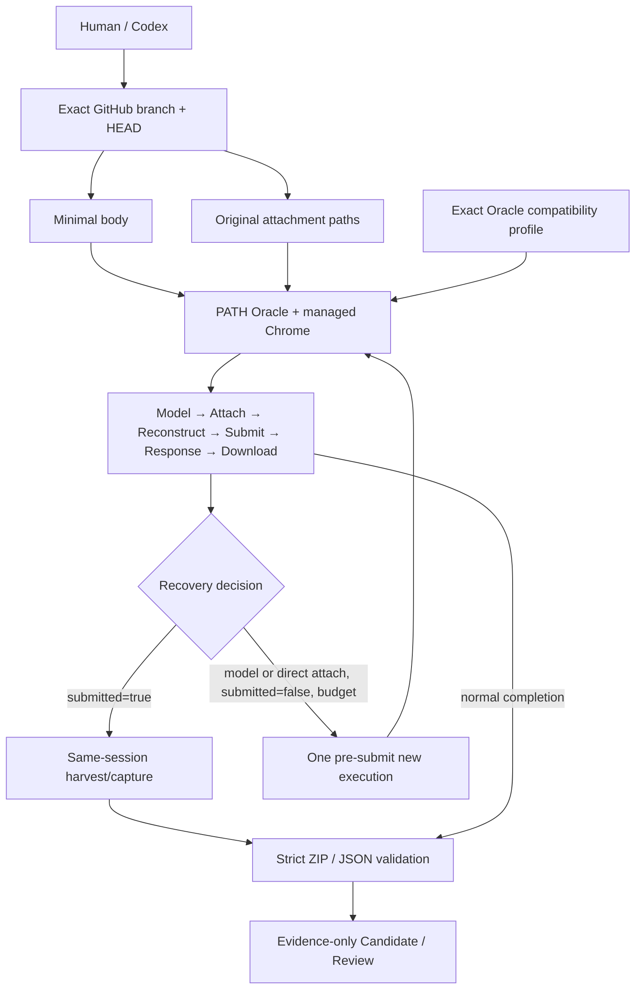
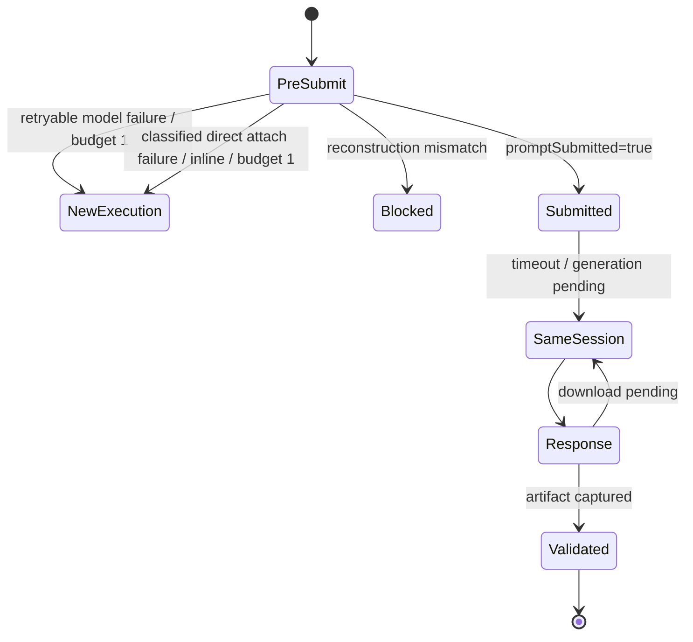

# 新規参加者向け: Oracle 0.17.0 対応版 ChatGPT 入力契約

> **補助資料 / non-canonical / Red Team レビュー対象外**  
> 本書は `CAND-ISS-00354-ORACLE017-V2-20260804T043533Z` の exactly-one onboarding companion である。`requirement.md`、`design.md`、`plan.md`、
> `decisions/ADR-ISS354-001-oracle-017-browser-compatibility.md` に従属する。

## 1. 最初に理解すること

Issue #354の中心は、ChatGPT inputを次へ分けることにある。

- minimal body:目的、exact source identity、authority、expected output。
- attachments:詳細instructionとevidence。
- transport:SpecDockはdirectory entryを読まず、original pathをPATH Oracleへ渡す。
- output:ZIP / JSONを既存validatorで厳格に検証する。

Oracle `0.17.0` 対応はこの設計を置き換えない。Oracle versionごとのbrowser contract、stage evidence、bounded recoveryを追加する。

## 2. 一枚で見るflow

## 3. 変わらない境界

- repository `chemitaro/spec-dock`、branch `codex/iss-00354-chatgpt-context-contract`、source HEAD `d0659cfa83bf97a05ceab01f4d9ce76162a2baa1`をexactに使う。
- default branch、personal wrapper、APIへfallbackしない。
- Oracle-native user/project configはOracleの責任として尊重する。
- formal必須値はexplicit argvで渡す。
- Blueはauthoring、Candidate versionごとのRedはfresh review。
- ChatGPT outputはevidence-only。Human-approved applyまでcanonicalではない。
- input directoryをscanしなくても、output ZIP / JSON validationは削除しない。

## 4. Oracle execution と ChatGPT conversation は別物

Oracle processが起動しても、promptが送信される前に失敗すればChatGPT conversation turnは作られていない。

| 状態 | Conversationへの影響 |
|---|---|
| model picker failure / `promptSubmitted=false` | Blue/Red turn未作成 |
| attachment failure / `promptSubmitted=false` | Blue/Red turn未作成 |
| reconstruction mismatch / `promptSubmitted=false` | Blue/Red turn未作成、automatic retryなし |
| `promptSubmitted=true` | turn作成済み。new execution禁止 |
| response complete / download failed |同じturnのartifactをsame-sessionで回収 |

Fresh Redとは「Oracle processが一つ」という意味ではなく、「Candidate versionについてsuccessful prompt submissionが一つのnew Red
conversationにだけ行われる」という意味である。

## 5. Recovery早見表

重要なルール:

- automatic new execution budgetは全体で`1`。model retry後にinline retryを追加しない。
- inlineはsame original pathsをOracle-native modeで渡すだけ。SpecDockはcopy/ZIP/filterしない。
- required attachmentを「なし」に落とさない。
- submitted後はpromptを再送しない。
- invalid ZIPを新しいChatGPT responseで作り直さない。

## 6. Model evidence

SpecDockはlogical `Pro`を要求する。UI labelはOracle / ChatGPT側で変わり得る。

- `GPT-5.6 Sol`は外部smokeで見えた一例。
- generic codeへhardcodeしない。
- formal successにはsame attemptで`model_verified=true`とobserved labelが必要。
- `current`や別modelへ黙って切り替えない。

## 7. Prompt reconstruction

現行adapterはpromptを一つのargv valueとしてshellなしで渡す。0.17対応では次を別々に証明する。

1. application / infra unit test: exact `str`がexact argvへ入る。
2. Oracle browser smoke: reconstruction mismatchなしで`promptSubmitted=true`になる。
3. representative long Japanese Markdown promptでも成立する。

mismatch時にpromptを短くしたり、引用符や改行を勝手に変えたりしない。

## 8. 最初に読むfile

1. Issue `requirement.md` / `design.md` / `plan.md`。
2. `decisions/ADR-ISS354-001-oracle-017-browser-compatibility.md`。
3. `application/issue_planning_prompt.py`。
4. `infra/issue_planning_chatgpt.py`。
5. `infra/issue_planning_oracle_artifact.py`。
6. `domain/issue_planning_contracts.py`。
7. `tests/unit/infra/test_issue_planning_chatgpt.py`。
8. `tests/integration/test_issue_planning_e2e.py`。

provider pathを正本とし、dogfood copyを手で二重編集しない。

## 9. 初日チェックリスト

- [ ] exact branch / HEADをconnectorで確認した。
- [ ] GitHub sourceとexternal local evidenceを区別した。
- [ ] current 0.16.1 baselineとunimplemented 0.17 planを区別した。
- [ ] Option A / Cとoutput validationを混同していない。
- [ ] compatibility profileを単なるversion constantと考えていない。
- [ ] `promptSubmitted`前後でrecoveryが変わることを理解した。
- [ ] model retryとinline retryが同じbudgetを共有することを確認した。
- [ ] `GPT-5.6 Sol`を恒久model IDと断定していない。
- [ ] private path / URL / session handle / transcriptをevidenceに貼っていない。
- [ ] Candidate / ReviewをcanonicalまたはPASSと呼んでいない。

## 10. よくある誤り

- **誤り:** `0.16.1`を`0.17.0`へ置換すればよい。  
  **正:** help、stage evidence、session schema、artifact readerをprofile単位で確認する。

- **誤り:** reconstruction mismatchならinlineでretryする。  
  **正:** inlineはclassified direct attachment failureだけ。mismatchはautomatic retryしない。

- **誤り:** model optionが見えなければ`current`を使う。  
  **正:** silent model driftになる。logical model不変でbounded retryまたはblock。

- **誤り:** responseが終わればZIPもある。  
  **正:** response completion、download、snapshot、validationは別stage。

- **誤り:** post-submit failureでnew executionする。  
  **正:** duplicate Candidate / Reviewを生む。same-session recoveryだけ。

- **誤り:** external wrapper smokeはSpecDock direct adapterのPASS証拠。  
  **正:**補助観測。direct PATH Oracle smokeが別途必要。
