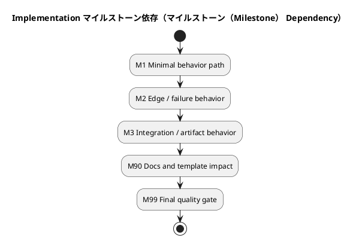

# iss-00354 Define ChatGPT Context and Attachment Contract — Issue 実装計画書（Standard / TDD）

この文書は、承認済みの `requirement.md` と `design.md` を、TDDに沿って実行可能な **マイルストーン（Milestone）、振る舞いバックログ（Behavior Backlog）、TDD Cycle、Validation Gate、報告証跡（Report Evidence）** へ変換する。

この文書は planned executable workflow contract である。実行中の観測結果、Red / Green / Refactor の実績、逸脱、追加判断、発見事項は `report.md` に記録する。

---

## 0. 文書の位置づけ

### この文書が定義すること

- このIssueをどの順序で実装・検証するか
- どのマイルストーン（Milestone）で何が成立するか
- どの振る舞いをTDDの対象にするか
- どの単位でRed-Green-Refactorを回すか
- 各振る舞いに必要な検証レベル
- 実装中に守るべき変更範囲
- 実装中に停止・再計画すべき条件
- `report.md` に残すべき証拠の記録先
- 最終完了条件

### この文書が定義しないこと

- 新しい要件
- 新しい設計判断
- 上位設計の再定義
- 実装後の観測証拠そのもの
- TDD中に発見されるprivateな内部構造

---

## 1. 計画開始条件（Plan Readiness）

### 1.1 必須入力（Required Inputs）

| 作業成果物（Artifact） | 状態 | 確認事項 |
|---|---|---|
| `requirement.md` | 下書き / 承認済み（draft / approved） | AC、BH、CON、等級（Grade）判定材料がある |
| `design.md` | 下書き / 承認済み（draft / approved） | 固定設計契約（Fixed Design Contracts）、Behavior Seeds、検証への含意（検証（Verification） Implications）がある |
| `report.md` | 存在 / 欠落（exists / missing） | 実行証拠の記録先がある |
| 親Epic design | 確認済み / N/A（reviewed / N/A） | 継承すべき制約が確認済み |
| 親Initiative design | 確認済み / N/A（reviewed / N/A） | 戦略的制約に矛盾しない |
| ADR / architecture docs | 確認済み / N/A（reviewed / N/A） | 関連制約が確認済み |

### 1.2 計画開始条件（Plan）

- [ ] `requirement.md` が承認済み、または実装計画作成に十分な状態である
- [ ] `design.md` が承認済み、または計画への引き渡し（Plan Handoff）が記載済みである
- [ ] 未解決のBlocking Open Questionがない
- [ ] Issue Gradeが `standard` として妥当である
- [ ] `standard` の前提を破る既知リスクがない
- [ ] 実装中に変更してよい設計仮説と、変更してはいけない設計契約が区別されている
- [ ] `report.md` への証拠記録方針がある

---

## 2. 実装戦略（Implementation Strategy）

このIssueでは、原則として **TDDによる段階的な垂直スライス実装** を採用する。

```text
Issue 受け入れ範囲（Acceptance Envelope）
└── マイルストーン（Milestone）
    └── 振る舞いバックログ（Behavior Backlog） Item
        └── 実行中の TDD サイクル（Active TDD Cycle）
            ├── Red
            ├── Confirm Red
            ├── Minimal Green
            ├── Local Regression
            ├── Refactor
            └── 報告証跡（Report Evidence）
```

### 2.1 基本方針

- Issue 全体は広く理解する
- マイルストーン（Milestone）単位で独立検証可能な中間成果を管理する
- 振る舞いバックログ（Behavior Backlog）で実装対象の振る舞いを列挙する
- TDD Cycleは実行直前に一つずつ具体化する
- 一つのTDD Cycleでは、原則として一つの独立した振る舞い仮説だけを扱う
- Redの失敗理由を確認してからproduction codeを変更する
- RefactorはGreen状態でのみ行う
- 観測証拠は `plan.md` ではなく `report.md` に残す

### 2.2 TDD の Red 方針（TDD Red Policy）

| Red種別 | 許容数 | 扱い |
|---|---:|---|
| Intentional outer Red | 最大1 | マイルストーン（Milestone）のguiding testとして許容 |
| Intentional inner Red | 最大1 | 現在の実行中の TDD サイクル（Active TDD Cycle）のみ |
| Existing regression Red | 0 | 発生したら即停止 |
| Unknown Red | 0 | 原因を確認するまで実装へ進まない |

### 2.3 Red代替証跡（Red Alternative）

TDDのRedが適切でない場合は、理由を明示して代替証拠を固定する。

| 対象 | Red分類 | 理由 | 代替証拠 |
|---|---|---|---|
| ... | red-required / covered-existing / characterization-first / 点検（inspect）-only / 手動（manual）-required / not-applicable | ... | ... |

---

## 3. 範囲と変更面（対象範囲（Scope） and Change Surface）

### 3.1 許可変更面（Allowed Change Surface）

| 種別 | パス・対象（Path / Target） | 許可する変更 | 関連設計識別子（Design ID） |
|---|---|---|---|
| コード（code） | ... | ... | `DES-...` |
| テスト（tests） | ... | ... | `DES-...` |
| 文書（docs） | ... | ... | `DES-...` |
| テンプレート（templates） | ... | ... | `DES-...` |
| スキル群（skills） | ... | ... | `DES-...` |
| scripts | ... | ... | `DES-...` |
| metadata | ... | ... | `DES-...` |

### 3.2 禁止変更（Forbidden Changes）

| 対象 | 禁止理由 | 必要になった場合の対応 |
|---|---|---|
| ... | ... | 停止して再計画 / escalate / 後続issue（後続（follow-up） issue） |

### 3.3 提供側・利用側反映（Provider / Consumer）

| 対象 | 変更要否 | 対応 |
|---|---|---|
| `src/spec_dock/assets/...` | はい / いいえ / 不明（yes / no / unknown） | ... |
| ワークスペース（root `spec-dock/...`） | はい / いいえ / 不明（yes / no / unknown） | ... |

---

## 4. 実行概要（Execution Overview）

### 4.1 マイルストーン要約（マイルストーン（Milestone） Summary）

| マイルストーン（Milestone） 識別子（ID） | 成果 | 主なBehavior | 検証（Verification） ゲート（Gate） | 状態 |
|---|---|---|---|---|
| M1 | ... | `B-...` | ... | planned |
| M2 | ... | `B-...` | ... | planned |
| M3 | ... | `B-...` | ... | planned |
| M90 | 文書・テンプレート（docs / template） / skill影響解決 | `B-...` | docs / diff / review | planned |
| M99 | final quality gate | all | full verification | planned |

### 4.2 マイルストーン依存（マイルストーン（Milestone） Dependency）



### 4.3 実装順序の理由

- ...
- ...

---

## 5. 受け入れ範囲（Acceptance Envelope）

### 5.1 受け入れ成果（Acceptance Outcomes）

| 成果識別子（Outcome ID） | 内容 | 関連AC | 関連設計識別子（Design ID） | 完了証拠 |
|---|---|---|---|---|
| OUT-001 | ... | `AC-...` | `DES-...` | `EVD-...` |
| OUT-002 | ... | `AC-...` | `DES-...` | `EVD-...` |

### 5.2 起きてはいけないこと（Must Not Happen）

| 識別子（ID） | 内容 | 検証方法 |
|---|---|---|
| MNH-001 | ... | ... |
| MNH-002 | ... | ... |

---

## 6. 仕様固定クロージャ一覧（Spec-Locked クロージャ（Closure） Index）

| クロージャ識別子（Closure ID） | 要件識別子（Requirement ID） | 設計識別子（Design ID） | 閉じる内容 | 検証レベル（Verification Level） | 報告証跡（Report Evidence） |
|---|---|---|---|---|---|
| CLOS-001 | AC-001 | DES-001 | ... | unit・CLI・テンプレート・文書 | `report.md#...` |
| CLOS-002 | AC-002 | DES-002 | ... | unit / integration / 手動（manual） | `report.md#...` |
| CLOS-003 | BH-001 | DES-003 | ... | unit / CLI | `report.md#...` |
| CLOS-004 | CON-001 | DES-004 | ... | 点検・文書（点検（inspect）ion / docs） | `report.md#...` |
| CLOS-XXX | 必要に応じて連番で追加する。`XXX` は実IDへ置換するか削除する。 | DES-... | ... | ... | `report.md#...` |

---

## 7. 振る舞いバックログ（Behavior Backlog）

Behaviorは、ファイル変更単位ではなく、観測可能な成果または保証として記述する。

| 振る舞い識別子（Behavior ID） | マイルストーン（Milestone） | 振る舞い / 保証 | 関連クロージャ（Closure） | 依存 | 優先度 | 状態 |
|---|---|---|---|---|---|---|
| B-001 | M1 | ... | `CLOS-...` | none | high | ready |
| B-002 | M1 | ... | `CLOS-...` | B-001 | medium | planned |
| B-003 | M2 | ... | `CLOS-...` | B-001 | high | planned |
| B-004 | M3 | ... | `CLOS-...` | B-002 | medium | planned |
| B-XXX | 必要に応じて連番で追加する。`XXX` は実IDへ置換するか削除する。 | ... | `CLOS-...` | ... | ... | planned |

状態: `planned` / `ready` / `active` / `complete` / `split` / `blocked` / `removed`

### 7.1 Behavior選択基準

- 依存する前提がGreenである
- 一つの振る舞い仮説に分割できる
- 期待されるRed理由を説明できる
- focused verificationを短時間で実行できる
- 既存の設計契約を変更しない
- Issueの中心リスクを減らす

### 7.2 Behavior分割ルール

- 独立した事前条件が複数ある
- 独立した事後条件が複数ある
- 失敗理由が複数ある
- 異なるverification levelが必要
- 異なる責任主体を変更する
- 異なるcontractを変更する
- 原子性、冪等性、互換性など複数の保証を同時に含む

---

## 8. 実行中の振る舞い（Active Behavior）

実行中のBehaviorだけを詳細化する。完了したら、このセクションを次のBehaviorへ更新する。過去の実績は `report.md` に記録する。

- 振る舞い識別子（Behavior ID）:
  - `B-...`
- 関連マイルストーン（Milestone）:
  - M...
- 関連クロージャ（Closure）:
  - `CLOS-...`
- 関連設計識別子（Design ID）:
  - `DES-...`
- なぜ次に実行するか:
  - ...
- 依存関係:
  - ...
- 分割判断:
  - one-cycle / split-required / unknown

### 振る舞い受け入れ条件（Behavior Acceptance）

- Given:
  - ...
- When:
  - ...
- Then:
  - ...
- And:
  - ...
- 観測点:
  - ...

### 振る舞い範囲（Behavior Scope）

| 項目 | 内容 |
|---|---|
| Allowed paths | ... |
| Forbidden paths | ... |
| Required tests / checks | ... |
| Report証跡記録先（Report evidence destination） | ... |
| Stop conditions | ... |

---

## 9. 実行中の TDD サイクル（Active TDD Cycle）

現在のTDD Cycleだけを詳細化する。Standardでは、将来の全Cycleを完全固定しない。

### 9.1 サイクルメタデータ（Cycle Metadata）

- Cycle ID:
  - TDD-...
- Parent Behavior:
  - `B-...`
- Cycle type:
  - red-green-refactor / characterization / 点検（inspect）-only / 手動（manual）-required
- Related クロージャ（Closure）:
  - `CLOS-...`
- 関連設計識別子（Design ID）:
  - `DES-...`
- Status:
  - 計画済み / red / green / refactored / 完了 / blocked（planned / red / green / refactored / complete / blocked）

### 9.2 振る舞い仮説（Behavioral Hypothesis）

```text
...
```

### 9.3 テスト・証跡計画（Test / Evidence Plan）

- Red分類:
  - red-required / covered-existing / characterization-first / 点検（inspect）-only / 手動（manual）-required / not-applicable
- 期待するRed理由:
  - ...
- Redが期待どおりでない場合の対応:
  - stop / repair test / replan / escalate
- 代替証拠:
  - ...

Concrete Test Seed:

- `tc-...`:
  - 前提:
    - ...
  - 操作:
    - ...
  - 期待結果:
    - ...
  - 失敗検出:
    - ...
  - 検証方法:
    - ...
  - 関連クロージャ（Closure）:
    - `CLOS-...`
  - 関連Report destination:
    - `report.md#...`

### 9.4 最小 Green 境界（Minimal Green Boundary）

- Allowed implementation boundary:
  - ...
- Do not implement yet:
  - ...
- Do not refactor yet:
  - ...
- Must preserve:
  - ...

### 9.5 集中検証（Focused 検証（Verification））

| 種別 | コマンド（Command） / Evidence | 期待 |
|---|---|---|
| Focused test | `...` | ... |
| Local regression | `...` | ... |
| Static / lint | `...` | ... |
| Manual / 点検（inspect） | ... | ... |

### 9.6 リファクタリング確認点（Refactor Checkpoint）

- Refactor必要:
  - はい / いいえ / 不明（yes / no / unknown）
- Refactor対象候補:
  - ...
- Refactor guardrail:
  - 振る舞いを変えない
  - 公開契約（public contract）を変えない
  - 設計書の正規契約（Normative Contract）を変えない
  - ローカル回帰（local regression）を再実行する

---

## 10. マイルストーン計画（マイルストーン（Milestone） Plans）

### M1: 実装単位1（Implementation Unit 1）
#### 成果

- ...
- ...

#### 含まれるBehavior

| 振る舞い識別子（Behavior ID） | 内容 | クロージャ（Closure） | 状態 |
|---|---|---|---|
| B-001 | ... | `CLOS-...` | planned |
| B-002 | ... | `CLOS-...` | planned |

#### マイルストーンゲート（マイルストーン（Milestone） Gate）

| ゲート（Gate） | コマンド（Command） / Evidence | 期待結果 | 報告先（Report Destination） |
|---|---|---|---|
| Focused suite | `...` | pass | `report.md#...` |
| Local regression | `...` | pass | `report.md#...` |
| Manual review | ... | 承認済み / N/A | `report.md#...` |

- commit:
  - commit候補: このマイルストーンの成果をレビュー可能な単位としてコミットする
  - commit前確認:
    - [ ] このマイルストーンの差分だけで意味が通る
    - [ ] 必要な検証が完了している
    - [ ] `report.md` に証跡がある
    - [ ] 次のマイルストーンの未完了差分が混ざっていない

### M2: 実装単位2（Implementation Unit 2）
#### 成果

- ...
- ...

#### 含まれるBehavior

| 振る舞い識別子（Behavior ID） | 内容 | クロージャ（Closure） | 状態 |
|---|---|---|---|
| B-003 | ... | `CLOS-...` | planned |

#### マイルストーンゲート（マイルストーン（Milestone） Gate）

| ゲート（Gate） | コマンド（Command） / Evidence | 期待結果 | 報告先（Report Destination） |
|---|---|---|---|
| ... | ... | ... | ... |

- commit:
  - commit候補: このマイルストーンの成果をレビュー可能な単位としてコミットする
  - commit前確認:
    - [ ] このマイルストーンの差分だけで意味が通る
    - [ ] 必要な検証が完了している
    - [ ] `report.md` に証跡がある
    - [ ] 次のマイルストーンの未完了差分が混ざっていない

---

## 11. 検証段階（検証（Verification） Ladder）

| レベル（Level） | 名称 | 目的 | コマンド（Command） / Evidence |
|---|---|---|---|
| L1 | Active Cycle Focused | 現在のCycleだけを確認 | `...` |
| L2 | Local Module / 作業成果物（Artifact） | 近接範囲の回帰確認 | `...` |
| L3 | 対象範囲（Scope）回帰（範囲回帰（対象範囲（Scope） Regression）） | Issue 対象scope全体の確認 | `...` |
| L4 | Contract / Template / CLI | contractやscaffold挙動確認 | `...` |
| L5 | Static / Lint / Type | 静的検証 | `...` |
| L6 | Docs / Skill Consistency | docs・template・skill整合性 | `...` |
| L7 | Final ゲート（Gate） | Issue 最終確認 | `...` |

---

## 12. 委任契約（Delegation Contract）

Codexやsubagentへ委任する場合、各作業が判断なしに実行できるようにする。

| ステップ・振る舞い（Step / Behavior） | 委任ロール（Delegated Role） | 許可パス（Allowed Paths） | レビュー観点（Reviewer Focus） | 報告先（Report Destination） |
|---|---|---|---|---|
| `B-...` | dev-coder / doc-writer / reviewer / none | ... | code / spec / docs | `report.md#...` |

---

## 13. 報告証跡対応（報告証跡（Report Evidence） Mapping）

| 証跡ID（Evidence ID） | 対象 | 報告節（Report Section） | 記録内容 |
|---|---|---|---|
| EVD-001 | Red / Alternative Evidence | `report.md#...` | ... |
| EVD-002 | Green検証（Green Verification） | `report.md#...` | ... |
| EVD-003 | Refactor証跡（Refactor Evidence） | `report.md#...` | ... |
| EVD-004 | Regression Result | `report.md#...` | ... |
| EVD-005 | 設計逸脱・判断（Design Deviation / Decision） | `report.md#...` | ... |
| EVD-006 | 文書・テンプレート影響（Docs / Template 影響（Impact）） | `report.md#...` | ... |
| EVD-007 | Final ゲート（Gate） | `report.md#...` | ... |

Report記録ルール:

- Red / Green / Refactorの実績はreport.mdに記録する
- 期待と異なるRedはreport.mdに記録し、必要に応じてreplanする
- 実装中に見つかった新しいテスト候補はreport.mdに記録する
- plan.mdは観測実績の正本にしない

---

## 14. 修正・停止ルール（Amendment and Stop Rules）

### 即時停止条件（Immediate Stop Conditions）

- [ ] 新しいテストがproduction change前から成功する
- [ ] Red理由が想定と異なる
- [ ] 既存Regressionが失敗した
- [ ] 承認済みRequirementの期待値を変更したくなる
- [ ] 承認済みDesignのNormative Contractを変更したくなる
- [ ] 公開契約（public contract）変更が必要になる
- [ ] 移行（migration）が必要になる
- [ ] セキュリティ・プライバシー（security / privacy）影響が判明する
- [ ] Forbidden changesが必要になる
- [ ] Issue外の設計判断が必要になる
- [ ] Standard gradeの前提を満たさなくなった

### 停止後の対応（Stop）

| 状況 | 対応 |
|---|---|
| テスト設計ミス | テストを修正し、Redを再確認 |
| 要件曖昧 | 要件文書（requirement.md）へ戻す |
| 設計契約変更が必要 | 設計書（design.md）を更新しreview |
| 対象範囲外変更（対象範囲（Scope））が必要 | 後続issue（後続（follow-up） issue）またはreplan |
| Grade escalationが必要 | 等級 strict / critical へ変更 |
| 外部判断が必要 | 上位文書（Epic・Initiative・ADR）へ昇格 |

---

## 15. 文書・テンプレート・スキル影響解消（Docs / Template / Skill 影響（Impact） Resolution）

| 対象 | 影響 | 必要な対応 | 報告証跡（Report Evidence） |
|---|---|---|---|
| 文書（docs） | はい / いいえ / 不明（yes / no / unknown） | ... | `report.md#...` |
| テンプレート（templates） | はい / いいえ / 不明（yes / no / unknown） | ... | `report.md#...` |
| スキル群（skills） | はい / いいえ / 不明（yes / no / unknown） | ... | `report.md#...` |
| ワークフロー文書（workflow docs） | はい / いいえ / 不明（yes / no / unknown） | ... | `report.md#...` |
| 提供資産（provider assets） | はい / いいえ / 不明（yes / no / unknown） | ... | `report.md#...` |
| 検証workspace（dogfooding workspace） | はい / いいえ / 不明（yes / no / unknown） | ... | `report.md#...` |

- commit:
  - commit候補: このマイルストーンの成果をレビュー可能な単位としてコミットする
  - commit前確認:
    - [ ] このマイルストーンの差分だけで意味が通る
    - [ ] 必要な検証が完了している
    - [ ] `report.md` に証跡がある
    - [ ] 次のマイルストーンの未完了差分が混ざっていない

---

## 16. 最終品質ゲート（Final Quality Gate）

| Check | コマンド（Command） / Evidence | 期待結果（Expected） | 報告先（Report Destination） |
|---|---|---|---|
| Requirement closure | 点検（inspect） closure index | all closed | `report.md#...` |
| Design contract compliance | 点検（inspect） design IDs | 違反なし | `report.md#...` |
| Focused tests | `...` | pass | `report.md#...` |
| Local regression | `...` | pass | `report.md#...` |
| Static checks | `...` | pass | `report.md#...` |
| Docs / template checks | `...` | pass / N/A | `report.md#...` |
| Manual review | ... | 承認済み / N/A | `report.md#...` |

- static analysis / lint:
  - 実行対象: このリポジトリで設定されている静的解析、lint、format check
  - pass条件: 既知の許容済み例外を除き成功する
- tests:
  - 実行対象: 単体テスト、およびこのIssueの影響範囲に必要な統合テスト / CLIテスト / regression test
  - pass条件: すべて成功する
  - 実行できない検証がある場合: 未実施理由と代替確認を `report.md` に記録する
- report:
  - [ ] 実行したコマンド、結果、未実施の理由を `report.md` に記録する
  - [ ] PR 作成後の GitHub Actions を、基礎的な lint / test 失敗の初回検出場所にしていない
- commit:
  - commit候補: このマイルストーンの成果をレビュー可能な単位としてコミットする
  - commit前確認:
    - [ ] 静的解析 / lint が完了している
    - [ ] 必要なテストが完了している
    - [ ] `report.md` に証跡がある
    - [ ] 未完了差分が混ざっていない

最終終了契約（Final Exit Contract）:

- [ ] すべてのクロージャ識別子（Closure ID）が完了している
- [ ] すべてのマイルストーン（Milestone）が完了している
- [ ] 振る舞いバックログ（Behavior Backlog）に未解決の必須項目が残っていない
- [ ] 実行中の TDD サイクル（Active TDD Cycle）がcompleteである
- [ ] 検証段階（検証（Verification） Ladder）の必要Levelが成功している
- [ ] Docs / Template / Skill影響が解決済みである
- [ ] Report evidenceが記録済みである
- [ ] Standard gradeの前提を破っていない
- [ ] 後続（follow-up）が必要な場合、明示されている

---

## 17. フォローアップ候補（Follow-up Candidates）

| 識別子（ID） | 内容 | 理由 | 推奨先 |
|---|---|---|---|
| FU-001 | ... | ... | Issue / Epic / ADR |
| FU-002 | ... | ... | Issue / Epic / ADR |

---

## 18. 計画承認チェックリスト（Plan Approval Checklist）

- [ ] requirement.mdのAC / BH / CONがクロージャ（Closure） Indexへ対応している
- [ ] design.mdの固定設計契約（Fixed Design Contracts）がPlanに反映されている
- [ ] design.mdの検証への含意（検証（Verification） Implications）が検証段階（検証（Verification） Ladder）へ反映されている
- [ ] マイルストーン（Milestone）が独立検証可能な成果として定義されている
- [ ] 振る舞いバックログ（Behavior Backlog）が観測可能な振る舞い単位で書かれている
- [ ] 実行中の TDD サイクル（Active TDD Cycle）が一つの振る舞い仮説に絞られている
- [ ] Redまたは代替証拠の方針が明示されている
- [ ] 最小 Green 境界（Minimal Green Boundary）が明示されている
- [ ] Refactor Guardrailが明示されている
- [ ] Allowed / Forbidden changesが明確である
- [ ] Stop Conditionsが具体的である
- [ ] Report evidence destinationが明示されている

---

## 19. 変更履歴

| 日付（Date） | 変更（Change） | 理由（Reason） | 作成者（Author） |
|---|---|---|---|
| 2026-08-03 | 初稿（Initial draft） | ... | ... |
