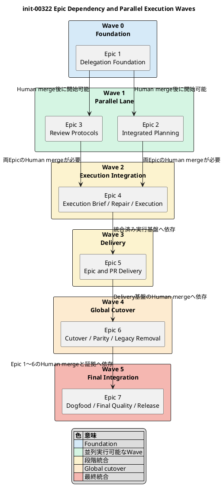

# init-00322 GPT 56 ChatGPT First Intelligence Architecture — 計画


## 1. 計画の役割とProgram構造

この計画は、`ChatGPT 5.6 Pro Delegation-First Workflow vNext`を7つの能力Epicへ分割し、各Epicを独立したmerge boundaryとして段階的に導入するroadmapを定義する。Architecture-Aware Execution BriefはEpic 1で共通command／binding基盤を確立し、Epic 4でIssue Executionへ統合し、Epic 7で分析品質、実装収束、Codex資源、総時間、汎用性を比較評価する。

- Initiative ID: `init-00322`
- filesystem path: `spec-dock/initiatives/init-00322-gpt-5-6-chatgpt-first-intelligence-architecture`
- GitHub Issue: `#322`
- repository title: `GPT 56 ChatGPT First Intelligence Architecture`
- program label: `ChatGPT 5.6 Pro Delegation-First Workflow vNext`

本計画は、Human承認後のEpic materialization、各EpicのJIT Planning、独立Delivery、global cutover、Initiative-level final qualityまでを定義する。実行状態は`report.md`、Git、GitHub、Oracle sessionで管理し、本計画へ逐次状態を追記しない。

## 2. Program Governanceと開始条件

1. Initiative Requirement、Design、Planがfresh Reviewを通過していること。
2. Humanが7 Epicの名称、責任境界、依存DAG、Delivery Boundaryを承認していること。
3. Main OrchestratorがEpic Nodeとdependencyを作成し、`validate`／`sync`が成功していること。
4. 各Epicは実装直前にJIT Epic Planningを行い、Issue Seed、Review Topology、Delivery Topology、Delivery Ownerを確定すること。
5. dependent Epicは原則として依存EpicのHuman merge後に開始すること。並列化はDAG上で独立したEpicに限定すること。
6. 各EpicのcompletionはHuman merge後に反映し、merge-preparedをcompletionとして扱わないこと。
7. Initiativeのcompletionは、全Epic merge、全REQ／ACの証拠、Initiative-level final quality、Final Completion Summaryが揃った後に限ること。

## 3. 実行原則

1. **Planning-first**
   各Epicは実装直前にJIT Epic Planningを実施し、Issue Seed、dependency、Review Topology、Delivery Topologyを確定する。
2. **Analysis-before-mutation for non-mechanical work**
   非機械的Execution Unitでは、最新HEADをChatGPTが横断分析し、Architecture-Aware Execution Briefを生成・採用してからExecutorを開始する。
3. **Quality-first cognitive delegation**
   Briefの第一目的は、目的理解、architecture理解、Evidence completeness、テスト戦略、実装品質、収束性の向上である。
4. **Codex resource shift**
   関連Artifact探索、構造理解、テスト設計、候補比較をChatGPTへ移し、CodexをWorkflow、mutation、verificationへ集中させる。
5. **Architecture-neutral concern selection**
   DDD、イベント、security、data、CLI等を固定前提にせず、repository evidenceから適用Concernだけを選ぶ。
6. **Independent delivery**
   dependent Epicを開始する前に原則として依存EpicをHuman merge済みにする。
7. **Small PR preference**
   Epic内でもIssue単位または小さいbatch単位のPRを優先する。
8. **Final Quality Issue**
   複数Issueまたはintegration riskがあるEpicは通常IssueとしてFinal Quality／Delivery Issueを持つ。
9. **Fresh formal gates**
   Planning、Checkpoint、Issue Delivery、Epic DeliveryをContractに応じてfreshに実行する。
10. **P0／P1 only repair**
    P2／P3だけではbranchを変更しない。
11. **Explicit Git ownership**
    Executorと`spec-dock-chatgpt`はGit transactionを行わず、Mainが明示的にcommit／pushする。mergeはHumanだけが行う。
12. **No hidden migration**
    既存Scopeの一括変換をEpicの作業へ混入させない。
13. **Provider／installed／dogfood parity**
    shipped surfaceの変更は同じEpicまたはdelivery scopeで揃える。
14. **Metric-driven validation**
    分析品質、実装収束、Codex資源、総時間を別々に評価する。

## 4. 成功指標の計測計画

### 4.1 Baseline

Epic 1で、可能な範囲で直近3件以上の旧Workflowと、Execution Brief対象になり得る代表Unitを選び、次を記録する。

- planned／unplanned Human intervention。
- Mainへ注入されたsub-agent／reviewer output量。
- local cognitive agent invocation。
- Executorのtool call、repository探索、test failure cycle、handoff量。
- first Checkpoint Review result。
- planning／repairへの手戻り。
- wall-clock time。
- 利用可能ならCodex token／quota。

### 4.2 Execution Brief comparative evaluation

Epic 7で、同等または再現可能な代表Unitについて次を比較する。

```text
A. Briefなし
B. generic implementation brief
C. Architecture-Aware Execution Brief
```

評価するtask shape:

- 複数module／layerのfeature。
- 独自または非標準frameworkを使う変更。
- API／compatibility変更。
- data／persistence／migration変更。
- CLI／build／deployment／documentation変更。
- mechanical change。

### 4.3 Target

- Evidence omission、unsupported assumption、誤ったConcern選択を減らす。
- first Checkpoint PASS率または実装収束性を改善する。
- Codex token、tool call、探索、failure cycle、handoff量の少なくとも一つを改善する。
- DDD／イベント等の非適用Concern捏造0。
- qualityが悪化するresource削減を採用しない。
- ChatGPT latencyを含む総時間と品質tradeoffを明示する。

### 4.4 Epic別metric responsibility

各EpicのJIT Epic Planningは、下表のmetric責務をIssue Seed、計測時点、証拠形式、収集担当、failure時のroutingへ具体化する。Epic 7はInitiative-levelの最終評価とclosureを所有するが、Epic 1〜6の計測実装、baseline採取、証拠作成を代替しない。

| Epic | JIT Planningで具体化するmetric責務 |
|---|---|
| Epic 1 | M-001〜M-013のbaseline／telemetry feasibility、M-008を支えるadapter／Prompt／field変更容易性の計測可能性 |
| Epic 2 | M-001、M-002、M-003、M-007のPlanning経路に関する介入、handoff量、旧認知route除去、reliability |
| Epic 3 | M-003、M-007のReview経路に関する旧Reviewer依存除去、Protocol reliability、evidence不足時のfail-closed |
| Epic 4 | M-002、M-003、M-007、M-009〜M-013のBrief品質、実装収束、Codex resource、汎用性、総Delivery効率の実測 |
| Epic 5 | M-004、M-007、M-013のHuman Gate integrity、Delivery reliability、PR／mergeまでの総時間 |
| Epic 6 | M-005、M-006、M-007のminimal state、provider／installed／dogfood parity、cutover／rollback reliability |
| Epic 7 | M-001〜M-013のInitiative-level集計、M-008 changeability drill、品質・resource・latencyの継続判断 |

## 5. マイルストーン

| Milestone | 成果 | 完了条件 |
|---|---|---|
| M0 Initiative Adoption | 本Planning Bundleとevidenceのadoption手続 | fresh Requirement／Design／Plan Review後、Humanが7 Epicを承認しNode／dependency作成 |
| M1 Delegation Foundation | inventory、`spec-dock-chatgpt`基盤、GitHub／Oracle binding、Brief command skeleton、baseline | Epic 1 Human merge、exact HEAD smoke、baseline capture |
| M2 Planning and Review Core | Integrated PlanningとFormal／Targeted Review | Epic 2・3 Human merge、Planning／Review dogfood |
| M3 Analysis-Guided Issue Execution Core | Architecture-Aware Execution Brief、Repair Batch、Executor、Issue Execution | Epic 4 Human merge、Brief／Issue Handoff Exit E2E |
| M4 Delivery Core | Delivery Topology、Epic Review、PR Delivery、Human Gate | Epic 5 Human merge、Merge Exit E2E |
| M5 Global Cutover | legacy removal、parity、既存Scope互換 | Epic 6 Human merge、stale reference 0、parity PASS |
| M6 Final Quality | comparative eval、Initiative dogfood、統合gate、release | Epic 7 Human merge、AC-001〜AC-025とM-001〜M-013評価 |

## 6. Epicポートフォリオ

| # | Epic | 目的 | Requirement coverage | 主実装責任AC | 依存 |
|---:|---|---|---|---|---|
| 1 | **Delegation Foundation, Asset Inventory, and Thin ChatGPT Adapter** | inventory、共通authority、薄いOracle／GitHub boundary、Execution Brief command skeleton、baselineを確立する。 | REQ-001, REQ-004, REQ-005, REQ-018, REQ-022 | AC-002, AC-004, AC-009 | なし |
| 2 | **Integrated Planning Bundle and Planning Workflow Cutover** | Initiative／Epic／Issue Planningをcomplete-file生成、セルフレビュー、canonical placement、Formal Planning Reviewへ切り替える。 | REQ-002, REQ-003, REQ-018 | AC-001, AC-003 | Epic 1 |
| 3 | **Contract-Driven Review Protocols and Targeted Review** | Formal／Targeted Reviewを契約駆動のScope、Perspective、structured resultへ統一する。 | REQ-006〜REQ-009, REQ-018 | AC-005〜AC-007 | Epic 1 |
| 4 | **Architecture-Aware Execution Brief, Repair Batch, and Executor-Centered Issue Execution** | 実装前の高深度分析をfrozen Briefへ変換し、Formal blockerはRepair Batchへ変換し、一つのcustom ExecutorでIssueを実行する。 | REQ-010〜REQ-013, REQ-016, REQ-018, REQ-020〜REQ-024 | AC-008, AC-010, AC-011, AC-019〜AC-023 | Epic 2, Epic 3 |
| 5 | **Plan-Driven Epic and PR Delivery** | Epic Delivery Topology、Issue／Epic Review、PR repair、Human Merge Gate、finish semanticsを実装する。 | REQ-014, REQ-015, REQ-018 | AC-012〜AC-015 | Epic 2, Epic 3, Epic 4 |
| 6 | **Global Cutover, Asset Parity, and Legacy Surface Removal** | 新surface完成後、旧surfaceを除去し、全ScopeをvNextへcutoverする。 | REQ-016〜REQ-018 | AC-016, AC-017 | Epic 2〜Epic 5 |
| 7 | **End-to-End Dogfood, Final Quality, and Release** | 全Workflowをdogfoodし、全REQ／AC、Execution Brief comparative eval、metrics、統合品質を検証する。 | REQ-001〜REQ-025 | AC-018, AC-024, AC-025 | Epic 1〜Epic 6 |

### 6.1 AC責任モデル

- **主実装責任**: 当該ACを成立させるcapability、Workflow、test、documentation、migration／cutover処理を、そのEpicのmerge boundary内で実装し、Epic Deliveryへ証拠を渡す責任。
- **共同実装／証拠提供**: 主実装責任EpicがACを成立させるために必要なintegration surface、dogfood結果、parity結果、review結果、Git／GitHub evidenceを提供する責任。主実装責任の移転ではない。
- **Initiative-level final verification／closure**: Epic 7が、Epic 1〜6のHuman merge済み成果と自身のdogfood／evaluationを用いてAC-001〜AC-025を最終確認し、Human merge後のcompletion反映までを統合する責任。証拠不足や未実装が見つかった場合は元の主実装責任Epicへ戻し、Epic 7が未承認の機能実装や責任再配分を黙って引き受けない。

### 6.2 Epic別AC handoff summary

| Epic | 主実装責任AC | 共同実装／証拠提供AC | Initiative-level final verification／closure |
|---|---|---|---|
| Epic 1 | AC-002, AC-004, AC-009 | AC-001, AC-003, AC-016, AC-018, AC-019, AC-021, AC-023, AC-025 | Epic 7へ証拠handoff。final closureは所有しない |
| Epic 2 | AC-001, AC-003 | AC-002, AC-004, AC-005, AC-016, AC-017, AC-018, AC-022 | Epic 7へ証拠handoff。final closureは所有しない |
| Epic 3 | AC-005, AC-006, AC-007 | AC-001, AC-002, AC-004, AC-008, AC-011〜AC-014, AC-016, AC-018 | Epic 7へ証拠handoff。final closureは所有しない |
| Epic 4 | AC-008, AC-010, AC-011, AC-019〜AC-023 | AC-001, AC-002, AC-004, AC-005, AC-009, AC-012, AC-013, AC-016〜AC-018, AC-024, AC-025 | Epic 7へ証拠handoff。final closureは所有しない |
| Epic 5 | AC-012〜AC-015 | AC-001, AC-002, AC-004, AC-005, AC-009, AC-011, AC-016, AC-018 | Epic 7へ証拠handoff。final closureは所有しない |
| Epic 6 | AC-016, AC-017 | AC-001, AC-002, AC-009, AC-010, AC-018 | Epic 7へ証拠handoff。final closureは所有しない |
| Epic 7 | AC-018, AC-024, AC-025 | AC-001〜AC-025のHuman merge済み証拠を統合し、不足を主実装責任Epicへ返す | AC-001〜AC-025の最終検証とHuman merge後のInitiative closure |

## 7. Epic詳細

### Epic 1: Delegation Foundation, Asset Inventory, and Thin ChatGPT Adapter

- 推奨slug: `delegation-foundation-asset-inventory-and-thin-chatgpt-adapter`
- 目的:
  - 全vNext Epicが依存するinventory、authority境界、薄いCLI／Oracle／GitHub binding、metrics baseline、Execution Brief command skeletonを確立する。
- Requirement coverage:
  - REQ-001, REQ-004, REQ-005, REQ-018, REQ-022。
- Acceptance Criteria responsibility:
  - 主実装責任: AC-002, AC-004, AC-009。
  - 共同実装／証拠提供: AC-001, AC-003, AC-016, AC-018, AC-019, AC-021, AC-023, AC-025。
  - Initiative-level final verification／closure: Epic 7へ証拠をhandoffし、Epic 1はfinal closureを所有しない。
- 依存:
  - なし。
- Metric responsibility:
  - M-001〜M-013のbaseline／telemetry feasibilityと、M-008を支える変更容易性の計測可能性をJIT Epic Planningで具体化する。
- 主成果物:
  - maintained Skill／Agent／Workflow／Template／Script inventory。
  - `spec-dock-chatgpt` application boundary。
  - `execution-brief generate`を含むcommand skeleton。
  - target resolution、Git sync preflight、deterministic anchor assembly、Oracle adapter。
  - `workflow_chatgpt_delegation.md`。
  - Human Relay contract。
  - M-001〜M-013に必要なbaseline／telemetry feasibility。
- 対象外:
  - Execution Briefの最終Prompt、Concern selection、Artifact lifecycle。
  - 旧surface削除。
- 完了条件:
  - command boundaryとhelp skeletonが利用可能。
  - no-hidden-Git tests。
  - exact GitHub branch／HEAD smoke。
  - deterministic anchorsがCodex意味分析なしで生成できる。
  - baseline対象と計測方法が定義される。
- Delivery Boundary:
  - 独立merge boundary。Human merge後に完了反映。

### Epic 2: Integrated Planning Bundle and Planning Workflow Cutover

- 推奨slug: `integrated-planning-bundle-and-planning-workflow-cutover`
- 目的:
  - Initiative／Epic／Issue Planningを、complete-file生成、セルフレビュー、content-preserving placement、Formal Planning Review、Human decomposition gateへ切り替える。
- Requirement coverage:
  - REQ-002, REQ-003, REQ-018。
- Acceptance Criteria responsibility:
  - 主実装責任: AC-001, AC-003。
  - 共同実装／証拠提供: AC-002, AC-004, AC-005, AC-016, AC-017, AC-018, AC-022。
  - Initiative-level final verification／closure: Epic 7へ証拠をhandoffし、Epic 2はfinal closureを所有しない。
- 依存:
  - Epic 1。
- Metric responsibility:
  - M-001、M-002、M-003、M-007のPlanning経路に関する介入、handoff量、旧認知route除去、reliabilityをJIT Epic Planningで具体化する。
- 主成果物:
  1. `workflow_planning.md`。
  2. vNext Initiative／Epic／Issue Planning Skills。
  3. Planning create／revise Promptとoutput contract。
  4. legacy Identify front matterを持たないPlanning templates。
  5. 旧`spec-dock-chatgpt-authoring`とmanual planning Skillsの削除。
  6. Planning candidate commit／push／Review／Human decomposition gate。
  7. Node materializationとdependency handoff tests。
- 対象外:
  - Checkpoint／Delivery Reviewの最終実装。
  - Architecture-Aware Execution Brief、Repair Batch、Issue Execution、PR Deliveryの全面改訂。
- Epic completion criteria:
  - 3つのPlanning Skillが共通ChatGPT integration boundaryを利用する。
  - ChatGPT生成三文書が意味的再執筆なしでcanonical pathへ配置される。
  - P0／P1でcomplete Bundleをrevisionし、P2／P3だけでは文書を変更しない。
  - Human approval後だけ子Nodeを作成する。
  - evidence front matterだけでadoptionを成立させない。
- Delivery Boundary:
  - 独立merge boundary。Human merge後にEpic完了を反映する。

### Epic 3: Contract-Driven Review Protocols and Targeted Review

- 推奨slug: `contract-driven-review-protocols-and-targeted-review`
- 目的:
  - Planning／Checkpoint／Issue Delivery／Epic DeliveryのFormal ReviewとTargeted Reviewを、契約駆動のScope、Temporal Window、Perspective、structured resultへ統一する。
- Requirement coverage:
  - REQ-006, REQ-007, REQ-008, REQ-009, REQ-018。
- Acceptance Criteria responsibility:
  - 主実装責任: AC-005, AC-006, AC-007。
  - 共同実装／証拠提供: AC-001, AC-002, AC-004, AC-008, AC-011〜AC-014, AC-016, AC-018。
  - Initiative-level final verification／closure: Epic 7へ証拠をhandoffし、Epic 3はfinal closureを所有しない。
- 依存:
  - Epic 1。
- Metric responsibility:
  - M-003、M-007の旧Reviewer依存除去、Protocol reliability、evidence不足時のfail-closedをJIT Epic Planningで具体化する。
- 主成果物:
  1. `workflow_review.md`。
  2. Planning／Checkpoint／Issue Delivery／Epic Delivery／Targeted Review Prompt。
  3. Semantic BASEとDelta-bounded Snapshot Review。
  4. `repository-conventions`を含むPerspective catalog。
  5. Protocol別result contractとmodel smoke。
  6. `spec-dock-targeted-review` Skill。
  7. local `spec-reviewer`／`code-reviewer`／`qa-reviewer` removal。
- 対象外:
  - Architecture-Aware Execution Brief、Repair Batch、Executor implementation。
  - GitHub上のCodex PR Reviewの削除。
- Epic completion criteria:
  - PlanningはSnapshot、Checkpoint／DeliveryはSemantic BASE、PR-styleはmerge-baseを使用する。
  - P0／P1、P2／P3、insufficient evidenceが期待どおりに処理される。
  - fresh Reviewへ前回finding、Authorの弁明、期待verdictを混入しない。
  - Targeted Reviewがadvisoryでありrepository mutationを発生させない。
  - `repository-conventions`が規約なしでN/Aを返し、規約を捏造しない。
- Delivery Boundary:
  - 独立merge boundary。Human merge後にEpic完了を反映する。

### Epic 4: Architecture-Aware Execution Brief, Repair Batch, and Executor-Centered Issue Execution

- 推奨slug: `architecture-aware-execution-brief-repair-batch-and-executor-centered-issue-execution`
- 目的:
  - ChatGPTの高深度横断分析を、各非機械的Execution Unitのfrozen subordinate contractへ変換する。
  - Formal blockerをRepair Batchへ変換する。
  - 一つのcustom ExecutorとExecution Tranche／MilestoneでIssueを実行する。
- Requirement coverage:
  - REQ-010〜REQ-013, REQ-016, REQ-018, REQ-020〜REQ-024。
- Acceptance Criteria responsibility:
  - 主実装責任: AC-008, AC-010, AC-011, AC-019〜AC-023。
  - 共同実装／証拠提供: AC-001, AC-002, AC-004, AC-005, AC-009, AC-012, AC-013, AC-016〜AC-018, AC-024, AC-025。
  - Initiative-level final verification／closure: Epic 7へ証拠をhandoffし、Epic 4はfinal closureを所有しない。
- 依存:
  - Epic 2, Epic 3。
- Metric responsibility:
  - M-002、M-003、M-007、M-009〜M-013のBrief品質、実装収束、Codex resource、汎用性、総Delivery効率をJIT Epic Planningで具体化する。
- 主成果物:
  1. `workflow_execution_brief.md`。
  2. Architecture-Aware Execution Brief Promptとoutput contract。
  3. dynamic Concern catalogとarchitecture-neutral rules。
  4. `ready | planning-gap | insufficient-evidence` routing。
  5. Workbench candidate → Issue Artifact adoption／freeze。
  6. `execution-brief` Artifact typeまたは専用import path。
  7. Source HEAD stale handling。
  8. Mainの最小adoption check。
  9. Executor input／authority contract。
  10. `workflow_repair_batch.md`とRepair Batch generation。
  11. custom Executor、Markdown handoff、不要Agent削除。
  12. Execution Unit／Checkpoint／Brief／Repairを持つ`workflow_issue.md`とIssue Execution Skill。
  13. Final Completion Summaryとしての`report.md` target guidance。
  14. Main-owned Git transitionとrepresentative Issue E2E。
- 対象外:
  - Epic Delivery Topologyの完全実装。
  - PR monitor／merge gateの全面改訂。
  - 特定architecture専用template。
  - Brief validity parser／database。
- 推奨Issue slices:
  1. Execution Unit／Milestone selection and mechanical-skip policy。
  2. ChatGPT semantic retrieval and Evidence Used／Gaps contract。
  3. Dynamic Applicable Concern selection and architecture-neutral prompt。
  4. Brief statuses、candidate、adoption、freeze、Source HEAD invalidation。
  5. Executor handoff and same-commit Git lifecycle。
  6. Repair Batch and Brief authority integration。
  7. Issue Execution Skill／workflow integration。
  8. Representative multi-shape dogfood and Epic quality gate。
- Epic completion criteria:
  - 非機械的UnitでBriefを生成し、mechanical changeで省略または最小化できる。
  - DDD／イベント等の適用Concernは選ばれ、CLI／docs等では非適用Concernを強制しない。
  - `ready`だけをArtifactへ昇格し、他statusではExecutorを開始しない。
  - accepted Briefがfreezeされ、Plan変更の裏口にならない。
  - Executorとintegration CLIがcommit／pushしない。
  - Mainがdiff／verification後に明示commit／pushする。
  - Issue Handoff ExitをE2Eで完了する。
- Delivery Boundary:
  - 独立merge boundary。Human merge後に完了反映。

### Epic 5: Plan-Driven Epic and PR Delivery

- 推奨slug: `plan-driven-epic-and-pr-delivery`
- 目的:
  - Epic Delivery Topology、Issue／Epic Review、Delivery Owner、PR repair、Human Merge Gate、merge確認後のfinish semanticsを実装する。
- Requirement coverage:
  - REQ-014, REQ-015, REQ-018。
- Acceptance Criteria responsibility:
  - 主実装責任: AC-012〜AC-015。
  - 共同実装／証拠提供: AC-001, AC-002, AC-004, AC-005, AC-009, AC-011, AC-016, AC-018。
  - Initiative-level final verification／closure: Epic 7へ証拠をhandoffし、Epic 5はfinal closureを所有しない。
- 依存:
  - Epic 2, Epic 3, Epic 4。
- Metric responsibility:
  - M-004、M-007、M-013のHuman Gate integrity、Delivery reliability、PR／mergeまでの総時間をJIT Epic Planningで具体化する。
- 主成果物:
  1. Delivery Topologyを扱うEpic Planning／Epic Execution。
  2. Issue Exit ContractのHandoff／Merge経路。
  3. Delivery Owner IssueとEpic-level integration obligations。
  4. 簡素化されたPR Delivery Skill。
  5. CI／GitHub Codex Review／ChatGPT Delivery Reviewの統合。
  6. merge-prepared、Human Merge Gate、merge確認後finish。
  7. Final Completion Summaryから主要Execution Brief／Repair Batchを必要最小限参照するguidance。
- 対象外:
  - 自動merge。
  - GitHub上のCodex PR Reviewの一本化判断。
- Epic completion criteria:
  - per-Issue／batch／Epic-wide deliveryをPlanで表現できる。
  - Issue ReviewとEpic Reviewを異なるContract Ownerで実行できる。
  - P2／P3だけでbranchを変更しない。
  - 修復後のnew HEADで必要なgateを再観測する。
  - Human merge前にfinishせず、merge後にreviewed headを確認する。
- Delivery Boundary:
  - 独立merge boundary。Human merge後にEpic完了を反映する。

### Epic 6: Global Cutover, Asset Parity, and Legacy Surface Removal

- 推奨slug: `global-cutover-asset-parity-and-legacy-surface-removal`
- 目的:
  - vNext replacement surface完成後に旧Workflow／Skill／Agent／Document／Template／Scriptを除去し、全Scopeの公式Workflow authorityをvNextへ切り替える。
- Requirement coverage:
  - REQ-016, REQ-017, REQ-018。
- Acceptance Criteria responsibility:
  - 主実装責任: AC-016, AC-017。
  - 共同実装／証拠提供: AC-001, AC-002, AC-009, AC-010, AC-018。
  - Initiative-level final verification／closure: Epic 7へ証拠をhandoffし、Epic 6はfinal closureを所有しない。
- 依存:
  - Epic 2, Epic 3, Epic 4, Epic 5。
- Metric responsibility:
  - M-005、M-006、M-007のminimal state、provider／installed／dogfood parity、cutover／rollback reliabilityをJIT Epic Planningで具体化する。
- JIT Epic Planningで具体化する既知follow-up:
  - cutover前後のrollback rehearsalを実行し、手順と観測証拠を残す。
  - provider／installed／dogfoodと公開Workflowが同一のvNext authority sourceを参照し、mixed authorityがないことを確認する。
  - abort後にknown-good boundaryへ復元できることを検証し、closed Scopeを書き換えず、旧／新authorityを併存させない。
- 主成果物:
  1. provider／installed／dogfood parity。
  2. 旧authoring lane、manual planning、local reviewers、custom Explorer、Repository Analyst、Docs Writerの削除。
  3. `workflow_spec_authoring.md`等の置換とリンク整理。
  4. Architecture-Aware Execution Briefのcommand、Prompt、Workflow、Artifact guidance parity。
  5. existing Scope cutover guidanceとplanning-gap refresh path。
  6. repository-wide stale reference／compatibility tests。
  7. install／upgrade／dogfood smoke。
  8. abort／rollback runbookとknown-good boundary。
- 対象外:
  - 既存Scope文書の一括変換。
  - closed Scopeの書き換え。
- Epic completion criteria:
  - maintained surfaceに旧Workflow参照がない。
  - provider／installed／dogfoodが同一責務で一致する。
  - existing open Scopeが文書移行なしでvNextへ入る。
  - 必要契約が不足する場合だけ局所Planning refreshを行う。
  - closed Scopeが変更されない。
  - cutover abort／rollbackがmixed authorityを作らずに実行できる。
- Delivery Boundary:
  - 独立merge boundary。Human merge後にEpic完了を反映する。

### Epic 7: End-to-End Dogfood, Final Quality, and Release

- 推奨slug: `end-to-end-dogfood-final-quality-and-release`
- 目的:
  - Epic 1〜6のHuman merge済みcapabilityを代表Workflowで統合dogfoodし、全REQ／AC、Architecture-Aware Execution Brief比較、metrics、最新gate、release handoffをInitiative-levelで最終検証する。
- Requirement coverage:
  - REQ-001〜REQ-025。
- Acceptance Criteria responsibility:
  - 主実装責任: AC-018, AC-024, AC-025。
  - Initiative-level final verification: AC-001〜AC-025について、各主実装責任EpicのHuman merge済み成果と証拠を確認し、不足、矛盾、stale evidenceを元の責任Epicへ返す。
  - Initiative-level closure: Epic 7のHuman merge後に最終reviewed headと全completion evidenceを確認し、Initiative completionを`report.md`へ反映する。final verificationはEpic 1〜6の実装責任を移転しない。
- 依存:
  - Epic 1〜Epic 6。原則として全依存EpicがHuman merge済みであり、各EpicのAC handoff evidenceが利用可能であること。
- Metric responsibility:
  - M-001〜M-013をInitiative-levelで集計し、M-008 changeability drillと品質・resource・latencyの継続判断をJIT Epic Planningで具体化する。
- 主成果物:
  - Initiative／Epic／Issue Planning dogfood。
  - Formal Review／Repair／Issue／Epic／PR Delivery dogfood。
  - Architecture-Aware Execution Brief comparative evaluation。
  - diverse task shape model smoke。
  - Evidence quality／implementation convergence／Codex resource／wall-clock report。
  - M-001〜M-013 evaluation report。
  - changeability drill。
  - AC-001〜AC-025 final verification matrixとowner別evidence disposition。
  - Initiative Final Completion Summary、release delivery。
- 対象外:
  - 承認済みREQ／ACのclosureに不要な新規feature workstream、product capability、framework固有機能の追加。
  - Human承認を伴わないEpicの追加、分割、統合、責任再配分その他のre-slicing。必要な場合は§13のcontrolled re-slicingへ戻す。
  - Epic 1〜6の未完実装や証拠不足を、Epic 7のfinal verification名目で黙って吸収すること。
  - 自動merge、Human merge前のEpic／Initiative finish、merge-preparedをcompletionとして扱うこと。
- 完了条件:
  - AC-001〜AC-025のowner別証拠が揃い、主実装責任とfinal verification／closureの分離が維持される。
  - M-001〜M-013が評価される。
  - architecture-neutralityとnon-inventionが確認される。
  - quality、resource、latencyのtradeoffに基づく継続判断が記録される。
  - latest HEADでChatGPT Delivery Review、CI、GitHub Codex PR Reviewがterminal。
  - merge-preparedでHuman Gateへ停止し、Human merge後にInitiative完了条件を確認する。
- Delivery Boundary:
  - Epic 7は独立したmerge boundaryとし、approved Epic 7 Scope内のdogfood、evaluation、final-quality evidence、および既存契約を満たすためのbounded repairだけを含める。新規feature workstreamや未承認re-slicingを混在させない。
  - latest HEADのrequired gateとAC evidenceが揃った時点で`merge-prepared`に停止し、Main、Executor、ChatGPT、Runtimeはmergeを実行しない。
  - mergeはHumanだけが行う。
  - Human merge後、Mainがmerged headと最終reviewed headの整合、required gate、AC-001〜AC-025 evidence、M-001〜M-013評価を再確認し、Epic 7およびInitiativeのcompletionを`report.md`へ反映する。merge前にはcompletionを反映しない。

## 8. 依存DAGと並列化

7 Epicの依存DAGを次のとおり定義する。

```text
E1 -> E2, E3
E2 + E3 -> E4
E2 + E3 + E4 -> E5
E2 + E3 + E4 + E5 -> E6
E1..E6 -> E7
```

### 8.1 並列実行Wave

| Wave | 対象Epic | 並列性 | 次Waveへの開始条件 |
|---:|---|---|---|
| 0 | Epic 1 | 単独 | Epic 1をHuman merge済みにする |
| 1 | Epic 2、Epic 3 | **相互に独立して並列実行可能** | Epic 2とEpic 3の両方をHuman merge済みにする |
| 2 | Epic 4 | 単独 | Epic 2、Epic 3、Epic 4をHuman merge済みにする |
| 3 | Epic 5 | 単独 | Epic 2〜Epic 5をHuman merge済みにする |
| 4 | Epic 6 | 単独 | Epic 2〜Epic 6をHuman merge済みにする |
| 5 | Epic 7 | 単独の最終統合 | Epic 1〜Epic 6をHuman merge済みにし、owner別AC evidenceを利用可能にする |

- 最大並列幅は2であり、並列区間はWave 1のEpic 2／Epic 3だけである。
- Epic 4以降は、前Waveまでの成果を統合するため実効的に直列となる。
- 各矢印の開始条件は、原則として依存Epicの実装完了ではなくHuman merge完了である。

### 8.2 Epic依存と並列可能性の可視化

- **Title**: init-00322 Epic Dependency and Parallel Execution Waves
- **Question answered**: どのEpicが何に依存し、どこを並列実行できるか。
- **Scope**: 7 Epicの実効開始順序とHuman merge gate。上記DAGの推移的に冗長な辺は省略する。
- **Excluded details**: 各Epic内のIssue分割、実装手順、test command、PR内の並列作業。
- **Update trigger**: HumanがEpic境界、依存DAG、またはDelivery Boundaryの変更を承認したとき。



この図は開始順序を読みやすくするため、上記の完全DAGを推移簡約している。たとえばEpic 5は完全DAG上ではEpic 2、Epic 3、Epic 4へ明示的に依存するが、Epic 4のHuman mergeがEpic 2／Epic 3のHuman mergeを前提とするため、図ではEpic 4からEpic 5への実効依存として表現する。完全な依存判定では上記text DAGとEpicポートフォリオを正本とする。

## 9. Initiative意思決定ゲート

### G0 Bootstrap Adoption


- Initiative Requirement／Design／Planがfresh Reviewを通過する。
- Humanが7 Epicの名称、責任境界、依存DAG、Delivery Boundaryを承認する。
- MainがEpic Node／dependencyを作成し、`validate`／`sync`を成功させる。
- Epic 1 Planningへ進む。

### G1 Foundation Readiness

- Asset inventoryがprovider／installed／dogfoodを網羅する。
- CLI preflight、Oracle adapter、Execution Brief command skeletonが成立する。
- deterministic anchorsを生成できる。
- no-hidden-Git testがPASSする。
- baseline metricsが取得される。

### G2 Planning／Review Readiness


- Planning Bundleを実際のScopeで生成、配置、Reviewできる。
- Formal ReviewとTargeted Reviewのresult contractが安定する。
- old authoring／manual／local reviewerへの必須依存が外れている。

### G3 Execution Readiness

- Issue PlanがExecution Unitを指定できる。
- 非機械的UnitでArchitecture-Aware Execution Briefを生成できる。
- ChatGPTが関連Artifactとrepository evidenceを選択し、Evidence Used／Gapsを返す。
- `ready`だけをadopt／freezeできる。
- diverse taskで適用Concernが妥当である。
- ExecutorとIssue ExecutionがHandoff Exitを完了できる。
- Checkpoint FAILからRepair Batchを経てfresh gateへ戻れる。
- Mainだけがcommit／pushする。

### G4 Delivery Readiness


- Epic Delivery TopologyとDelivery OwnerをPlanで表現できる。
- Issue ReviewとEpic Reviewを分離できる。
- PR repair、dual review、Human Merge Gate、merge確認後finishが動作する。

### G5 Cutover Readiness

- Execution Briefを含むmaintained surfaceの旧／stale参照が0。
- provider／installed／dogfood parityがPASSする。
- existing open Scopeのno-migration replayがPASSする。

### G6 Initiative Final Quality

- AC-001〜AC-025のtraceabilityと実証証拠がある。
- M-001〜M-013が評価される。
- Briefなし／generic／Architecture-Aware比較が完了する。
- latest HEADの各gateがterminalである。
- Initiative `report.md`がFinal Completion Summaryとして完成する。

## 10. Requirement／AC／Epic traceability

| Requirement | 主なEpic |
|---|---|
| REQ-001 | Epic 1, Epic 7 |
| REQ-002〜REQ-003 | Epic 2, Epic 7 |
| REQ-004〜REQ-005 | Epic 1, Epic 7 |
| REQ-006〜REQ-009 | Epic 3, Epic 7 |
| REQ-010〜REQ-013 | Epic 4, Epic 7 |
| REQ-014〜REQ-015 | Epic 5, Epic 7 |
| REQ-016 | Epic 4, Epic 6, Epic 7 |
| REQ-017 | Epic 6, Epic 7 |
| REQ-018 | Epic 1〜Epic 7 |
| REQ-019 | Epic 7 |
| REQ-020〜REQ-024 | Epic 1, Epic 4, Epic 7 |
| REQ-025 | Epic 7 |

AC responsibilityは§6.1の責任モデルに従う。`主実装責任Epic`はcapabilityとEpic-level evidenceを成立させ、`共同実装／証拠提供Epic`は必要なintegration evidenceを提供する。`Initiative-level final verification／closure owner`であるEpic 7は全ACを再検証するが、主実装責任を引き取らない。

| Acceptance Criteria | Canonical acceptance condition | 主実装責任Epic | 共同実装／証拠提供Epic | Initiative-level final verification／closure owner |
|---|---|---|---|---|
| AC-001 | `init-00322`の三文書が相互に矛盾せず、REQ-001〜REQ-025と7 Epicのtraceabilityを持つ。 | Epic 2 | Epic 1, Epic 3〜Epic 6 | Epic 7 |
| AC-002 | Actor responsibilityとHuman GateがPlanning、Review、Execution Brief、Repair、Execution、Deliveryで一貫し、ChatGPT evidenceの自己申告だけでauthorityが成立しない。 | Epic 1 | Epic 2〜Epic 6 | Epic 7 |
| AC-003 | Initiative／Epic／Issue Planningが完全Bundle生成、セルフレビュー、内容不変配置、必要なHuman分割承認を実行できる。 | Epic 2 | Epic 1 | Epic 7 |
| AC-004 | ChatGPT連携境界がGitHub exact repository／branch／HEADへfail closedでbindされ、default branchまたはtracked file添付へ黙ってfallbackしない。 | Epic 1 | Epic 2〜Epic 5 | Epic 7 |
| AC-005 | Planning、Checkpoint、Issue Delivery、Epic DeliveryのReviewがP0／P1、P2／P3、証拠不足を意図したsemanticsで扱う。 | Epic 3 | Epic 2, Epic 4, Epic 5 | Epic 7 |
| AC-006 | `repository-conventions`が規約あり／なしの双方で動作し、未定義規約を捏造しない。 | Epic 3 | — | Epic 7 |
| AC-007 | Targeted Reviewが対象とPerspectiveを受け、advisory結果だけを返し、Formal Gateやrepository mutationを発生させない。 | Epic 3 | — | Epic 7 |
| AC-008 | Repair BatchがSource HEADへbindされ、Mainの採用後にfreezeされ、materialな契約変更をPlanningへ返せる。 | Epic 4 | Epic 3 | Epic 7 |
| AC-009 | Executor、`spec-dock-chatgpt`、隠れたautomationがGit transactionを行わず、Mainが定義済みtransitionで明示的にcommit／pushし、Humanだけがmergeする。 | Epic 1 | Epic 4〜Epic 6 | Epic 7 |
| AC-010 | 主要write Agentがcustom Executor一つへ統合され、不要なWriter／Reviewer／Analyzer経路がmaintained surfaceから除去される。 | Epic 4 | Epic 6 | Epic 7 |
| AC-011 | Issue ExecutionがExecution Tranche、Architecture-Aware Execution Brief、Checkpoint、Repair、Issue Delivery、Issue Exit ContractをE2Eで処理できる。 | Epic 4 | Epic 3, Epic 5 | Epic 7 |
| AC-012 | Epic DeliveryがIssue ReviewとEpic Reviewを区別し、Delivery Ownerとintegration verificationを用いてPR Deliveryへ進める。 | Epic 5 | Epic 3, Epic 4 | Epic 7 |
| AC-013 | PR DeliveryがP0／P1またはrequired CI failureを修復し、新HEADで必要なgateを再観測してmerge-preparedで停止する。 | Epic 5 | Epic 3, Epic 4 | Epic 7 |
| AC-014 | P2／P3だけではbranch mutation、再CI、再Reviewを行わない。 | Epic 5 | Epic 3 | Epic 7 |
| AC-015 | Human merge前にMerge Exitの`issue finish`／`epic finish`を行わず、merge後に最終reviewed headを確認する。 | Epic 5 | — | Epic 7 |
| AC-016 | provider、installed、dogfoodでSkill／Agent／Workflow／Template／Scriptの責務parityが確認され、旧必須surfaceが残っていない。 | Epic 6 | Epic 1〜Epic 5 | Epic 7 |
| AC-017 | 既存open Scopeが文書migrationなしでvNext Workflowへ入り、不足契約だけを局所Planning refreshできる。 | Epic 6 | Epic 2, Epic 4 | Epic 7 |
| AC-018 | 代表dogfoodとInitiative-level final qualityが完了条件を満たし、各Epicが独立したmerge boundaryでHuman mergeまで完了する。 | Epic 7 | Epic 1〜Epic 6 | Epic 7 |
| AC-019 | 非機械的な代表Milestoneで、ChatGPTがexact HEADから関連Artifactとrepository evidenceを横断調査し、目的、現状、適用Concern、テスト戦略、実装戦略、停止条件を含むBriefを生成する。 | Epic 4 | Epic 1 | Epic 7 |
| AC-020 | DDD／イベント駆動を含むUnitでは該当Concernを選択し、CLI／build／documentation等のUnitでは非該当Concernを強制せず、存在しないdomain／event概念を捏造しない。 | Epic 4 | — | Epic 7 |
| AC-021 | `ready` BriefだけがWorkbench candidateからIssue Artifactへ昇格・freezeされ、`planning-gap`／`insufficient-evidence`ではExecutorを開始しない。 | Epic 4 | Epic 1 | Epic 7 |
| AC-022 | accepted Briefが`plan.md`を変更せず、特定Execution Unitのsubordinate contractとしてExecutorへ渡され、Briefと対応実装が同一candidate commitに含まれる。 | Epic 4 | Epic 2 | Epic 7 |
| AC-023 | ChatGPTが関連Artifactを意味的に選択し、Codex／wrapperは決定的なnavigation anchorsだけを提供する。Mainはraw Artifactを再分析せず、binding、status、evidence、scopeを確認する。 | Epic 4 | Epic 1 | Epic 7 |
| AC-024 | Briefなし、汎用Brief、Architecture-Aware Briefを代表Unitで比較し、Architecture-Aware BriefがEvidence completeness、test strategy、first-pass convergence、または手戻りで改善し、品質を悪化させない。 | Epic 7 | Epic 4 | Epic 7 |
| AC-025 | Codex tokenまたはproxyとしてのtool call、探索回数、failure cycle、handoff量の少なくとも一つが改善し、改善しない場合も品質効果と総遅延を含む継続判断が記録される。 | Epic 7 | Epic 1, Epic 4 | Epic 7 |

## 11. Epic materialization handoff

Human approval後、次の順でEpic Nodeを作成する。

1. Delegation Foundation, Asset Inventory, and Thin ChatGPT Adapter
2. Integrated Planning Bundle and Planning Workflow Cutover
3. Contract-Driven Review Protocols and Targeted Review
4. Architecture-Aware Execution Brief, Repair Batch, and Executor-Centered Issue Execution
5. Plan-Driven Epic and PR Delivery
6. Global Cutover, Asset Parity, and Legacy Surface Removal
7. End-to-End Dogfood, Final Quality, and Release

Dependency edgeは名前と意味で作成し、永続Seed IDやmapperを導入しない。Node materializationだけを理由にInitiative Bundleを書き換えない。

## 12. Epic handoff readiness

各Epicへ最低限渡すもの:

- Initiative三文書。
- Human／`report.md` dispositionが確認できる関連ADR evidence。
- Epicの目的、Scope、Non-goal、Requirement coverage。
- §6.1と§10に基づく主実装責任AC、共同実装／証拠提供AC、Initiative-level final verification／closure owner。
- 各主実装責任ACについて、JIT Epic PlanningでIssue Seed、実装surface、verification、evidence destination、Epic Delivery判定を具体化する。
- 共同実装／証拠提供ACについて、handoff先、必要証拠、stale判定、主実装責任Epicへ戻す条件を具体化する。
- 依存EpicとHuman merge状態。
- 現行repository inventory／影響surface。
- 必須Human Gate。
- Epic completion criteriaとDelivery Boundary。
- §4.4に基づくmetric責務、baseline、計測時点、証拠形式。
- Epic 4にはArchitecture-Aware Execution BriefのInterview、Discussion、Research、ADR。
- Epic 6にはrollback rehearsal、authority single-source確認、known-good boundary restoration verification。
- Epic 7にはEpic 1〜6のHuman merge済みAC evidence matrix、未充足ACを元の主実装責任Epicへ戻すrouting、merge-prepared停止、Human merge、post-merge completion反映手順。

Epic handoffで`Epic 7が最終確認する`ことだけを記載して主実装責任を省略してはならない。Epic 7のfinal verification／closureは、Epic 1〜6の実装、repair、evidence作成を代替しない。

## 13. Controlled re-slicing


Epicの追加、分割、統合を許容するのは次の場合である。

- 一つのEpicが独立した複数Delivery Boundaryを含み、単一Epicとして大きすぎる。
- external dependency、Oracle／GitHub制約、provider parityにより独立したrisk boundaryが必要である。
- Final Qualityで新しい独立workstreamが発見され、既存Epicのbounded repairを超える。
- materialなArchitecture／Scope変更がHumanに承認された。
- Architecture-Aware Execution Briefが選択Unitを`planning-gap`と判定し、複数の独立architecture／consistency／delivery boundaryへ再分割する必要がある。

単なるfile数、Issue数、model提案だけを理由にre-sliceしない。変更時はInitiative三文書を更新し、fresh ReviewとHuman approvalを得る。

## 14. Verification計画

### 14.1 Cross-Epic mandatory tests

既存testsに次を追加する。

- `execution-brief generate` help／argument validation。
- exact source HEAD binding。
- deterministic anchor assembly without semantic Artifact selection by Codex。
- ChatGPT Artifact retrieval and Evidence Used／Gaps。
- dynamic Concern selection。
- DDD／event applicable case。
- CLI／build／docs non-applicable case。
- `ready | planning-gap | insufficient-evidence`。
- Workbench candidate → Artifact adoption／freeze。
- stale Source HEAD handling。
- Brief＋implementation same-commit convention。
- Briefなし／generic／Architecture-Aware comparison。
- Codex tokenまたはproxy evaluation。

### 14.2 Review strategy

- Execution Brief candidateはFormal Review対象ではない。
- Mainが採用時にbinding、status、evidence、scopeを確認する。
- 実装後のCheckpoint／Delivery ReviewがBriefの正当性と実装結果を間接的に評価する。
- Epic 7 comparative evaluationでPrompt／Concern catalog／applicability ruleを評価する。

## 15. Rollout／cutover

1. Epic 1でcommand skeletonとbaselineを導入。
2. Epic 4でbounded dogfoodとしてExecution Briefを導入。
3. diverse task E2Eとquality gateを通す。
4. Epic 6でprovider／installed／dogfood parityを確立しofficial routeへcutover。
5. 既存Scope文書を変換しない。
6. Briefに必要なPlan契約が不足するScopeだけPlanning refreshする。
7. Epic 7で比較評価し、継続／調整判断を記録する。

## 16. Final completion criteria

- 7 EpicがPlanどおり完了し、全PRがHuman merge済み。
- 全REQ-001〜REQ-025とAC-001〜AC-025がtraceabilityと実証証拠で説明できる。
- maintained surfaceに旧必須surfaceが残っていない。
- provider／installed／dogfood parityがPASS。
- Planning、Review、Execution Brief、Repair、Issue Execution、Epic Delivery、PR DeliveryのE2EがPASS。
- existing Scope no-migration replayがPASS。
- M-001〜M-013が評価される。
- Architecture-Aware Execution Briefが特定architectureへ固定されず、多様なtaskで妥当なConcernを選ぶ。
- quality、Codex resource、wall-clockのtradeoffが明示される。
- Initiative `report.md`がFinal Completion Summaryとして完成。
- 未解決P0／P1、required CI failure、merge conflict、Human Gate待ちがない。


## 17. Implementation Start Conditions

Initiativeの実装は、次の条件を満たした後に開始する。

1. Initiative Requirement、Design、Planがfresh Reviewを通過している。
2. Humanが7 Epicの名称、責任境界、依存DAG、Delivery Boundaryを承認している。
3. MainがEpic Nodeとdependencyを作成し、`validate`／`sync`が成功している。
4. Epic 1のJIT Planningに、asset inventory、thin adapter、exact GitHub binding、Execution Brief command skeleton、baseline／telemetry feasibilityを含める。
5. 各EpicのJIT Planningは、§6.1、§6.2、§10の主実装責任AC／共同実装・証拠提供ACと、§4.4のmetric責務をIssue Seed、verification、evidence handoffへ具体化する。
6. 各後続Epicは依存EpicのHuman merge後にJIT Planningを開始し、Issue Seed、Review Topology、Delivery Topology、Final Quality／Delivery Issueを具体化する。
7. Epic 4のdogfoodでは、Briefなし、generic Brief、Architecture-Aware Execution Briefを比較できる代表Execution Unitを選ぶ。
8. Epic 6のglobal cutoverは、Epic 1〜5のreplacement surface、parity、no-migration replay、rollback rehearsal、authority single-source確認、known-good boundary restoration verificationが揃うまで実行しない。
9. Epic 7はEpic 1〜6のHuman merge済み成果を統合し、全REQ／AC、M-001〜M-013、dual-review、changeability、Initiative Final Completion Summaryを評価する。新規feature workstreamまたは未承認re-slicingが必要な場合は開始せず、§13とHuman Gateへ戻る。
