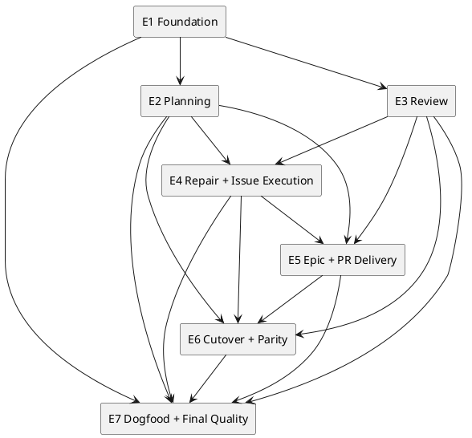

# init-00322 GPT 56 ChatGPT First Intelligence Architecture — 計画

## 1. 計画の役割、program label、現在状態

この計画は、`ChatGPT 5.6 Pro Delegation-First Workflow vNext`を7つの能力Epicへ分割し、各Epicを独立したmerge boundaryとして段階的に導入するroadmapを定義する。

- Initiative ID: `init-00322`
- 既存filesystem path: `spec-dock/initiatives/init-00322-gpt-5-6-chatgpt-first-intelligence-architecture`
- GitHub Issue: `#322`
- repository上の正式タイトル: `GPT 56 ChatGPT First Intelligence Architecture`
- vNext program label: `ChatGPT 5.6 Pro Delegation-First Workflow vNext`

本計画は完全置換用Planning candidateである。本改訂自体は`.meta.json`、GitHub Issue、`report.md`、Epic Node、dependency、Git stateを変更せず、reviewer pass、canonical adoption、execution-ready、PR-ready、merge-ready、Initiative／Epic completionを主張しない。

参照するADR、Interview、Discussion、Researchはevidenceであり、source fileのauthority自己申告だけではadoptionを成立させない。Humanの明示判断とMain Orchestratorが管理する`report.md` dispositionが有効な採用状態を決める。

## 2. Adoption／bootstrap制約

本Initiativeは将来のIntegrated Planning Bundleをdogfoodするが、adoption時点では現行SpecDockのphase promotion ruleへ従う。

```text
三文書をcomplete replacementとして配置
→ Mainがdiffを確認してplanning revision commitを作成・push
→ fresh Requirement Review
→ Requirementが通過した場合だけDesign promotion／Review
→ Designが通過した場合だけPlan promotion／Review
→ Humanが7 Epicの名称・境界・依存を承認
→ Epic Node／dependencyを作成
```

- `report.md`のevidence／adoption stateはMain Orchestratorが別途管理し、本ZIPから置換しない。
- Requirement Reviewの未解決P0／P1がある状態でDesign／Planのpromotion、Epic materializationを行わない。
- 現行gateに従うことは、vNext target architectureとしてphase別authoringを維持する意味ではない。
- 本改訂では正式タイトルを既存metadata／GitHub Issueへ合わせる。将来のtitle syncは別のHuman-authorized changeとする。

## 3. 実行原則

1. **Planning-first**  
   各Epicは実装直前にJIT Epic Planningを実施し、Issue Seed、dependency、Review Topology、Delivery Topologyを確定する。
2. **Independent delivery**  
   dependent Epicを開始する前に、原則として依存EpicをHuman merge済みにする。
3. **Small PR preference**  
   Epic内でもIssue単位または小さいbatch単位のPRを優先する。
4. **Final Quality Issue**  
   複数Issueまたはintegration riskがあるEpicは、通常IssueとしてFinal Quality／Delivery Issueを持つ。
5. **Fresh formal gates**  
   Planning、Checkpoint、Issue Delivery、Epic DeliveryをContractに応じてfreshに実行する。
6. **P0／P1 only repair**  
   P2／P3だけではbranchを変更しない。
7. **Explicit Git ownership**  
   Executorと`spec-dock-chatgpt`はGit transactionを行わず、Mainが定義済みtransitionで明示的にcommit／pushする。mergeはHumanだけが行う。
8. **No hidden migration**  
   既存Scopeの一括変換をEpicの作業へ混入させない。
9. **Provider／installed／dogfood parity**  
   shipped surfaceの変更は同じEpicまたは同じdelivery scopeで揃える。
10. **Evidence adoption boundary**  
    ChatGPT生成evidenceやADR front matterを自己完結したauthorityとして扱わず、Human判断と`report.md` dispositionを確認する。
11. **Metric-driven validation**  
    Human intervention、Main context、Codex cognitive route、parity、Workflow reliabilityをbaselineとvNextで比較する。

## 4. 成功指標の計測計画

### 4.1 Baseline

Epic 1で、可能な範囲で直近3件以上の旧Workflow実行を対象に次を記録する。

- planned／unplanned Human intervention count。
- Mainへ注入されたsub-agent／reviewer outputのtokenまたはUTF-8 byte／文字数。
- Mainがraw transcriptを明示的に読んだ回数。
- local reviewer、manual planner、Docs Writer、Repository Analyst等のinvocation数。
- maintained state／receipt／ledger surface数。
- provider／installed／dogfood差分。

### 4.2 vNext observation window

Epic 7で、cutover後の最低4週間かつ5件以上の代表Workflowを観測する。Planning、Checkpoint Repair、Issue Delivery、Epic Delivery、PR Deliveryを各1件以上含める。

### 4.3 Target

- 5件中4件以上でunplanned Human intervention 0。
- raw transcriptの必須Main読込 0。
- Main handoff payload中央値をbaseline比30%以上削減。
- maintained Workflowにおける旧local cognitive routeの必須invocation 0。
- 自動merge、未承認Node分割、無承認material変更 0。
- 新規semantic Workflow state artifact 0。
- provider／installed／dogfood parity 100%。
- 代表5 Workflowが、計画済みHuman Gateを除き完走または明確にfail closed。

Codex token／quota実量はstable telemetryがある場合だけ補助指標とし、なければMain payloadとlocal cognitive route数をproxyとする。

## 5. マイルストーン

| Milestone | 成果 | 完了条件 |
|---|---|---|
| M0 Initiative Adoption | 本Planning Bundleとevidenceのadoption手続 | fresh Requirement Review後、現行Design／Plan gateを順に満たし、Humanが7 Epicを承認し、MainがEpic Node／dependencyを作成 |
| M1 Delegation Foundation | inventory、`spec-dock-chatgpt`基盤、GitHub／Oracle binding、metrics baseline | Epic 1がHuman merge済み、exact HEAD smokeとbaseline captureが完了 |
| M2 Planning and Review Core | Integrated PlanningとFormal／Targeted Review | Epic 2・3がHuman merge済み、Planning／Review dogfoodが完了 |
| M3 Issue Execution Core | Repair Batch、Executor、Issue Execution、report target semantics | Epic 4がHuman merge済み、Issue Handoff Exit E2Eが完了 |
| M4 Delivery Core | Delivery Topology、Epic Review、PR Delivery、Human Gate | Epic 5がHuman merge済み、Merge Exit E2Eが完了 |
| M5 Global Cutover | legacy removal、parity、既存Scope互換 | Epic 6がHuman merge済み、maintained stale reference 0、parity PASS |
| M6 Final Quality | Initiative-level dogfood、metric評価、統合gate、release delivery | Epic 7がHuman merge済み、AC-001〜AC-018とM-001〜M-008を評価済み |

## 6. Epicポートフォリオ

| # | Epic | 目的 | Requirement coverage | 依存 |
|---:|---|---|---|---|
| 1 | **Delegation Foundation, Asset Inventory, and Thin ChatGPT Adapter**<br>`delegation-foundation-asset-inventory-and-thin-chatgpt-adapter` | 全vNext Epicが依存するinventory、共通authority、`spec-dock-chatgpt`の薄いOracle／GitHub boundary、metric baselineを確立する。 | REQ-001, REQ-004, REQ-005, REQ-018 | なし |
| 2 | **Integrated Planning Bundle and Planning Workflow Cutover**<br>`integrated-planning-bundle-and-planning-workflow-cutover` | Initiative／Epic／Issue Planningをcomplete-file生成、セルフレビュー、canonical placement、Formal Planning Reviewへ切り替える。 | REQ-002, REQ-003, REQ-018 | Epic 1 |
| 3 | **Contract-Driven Review Protocols and Targeted Review**<br>`contract-driven-review-protocols-and-targeted-review` | Formal／Targeted Reviewを契約駆動のScope、Perspective、structured resultへ統一する。 | REQ-006, REQ-007, REQ-008, REQ-009, REQ-018 | Epic 1 |
| 4 | **Repair Batch and Executor-Centered Issue Execution**<br>`repair-batch-and-executor-centered-issue-execution` | Formal blockerをfrozen Repair Batchへ変換し、一つのcustom ExecutorとExecution TrancheでIssueを実行する。 | REQ-010, REQ-011, REQ-012, REQ-013, REQ-016, REQ-018 | Epic 2, Epic 3 |
| 5 | **Plan-Driven Epic and PR Delivery**<br>`plan-driven-epic-and-pr-delivery` | Epic Delivery Topology、Issue／Epic Review、PR repair、Human Merge Gate、finish semanticsを実装する。 | REQ-014, REQ-015, REQ-018 | Epic 2, Epic 3, Epic 4 |
| 6 | **Global Cutover, Asset Parity, and Legacy Surface Removal**<br>`global-cutover-asset-parity-and-legacy-surface-removal` | 新surface完成後、旧Workflow／Skill／Agent／Doc／Template／Scriptを除去し、全ScopeをvNextへcutoverする。 | REQ-016, REQ-017, REQ-018 | Epic 2, Epic 3, Epic 4, Epic 5 |
| 7 | **End-to-End Dogfood, Final Quality, and Release**<br>`end-to-end-dogfood-final-quality-and-release` | vNext全体を実際のScopeとPRでdogfoodし、全REQ／AC、metrics、統合品質、運用性、変更耐性を検証する。 | REQ-001〜REQ-019 | Epic 1〜Epic 6 |

## 7. Epic詳細

### Epic 1: Delegation Foundation, Asset Inventory, and Thin ChatGPT Adapter

- 推奨slug: `delegation-foundation-asset-inventory-and-thin-chatgpt-adapter`
- 目的:
  - 全vNext Epicが依存する現状inventory、authority境界、薄いCLI／Oracle／GitHub binding、metrics baselineを確立する。
- Requirement coverage:
  - REQ-001, REQ-004, REQ-005, REQ-018
- 依存:
  - なし
- 主成果物:
  - maintained Skill／Agent／Workflow／Template／Scriptのprovider／installed／dogfood inventory
  - `spec-dock-chatgpt` application boundaryとcommand skeleton
  - target resolution、Git sync preflight、Context assembly、Oracle process adapter
  - `workflow_chatgpt_delegation.md`
  - Human Relay contractとOracle live smoke scaffold
  - M-001〜M-006のlegacy baseline capture
  - Foundation-level tests and parity checks
- 対象外:
  - Planning／Review／Repairの最終Prompt本文
  - 旧Planning／Reviewer／Execution surfaceの削除
- Epic completion criteria:
  - command boundaryとhelp skeletonが利用可能
  - clean／dirty、ahead／behind、detached、missing upstreamをfail closedで判定
  - `spec-dock-chatgpt`がhidden Git transactionを行わないことをtestで確認
  - Oracle browser invocationとsession referenceを確認
  - exact GitHub branch／HEAD smokeが成功または明確にblocked
  - inventoryが後続Epicの改訂／削除対象を網羅
  - baseline metricsが取得可能な範囲で記録される
- Delivery boundary:
  - 独立したmerge boundary。
  - 複数Issueの場合はFinal Quality／Delivery Issueを原則計画。
  - Human merge後にEpic完了を反映。

### Epic 2: Integrated Planning Bundle and Planning Workflow Cutover

- 推奨slug: `integrated-planning-bundle-and-planning-workflow-cutover`
- 目的:
  - Initiative／Epic／Issue Planningをcomplete-file生成、セルフレビュー、canonical placement、Formal Planning Reviewへ切り替える。
- Requirement coverage:
  - REQ-002, REQ-003, REQ-018
- 依存:
  - Epic 1
- 主成果物:
  - `workflow_planning.md`とvNext Initiative／Epic／Issue Planning Skills
  - Planning create／revise Promptとoutput contract
  - legacy Identify frontmatterを持たないPlanning templates
  - 旧`spec-dock-chatgpt-authoring`とmanual planning Skillsの削除
  - Planning candidate commit／push／Review／Human decomposition gate
  - Node materialization and dependency handoff tests
- 対象外:
  - Checkpoint／Delivery Reviewの最終実装
  - Issue Execution／PR Deliveryの全面改訂
- Epic completion criteria:
  - 3つのPlanning SkillがChatGPT integration boundaryを利用
  - ChatGPT生成三文書が意味的再執筆なしで配置
  - P0／P1でcomplete bundle revision、P2／P3のみでnon-blocking
  - Human approval後だけ子Nodeを作成
  - evidence front matterだけでadoptionを成立させない
- Delivery boundary:
  - 独立したmerge boundary。Human merge後に完了反映。

### Epic 3: Contract-Driven Review Protocols and Targeted Review

- 推奨slug: `contract-driven-review-protocols-and-targeted-review`
- 目的:
  - Planning／Checkpoint／DeliveryのFormal ReviewとTargeted Reviewを、契約駆動のScope、Perspective、structured resultへ統一する。
- Requirement coverage:
  - REQ-006, REQ-007, REQ-008, REQ-009, REQ-018
- 依存:
  - Epic 1
- 主成果物:
  - `workflow_review.md`
  - Planning／Checkpoint／Issue Delivery／Epic Delivery／Targeted Review Prompt
  - semantic BASEとDelta-bounded Snapshot Review
  - `repository-conventions`を含むPerspective catalog
  - Protocol別result contractsとmodel smoke
  - `spec-dock-targeted-review` Skill
  - local `spec-reviewer`／`code-reviewer`／`qa-reviewer` removal
- 対象外:
  - Repair Batch implementation
  - GitHub Codex PR Review removal
- Epic completion criteria:
  - PlanningはSnapshot、Checkpoint／Deliveryはsemantic BASE、PR-styleはmerge-base
  - P0／P1、P2／P3、insufficient evidenceが期待どおり
  - fresh Reviewへ前回findingを混入しない
  - Targeted Reviewはadvisoryでrepositoryを変更しない
  - repository-conventionsが規約なしでN/A
- Delivery boundary:
  - 独立したmerge boundary。Human merge後に完了反映。

### Epic 4: Repair Batch and Executor-Centered Issue Execution

- 推奨slug: `repair-batch-and-executor-centered-issue-execution`
- 目的:
  - Formal blockerをfrozen Repair Batchへ変換し、一つのcustom ExecutorとExecution TrancheでIssueを実行する。
- Requirement coverage:
  - REQ-010, REQ-011, REQ-012, REQ-013, REQ-016, REQ-018
- 依存:
  - Epic 2, Epic 3
- 主成果物:
  - `workflow_repair_batch.md`とRepair Batch generation
  - custom ExecutorとMarkdown handoff contract
  - read-only specialist設定、不要Agent削除
  - Execution Tranche／Checkpoint／Repairを持つ`workflow_issue.md`とIssue Execution Skill
  - Final Completion Summaryとしての`report.md` target template／guidance
  - Main-owned Git transitionとrepresentative Issue E2E
- 対象外:
  - Epic Delivery Topologyの完全実装
  - PR monitor／merge gateの全面改訂
- Epic completion criteria:
  - Source HEADごとのRepair Batchがfreeze
  - material契約変更ではPlanningへ戻る
  - Executorとintegration CLIがcommit／pushしない
  - Mainがdiff／verification確認後に明示commit／push
  - 同一Issueのbounded repairを同じExecutorへ戻せる
  - Issue Handoff ExitをE2Eで完了
- Delivery boundary:
  - 独立したmerge boundary。Human merge後に完了反映。

### Epic 5: Plan-Driven Epic and PR Delivery

- 推奨slug: `plan-driven-epic-and-pr-delivery`
- 目的:
  - Epic Delivery Topology、Issue／Epic Review、Delivery Owner、PR repair、Human Merge Gate、finish semanticsを実装する。
- Requirement coverage:
  - REQ-014, REQ-015, REQ-018
- 依存:
  - Epic 2, Epic 3, Epic 4
- 主成果物:
  - Delivery Topologyを扱うEpic Planning／Epic Execution
  - Issue Exit ContractのHandoff／Merge経路
  - Delivery Owner IssueとEpic-level integration obligations
  - 簡素化されたPR Delivery Skill
  - CI／GitHub Codex Review／ChatGPT Delivery Reviewの統合
  - merge-prepared、Human Merge Gate、merge確認後finish
- 対象外:
  - 自動merge
  - GitHub Codex PR Reviewの一本化判断
- Epic completion criteria:
  - per-Issue／batch／Epic-wide deliveryをPlanで表現
  - Issue ReviewとEpic Reviewを異なるContract Ownerで実行
  - P2／P3だけでbranchを変更しない
  - 修復後の新HEADで必要なgateを再観測
  - Human merge前にfinishせず、merge後にreviewed headを確認
- Delivery boundary:
  - 独立したmerge boundary。Human merge後に完了反映。

### Epic 6: Global Cutover, Asset Parity, and Legacy Surface Removal

- 推奨slug: `global-cutover-asset-parity-and-legacy-surface-removal`
- 目的:
  - 新surface完成後、旧Workflow／Skill／Agent／Doc／Template／Scriptを除去し、全ScopeをvNextへcutoverする。
- Requirement coverage:
  - REQ-016, REQ-017, REQ-018
- 依存:
  - Epic 2, Epic 3, Epic 4, Epic 5
- 主成果物:
  - provider／installed／dogfood parity
  - 旧authoring lane、manual planning、local reviewers、custom Explorer、Repository Analyst、Docs Writerの削除
  - `workflow_spec_authoring.md`等の置換／リンク整理
  - existing Scope cutover guidance and planning-gap refresh path
  - repository-wide stale reference and compatibility tests
  - install／upgrade／dogfood smoke
- 対象外:
  - 既存Scope文書の一括変換
  - closed Scopeの書き換え
- Epic completion criteria:
  - maintained surfaceに旧Workflow参照がない
  - provider／installed／dogfoodが一致
  - 既存open Scopeが文書移行なしでvNextへ入る
  - 必要契約が不足する場合だけ局所refresh
  - closed Scopeが変更されない
- Delivery boundary:
  - 独立したmerge boundary。Human merge後に完了反映。

### Epic 7: End-to-End Dogfood, Final Quality, and Release

- 推奨slug: `end-to-end-dogfood-final-quality-and-release`
- 目的:
  - vNext全体を実際のScopeとPRでdogfoodし、全REQ／AC、metrics、統合品質、運用性、変更耐性を検証する。
- Requirement coverage:
  - REQ-001〜REQ-019
- 依存:
  - Epic 1〜Epic 6
- 主成果物:
  - Initiative／Epic／Issue Planning dogfood
  - Checkpoint ReviewとRepair Batch dogfood
  - Issue Handoff ExitとEpic Merge Exit dogfood
  - Oracle exact branch／SHA、structured result、file outputのlive smoke
  - dual-reviewの差分、取りこぼし、待ち時間の観測
  - M-001〜M-008 evaluation report
  - changeability drill
  - Initiative Final Completion Summary、docs、release delivery
- 対象外:
  - ChatGPT／Codex Review一本化の強制
  - 次世代Oracle UIへの先回り実装
- Epic completion criteria:
  - AC-001〜AC-018の証拠が揃う
  - M-001〜M-008が評価され、未測定項目は戦略仮説として明示
  - Initiative-level integration／E2EがPASS
  - 最新HEADでChatGPT Delivery Review、CI、GitHub Codex PR Reviewがterminal
  - merge-preparedでHuman Gateへ停止
  - Human merge後にInitiative完了条件を確認
- Delivery boundary:
  - 独立したmerge boundary。Human merge後に完了反映。

## 8. 依存DAGと並列化



- Epic 2とEpic 3はEpic 1のHuman merge後に並列Planning／実装できる。
- Epic 4はPlanning outputとReview Protocolの双方へ依存する。
- Epic 5はIssue ExecutionのExit ContractとRepair loopへ依存する。
- Epic 6のinventory／search設計は早期準備できるが、destructive removalはEpic 2〜5 merge後に行う。
- Epic 7は全Epicを統合したInitiative Contractとmetricsを評価する。

## 9. Initiative意思決定ゲート

### G0 Bootstrap Adoption

1. Mainが本三文書を既存pathへ完全置換する。
2. `report.md`を置換せず、evidence／ADR／Bundleのadoption dispositionを既存`report.md`へ記録する。
3. Mainがdiffを確認し、planning revision commitを明示的に作成してpushする。
4. fresh Requirement Reviewを実行する。
5. RequirementのP0／P1をcomplete bundle revisionで解消する。
6. Requirement pass後に現行WorkflowどおりDesign Reviewへ進む。
7. Design pass後にPlan Reviewへ進む。
8. Humanが7 Epicの名称、境界、依存を承認する。
9. MainがEpic Node／dependencyを作成し、validate／syncする。

このgateは未来状態を主張せず、adoptionに必要な順序だけを定義する。

### G1 Foundation Readiness

- Asset inventoryがprovider／installed／dogfoodを網羅する。
- CLI preflightとOracle adapterのlive smokeが成立する。
- no-hidden-Git testがPASSする。
- baseline metricsが取得される。
- 後続Epicが依存できるshared contractがHuman merge済みである。

### G2 Planning／Review Readiness

- Planning Bundleを実際のScopeで生成、配置、Reviewできる。
- Formal ReviewとTargeted Reviewのresultが安定する。
- old authoring／manual／local reviewerへの必須依存が外れている。

### G3 Execution Readiness

- ExecutorとIssue ExecutionがHandoff Exitを完了できる。
- Checkpoint FAILからRepair Batchを経てfresh gateへ戻れる。
- Mainだけが定義済みtransitionでcommit／pushする。

### G4 Delivery Readiness

- Epic Delivery TopologyとDelivery OwnerをPlanで表現できる。
- Issue ReviewとEpic Reviewを分離できる。
- PR repair、dual review、Human Merge Gate、finish確認が動作する。

### G5 Cutover Readiness

- maintained surfaceの旧参照が0である。
- provider／installed／dogfood parityがPASSする。
- existing open Scopeのno-migration replayがPASSする。

### G6 Initiative Final Quality

- AC-001〜AC-018のtraceabilityと実証証拠がある。
- M-001〜M-008が観測期間に基づき評価される。
- latest HEADでChatGPT Delivery Review、CI、GitHub Codex PR Reviewがterminalである。
- Initiative `report.md`がFinal Completion Summaryとして完成する。
- merge-prepared後にHuman mergeを待つ。

## 10. Requirement／AC／Epic traceability

### 10.1 Requirement coverage

| Requirement | 主なEpic |
|---|---|
| REQ-001 | Epic 1, Epic 7 |
| REQ-002〜REQ-003 | Epic 2, Epic 7 |
| REQ-004〜REQ-005 | Epic 1, Epic 7 |
| REQ-006〜REQ-009 | Epic 3, Epic 7 |
| REQ-010〜REQ-013 | Epic 4, Epic 7 |
| REQ-014〜REQ-015 | Epic 5, Epic 7 |
| REQ-016 | Epic 4, Epic 6, Epic 7 |
| REQ-017 | Epic 6, Epic 7 |
| REQ-018 | Epic 1〜Epic 7 |
| REQ-019 | Epic 7 |

### 10.2 Acceptance Criteria coverage

| Acceptance Criteria | 主なEpic |
|---|---|
| AC-001〜AC-002 | M0, Epic 1, Epic 7 |
| AC-003 | Epic 2 |
| AC-004 | Epic 1 |
| AC-005〜AC-007 | Epic 3 |
| AC-008〜AC-011 | Epic 4 |
| AC-012〜AC-015 | Epic 5 |
| AC-016〜AC-017 | Epic 6 |
| AC-018 | Epic 7 |

## 11. Epic materialization handoff

Human approval後、次の順でEpic Nodeを作成する。

1. Delegation Foundation, Asset Inventory, and Thin ChatGPT Adapter
2. Integrated Planning Bundle and Planning Workflow Cutover
3. Contract-Driven Review Protocols and Targeted Review
4. Repair Batch and Executor-Centered Issue Execution
5. Plan-Driven Epic and PR Delivery
6. Global Cutover, Asset Parity, and Legacy Surface Removal
7. End-to-End Dogfood, Final Quality, and Release

Dependency edgeは名前と意味で作成し、永続Seed IDやmapperを導入しない。Node materializationだけを理由にInitiative Bundleを書き換えない。

## 12. Epic handoff readiness

各Epicへ最低限渡すもの:

- Initiative `requirement.md`、`design.md`、`plan.md`。
- Human／`report.md` dispositionが確認できる関連ADR evidence。
- Epicの目的、Scope、Non-goal、Requirement／AC coverage。
- 依存EpicとHuman merge状態。
- 現行repository inventory／影響surface。
- 必須Human Gate。
- Epic completion criteriaとDelivery boundary。
- metricsへの責務。

Epic Planningは、上記をもとにIssue Seed、dependency、Review Topology、Delivery Owner IssueをJITで具体化する。

## 13. Controlled re-slicing

Epicの追加、分割、統合を許容するのは次の場合である。

- 既存Epicが独立した複数Delivery Boundaryを含み、同一Epicとして大きすぎる。
- external dependencyまたはOracle／GitHub制約により別risk boundaryが必要。
- provider／installed／dogfood parityを同一Epicで安全に完了できない。
- Final Qualityで独立workstreamが発見され、既存Epicのbounded repairを超える。
- materialなArchitecture／Scope変更がHumanに承認された。

単なるfile数、Issue数、model提案だけを理由にre-sliceしない。変更時はInitiative三文書を更新し、fresh reviewとHuman approvalを得る。

## 14. Verification計画

### 14.1 Cross-Epic mandatory tests

- CLI help／argument validation。
- Git state matrixとno-hidden-Git transaction。
- exact repository／branch／HEAD smoke。
- Planning file completeness and content-preserving placement。
- Review result semantics and binding。
- repository-conventions applicable／N/A。
- Repair Batch freeze and authority。
- Executor no-commit／no-push。
- Issue Handoff Exit。
- Epic Merge Exit。
- PR P0／P1 repair and P2／P3 no-mutation。
- provider／installed／dogfood parity。
- existing Scope no-migration replay。
- Human Relay。
- evidence self-assertionがadoptionにならないこと。
- Human／Main context／Codex proxy metrics。

### 14.2 Review strategy

- 各EpicのIssueはIssue Delivery Reviewを通す。
- 複数Issue EpicはFinal Quality／Delivery IssueでEpic Delivery Reviewを通す。
- GitHub PRではChatGPT Delivery ReviewとGitHub Codex PR Reviewを当面併用する。
- Final Epicは各Epicの局所Reviewをやり直さず、Initiative-level integration、Non-goal、metricsを評価する。

## 15. Rollout／cutover

1. Epic 1〜5でnew surfaceを導入し、各Human merge後に後続を進める。
2. 旧surfaceを利用する作業を新たに増やさない。
3. Epic 6で旧surfaceを除去し、全Scopeの次操作をvNextへ切り替える。
4. existing Scopeは変換しない。
5. 実行に必要な契約が欠けるScopeだけPlanning refreshする。
6. rollbackは旧Workflowの長期共存ではなく、未merge Epicのrevertまたはnew surfaceの局所修正で行う。
7. Epic 7で代表Scopeをdogfoodし、metricsとrelease可能性を判断する。

## 16. Final completion criteria

- 7 EpicがPlanどおり完了し、全PRがHumanによりmerge済み。
- 全REQとACがtraceabilityと実証証拠で説明できる。
- maintained Skill／Agent／Workflow／Template／Scriptに旧必須surfaceが残っていない。
- provider／installed／dogfood parityがPASS。
- Planning、Review、Repair、Issue Execution、Epic Delivery、PR DeliveryのE2EがPASS。
- existing Scope no-migration replayがPASS。
- M-001〜M-008が評価され、実量未測定のquota削減は戦略仮説として明示される。
- Initiative `report.md`がFinal Completion Summaryとして完成。
- 未解決P0／P1、required CI failure、merge conflict、Human Gate待ちがない。
- 残存P2／P3とdual-review評価が将来判断へhandoffされる。

## 17. 次の即時アクション

1. 本ZIPの`initiative/requirement.md`、`initiative/design.md`、`initiative/plan.md`を既存`init-00322`の三文書へ完全置換する。
2. `.meta.json`、GitHub Issue #322、Initiative path、`report.md`、Epic Nodeを本作業では変更しない。
3. Main Orchestratorがdiffとevidence sourceを確認し、`report.md`へ本改訂Bundleと関連evidenceのadoption dispositionを記録する。
4. Main Orchestratorがplanning revision commitを明示的に作成してpushする。
5. fresh Requirement Reviewを実行する。
6. P0／P1があれば、三文書をcomplete replacementとして再改訂する。
7. Requirement pass後、現行Workflowに従ってDesign Review、Plan Reviewへ順に進む。
8. 全Planning gate後、Humanが7 Epicの名称、境界、依存を承認する。
9. MainがEpic Node／dependencyを作成し、validate／syncする。
10. Epic 1 Planningへ進む。
