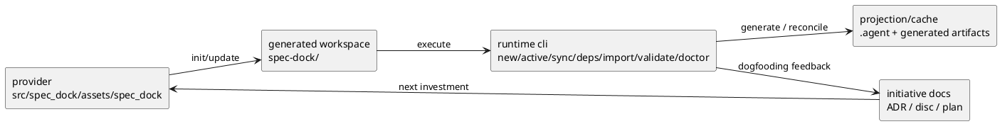

# init-local-00001 Dogfooding Prototype — 設計（HOW / Guardrails）

## アーキテクチャ上の狙い
- provider/source と consumer/generated workspace を明確に分離したまま、同一 repo 内での dogfooding を成立させる。
- hybrid layered architecture を durable decision として維持し、runtime contract を層ごとに閉じる。
- repo-scoped exact targeting、create/recovery contract、diagnostics、checked-in parity を prototype の中核 guardrail として固定する。
- runtime を「曖昧さを自動補完する」方向ではなく、「曖昧さを説明可能な fail-closed で止める」方向で運用可能にする。

## 現状と目指す姿
- As-Is:
  - `new / active / sync / deps / import / validate / doctor` を中心とした runtime surface は成立しており、manual rerun で major path が確認済みである。
  - canonical URL と `--id` による repo-scoped exact resolution、already-normalized metadata の no-origin continuity、stale active recovery、readonly `.meta.json` non-mutation、checked-in parity が current contract になっている。
  - 一方で legacy unscoped current-repo metadata の persistence upgrade は automatic self-heal せず、manual remediation gap として残っている。
- To-Be:
  - initiative 正本が current runtime contract と remaining boundary を反映し、dogfooding 再開の運用判断を直接支えられる。
  - provider/check-in parity と outcome-matrix closure が設計 guardrail として明文化される。
  - remaining work は manual remediation / operator guidance / lifecycle expansion へ整理され、既存 contract を壊さずに続行できる。

### UML（任意: high-level context / target-state）

## 対象境界 / 依存
- in scope:
  - repo-aware exact targeting
  - fail-closed ambiguity behavior
  - create/import/sync/validate/doctor の contract closure
  - no-origin continuity for normalized metadata
  - active recovery / non-mutation / readonly handling
  - provider/check-in parity discipline
  - remaining manual remediation / operator guidance の境界整理
- external dependency:
  - GitHub CLI / GitHub issue state
  - local filesystem に配置された generated workspace
  - manual test artifacts と dogfooding 実運用
- boundary policy:
  - provider 側の実装正本は `src/spec_dock/` に置く。
  - `spec-dock/` は consumer/generated workspace と active docs の正本である。
  - artifact / `.meta.json` / active manifest は authority ではなく projection/cache または runtime-managed metadata として扱う。
  - legacy data gap を理由に unsafe self-heal を導入しない。

## ガードレール
- 互換性:
  - additive migration を前提にし、existing artifact / metadata の意味を破壊的に変えない。
  - already-normalized metadata continuity を守り、legacy gap は explicit に切り出す。
- セキュリティ:
  - external mutation は opt-in とする。
  - wrong-repo risk を避ける repo-aware exact targeting と fail-closed ambiguity を維持する。
- データ境界:
  - `1 issue = 1 authority`
  - artifact は projection/cache
  - `id/path` は immutable
  - overlap / no-origin / legacy metadata が絡むときも silent correction はしない
- 品質条件:
  - create / recovery / sync は outcome 単位で contract を閉じる。
  - provider/check-in parity は incidental ではなく explicit contract として扱う。
  - stale / partial / ambiguous / blocked は validate / doctor / sync surface で説明可能にする。
  - legacy unscoped metadata は automatic backfill の対象にしない。

## ロールアウト原則
- rollout strategy:
  - usable runtime を維持しながら、remaining work を小さな契約追加として進める。
  - future capability は既存 path を壊さない additive rollout で導入する。
- rollback principle:
  - unsafe automation を追加するくらいなら current fail-closed contract を維持する。
  - recovery は destructive overwrite ではなく non-destructive repair を優先する。
- feature flag principle:
  - GitHub など外部副作用を伴う path は explicit invocation を維持する。

## 観測性 / NFR 原則
- observability:
  - current state / ambiguity / stale / blocked / next action を `validate` / `doctor` / `sync` で追えるようにする。
  - manual rerun や dogfooding で得た lesson を discussion / ADR へ昇格できるようにする。
- performance / reliability:
  - sync/update の信頼性を落とさず、partial failure は説明可能にする。
  - readonly metadata、stale active、broken entrypoint など運用上の壊れ方を安全側で扱う。
- audit / compliance:
  - どの selector / metadata / authority を採用したかが説明可能であること。
  - provider/check-in parity と runtime contract が文書上追跡可能であること。

## 主要リスク
- R-001:
  - current fail-closed contract を文書化しないまま remaining work を進めると、unsafe self-heal や selector widening に戻りやすい。
- R-002:
  - parity maintenance を軽視すると、provider/source と checked-in runtime で別の挙動が出て dogfooding 信頼性が落ちる。
- R-003:
  - manual remediation gap を issue-level bug と混同すると、prototype completion と次投資の境界が崩れる。

## 関連 ADR
- discussions/001-adr-adopt-dogfooding.md:
  - dogfooding 採用と repo docs 正本化
- discussions/002-adr-agentic-cli-roadmap.md:
  - staged rollout と authority 原則
- discussions/004-adr-runtime-cli-layered-architecture.md:
  - hybrid layered architecture の durable decision
- discussions/005-disc-review-loop-and-outcome-matrix-lessons.md:
  - outcome-matrix closure と parity-as-contract
- discussions/006-disc-repo-scope-and-create-state-lessons.md:
  - repo-scope / create-state / manual remediation 境界
- discussions/007-disc-manual-rerun-current-state.md:
  - current runtime usability と caveat

## 未確定事項
- Q-001:
  - 質問:
    - remaining work の主軸を、manual remediation / operator guidance に置くか、link/unlink / remote lifecycle expansion に置くか。
  - 選択肢:
    - A:
      - remediation / guidance を先に扱う。
    - B:
      - lifecycle expansion を先に扱う。
  - 推奨案:
    - A。current runtime は利用可能だが、残る friction は correctness より remediation / guidance の不足に寄っているため。
  - 影響範囲:
    - plan の epic 優先順
    - prototype completion 判定後の follow-up ownership
