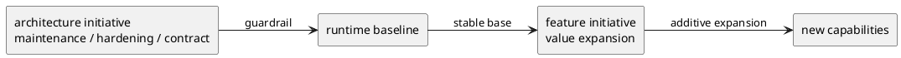

# init-local-00002 Prototype Feature Expansion — 設計（HOW / Guardrails）

## アーキテクチャ上の狙い
- feature initiative を architecture initiative から明確に分離し、価値拡張の計画を読みやすくする。
- feature work が architecture cleanup を内包しないよう、dependency と guardrail を明示する。
- runtime の既存 layered architecture と safety posture を前提に、機能を additive に積み上げる。

## 現状と目指す姿
- As-Is:
  - prototype は dogfooding できる baseline を持つが、feature backlog と hardening backlog が旧 initiative で混在していた。
  - そのため、機能価値の追加と architecture maintenance の優先順位が見えにくかった。
- To-Be:
  - feature initiative は、prototype の利用価値を拡張する epic のみを持つ。
  - architecture 由来の cleanup や source-of-truth 問題は別 initiative に集約される。
  - feature work は architecture initiative 側の guardrail を dependency として受ける。

### UML（high-level context / target-state）

## 対象境界 / 依存
- in scope:
  - core workflow の feature expansion
  - operator-facing capability の拡張
  - GitHub / collaboration / workflow completeness に関わる feature expansion
- external dependency:
  - `init-local-00003 Architecture Maintenance and Hardening`
  - current runtime baseline
- boundary policy:
  - architecture cleanup は architecture initiative に置く。
  - feature epic は利用者価値単位で切る。

## ガードレール
- 互換性:
  - additive change を前提にし、現行 baseline を壊さない。
- セキュリティ:
  - repo-safe posture と opt-in mutation を維持する。
- データ境界:
  - existing source-of-truth rule を前提にし、feature initiative で再定義しない。
- 品質条件:
  - feature expansion のたびに architecture initiative 側の blocker を再確認する。

## ロールアウト原則
- rollout strategy:
  - feature は small coherent units で追加する。
  - architecture blocker がある場合は先にそちらを閉じる。
- rollback principle:
  - guardrail を破る feature は保留し、先に architecture initiative 側で是正する。
- feature flag principle:
  - 外部副作用を伴う feature は明示起動を維持する。

## 観測性 / NFR 原則
- observability:
  - feature が prototype value にどう効くか説明できること。
- performance / reliability:
  - 新規機能で validate/sync/doctor の基本導線を壊さない。
- audit / compliance:
  - architecture initiative 側の contract を破っていないことを確認できること。

## 主要リスク
- R-001:
  - value-based epic ではなく implementation-based epic に戻ると、initiative の意味が薄れる。
- R-002:
  - architecture dependency を軽視すると、feature expansion が cleanup debt を増幅する。

## 関連 ADR
- `../init-local-00003-architecture-maintenance-and-hardening/discussions/001-disc-architecture-gap-review.md`:
  - architecture gap と guardrail

## 未確定事項
- Q-001:
  - 質問:
    - feature initiative の最初の epic を workflow completeness に置くか、operator convenience に置くか。
  - 選択肢:
    - A:
      - workflow completeness
    - B:
      - operator convenience
  - 推奨案:
    - A
  - 影響範囲:
    - feature epic の順序
