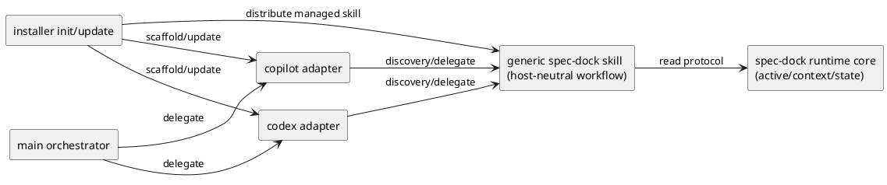
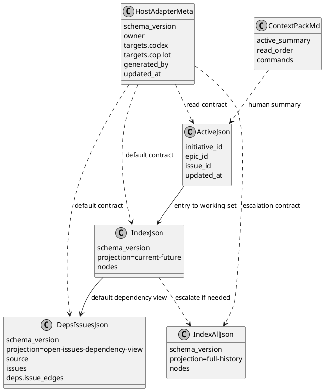
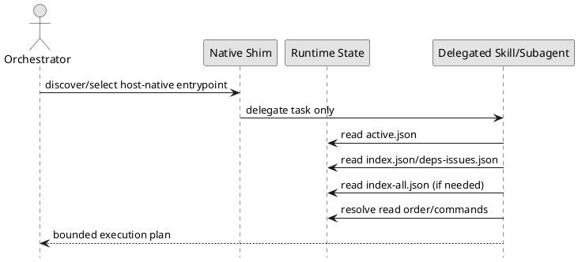

# epic-00048 Agent facing interface hardening and host adapter scaffolding — 設計（HOW）

## 全体像
- target boundary:
  - host-neutral protocol（core）
  - host 非依存 workflow skill（generic）
  - thin host adapter skill（codex/copilot）
  - extension 後の host-native shim（`.codex/agents/*.toml` / `.github/agents/*.agent.md`）
- impacted area:
  - active/context 生成、derived state 読み取り、installer managed asset 配布、docs parity
- existing relation:
  - 既存 `.agents/skills` 配布機構を利用しつつ、state contract を先に固定する。

### UML（module / context）


## 契約
### API（CLI 契約）
- API-001 `spec-dock active show`:
  - Request:
    - active 設定状態の表示要求。
  - Response:
    - active ノード、参照パス、補助ガイダンス。
  - Errors:
    - active 未設定時は placeholder を示す。
- API-002 `spec-dock sync` / `spec-dock validate`:
  - Request:
    - state 再生成 / 整合検証。
  - Response:
    - `.agent` 生成物更新 / 検証結果。
  - Errors:
    - required artifact 欠落、構造不整合。
- API-003 `spec-dock init` / `spec-dock update`:
  - Request:
    - managed asset 同期。
  - Response:
    - `.agents/skills/*` と `.agents/host-adapters/meta.json` の整合。
    - extension 後は `.codex/agents/*.toml` / `.github/agents/*.agent.md` を含む native shim managed deployment の整合。
  - Errors:
    - required managed file 欠落、manifest 不整合。

### Native shim contract
- adopted decision:
  - native shim manifest の正本は `.agents/host-adapters/meta.json` に固定し、canonical managed target filename は `.codex/agents/spec-dock.toml` と `.github/agents/spec-dock.agent.md` に固定する。
  - native shim contract は `targets.<host>.native_shim.{managed,owner,target_file,source_of_truth_asset,delegates_to,obsolete_managed_paths}` の exact shape を採用済みとし、alternative shape は残さない。
- canonical managed target:
  - Codex native shim target は `.codex/agents/spec-dock.toml` とする。
  - Copilot native shim target は `.github/agents/spec-dock.agent.md` とする。
- canonical gate-2 fixtures:
  - obsolete managed native shim fixture は `/tmp/spec-dock-native-shim-smoke/.codex/agents/spec-dock-codex-adapter.toml` と `/tmp/spec-dock-native-shim-smoke/.github/agents/spec-dock-copilot-adapter.agent.md` とする。
  - unknown custom native shim fixture は `/tmp/spec-dock-native-shim-smoke/.codex/agents/custom-reviewer.toml` と `/tmp/spec-dock-native-shim-smoke/.github/agents/custom-reviewer.agent.md` とする。
  - gate-2 canonical command sequence は `uvx --from . spec-dock init /tmp/spec-dock-native-shim-smoke` -> fixture 配置 -> `uvx --from . spec-dock update /tmp/spec-dock-native-shim-smoke` とする。
  - fixture 配置は `mkdir -p /tmp/spec-dock-native-shim-smoke/.codex/agents /tmp/spec-dock-native-shim-smoke/.github/agents`、obsolete managed fixture 2 件の配置、unknown custom fixture 2 件の配置を指す。
  - gate-2 report schema は `managed_codex_shim_generated_or_updated`, `managed_copilot_shim_generated_or_updated`, `obsolete_managed_fixture_pruned`, `unknown_custom_fixture_preserved`, `baseline_skill_and_metadata_untouched` を固定キーとして持ち、各キーは `expected`, `observed`, `pass` で記録する。
  - `gate_2_sync_prune_pass` は上記 5 固定 subcheck の `pass` が全て `true` の場合のみ `true` とする。
- ownership manifest contract:
  - native shim の managed ownership/source-of-truth/obsolete path 判定は `.agents/host-adapters/meta.json` を単一 manifest file として固定する。
  - exact field は `targets.codex.native_shim` / `targets.copilot.native_shim` 配下の `managed`, `owner`, `target_file`, `source_of_truth_asset`, `delegates_to`, `obsolete_managed_paths` とする。
  - sync/update は `target_file` と `source_of_truth_asset` を正本に生成・更新し、tests の委譲期待値は `delegates_to` を参照し、prune は `obsolete_managed_paths` に列挙された exact path のみを obsolete managed file として扱う。
  - `.codex/agents/` / `.github/agents/` 配下の file でも、manifest に `target_file` または `obsolete_managed_paths` として現れない path は unknown custom file として preserve する。
- delegation contract:
  - `.codex/agents/spec-dock.toml` は `.agents/skills/spec-dock-codex-adapter/SKILL.md` へ委譲する thin shim として記述する。
  - `.github/agents/spec-dock.agent.md` は `.agents/skills/spec-dock-copilot-adapter/SKILL.md` へ委譲する thin shim として記述する。
  - native shim 自体は discovery/delegation only とし、protocol state read や read order 解決を持たず、委譲先の skill/subagent へ橋渡しするだけとする。
- non-reimplementation contract:
  - native shim 本文には `active.json` / `index.json` / `deps-issues.json` / `index-all.json` / `read-order` / `read order` を書かない。
  - native shim は `schema_version` / `projection` / `nodes` / `issues` / `deps` / `source` / `updated_at` のような state payload key や、その同等内容を shim 本文へ再定義しない。
  - native shim は host metadata と委譲 guidance のみを持ち、`.agent/*.json` や `context-pack.md` の中身を inline しない。

### Event（生成イベント）
- EVT-001 installer managed-asset sync:
  - Producer:
    - `spec-dock init` / `spec-dock update`
  - Consumer:
    - `.agents/skills` の generic skill / adapter skill
    - `.agents/host-adapters/meta.json`
    - extension 後の `.codex/agents/*.toml` / `.github/agents/*.agent.md` native shim
  - Payload:
    - 配布対象ファイル、version marker、ownership。
    - native shim を含む managed / unmanaged 判定に必要な source-of-truth と prune 境界。

### Data boundary
- SoR:
  - `active.json` は entry / current target を示す最小文脈。
  - `index.json` は default working set / current-future projection。
  - `deps-issues.json` は open/todo issue 向けの default dependency view。
  - `index-all.json` は full-history / audit / search / escalation only。
  - `context-pack.md` は human summary only であり、唯一正本ではない。
  - `.agents/skills/*` は spec-dock 操作 guidance の正本。
  - extension 後の `.codex/agents/*.toml` / `.github/agents/*.agent.md` は host-native discovery 用 thin shim であり、`.agents/skills/*` に委譲する契約範囲に含む。
- consistency model:
  - 通常実行は `active.json` -> `index.json` / `deps-issues.json` の順で current/future を解決する。
  - `index-all.json` は full-history が必要な場合にのみ追加参照する。
  - host adapter は上記 state を読み取るのみで、再計算しない。
  - native shim 自体は state を読まず、discovery/delegation 後に委譲先の skill/subagent が同じ state contract を read-only で参照する。

## データモデル
- model / table changes:
  - 既存 host adapter metadata（`.agents/host-adapters/meta.json`）を採用し、adapter skill の managed mapping を保持する。
  - runtime state schema は後方互換を維持しつつ、docs で責務を明示する。
- invariants:
  - `active.json` は entry / current target の最小文脈。
  - `index.json` は default working set / current-future projection。
  - `deps-issues.json` は open/todo issue 向け dependency view。
  - `index-all.json` は full-history / audit / search / escalation only。
  - `context-pack.md` は human summary only。
  - `.agents/skills/*` が adapter guidance の正本である。
  - host adapter は runtime state を複製しない。
  - native shim は `.agents/skills/*` へ委譲する thin shim であり、runtime state を複製しない。

### JSON / manifest shape（例）
```json
{
  "active.json": {
    "initiative": {"id": "init-local-00002", "path": "..."},
    "epic": {"id": "epic-00048", "path": "..."},
    "issue": null,
    "updated_at": "2026-04-04T00:00:00Z"
  },
  "index.json": {
    "schema_version": 2,
    "projection": "current-future",
    "nodes": {
      "epic-00048": {
        "type": "epic",
        "id": "epic-00048",
        "title": "Agent facing interface hardening and host adapter scaffolding",
        "status": "open",
        "path": "spec-dock/initiatives/.../epic-00048-agent-facing-interface-hardening-and-host-adapter-scaffolding",
        "deps": {"ready": true, "depends_on": [], "blockers_top": []}
      }
    }
  },
  "deps-issues.json": {
    "schema_version": 2,
    "projection": "open-issues-dependency-view",
    "source": {"index": "spec-dock/.agent/index.json", "schema_version": 2},
    "issues": {},
    "deps": {
      "issue_edges": [
        {"from": "iss-xxxxx", "to": "iss-yyyyy"}
      ]
    }
  },
  "index-all.json": {
    "schema_version": 2,
    "projection": "full-history",
    "nodes": {}
  },
  "host_adapter_meta": {
    "schema_version": 2,
    "owner": "spec-dock",
    "targets": {
      "codex": {
        "enabled": true,
        "entry_file": ".agents/skills/spec-dock-codex-adapter/SKILL.md",
        "native_shim": {
          "managed": true,
          "owner": "spec-dock",
          "target_file": ".codex/agents/spec-dock.toml",
          "source_of_truth_asset": "codex_skills/native-shims/spec-dock.toml",
          "delegates_to": ".agents/skills/spec-dock-codex-adapter/SKILL.md",
          "obsolete_managed_paths": [
            ".codex/agents/spec-dock-codex-adapter.toml"
          ]
        }
      },
      "copilot": {
        "enabled": true,
        "entry_file": ".agents/skills/spec-dock-copilot-adapter/SKILL.md",
        "native_shim": {
          "managed": true,
          "owner": "spec-dock",
          "target_file": ".github/agents/spec-dock.agent.md",
          "source_of_truth_asset": "codex_skills/native-shims/spec-dock.agent.md",
          "delegates_to": ".agents/skills/spec-dock-copilot-adapter/SKILL.md",
          "obsolete_managed_paths": [
            ".github/agents/spec-dock-copilot-adapter.agent.md"
          ]
        }
      }
    },
    "generated_by": "spec-dock update",
    "updated_at": "2026-04-04T00:00:00Z"
  }
}
```

### UML（data model）


## 主要フロー
- Flow-A protocol-driven execution:
  1. host entrypoint（thin adapter skill または native shim）が委譲先の skill/subagent を特定する。
  2. native shim の場合は `.agents/skills/*` またはその委譲先 subagent へ task を委譲し、自身は protocol state を読まない。
  3. 委譲先の skill/subagent が `active.json` を読む。
  4. `index.json` と `deps-issues.json` を読み、current/future の対象と依存関係を解決する。
  5. `context-pack.md` を人間向け補助として読む。
  6. 監査・履歴参照・全体検索・escalation が必要な場合のみ `index-all.json` を読む。
- Flow-B installer adapter sync:
  1. `init/update` が managed skill と metadata 一覧を解決する。
  2. generic skill、adapter skill、adapter metadata に加えて native shim を managed asset として配布/更新する。
  3. obsolete managed adapter / native shim を pruning し、未知ディレクトリは保持する。
  4. extension 後の契約では、native shim 配布結果が dogfooding / manual validation の入力になることを前提に ownership を記録する。

### UML（sequence / flow）


## 失敗設計
- failure mode:
  - active 未設定（placeholder 参照）
  - state 不整合（schema mismatch / missing artifact）
  - adapter metadata 欠落
  - native shim manifest / ownership 不整合
- retry:
  - `sync` 後に再読。
  - install/update を再実行して adapter scaffold を再同期。
- idempotency:
  - adapter 配布は managed asset 同期として冪等。
- partial failure:
  - 片方 host のみ生成失敗時は明示エラーとし、成功/失敗を分離記録する。

## 移行戦略
- migration strategy:
  - 既存 workflow を維持しつつ docs と adapter を追加する。
  - state 正本は既存 `.agent` を継続使用する。
- dual write/read if needed:
  - 不要。既存 state を read-only 利用し、adapter 側の独自 state を持たない。
- rollback:
  - adapter 配布のみ戻せるよう managed ownership で管理する。

## 観測性 / セキュリティ
- observability:
  - adapter 生成ログ、`sync` / `validate` 実行記録、docs parity 記録。
- role / auth:
  - GitHub 連携要件は既存契約に従う。
- audit / pii:
  - 新規 PII 収集なし。

## テスト戦略
- Unit:
  - adapter metadata 解決、entrypoint 生成、責務境界検証。
- Integration:
  - `init/update` で adapter が生成/更新されること。
  - 委譲先の skill/subagent が active/context/state を正しく参照し、native shim 自体は discovery/delegation のみであること。
- E2E:
  - Codex/Copilot 両方で同一 protocol から同等の実行導線が得られること。
- executable gate-3 rubric:
  - required host set:
    - `gate_3_manual_validation` と `extension_closure_pass` の required host set は `codex` と `copilot` の両方固定とする。
    - `fallback_evidence_*` は各 host の required evidence を代替できても、required host set 自体は減らさない。
  - host selection signal normalization:
    - gate-3 host selection signal の accepted evidence format は `transcript_fragment` / `ui_screenshot` / `cli_log` の 3 種のみとする。
    - report には host ごとに `selection_evidence_format`, `selection_signal_expected_any`, `selection_signal_observed`, `selection_signal_pass` を固定キーで記録する。
    - `selection_signal_expected_any` の canonical serialization は JSON 互換の配列リテラル 1 形式に固定し、Codex は `["spec-dock.toml", ".codex/agents/spec-dock.toml"]`、Copilot は `["spec-dock.agent.md", ".github/agents/spec-dock.agent.md"]` とする。
    - `selection_signal_pass` は `selection_signal_observed` に host ごとの `selection_signal_expected_any` 配列のいずれか 1 要素が exact match で含まれる場合のみ `true` とし、`ui_screenshot` でも OCR または手入力転記した文字列に同じ rule を適用する。
    - report には host ごとに `response_target_expected`, `response_target_observed`, `response_target_pass`, `next_doc_expected_any`, `next_doc_observed`, `next_doc_pass` を固定キーで記録する。
    - `response_target_expected` は host 共通で `active target summary or active-none stop` とする。
    - `response_target_pass` は `response_target_observed` が active target 要約または `active-none` 停止を示す場合のみ `true` とする。
    - `next_doc_expected_any` の canonical serialization は JSON 互換の配列リテラル 1 形式に固定し、host 共通で `["spec-dock/active/issue/requirement.md", "spec-dock/active/epic/requirement.md", "spec-dock/active/initiative/requirement.md", "spec-dock/system/active-none/requirement.md"]` とする。
    - `next_doc_pass` は `next_doc_observed` に `next_doc_expected_any` 配列のいずれか 1 要素が exact match で含まれる場合のみ `true` とし、`ui_screenshot` でも OCR または手入力転記した文字列に同じ rule を適用する。
    - report には host ごとに `delegation_evidence_expected`, `delegation_evidence_observed`, `delegation_evidence_pass` を固定キーで記録する。
    - Codex の `delegation_evidence_expected` は `.agents/skills/spec-dock-codex-adapter/SKILL.md`、Copilot の `delegation_evidence_expected` は `.agents/skills/spec-dock-copilot-adapter/SKILL.md` とする。
    - `delegation_evidence_pass` は `delegation_evidence_observed` に host ごとの `delegation_evidence_expected` が exact match で含まれ、かつ shim artifact または transcript から skill への委譲成立が読める場合のみ `true` とする。
    - gate-3 の static check observed は host-scoped とし、Codex は `.codex/agents/spec-dock.toml` のみ、Copilot は `.github/agents/spec-dock.agent.md` のみを対象にした別コマンド/別記録から採取し、片方 host の match/no-match を他方の判定へ流用しない。
    - report には host ごとに `non_reimplementation_evidence_expected`, `non_reimplementation_evidence_observed`, `non_reimplementation_evidence_pass` を固定キーで記録する。
    - `non_reimplementation_evidence_expected` は host 共通で `no state payload key redefinition and no inline .agent/*.json/context-pack.md` とする。
    - `non_reimplementation_evidence_pass` は `non_reimplementation_evidence_observed` が host 対象 shim に対する `rg -n "schema_version|projection|nodes|issues|deps|source|updated_at"` の no-match と `.agent/*.json` / `context-pack.md` 非 inline を同時に示す場合のみ `true` とする。
    - report には host ごとに `direct_protocol_read_expected`, `direct_protocol_read_observed`, `direct_protocol_read_pass` を固定キーで記録する。
    - `direct_protocol_read_expected` は host 共通で `no direct active.json/index.json/deps-issues.json/index-all.json/read-order text in shim body` とする。
    - `direct_protocol_read_pass` は `direct_protocol_read_observed` が host 対象 shim に対する host 別コマンドの no-match を示す場合のみ `true` とする。
    - report には host ごとに `fallback_evidence_required`, `fallback_evidence_observed`, `fallback_evidence_pass` を固定キーで記録する。
    - `fallback_evidence_required` は host ごとのローカル実機確認が不能な場合のみ `true`、実機確認できた場合は `false` とする。
    - `fallback_evidence_pass` は `fallback_evidence_required=false` の場合は direct host verification が成立しているときのみ `true`、`fallback_evidence_required=true` の場合は `fallback_evidence_observed` に artifact snapshot、delegation static check、non-reimplementation static check、dated transcript / ui screenshot / cli log のいずれか 1 つが同居するときのみ `true` とする。
  - Codex:
    - canonical action:
      - `.codex/agents/spec-dock.toml` を host-native agent として選択し、`Summarize the active spec-dock target and the next workflow doc to read before editing.` を実行する。
    - host selection signal pass:
      - report 上で `selection_evidence_format` が accepted evidence format 3 種のいずれか、`selection_signal_expected_any` が `["spec-dock.toml", ".codex/agents/spec-dock.toml"]`、`selection_signal_pass=true` を満たす。
    - expected output:
      - report 上で `response_target_expected=active target summary or active-none stop` と `response_target_pass=true` を満たす。
      - report 上で `next_doc_expected_any=["spec-dock/active/issue/requirement.md", "spec-dock/active/epic/requirement.md", "spec-dock/active/initiative/requirement.md", "spec-dock/system/active-none/requirement.md"]` と `next_doc_pass=true` を満たす。
    - delegation content check:
      - shim artifact または transcript から `.agents/skills/spec-dock-codex-adapter/SKILL.md` への委譲が読める。
      - report 上で `delegation_evidence_expected=.agents/skills/spec-dock-codex-adapter/SKILL.md` と `delegation_evidence_pass=true` を満たす。
    - runtime state non-reimplementation evidence:
      - `.codex/agents/spec-dock.toml` に state payload key の再定義がなく、`.agent/*.json` や `context-pack.md` を inline していないことを artifact review で確認する。
      - canonical static verification は `rg -n "schema_version|projection|nodes|issues|deps|source|updated_at" .codex/agents/spec-dock.toml` の no-match とする。
      - report 上で `non_reimplementation_evidence_expected=no state payload key redefinition and no inline .agent/*.json/context-pack.md` と `non_reimplementation_evidence_pass=true` を満たす。
    - direct protocol read absence evidence:
      - `.codex/agents/spec-dock.toml` に `active.json`, `index.json`, `deps-issues.json`, `index-all.json`, `read-order` または `read order` が shim 本文として現れないことを artifact review で確認する。
      - canonical static verification は `rg -n "active\\.json|index\\.json|deps-issues\\.json|index-all\\.json|read[ -]order" .codex/agents/spec-dock.toml` の no-match とする。
      - report 上で `direct_protocol_read_expected=no direct active.json/index.json/deps-issues.json/index-all.json/read-order text in shim body` と `direct_protocol_read_pass=true` を満たす。
    - fallback evidence when local real-host verification is unavailable:
      - `.codex/agents/spec-dock.toml` snapshot、delegation path の static check、non-reimplementation の static check、別環境の dated transcript / ui screenshot / cli log のいずれか 1 つから作った `selection_signal_observed`。
      - report 上で `fallback_evidence_required=true` の場合のみ上記 bundle を `fallback_evidence_observed` に記録し、`fallback_evidence_pass=true` を満たす。
  - Copilot:
    - canonical action:
      - `.github/agents/spec-dock.agent.md` を custom agent として選択し、`Summarize the active spec-dock target and the next workflow doc to read before editing.` を実行する。
    - host selection signal pass:
      - report 上で `selection_evidence_format` が accepted evidence format 3 種のいずれか、`selection_signal_expected_any` が `["spec-dock.agent.md", ".github/agents/spec-dock.agent.md"]`、`selection_signal_pass=true` を満たす。
    - expected output:
      - report 上で `response_target_expected=active target summary or active-none stop` と `response_target_pass=true` を満たす。
      - report 上で `next_doc_expected_any=["spec-dock/active/issue/requirement.md", "spec-dock/active/epic/requirement.md", "spec-dock/active/initiative/requirement.md", "spec-dock/system/active-none/requirement.md"]` と `next_doc_pass=true` を満たす。
    - delegation content check:
      - shim artifact または transcript から `.agents/skills/spec-dock-copilot-adapter/SKILL.md` への委譲が読める。
      - report 上で `delegation_evidence_expected=.agents/skills/spec-dock-copilot-adapter/SKILL.md` と `delegation_evidence_pass=true` を満たす。
    - runtime state non-reimplementation evidence:
      - `.github/agents/spec-dock.agent.md` に state payload key の再定義がなく、`.agent/*.json` や `context-pack.md` を inline していないことを artifact review で確認する。
      - canonical static verification は `rg -n "schema_version|projection|nodes|issues|deps|source|updated_at" .github/agents/spec-dock.agent.md` の no-match とする。
      - report 上で `non_reimplementation_evidence_expected=no state payload key redefinition and no inline .agent/*.json/context-pack.md` と `non_reimplementation_evidence_pass=true` を満たす。
    - direct protocol read absence evidence:
      - `.github/agents/spec-dock.agent.md` に `active.json`, `index.json`, `deps-issues.json`, `index-all.json`, `read-order` または `read order` が shim 本文として現れないことを artifact review で確認する。
      - canonical static verification は `rg -n "active\\.json|index\\.json|deps-issues\\.json|index-all\\.json|read[ -]order" .github/agents/spec-dock.agent.md` の no-match とする。
      - report 上で `direct_protocol_read_expected=no direct active.json/index.json/deps-issues.json/index-all.json/read-order text in shim body` と `direct_protocol_read_pass=true` を満たす。
    - fallback evidence when local real-host verification is unavailable:
      - `.github/agents/spec-dock.agent.md` snapshot、delegation path の static check、non-reimplementation の static check、別環境の dated transcript / ui screenshot / cli log のいずれか 1 つから作った `selection_signal_observed`。
      - report 上で `fallback_evidence_required=true` の場合のみ上記 bundle を `fallback_evidence_observed` に記録し、`fallback_evidence_pass=true` を満たす。
- E-AC mapping:
  - E-AC-001 -> state role docs + contract tests
  - E-AC-002 -> cross-host adapter execution parity tests
  - E-AC-003 -> installer managed asset tests
  - E-AC-004 -> docs parity + final spec review
  - E-AC-002-ext -> native shim delegation parity + manual validation
  - E-AC-003-ext -> native shim sync/prune regression tests
  - E-AC-004-ext -> native artifact parity evidence + final spec review addendum

## 既存完了済み issue との境界
- `iss-00049`:
  - protocol / runtime / docs / tests の current-future vs full-history 契約を固定済み。
- `iss-00050`:
  - thin adapter skill と adapter metadata の managed deployment を完了済み。
- reading rule:
  - 上記 2 issue の deliverable は本設計の baseline として保持し、再定義しない。

## 追補: host-native shim extension
- extension purpose:
  - `.codex/agents/*.toml` と `.github/agents/*.agent.md` を host-native discovery 用 thin shim として追加する。
  - native shim は新しい state owner ではなく、既存 `.agents/skills/*` と `.agents/host-adapters/meta.json` に委譲する extension として扱う。
  - extension 実装と dogfooding/manual validation は別 issue に分けず、同じ follow-up issue の契約範囲として閉じる。
- extension closure rule:
  - `iss-00049` / `iss-00050` の done baseline は reopen せず、extension 側は `E-RQ-002-ext` / `E-RQ-003-ext` / `E-RQ-004-ext` / `E-RQ-005-ext` と `E-AC-002-ext` / `E-AC-003-ext` / `E-AC-004-ext` のみを follow-up issue で閉じる。
  - baseline と extension の証跡は同じ report に混在してよいが、closure semantics は別見出しで分離する。
  - report の固定トップレベル項目は `baseline_inherited_closure` と `extension_closure` の 2 つに固定する。
  - `baseline_inherited_closure` には `accepted_issues`, `baseline_inherited_closure_pass` を必須キーとして置き、`accepted_issues` は `iss-00049,iss-00050` 固定、`baseline_inherited_closure_pass` は両 issue が done のまま reopen されず、extension 側の gate 証跡を混在させていない場合のみ `true` とする。
  - `extension_closure` には単一 follow-up issue identity を `follow_up_issue_id`, `follow_up_issue_ref`, `follow_up_issue_discussion_ref`, `follow_up_issue_status` の固定キーで保持する。
  - `follow_up_issue_ref` は actual issue artifact/URL 用の reserved field とし、issue 未作成時は placeholder を置いてよいが discussion を指さない。
  - `follow_up_issue_discussion_ref` は actual discussion artifact/URL 用の reserved field とし、issue 検討根拠の discussion を保持する分離 field とする。
  - `extension_closure` には `follow_up_issue_id`, `follow_up_issue_ref`, `follow_up_issue_discussion_ref`, `follow_up_issue_status`, `gate_2_sync_prune_pass`, `gate_3_manual_validation`, `gate_4_review_pass`, `extension_closure_pass` を必須キーとして置く。
  - `gate_3_manual_validation` には `codex` と `copilot` を固定キーとして置き、各 host の `selection_*`, `response_target_*`, `next_doc_*`, `delegation_*`, `non_reimplementation_*`, `direct_protocol_read_*`, `fallback_*` を配下に記録する。
  - `gate_4_review_evidence` は `additive_only_scope_preserved_expected`, `additive_only_scope_preserved_observed`, `additive_only_scope_preserved_pass`, `single_follow_up_issue_rule_expected`, `single_follow_up_issue_rule_observed`, `single_follow_up_issue_rule_pass`, `native_manifest_shape_expected`, `native_manifest_shape_observed`, `native_manifest_shape_pass`, `report_schema_compliance_expected`, `report_schema_compliance_observed`, `report_schema_compliance_pass`, `discussion_schema_compliance_expected`, `discussion_schema_compliance_observed`, `discussion_schema_compliance_pass`, `host_native_scope_consistency_expected`, `host_native_scope_consistency_observed`, `host_native_scope_consistency_pass`, `final_review_ref` を固定キーとして持つ。
  - `host_native_scope_consistency_pass` は required host set=`codex,copilot` の両 host で `delegation_evidence_pass=true`、`non_reimplementation_evidence_pass=true`、`direct_protocol_read_pass=true` がそろった場合のみ `true` とする。
  - `gate_4_review_pass` は `additive_only_scope_preserved_pass=true`、`single_follow_up_issue_rule_pass=true`、`native_manifest_shape_pass=true`、`report_schema_compliance_pass=true`、`discussion_schema_compliance_pass=true`、`host_native_scope_consistency_pass=true` の 6 件が全て `true` の場合のみ `true` とする。
  - `extension_closure_pass` は `gate_2_sync_prune_pass=true`、required host set=`codex,copilot` の両 host で `selection_signal_pass=true`、`response_target_pass=true`、`next_doc_pass=true`、`delegation_evidence_pass=true`、`non_reimplementation_evidence_pass=true`、`direct_protocol_read_pass=true`、`fallback_evidence_pass=true`、および `gate_4_review_pass=true` を同時に満たす場合のみ `true` とする。
- reference:
  - 追加根拠と issue 分割理由は `discussions/20260404t010500z-disc-host-native-agent-deployment-gap-analysis.md` を参照する。

### extension source-of-truth
- provider-side source:
  - generic skill / thin adapter skill / metadata の既存 source-of-truth は維持する。
  - native shim template は同じ provider-side managed asset 群に追加し、skill を参照する thin shim として管理する。
- runtime / managed target:
  - `.agents/skills/*` と `.agents/host-adapters/meta.json` は既存完了済み managed target のまま保持する。
  - `.codex/agents/*.toml` / `.github/agents/*.agent.md` は extension で追加する managed target とし、state owner にはしない。

### extension installer sync / prune
- sync:
  - 既存の skill / metadata sync の後段で native shim を同期し、done scope の installer behavior を壊さない順序で実装する。
  - manifest は native files を追加表現できる shape へ拡張するが、既存 `targets.*.entry_file` contract は維持する。
  - native shim は `.agents/host-adapters/meta.json` の `targets.<host>.native_shim.target_file` と `source_of_truth_asset` で sync 対象を固定し、`delegates_to` を skill 委譲の期待値に使う。
- prune:
  - prune 対象は managed manifest に載る `targets.<host>.native_shim.obsolete_managed_paths` のみに限定する。
  - unknown custom skill / unknown custom native shim を削除しない既存安全策を継続する。

### extension verification fixture contract
- temp repo 初期化:
  - gate-2 canonical command sequence は `uvx --from . spec-dock init /tmp/spec-dock-native-shim-smoke` -> fixture 配置 -> `uvx --from . spec-dock update /tmp/spec-dock-native-shim-smoke` とする。
  - fixture 配置は `mkdir -p /tmp/spec-dock-native-shim-smoke/.codex/agents /tmp/spec-dock-native-shim-smoke/.github/agents`、obsolete managed fixture 2 件の配置、unknown custom fixture 2 件の配置を指す。
- managed legacy fixture:
  - prune 対象の旧 native file は、follow-up issue の changeset で obsolete managed path として明示した path を temp repo 配下へ事前配置して再現する。
  - path は `.codex/agents/` と `.github/agents/` の managed 領域に置き、before 証跡では「存在するが update 後に消える」ことを確認対象に含める。
  - canonical obsolete managed fixture path は `/tmp/spec-dock-native-shim-smoke/.codex/agents/spec-dock-codex-adapter.toml` と `/tmp/spec-dock-native-shim-smoke/.github/agents/spec-dock-copilot-adapter.agent.md` とする。
- unknown custom fixture:
  - preserve 対象の unknown custom file は、managed manifest に含まれない file を `.codex/agents/` または `.github/agents/` へ事前配置して再現する。
  - before/after で同一 path が残存することを成功条件に含める。
  - canonical unmanaged fixture path は `/tmp/spec-dock-native-shim-smoke/.codex/agents/custom-reviewer.toml` と `/tmp/spec-dock-native-shim-smoke/.github/agents/custom-reviewer.agent.md` とする。
- verification paths:
  - before/after の確認対象は `.codex/agents/`, `.github/agents/`, `.agents/skills/`, `.agents/host-adapters/meta.json` を最小集合とする。
  - baseline managed asset を壊していない確認として `.agents/skills/spec-dock-codex-adapter/SKILL.md` と `.agents/skills/spec-dock-copilot-adapter/SKILL.md` を含める。
  - canonical before/after path set は `/tmp/spec-dock-native-shim-smoke/.codex/agents/spec-dock.toml`, `/tmp/spec-dock-native-shim-smoke/.github/agents/spec-dock.agent.md`, `/tmp/spec-dock-native-shim-smoke/.codex/agents/spec-dock-codex-adapter.toml`, `/tmp/spec-dock-native-shim-smoke/.github/agents/spec-dock-copilot-adapter.agent.md`, `/tmp/spec-dock-native-shim-smoke/.codex/agents/custom-reviewer.toml`, `/tmp/spec-dock-native-shim-smoke/.github/agents/custom-reviewer.agent.md`, `/tmp/spec-dock-native-shim-smoke/.agents/skills/spec-dock-codex-adapter/SKILL.md`, `/tmp/spec-dock-native-shim-smoke/.agents/skills/spec-dock-copilot-adapter/SKILL.md`, `/tmp/spec-dock-native-shim-smoke/.agents/host-adapters/meta.json` とする。
  - gate-2 success condition は `managed_codex_shim_generated_or_updated`, `managed_copilot_shim_generated_or_updated`, `obsolete_managed_fixture_pruned`, `unknown_custom_fixture_preserved`, `baseline_skill_and_metadata_untouched` の 5 固定 subcheck が全て `pass=true` を満たすこととする。
  - `gate_2_sync_prune_pass` は `managed_codex_shim_generated_or_updated.pass=true`、`managed_copilot_shim_generated_or_updated.pass=true`、`obsolete_managed_fixture_pruned.pass=true`、`unknown_custom_fixture_preserved.pass=true`、`baseline_skill_and_metadata_untouched.pass=true` の 5 件が全て `true` の場合のみ `true` とする。

### extension test strategy
- regression baseline:
  - `iss-00049` / `iss-00050` で固定済み protocol contract / thin adapter skill / metadata tests を回帰基準として維持する。
- additive coverage:
  - native shim 生成、更新、unknown custom file 保持、obsolete managed native file pruning を `tests/test_init_update.py` に追加する。
  - dogfooding parity と manual validation は既存 parity evidence に native shim 観点を追補する。

### extension verification loop
- gate order:
  - 実装 -> sync/prune 確認 -> dogfooding/manual validation -> review pass の順で閉じる。
- 最小コマンド集合:
  - `python -m unittest discover -v`
  - `uvx --from . spec-dock init /tmp/spec-dock-native-shim-smoke`
  - fixture 配置
  - `uvx --from . spec-dock update /tmp/spec-dock-native-shim-smoke`
  - `spec-dock update .`
  - `spec-dock validate`
- 必須証跡:
  - temp repo と dogfooding workspace の native shim 配置結果
  - unknown custom file 保持と obsolete managed file pruning の確認
  - native shim が `.agents/skills/*` へ委譲していることを示す manual validation 記録
  - final spec review の pass 記録
- host 別合格条件:
  - Codex は report 上で `selection_evidence_format` が accepted evidence format 3 種のいずれか、`selection_signal_expected_any` が `["spec-dock.toml", ".codex/agents/spec-dock.toml"]`、`selection_signal_pass=true`、`response_target_expected=active target summary or active-none stop`、`response_target_pass=true`、`next_doc_expected_any=["spec-dock/active/issue/requirement.md", "spec-dock/active/epic/requirement.md", "spec-dock/active/initiative/requirement.md", "spec-dock/system/active-none/requirement.md"]`、`next_doc_pass=true` を満たし、起動した subagent が `.agents/skills/spec-dock-codex-adapter/SKILL.md` の guidance へ委譲し、runtime state を再実装していないことを確認する。
  - Copilot は report 上で `selection_evidence_format` が accepted evidence format 3 種のいずれか、`selection_signal_expected_any` が `["spec-dock.agent.md", ".github/agents/spec-dock.agent.md"]`、`selection_signal_pass=true`、`response_target_expected=active target summary or active-none stop`、`response_target_pass=true`、`next_doc_expected_any=["spec-dock/active/issue/requirement.md", "spec-dock/active/epic/requirement.md", "spec-dock/active/initiative/requirement.md", "spec-dock/system/active-none/requirement.md"]`、`next_doc_pass=true` を満たし、起動した custom agent が `.agents/skills/spec-dock-copilot-adapter/SKILL.md` の guidance へ委譲し、runtime state を再実装していないことを確認する。
  - Codex/Copilot ともに `delegation_evidence_pass=true`、`non_reimplementation_evidence_pass=true`、`fallback_evidence_pass=true` を host pass の必須条件に含める。
- local 実機不能時の代替証跡:
  - 片方 host をローカル実機で確認できない場合は、対象 shim の artifact snapshot、format 妥当性確認、`.agents/skills/*` への委譲が読める内容証跡、利用可能な別環境の transcript / ui screenshot / cli log のいずれか 1 つから作った `selection_signal_observed` を 1 組で残す。
  - 代替証跡だけで閉じる host も、dogfooding workspace 上の配置結果と managed/unmanaged 境界の確認は必須とする。
