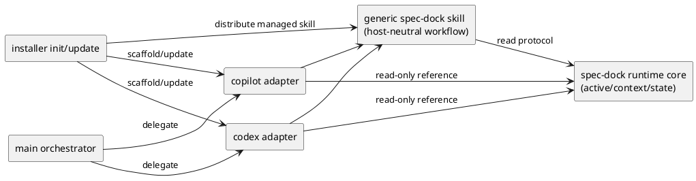
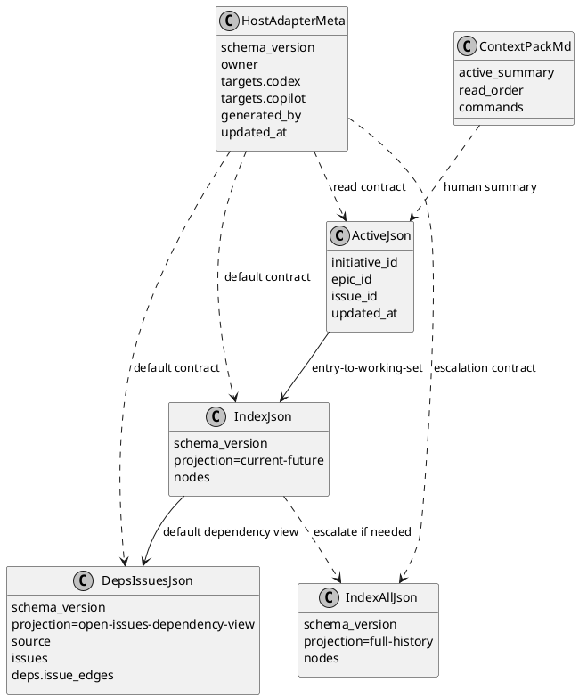
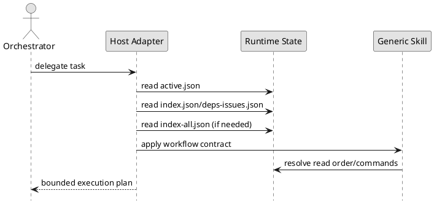

# epic-00048 Agent facing interface hardening and host adapter scaffolding — 設計（HOW）

## 全体像
- target boundary:
  - host-neutral protocol（core）
  - host 非依存 workflow skill（generic）
  - thin host adapter skill（codex/copilot）
- impacted area:
  - active/context 生成、derived state 読み取り、installer managed asset 配布、docs parity
- existing relation:
  - 既存 `.agents/skills` 配布機構を利用しつつ、state contract を先に固定する。

### UML（module / context）


## 契約
### API（CLI 契約）
- API-001 `spec-dock active show`:
  - Request:
    - active 設定状態の表示要求。
  - Response:
    - active ノード、参照パス、補助ガイダンス。
  - Errors:
    - active 未設定時は placeholder を示す。
- API-002 `spec-dock sync` / `spec-dock validate`:
  - Request:
    - state 再生成 / 整合検証。
  - Response:
    - `.agent` 生成物更新 / 検証結果。
  - Errors:
    - required artifact 欠落、構造不整合。
- API-003 `spec-dock init` / `spec-dock update`:
  - Request:
    - managed asset 同期。
  - Response:
    - `.agents/skills/*` と `.agents/host-adapters/meta.json` の整合。
  - Errors:
    - required managed file 欠落、manifest 不整合。

### Event（生成イベント）
- EVT-001 installer managed-asset sync:
  - Producer:
    - `spec-dock init` / `spec-dock update`
  - Consumer:
    - `.agents/skills` の generic skill / adapter skill
    - `.agents/host-adapters/meta.json`
  - Payload:
    - 配布対象ファイル、version marker、ownership。

### Data boundary
- SoR:
  - `active.json` は entry / current target を示す最小文脈。
  - `index.json` は default working set / current-future projection。
  - `deps-issues.json` は open/todo issue 向けの default dependency view。
  - `index-all.json` は full-history / audit / search / escalation only。
  - `context-pack.md` は human summary only であり、唯一正本ではない。
  - `.agents/skills/*` は spec-dock 操作 guidance の正本。
- consistency model:
  - 通常実行は `active.json` -> `index.json` / `deps-issues.json` の順で current/future を解決する。
  - `index-all.json` は full-history が必要な場合にのみ追加参照する。
  - host adapter は上記 state を読み取るのみで、再計算しない。

## データモデル
- model / table changes:
  - 既存 host adapter metadata（`.agents/host-adapters/meta.json`）を採用し、adapter skill の managed mapping を保持する。
  - runtime state schema は後方互換を維持しつつ、docs で責務を明示する。
- invariants:
  - `active.json` は entry / current target の最小文脈。
  - `index.json` は default working set / current-future projection。
  - `deps-issues.json` は open/todo issue 向け dependency view。
  - `index-all.json` は full-history / audit / search / escalation only。
  - `context-pack.md` は human summary only。
  - `.agents/skills/*` が adapter guidance の正本である。
  - host adapter は runtime state を複製しない。

### JSON / manifest shape（例）
```json
{
  "active.json": {
    "initiative": {"id": "init-local-00002", "path": "..."},
    "epic": {"id": "epic-00048", "path": "..."},
    "issue": null,
    "updated_at": "2026-04-04T00:00:00Z"
  },
  "index.json": {
    "schema_version": 2,
    "projection": "current-future",
    "nodes": {
      "epic-00048": {
        "type": "epic",
        "id": "epic-00048",
        "title": "Agent facing interface hardening and host adapter scaffolding",
        "status": "open",
        "path": "spec-dock/initiatives/.../epic-00048-agent-facing-interface-hardening-and-host-adapter-scaffolding",
        "deps": {"ready": true, "depends_on": [], "blockers_top": []}
      }
    }
  },
  "deps-issues.json": {
    "schema_version": 2,
    "projection": "open-issues-dependency-view",
    "source": {"index": "spec-dock/.agent/index.json", "schema_version": 2},
    "issues": {},
    "deps": {
      "issue_edges": [
        {"from": "iss-xxxxx", "to": "iss-yyyyy"}
      ]
    }
  },
  "index-all.json": {
    "schema_version": 2,
    "projection": "full-history",
    "nodes": {}
  },
  "host_adapter_meta": {
    "schema_version": 1,
    "owner": "spec-dock",
    "targets": {
      "codex": {"enabled": true, "entry_file": ".agents/skills/spec-dock-codex-adapter/SKILL.md"},
      "copilot": {"enabled": true, "entry_file": ".agents/skills/spec-dock-copilot-adapter/SKILL.md"}
    },
    "generated_by": "spec-dock update",
    "updated_at": "2026-04-04T00:00:00Z"
  }
}
```

### UML（data model）


## 主要フロー
- Flow-A protocol-driven execution:
  1. adapter が `active.json` を読む。
  2. `index.json` と `deps-issues.json` を読み、current/future の対象と依存関係を解決する。
  3. `context-pack.md` を人間向け補助として読む。
  4. 監査・履歴参照・全体検索・escalation が必要な場合のみ `index-all.json` を読む。
- Flow-B installer adapter sync:
  1. `init/update` が managed skill と metadata 一覧を解決する。
  2. generic skill、adapter skill、adapter metadata を配布/更新する。
  3. obsolete managed adapter を pruning し、未知ディレクトリは保持する。

### UML（sequence / flow）


## 失敗設計
- failure mode:
  - active 未設定（placeholder 参照）
  - state 不整合（schema mismatch / missing artifact）
  - adapter metadata 欠落
- retry:
  - `sync` 後に再読。
  - install/update を再実行して adapter scaffold を再同期。
- idempotency:
  - adapter 配布は managed asset 同期として冪等。
- partial failure:
  - 片方 host のみ生成失敗時は明示エラーとし、成功/失敗を分離記録する。

## 移行戦略
- migration strategy:
  - 既存 workflow を維持しつつ docs と adapter を追加する。
  - state 正本は既存 `.agent` を継続使用する。
- dual write/read if needed:
  - 不要。既存 state を read-only 利用し、adapter 側の独自 state を持たない。
- rollback:
  - adapter 配布のみ戻せるよう managed ownership で管理する。

## 観測性 / セキュリティ
- observability:
  - adapter 生成ログ、`sync` / `validate` 実行記録、docs parity 記録。
- role / auth:
  - GitHub 連携要件は既存契約に従う。
- audit / pii:
  - 新規 PII 収集なし。

## テスト戦略
- Unit:
  - adapter metadata 解決、entrypoint 生成、責務境界検証。
- Integration:
  - `init/update` で adapter が生成/更新されること。
  - active/context/state を adapter が正しく参照すること。
- E2E:
  - Codex/Copilot 両方で同一 protocol から同等の実行導線が得られること。
- E-AC mapping:
  - E-AC-001 -> state role docs + contract tests
  - E-AC-002 -> cross-host adapter execution parity tests
  - E-AC-003 -> installer managed asset tests
  - E-AC-004 -> docs parity + final spec review

## 既存完了済み issue との境界
- `iss-00049`:
  - protocol / runtime / docs / tests の current-future vs full-history 契約を固定済み。
- `iss-00050`:
  - thin adapter skill と adapter metadata の managed deployment を完了済み。
- reading rule:
  - 上記 2 issue の deliverable は本設計の baseline として保持し、再定義しない。

## 追補: host-native shim extension
- extension purpose:
  - `.codex/agents/*.toml` と `.github/agents/*.agent.md` を host-native discovery 用 thin shim として追加する。
  - native shim は新しい state owner ではなく、既存 `.agents/skills/*` と `.agents/host-adapters/meta.json` に委譲する extension として扱う。
- reference:
  - 追加根拠と issue 分割理由は `discussions/20260404t010500z-disc-host-native-agent-deployment-gap-analysis.md` を参照する。

### extension source-of-truth
- provider-side source:
  - generic skill / thin adapter skill / metadata の既存 source-of-truth は維持する。
  - native shim template は同じ provider-side managed asset 群に追加し、skill を参照する thin shim として管理する。
- runtime / managed target:
  - `.agents/skills/*` と `.agents/host-adapters/meta.json` は既存完了済み managed target のまま保持する。
  - `.codex/agents/*.toml` / `.github/agents/*.agent.md` は extension で追加する managed target とし、state owner にはしない。

### extension installer sync / prune
- sync:
  - 既存の skill / metadata sync の後段で native shim を同期し、done scope の installer behavior を壊さない順序で実装する。
  - manifest は native files を追加表現できる shape へ拡張するが、既存 `targets.*.entry_file` contract は維持する。
- prune:
  - prune 対象は managed manifest に載る obsolete native shim のみに限定する。
  - unknown custom skill / unknown custom native shim を削除しない既存安全策を継続する。

### extension test strategy
- regression baseline:
  - `iss-00049` / `iss-00050` で固定済み protocol contract / thin adapter skill / metadata tests を回帰基準として維持する。
- additive coverage:
  - native shim 生成、更新、unknown custom file 保持、obsolete managed native file pruning を `tests/test_init_update.py` に追加する。
  - dogfooding parity と manual validation は既存 parity evidence に native shim 観点を追補する。
