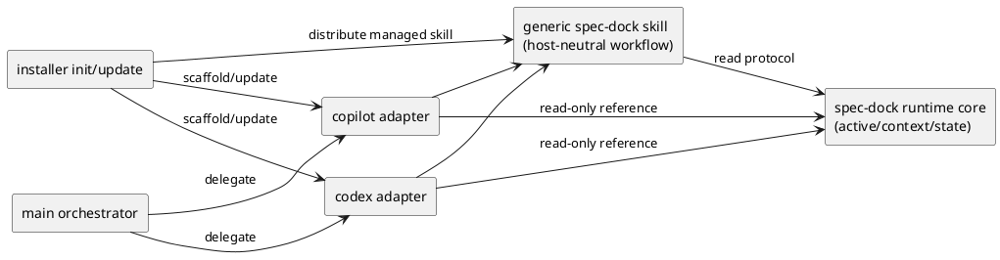
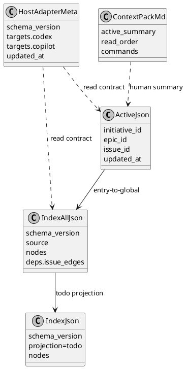
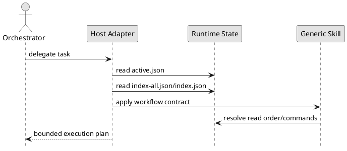

# epic-00048 Agent facing interface hardening and host adapter scaffolding — 設計（HOW）

## 全体像
- target boundary:
  - host-neutral protocol（core）
  - host 非依存 workflow skill（generic）
  - host-specific adapter scaffold（codex/copilot）
- impacted area:
  - active/context 生成、derived state 読み取り、installer managed asset 配布、docs parity
- existing relation:
  - 既存 `.agents/skills` 配布機構を利用しつつ、state contract を先に固定する。

### UML（module / context）


## 契約
### API（CLI 契約）
- API-001 `spec-dock active show`:
  - Request:
    - active 設定状態の表示要求。
  - Response:
    - active ノード、参照パス、補助ガイダンス。
  - Errors:
    - active 未設定時は placeholder を示す。
- API-002 `spec-dock sync` / `spec-dock validate`:
  - Request:
    - state 再生成 / 整合検証。
  - Response:
    - `.agent` 生成物更新 / 検証結果。
  - Errors:
    - required artifact 欠落、構造不整合。

### Event（生成イベント）
- EVT-001 installer managed-asset sync:
  - Producer:
    - `spec-dock init` / `spec-dock update`
  - Consumer:
    - `.agents/skills` の generic skill、host adapter files
  - Payload:
    - 配布対象ファイル、version marker、ownership。

### Data boundary
- SoR:
  - runtime state 正本は `.agent` JSON 群。
  - `context-pack.md` は人間向け summary であり、唯一正本ではない。
- consistency model:
  - `active.json` を入口、`index-all.json` を全体索引、`index.json` を todo projection として扱う。
  - host adapter は上記 state を読み取るのみで、再計算しない。

## データモデル
- model / table changes:
  - 新規 host adapter metadata（案: `.agents/host-adapters/meta.json`）を導入。
  - runtime state schema は後方互換を維持しつつ、docs で責務を明示。
- invariants:
  - `active.json` は現在対象の最小文脈。
  - `index-all.json` は全ノード索引。
  - `index.json` は todo projection。
  - `context-pack.md` は summary only。
  - host adapter は runtime state を複製しない。

### JSON shape（例）
```json
{
  "active.json": {
    "initiative": {"id": "init-local-00002", "path": "..."},
    "epic": {"id": "epic-00048", "path": "..."},
    "issue": null,
    "updated_at": "2026-04-02T00:00:00Z"
  },
  "index-all.json": {
    "schema_version": 2,
    "source": {"index": "spec-dock/.agent/index-all.json", "schema_version": 2},
    "nodes": {
      "epic-00048": {
        "type": "epic",
        "id": "epic-00048",
        "title": "Agent facing interface hardening and host adapter scaffolding",
        "status": "open",
        "deps": {"ready": true, "depends_on": [], "blockers_top": []}
      }
    },
    "deps": {
      "issue_edges": [
        {"from": "iss-xxxxx", "to": "iss-yyyyy"}
      ]
    }
  },
  "index.json": {
    "schema_version": 2,
    "projection": "todo",
    "nodes": {}
  },
  "host_adapter_meta": {
    "schema_version": 1,
    "targets": {
      "codex": {"enabled": true, "entry_file": ".agents/skills/spec-dock-codex-adapter/SKILL.md"},
      "copilot": {"enabled": true, "entry_file": ".agents/skills/spec-dock-copilot-adapter/SKILL.md"}
    },
    "generated_by": "spec-dock update",
    "updated_at": "2026-04-02T00:00:00Z"
  }
}
```

### UML（data model）


## 主要フロー
- Flow-A protocol-driven execution:
  1. adapter が `active.json` を読む。
  2. 必要に応じて `index-all.json` で全体関係を解決する。
  3. `index.json` で todo 対象を絞り、`context-pack.md` を補助として読む。
- Flow-B installer adapter sync:
  1. `init/update` が managed skill 一覧を解決する。
  2. generic skill と host adapter scaffold を配布/更新する。
  3. obsolete managed adapter を pruning し、未知ディレクトリは保持する。

### UML（sequence / flow）


## 失敗設計
- failure mode:
  - active 未設定（placeholder 参照）
  - state 不整合（schema mismatch / missing artifact）
  - adapter metadata 欠落
- retry:
  - `sync` 後に再読。
  - install/update を再実行して adapter scaffold を再同期。
- idempotency:
  - adapter 配布は managed asset 同期として冪等。
- partial failure:
  - 片方 host のみ生成失敗時は明示エラーとし、成功/失敗を分離記録する。

## 移行戦略
- migration strategy:
  - 既存 workflow を維持しつつ docs と adapter を追加。
  - state 正本は既存 `.agent` を継続使用。
- dual write/read if needed:
  - 不要。既存 state を read-only 利用し、adapter 側の独自 state を持たない。
- rollback:
  - adapter 配布のみ戻せるよう managed ownership で管理。

## 観測性 / セキュリティ
- observability:
  - adapter 生成ログ、`sync` / `validate` 実行記録、docs parity 記録。
- role / auth:
  - GitHub 連携要件は既存契約に従う。
- audit / pii:
  - 新規 PII 収集なし。

## テスト戦略
- Unit:
  - adapter metadata 解決、entrypoint 生成、責務境界検証。
- Integration:
  - `init/update` で adapter が生成/更新されること。
  - active/context/state を adapter が正しく参照すること。
- E2E:
  - Codex/Copilot 両方で同一 protocol から同等の実行導線が得られること。
- E-AC mapping:
  - E-AC-001 -> state role docs + contract tests
  - E-AC-002 -> cross-host adapter execution parity tests
  - E-AC-003 -> installer managed asset tests
  - E-AC-004 -> docs parity + final spec review

## 関連 ADR
- 既存 ADR なし（必要なら issue 実装時に追加）

## 未確定事項
- Q-001:
  - 質問:
    - host adapter metadata の配置を `.agents` に固定するか。
  - 選択肢:
    - A:
      - `.agents/host-adapters/meta.json` に配置。
    - B:
      - `.agent/host-adapters.json` に配置。
  - 推奨案:
    - A。runtime state 正本と adapter 管理情報の責務分離が明確。
  - 影響範囲:
    - installer/assets/tests/docs。
