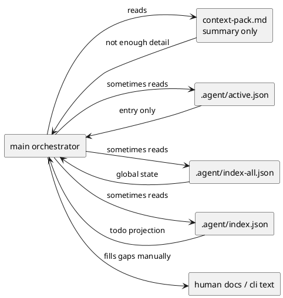
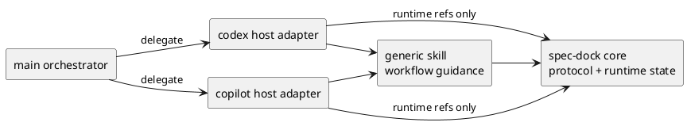
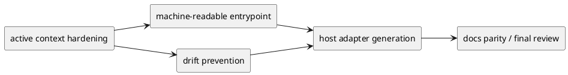

# 20260402t062520z-disc Agent facing interface and host adapter strategy

## 議題
- `spec-dock` の agent-facing interface の何が本質的な課題かを整理する。
- `active.json` / `index-all.json` / `index.json` / `context-pack.md` の責務境界を整理する。
- `core / generic skill / host adapter` の 3 層でどこまでを product に持たせるかを決める。
- Codex CLI / GitHub Copilot CLI 向け host adapter をどの順序で導入するかを定める。

## 背景
- dogfooding で見えた問題は、sub-agent が無いこと自体より、agent が安全に読める contract が弱いことにある。
- 現在の runtime には `spec-dock/.agent/active.json`、`index-all.json`、`index.json`、`tree*.json`、`deps-issues.json` が存在し、機械可読 state の素材は揃っている。
- 一方で `context-pack.md` は active id、read order、代表コマンド中心であり、agent がそのまま次アクションを決めるには薄い。
- installer は `.agents/skills/` への managed skill 配布をすでに行っており、host adapter を `init/update` で配る足場自体はある。
- したがって、優先すべきは host ごとの prompt 最適化ではなく、host-neutral な protocol の固定である。

### 現状問題の構造

## 選択肢
- Option A: まず host adapter を生成し、足りない contract は各 adapter 側で吸収する
  - Pros:
    - 早く体験改善が見える。
    - host ごとの流儀に即応しやすい。
  - Cons:
    - adapter ごとに独自解釈が増え、drift が起きやすい。
    - 問題の本体である protocol 不足を先送りする。
- Option B: まず agent-facing contract を固定し、その上に薄い host adapter を載せる
  - Pros:
    - host 増加に耐える。
    - `spec-dock` core と host ごとの差分を切り分けられる。
    - 今回の論点を epic レベルで綺麗に分割できる。
  - Cons:
    - 最初の見た目の改善は遅く見える。
- Option C: host adapter を作らず、main orchestrator が直接 `spec-dock` を扱う前提で CLI/README を増やす
  - Pros:
    - 人間利用にも効く。
    - 実装点は少ない。
  - Cons:
    - agent-facing contract 問題を根治しない。
    - メイン agent の認知負荷が高いまま残る。

## 推奨案
- Option B を採る。
- `spec-dock` の責務を以下の 3 層に分ける。
  - Layer-1 `spec-dock core`
    - machine-readable protocol
    - active/context/state/read-order/safe-boundary
  - Layer-2 generic spec-dock skill
    - host 非依存の運用知識
  - Layer-3 host adapter
    - Codex / Copilot 向けの起動導線と薄い binding
- host adapter は「薄く保つ」を原則とし、runtime state の再実装を禁止する。
- `context-pack.md` は human-readable summary、`active.json` は入口、`index-all.json` は全体索引、`index.json` は todo projection と整理する。

### 推奨アーキテクチャ

## 責務整理
- `active.json`
  - 現在触る node の入口。
  - adapter / skill が最初に参照する lightweight context。
- `index-all.json`
  - 全ノードの正本索引。
  - 状態確認・親子関係・依存の全体判断に使う。
- `index.json`
  - todo projection。
  - 作業対象の絞り込みに使うが、全体正本ではない。
- `context-pack.md`
  - human-readable summary。
  - agent の補助資料であり、唯一正本ではない。

## 暫定ロードマップ
- phase-1:
  - active/context contract を固める。
- phase-2:
  - machine-readable entrypoint と drift prevention を固める。
- phase-3:
  - `init/update` で Codex/Copilot host adapter を生成する。
- phase-4:
  - docs parity と final review で閉じる。

### 導入順序

## 未決事項
- `active.json` を入口正本に固定した上で、`index-all.json` との責務境界をどこまで docs に明文化するか。
- host adapter の生成物に、どこまで host-specific usage note を含めるか。
- agent-facing protocol の一部を `doctor` や追加 validation で検証するか。

## 次アクション
- この discussion を epic-00048 の前提として採用するか確認する。
- 採用する場合、epic requirement/design ではまず protocol 優先・adapter 後行を固定する。
- その後に issue 分解を行い、host adapter 実装は protocol 固定後の slice とする。
