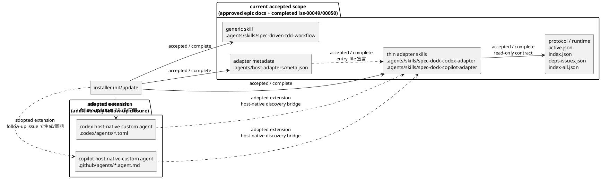

# 20260404t010500z-disc Host-native agent deployment gap analysis

## 位置づけ
- 本メモは、approved 済みの epic-00048 requirement/design と、完了済み `iss-00049` / `iss-00050` の 2-issue scope を差し戻す未完了指摘ではない。
- 位置づけは、「現行 accepted scope は `generic skill + thin host adapter skill + host adapter metadata` までで完了済み」と確認したうえで、外部 host 仕様に基づく host-native custom agent/subagent artifact を additive-only extension として採用した記録である。
- したがって `.codex/agents/*.toml` と `.github/agents/*.agent.md` は、現行 epic requirement/design の不足 deliverable ではなく、follow-up 1 issue で閉じる採用済み extension artifact として扱う。

## 議題
- epic-00048 で承認・完了済みの 2-issue scope が、どこまでを実際に閉じているかを再確認する。
- `.agents/skills/*` と `.agents/host-adapters/meta.json` までは accepted scope 内で実装済みである一方、外部 host 仕様に基づく host-native custom agent/subagent artifact である `.codex/agents/*.toml` と `.github/agents/*.agent.md` は extension addendum として別 closure で扱うことを固定する。
- follow-up 1 issue の粒度、manifest contract、verification gate を採用決定として残す。

## 先に結論
- epic-00048 は現時点で、accepted scope である `generic skill + thin host adapter skill + host adapter metadata` までは完了している。
- `.codex/agents/*.toml` と `.github/agents/*.agent.md` は、現行 epic requirement/design の不足 deliverable ではなく、外部 host が native discovery する custom agent/subagent artifact である。現状これらは provider assets にも dogfooding workspace にも存在せず、`init/update` による生成・同期・prune・検証も未実装である。
- したがって、この gap は「現行 epic の未完了」ではなく、「epic-00048 に additive-only で追加する follow-up extension」であり、native shim 実装から review までを 1 issue で閉じる採用済み契約として扱う。

## 確認した事実

### 実装済み
- epic docs は host-neutral protocol と thin host adapter の 3 層構成を前提として承認済みである。
- `src/spec_dock/cli.py` の `_install_skill()` は `.agents/skills/*` と `.agents/host-adapters/meta.json` を managed asset として同期する。
- provider-side assets には次が存在する。
  - `src/spec_dock/assets/codex_skills/spec-dock-codex-adapter/SKILL.md`
  - `src/spec_dock/assets/codex_skills/spec-dock-copilot-adapter/SKILL.md`
  - `src/spec_dock/assets/codex_skills/host-adapters/meta.json`
- dogfooding workspace にも次が mirror 済みである。
  - `.agents/skills/spec-dock-codex-adapter/SKILL.md`
  - `.agents/skills/spec-dock-copilot-adapter/SKILL.md`
  - `.agents/host-adapters/meta.json`
- `iss-00049` は protocol contract / runtime alignment を完了し、`iss-00050` は thin host adapter skill 配布と metadata parity までを完了した記録が report に残っている。
- したがって、現行 accepted scope を基準に読む限り、`.agents/skills/*` と `.agents/host-adapters/meta.json` は既存 2 issue で閉じた deliverable である。

## 外部 host 仕様の根拠
- OpenAI Codex official docs の `Subagents` は、project config の `.codex/config.toml` と並んで custom agent 例を `.codex/agents/pr-explorer.toml`、`.codex/agents/reviewer.toml`、`.codex/agents/docs-researcher.toml` として示している。つまり `.codex/agents/*.toml` は Codex 側の host-native custom agent/subagent artifact と読める。URL: `https://developers.openai.com/codex/subagents`
- GitHub official docs の `Creating custom agents for Copilot cloud agent` と `About custom agents` は、repository-level custom agent profile を `.github/agents/my-agent.agent.md` のような `.agent.md` file として置く構成を明示している。つまり `.github/agents/*.agent.md` は GitHub Copilot 側の host-native custom agent artifact と読める。URL: `https://docs.github.com/en/copilot/how-tos/use-copilot-agents/coding-agent/create-custom-agents`, `https://docs.github.com/en/copilot/concepts/agents/coding-agent/about-custom-agents`

### 未実装
- repo root に `.codex/agents/` は存在しない。
- repo root の `.github/` には `workflows/` はあるが、`.github/agents/` は存在しない。
- `rg --files` で `.codex/agents/*.toml` と `.github/agents/*.agent.md` を検索しても一致は無い。
- `src/spec_dock/assets/` 配下にも、上記 host-native 配備ファイルに対応する provider-side asset は存在しない。
- `_install_skill()` は `.agents/skills/*` と `.agents/host-adapters/meta.json` しか同期しておらず、`.codex/agents/*.toml` と `.github/agents/*.agent.md` を生成・更新・prune 対象にしていない。
- `.agents/host-adapters/meta.json` は `targets.codex` / `targets.copilot` を宣言しているが、host-native 配備先 path や生成物 ownership までは表現していない。
- これは「現行 epic deliverable が欠けている」という意味ではなく、host-native artifact を follow-up extension として追加し、その closure を新たに閉じる必要がある、という意味での未実装である。

## 現状 / accepted scope / adopted extension

## gap の整理

### いま既に閉じているもの
- protocol 側:
  - `active.json` を入口にし、`index.json` / `deps-issues.json` を default working set、`index-all.json` を escalation 用にする contract。
- adapter 側:
  - Codex/Copilot 向け thin host adapter の文面を `.agents/skills/*` に持つ構成。
- installer 側:
  - managed skills と host adapter metadata を `init/update` で同期する構成。
- parity 側:
  - provider-side assets と dogfooding `.agents/...` の mirror、関連 test、`iss-00049/00050` の report。

### scope expansion で追加で閉じるもの
- host-native discovery:
  - Codex host-native custom agent/subagent artifact である `.codex/agents/*.toml` の managed 生成物が無い。
  - Copilot host-native custom agent artifact である `.github/agents/*.agent.md` の managed 生成物が無い。
- managed ownership:
  - native host files を installer が所有する contract が無い。
  - obsolete native host files の prune policy が無い。
- source-of-truth:
  - `.agents/host-adapters/meta.json` と native host files の対応関係が未定義。
  - native file の provider-side source of truth をどこに置くかが未定義。
- verification:
  - init/update test に native host files の生成・更新・保持・削除判定が無い。
  - dogfooding parity と final review も native host files を対象にしていない。

## scope expansion で採用した実装契約

### A. host-native 配備 contract の追加
- `.agents/skills/spec-dock-codex-adapter/SKILL.md` と `.agents/skills/spec-dock-copilot-adapter/SKILL.md` を正本の thin adapter guidance としつつ、各 host が native discovery できる shim を追加する。
- 採用対象:
  - `.codex/agents/spec-dock.toml`
  - `.github/agents/spec-dock.agent.md`
- adopted decision:
  - native shim は discovery/delegation only とし、`.agents/skills/*` への委譲だけを担う。
  - canonical filename は上記 2 件に固定し、host ごとの static check もこの exact path だけを対象にする。

### B. installer ownership / sync の拡張
- `src/spec_dock/cli.py` に native host files の copy/update と ownership/prune policy を追加する。
- managed asset の責務を次の 3 系統で揃える必要がある。
  - `.agents/skills/*`
  - `.agents/host-adapters/meta.json`
  - `.codex/agents/*` / `.github/agents/*`

### C. metadata contract の拡張
- `.agents/host-adapters/meta.json` を単一 manifest file として採用し、別 metadata は増やさない。
- adopted shape:
  - `targets.codex.native_shim.{managed,owner,target_file,source_of_truth_asset,delegates_to,obsolete_managed_paths}`
  - `targets.copilot.native_shim.{managed,owner,target_file,source_of_truth_asset,delegates_to,obsolete_managed_paths}`
- adopted decision:
  - sync は `target_file` と `source_of_truth_asset`、tests の委譲期待値は `delegates_to`、prune は `obsolete_managed_paths` を正本として扱う。
  - `follow_up_issue_ref` は actual issue artifact/URL 用、`follow_up_issue_discussion_ref` は actual discussion artifact/URL 用の reserved field とする。

### D. test / parity / validation の追補
- `tests/test_init_update.py` に native host files の生成・更新・unknown custom file 保持・obsolete managed file pruning を追加する。
- dogfooding workspace に native shim を配備し、`spec-dock update .` 後に `.codex/agents/spec-dock.toml` と `.github/agents/spec-dock.agent.md` を parity 証跡として確認する。
- この epic では `spec-dock update .` と gate-3/manual validation を canonical verification とし、`validate` / `doctor` への native host file 欠落チェック追加は scope 外とする。
- adopted decision:
  - gate-2 sync/prune は fixed subcheck 5 件の `pass` が全て `true` の場合のみ `gate_2_sync_prune_pass=true` とする。
  - gate-3 static check observed は host-scoped とし、Codex と Copilot を別コマンド/別観測で記録し、片方 host の match/no-match を他方へ流用しない。
  - gate-4 review は additive-only scope、single follow-up issue、native manifest shape、report schema、discussion schema、host-native scope consistency の 6 subcheck が全て `true` の場合のみ `gate_4_review_pass=true` とする。

## 採用した実装方針
- host-native file は新しい state owner にしない。
- 役割はあくまで「host discovery のための薄い shim」に限定し、正本は既存の `.agents/skills/*` と protocol docs に残す。
- native shim 自体は protocol state を読まず、委譲先の `.agents/skills/*` またはその委譲先 subagent が `active.json` / `index.json` / `deps-issues.json` / `index-all.json` の read order を実行する。
- つまり、構造は次で揃えるのがよい。
  - protocol/state: `spec-dock/.agent/*`
  - generic/thin guidance: `.agents/skills/*`
- managed target manifest: `.agents/host-adapters/meta.json`
- host-native shim: `.codex/agents/*`, `.github/agents/*`
- この構成なら、epic-00048 の「adapter は薄く保つ」「state を再実装しない」という前提を壊さずに native deployment まで拡張できる。

## 前提条件 / 進め方
- この follow-up scope は epic-00048 を拡張して継続する。
- epic-00048 の `requirement.md` / `design.md` / `plan.md` は、done の 2 issue baseline と extension addendum の境界を分離した follow-up 1 issue 契約へ更新済みである。
- follow-up epic への分離は今回の採用決定では採らない。
- host-native extension は、上記 epic docs 契約に従って単一の follow-up issue として起票・実装・確認する。

## 採用した follow-up issue 契約

### 1 issue 統合
- issue 名:
  - `follow-up-host-native-shim-deployment-and-validation-closure`
- 目的:
  - 外部 host 仕様に沿う `.codex/agents/*.toml` と `.github/agents/*.agent.md` の host-native shim を、`.agents/skills/*` 正本を壊さない extension として追加する。
  - provider-side assets、metadata mapping、installer sync/prune、dogfooding/manual validation、final review evidence を同じ 1 周で閉じる。
- 含めるもの:
  - provider-side native shim assets
  - `.agents/host-adapters/meta.json` の native deployment manifest 拡張
  - `src/spec_dock/cli.py` の sync/prune 追加
  - `tests/test_init_update.py` の native shim 生成・更新・unknown custom file 保持・obsolete managed file pruning
  - dogfooding mirror 方針、manual validation 記録、review evidence
- 含めないもの:
  - 大きな runtime redesign
  - host ごとの高度な orchestration policy
  - native artifact を state owner とする再設計

### 採用理由
- epic docs の accepted scope は `iss-00049` / `iss-00050` の done baseline として既に閉じており、extension 専用 closure だけを 1 issue へ足すほうが正本の読み方と一致する。
- artifact 契約、installer ownership、dogfooding/manual validation、review evidence は直列 gate でしか閉じられず、issue を分けても handoff だけが増えて evidence が分断される。
- 過細分化を避けるという epic-00048 の slicing 原則にも、follow-up 1 issue のほうが整合する。

### follow-up issue の closure semantics（superseded history / non-normative）
- gate-1 implementation:
  - native shim asset、manifest、installer sync/prune、tests、docs の差分を 1 changeset でそろえる。
- gate-2 sync-prune verification:
  - この節の gate-2 shorthand は superseded history としてのみ保持し、normative な gate-2 手順は次節の canonical rule に従う。
- gate-3 dogfooding / manual validation:
  - dogfooding workspace で `.codex/agents/*` / `.github/agents/*` が `.agents/skills/*` へ委譲する thin shim であること、unknown custom file を壊していないこと、manual delegation 導線が成立することを証跡化する。
- gate-4 review pass:
  - final spec review で、done baseline と extension addendum の closure が混ざっていないこと、native shim が state owner になっていないことを確認して閉じる。

### canonical closure semantics update
- この節は、直上の省略版 closure semantics を additive に上書きし、epic `requirement.md` / `design.md` / `plan.md` と同じ canonical rule を固定する。
- gate-2 sync-prune verification:
  - canonical command sequence は `uvx --from . spec-dock init /tmp/spec-dock-native-shim-smoke` -> fixture 配置 -> `uvx --from . spec-dock update /tmp/spec-dock-native-shim-smoke` とする。
  - fixture 配置は `mkdir -p /tmp/spec-dock-native-shim-smoke/.codex/agents /tmp/spec-dock-native-shim-smoke/.github/agents`、obsolete managed fixture 2 件の配置、unknown custom fixture 2 件の配置を指す。
  - canonical obsolete managed fixture path は `/tmp/spec-dock-native-shim-smoke/.codex/agents/spec-dock-codex-adapter.toml` と `/tmp/spec-dock-native-shim-smoke/.github/agents/spec-dock-copilot-adapter.agent.md` とする。
  - canonical unmanaged fixture path は `/tmp/spec-dock-native-shim-smoke/.codex/agents/custom-reviewer.toml` と `/tmp/spec-dock-native-shim-smoke/.github/agents/custom-reviewer.agent.md` とする。
  - canonical before/after path set は `/tmp/spec-dock-native-shim-smoke/.codex/agents/spec-dock.toml`, `/tmp/spec-dock-native-shim-smoke/.github/agents/spec-dock.agent.md`, `/tmp/spec-dock-native-shim-smoke/.codex/agents/spec-dock-codex-adapter.toml`, `/tmp/spec-dock-native-shim-smoke/.github/agents/spec-dock-copilot-adapter.agent.md`, `/tmp/spec-dock-native-shim-smoke/.codex/agents/custom-reviewer.toml`, `/tmp/spec-dock-native-shim-smoke/.github/agents/custom-reviewer.agent.md`, `/tmp/spec-dock-native-shim-smoke/.agents/skills/spec-dock-codex-adapter/SKILL.md`, `/tmp/spec-dock-native-shim-smoke/.agents/skills/spec-dock-copilot-adapter/SKILL.md`, `/tmp/spec-dock-native-shim-smoke/.agents/host-adapters/meta.json` とする。
  - gate-2 success condition は `managed_codex_shim_generated_or_updated`, `managed_copilot_shim_generated_or_updated`, `obsolete_managed_fixture_pruned`, `unknown_custom_fixture_preserved`, `baseline_skill_and_metadata_untouched` の 5 固定 subcheck が全て `pass=true` を満たすこととする。
  - report の `gate_2_sync_prune_evidence` は `managed_codex_shim_generated_or_updated`, `managed_copilot_shim_generated_or_updated`, `obsolete_managed_fixture_pruned`, `unknown_custom_fixture_preserved`, `baseline_skill_and_metadata_untouched` を fixed key とし、各キーは `expected`, `observed`, `pass` で記録する。
  - `gate_2_sync_prune_pass` は上記 5 固定 subcheck の `pass` が全て `true` の場合のみ `true` とする。
- gate-3 dogfooding / manual validation:
  - `gate_3_manual_validation` と `extension_closure_pass` の required host set は `codex` と `copilot` の両方固定とし、`fallback_evidence_*` は各 host の required evidence を代替できても required host set 自体は減らさない。
  - accepted evidence format は `transcript_fragment` / `ui_screenshot` / `cli_log` の 3 種のみとする。
  - canonical action は Codex が `.codex/agents/spec-dock.toml`、Copilot が `.github/agents/spec-dock.agent.md` を discovery したうえで、同じ task 文面 `Summarize the active spec-dock target and the next workflow doc to read before editing.` を実行することとする。
  - report の host 固定キーは `selection_evidence_format`, `selection_signal_expected_any`, `selection_signal_observed`, `selection_signal_pass`, `response_target_expected`, `response_target_observed`, `response_target_pass`, `next_doc_expected_any`, `next_doc_observed`, `next_doc_pass`, `delegation_evidence_expected`, `delegation_evidence_observed`, `delegation_evidence_pass`, `non_reimplementation_evidence_expected`, `non_reimplementation_evidence_observed`, `non_reimplementation_evidence_pass`, `direct_protocol_read_expected`, `direct_protocol_read_observed`, `direct_protocol_read_pass`, `fallback_evidence_required`, `fallback_evidence_observed`, `fallback_evidence_pass` とする。
  - gate-3 の static check observed は host-scoped とし、Codex は `.codex/agents/spec-dock.toml` のみ、Copilot は `.github/agents/spec-dock.agent.md` のみを対象にした別コマンド/別記録から採取し、片方 host の match/no-match を他方の判定へ流用しない。
  - `selection_signal_pass` は `selection_signal_observed` に host ごとの `selection_signal_expected_any` のいずれか 1 つが exact match で含まれる場合のみ `true` とする。
  - `response_target_expected` は host 共通で `active target summary or active-none stop`、`response_target_pass` は `response_target_observed` が active target 要約または `active-none` 停止を示す場合のみ `true` とする。
  - `next_doc_expected_any` は host 共通で `["spec-dock/active/issue/requirement.md", "spec-dock/active/epic/requirement.md", "spec-dock/active/initiative/requirement.md", "spec-dock/system/active-none/requirement.md"]`、`next_doc_pass` は `next_doc_observed` にこの配列のいずれか 1 つが exact match で含まれる場合のみ `true` とする。
  - `delegation_evidence_pass` は `delegation_evidence_observed` に host ごとの `delegation_evidence_expected` が exact match で含まれ、かつ shim artifact または transcript から skill への委譲成立が読める場合のみ `true` とする。
  - `non_reimplementation_evidence_expected` は `no state payload key redefinition and no inline .agent/*.json/context-pack.md` に固定し、`non_reimplementation_evidence_pass` は host 対象 shim に対する `rg -n "schema_version|projection|nodes|issues|deps|source|updated_at"` の no-match と `.agent/*.json` / `context-pack.md` 非 inline が同時に示された場合のみ `true` とする。
  - `direct_protocol_read_expected` は host 共通で `no direct active.json/index.json/deps-issues.json/index-all.json/read-order text in shim body` とする。
  - `direct_protocol_read_pass` は `direct_protocol_read_observed` が host 対象 shim に対する `rg -n "active\\.json|index\\.json|deps-issues\\.json|index-all\\.json|read[ -]order"` の no-match を示す場合のみ `true` とする。
  - `fallback_evidence_required` はローカル実機確認不能時のみ `true` とし、`fallback_evidence_pass` は `fallback_evidence_required=false` の場合は direct host verification が成立しているときのみ、`fallback_evidence_required=true` の場合は artifact snapshot、delegation static check、non-reimplementation static check、dated transcript / ui screenshot / cli log のいずれか 1 つが `fallback_evidence_observed` に同居するときのみ `true` とする。
- gate-4 review pass:
  - report の固定トップレベル項目は `baseline_inherited_closure` と `extension_closure` の 2 つに固定する。
  - `baseline_inherited_closure` には `accepted_issues`, `baseline_inherited_closure_pass` を必須キーとして置き、`accepted_issues` は `iss-00049,iss-00050` 固定、`baseline_inherited_closure_pass` は両 issue が done のまま reopen されず、extension 側の gate 証跡を混在させていない場合のみ `true` とする。
  - `extension_closure` には単一 follow-up issue identity を `follow_up_issue_id`, `follow_up_issue_ref`, `follow_up_issue_discussion_ref`, `follow_up_issue_status` の固定キーで保持する。
  - `follow_up_issue_ref` は actual issue artifact/URL 用、`follow_up_issue_discussion_ref` は actual discussion artifact/URL 用の reserved field とする。
  - `extension_closure` には `follow_up_issue_id`, `follow_up_issue_ref`, `follow_up_issue_discussion_ref`, `follow_up_issue_status`, `gate_2_sync_prune_pass`, `gate_3_manual_validation`, `gate_4_review_pass`, `extension_closure_pass` を必須キーとして置き、`gate_3_manual_validation` には `codex` と `copilot` を固定キーとして置く。
  - `gate_4_review_evidence` は `additive_only_scope_preserved_expected`, `additive_only_scope_preserved_observed`, `additive_only_scope_preserved_pass`, `single_follow_up_issue_rule_expected`, `single_follow_up_issue_rule_observed`, `single_follow_up_issue_rule_pass`, `native_manifest_shape_expected`, `native_manifest_shape_observed`, `native_manifest_shape_pass`, `report_schema_compliance_expected`, `report_schema_compliance_observed`, `report_schema_compliance_pass`, `discussion_schema_compliance_expected`, `discussion_schema_compliance_observed`, `discussion_schema_compliance_pass`, `host_native_scope_consistency_expected`, `host_native_scope_consistency_observed`, `host_native_scope_consistency_pass`, `final_review_ref` を fixed key として持つ。
  - `host_native_scope_consistency_pass` は required host set=`codex,copilot` の両 host で `delegation_evidence_pass=true`、`non_reimplementation_evidence_pass=true`、`direct_protocol_read_pass=true` がそろった場合のみ `true` とする。
  - `gate_4_review_pass` は `additive_only_scope_preserved_pass=true`、`single_follow_up_issue_rule_pass=true`、`native_manifest_shape_pass=true`、`report_schema_compliance_pass=true`、`discussion_schema_compliance_pass=true`、`host_native_scope_consistency_pass=true` の 6 件が全て `true` の場合のみ `true` とする。
  - `extension_closure_pass` は `gate_2_sync_prune_pass=true`、required host set=`codex,copilot` の両 host で `selection_signal_pass=true`、`response_target_pass=true`、`next_doc_pass=true`、`delegation_evidence_pass=true`、`non_reimplementation_evidence_pass=true`、`direct_protocol_read_pass=true`、`fallback_evidence_pass=true`、および `gate_4_review_pass=true` を同時に満たす場合のみ `true` とする。

## epic-00048 に対する判断
- 現状の epic docs / issue reports を尊重するなら、`iss-00049/00050` は「skills 配備と metadata まで」を完了したものとして扱うのが正しい。
- そのうえで、host-native subagent/custom agent deployment を「現行不足 deliverable」として読み替えるのではなく、epic-00048 の `requirement.md` / `design.md` / `plan.md` に追加済みの follow-up scope として扱うのが最も差分が小さい。
- 逆に、`iss-00050` 完了済み記録をそのままにして「native deployment も完了済み」と解釈するのは事実とずれる。

## 次アクション
- epic-00048 の `requirement.md` / `design.md` / `plan.md` に固定した follow-up 1 issue 契約に従い、host-native extension を単一 issue で起票・実装・確認する。
- dogfooding workspace では `spec-dock update .` 後に `.codex/agents/spec-dock.toml` と `.github/agents/spec-dock.agent.md` を確認し、gate-3/manual validation を canonical verification として記録する。
- 実装時は、`.agents/skills/*` を正本、`.codex/agents/*` / `.github/agents/*` を thin shim とする原則を先に固定する。
