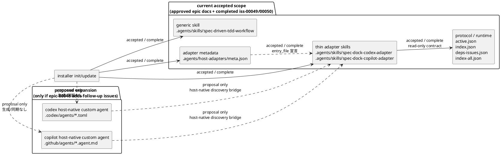

# 20260404t010500z-disc Host-native agent deployment gap analysis

## 位置づけ
- 本メモは、approved 済みの epic-00048 requirement/design と、完了済み `iss-00049` / `iss-00050` の 2-issue scope を差し戻す未完了指摘ではない。
- 位置づけは、「現行 accepted scope は `generic skill + thin host adapter skill + host adapter metadata` までで完了済み」と確認したうえで、外部 host 仕様に基づく host-native custom agent/subagent artifact を追加したい場合の scope expansion proposal である。
- したがって `.codex/agents/*.toml` と `.github/agents/*.agent.md` は、現行 epic requirement/design の不足 deliverable ではなく、follow-up で採否を決める追加 artifact 候補として扱う。

## 議題
- epic-00048 で承認・完了済みの 2-issue scope が、どこまでを実際に閉じているかを再確認する。
- `.agents/skills/*` と `.agents/host-adapters/meta.json` までは accepted scope 内で実装済みである一方、外部 host 仕様に基づく host-native custom agent/subagent artifact 候補である `.codex/agents/*.toml` と `.github/agents/*.agent.md` は現行 scope には入っていないことを整理する。
- epic-00048 を scope 拡張して継続する前提で、epic docs 改訂後に追加する follow-up issue の粒度と責務分離を決める。

## 先に結論
- epic-00048 は現時点で、accepted scope である `generic skill + thin host adapter skill + host adapter metadata` までは完了している。
- `.codex/agents/*.toml` と `.github/agents/*.agent.md` は、現行 epic requirement/design の不足 deliverable ではなく、外部 host が native discovery する custom agent/subagent artifact 候補である。現状これらは provider assets にも dogfooding workspace にも存在せず、`init/update` による生成・同期・prune・検証も未実装である。
- したがって、この gap は「現行 epic の未完了」ではなく、「epic-00048 を native deployment まで scope 拡張するなら追加で扱う follow-up 候補」である。

## 確認した事実

### 実装済み
- epic docs は host-neutral protocol と thin host adapter の 3 層構成を前提として承認済みである。
- `src/spec_dock/cli.py` の `_install_skill()` は `.agents/skills/*` と `.agents/host-adapters/meta.json` を managed asset として同期する。
- provider-side assets には次が存在する。
  - `src/spec_dock/assets/codex_skills/spec-dock-codex-adapter/SKILL.md`
  - `src/spec_dock/assets/codex_skills/spec-dock-copilot-adapter/SKILL.md`
  - `src/spec_dock/assets/codex_skills/host-adapters/meta.json`
- dogfooding workspace にも次が mirror 済みである。
  - `.agents/skills/spec-dock-codex-adapter/SKILL.md`
  - `.agents/skills/spec-dock-copilot-adapter/SKILL.md`
  - `.agents/host-adapters/meta.json`
- `iss-00049` は protocol contract / runtime alignment を完了し、`iss-00050` は thin host adapter skill 配布と metadata parity までを完了した記録が report に残っている。
- したがって、現行 accepted scope を基準に読む限り、`.agents/skills/*` と `.agents/host-adapters/meta.json` は既存 2 issue で閉じた deliverable である。

## 外部 host 仕様の根拠
- OpenAI Codex official docs の `Subagents` は、project config の `.codex/config.toml` と並んで custom agent 例を `.codex/agents/pr-explorer.toml`、`.codex/agents/reviewer.toml`、`.codex/agents/docs-researcher.toml` として示している。つまり `.codex/agents/*.toml` は Codex 側の host-native custom agent/subagent artifact と読める。URL: `https://developers.openai.com/codex/subagents`
- GitHub official docs の `Creating custom agents for Copilot cloud agent` と `About custom agents` は、repository-level custom agent profile を `.github/agents/my-agent.agent.md` のような `.agent.md` file として置く構成を明示している。つまり `.github/agents/*.agent.md` は GitHub Copilot 側の host-native custom agent artifact と読める。URL: `https://docs.github.com/en/copilot/how-tos/use-copilot-agents/coding-agent/create-custom-agents`, `https://docs.github.com/en/copilot/concepts/agents/coding-agent/about-custom-agents`

### 未実装
- repo root に `.codex/agents/` は存在しない。
- repo root の `.github/` には `workflows/` はあるが、`.github/agents/` は存在しない。
- `rg --files` で `.codex/agents/*.toml` と `.github/agents/*.agent.md` を検索しても一致は無い。
- `src/spec_dock/assets/` 配下にも、上記 host-native 配備ファイルに対応する provider-side asset は存在しない。
- `_install_skill()` は `.agents/skills/*` と `.agents/host-adapters/meta.json` しか同期しておらず、`.codex/agents/*.toml` と `.github/agents/*.agent.md` を生成・更新・prune 対象にしていない。
- `.agents/host-adapters/meta.json` は `targets.codex` / `targets.copilot` を宣言しているが、host-native 配備先 path や生成物 ownership までは表現していない。
- これは「現行 epic deliverable が欠けている」という意味ではなく、host-native artifact を follow-up scope に追加するなら新たに閉じる必要がある、という意味での未実装である。

## 現状 / accepted scope / proposed expansion

## gap の整理

### いま既に閉じているもの
- protocol 側:
  - `active.json` を入口にし、`index.json` / `deps-issues.json` を default working set、`index-all.json` を escalation 用にする contract。
- adapter 側:
  - Codex/Copilot 向け thin host adapter の文面を `.agents/skills/*` に持つ構成。
- installer 側:
  - managed skills と host adapter metadata を `init/update` で同期する構成。
- parity 側:
  - provider-side assets と dogfooding `.agents/...` の mirror、関連 test、`iss-00049/00050` の report。

### scope expansion を採るなら追加で閉じるもの
- host-native discovery:
  - Codex host-native custom agent/subagent artifact 候補である `.codex/agents/*.toml` の managed 生成物が無い。
  - Copilot host-native custom agent artifact 候補である `.github/agents/*.agent.md` の managed 生成物が無い。
- managed ownership:
  - native host files を installer が所有する contract が無い。
  - obsolete native host files の prune policy が無い。
- source-of-truth:
  - `.agents/host-adapters/meta.json` と native host files の対応関係が未定義。
  - native file の provider-side source of truth をどこに置くかが未定義。
- verification:
  - init/update test に native host files の生成・更新・保持・削除判定が無い。
  - dogfooding parity と final review も native host files を対象にしていない。

## scope expansion を採るなら追加で実装候補となるもの

### A. host-native 配備 contract の追加
- `.agents/skills/spec-dock-codex-adapter/SKILL.md` と `.agents/skills/spec-dock-copilot-adapter/SKILL.md` を正本の thin adapter guidance としつつ、各 host が native discovery できる shim を追加する。
- 追加対象:
  - `.codex/agents/*.toml`
  - `.github/agents/*.agent.md`
- 必要な決定:
  - file naming
  - provider-side asset の配置場所
  - native file が skill を参照する方式か、必要文面を複製する方式か

### B. installer ownership / sync の拡張
- `src/spec_dock/cli.py` に native host files の copy/update と ownership/prune policy を追加する。
- managed asset の責務を次の 3 系統で揃える必要がある。
  - `.agents/skills/*`
  - `.agents/host-adapters/meta.json`
  - `.codex/agents/*` / `.github/agents/*`

### C. metadata contract の拡張
- `.agents/host-adapters/meta.json` は現状 `entry_file` しか持たないため、native deployment を管理するには情報が足りない。
- 少なくとも次のどちらかが必要になる。
  - `targets.<host>.native_files` のような生成物一覧
  - 別 metadata で native deployment manifest を持つ
- 重要なのは、skill と native file の 2 系統が drift したときに、どちらが source of truth かを明示すること。

### D. test / parity / validation の追補
- `tests/test_init_update.py` に native host files の生成・更新・unknown custom file 保持・obsolete managed file pruning を追加する。
- dogfooding workspace に native host files の mirror を持たせるなら、provider-side asset 更新後の parity 証跡を追加する。
- `validate` や `doctor` に native host file 欠落を含めるかどうかも判断が要る。

## 推奨実装方針
- host-native file は新しい state owner にしない。
- 役割はあくまで「host discovery のための薄い shim」に限定し、正本は既存の `.agents/skills/*` と protocol docs に残す。
- つまり、構造は次で揃えるのがよい。
  - protocol/state: `spec-dock/.agent/*`
  - generic/thin guidance: `.agents/skills/*`
- managed target manifest: `.agents/host-adapters/meta.json`
- host-native shim: `.codex/agents/*`, `.github/agents/*`
- この構成なら、epic-00048 の「adapter は薄く保つ」「state を再実装しない」という前提を壊さずに native deployment まで拡張できる。

## 前提条件 / 進め方
- この follow-up scope は epic-00048 を拡張して継続する。
- 新しい issue を起こす前に、まず epic-00048 の `requirement.md` / `design.md` / `plan.md` を改訂して 2-issue 契約を更新する。
- follow-up epic への分離は今回の提案では採らない。
- 上記改訂の承認後に、本メモの issue 案を epic docs 改訂後に追加する follow-up issues として起票する。

## issue 案（epic docs 改訂後に追加する follow-up issues）

### 案1: 2 issue 追加
- issue-a host-native-agent-artifact-contract-and-installer-sync
  - 目的:
    - 外部 host 仕様に沿う `.codex/agents/*.toml` と `.github/agents/*.agent.md` の asset layout、naming、metadata mapping、source-of-truth、installer sync/prune を定義して実装する。
  - 含めるもの:
    - provider-side assets
    - `src/spec_dock/cli.py`
    - metadata contract 拡張
    - init/update tests
  - 含めないもの:
    - 大きな runtime redesign
    - host ごとの高度な orchestration policy
- issue-b native-agent-integration-validation-and-doc-closure
  - 目的:
    - issue-a で定義した host-native artifact を dogfooding / docs / validation 導線に接続し、運用上の受け入れ条件を閉じる。
  - 含めるもの:
    - dogfooding mirror 方針の確定と反映
    - native artifact を含む docs refresh
    - validate/doctor に含める範囲の判断と必要な追補
    - final review evidence
    - verification command / report 整理
  - 含めないもの:
    - native artifact format 自体の再設計
    - installer ownership 契約の再分解

### この分割を推す理由
- 1 issue に全部入れると、artifact 契約/installer ownership と、dogfooding/validation closure が混ざって review 観点がぼける。
- 3 issue 以上に分けると、Codex と Copilot を host ごとに過細分化し、epic-00048 の「大きめ 2 slice で閉じる」方針から外れやすい。
- したがって、artifact 契約・生成系 1 issue + integration/validation closure 1 issue の 2 分割が妥当である。

## epic-00048 に対する判断
- 現状の epic docs / issue reports を尊重するなら、`iss-00049/00050` は「skills 配備と metadata まで」を完了したものとして扱うのが正しい。
- そのうえで、host-native subagent/custom agent deployment を「現行不足 deliverable」として読み替えるのではなく、「epic-00048 の `requirement.md` / `design.md` / `plan.md` を改訂したうえで追加する follow-up scope」として扱うのが最も差分が小さい。
- 逆に、`iss-00050` 完了済み記録をそのままにして「native deployment も完了済み」と解釈するのは事実とずれる。

## 次アクション提案
- まず epic-00048 の `requirement.md` / `design.md` / `plan.md` を改訂し、native deployment を含む 2-issue 契約へ更新する。
- 上記改訂の承認後に、上記 2 issue 分割を epic docs 改訂後に追加する follow-up issues として起票する。
- 実装時は、`.agents/skills/*` を正本、`.codex/agents/*` / `.github/agents/*` を thin shim とする原則を先に固定する。
