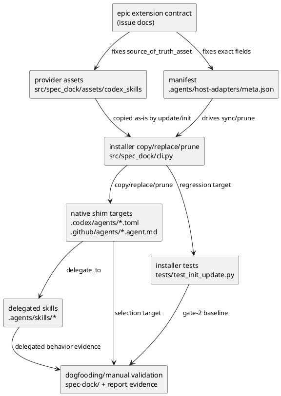

# iss-00051 Host native shim deployment and validation closure — 設計（HOW）

## 目的・制約
- 目的:
  - native shim asset / manifest / installer sync-prune / validation closure を 1 issue で完結させる。
- MUST / MUST NOT:
  - native shim は discovery/delegation only。
  - skill と protocol docs を正本のまま維持する。
  - dogfooding parity と manual validation を同 issue の closure evidence に残す。
- 非交渉制約:
  - manifest shape は `.agents/host-adapters/meta.json` の exact field に固定。
  - required host set は `codex,copilot` 固定。
- 前提:
  - `iss-00049` / `iss-00050` の baseline contract は変更しない。

## 既存実装 / 規約の理解
- 参照した実装 / docs:
  - `src/spec_dock/cli.py`
  - `src/spec_dock/assets/codex_skills/host-adapters/meta.json`
  - `tests/test_init_update.py`
  - `spec-dock/active/epic/requirement.md`
  - `spec-dock/active/epic/design.md`
  - `spec-dock/active/epic/plan.md`
- 現状理解:
  - installer は `.agents/skills/*` と `.agents/host-adapters/meta.json` を managed 配備するが、host-native shim はまだ配備しない。
  - meta.json は `entry_file` のみを持ち、native shim ownership を表せない。
- 採用するパターン:
  - single manifest ownership
  - provider asset -> installer copy/replace -> dogfooding parity -> manual validation の一方向フロー
- 採用しないもの:
  - native shim に protocol read-order を埋め込む方式
  - host-native validation を別 issue に切り出す方式
  - installer が native shim / host-native agent の本文を組み立てたりテンプレート展開したりする方式
- 影響範囲:
  - `src/spec_dock/assets/codex_skills/`
  - `src/spec_dock/cli.py`
  - `tests/test_init_update.py`
  - dogfooding generated files

## 採用方針 / トレードオフ
- 論点:
  - native shim の source of truth をどこに置くか
  - sync/prune と unknown custom preserve をどう判定するか
  - manual validation を実装と同じ loop でどう閉じるか
- 選択肢:
  - A: skill と別 metadata を新設する
  - B: `.agents/host-adapters/meta.json` を単一 manifest に拡張する
- 決定:
  - B を採用する。skill と native shim の関係・ownership・obsolete path を同じ manifest に固定する方が sync/prune と review を一意にできる。
  - 併せて、native shim / host-native agent の本文は provider-side assets を正本にし、installer は shared managed-file copy path で target へ配置する。本文修正が必要なら source asset を直し、installer 側で本文生成ロジックを増やさない。

## 依存関係分析
- upstream / prerequisite:
  - baseline skill assets
  - current installer sync/prune
  - epic extension contract
- downstream / dependent:
  - dogfooding workspace への native shim mirror
  - manual validation evidence
  - final issue closure
- 実装起点:
  - baseline native shim 導入 tranche は完了済みとして保持し、その上に asset-copy contract correction tranche を追加する。
- sequencing implications:
  - baseline tranche (完了済み・再実行しない): S01-S03
  - correction tranche (今回の実装対象): S04-S06

## baseline tranche と correction tranche の境界
- baseline tranche:
  - `iss-00051` の native shim 導入本体。provider asset 追加、manifest 拡張、installer sync/prune、gate-2/gate-3/gate-4 baseline closure までを含む。
  - 履歴として保持し、今回の追加修正では取り消さない。
- correction tranche:
  - native shim / host-native agent 配備方式を asset-copy contract として明示し、検証手順と regression をその契約にそろえる追加修正。
  - baseline 実装をゼロから再実装するのではなく、installer と docs/test contract を追加で補正する。
- design rule:
  - 今回の実装対象は correction tranche のみとし、baseline tranche の完了済み step は read-only history として扱う。

### UML（必須: module / dependency）

## canonical current-checkout verification path
- canonical command family は current checkout 直実行に固定する。
- regression verification phase:
  - `PYTHONPATH=/srv/mount/spec-dock/src python -m spec_dock.cli init <temp-repo> --force`
  - `PYTHONPATH=/srv/mount/spec-dock/src python -m spec_dock.cli update <temp-repo>`
- closure verification phase:
  - `PYTHONPATH=/srv/mount/spec-dock/src python -m spec_dock.cli update .`
  - `PYTHONPATH=/srv/mount/spec-dock/src python -m spec_dock.cli validate .`
- 2 phase はどちらも correction tranche の正本 verification path であり、wrapper 経路や `uvx --from . spec-dock ...` を canonical path にしない。

## インターフェース契約
- manifest:
  - file: `.agents/host-adapters/meta.json`
  - exact fields:
    - `targets.codex.entry_file`
    - `targets.codex.native_shim.managed`
    - `targets.codex.native_shim.owner`
    - `targets.codex.native_shim.target_file`
    - `targets.codex.native_shim.source_of_truth_asset`
    - `targets.codex.native_shim.delegates_to`
    - `targets.codex.native_shim.obsolete_managed_paths`
    - `targets.copilot.entry_file`
    - `targets.copilot.native_shim.managed`
    - `targets.copilot.native_shim.owner`
    - `targets.copilot.native_shim.target_file`
    - `targets.copilot.native_shim.source_of_truth_asset`
    - `targets.copilot.native_shim.delegates_to`
    - `targets.copilot.native_shim.obsolete_managed_paths`
  - additive-only rule:
    - `targets.*.entry_file` は既存 skill contract のまま維持し、native_shim は追記のみで導入する
  - canonical obsolete values:
    - `targets.codex.native_shim.obsolete_managed_paths=[".codex/agents/spec-dock-codex-adapter.toml"]`
    - `targets.copilot.native_shim.obsolete_managed_paths=[".github/agents/spec-dock-copilot-adapter.agent.md"]`
- provider assets:
  - `codex_skills/native-shims/spec-dock.toml`
  - `codex_skills/native-shims/spec-dock.agent.md`
  - deployment rule:
    - installer は provider-side asset file を target へそのままコピーする
    - managed reinstall/update では target managed file を source asset で置換する
    - source asset が契約違反なら fail-closed し、target 側で本文を書き換えて補正しない
  - canonical content minima:
    - Codex TOML は `spec-dock` 識別子、委譲説明、`.agents/skills/spec-dock-codex-adapter/SKILL.md` を指す委譲表現を持つ
    - Copilot agent markdown は `spec-dock` 識別子、委譲説明、`.agents/skills/spec-dock-copilot-adapter/SKILL.md` を指す委譲表現を持つ
- canonical target:
  - Codex: `.codex/agents/spec-dock.toml`
  - Copilot: `.github/agents/spec-dock.agent.md`
- native shim rules:
  - asset-copy only
  - delegate to skill only
  - no structured state-payload key inline (`"schema_version"|"projection"|"nodes"|"issues"|"deps"|"source"|"updated_at"` or `schema_version|projection|nodes|issues|deps|source|updated_at` with `:` / `=`)
  - no `.agent/*.json` / `context-pack.md` inline reference
  - no `active.json|index.json|deps-issues.json|index-all.json|read-order|read order`
  - `non_reimplementation_evidence_observed` は host 対象 shim それぞれに対する次の no-match を記録する
    - `rg -n '"(schema_version|projection|nodes|issues|deps|source|updated_at)"\s*:|^\s*(schema_version|projection|nodes|issues|deps|source|updated_at)\s*=' <host shim>`
    - `rg -n "\.agent/.*\.json|context-pack\.md" <host shim>`
  - host-specific expected values:
    - Codex `selection_signal_expected_any`: `["spec-dock.toml", ".codex/agents/spec-dock.toml"]`
    - Copilot `selection_signal_expected_any`: `["spec-dock.agent.md", ".github/agents/spec-dock.agent.md"]`
    - shared `response_target_expected`: `active target summary or active-none stop`
    - shared `next_doc_expected_any`: `["spec-dock/active/issue/requirement.md", "spec-dock/active/epic/requirement.md", "spec-dock/active/initiative/requirement.md", "spec-dock/system/active-none/requirement.md"]`
    - Codex `delegation_evidence_expected`: `.agents/skills/spec-dock-codex-adapter/SKILL.md`
    - Copilot `delegation_evidence_expected`: `.agents/skills/spec-dock-copilot-adapter/SKILL.md`

## closure schema contract
- top-level report shape:
  - `baseline_inherited_closure`
  - `extension_closure`
- baseline_inherited_closure required keys:
  - `accepted_issues`
  - `baseline_inherited_closure_pass`
- extension identity:
  - `follow_up_issue_id`
  - `follow_up_issue_ref`
  - `follow_up_issue_discussion_ref`
  - `follow_up_issue_status`
  - `extension_closure_pass`
- gate-2 required keys:
  - `gate_2_sync_prune_pass`
  - `gate_2_sync_prune_evidence.managed_codex_shim_generated_or_updated.expected/observed/pass`
  - `gate_2_sync_prune_evidence.managed_copilot_shim_generated_or_updated.expected/observed/pass`
  - `gate_2_sync_prune_evidence.obsolete_managed_fixture_pruned.expected/observed/pass`
  - `gate_2_sync_prune_evidence.unknown_custom_fixture_preserved.expected/observed/pass`
  - `gate_2_sync_prune_evidence.baseline_skill_and_metadata_untouched.expected/observed/pass`
- gate-3 host block required keys:
  - `selection_evidence_format`
  - `selection_signal_expected_any`
  - `selection_signal_observed`
  - `selection_signal_pass`
  - `response_target_expected`
  - `response_target_observed`
  - `response_target_pass`
  - `next_doc_expected_any`
  - `next_doc_observed`
  - `next_doc_pass`
  - `delegation_evidence_expected`
  - `delegation_evidence_observed`
  - `delegation_evidence_pass`
  - `non_reimplementation_evidence_expected`
  - `non_reimplementation_evidence_observed`
  - `non_reimplementation_evidence_pass`
  - `direct_protocol_read_expected`
  - `direct_protocol_read_observed`
  - `direct_protocol_read_pass`
  - `fallback_evidence_required`
  - `fallback_evidence_observed`
  - `fallback_evidence_pass`
- gate-4 required keys:
  - `additive_only_scope_preserved_expected/observed/pass`
  - `single_follow_up_issue_rule_expected/observed/pass`
  - `native_manifest_shape_expected/observed/pass`
  - `report_schema_compliance_expected/observed/pass`
  - `discussion_schema_compliance_expected/observed/pass`
  - `host_native_scope_consistency_expected/observed/pass`
  - `final_review_ref`

## 今回の追加修正で変えるもの / 変えないもの
- 変えるもの:
  - native shim / host-native agent 配備方式の表現を asset-copy contract にそろえる issue docs
  - installer の copy/replace/validate path と、それを保証する regression
  - current checkout 直実行を正本にする verification 手順
- 変えないもの:
  - baseline tranche で完了済みの native shim 導入本体
  - `iss-00049` / `iss-00050` の accepted scope
  - skill を正本とする delegation-only contract

## 変更計画
- Add:
  - correction tranche 用の docs/tranche separation 記述
  - asset-copy parity regression と current checkout verification 手順の追記
- Modify:
  - `src/spec_dock/cli.py` の installer copy/replace/validate path に関する correction 差分
  - `tests/test_init_update.py` の correction tranche regression
  - correction tranche に対応する report / manual validation evidence
- Delete:
  - なし。baseline tranche の成果物や履歴 step は削除しない
- Move/Rename:
  - なし
- Read only:
  - baseline tranche の完了済み native shim 導入本体
  - protocol/runtime core contract

## 要件 → 設計マッピング
- AC-001 -> provider assets + manifest shape + installer copy path
- AC-002 -> obsolete/custom fixture strategy + prune rule + baseline skill/metadata intact regression（`entry_file` invariants 含む）
- AC-003 -> host-scoped manual validation evidence schema
- AC-004 -> gate-4 fixed review keys + closure aggregation
- AC-005 -> baseline/correction tranche 境界、correction-only change plan、追加修正 step の独立定義
- EC-001 -> fallback evidence still counts per required host
- EC-002 -> unknown custom native shim / unknown custom skill preserve
- EC-003 -> discovery/delegation-only static checks

## テスト戦略
- Unit:
  - なし。主対象は installer integration。
- Integration:
  - `tests/test_init_update.py` で init/update 後の shim copy/replace、manifest shape、obsolete prune、unknown preserve を確認。
  - generated target file と provider-side asset file の byte-for-byte parity を確認。
- E2E / manual:
  - `PYTHONPATH=/srv/mount/spec-dock/src python -m spec_dock.cli update .` と `PYTHONPATH=/srv/mount/spec-dock/src python -m spec_dock.cli validate .` の current checkout 実行後に dogfooding workspace の `.codex/agents/spec-dock.toml` / `.github/agents/spec-dock.agent.md` を確認する。
  - Codex/Copilot それぞれで canonical action を実行し、gate-3 fixed keys を report に残す。
- migration / rollback / feature flag if needed:
  - rollback は native shim asset / manifest field / installer sync の 1 changeset 巻き戻しで対応。

## 要件 / 例外 -> verification mapping
- AC-001 -> generated target file check + manifest field check
- AC-002 -> gate-2 five-subcheck conjunction
- AC-003 -> gate-3 host-scoped evidence
- AC-004 -> fixed closure schema + gate-4 six-subcheck conjunction + baseline/extension closure required keys + extension_closure_pass
- AC-005 -> spec review での tranche separation check + plan 上の correction-only step check
- EC-001 -> fallback evidence for missing direct verification
- EC-002 -> custom-reviewer fixture preserved
- EC-003 -> direct protocol read / non-reimplementation no-match

## リスク / 移行 / ロールバック
- リスク:
  - installer prune が managed/unmanaged 境界を誤ると custom native shim を消す
  - installer 側で本文正規化や生成ロジックを増やすと source asset と generated target の drift が起きる
- 移行:
  - old obsolete fixture path は prune 対象として扱う
  - 本文修正は generated target ではなく provider-side asset を更新して配布する
- ロールバック:
  - native shim asset と meta field と installer sync をまとめて戻す

## 未確定事項
- 該当なし
