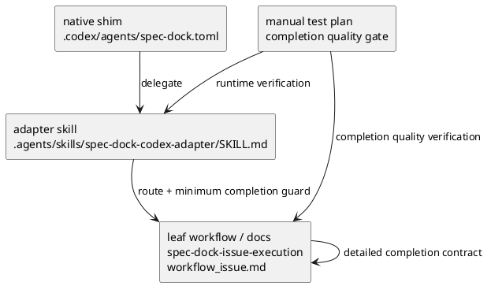

# iss-00051 completion contract 強化のための修正提案資料

## 目的
- manual test で明らかになった delegated workflow gap に対して、実装前に要件・設計・計画のたたき台を整理する
- consultant と repo 分析の結果を統合し、どのファイルにどのような修正を行うのが適切かを説明資料としてまとめる
- ここではまだコード修正には入らず、follow-up 修正のベストプラクティスを契約化する

## 背景
- install / static contract は通っている
- しかし、goal-level の delegated workflow では issue docs 4 点
  - `requirement.md`
  - `design.md`
  - `plan.md`
  - `report.md`
  がテンプレートのまま残るケースが確認された
- これは native shim 自体の discovery/delegation 失敗ではなく、completion contract が薄く、「どこまで到達したら完了とみなすか」が adapter / workflow 層で十分に拘束されていないことを示している

## 参照資料
- manual test blocker:
  - `spec-dock/initiatives/init-local-00002-prototype-feature-expansion/epics/epic-00048-agent-facing-interface-hardening-and-host-adapter-scaffolding/issues/iss-00051-host-native-shim-deployment-and-validation-closure/discussions/20260406t181500z-disc-manual-test-runtime-blockers.md`
- delegated workflow gap 分析:
  - `spec-dock/initiatives/init-local-00002-prototype-feature-expansion/epics/epic-00048-agent-facing-interface-hardening-and-host-adapter-scaffolding/issues/iss-00051-host-native-shim-deployment-and-validation-closure/discussions/20260406t190500z-disc-delegated-workflow-gap-analysis-and-best-practice.md`

## consultant / analyst 議論の要約

### 確認できた事実
- `.codex/agents/spec-dock.toml` は discovery/delegation entrypoint としては十分に薄い
- `.agents/skills/spec-dock-codex-adapter/SKILL.md` も route / reference 中心で、完了条件が弱い
- `spec-dock/docs/workflow_issue.md` には execution contract があるが、shim / adapter 側の minimum guard としては接続が弱い
- manual test では install/static は通るが、runtime quality では docs 4 点未充足のまま止まり得る

### 主要な論点
- shim を厚くするべきか
- adapter に minimum completion guard を置くべきか
- workflow docs / leaf skill に詳細 completion contract を置くべきか
- manual test は install/static と runtime と completion quality を分けるべきか

### consultant の一致見解
- shim は discovery/delegation に徹し、厚くしすぎない
- adapter には最小限の completion guard を置く
- completion の詳細は workflow docs / leaf skill に置く
- manual test は phase を分け、environment blocker と product gap を分離評価する

## ベストプラクティス案

### 採用推奨: 二層強化
- shim:
  - 薄いまま維持する
  - ただし「completion contract を持つ delegated flow に委譲する」ことだけは明示する
- adapter skill:
  - minimum completion guard を持つ
  - issue work では docs 4 点がテンプレートのままなら完了扱いにしない
  - review / validate / sync を実施するか、未実施理由を report に残さなければ完了扱いにしない
- workflow docs / leaf skill:
  - detailed completion contract を正本として明示する
  - cadence、review gate、report 更新順序、blocked/fail の扱いを一貫化する
- manual test:
  - install/static
  - delegated runtime
  - completion quality
  の 3 phase に分ける

## 要件定義書ドラフト（WHAT / WHY）

### 目的
- Codex native shim から delegated workflow を起動した場合でも、issue docs 4 点が具体化されるまで completion とみなさない契約を導入する
- environment blocker と workflow completion gap を切り分けて扱えるようにする

### スコープ
- MUST:
  - `.agents/skills/spec-dock-codex-adapter/SKILL.md` に issue execution の minimum completion contract を追加する
  - `spec-dock/docs/workflow_issue.md` に completion 不可条件を明文化する
  - `spec-dock-issue-execution` 系の leaf workflow 参照先に、docs 4 点未充足時の扱いを反映する
  - manual test plan/checklist に completion quality phase を追加する
- MUST NOT:
  - `.codex/agents/spec-dock.toml` に detailed workflow logic を埋め込まない
  - host ごとに別々の completion logic を複製しない
- OUT OF SCOPE:
  - protocol/state 契約そのものの再設計
  - shim の state owner 化

### 受け入れ条件案
- AC-001:
  - Given:
    - orchestrator が goal-level の issue 実行依頼を native shim 経由で渡す
  - When:
    - delegated workflow が issue execution を進める
  - Then:
    - `requirement.md` / `design.md` / `plan.md` / `report.md` がテンプレートのまま残る場合、完了扱いにしない
- AC-002:
  - Given:
    - sync / validate / review のいずれかを実施できない事情がある
  - When:
    - delegated workflow が終了判定を行う
  - Then:
    - 未実施理由が `report.md` に記録されない限り、完了扱いにしない
- AC-003:
  - Given:
    - manual test を行う
  - When:
    - delegated runtime phase を評価する
  - Then:
    - install/static success と completion quality success を分けて判定し、environment blocker と product gap を混同しない

## 設計書ドラフト（HOW）

### 責務分離
- `.codex/agents/spec-dock.toml`
  - discovery/delegation entrypoint
  - thin host-native shim
  - detailed completion logic は持たない
- `.agents/skills/spec-dock-codex-adapter/SKILL.md`
  - route + minimum completion guard
  - issue work の終了条件を明示する
- `spec-dock/docs/workflow_issue.md`
  - detailed completion contract の正本
  - cadence / review / report / blocked/fail の詳細
- manual test docs
  - 実行環境前提
  - phase ごとの判定
  - evidence の取り方

### minimum completion guard の設計
- issue execution では次を満たさない限り completion 不可
  - active issue が確定している
  - `requirement.md` がテンプレート状態でない
  - `design.md` がテンプレート状態でない
  - `plan.md` がテンプレート状態でない
  - `report.md` に実行証跡がある
  - sync / validate / review を実施したか、未実施理由が記録されている

### completion quality gate の設計
- manual test では phase を分ける
  - phase 1: install/static contract
  - phase 2: delegated runtime feasibility
  - phase 3: completion quality
- phase 3 では docs 4 点のテンプレート残存を fail 扱いにする

### UML（責務分離）

## 実装計画書ドラフト（Execution Plan）

### S01 — requirement/design/plan fixed point
- 目的:
  - completion contract 強化の要件・設計・計画を固定する
- 成果物:
  - issue docs または follow-up issue docs の requirement/design/plan
- 完了条件:
  - shim は薄いまま、adapter / workflow / manual test の責務分離が明記されている

### S02 — adapter minimum completion guard
- 目的:
  - `.agents/skills/spec-dock-codex-adapter/SKILL.md` に minimum completion guard を追加する
- 成果物:
  - adapter skill wording 更新
- 完了条件:
  - issue docs 4 点未充足時は完了不可であることが明記されている

### S03 — workflow detailed completion contract
- 目的:
  - `workflow_issue.md` と必要なら leaf skill に detailed completion contract を追加する
- 成果物:
  - workflow docs / leaf skill 更新
- 完了条件:
  - docs 4 点の具体化、report 証跡、review/validate/sync の扱いが正本で定義されている

### S04 — manual test plan correction
- 目的:
  - manual test の phase 分離と completion quality gate を追加する
- 成果物:
  - plan/checklist/operator brief 更新
- 完了条件:
  - environment blocker と product gap が別判定で記録できる

### S05 — review and closure
- 目的:
  - spec review / code review / QA review に耐える形へ整える
- 完了条件:
  - docs 修正が pass
  - 再手動テスト時に「docs 4 点未充足」が明示的に fail になる

## どのファイルをどう直すべきか

### 1. `.codex/agents/spec-dock.toml`
- 修正方針:
  - 大きくは変えない
  - 委譲先が completion contract を持つことだけ短く補強する
- 例:
  - issue work は completion contract を持つ delegated flow に委譲する
  - completion contract を満たせない場合は完了扱いにしない

### 2. `.agents/skills/spec-dock-codex-adapter/SKILL.md`
- 修正方針:
  - 主修正ポイント
  - route だけでなく minimum completion guard を追加する
- 追加したい内容:
  - docs 4 点がテンプレートなら未完了
  - review / validate / sync の未実施は report に理由を残す
  - blocked/fail を明示する

### 3. `.agents/skills/spec-driven-tdd-workflow/SKILL.md`
- 修正方針:
  - hub なので大きくしない
  - route 後の leaf workflow が completion contract を持つことを短く補足する程度に留める

### 4. `spec-dock/docs/workflow_issue.md`
- 修正方針:
  - detailed completion contract の正本として強化する
- 追加したい内容:
  - docs 4 点未充足時は完了不可
  - report 証跡なしでは完了不可
  - sync / validate / review の未実施時は理由記録が必要

### 5. manual test docs
- 対象:
  - `manual-tests/reports/.../plan.md`
  - `manual-tests/reports/.../checklist.md`
  - `manual-tests/reports/.../operator-brief.md`
- 修正方針:
  - completion quality phase を追加
  - docs 4 点テンプレート残存チェックを追加
  - current-checkout path の portability も改善する

## 非推奨
- shim 単体に workflow completion の詳細を詰め込むこと
- host ごとに completion logic を複製すること
- manual test の blocked を product fail と混同すること

## 最終提案
- まずはコードではなく、docs / skill wording / manual test contract を修正する
- 主修正対象は `.agents/skills/spec-dock-codex-adapter/SKILL.md`
- 次点で `workflow_issue.md`
- shim は最小限だけ補強し、薄いまま維持する
- manual test は completion quality gate を加えて再設計する
