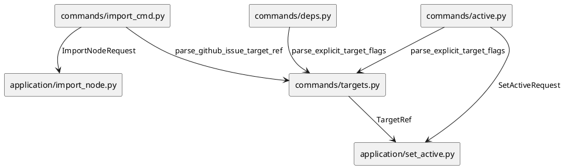
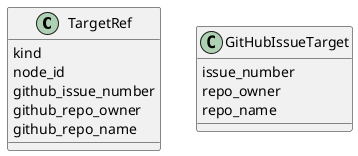

# iss-00052 Reject Non Canonical Git Issue Targets — 設計（HOW）

## 目的・制約
- 目的:
  - `active set` が non-canonical URL-like target を `github#<n>` に誤正規化する経路を止める。
  - malformed target handling を `import issue` と同水準の fail-closed 契約へ寄せる。
- MUST / MUST NOT:
  - MUST: canonical GitHub issue URL の full match、`#<n>`、`<n>`、node id の既存成功経路を維持する。
  - MUST: `git@github.com:owner/repo/issues/<n>` など canonical でない URL-like input を reject する。
  - MUST NOT: `application/set_active.py` 側で受理後に追加補正するのではなく、command parser 段階で fail-closed する。
  - MUST NOT: repo-scope 解決、deps readiness guard、checkout 契約を変更しない。
- 非交渉制約:
  - provider-side source of truth は `src/spec_dock/assets/spec_dock/...` とする。
  - docs 契約と実装契約を一致させる。
- 前提:
  - `active set` と `deps check` は同じ `parse_explicit_target_flags()` / `parse_active_like_target()` を共有する。
  - `import issue` は `parse_github_issue_target_ref()` で URL-like string を strict に reject している。

## 既存実装 / 規約の理解
- 参照した実装 / docs:
  - `src/spec_dock/assets/spec_dock/scripts/spec_dock_runtime/commands/targets.py`
  - `src/spec_dock/assets/spec_dock/scripts/spec_dock_runtime/commands/active.py`
  - `src/spec_dock/assets/spec_dock/scripts/spec_dock_runtime/commands/deps.py`
  - `src/spec_dock/assets/spec_dock/scripts/spec_dock_runtime/commands/import_cmd.py`
  - `src/spec_dock/assets/spec_dock/scripts/spec_dock_runtime/application/set_active.py`
  - `src/spec_dock/assets/spec_dock/scripts/spec_dock_runtime/application/import_node.py`
  - `spec-dock/docs/workflow_issue.md`
  - `spec-dock/docs/reference_github.md`
  - `spec-dock/docs/reference_deps.md`
  - `tests/cli_runtime/test_active.py`
  - `tests/cli_runtime/test_import.py`
  - `tests/cli_runtime/test_runtime_deps_s04.py`
- 現状理解:
  - `commands/active.py` は `parse_explicit_target_flags()` を通して positional target を `TargetRef` に変換する。
  - `parse_active_like_target()` は canonical URL full match 失敗後に `_gh_issue_url_re.search(raw)` を使うため、`git@.../issues/1` のような文字列でも issue number を抽出してしまう。
  - `application/set_active.py` の `_resolve_target_node_id()` は `TargetRef` を前提に node 解決するだけで、canonical URL かどうかは再検証しない。
  - `commands/import_cmd.py` は `parse_github_issue_target_ref()` を使い、`github.com` / `issues/` / `/` / `:` を含む non-canonical URL-like string を fail-closed で reject する。
- 採用するパターン:
  - input normalization を command parser に閉じ込め、application 層には正規化済み `TargetRef` のみを渡す既存パターンを維持する。
  - malformed URL-like string は parser で reject する fail-fast / fail-closed パターンを踏襲する。
- 採用しないもの:
  - `set_active()` で raw string を再解釈して弥縫する案
  - `active set` だけ別 parser を作って `deps check` 共有経路を残す案
- 影響範囲:
  - 直接: `active set` の positional target parsing
  - 間接: `deps check` の positional target parsing
  - 非影響: `--id` / `--github-issue` explicit flags、`import issue` parser、application/deps/status logic

## 採用方針 / トレードオフ
- 論点:
  - `active set` だけ直すか、shared parser を厳格化して `deps check` にも同じ契約を適用するか。
- 選択肢:
  - A:
    - `parse_active_like_target()` を厳格化し、canonical URL full match 以外の URL-like string を reject する。
  - B:
    - `active set` 専用 parser を追加し、shared parser は温存する。
- 決定:
  - A を採用する。
  - 理由:
    - `active set` と `deps check` は同じ `<target>` 契約を持つため、shared parser で整合を保つ方が drift を防げる。
    - 変更箇所が `commands/targets.py` に閉じるため、application 層や docs 契約に対して最小の構造変更で済む。

## 依存関係分析
- upstream / prerequisite:
  - `commands/targets.py` の parser 契約
  - existing docs contract (`workflow_issue.md`, `reference_github.md`)
- downstream / dependent:
  - `commands/active.py`
  - `commands/deps.py`
  - `application/set_active.py`
- 実装起点:
  - 先に `tests/cli_runtime/test_active.py` と必要なら `deps check` 近傍の target parsing 検証を追加し、期待する reject を固定する。
  - 次に shared parser を修正し、既存 success path の回帰を確認する。
- sequencing implications:
  - parser contract を最初に固め、その後に shared parser 実装、最後に docs/test impact を確認する。

### UML（必須: module / dependency）

## インターフェース契約
- API / function / protocol / data boundary:
  - `parse_active_like_target(target: str) -> tuple[TargetRef, str]`
    - canonical GitHub issue URL full match の場合のみ repo-scoped `TargetRef(kind="github_issue")` を返す。
    - URL-like だが canonical ではない入力は `RuntimeError("Invalid target ...")` を送出する。
    - `#<n>` / `<n>` は unscoped GitHub issue target を返す。
    - node id は既存どおり `TargetRef(kind="node_id")` を返す。
  - `parse_explicit_target_flags(...)`
    - positional target 指定時は厳格化された `parse_active_like_target()` を経由する。
    - `--id` / `--github-issue` の explicit path はそのまま維持する。

## クラス / インターフェース詳細設計（必要時）
- Class / Interface:
  - `GitHubIssueTarget`
    - 変更なし。`import issue` 側の strict parser の返却型として維持する。
- responsibility:
  - parser 層が raw string の曖昧性を吸収または reject し、application 層には曖昧さを持ち込まない。
- collaboration:
  - `commands/active.py` / `commands/deps.py` は shared parser に依存し、application 層は `TargetRef` のみを見る。

### UML（任意: class / interface）

## 変更計画
- Add:
  - `tests/cli_runtime/test_active.py` に non-canonical URL-like target reject の回帰テスト
  - 必要なら shared parser 影響を押さえる補助テスト
- Modify:
  - `src/spec_dock/assets/spec_dock/scripts/spec_dock_runtime/commands/targets.py`
  - `tests/cli_runtime/test_active.py`
- Delete:
  - なし
- Move/Rename:
  - なし
- Read only:
  - `application/set_active.py`
  - `application/import_node.py`
  - `commands/active.py`
  - `commands/deps.py`
  - `commands/import_cmd.py`
  - docs 参照ファイル

## 要件 → 設計マッピング
- AC-001 -> `parse_active_like_target()` で non-canonical URL-like string を reject し、`set_active()` に渡さない。
- AC-002 -> canonical URL full match path と repo-scoped `TargetRef` 生成を維持する。
- AC-003 -> `#<n>` / `<n>` / node id 分岐を変更しない。
- AC-004 -> `deps check` も shared parser 経由で同じ reject 契約に従う。
- EC-001 -> canonical GitHub URL full match 以外の `http(s)` URL を reject する現行ガードを維持または強化する。
- EC-003 -> slash/colon を含む URL-like string の reject 条件を shared parser に明示する。
- constraint -> parser 層に閉じた変更と回帰テストで fail-closed を保証する。

## テスト戦略
- Unit:
  - shared parser 相当の分岐は CLI runtime test で十分観測できるため、まず CLI runtime を優先する。
- Integration:
  - `tests/cli_runtime/test_active.py`
    - non-canonical `git@github.com:.../issues/<n>` reject
    - reject 時に `spec-dock/.agent/active.json` が更新されないことの確認
    - canonical current/foreign repo-scoped URL success/fail-closed の既存回帰維持
  - `tests/cli_runtime/test_runtime_deps_s04.py`
    - shared parser 経由で `deps check` も non-canonical URL-like target を reject することを確認する
  - `tests/cli_runtime/test_import.py`
    - non-canonical reject の既存テストを回帰確認する
- E2E / manual:
  - 既存 discussion の再現コマンドが invalid target に変わることを確認できれば十分
- migration / rollback / feature flag if needed:
  - migration なし
  - rollback は parser 変更を戻すだけで可能
  - feature flag なし

## 要件 / 例外 -> verification mapping
- AC-001 -> `test_active_set_rejects_non_canonical_url_like_target` を追加
- AC-001 -> reject 時に active manifest が不変である assert を入れる
- AC-002 -> existing repo-scoped URL success tests
- AC-003 -> existing numeric / node-id active set tests
- AC-004 -> `deps check` の non-canonical URL-like reject test
- EC-001 -> existing invalid URL reject test または追加 case
- EC-003 -> `git@.../issues/<n>` や `owner/repo/issues/<n>` を含む reject case
- constraint -> `tests/cli_runtime/test_import.py` の既存 reject case が green のままであること

## リスク / 移行 / ロールバック（必要時）
- shared parser を厳格化するため、`deps check <target>` でも non-canonical URL-like input が reject される。
- これは shared contract の一貫性という意味では望ましいが、既存利用があれば影響するため `deps check` 既存成功経路の回帰確認を行う。
- 想定外 regressions が出た場合は parser 変更を最小差分で戻せる。

## 未確定事項
- なし
