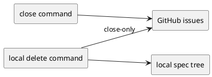
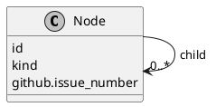
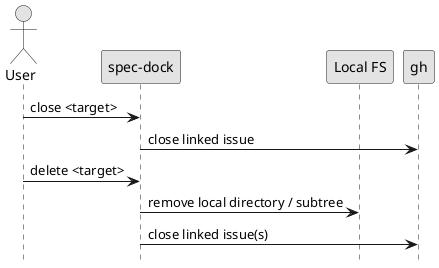

# epic-00054 GitHub lifecycle command expansion — 設計（HOW）

## 全体像
- target boundary:
  - command-side GitHub close
  - local spec node delete
  - destructive guardrail and docs parity
- impacted area:
  - runtime command surface
  - local filesystem mutation
  - GitHub CLI integration
  - docs / tests / dogfooding workflow
- existing relation:
  - 現状の create flow は command 側で完結するが、close は GitHub Web UI へ戻っている。
  - local node cleanup も command contract を持たず、directory 削除が手作業運用になっている。
  - 本 epic はこの lifecycle gap を埋めるが、remote delete は事故リスクから除外する。
  - review-only issue は不自然なため採らず、各 implementation issue に review / success verification を埋め込む。

### UML（推奨: module / context）

## 契約
### API（必要時）
- API-001:
  - Request:
    - lifecycle command input（target, operation, safety flags）
  - Response:
    - local mutation 結果、remote close 結果、warning / confirmation guidance
  - Errors:
    - active / dependency conflict
    - target not found
    - remote close failure
    - confirmation missing

### Data boundary
- SoR:
  - local node structure は `spec-dock/initiatives/**` の directory tree
  - linked GitHub issue state は GitHub issue / `gh`
- consistency model:
  - close command は remote state を close 側へ寄せるが、local tree は保持する
  - delete command は local tree を削除するが、remote side は delete せず close-only とする
  - local delete と remote close を同一 success path に置く場合でも、destructive な主操作は local tree delete、remote は lifecycle close として意味を分離する
  - issue 分割は 2 本とし、第1 issue が close command の契約と acceptance evidence を閉じ、第2 issue が local delete と epic final close-out evidence を閉じる

## データモデル
- model / table changes:
  - node metadata 自体の正本は維持しつつ、delete / close command が参照する target resolution と guardrail 判定が追加される想定
- invariants:
  - remote GitHub issue delete は扱わない
  - delete は local directory removal を伴う destructive operation である
  - issue close と local delete は同義ではない
  - parent scope delete は subtree boundary を明示して扱う

### UML（任意: data model）

## 主要フロー
- Flow-A: close command
  1. target node を解決する
  2. linked GitHub issue と repo scope を確認する
  3. `gh` 経由で remote issue を close する
  4. local state を必要最小限だけ更新し、docs / report / sync で観測可能にする
- Flow-B: local issue delete
  1. target issue node を解決する
  2. active / dependency / confirmation guardrail を確認する
  3. local issue directory を削除する
  4. linked GitHub issue がある場合は remote delete ではなく close を実行または要求する
- Flow-C: local epic / initiative delete
  1. target parent node と subtree を解決する
  2. recursive intent を確認する
  3. child scope 影響と active / dependency guardrail を確認する
  4. local subtree を削除する
  5. linked GitHub issue 群は close-only で扱う

### UML（任意: sequence / flow）

## 失敗設計
- failure mode:
  - target 解決失敗
  - active target delete conflict
  - dependency を持つ node の削除要求
  - remote close failure
  - partial subtree delete risk
- retry:
  - close は remote retry 可能
  - delete は destructive なので、実行前 validation と confirmation で partial failure を避ける
- idempotency:
  - close は closed issue に対して再実行可能であることが望ましい
  - delete は既に存在しない local path に対して安全に失敗または no-op とできることが望ましい
- partial failure:
  - local delete と remote close を同一 command で扱う場合、順序と rollback guidance を明記する必要がある
  - remote close failure 時に local delete を継続するか止めるかは第2 issue で検証対象とする

## 移行戦略
- migration strategy:
  - additive command 追加として導入し、既存 workflow を壊さずに dogfooding から利用開始する
- rollback:
  - command surface は issue 単位で戻せるようにする
  - remote delete を導入しないため、GitHub 側の irreversible delete rollback は対象外とする

## 観測性 / セキュリティ
- observability:
  - close / delete command の CLI evidence
  - filesystem assertion
  - sync / validate 後の state evidence
- role / auth:
  - remote close には `gh` auth と必要権限が必要
- audit / pii:
  - GitHub issue は delete せず close に留めることで、履歴と auditability を維持する

## テスト戦略
- Unit:
  - target resolution
  - safety guardrail 判定
  - remote close adapter
- Integration:
  - close command end-to-end
  - local delete command end-to-end
  - subtree delete guardrail
- E2E:
  - docs parity
  - dogfooding validation
- E-AC mapping:
  - E-AC-001 -> 第1 issue: close command + docs/tests/review/success verification
  - E-AC-002 -> 第2 issue: local issue delete + remote close-only boundary + docs/tests/review/success verification
  - E-AC-003 -> 第2 issue: parent scope subtree delete guardrail + integration evidence
  - E-AC-004 -> 第2 issue: docs parity + dogfooding validation + final review

## 関連 ADR
- なし:
  - 現時点では epic planning 段階のため未作成。irreversible な destructive boundary を固定する必要が出た場合は ADR 化を検討する。

## 未確定事項
- Q-001:
  - 質問:
    - delete command で remote close を local delete の中に内包するか、別 step / flag として分けるか。
  - 選択肢:
    - A:
      - delete command が remote close まで一括で扱う
    - B:
      - delete と close を分離し、delete は local-only、必要なら明示的に close を別実行する
  - 推奨案:
    - A を基本としつつ、confirmation と failure guidance を強くする。dogfooding 上は一貫操作の価値が高い。
  - 影響範囲:
    - command UX
    - partial failure design
    - docs / tests
