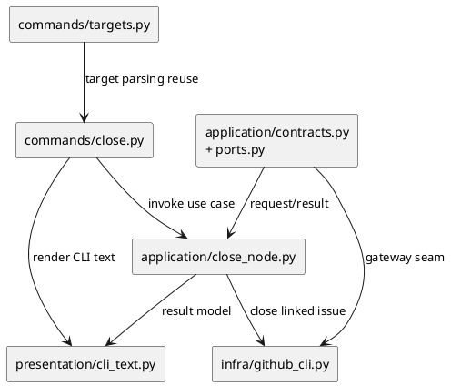
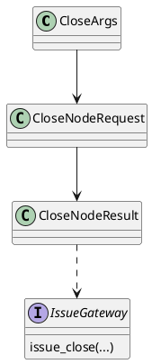

# iss-00055 Close Linked Github Issues From Specdock Command — 設計（HOW）

## 目的・制約
- 目的:
  - linked GitHub issue を SpecDock command から close できるようにし、close-only の remote lifecycle contract を固定する。
- MUST / MUST NOT:
  - MUST: target node の linked GitHub issue を close できること
  - MUST: issue / epic / initiative いずれの target でも、close 対象は target node 自身の linked GitHub issue のみに限定すること
  - MUST NOT: local directory / docs を削除しないこと
  - MUST NOT: child issue へ cascade close しないこと
  - MUST NOT: GitHub-side delete を扱わないこと
- 非交渉制約:
  - additive change とし、既存 create / import / sync / validate / active / deps contract を崩さない
  - `gh` CLI と repo scope の既存解決パターンを再利用する
- 前提:
  - close 後の local `done` 観測は `sync --github` の既存経路に委ねる
  - command surface は existing target syntax と揃える

## 既存実装 / 規約の理解
- 参照した実装 / docs:
  - `src/spec_dock/assets/spec_dock/scripts/spec_dock_runtime/commands/active.py`
  - `src/spec_dock/assets/spec_dock/scripts/spec_dock_runtime/commands/deps.py`
  - `src/spec_dock/assets/spec_dock/scripts/spec_dock_runtime/commands/targets.py`
  - `src/spec_dock/assets/spec_dock/scripts/spec_dock_runtime/application/set_active.py`
  - `src/spec_dock/assets/spec_dock/scripts/spec_dock_runtime/application/check_deps.py`
  - `src/spec_dock/assets/spec_dock/scripts/spec_dock_runtime/application/contracts.py`
  - `src/spec_dock/assets/spec_dock/scripts/spec_dock_runtime/application/ports.py`
  - `src/spec_dock/assets/spec_dock/scripts/spec_dock_runtime/infra/github_cli.py`
  - `src/spec_dock/assets/spec_dock/scripts/spec_dock_runtime/presentation/cli_text.py`
- 現状理解:
  - command surface は `commands/*` と `cli/parser.py` / `cli/registry.py` で公開される。
  - node / GitHub issue target の explicit syntax は `commands/targets.py` と `TargetRef` で共通化されている。
  - application 層には `set_active` / `check_deps` が target 解決を持ち、node id と GitHub issue number の両方を graph から解決している。
  - `IssueGateway` と `infra/github_cli.py` には create / list / view はあるが close は未定義である。
  - presentation 層は command ごとに dedicated renderer を持つ。
- 採用するパターン:
  - top-level command を 1 つ追加し、args parsing は `active` / `deps` と同じ explicit target flags を再利用する
  - application 層に dedicated use case を追加し、target 解決は `set_active` / `check_deps` と整合する形で行う
  - `IssueGateway` に close operation を追加し、`infra/github_cli.py` で `gh` 呼び出しを閉じ込める
  - presentation 層で close success / no-op / error の CLI text を専用に返す
- 採用しないもの:
  - `sync` に close mutation を混ぜること
  - `active set` や `deps check` に side effect を持たせること
  - delete 用の subtree orchestration をこの issue に持ち込むこと
- 影響範囲:
  - `cli/parser.py`
  - `cli/registry.py`
  - `cli/bootstrap.py`
  - `commands/`
  - `application/contracts.py`
  - `application/ports.py`
  - `application/`
  - `infra/github_cli.py`
  - `presentation/cli_text.py`
  - `spec-dock/docs/reference_github.md`
  - runtime / CLI tests

## 採用方針 / トレードオフ
- 論点:
  - close command を `sync` の派生として自動同期込みで扱うか、remote close だけの単独 command として扱うか
  - target syntax を新規定義するか、existing explicit target flags を再利用するか
- 選択肢:
  - Option A:
    - `close` command は remote close のみを行い、確認は利用者が `sync --github` で明示的に行う
  - Option B:
    - `close` command が remote close と `sync --github` 相当を内包する
- 決定:
  - Option A を採用する
  - 理由:
    - remote mutation と generated artifact 更新を分離した方が、既存 `sync` contract と責務分割に沿う
    - failure surface が単純で、close success / sync failure の混線を避けられる
    - issue55 は close-only を固定する slice なので、delete や full refresh を混ぜない方が境界が明確である

## 依存関係分析
- upstream / prerequisite:
  - `commands/targets.py` の explicit target parsing
  - `application/set_active.py` / `application/check_deps.py` の target node 解決パターン
  - `infra/github_cli.py` の `gh` adapter
- downstream / dependent:
  - issue56 の local delete / final close-out で再利用する remote close capability
  - docs / tests / dogfooding guidance
- 実装起点:
  - 依存の少ないもの / 先に固定すべき interface / 先に通すべき test を書く
  - まず contracts / ports / gateway の close seam を固定し、その上で command と presentation を載せる
- sequencing implications:
  - plan では upstream / prerequisite から順に step を組む

### UML（必須: module / dependency）

## インターフェース契約
- API / function / protocol / data boundary:
  - CLI surface:
    - new top-level command `close`
    - target forms は `active set` / `deps check` と同様に `<target>` / `--id` / `--github-issue` の exactly-one を採る
  - application contracts:
    - `CloseNodeRequest(target: TargetRef)`
    - `CloseNodeResult(node_id, node_kind, github_issue_number, issue_snapshot, already_closed, warnings)`
    - `UseCases.close_node`
  - gateway seam:
    - `IssueGateway.issue_close(repo_root, issue_number, repo_slug=None) -> IssueSnapshot`
  - data boundary:
    - mutation 対象は GitHub issue state のみ
    - local tree / active pointers / generated artifacts は command 実行時に直接書き換えない

## クラス / インターフェース詳細設計（必要時）
- Class / Interface:
  - `CloseArgs`
  - `CloseNodeRequest` / `CloseNodeResult`
  - `IssueGateway.issue_close`
- responsibility:
  - `CloseArgs`: CLI からの target normalization
  - `CloseNodeRequest` / `CloseNodeResult`: application と presentation をつなぐ close-specific contract
  - `IssueGateway.issue_close`: `gh` close operation の infra seam
- collaboration:
  - `commands/close.py` は `parse_explicit_target_flags` を使って `TargetRef` を組み立て、application use case を呼ぶ
  - `application/close_node.py` は graph から target node を resolve し、既存 `issue_view_snapshot` で current state を確認する
  - current state が `CLOSED` なら `already_closed=True` の success/no-op result を返し、`OPEN` の場合だけ `IssueGateway.issue_close` を実行する
  - `IssueGateway.issue_close` 実行時に remote side が read-after-close race で既に closed へ変わっていた場合も、use case は implementation-dependent error を露出せず `already_closed=True` の success/no-op に正規化する
  - `presentation/cli_text.py` は success/no-op を user-facing text に変換する

### UML（任意: class / interface）

## 変更計画
- Add:
  - `commands/close.py`
  - `application/close_node.py`
  - close-specific request/result / use case contracts
  - close-specific CLI renderer
- Modify:
  - `cli/parser.py`
  - `cli/registry.py`
  - `cli/bootstrap.py`
  - `application/ports.py`
  - `infra/github_cli.py`
  - docs / tests
- Delete:
  - なし
- Move/Rename:
  - なし
- Read only:
  - delete-related epic docs
  - existing active / deps logic の behavior

## 要件 → 設計マッピング
- AC-001 -> top-level `close` command + target node resolve + `IssueGateway.issue_close` + no local mutation
- AC-002 -> close command は sync を内包せず、close success 時も local docs/tree/generated state を変えず、`sync --github` による既存観測経路だけで `done` を観測することを docs / tests で固定する
- EC-001 -> target node resolve 後に linked GitHub issue 不在を fail-fast error にする
- EC-002 -> infra close failure は application error として返し、local tree untouched を維持する
- EC-003 -> `already_closed=True` を `CloseNodeResult` で表現し、CLI では success/no-op として render する
- constraint -> remote close-only、non-cascade、no local delete

## テスト戦略
- Unit:
  - target parsing reuse の close args tests
  - close use case の target resolve tests
  - already-closed/no-linked-issue/gh-failure handling tests
  - read-after-close race を success/no-op へ正規化する tests
- Integration:
  - close command end-to-end
  - `gh issue close` adapter integration
  - close success 直後は local docs/tree/generated state が unchanged であることの integration
  - close success 後に `sync --github` で初めて `done` 観測可能であることの integration
- E2E / manual:
  - dogfooding repo で linked issue を close し、GitHub state と `sync --github` の結果を確認する
- migration / rollback / feature flag if needed:
  - additive command のため migration 不要
  - rollback は close command surface と gateway seam を issue 単位で戻す

## 要件 / 例外 -> verification mapping
- AC-001 -> close command integration + CLI text assertions
- AC-002 -> success-path local-state-unchanged assertion + `sync --github` related assertion + docs parity
- EC-001 -> no-linked-issue error test
- EC-002 -> gh failure leaves local tree unchanged test
- EC-003 -> pre-check already-closed success/no-op test + read-after-close race normalization test
- constraint -> non-cascade, no local delete, no remote delete assertions

## リスク / 移行 / ロールバック（必要時）
- risk:
  - `gh issue close` の exact CLI behavior に依存する
  - issue / epic / initiative target の non-cascade を実装で崩すと issue56 の subtree contract と衝突する
- mitigation:
  - close 対象は target node 自身の `github.issue_number` に限定し、child traversal を本 issue では導入しない
  - already-closed behavior は success/no-op として早期に test 固定する
  - read-after-close race も `already_closed=True` に正規化し、`gh` の文言差を application 境界で吸収する
- rollback:
  - parser/registry/contracts/gateway の close 追加差分を issue 単位で戻す

## 未確定事項
- なし:
  - close command は top-level `close` として追加する
  - target node 自身のみ close し、child cascade は扱わない
  - close 後の local `done` 反映は explicit `sync --github` で確認する
