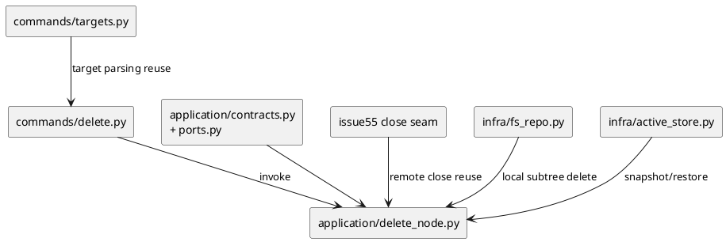
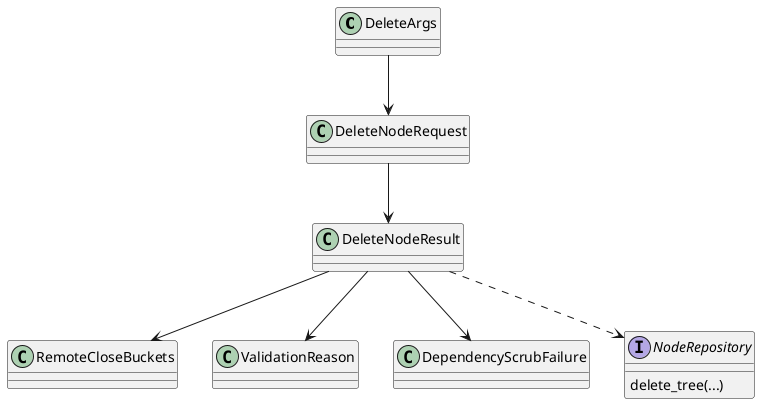

# iss-00056 Delete Local Spec Nodes With Safeguards And Epic Final Closeout — 設計（HOW）

## 目的・制約
- 目的:
  - issue / epic / initiative の local delete を安全に提供し、issue56 自身で `epic-00054` の final close-out まで閉じる。
- MUST / MUST NOT:
  - MUST: issue / epic / initiative の local directory / subtree delete を扱う
  - MUST: parent scope delete は explicit recursive opt-in を要求する
  - MUST: active/deps conflict を default で block し、override は明示 opt-in のみとする
  - MUST: remote handling は close-only であり、remote close 成功後に local delete へ進む
  - MUST NOT: GitHub-side delete を扱わない
  - MUST NOT: remote close failure 後に local delete を継続しない
- 非交渉制約:
  - destructive operation なので partial failure guidance が必要
  - issue55 の close capability を前提に再実装しない
  - issue56 の中で epic final review / final validation / close-out evidence を保持する
- 前提:
  - issue55 で close command / close gateway seam が導入済みである
  - active state store / deps reader / node repo の既存 port を利用できる

## 既存実装 / 規約の理解
- 参照した実装 / docs:
  - `src/spec_dock/assets/spec_dock/scripts/spec_dock_runtime/commands/targets.py`
  - `src/spec_dock/assets/spec_dock/scripts/spec_dock_runtime/application/set_active.py`
  - `src/spec_dock/assets/spec_dock/scripts/spec_dock_runtime/application/check_deps.py`
  - `src/spec_dock/assets/spec_dock/scripts/spec_dock_runtime/application/contracts.py`
  - `src/spec_dock/assets/spec_dock/scripts/spec_dock_runtime/application/ports.py`
  - `src/spec_dock/assets/spec_dock/scripts/spec_dock_runtime/infra/active_store.py`
  - `src/spec_dock/assets/spec_dock/scripts/spec_dock_runtime/infra/fs_repo.py`
  - `spec-dock/docs/reference_deps.md`
  - `spec-dock/docs/reference_sync.md`
- 現状理解:
  - target parsing と node resolve は `TargetRef` / `commands/targets.py` / `set_active.py` / `check_deps.py` に既存パターンがある。
  - active state には snapshot / restore seam があり、destructive operation の前後で利用可能である。
  - fs repo には node record 読み出しと meta write はあるが、delete seam は未定義である。
  - deps / active は既存 command で fail-fast guard があり、この issue では delete preflight に流用できる。
- 採用するパターン:
  - target parsing は issue55 と同じ explicit target flags を再利用するが、`delete` では `<target>` positional alias / `--id` / `--github-issue` の 1-of selector contract を専用に固定する
  - application 層に dedicated delete use case を追加する
  - active/deps/subtree resolve は graph ベースで preflight し、selector resolve と subtree-wide metadata barrier を含めて mutation 前にすべて確定する
  - remote close は issue55 の seam を再利用し、subtree 全体で必要な close 対象集合を mutation 前に確定し、その全件成功を barrier として local delete 前に完了させる
  - local subtree delete は deepest-first、同一 depth では node id lexical order で行う
- 採用しないもの:
  - path 指定だけでの ad-hoc filesystem delete
  - recursive opt-in の無い parent delete
  - remote close と local delete のベストエフォート混在
- 影響範囲:
  - `cli/parser.py`
  - `cli/registry.py`
  - `cli/bootstrap.py`
  - `commands/`
  - `application/contracts.py`
  - `application/ports.py`
  - `application/`
  - `infra/fs_repo.py`
  - `infra/active_store.py`
  - docs / tests / dogfooding artifacts

## 採用方針 / トレードオフ
- 論点:
  - remote close と local delete の順序
  - active/deps conflict を hard block のみとするか、明示 override を許可するか
  - destructive confirmation を prompt か flag かのどちらで固定するか
- 選択肢:
  - Option A:
    - remote close 成功後に local delete を行い、active/deps conflict は `--force` でのみ override 可、destructive confirmation は `--yes` で明示する
  - Option B:
    - local delete を先に行い、remote close は後追いにする
- 決定:
  - Option A を採用する
  - 理由:
    - remote close failure 時に local tree を失う方が回復しづらい
    - close-only は reversible 寄りであり、destructive local delete の前に終える方が安全
    - override を完全禁止すると運用が硬すぎるため、`--force` を active/deps conflict 専用の opt-in として残す
    - destructive confirmation は non-interactive / test-friendly に固定する必要があるため、prompt ではなく `--yes` を採用する

## 依存関係分析
- upstream / prerequisite:
  - issue55 の close capability
  - `commands/targets.py` の target parsing
  - active state snapshot / restore
  - deps / active resolve logic
- downstream / dependent:
  - `epic-00054` の final close-out
  - provider / dogfooding docs parity
- 実装起点:
  - 依存の少ないもの / 先に固定すべき interface / 先に通すべき test を書く
  - delete preflight / plan contract を先に固定し、その後 filesystem mutation seam、最後に final close-out evidence を載せる
- sequencing implications:
  - plan では upstream / prerequisite から順に step を組む

### UML（必須: module / dependency）

## インターフェース契約
- API / function / protocol / data boundary:
  - CLI surface:
    - new top-level command `delete`
    - target forms は `<target>` / `--id` / `--github-issue`
    - `<target>` は node id positional alias のみ
    - selector は 1 つだけ指定可
    - `--github-issue` は digits-only decimal を normalize して解決する
    - `<target>` / `--id` / `--github-issue` は `spec-dock/initiatives/**` を探索対象にする
    - parent scope delete は node-kind based に `--recursive` 必須
    - issue target で `--recursive` が付与された場合は accepted no-op とし、通常の issue delete outcome を返す
    - active/deps conflict override は `--force`
    - destructive confirmation は `--yes`
    - machine-readable payload は `--json` 指定時に stdout JSON object 1 件
- application contracts:
    - `DeleteNodeRequest(target_selector, recursive, force, confirmed, json_mode)`
    - `DeleteNodeResult(status, target_id, deleted_node_ids, remaining_node_ids, remote_close, offending_node_ids, validation_reasons, active_restore_result, recovery_guidance, dependency_scrub_failures)`
    - `UseCases.delete_node`
  - gateway / repo seams:
    - issue55 の close seam を再利用
    - fs repo に subtree delete seam を追加
  - data boundary:
    - remote mutation は close-only
    - local mutation は target subtree の directory removal
    - active / generated state は command 後に `validate` / `sync --github` で観測する

## selector / result canonicalization
- selector canonicalization:
  - `<target>` は node id positional alias としてのみ扱い、`--id` と同じ解決経路へ正規化する
  - `<target>` / `--id` は `spec-dock/initiatives/**` 配下の canonical tree placement を走査し、directory basename から抽出した canonical node id token の完全一致で候補を集計する
  - `--github-issue` は digits-only decimal を positive base-10 integer へ正規化して候補集計する
  - selector 解決中は partially scaffolded / stale / malformed directory を discovery から除外しつつ、would-match target に対してだけ `metadata_validation_failed` を返せるようにする
- node discovery canonicalization:
  - canonical node kind は path placement と id prefix の一致で決める
  - `.meta.json` は linked GitHub identity の正本だが、selector discovery 自体は canonical tree placement と basename token extraction を先に使う
- metadata validity classes:
  - subtree-wide linked GitHub validation では各 node を `unlinked` または `linked-and-normalized` のどちらかに分類する
  - `unlinked` は `github_repo_owner` / `github_repo_name` / `github_issue_number` がすべて absent または null の状態だけを許容する
  - `linked-and-normalized` は 3 fields がすべて present で、owner/repo は trim 後 non-empty string、issue number は JSON integer または trim 後 digits-only string から positive base-10 integer に正規化できる状態だけを許容する
  - partial linkage、empty/whitespace owner-repo、non-string owner-repo、non-positive/non-digits issue number、missing/unreadable/malformed `.meta.json` は invalid metadata として集約する
- remote identifier canonicalization:
  - canonical remote issue identifier は `<owner>/<repo>#<number>` とする
  - owner / repo は lowercase 正規化し、issue number は positive base-10 integer に正規化する
  - duplicate linkage は canonical remote issue identifier 単位で dedupe する
- result ordering:
  - `deleted_node_ids` は local delete execution order
  - `remaining_node_ids` / `offending_node_ids` は node id lexical order
  - `remote_close` 各 bucket は owner/repo lexical、次に issue number numeric order
  - `dependency_scrub_failures` は node id lexical、次に edge target id lexical order

## destructive confirmation contract
- confirmation primitive:
  - `--yes` を destructive confirmation の正本とする
- behavior:
  - `--yes` が無い場合、command は preflight summary を返して stop し、remote close / local delete を開始しない
  - interactive prompt は実装しない
  - tests と CI は `--yes` の有無で destructive boundary を検証する
- rationale:
  - non-interactive CLI / test / automation で同一 contract を保てる

## machine-readable result matrix
- common payload shape:
  - `status` は requirement の terminal status vocabulary を使う
  - `target_id` は resolved target があれば node id、無ければ `null`
  - `remote_close` は `closed` / `noop_already_closed` / `failed` / `skipped_not_attempted` を持つ object
  - `validation_reasons` は `{node_id, code, message}` object array とする
  - process exit は `status=ok` のときだけ zero、それ以外は non-zero とする
- status-specific field matrix:
  - `ok`:
    - required: `status`, `target_id`, `deleted_node_ids`, `remaining_node_ids`, `remote_close`, `active_restore_result`
    - constraints: `remaining_node_ids=[]`、`active_restore_result in {cleared, not_needed}`
  - `invalid_selector_combination` / `invalid_selector_syntax` / `target_not_found` / `ambiguous_target` / `active_conflict` / `dependency_conflict` / `recursive_required` / `confirmation_required`:
    - required: `status`, `target_id`, `offending_node_ids`, `validation_reasons`
    - forbidden: `deleted_node_ids`, `remote_close`
  - `metadata_validation_failed`:
    - required: `status`, `target_id`, `offending_node_ids`, `validation_reasons`, `remote_close`
    - constraints: `remote_close` buckets はすべて空配列
  - `remote_close_failed`:
    - required: `status`, `target_id`, `remote_close`, `deleted_node_ids`
    - constraints: `deleted_node_ids=[]`
    - forbidden: `remaining_node_ids`, `offending_node_ids`, `validation_reasons`, `dependency_scrub_failures`
  - `local_delete_partial_failure`:
    - required: `status`, `target_id`, `deleted_node_ids`, `remaining_node_ids`, `remote_close`, `active_restore_result`, `recovery_guidance`, `dependency_scrub_failures`
    - constraints: filesystem delete 未完了時は dependency scrub 未実行で `dependency_scrub_failures=[]`

## preflight / mutation state machine
- precedence:
  - `invalid_selector_combination` / `invalid_selector_syntax`
  - selector resolve (`target_not_found` / `ambiguous_target` / `metadata_validation_failed`)
  - `confirmation_required`
  - `recursive_required`
  - `active_conflict`
  - `dependency_conflict`
- barrier rules:
  - 上記 local preflight が通過し、subtree-wide linked GitHub metadata validation と required remote close set resolve が成功するまでは remote close を開始しない
  - subtree-wide metadata validation failure では remote close buckets は空配列で固定する
  - required remote close 実行中に 1 件でも失敗したら、その時点で close を停止し、未着手 remainder は `skipped_not_attempted` として返す
  - `--force` は `active_conflict` / `dependency_conflict` にしか効かない
- dependency guard boundary:
  - dependency preflight は delete target subtree から subtree 外へ出る blocker / blocked edges だけを conflict 対象にする
  - subtree 内部だけで閉じる dependency edges は guard failure にしない
- post-mutation rules:
  - success forced delete で active target または active subtree member が消えた場合だけ active selection を clear し、`active_restore_result=cleared` とする
  - non-forced success では active clear を行わず、`active_restore_result=not_needed` を返す
  - local delete partial failure では deleted node ids を snapshot から除外した候補を restore し、候補ゼロなら clear にフォールバックする
  - dependency scrub は successful forced delete かつ subtree 外へ出る dependency edges が存在する場合にだけ、local subtree delete 完了後に行う
  - dependency scrub failure は `local_delete_partial_failure` に集約し、trigger 条件を満たさない場合は `dependency_scrub_failures=[]` とする

## クラス / インターフェース詳細設計（必要時）
- Class / Interface:
  - `DeleteArgs`
  - `DeleteNodeRequest` / `DeleteNodeResult`
  - `RemoteCloseBuckets`
  - `ValidationReason`
  - `DependencyScrubFailure`
  - `NodeRepository.delete_tree(...)`
- responsibility:
  - `DeleteArgs`: target / recursive / force / yes の CLI normalization
  - `DeleteNodeRequest` / `DeleteNodeResult`: delete command と application/presentation 間の exact contract
  - `RemoteCloseBuckets`: canonical remote issue identifier ごとの close 結果 bucket を保持する
  - `ValidationReason`: selector / metadata / guardrail failure を machine-readable に表す
  - `DependencyScrubFailure`: surviving node metadata から削除対象参照を除去できなかった edge を表す
  - `NodeRepository.delete_tree(...)`: local subtree removal の infra seam
- collaboration:
  - `commands/delete.py` は target を解釈し、application use case を呼ぶ
  - `application/delete_node.py` は graph から target / subtree を resolve し、selector resolve / confirmation / recursive / active / deps / metadata preflight を requirement 順で行う
  - dependency preflight は subtree 外へ出る blocker / blocked edges だけを見る
  - preflight pass 後に active snapshot を取得し、subtree 内 linked GitHub issue の close 対象集合を導出する
  - issue55 close seam を使い、close 対象集合の全件成功を barrier として確認するまで local delete を開始しない
  - barrier 成功後にのみ fs repo で local subtree を deepest-first / same-depth lexical order で delete する
  - local mutation 失敗時は active snapshot から deleted node ids を除外した selection を restore し、dependency scrub failure を含む partial failure payload を返す

### UML（任意: class / interface）

## 変更計画
- Add:
  - `commands/delete.py`
  - `application/delete_node.py`
  - delete-specific request/result / use case contracts
  - delete-specific CLI renderer
  - fs delete seam
- Modify:
  - `cli/parser.py`
  - `cli/registry.py`
  - `cli/bootstrap.py`
  - `application/ports.py`
  - `infra/fs_repo.py`
  - docs / tests / dogfooding artifacts
- Delete:
  - なし
- Move/Rename:
  - なし
- Read only:
  - issue55 close-specific docs/command contract
  - current node id / target parsing rules

## 要件 → 設計マッピング
- AC-001 -> issue target delete flow + remote close-only + filesystem assertions
- AC-002 -> recursive parent delete + subtree resolve + remote close set derivation + all-success barrier + close-only cascade to subtree-linked issues
- AC-003 -> docs parity / validate / sync --github / final spec review evidence in issue56 + explicit epic close-out gate
- EC-001 -> active conflict preflight
- EC-002 -> dependency conflict preflight
- EC-003 -> missing `--recursive` fail-fast
- EC-004 -> remote close failure aborts local delete
- EC-005 -> missing path explicit error
- EC-006 -> missing confirmation fail-fast
- EC-007 -> canonical remote issue identifier dedupe
- EC-008 -> already-closed remote issue を noop success bucket に分離
- EC-009 -> subtree-wide metadata validation failure with empty remote buckets
- EC-010 -> local delete partial failure payload + active restore + recovery guidance
- constraint -> no remote delete, explicit recursive opt-in, explicit `--yes`, bounded `--force`, epic final close-out in this issue

## テスト戦略
- Unit:
  - selector canonicalization (`<target>` / `--id` / `--github-issue`)
  - selector edge cases（未指定、複数指定、leading-zero normalization、would-match metadata failure、無関係 invalid metadata 除外）
  - active/deps/recursive/confirmation guardrail evaluation
  - subtree-wide metadata validation and canonical remote issue identifier normalization
  - delete plan ordering (deepest-first / same-depth lexical)
  - dependency scrub failure collection ordering
  - result field matrix（required/forbidden fields per status）
- Integration:
  - issue delete end-to-end
  - parent recursive delete end-to-end
  - subtree remote-close-set derivation and all-success barrier
  - remote close failure abort path
  - duplicate linkage dedupe
  - already-closed remote issue noop path
  - metadata validation failure with empty remote buckets
  - active snapshot / restore path
  - local delete partial failure path
  - exit code contract (`ok`=0, failures non-zero)
- E2E / manual:
  - dogfooding repo で issue / epic / initiative delete contract を確認する
  - issue56 完了時に `validate` / `sync --github` / docs parity / final spec review を再実行する
- migration / rollback / feature flag if needed:
  - migration 不要
  - rollback は delete command surface と fs seam を issue 単位で戻す
  - restore は active pointers まで、deleted local tree 自体の rollback は対象外

## 要件 / 例外 -> verification mapping
- AC-001 -> issue delete integration + remote close-only assertions
- AC-002 -> recursive subtree delete integration + close-only subtree assertions
- AC-003 -> `validate` / `sync --github` / docs parity / final spec review evidence
- selector contract -> invalid selector combination / malformed `--github-issue` / leading-zero normalization / would-match metadata failure / unrelated invalid metadata exclusion tests
- result contract -> required/forbidden fields per status + ordering rules tests
- exit code contract -> `ok` zero / non-`ok` non-zero test
- EC-001 -> active conflict test
- EC-002 -> dependency conflict test
- EC-003 -> no-recursive fail-fast test
- EC-004 -> remote close failure abort test
- EC-005 -> missing path explicit error test
- EC-006 -> missing confirmation error test
- EC-007 -> duplicate linkage dedupe test
- EC-008 -> already-closed noop bucket test
- EC-009 -> metadata validation failure / empty remote buckets test
- EC-010 -> local delete partial failure / active restore / recovery guidance test
- constraint -> no remote delete / no review-only issue / explicit `--yes` / bounded `--force` / issue56 owns final close-out assertions

## リスク / 移行 / ロールバック（必要時）
- risk:
  - partial destructive state
  - parent subtree impact の見積もり漏れ
  - issue55 close seam との contract drift
- mitigation:
  - full preflight before mutation
  - active snapshot / restore
  - subtree-wide remote close all-success barrier before local delete
  - docs/test parity in issue56 itself
- rollback:
  - command / contracts / fs seam は戻せる
  - deleted local subtree は rollback 対象外なので、事前確認と fail-fast を重視する

## 具体フロー
1. selector resolve:
   - `<target>` / `--id` / `--github-issue` の 1-of selector rule を確認する。
   - `spec-dock/initiatives/**` を探索し、canonical node id token または normalized github issue number で target を解決する。
   - would-match target が invalid metadata の場合は `metadata_validation_failed` を返し、`offending_node_ids` / `validation_reasons` を埋める。
2. local preflight:
   - requirement の precedence に従い `confirmation_required`、`recursive_required`、`active_conflict`、`dependency_conflict` を順に評価する。
   - epic / initiative は child 有無にかかわらず node-kind based に `--recursive` 必須とする。
   - issue に `--recursive` が付いていても error にはせず、そのまま通常の issue delete flow へ進める。
   - dependency guard は subtree 外へ出る blocker / blocked edges だけを対象にする。
3. subtree metadata barrier:
   - target subtree 全体の `.meta.json` / linked GitHub metadata validation を完了し、remote close set を確定する。
   - partial linkage / malformed `.meta.json` / normalize 不可 metadata は全 offender を集約して `metadata_validation_failed` とする。
4. active snapshot:
   - destructive mutation 前に active selection snapshot を取得する。
5. all-remote-close barrier:
   - deduped remote close set を owner/repo lexical + issue number numeric order で close する。
   - already-closed remote issue は `noop_already_closed` bucket へ積む。
   - 失敗時は `remote_close.failed` と `remote_close.skipped_not_attempted` を埋めて `remote_close_failed` を返し、local delete は未開始とする。
6. local subtree delete:
   - target subtree を deepest-first、same-depth lexical node id order で delete する。
7. post-delete cleanup:
   - successful forced delete かつ surviving external dependency edges がある場合だけ scrub を行う。
   - active selection は successful forced delete で active target または active subtree member が削除された場合だけ clear し、それ以外の success では変更しない。
   - partial failure 時は deleted nodes を除外して restore し、restore 不可なら clear にフォールバックする。
8. result render:
   - `--json` は requirement の field matrix に従う JSON object を stdout へ出力する。
   - human-readable path は CLI text renderer を使う。
9. issue56 evidence:
   - docs parity / `validate` / `sync --github` / final spec review evidence を report に記録する。

## エラー契約
- selector / guardrail failures:
  - `invalid_selector_combination` / `invalid_selector_syntax` / `target_not_found` / `ambiguous_target` / `confirmation_required` / `recursive_required` / `active_conflict` / `dependency_conflict` は local preflight failure として扱う
  - remote close / local delete / active mutation は開始しない
  - `offending_node_ids` と `validation_reasons` は requirement の field matrix に従って返す
- metadata validation failure:
  - selector would-match failure と subtree-wide linked metadata failure の両方を `metadata_validation_failed` に正規化する
  - remote close buckets は空配列で固定する
- remote close failure:
  - barrier failure として扱い、`remote_close.failed` / `remote_close.skipped_not_attempted` を返す
  - `deleted_node_ids=[]` のまま local delete 未開始で終了する
- local delete partial failure:
  - filesystem delete failure または dependency scrub failure を `local_delete_partial_failure` に集約する
  - `recovery_guidance` は restore / validate / sync / manual follow-up の優先順で返す

## epic final close-out gate
- boundary:
  - delete command 自体は `epic-00054` を自動 close しない
  - issue56 の implementation/report close-out step が epic close authority を持つ
- executable gate:
  - issue55 の `requirement.md` / `design.md` / `plan.md` が spec review pass で確定している
  - issue56 の `requirement.md` / `design.md` / `plan.md` が spec review pass で確定している
  - issue55 の implementation / QA / spec review evidence が issue55 `report.md` に存在する
  - issue56 の implementation / QA / spec review evidence が issue56 `report.md` に存在する
  - provider / dogfooding docs parity の確認結果が issue56 `report.md` に存在する
  - `./spec-dock/scripts/spec-dock validate` と `./spec-dock/scripts/spec-dock sync --github` の結果が issue56 `report.md` に存在する
- evidence location:
  - issue56 の `report.md` を epic final close-out の正本とする
  - epic `report.md` には issue56 report を参照する close-out 要約のみを残す

## 未確定事項
- なし
  - 影響範囲:
    - CLI UX
    - doctor / docs guidance
