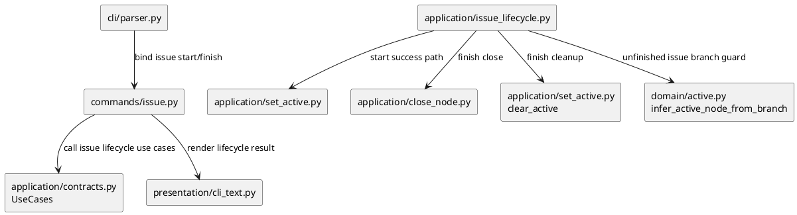
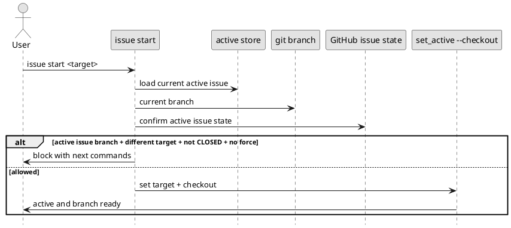
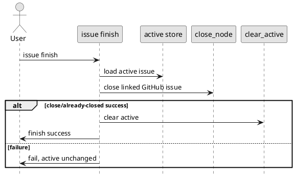

# iss-00088 Issue lifecycle start and finish commands — 設計（HOW）

## Parent Diagram References
- Epic:
  - `epic-00054` は GitHub lifecycle command expansion として、command-side close と local delete の lifecycle gap を扱う。
  - 本 issue は既存 `close` capability を通常 issue execution の `finish` 導線へ結び、`active set --checkout` を通常 `start` 導線へ包む追加 slice である。
- reused decisions:
  - remote GitHub issue delete は扱わない。
  - close は linked GitHub issue の close-only operation とする。
  - branch naming は既存 `active set --checkout` の `<id>-<slug>` decision を再利用する。

## 目的・制約
- 目的:
  - 通常 issue execution の primary path を `issue start` / `issue finish` として表現する。
  - `active set` は manual / recovery path として維持する。
  - 未完了 active issue branch から別 issue へ移る事故だけを `issue start` 側で止める。
- MUST / MUST NOT:
  - MUST: `issue start` は issue target のみ受け付け、active set + checkout を実行する。
  - MUST: `issue finish` は active issue の linked GitHub issue を close / already-closed 確認し、成功後に active を解除する。
  - MUST NOT: `active set` / `active set --checkout` の既存 contract を変更しない。
  - MUST NOT: `finish` で commit / push / merge / PR / report 自動編集を行わない。
- 非交渉制約:
  - provider runtime source と dogfooding docs / assets の整合を保つ。
  - GitHub state が確認できない active issue は unfinished とみなす。
  - `-F` / `--force` は理由入力なしで使える。
- 前提:
  - `close_node`、`set_active`、`clear_active` は既存 use case として存在する。
  - `infer_active_node_from_branch` は current branch から issue node を推定できる。

## 既存実装 / 規約の理解
- 参照した実装 / docs:
  - `src/spec_dock/assets/spec_dock/scripts/spec_dock_runtime/cli/parser.py`
  - `src/spec_dock/assets/spec_dock/scripts/spec_dock_runtime/commands/active.py`
  - `src/spec_dock/assets/spec_dock/scripts/spec_dock_runtime/commands/close.py`
  - `src/spec_dock/assets/spec_dock/scripts/spec_dock_runtime/application/set_active.py`
  - `src/spec_dock/assets/spec_dock/scripts/spec_dock_runtime/application/close_node.py`
  - `src/spec_dock/assets/spec_dock/scripts/spec_dock_runtime/domain/active.py`
  - `src/spec_dock/assets/spec_dock/scripts/spec_dock_runtime/presentation/cli_text.py`
  - `spec-dock/docs/workflow_issue.md`
  - `spec-dock/docs/reference_github.md`
- 現状理解:
  - parser は top-level `active` / `close` / `delete` などを登録しているが、top-level `issue` command group はない。
  - command wrappers は `CommandSpec` と typed `CommandArgs` で use case を呼ぶ薄い構造である。
  - `set_active` は target resolution、deps readiness、optional GitHub status、optional checkout、active manifest commit を一括で扱う。
  - `close_node` は target node の linked GitHub issue を close / already-closed success として扱い、local active state は変更しない。
  - `clear_active` は active manifest / symlink / agent state を active-none へ戻す。
- 採用するパターン:
  - 新規 `commands/issue.py` は existing command wrapper style に従う。
  - 新規 application use case は既存 `set_active` / `close_node` / `clear_active` を合成する orchestration layer とする。
  - branch guard は domain helper `infer_active_node_from_branch` と current active manifest を使う。
- 採用しないもの:
  - `active set` 内への guard 混入。
  - active manifest schema への finished flag 追加。
  - GitHub close 以外の completion state。
  - force reason / audit schema の導入。
- 影響範囲:
  - CLI parser / registry
  - commands layer
  - application contracts / use cases
  - presentation text
  - docs / skill guidance
  - runtime CLI tests

## 採用方針 / トレードオフ
- 論点:
  - `finish` 済み判定を local lifecycle state として持つか、GitHub closed state を正本にするか。
- 決定:
  - GitHub `CLOSED` state を正本にする。
- 理由:
  - ユーザーが「判定は issue がクローズであるかどうかを使用する」と指定したため。
  - local finished flag を追加しないことで Phase 1 の保存状態を増やさない。
- trade-off:
  - GitHub state が取得できない場合は安全側に倒して stop するため、offline / auth failure 時は `-F` が必要になる。

## 依存関係分析
- module dependency:
  - `cli/parser.py` -> `commands/issue.py` -> `UseCases.issue_start` / `UseCases.issue_finish`
  - `application/issue_lifecycle.py` -> `set_active`, `close_node`, `clear_active`, `infer_active_node_from_branch`
  - `presentation/cli_text.py` -> new lifecycle result dataclasses
- function dependency:
  - `issue_start` は target resolution / active chain update / checkout を `set_active` へ委譲する。
  - `issue_finish` は active issue target を `close_node` へ渡し、成功後に `clear_active` を呼ぶ。
  - unfinished guard は `set_active` 呼び出し前に評価し、block 時は active state / checkout を一切変更しない。
- file dependency:
  - new command registration は parser / registry 変更に依存する。
  - docs / skill 更新は runtime behavior 決定後に行う。
- upstream / prerequisite:
  - application contract dataclasses と use case wiring を先に追加する。
  - command parser は use case contract が決まってから接続する。
- downstream / dependent:
  - docs / skills / tests は command surface と output wording に依存する。
- 実装起点:
  - red tests for parser / application guard / finish behavior を先に固定し、use case と command wrapper を後から実装する。
- sequencing implications:
  - plan では S01 application contract / guard、S02 command surface、S03 finish / clear active、S90 docs / skill の順に進める。

## Module Dependency Diagram


## Local Diagram Delta
- changed boundary / responsibility / interaction:
  - `issue start` is the new primary workflow entry.
  - `active set` remains low-level and unconstrained by unfinished issue guard.
  - `issue finish` closes the active issue and clears active state, but does not validate deliverables.

## インターフェース契約
- CLI:
  - `./spec-dock/scripts/spec-dock issue start <target> [-F|--force] [--gh-limit N]`
  - `./spec-dock/scripts/spec-dock issue start --id <issue-id> [-F|--force] [--gh-limit N]`
  - `./spec-dock/scripts/spec-dock issue start --github-issue <n> [-F|--force] [--gh-limit N]`
  - `./spec-dock/scripts/spec-dock issue finish`
- Defaults:
  - `issue start` always performs checkout.
  - `issue start` uses GitHub status for guard/readiness by default; there is no `--github` opt-in flag in Phase 1 because normal behavior must not require users to remember it.
  - `-F` / `--force` bypasses only the unfinished active issue guard introduced by this command.
  - `issue start` must not widen existing dependency/readiness bypass semantics. If the underlying active-set path has a broader `force` flag, lifecycle guard force and dependency force must be separated so `issue start -F` does not silently skip dependency readiness.
- Output:
  - start success:
    - `spec-dock: ok (issue start) target=<target> initiative=<id> epic=<id> issue=<id>`
    - `spec-dock: ok (issue checkout) branch=<branch>`
    - forced path includes `spec-dock: warning (issue start) forced=true ...` or warning payload.
  - start blocked:
    - stderr includes current active issue, current branch, requested issue, GitHub state, and commands for finish / force / active set recovery.
  - finish success:
    - `spec-dock: ok (issue finish) issue=<id> github=#<n> state=CLOSED active_cleared=true already_closed=<true|false>`
- Data boundary:
  - No new persisted lifecycle file in Phase 1.
  - Active state continues to live in `.agent/active.json` / `spec-dock/active/*`.

## Sequence Delta
### `issue start`


### `issue finish`


## Domain Model Delta
- aggregate / entity / value object changes:
  - No new domain aggregate.
- policy changes:
  - New `unfinished active issue guard` policy in application layer:
    - active issue exists
    - requested issue differs
    - current branch resolves to the active issue
    - active issue GitHub state is not `CLOSED` or cannot be confirmed
    - no force flag
- invariant changes:
  - `active set` remains unconstrained.
  - `issue start` protects normal guided path only.

## クラス / インターフェース詳細設計
- `IssueStartRequest`:
  - target: `TargetRef`
  - force: bool
  - issue_limit: int
- `IssueStartResult`:
  - target_display / requested issue id
  - delegated `ActiveSetResult`
  - forced: bool
  - warnings: list[str]
- `IssueFinishRequest`:
  - no target; uses current active issue
- `IssueFinishResult`:
  - issue id
  - GitHub issue number
  - already_closed
  - active_cleared
  - warnings
- `IssueStartBlocked` or RuntimeError:
  - message carries current active issue, current branch, requested issue, GitHub state, exact next commands.

## ディレクトリ / ファイル変更計画
```text
src/spec_dock/assets/spec_dock/
|-- scripts/spec_dock_runtime/
|   |-- cli/parser.py                    # Modify: add top-level issue subcommands
|   |-- commands/issue.py                # Add: command args/wrappers for issue start/finish
|   |-- application/contracts.py         # Modify: lifecycle request/result and UseCases entries
|   |-- application/issue_lifecycle.py   # Add: start/finish orchestration and guard
|   |-- application/__init__.py or wiring # Modify: register use cases if needed
|   `-- presentation/cli_text.py         # Modify: lifecycle output rendering
|-- docs/
|   |-- workflow_issue.md                # Modify: primary path and guard wording
|   |-- reference_github.md              # Modify: issue lifecycle command reference
|   `-- reference_naming.md              # Modify: issue start checkout uses existing branch naming
`-- install_root/.agents/skills/
    `-- spec-dock-issue-execution/SKILL.md # Modify: agent primary path

spec-dock/
|-- docs/                               # Mirror provider docs changes
|-- scripts/spec_dock_runtime/           # Mirror runtime changes only if dogfooding mirror is checked-in
`-- active/issue/report.md               # Update: implementation evidence

tests/
|-- cli_runtime/test_issue_lifecycle.py  # Add: CLI/application behavior coverage
|-- cli_runtime/test_active.py           # Modify only for regression if needed
`-- test_init_update.py                  # Modify if shipped asset mirror assertions require update
```

## 要件 → 設計マッピング
- AC-001 -> `issue start` command wrapper + `issue_lifecycle.issue_start` + `set_active(checkout=True)`
- AC-002 -> unfinished active issue guard before delegated `set_active`
- AC-003 -> force path in `issue_start`
- AC-004 -> branch inference guard only when current branch maps to active issue
- AC-005 -> `issue_finish` close + clear active orchestration
- AC-006 -> failure-before-clear behavior in `issue_finish`
- AC-007 -> docs / skill / CLI help updates
- EC-001 -> target kind validation
- EC-002 -> GitHub state failure treated as unfinished
- EC-003 -> same target idempotent start
- EC-004 -> existing checkout failure propagation with no partial active update
- EC-005 -> regression: active set unchanged

## テスト戦略
- Unit / application:
  - start blocks before `set_active` when unfinished active issue branch is detected.
  - start force delegates to `set_active`.
  - start from main/non-issue branch delegates to `set_active`.
  - finish closes then clears active.
  - finish failure does not clear active.
- CLI:
  - parser accepts `issue start`, `issue start -F`, `issue finish`.
  - non-issue target fails for start.
  - blocked message contains exact recovery commands.
- Integration / runtime:
  - temp repo with stub `gh` verifies start checkout and active state.
  - temp repo verifies finish close/already-closed and active clear.
- Docs / assets:
  - provider and dogfooding docs include `issue start` / `issue finish` primary path.
  - installed skill includes command guidance.
  - mirror / scaffold assertions updated if tests expect exact shipped assets.

## 要件 / 例外 -> verification mapping
- AC-001 -> CLI runtime test for issue start success and branch checkout.
- AC-002 -> CLI/application test for blocked unfinished branch.
- AC-003 -> CLI/application test for `-F`.
- AC-004 -> CLI/application test for main/non-issue branch.
- AC-005 -> CLI/application test for finish close and active clear.
- AC-006 -> CLI/application tests for no active / no link / close failure.
- AC-007 -> docs assertion or targeted grep plus reviewer inspection.
- EC-005 -> existing active set tests remain green.

## リスク / 移行 / ロールバック
- risk:
  - GitHub state lookup can be expensive or unavailable.
  - Mitigation: failure is actionable and `-F` remains available.
- risk:
  - `finish` may be mistaken for merge/PR completion.
  - Mitigation: output/docs explicitly say it closes GitHub issue and clears active only.
- rollback:
  - Remove `issue` command group and docs additions; existing `active` / `close` commands remain intact.

## 未確定事項
- なし:
  - Phase 1 behavior and exclusions are fixed by requirement.
