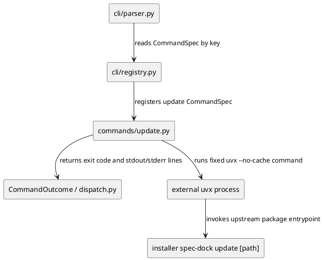
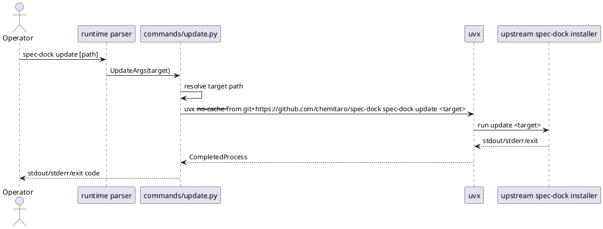

# iss-00096 Add self update command — 設計（HOW）

## Parent Diagram References
- Epic scope:
  - `spec-dock/active/epic/requirement.md` は GitHub close/delete 系の lifecycle command expansion に加え、repo-local self-update command を capability scope として含める。
  - `spec-dock/active/epic/design.md` は self-update flow / failure / test strategy を親 design の command expansion として扱う。
- 再利用する決定:
  - repo-local runtime command surface は `./spec-dock/scripts/spec-dock` に集約する。
  - provider-side source of truth は `src/spec_dock/assets/spec_dock/...` であり、dogfooding `spec-dock/...` は検証対象であって実装 source of truth ではない。
  - installer `spec-dock update [path]` の WHAT は変更せず、runtime command は upstream package invocation の wrapper に限定する。

## 目的・制約
- 目的:
  - managed repo 内で `./spec-dock/scripts/spec-dock update [path]` を実行できるようにし、upstream GitHub package から managed assets を更新する導線を runtime command surface に追加する。
- 必須:
  - runtime parser / registry に top-level `update` command を追加する。
  - command は `uvx --no-cache --from git+https://github.com/chemitaro/spec-dock spec-dock update <target>` を実行する。
  - target は省略時 `.`、明示時は指定 path を受け取る。
  - subprocess stdout / stderr と exit code を caller に伝播する。
  - README / shipped docs / tests に no-cache self-update contract を反映する。
  - provider-side assets を更新したあと、local dogfooding mirror `spec-dock/scripts/...` と shipped docs mirror へ反映・確認する。
- 禁止:
  - `init --force` 相当の destructive overwrite option を runtime update に追加しない。
  - arbitrary source / executable を通常 option として公開しない。
  - installer update の managed asset semantics を変更しない。
- 非交渉制約:
  - `uvx --no-cache` は必須。
  - upstream source は `git+https://github.com/chemitaro/spec-dock` に固定。
  - subprocess failure は fail-closed に扱う。

## 既存実装 / 規約の理解
- 参照した実装 / docs:
  - `src/spec_dock/cli.py`: installer `update` は optional `path` を受け、target に `spec-dock/` が存在することを確認して managed assets を refresh する。
  - `src/spec_dock/assets/spec_dock/scripts/spec_dock_runtime/cli/parser.py`: top-level runtime command を argparse subparser と registry key で結びつける。
  - `src/spec_dock/assets/spec_dock/scripts/spec_dock_runtime/cli/registry.py`: command module の `command_specs()` を集約する。
  - `src/spec_dock/assets/spec_dock/scripts/spec_dock_runtime/commands/*.py`: command-specific args dataclass、argument registration、typed args conversion、use case invocation / text result conversion の形を取る。
  - `src/spec_dock/assets/spec_dock/scripts/spec_dock_runtime/application/contracts.py`: `UseCases` は application callable と request/result dataclass の集約点。
  - `src/spec_dock/assets/spec_dock/scripts/spec_dock_runtime/cli/dispatch.py`: `CommandOutcome.text` の stdout / stderr / warnings をそのまま stream へ出す。
  - `tests/cli_runtime/harness.py`: installer `main(["init", target])` で temp repo に runtime scaffold を作り、生成された runtime script を subprocess 実行する。
  - `README.md`: upstream `uvx --from git+https://github.com/chemitaro/spec-dock spec-dock update` と uvx cache workaround を説明している。
- 現状理解:
  - runtime command layer は stdlib-only であり、日常操作は installed `spec-dock/scripts/spec-dock` から実行される。
  - runtime parser / registry に `update` がないため、`./spec-dock/scripts/spec-dock update --help` は現状失敗する。
  - installer update は既に target path validation と managed asset refresh を所有しているため、runtime 側で同じ処理を再実装する必要はない。
- 採用するパターン:
  - `commands/update.py` を追加し、runtime command-specific wrapper として subprocess invocation を閉じ込める。
  - subprocess execution は application use case と port へ過剰分割せず、command wrapper の外部 process boundary として扱う。これは installer update の再実装ではなく、固定 upstream command の thin wrapper だからである。
  - `CommandOutcome` で subprocess stdout / stderr lines と return code を返し、既存 dispatch に emission を任せる。
  - target path は requirement DQ-002 推奨に従い、runtime invocation cwd 基準で `Path(target).expanduser().resolve()` へ正規化して installer に渡す。
- 採用しないもの:
  - `UseCases` へ self-update を追加しない。runtime self-update は spec tree domain mutation ではなく外部 installer process invocation であり、既存 domain / active / github ports との依存を増やす価値が薄い。
  - package source、cache dir、force、dry-run などの runtime option は追加しない。scope expansion と security boundary の肥大を避ける。
- 影響範囲:
  - runtime command source、parser、registry、runtime CLI tests、README、shipped docs / templates の update guidance、local dogfooding mirror verification。

## 採用方針 / トレードオフ
- DQ-001 runtime-specific option surface:
  - 決定: optional `path` のみにする。
  - 理由: installer update interface と一致させ、`init --force` や arbitrary source の混入を避ける。
- DQ-002 target path normalization:
  - 決定: runtime 側で `Path(...).expanduser().resolve()` へ正規化して subprocess に渡す。
  - 理由: subprocess evidence と failure diagnosis が安定し、installer invocation cwd に依存する曖昧さを減らせる。
- Layering:
  - 決定: command wrapper に subprocess boundary を置く。
  - 理由: use case layer に入れるほど domain 状態や ports を持たず、固定 upstream executable の external process adapterとして小さく閉じられる。

## 依存関係分析
- module 依存:
  - `cli/parser.py` は `CommandRegistry` の `update` spec を参照して top-level parser を構築する。
  - `cli/registry.py` は `commands/update.py` の `command_specs()` を registry に追加する。
  - `commands/update.py` は stdlib `subprocess` / `Path` と `CommandOutcome` / `CliText` に依存する。
  - `cli/dispatch.py` は変更不要。`CommandOutcome` を既存 emission flow で処理できる。
- class / dataclass 依存:
  - `UpdateArgs(CommandArgs)` は target path 文字列を保持する。
  - `CommandOutcome` は subprocess result の return code と stdout / stderr lines を保持する。
- function 依存:
  - `_add_update_arguments()` が optional `path` を parser に追加する。
  - `_run_update()` が path 正規化、fixed uvx command assembly、subprocess 実行、failure propagation を担当する。
- file 依存:
  - `tests/cli_runtime/test_update.py` は generated runtime script を temp repo で実行し、stub `uvx` で args / stdout / stderr / exit code を検証する。
  - `README.md` と shipped docs / templates は user-facing command guidance を更新する。
  - `spec-dock/scripts/spec_dock_runtime/...` は local dogfooding mirror として provider assets から refresh され、runtime command surface を inspection / local command で確認する。
- 上流 / 前提:
  - installer `spec-dock update [path]` は既存契約として維持される。
  - runtime dispatch は stdout / stderr を preserve できる。
- 下流 / 依存先:
  - managed repo users は `./spec-dock/scripts/spec-dock update [path]` で upstream update を起動できる。
  - docs / help / tests は no-cache upstream source の固定 contract を参照する。
- 実装起点:
  - `commands/update.py` の isolated command wrapper と tests を先に固定し、その後 parser / registry integration、docs parity を行う。
- 順序への影響:
  - S01 は runtime command and tests、S02 は docs parity、S03 は dogfooding mirror refresh/inspection、S90/S99 は docs/spec/review final gates。

## Module Dependency Diagram
- タイトル:
  - Runtime self-update command dependency delta
- 答える問い:
  - runtime update command がどの module に依存し、installer update とどこで境界を保つか。
- 範囲:
  - runtime command layer、parser / registry、external `uvx` subprocess、installer CLI。
- 含めない詳細:
  - installer update 内部の managed asset copy algorithm、uvx の package resolution details。
- 更新条件:
  - self-update command の layer、subprocess invocation、installer interface が変わるとき。
- 図:



## Local Diagram Delta
- 変更する境界 / 責務 / 相互作用:
  - runtime command layer に external process boundary を 1 つ追加する。
  - spec tree domain model、active state、GitHub issue gateway、installer update internals は変更しない。

## インターフェース契約
- Runtime CLI:
  - `./spec-dock/scripts/spec-dock update [path]`
  - `[path]` は optional。省略時 `.`。
  - `--help` には upstream GitHub source、no-cache、target path default が分かる説明を置く。
- Subprocess:
  - executable / args:
    - `uvx`
    - `--no-cache`
    - `--from`
    - `git+https://github.com/chemitaro/spec-dock`
    - `spec-dock`
    - `update`
    - `<resolved-target>`
  - stdout / stderr:
    - subprocess stdout lines は runtime stdout へ出す。
    - subprocess stderr lines は runtime stderr へ出す。
  - exit code:
    - subprocess return code を runtime exit code として返す。
  - `uvx` missing:
    - `FileNotFoundError` は success にせず、operator が `uvx` 不在を理解できる stderr と non-zero exit code にする。
- Source boundary:
  - upstream package source は fixed constant。user option では変更できない。

## Sequence Delta
- 変更する相互作用:
  - runtime command から external `uvx` subprocess を起動する flow を追加する。
- retry / transaction / external API / queue:
  - retry は実装しない。network / permission / package resolution failure は subprocess failure として伝播する。
- UML:



## Domain Model Delta
- aggregate / entity / value object 変更:
  - N/A: spec node、active selection、deps、GitHub issue snapshot の domain model は変えない。
- domain event / policy / specification 変更:
  - N/A: runtime self-update is an external process command, not a new spec tree domain state.
- 不変条件の変更:
  - N/A: managed asset update semantics は installer 側の既存不変条件に委ねる。

## ディレクトリ / ファイル変更計画
```text
.
|-- README.md                                      # Modify: repo-local update command and no-cache guidance
|-- src/
|   `-- spec_dock/
|       `-- assets/
|           `-- spec_dock/
|               |-- docs/
|               |   `-- workflow_issue.md         # Inspect/Modify if shipped workflow needs update command guidance
|               |-- templates/
|               |   `-- README.md                 # Modify if generated docs guidance lists runtime commands
|               `-- scripts/
|                   |-- spec-dock                  # Read only: runtime entrypoint already delegates to app.py
|                   `-- spec_dock_runtime/
|                       |-- cli/
|                       |   |-- parser.py          # Modify: add top-level update parser binding
|                       |   `-- registry.py        # Modify: register update command specs
|                       `-- commands/
|                           |-- __init__.py        # Inspect; modify only if package export pattern requires it
|                           `-- update.py          # Add: fixed upstream no-cache subprocess wrapper
|-- spec-dock/
|   |-- active/issue/report.md                     # Modify: authoring, implementation, closure evidence
|   `-- scripts/
|       |-- spec-dock                              # Refresh/Inspect: dogfooding runtime entrypoint after local installer update
|       `-- spec_dock_runtime/
|           |-- cli/
|           |   |-- parser.py                      # Refresh/Inspect: dogfooding mirror of runtime parser
|           |   `-- registry.py                    # Refresh/Inspect: dogfooding mirror of runtime registry
|           `-- commands/
|               `-- update.py                      # Refresh/Inspect: dogfooding mirror of update command
`-- tests/
    `-- cli_runtime/
        `-- test_update.py                         # Add: help, args, explicit target, failure propagation, missing uvx / bad option
```

## 要件 → 設計マッピング
- AC-001:
  - `parser.py` top-level `update` command、`commands/update.py` help text、`tests/cli_runtime/test_update.py` help assertion で満たす。
- AC-002:
  - `_run_update()` が default target `.` を cwd 基準 absolute path に正規化し、stub `uvx` captured args で検証する。
- AC-003:
  - `_add_update_arguments()` が optional path を受け、explicit target を resolved path として subprocess に渡す。
- AC-004:
  - `_run_update()` が subprocess return code / stdout / stderr を preserve し、non-zero を runtime non-zero にする。`uvx` missing は non-zero error とする。
- AC-005:
  - README / shipped docs / runtime help が repo-local update command、no-cache、upstream source、target default を一致して説明し、local dogfooding mirror でも command surface を確認できる。
- EC-001:
  - `FileNotFoundError` handling と test で `uvx` missing を non-zero にする。
- EC-002:
  - installer update failure は subprocess non-zero と stderr propagation で伝播する。
- EC-003:
  - command args assertion で `--no-cache` を required として固定する。
- EC-004:
  - parser は `--force` を定義しないため argparse error になり、success にならない。
- EC-005:
  - failure test で stdout / stderr 両方の preservation と exit code propagation を確認する。

## テスト戦略
- 単体 / CLI runtime:
  - `tests/cli_runtime/test_update.py` を追加し、generated runtime script を temp repo で実行する。
  - temp PATH に `uvx` stub を置き、received args を file に書き出して検証する。
  - help test は `update --help` の stdout と exit code 0 を検証する。
  - failure tests は stub `uvx` の non-zero、stdout/stderr 両方、missing `uvx`、unsupported `--force` を検証する。
- 統合:
  - `python -m unittest tests.cli_runtime.test_update -v`
  - final gate では `python -m unittest discover -v` と `./spec-dock/scripts/spec-dock validate` を実行する。
- Dogfooding mirror:
  - Provider-side asset changes are refreshed into this repo's local consumer workspace with `python -m spec_dock.cli update .` after S01/S02.
  - Inspect `spec-dock/scripts/spec_dock_runtime/...` and run local dogfooding runtime help to confirm `update` is available without a live upstream update call.
- E2E / manual:
  - network を使う live upstream update は scope 外。manual live update は要求しない。
- migration / rollback:
  - rollback は added command file / parser / registry / docs / tests の revert で足りる。persistent schema change はない。

## 要件 / 例外 -> verification mapping
- AC-001:
  - `test_update_help_describes_upstream_no_cache_and_default_target`
- AC-002:
  - `test_update_runs_uvx_no_cache_with_default_target`
- AC-003:
  - `test_update_passes_explicit_target_to_installer_update`
- AC-004 / EC-005:
  - `test_update_propagates_subprocess_failure_output_and_exit_code`
- EC-001:
  - `test_update_missing_uvx_fails_with_actionable_error`
- EC-003:
  - captured args assertion includes `uvx --no-cache --from git+https://github.com/chemitaro/spec-dock spec-dock update`
- EC-004:
  - `test_update_rejects_force_option`
- AC-005:
  - docs diff inspection, README/template assertions where suitable, and S90 spec-reviewer docs alignment.
  - dogfooding mirror refresh/inspection evidence for `spec-dock/scripts/spec-dock update --help`.

## リスク / 移行 / ロールバック
- リスク:
  - Runtime update invokes network-dependent package resolution. Automated tests must use stubs and must not call live GitHub / uvx.
  - Using raw user path in subprocess evidence would make assertions cwd-sensitive; absolute normalization reduces ambiguity.
  - Capturing subprocess output then re-emitting could alter exact stream interleaving. Requirement only needs both streams and exit status to be observable, not byte-perfect interleaving.
- 移行:
  - New command is additive. Existing runtime commands and installer update remain compatible.
- ロールバック:
  - Remove `commands/update.py`, parser / registry entries, tests, and docs guidance. No data migration is needed.

## 未確定事項
- Requirement / design gate を block する未確定事項:
  - なし。
