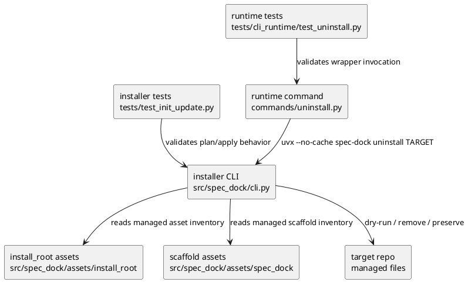
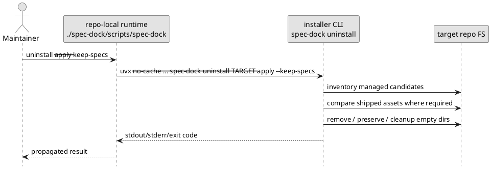

# iss-00147 SpecDock uninstall command — 設計（どう実現するか）

## 親図（Diagram）参照
- Epic 図:
  - `spec-dock/active/epic/design.md` の lifecycle command context。`uninstall command -> managed repo assets` と `uninstall command -> local spec tree` の境界を本 issue で具体化する。
- 再利用する決定:
  - self-update と同じく、repo-local runtime command は installer CLI implementation を呼び出す thin wrapper とする。
  - uninstall は remote GitHub state や package/environment uninstall を扱わない。
  - uninstall は project-wide garbage collection ではなく、SpecDock-managed development tooling removal と explicit specs mode に限定する。

## 目的・制約
- 目的:
  - target repo から SpecDock の開発用 agent / skill / tooling を安全に取り外す。
  - runtime wrapper が削除対象になっても、installer CLI から再実行 / 復旧できる構造にする。
  - operator が dry-run / result summary で削除・保持・失敗理由を追えるようにする。
- 必須 / 禁止:
  - `requirement.md` の削除対象分類を設計の正本入力とする。
  - agent / skill core removal と user-owned / product-reusable preservation のルールを path category と content policy に分ける。
  - repo root、`.git`、target parent、unknown unmanaged paths は削除しない。
- 非交渉制約:
  - destructive apply は explicit `--apply` と exactly one specs mode を要求する。
  - dry-run は filesystem mutation しない。
  - content comparison が判定不能な場合、agent / skill core removal target を除き preserve + manual review に倒す。

## 既存実装 / 規約の理解
- 参照した実装 / docs:
  - `src/spec_dock/cli.py`
  - `src/spec_dock/assets/install_root/.agents/host-adapters/meta.json`
  - `src/spec_dock/assets/install_root/`
  - `src/spec_dock/assets/spec_dock/scripts/spec_dock_runtime/commands/update.py`
  - `src/spec_dock/assets/spec_dock/scripts/spec_dock_runtime/cli/registry.py`
  - `src/spec_dock/assets/spec_dock/scripts/spec_dock_runtime/cli/parser.py`
  - `tests/test_init_update.py`
  - `tests/cli_runtime/test_update.py`
  - `discussions/20260531t141121z-research-uninstall-repo-analysis-evidence.md`
  - `discussions/20260531t141123z-disc-uninstall-requirement-risk-synthesis.md`
  - `discussions/20260531t141545z-disc-uninstall-design-draft.md`
- 現状理解:
  - installer CLI は `init` / `update` と target path validation、scaffold sync、install_root asset sync を所有する。
  - repo-local runtime `update` は installer update を `uvx --no-cache --from git+https://github.com/chemitaro/spec-dock spec-dock update <target>` で呼び出す。
  - `install_root` inventory と manifest から current managed files、bootstrap-only exact paths、obsolete exact paths を構築する既存 helper がある。
  - `spec-dock/initiatives/**` は仕様履歴であり、update の managed overwrite 対象ではない。
- 採用するパターン:
  - installer CLI に uninstall implementation を置く。
  - repo-local runtime command は update と同型の thin wrapper として installer uninstall を呼ぶ。
  - removal は inventory -> plan/result model -> render/apply の順に扱う。
- 採用しないもの:
  - runtime process 内で repo-local scaffold を直接削除する self-removal implementation。
  - existing `delete` command の再利用。`delete` は spec node lifecycle であり、uninstall は repo-local managed tooling removal。
  - unknown files を convenience で削除する broad cleanup。

## 採用方針 / トレードオフ
- 論点:
  - uninstall の実処理を installer CLI と runtime command のどちらへ置くか。
- 決定:
  - installer CLI に `spec-dock uninstall [path]` を追加し、実処理を所有させる。
  - repo-local runtime に `./spec-dock/scripts/spec-dock uninstall` を追加し、installer CLI を `uvx --no-cache` で呼ぶ。
- 理由:
  - repo-local runtime files は uninstall の削除対象になり得るため、外側の installer CLI が recovery point になる。
  - 既存 `update` と同じ wrapper pattern にそろえ、runtime 側で installer logic を再実装しない。
- Flag contract:
  - `spec-dock uninstall [path]`: dry-run plan を表示し、filesystem mutation しない。
  - `spec-dock uninstall [path] --apply --keep-specs`: specs を保持して実削除する。
  - `spec-dock uninstall [path] --apply --remove-specs`: specs を含めて実削除する。
  - `spec-dock uninstall [path] --json`: dry-run plan を JSON object として stdout に出す。
  - `spec-dock uninstall [path] --apply --keep-specs --json` / `--apply --remove-specs --json`: apply result を JSON object として stdout に出す。
  - `--keep-specs` と `--remove-specs` は mutually exclusive。
  - `--apply` なしの specs mode は plan の表示 mode として許容するが mutation はしない。
  - `--apply` ありで specs mode がない場合は usage error として mutation 前に fail-fast する。
  - `--json` は installer CLI と repo-local runtime wrapper の両方で受け付け、runtime wrapper は installer CLI へ forwarding する。

## 依存関係分析
- module 依存:
  - `src/spec_dock/cli.py`:
    - installer-side parser、inventory builder、content comparison、plan/result model、apply/render helper を追加する。
    - 初期実装は既存 installer architecture に合わせて `cli.py` 内の focused helpers とする。肥大化が顕著になった場合だけ follow-up で internal module 分割を検討する。
  - `src/spec_dock/assets/spec_dock/scripts/spec_dock_runtime/commands/uninstall.py`:
    - runtime thin wrapper を追加する。
  - `src/spec_dock/assets/spec_dock/scripts/spec_dock_runtime/cli/registry.py` / `parser.py`:
    - runtime command registration / parser binding を追加する。
- file 依存:
  - `src/spec_dock/assets/install_root/`:
    - repo root managed agent/tooling inventory の SoR。
  - `src/spec_dock/assets/spec_dock/`:
    - scaffold managed files の SoR。
  - target repo `spec-dock/initiatives/**`:
    - specs mode の対象。
  - target repo `spec-dock/.agent/**` / `spec-dock/active/**`:
    - generated state cleanup の対象。
- 実装起点:
  - installer CLI の inventory/result model と tests を先に固定する。
  - runtime wrapper は installer command contract が固定されてから追加する。

## モジュール依存図（Module Dependency Diagram）
- タイトル:
  - Uninstall command dependency direction
- 答える問い:
  - installer implementation、runtime wrapper、asset inventory、tests の依存方向を固定する。
- 範囲:
  - installer CLI と shipped runtime command の issue-local 変更。
- 含めない詳細:
  - individual file unlink loop、全 test case、全 asset path。
- 更新条件:
  - installer/runtime ownership、inventory SoR、runtime invocation が変わるとき。



## インターフェース契約
- Installer CLI:
  - Command:
    - `spec-dock uninstall [path] [--apply] [--keep-specs | --remove-specs] [--json]`
  - Exit codes:
    - `0`: dry-run completed, or apply completed without failed removals.
    - `1`: apply encountered one or more failed removals or unrecoverable inventory/comparison error.
    - `2`: CLI usage error, invalid target, missing specs mode for apply, or mutually exclusive specs flags.
  - Output:
    - stdout: plan/result summary and grouped path details.
    - stderr: usage/inventory/apply errors.
    - with `--json`: stdout is exactly one JSON object for plan/result/error payloads after argument parsing; human-readable guidance must not be mixed into JSON stdout.
- Runtime command:
  - Command:
    - `./spec-dock/scripts/spec-dock uninstall [path] [--apply] [--keep-specs | --remove-specs] [--json]`
  - Invocation:
    - `uvx --no-cache --from git+https://github.com/chemitaro/spec-dock spec-dock uninstall <resolved-target> <flags>`
  - Missing `uvx`:
    - exit `127` with actionable PATH/install guidance, matching update wrapper style.
  - Output:
    - propagate installer stdout/stderr/exit code.

## Uninstall Model
- `UninstallOptions`:
  - `target_root: Path`
  - `apply: bool`
  - `specs_mode: "keep" | "remove" | None`
  - `json: bool`
- `UninstallCategory`:
  - `agent_skill`
  - `native_agent`
  - `bootstrap_only`
  - `product_reusable`
  - `scaffold_managed`
  - `generated_state`
  - `spec_history`
  - `shortcut`
  - `obsolete_managed`
  - `unmanaged`
- `ContentPolicy`:
  - `delete_even_if_mismatch`
  - `delete_if_exact_match`
  - `delete_by_specs_mode`
  - `delete_if_shortcut_target_matches`
  - `preserve`
- `UninstallAction`:
  - `rel_path`
  - `category`
  - `policy`
  - `planned_operation`
  - `reason`
  - `source_asset_rel`
- `UninstallActionResult`:
  - `rel_path`
  - `category`
  - `status`
  - `reason`
  - `error`
- Status buckets:
  - `would_remove`
  - `removed`
  - `already_removed`
  - `preserved`
  - `failed`
  - `empty_dir_removed`
- JSON payload:
  - top-level fields:
    - `schema_version`
    - `target`
    - `mode`
    - `apply`
    - `specs_mode`
    - `status`
    - `summary`
    - `actions`
    - `guidance`
    - `errors`
  - `actions[]` fields:
    - `path`
    - `category`
    - `status`
    - `reason`
    - `error`
  - `status` values:
    - `planned`
    - `completed`
    - `partial_failure`
    - `error`

## シーケンス差分（Sequence Delta）
- 変更する相互作用:
  - runtime command が installer CLI を呼ぶ。
  - installer CLI が target repo を inventory 化し、dry-run/apply の結果を返す。
- retry / transaction / external API / queue:
  - external API は使わない。
  - rollback は行わず、dry-run default と idempotent re-run で safety を確保する。
  - partial failure は summary と non-zero exit で report し、installer CLI から再実行する。



## Directory / File 変更計画
```text
src/spec_dock/
|-- cli.py
|   `-- 変更: installer uninstall parser, inventory/action/result helpers, content comparison, apply, rendering
|-- assets/
|   |-- install_root/
|   |   `-- 読取: managed agent/tooling inventory and manifest contracts
|   `-- spec_dock/
|       |-- docs/
|       |   |-- reference_github.md
|       |   |   `-- 変更: repo-local uninstall と installer CLI uninstall の GitHub 非変更 / package 非削除 contract を追記
|       |   `-- reference_sync.md
|       |       `-- 点検: uninstall 後に削除 / preserve する generated state の説明が必要か確認し、不要なら S90 no-op 根拠を report に記録
|       |-- scripts/spec_dock_runtime/
|       |   |-- commands/uninstall.py
|       |   |   `-- 追加: thin uvx wrapper for installer uninstall
|       |   |-- commands/update.py
|       |   |   `-- 読取: wrapper precedent
|       |   |-- cli/registry.py
|       |   |   `-- 変更: register uninstall command
|       |   `-- cli/parser.py
|       |       `-- 変更: bind uninstall parser
tests/
|-- test_init_update.py
|   `-- 変更/追加: installer uninstall behavior tests
`-- cli_runtime/
    `-- test_uninstall.py
        `-- 追加: runtime uninstall wrapper tests
```

## 要件 → 設計マッピング
- AC-001 -> installer dry-run plan/result model and renderer.
- AC-002 -> installer parser/apply preflight requiring exactly one specs mode when `--apply`.
- AC-003 -> `--keep-specs` action planning, agent/skill removal, specs preservation, bounded cleanup.
- AC-004 -> `--remove-specs` action planning and explicit spec-history deletion summary.
- AC-005 -> bootstrap-only content comparison exact-match removal.
- AC-006 -> bootstrap-only/product-reusable mismatch preservation and manual review result.
- AC-007 -> known managed agent/skill category removal even on mismatch; unmanaged preserve.
- AC-008 -> runtime wrapper invoking installer CLI and propagating output/exit code.
- AC-009 -> idempotent inventory/apply behavior with `already_removed` statuses.
- AC-010 -> installer/runtime `--json` output contract, JSON renderer, and runtime flag forwarding.
- EC-001 -> `_require_specdock` / target validation style fail-fast.
- EC-002 -> dry-run does not call unlink/rmtree cleanup.
- EC-003 -> cleanup stops when directory contains preserved file.
- EC-004 -> cleanup traversal stops at boundary roots and never touches repo root / `.git` / parent.
- EC-005 -> installer CLI direct retry path and runtime wrapper recovery guidance.
- EC-006 -> comparison error preserve policy except known core agent/skill paths.
- EC-007 -> repo-root `spec` symlink target verification.
- EC-008 -> JSON stdout separation and parseable error/result payloads.

## テスト戦略
- Installer integration:
  - dry-run has no filesystem mutation and prints removal/preserve/cleanup plan.
  - `--apply` without specs mode fails before mutation.
  - `--apply --keep-specs` removes known agent / skill assets and preserves `spec-dock/initiatives/**`.
  - `--apply --remove-specs` removes spec history and reports it explicitly.
  - bootstrap-only `.codex/config.toml` exact match is removed; mismatch is preserved.
  - product-reusable `.github/workflows/**`, `.codex/prompts/**`, `.codex/rules/**`, `.codex/AGENTS.md` exact match is removed; mismatch is preserved.
  - scaffold-managed `spec-dock/docs/**`, `spec-dock/templates/**`, `spec-dock/system/**`, `spec-dock/scripts/**`, `spec-dock/spec-dock.version` exact match is removed; mismatch is preserved with manual-review reason.
  - known managed agent / skill mismatch is removed.
  - unknown files under managed boundary roots are preserved.
  - repo-root `spec` matching symlink is removed; nonmatching symlink / regular file / directory is preserved.
  - empty directory cleanup stays within boundary roots and does not delete directories containing preserved files.
  - rerun after prior removal reports already removed and exits successfully when no failed removals remain.
  - injected unlink / permission failure returns non-zero and reports failed separately from preserved.
  - `--json` dry-run returns parseable JSON with summary/actions/guidance and no human-readable text mixed into stdout.
  - `--json` apply returns parseable JSON for completed and partial-failure results.
- Runtime wrapper:
  - default target resolves current working directory and calls `uvx --no-cache`.
  - explicit target is resolved and passed through.
  - supported flags are forwarded.
  - `--json` is forwarded and JSON stdout from installer is propagated unchanged.
  - subprocess stdout/stderr/exit code are propagated.
  - missing `uvx` exits `127` with actionable guidance.
- Docs impact:
  - `reference_github.md` に uninstall が GitHub issue / remote state を変更しないこと、package/environment uninstall ではないこと、repo-local managed artifact removal であることを反映する。
  - `reference_sync.md` は generated state (`spec-dock/.agent/**`, `spec-dock/active/**`) の説明と uninstall cleanup の関係を点検する。既存説明で足りる場合は S90 docs impact resolution で no-op 判定を記録する。
  - runtime help / installer help は tests で command contract と一致させる。
- Manual / dogfooding:
  - implementation phase should inspect whether local dogfooding workspace needs `sync --no-github` or only `validate`.

## リスク / 移行 / ロールバック
- Version drift:
  - Current package assets may differ from older installed files, preserving more files as mismatch.
  - Mitigation: agent / skill core paths are path-owned; other mismatch files are surfaced for manual review.
- Over-delete:
  - Path classification bugs can remove user files.
  - Mitigation: candidates must come from shipped inventory, manifest obsolete exact paths, explicit generated-state roots, specs mode, or exact shortcut checks.
- Under-delete:
  - Conservative preservation may leave product-reused prompts/configs behind.
  - Mitigation: summary lists preserved manual-review items.
- Self-removal:
  - Runtime script may be removed during uninstall.
  - Mitigation: runtime wrapper delegates to external installer process; installer CLI direct retry is documented in output.
- Rollback:
  - No automatic rollback after deletion.
  - Safety relies on dry-run default, explicit apply/specs mode, exact-match preservation, result summary, and idempotent rerun.

## 未確定事項
- none.

## 解決済み質問
- Q-001:
  - 質問:
    - `--json` output を初回実装に含めるか。
  - 回答:
    - 含める。
  - 根拠:
    - `spec-dock uninstall` は agent が実行する可能性があるため、machine-readable output が必要。
  - 証跡:
    - `discussions/20260531t144040z-interview-uninstall-json-output.md`
