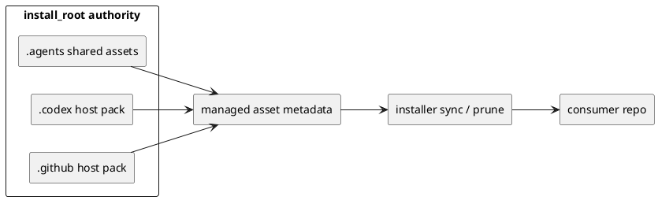
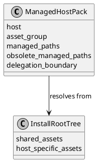
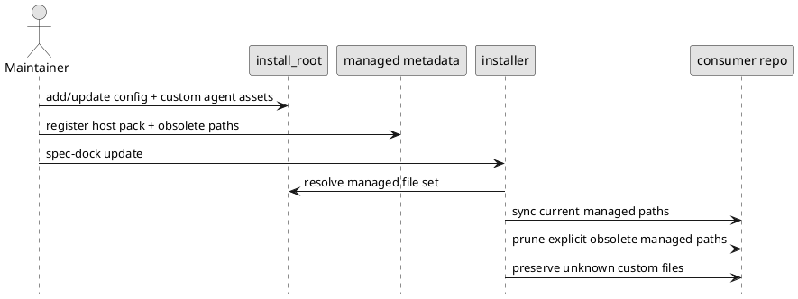

# epic-00074 Multi host agent and config asset expansion — 設計（HOW）

## 全体像
- target boundary:
  - existing `install_root` mechanism の上で、Codex main-agent bootstrap config、host-native orchestrator/specialist assets、shared skills を managed host pack として扱う
  - Codex pack と GitHub Copilot pack を first implementation として追加する
  - future host / future pack を追加可能な metadata と sync-prune contract を定義する
- impacted area:
  - provider-side `install_root` asset tree
  - installer の managed asset discovery / sync-prune
  - host adapter metadata と docs/test parity
  - dogfooding workspace の install/update validation
  - 実装は既存 mechanism 上の asset 追加と metadata/tests/docs 更新に閉じ、別 phase の新機構導入は前提にしない
- existing relation:
  - `epic-00067` が authority / install-shaped layout / cleanup safety を固定済みであるため、本 epic は layout cleanup を再設計しない
  - `epic-00048` が protocol / thin adapter / native shim の baseline を固定済みであるため、本 epic は「native config と subagent/custom agent をどう managed deployment するか」に限定する
  - host pack の中身は host-native discovery 用 asset だが、runtime protocol の実体は既存 shared guidance と runtime に残す
  - Codex は `orchestrator` を primary custom agent として露出できないため、main agent config が orchestrator responsibility を担い、`.codex/agents/spec-manager.toml` を sibling specialist として扱う
  - GitHub Copilot は `orchestrator` を primary custom agent として露出できるため、`.github/agents/orchestrator.agent.md` を primary entrypoint、`.github/agents/spec-manager.agent.md` を sibling specialist として扱う

### UML（推奨: module / context）

## 契約
### API（必要時）
- API-001:
  - Request:
    - install/update が参照する managed host pack definition
    - current managed file set と explicit obsolete managed file set
  - Response:
    - host pack ごとの generated / updated / preserved / pruned result
    - docs / tests で再現可能な rollout evidence
  - Errors:
    - metadata と実 file tree の不整合
    - managed ownership conflict
    - unsupported host-pack declaration

### Data boundary
- SoR:
  - provider-side asset の正本は `src/spec_dock/assets/install_root/` 実 file tree
  - managed/unmanaged 境界、obsolete managed path、host pack grouping は single managed metadata contract に集約する
  - runtime protocol semantics の正本は既存 runtime / docs に残し、host config / subagent file へ再実装しない
- consistency model:
  - Codex では bootstrap-only `config.toml` と `.codex/agents/*.toml` が同じ host pack に属するが、bootstrap-only と managed の ownership 差を metadata で明示する
  - GitHub Copilot では `.github/agents/*.agent.md` のみを host pack 配置対象にし、`config` / `mcp-config` は install target に含めない
  - sync は current managed file set を生成・更新し、prune は explicit obsolete managed file set に限定する
  - unknown custom file は preserve が既定であり、managed ownership が定義されていない file を cleanup しない
  - future host extension は sibling host root または pack entry 追加で扱い、existing Codex/Copilot pack の意味論を変更しない

## データモデル
- model / table changes:
  - managed asset metadata は、Codex main-agent bootstrap config、host ごとの orchestrator/specialist assets、shared skill assets を pack 単位で参照できる必要がある
  - pack definition には少なくとも `host`, `asset_group`, `managed_paths`, `bootstrap_only_paths`, `obsolete_managed_paths`, `delegation_boundary`, `host_behavior_note` に相当する情報が必要である
- invariants:
  - `install_root` が唯一の source-of-truth である
  - shared `.agents` は shared assets のみを持ち、host-specific config / custom agent は host root に置く
  - thin delegation boundary は `epic-00048` baseline から後退しない
  - cleanup は managed ownership に限定される
  - Codex の orchestrator responsibility は main agent config が担い、GitHub Copilot の orchestrator responsibility は primary custom agent が担う
  - SpecDock specialist の canonical filename は Codex では `.codex/agents/spec-manager.toml`、GitHub Copilot では `.github/agents/spec-manager.agent.md` とする
  - future host support は extensibility requirement であり、current epic の implementation count には含めない

### UML（任意: data model）

## 主要フロー
- Flow-A: managed host pack authoring
  1. maintainer が `install_root` 配下へ Codex main-agent bootstrap config、host-specific orchestrator/specialist assets、shared skills を追加する
  2. managed metadata に host pack definition、bootstrap-only path、obsolete managed path を追記する
  3. docs / tests に host pack ownership と host behavior note を反映する
- Flow-B: clean install
  1. `spec-dock init` または `spec-dock update` が current managed host packs を解決する
  2. installer が current managed file set を target repo へ同期する
  3. Codex/Copilot host packs が consumer repo に配置される
  4. validation が shared baseline と host-specific assets の両方を確認する
- Flow-C: update from older managed state
  1. installer が target repo 内の managed path と explicit obsolete managed path を評価する
  2. current managed paths は生成・更新する
  3. explicit obsolete managed path だけを prune する
  4. unknown custom files は preserve する
- Flow-D: future host extension readiness
  1. maintainer が new host or new pack を企画する
  2. existing host pack pattern を踏襲して sibling root / pack entry を追加する
  3. source-of-truth ownership や runtime protocol semantics を変更せずに extension できることを review する

### UML（任意: sequence / flow）

## 失敗設計
- failure mode:
  - host pack metadata が実 file tree と一致しない
  - managed path と unknown custom path の ownership が曖昧
  - old managed filename から `.codex/agents/spec-manager.toml` / `.github/agents/spec-manager.agent.md` への切り替えで prune 対象が過不足になる
  - host-specific config に runtime behavior を埋め込みすぎて thin delegation boundary を壊す
- retry:
  - metadata / asset tree の不整合は fail-fast で検出し、maintainer が source 側を修正して再実行する
  - sync/prune failure は temp repo で再現可能な形にして、修正後に同じ validation sequence を再実行できるようにする
- idempotency:
  - current managed host pack の再同期は同じ target repo に対して繰り返し実行しても同じ結果になること
  - unknown custom file preserve は update のたびに維持されること
- partial failure:
  - config assets だけ同期され、custom agent assets が漏れるような半端な host pack state を acceptance しない
  - cross-host parity は同一 implementation issue の close-out で確認し、片側だけ docs/tests が揃った状態で epic を閉じない

## 移行戦略
- migration strategy:
  - `epic-00067` 完了済みの install_root authority を前提に、managed host pack definition を additive に導入する
  - 実装は 1 issue で進め、必要なら作業順として metadata / Codex / GitHub Copilot / validation の順に処理する
  - 既存 consumer repo に対しては `spec-dock update` で current managed host pack を追加配布し、旧 `spec-dock` specialist filename を含む obsolete managed path だけを prune する
- dual write/read if needed:
  - source-of-truth の dual ownership は持たない
  - backward compatibility は維持せず、必要なのは obsolete managed path を一時的に認識する cleanup だけであり、runtime protocol の dual read は持ち込まない
- rollback:
  - host pack ごとの managed asset 追加は issue 単位で戻せるようにする
  - layout ownership を変えないため、rollback でも `install_root` authority は維持する

## 観測性 / セキュリティ
- observability:
  - init/update integration tests の filesystem assertions
  - managed/unmanaged boundary tests
  - provider docs と dogfooding workspace の parity check
  - temp repo を使った sync/prune evidence
- role / auth:
  - host config / custom agent discovery は host runtime の contract に依存するが、installer 自体は local file deployment に徹する
- audit / pii:
  - config asset の managed ownership は docs に明示し、user-authored override を暗黙に上書きしない
  - Copilot `config` / `mcp-config` を install target に含めず、user-specific / secret-bearing config を provider asset へ持ち込まない

## テスト戦略
- Unit:
  - managed host pack classification
  - current / obsolete managed path 判定
  - unknown custom file preserve 判定
- Integration:
  - clean repo への Codex pack 同期
  - clean repo への GitHub Copilot pack 同期
  - older managed state からの sync/prune rollout
- E2E:
  - provider/dogfooding parity
  - cross-host final validation
- E-AC mapping:
  - E-AC-001 -> Codex host pack integration tests + docs parity
  - E-AC-002 -> GitHub Copilot host pack integration tests + prune evidence
  - E-AC-003 -> metadata/design review + extension-path assertions
  - E-AC-004 -> final rollout checklist + dogfooding validation + spec review

## 関連 ADR
- なし:
  - `epic-00067` の architecture decision を前提にし、本 epic 自体は additive feature design として閉じる

## 未確定事項
- なし:
  - 単一 issue 前提と dependency positioning は本設計で固定する
