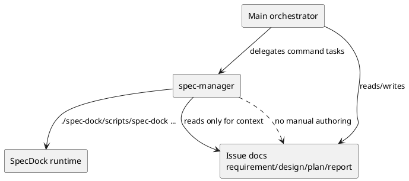

# iss-00075 Multi host agent and config asset install — 設計（HOW）

## 目的・制約
- 目的:
  - `spec-manager` を command operator として実用化する。
  - main 側は docs/context owner、`spec-manager` 側は command operator という責務分界を host 両方で固定する。
- MUST:
  - thin host adapter への delegation path は維持する。
  - main 側 guidance で `spec-manager` default delegation を明記する。
  - Copilot 側は tool frontmatter で operator boundary を固定する。
  - Codex 側は model / reasoning / notify / shell / instructions を明示する。
- MUST NOT:
  - runtime protocol や generated state logic を `spec-manager` 側へ埋め込まない。
  - `spec-manager` に docs authoring や manual file edit を許可しない。
  - role-local MCP 設定を増やさない。

## 既存理解
- 現状の `spec-manager` は host adapter skill への静的委譲だけを持つ薄い shim である。
- `.codex/AGENTS.md` には `spec-manager` default specialist の記述があるが、command operator と docs owner の責務分界までは固定できていない。
- GitHub Copilot `orchestrator.agent.md` は delegation policy を持つが、SpecDock command operation を `spec-manager` へ送る強制力が弱い。
- runtime command surface は `./spec-dock/scripts/spec-dock {new,active,delete,close,sync,deps,import,validate,doctor}` であり、関連 docs は `workflow_issue.md`、`reference_github.md`、`reference_sync.md`、`reference_deps.md` に揃っている。

## 採用方針
- `spec-manager` は command-first operator として enrich する。
  - command surface を明記する
  - read order を明記する
  - docs authoring 禁止を明記する
  - thin adapter skill への delegation を維持する
- main orchestrator は docs/context owner として enrich する。
  - SpecDock command operation は原則 `spec-manager` へ送る
  - requirement/design/plan/report 編集は main 側責務に残す
- host-specific enforcement は次で分ける。
  - Copilot: frontmatter `tools` と `user-invocable` で境界を固定
  - Codex: config surface と `developer_instructions` で境界を固定

## 依存関係分析
- upstream / prerequisite:
  - kebab-case 統一済みの current host pack assets
  - `workflow_issue.md`, `reference_github.md`, `reference_sync.md`, `reference_deps.md`
- downstream / dependent:
  - main orchestrator の SpecDock command delegation
  - installer byte parity tests
  - dogfooding validate
- sequencing:
  1. issue docs で role split を固定する
  2. `spec-manager` host assets を更新する
  3. main guidance assets を更新する
  4. tests を content contract に合わせて更新する
  5. validate と report で閉じる

### UML（role split）

## インターフェース契約
- Codex `spec-manager.toml`
  - `name = "spec-manager"`
  - `description` を command operator 向けに更新する
  - `model = "gpt-5.4-mini"`
  - `model_reasoning_effort = "high"`
  - `approval_policy = "never"`
  - `sandbox_mode = "workspace-write"`
  - `notify = []`
  - `[features] shell_tool = true`
  - `developer_instructions` に次を含める
    - command-only role
    - docs authoring prohibition
    - read order
    - command matrix
    - completion / blocked boundary
    - thin adapter delegation path
- GitHub Copilot `spec-manager.agent.md`
  - `name: spec-manager`
  - `description` を command operator 向けに更新する
  - `model: gpt-5.4-mini`
  - `tools: ['read', 'search', 'execute', 'todo']`
  - `user-invocable: false`
  - body に次を含める
    - command-only role
    - no manual edit
    - no docs authoring
    - read order
    - command matrix
    - thin adapter delegation path
- main guidance assets
  - `.codex/AGENTS.md`
  - `.codex/config.toml`
  - `.github/agents/orchestrator.agent.md`
  - ここに `spec-manager` への command delegation を明記し、docs/context owner split は guidance 全体として表現する

## command knowledge contract
- `spec-manager` に埋め込む command family:
  - `./spec-dock/scripts/spec-dock active {set,show,clear}`
  - `./spec-dock/scripts/spec-dock new {initiative,epic,issue,doc}`
  - `./spec-dock/scripts/spec-dock import {initiative,epic,issue}`
  - `./spec-dock/scripts/spec-dock deps {check,add,remove}`
  - `./spec-dock/scripts/spec-dock sync [--github]`
  - `./spec-dock/scripts/spec-dock validate`
  - `./spec-dock/scripts/spec-dock close`
  - `./spec-dock/scripts/spec-dock delete`
  - `./spec-dock/scripts/spec-dock doctor`
- read order:
  - repo `AGENTS.md`
  - `spec-dock/active/issue/{requirement,design,plan,report}.md`
  - `spec-dock/docs/workflow_issue.md`
  - `spec-dock/docs/reference_github.md`
  - `spec-dock/docs/reference_sync.md`
  - `spec-dock/docs/reference_deps.md`
  - `spec-dock/docs/reference_naming.md`
  - host adapter skill

## テスト戦略
- content contract regression:
  - Codex `spec-manager.toml` が model / reasoning / notify / shell / command-only wording を持つ
  - Copilot `spec-manager.agent.md` が `user-invocable: false` と restricted tools を持つ
  - 両 host とも adapter delegation path を保持する
- routing contract regression:
  - `.codex/AGENTS.md` / `.codex/config.toml` / Copilot orchestrator が `spec-manager` default delegation を示し、guidance 全体として docs-owner split を保つ
- installer parity:
  - generated assets が provider bytes と一致する

## リスク / トレードオフ
- Codex 側は Copilot のような per-agent tool allowlist を同じ形で持てない可能性があるため、manual edit 禁止は instructions 依存が残る。
- Copilot 側で `edit` を外すと docs authoring を accidental に始めにくくなる一方、将来 `spec-manager` の責務を広げる場合は再設計が必要になる。
- 既存テストは「thin static delegation shim」を強く見ているため、「thin adapter は維持しつつ knowledge を増やす」方向へ assertion を組み替える必要がある。

## 未確定事項
- なし:
  - `spec-manager` は command operator、main は docs owner という split で固定する。

## 2026-04-15 review follow-up slice
- actionable review findings は次の 2 件に限定する。
  - `pr-monitor` guidance がインストール先 repo に存在しない固定絶対パス `/srv/mount/.codex/skills/...` を参照している。
  - `bootstrap_only_exact_file_paths` に追加した `.codex/config.toml` が preflight exact symlink rejection に先に遮られ、preserve semantics に到達できない。
- `pr-monitor` guidance repair:
  - helper path は repo-root relative の `./.agents/skills/github-codex-pr-review-comments/scripts/fetch_codex_pr_review_comments.sh` に統一する。
  - provider asset と dogfooding mirror の `pr-monitor` だけを更新し、historical discussion artifacts は scope 外とする。
- bootstrap-only symlink repair:
  - preflight は bootstrap-only current managed path の exact symlink を narrow exemption として扱う。
  - 許可対象は「bootstrap-only path かつ exact symlink が file として存在する場合」のみとする。
  - symlink parent / broken symlink / non-file symlink は従来どおり reject し、fail-before-writes を維持する。
