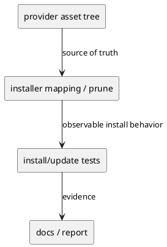

# iss-00075 Multi host agent and config asset install — 設計（HOW）

## 目的・制約
- 目的:
  - 既存 installer foundation の上に、Codex / GitHub Copilot / shared skills の managed placement を additive に追加する。
  - 1 issue で asset placement、metadata、tests、docs、validate を閉じる。
- MUST / MUST NOT:
  - MUST:
    - Codex は main config が orchestrator responsibility を担い、`spec-manager` だけを sibling specialist として ship する。
    - GitHub Copilot は `orchestrator` primary agent と `spec-manager` sibling specialist を ship する。
    - shared skills は `.agents/skills/` に集約する。
  - MUST NOT:
    - direct `.codex/agents/orchestrator.toml` を ship しない。
    - Copilot config / MCP config を ship しない。
    - prompt assets を current scope に入れない。
- 非交渉制約:
  - backward compatibility は不要。
  - `spec-dock` specialist 名は `spec-manager` に統一する。
  - unknown custom files は prune safety で保持する。
- 前提:
  - 既存 installer は `install_root` を canonical authority として扱える。
  - issue-70 以降の package / install discovery contract は壊さない。

## 既存実装 / 規約の理解
- 参照した実装 / docs:
  - `src/spec_dock/assets/install_root/`
  - `src/spec_dock/assets/spec_dock/scripts/spec_dock_runtime/`
  - `spec-dock/initiatives/init-local-00002-prototype-feature-expansion/epics/epic-00074-multi-host-agent-and-config-asset-expansion/{requirement.md,design.md,plan.md}`
  - `spec-dock/docs/workflow_issue.md`
- 現状理解:
  - managed asset contract は host-specific path mapping を追加するだけで成立する。
  - Codex の orchestrator は file asset ではなく main config の instruction responsibility として表現する。
  - Copilot の orchestrator は direct agent asset として表現する。
- 採用するパターン:
  - provider-side asset source を正本にして、installer は host pack をコピー / prune する。
  - `spec-manager` と shared skills は host 間で同じ source を再利用する。
- 採用しないもの:
  - 新しい discovery runtime
  - host ごとに別 installer を増やす設計
  - prompt asset の今回実装
- 影響範囲:
  - provider asset tree
  - installer metadata / mapping
  - install/update prune tests
  - issue report / docs

## 採用方針 / トレードオフ
- 論点:
  - 1 issue でまとめるか、host ごとに分けるか
  - bootstrap-only config を managed で扱うか、初回のみ配布するか
- 選択肢:
  - Option A:
    - host ごとに issue を分ける
  - Option B:
    - 1 issue で host pack 全体を閉じる
  - Option C:
    - bootstrap config も毎回強制上書きする
  - Option D:
    - bootstrap config は初回配置中心で、user edits は尊重する
- 決定:
  - Option B + D を採用する。
  - 理由:
    - 変更は file placement と managed metadata の範囲に収まる。
    - Codex の `config.toml` は user edits を壊さない方が運用上安全である。

## 依存関係分析
- upstream / prerequisite:
  - `epic-00074` approved spec
  - `epic-00067` authority cleanup
  - `epic-00048` host adapter baseline
- downstream / dependent:
  - `spec-dock init`
  - `spec-dock update`
  - install / prune validation
- 実装起点:
  - 先に provider-side asset placement を固定する。
  - 次に installer mapping と prune behavior を固定する。
  - 最後に tests と docs / report をまとめて閉じる。
- sequencing implications:
  - Codex と Copilot の差分を同じ contract で扱えるようにしてから、validate を通す。

### UML（必須: module / dependency）

## インターフェース契約
- API / function / protocol / data boundary:
  - installer は `install_root` を正本として host pack を収集し、host-specific project path に展開する。
  - Codex pack は `.codex/config.toml` + `.codex/agents/spec-manager.toml` + `.agents/skills/**` を中心に構成する。
  - GitHub Copilot pack は `.github/agents/orchestrator.agent.md` + `.github/agents/spec-manager.agent.md` + `.agents/skills/**` を中心に構成する。
  - prune contract は managed obsolete files のみを削除し、unknown custom files は保持する。

## 変更計画
- Add:
  - Codex/Copilot 向け asset placement
  - prune / mapping metadata
  - install/update regression tests
- Modify:
  - installer asset discovery / sync logic
  - docs describing host split
- Delete:
  - old `spec-dock` specialist filename references
  - prompt asset references from current scope
- Move/Rename:
  - `spec-dock` specialist -> `spec-manager`
- Read only:
  - upstream epic contract

## 要件 → 設計マッピング
- AC-001 -> Codex pack placement / prune safety
- AC-002 -> Copilot pack placement / prune safety
- AC-003 -> unknown custom file preservation
- AC-004 -> validate and report evidence
- EC-001 -> Codex no direct orchestrator file
- EC-002 -> bootstrap config user edit preservation
- EC-003 -> prompt assets out of scope

## テスト戦略
- Unit:
  - path mapping / prune classification / asset inventory comparison
- Integration:
  - `spec-dock init` / `spec-dock update` in a temp repo
- E2E / manual:
  - `./spec-dock/scripts/spec-dock validate`
- migration / rollback / feature flag if needed:
  - rollback is not expected because additive file placement only

## 要件 / 例外 -> verification mapping
- AC-001 -> Codex install/update inventory assertions
- AC-002 -> Copilot install/update inventory assertions
- AC-003 -> prune regression with unknown custom file fixture
- AC-004 -> validate pass + report evidence
- EC-001 -> absence of direct orchestrator file
- EC-002 -> update does not clobber bootstrap config edits
- EC-003 -> prompt asset absence

## リスク / 移行 / ロールバック（必要時）
- prune misclassification could delete user-authored files, so tests must cover unknown custom files explicitly.
- Codex bootstrap config may need careful handling to avoid clobbering user edits.
- no rollback strategy is required beyond reverting the additive file placement commit.

## 未確定事項
- なし:
  - scope and host split are fixed by the approved epic spec.
