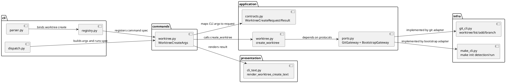
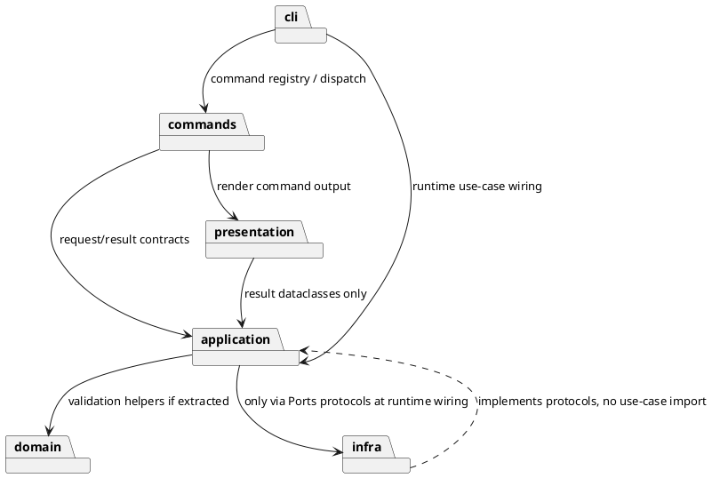
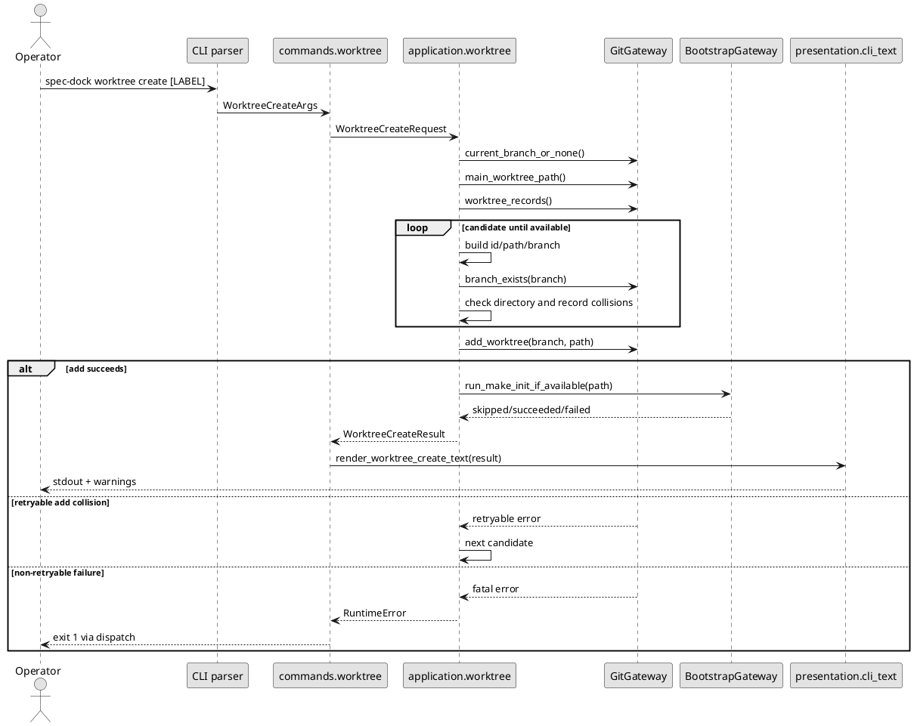
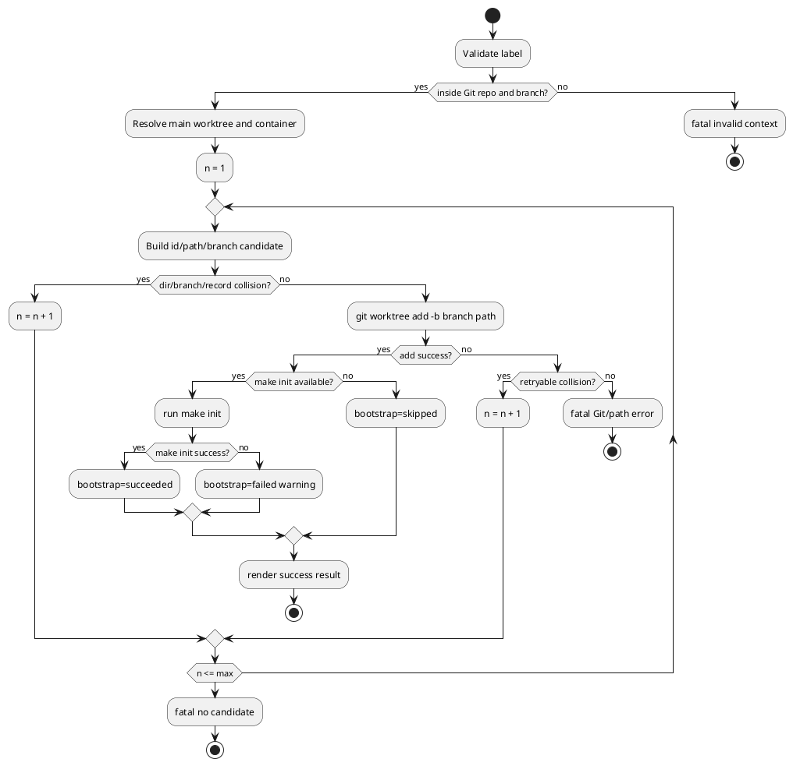

# epic-00107 Worktree Provisioning — 設計（HOW）

## 全体像
- 対象境界:
  - `spec-dock worktree create [LABEL]` を runtime command として追加する。
  - command は Git linked worktree と initial branch を作るが、spec node / active pointer / GitHub issue は変更しない。
  - 作成先は main worktree の sibling container `<repo-basename>-worktrees/` 配下へ正規化する。
  - 作成後 bootstrap は optional / non-fatal な `make init` として扱う。
- 影響領域:
  - CLI parser / registry
  - command args / command outcome
  - application use case
  - Git / make subprocess adapter
  - CLI text rendering
  - runtime tests and shipped docs
- 既存関係:
  - `issue start` は active pointer / checkout lifecycle を扱う。
  - `worktree create` は checkout 作成だけを扱い、active pointer は触らない。
  - `new` / `delete` / `close` の post-sync pattern は spec tree mutation 用であり、worktree 作成には使わない。
- 参照する親 diagram:
  - `init-local-00002/design.md` の feature initiative / runtime baseline / additive expansion 図。

## Component / Module View
- タイトル:
  - Worktree Create Runtime Components
- 答える問い:
  - `worktree create` を既存 layered runtime のどこへ追加し、どの責務をどの layer が持つか。
- 範囲:
  - CLI command parsing から Git worktree creation、optional bootstrap、CLI output まで。
- 含めない詳細:
  - `git worktree remove` / `prune` / `repair`
  - Codex app managed worktree internals
  - project-specific env / secret bootstrap details
- 更新条件:
  - command family、Git gateway contract、bootstrap contract、output contract が変わるとき。

### UML（component / module）

設計判断:
- `commands/worktree.py` は argparse と `CommandOutcome` のみを扱い、Git subprocess を直接呼ばない。
- `application/worktree.py` は id generation、collision retry、main worktree normalization、bootstrap outcome aggregation を所有する。
- `infra/git_cli.py` は Git CLI の薄い adapter を持つ。Git output parsing のうち `git worktree list --porcelain` の構造変換は infra に置くが、どの candidate を採用するかは application に置く。
- `infra/make_cli.py` は `make init` の存在確認と実行を担う。bootstrap failure は例外ではなく result として返す。
- presentation は absolute path を主表示する。

## Package Dependency
- タイトル:
  - Worktree Create Dependency Direction
- 答える問い:
  - 新しい worktree capability が既存 runtime の dependency direction を崩さないか。
- 範囲:
  - `spec_dock_runtime` 内の package dependency。
- 含めない詳細:
  - file-level exhaustive dependency
  - test helper dependency
- 更新条件:
  - layer を跨ぐ import 方向が変わるとき。

### UML（package dependency）

設計判断:
- `application.contracts.UseCases` に `worktree_create` callable を追加する。
- `application.ports.GitGateway` は worktree-specific methods を追加してよい。ただし `make init` は Git の責務ではないため、別 protocol `BootstrapGateway` を追加する。
- domain への抽出は optional とする。label validation / candidate naming が複数 issue で再利用される場合だけ `domain/worktree.py` のような pure helper に逃がす。

## Domain Model（DDD 必要時）
- N/A:
  - この epic は domain aggregate を追加しない。
  - Worktree は永続化対象の SpecDock domain entity ではなく、Git CLI によって作成される external working tree である。
  - ただし実装上は pure value として `WorktreeCandidate` / `WorktreeCreateResult` 相当を application contract に置き、testable にする。

## 契約
### CLI
- CLI-001:
  - command:
    - `spec-dock worktree create [LABEL]`
  - LABEL:
    - optional
    - `^[a-z0-9-]+$` のみ許可
  - success:
    - exit code `0`
    - stdout に id、worktree absolute path、branch、bootstrap result を出す
  - fatal error:
    - exit code `1`
    - stderr に invalid label / detached HEAD / Git repo 外 / non-retryable Git failure / path failure を出す
  - bootstrap failure:
    - exit code `0`
    - worktree 作成 success として扱う
    - warning に `make init` failure を出す

### Application Result
- `WorktreeCreateRequest`:
  - `label: str | None`
- `WorktreeCreateResult`:
  - `id: str`
  - `main_worktree_path: Path`
  - `container_path: Path`
  - `worktree_path: Path`
  - `branch_name: str`
  - `bootstrap_status: "skipped" | "succeeded" | "failed" | "detection_failed"`
  - `bootstrap_command: list[str] | None`
  - `bootstrap_exit_code: int | None`
  - `warnings: list[str]`
- fatal failure:
  - invalid input and non-retryable Git/path failures are raised as `RuntimeError` so existing dispatch returns exit code `1`.

### データ境界
- 正本:
  - Git repository metadata is the source of truth for linked worktree records.
  - SpecDock docs are source of truth for command contract and workflow guidance.
- 一貫性モデル:
  - Worktree creation is an external Git mutation, not a SpecDock tree mutation.
  - No `sync` or active pointer update is triggered by this command.
  - Bootstrap result is observational output only and is not persisted in SpecDock state.

## データモデル
- model / table 変更:
  - なし。
- file / state 変更:
  - Git creates linked worktree metadata under Git common dir.
  - Git creates a new branch.
  - Files are checked out into `<main-parent>/<repo-basename>-worktrees/<repo-basename>-<id>`.
  - Optional `make init` may create project-specific untracked files, but SpecDock does not define those files.
- 不変条件:
  - SpecDock must not create nested worktrees inside the main checkout.
  - SpecDock must not copy secret-bearing env files.
  - SpecDock must not mutate active selection.

### UML（data model）
- N/A:
  - No SpecDock persistence model or DB schema is changed.

## 主要フロー
- Flow-A: successful create without label
  1. CLI parses `worktree create`.
  2. Command validates CLI shape and builds `WorktreeCreateRequest(label=None)`.
  3. Application resolves current branch and main worktree path from Git.
  4. Application derives container path `<main-parent>/<repo-basename>-worktrees`.
  5. Application evaluates candidates `wt1`, `wt2`, ... against directory / branch / worktree record collisions.
  6. Application calls Git gateway to add worktree with `-b <current-branch>-<id>`.
  7. Application calls BootstrapGateway for optional `make init`.
  8. Presentation emits absolute path and bootstrap result.
- Flow-B: retryable collision
  - Candidate collision found before add or during `git worktree add` with known retryable message.
  - Application increments candidate id and retries until a usable candidate is found or candidate ceiling `10000` is exceeded.
  - Candidate ceiling `10000` follows the reference product's proven upper bound and prevents infinite retry loops.
  - If no candidate is found by `10000`, command exits `1` with a fatal message that includes label mode, last attempted id, container path, and the reason that candidates were exhausted.
- Flow-C: bootstrap failure
  - Worktree creation succeeds.
  - `make init` exists but returns non-zero, or bootstrap detection fails for a reason other than target-missing.
  - Application returns result with `bootstrap_status=failed` for executed `make init` failure, or `bootstrap_status=detection_failed` for detection failure.
  - Command exits `0`.
- Flow-D: non-retryable failure
  - Invalid label, detached HEAD, repo outside Git, path creation failure, or unknown Git error.
  - Application raises `RuntimeError`.
  - Dispatch returns exit code `1`.

- diagram metadata:
  - タイトル:
    - Worktree Create Main Sequence
  - 答える問い:
    - success / collision / bootstrap の分岐をどこで扱うか。
  - 範囲:
    - CLI から Git worktree add と optional make init まで。
  - 含めない詳細:
    - exact subprocess stderr text
    - issue-level test helper setup
  - 更新条件:
    - participant / branch / transaction boundary が変わるとき。

### UML（main sequence）

## State / Activity
- State:
  - N/A:
    - SpecDock does not persist a worktree lifecycle state.
- Activity:
  - Required:
    - Candidate selection and bootstrap have meaningful branches.
- diagram metadata:
  - タイトル:
    - Worktree Candidate Activity
  - 答える問い:
    - 候補採番、retryable collision、fatal failure、bootstrap warning の分岐はどう進むか。
  - 範囲:
    - one command invocation.
  - 含めない詳細:
    - implementation order across issues.
  - 更新条件:
    - retry / bootstrap / fatal branch が変わるとき。

### UML（activity）

## 失敗設計
- 失敗モード:
  - invalid label:
    - before Git mutation; exit `1`.
  - Git repo 外 / detached HEAD:
    - before Git mutation; exit `1`.
  - no candidate after retry ceiling:
    - retry ceiling is fixed at `10000`.
    - before Git mutation or after retryable collisions; exit `1`.
    - fatal output includes label mode, last attempted id, container path, and exhaustion reason.
  - non-retryable `git worktree add` failure:
    - exit `1`; output includes command context and whether path exists / branch exists / record exists when observable.
  - path creation / permission failure:
    - exit `1`; do not retry as naming collision.
  - `make init` missing:
    - success with `bootstrap_status=skipped`.
  - `make -n init` detection failure:
    - if stderr/stdout indicates target missing, success with `bootstrap_status=skipped`.
    - if `make` is not installed, Makefile parse/include fails, or detection fails for another reason, success with `bootstrap_status=detection_failed` and warning.
    - detection failure is non-fatal because requirement fixes bootstrap as optional / non-fatal.
  - `make init` failure:
    - success with warning and `bootstrap_status=failed`.
- リトライ:
  - Only directory / branch / worktree record collision and recognized retryable `git worktree add` collision messages are retried.
  - Unknown Git errors are not retried.
- 冪等性:
  - Re-running the same command creates the next available id; it is not idempotent by output identity.
  - It is collision-safe: existing candidates are skipped.
- 部分失敗:
  - If Git reports failure after partial path creation, command reports observable state and exits `1`.
  - It does not auto-remove partial directories or branches, because cleanup can be destructive and is outside this epic.
  - `make init` failure is not partial worktree failure; it is a successful worktree with failed bootstrap.
  - `make -n init` detection failure is likewise not partial worktree failure; it is a successful worktree with a bootstrap detection warning.

## 移行戦略
- 移行戦略:
  - Additive runtime command; no existing command behavior changes.
  - Provider-side source under `src/spec_dock/assets/spec_dock/...` is updated first.
  - Dogfooding workspace `spec-dock/...` is refreshed/inspected as validation, not treated as implementation source.
- 必要時の dual write/read:
  - N/A. No persisted SpecDock state is migrated.
- ロールバック:
  - Code rollback removes the command entrypoint.
  - Worktrees created before rollback remain normal Git linked worktrees and can be removed manually with `git worktree remove`.

## 観測性 / セキュリティ
- 観測性:
  - Success output includes absolute `worktree_path`, `branch_name`, `id`, and `bootstrap_status`.
  - Warnings are emitted through existing `CliText.warnings`, so `dispatch` prints them to stderr with `spec-dock: (warn)`.
  - Fatal errors use existing `RuntimeError` -> dispatch stderr contract.
- ロール / 認可:
  - No GitHub or credentialed remote operation.
  - Local filesystem and Git repository permissions determine access.
- 監査 / PII:
  - No PII or secret handling.
  - Command must not copy `.env*` or other secret-bearing files.
- 安全性:
  - Label validation prevents path traversal and shell metacharacters.
  - Subprocess calls use argv lists, not shell strings.
  - `make init` is executed only with `cwd` set to the created worktree root.

## テスト戦略
- 単体:
  - label validation.
  - id candidate generation for no-label and label modes.
  - main worktree normalization from linked worktree records.
  - retryable vs non-retryable error classification.
- CLI/runtime:
  - `spec-dock worktree create` creates `<repo-basename>-worktrees/<repo-basename>-wt1`.
  - repeated invocation creates `wt2`.
  - label invocation creates `<label>` and branch `<current-branch>-<label>`.
  - invalid labels fail before mutation.
  - detached HEAD / Git repo 外 fail.
  - linked-worktree invocation uses main worktree basename/container.
  - `make init` success / skipped / detection failure / execution failure all render correct output and exit code.
  - non-retryable Git/path failures exit `1`.
- E2E:
  - No browser/UI E2E.
  - Optional dogfooding smoke can run command in a temp repo, not against this live checkout, to avoid creating unmanaged worktrees during tests.
- E-AC 対応:
  - E-AC-001 -> basic create runtime test.
  - E-AC-002 -> collision / repeated create test.
  - E-AC-003 -> label naming test.
  - E-AC-004 -> invalid label test.
  - E-AC-005 -> `make init` success test.
  - E-AC-006 -> bootstrap skipped test, including missing `init` target.
  - E-AC-007 -> bootstrap detection failure and execution failure are warning + exit `0`.
  - E-AC-008 -> linked-worktree normalization test.
  - E-AC-009 -> non-retryable Git/path failure tests.
  - E-AC-010 -> detached/outside repo tests.
  - E-AC-011 -> provider/dogfooding parity and docs/help checks.

## 関連 ADR
- ADR なし。
- `discussions/20260522t075615z-disc-new-epic-reuse-decision.md`:
  - worktree provisioning を既存 lifecycle / host asset epic に混ぜず、新規 epic として扱う判断。

## 設計決定
- Q-001:
  - 質問:
    - `make init` target existence をどの方法で判定するか。
  - 選択肢:
    - A:
      - `make -q init` で target の有無と up-to-date 判定を兼ねる。
    - B:
      - `make -n init` で dry-run し、target missing かどうかだけを見る。
    - C:
      - `Makefile` text を parse する。
  - 推奨案:
    - B。実行前に shell ではなく argv で `make -n init` を呼び、target missing なら skipped、存在が確認できたら実際の `make init` を実行する。Makefile parse は include / generated makefile に弱い。
  - 決定:
    - B を採用する。
    - BootstrapGateway は worktree root で `make -n init` を実行して target の有無を判定し、target が存在する場合だけ `make init` を実行する。
    - `make -n init` が target missing 以外で失敗した場合は `bootstrap_status=detection_failed` とし、worktree 作成成功 + warning + exit code `0` とする。
  - 影響範囲:
    - BootstrapGateway implementation
    - tests
- Q-002:
  - 質問:
    - partial Git failure の詳細をどこまで structured result に入れるか。
  - 選択肢:
    - A:
      - fatal failure は `RuntimeError` text に留める。
    - B:
      - application result に partial failure variant を作る。
  - 推奨案:
    - A。fatal failure は command success result ではないため、既存 dispatch contract に合わせて `RuntimeError` とする。観測可能な path/branch/record 状態は error text に含める。
  - 決定:
    - A を採用する。
    - partial Git failure は success result variant にせず、既存 dispatch contract に合わせて `RuntimeError` text として返す。
    - retryable collision の candidate ceiling は `10000` とし、超過時は `RuntimeError` text に label mode、last attempted id、container path、exhaustion reason を含める。
  - 影響範囲:
    - application error contract
    - CLI tests
