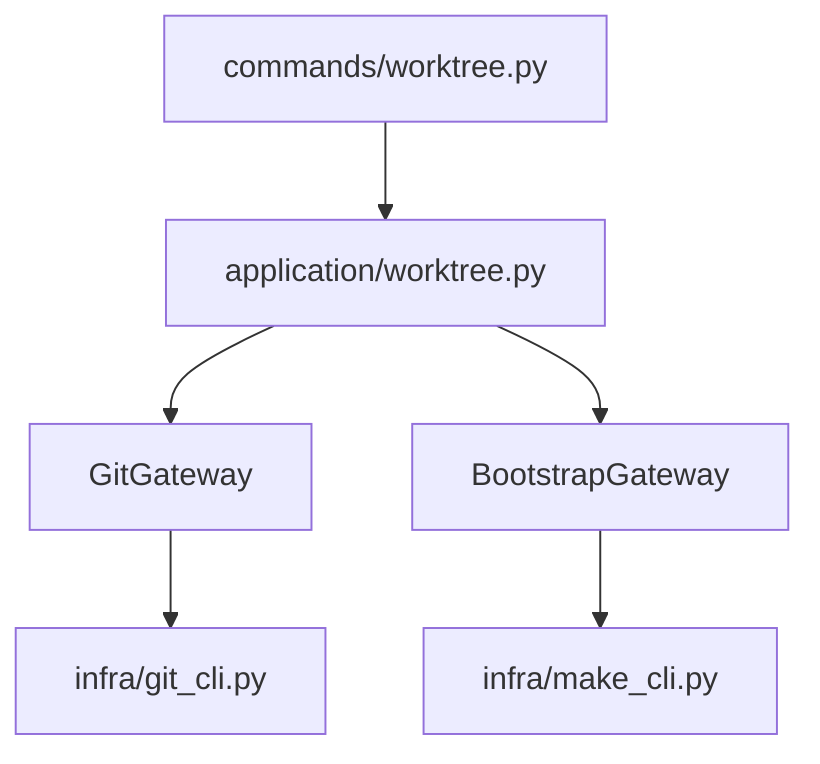

# iss-00110 Worktree create core use case — 設計

## 方針
- `application/worktree.py` に pure orchestration を置き、Git と make の副作用は ports 経由に分離する。
- worktree list の stable input は `git worktree list --porcelain` とし、main worktree は Git の出力順の先頭として扱う。
- bootstrap は `BootstrapGateway` で `BootstrapResult` に集約し、failure を例外化しない。

## 変更点
- `application/contracts.py`
  - `GitWorktreeRecord`
  - `BootstrapResult`
  - `WorktreeCreateRequest`
  - `WorktreeCreateResult`
  - `UseCases.worktree_create`
- `application/ports.py`
  - `GitGateway.worktree_list`
  - `GitGateway.add_worktree_with_new_branch`
  - `BootstrapGateway`
  - `Ports.bootstrap_gateway`
- `application/worktree.py`
  - label validation、candidate generation、collision retry、bootstrap aggregation。
- `infra/git_cli.py`
  - porcelain parser、linked worktree add wrapper。
- `infra/make_cli.py`
  - `make -n init` detection と `make init` execution。

## 依存関係

## テスト戦略
- `tests/cli_runtime/test_worktree.py` で temp repo を作り、real Git worktree による integration evidence を取る。
- make は controlled Makefile で success path を検証し、missing target は real `make -n init` の skipped path で検証する。
- live checkout には worktree を作らず、temp directory のみ使う。

## ロールバック
- `application/worktree.py`、`infra/make_cli.py`、追加 contract と adapter method を削除すれば既存 command surface への影響を戻せる。
