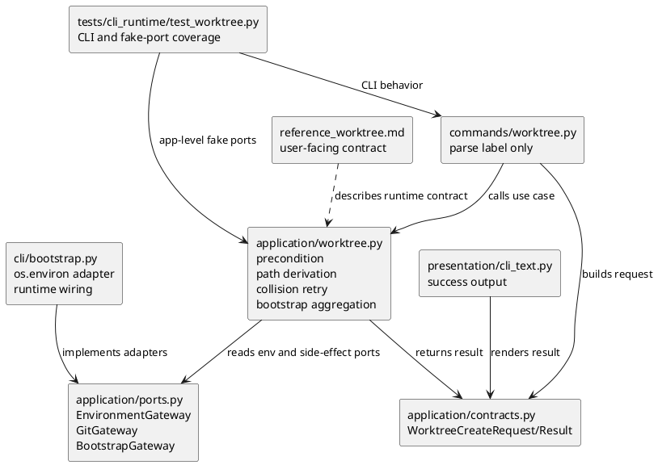
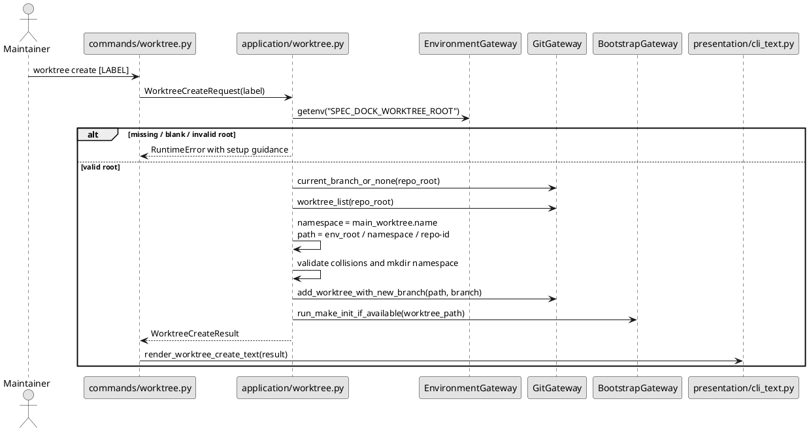

# iss-00130 Central Worktree Root Placement — 設計（どう実現するか）

## 親図（Diagram）参照
- Epic 図:
  - `epic-00107/design.md` の Worktree Create Runtime Components と Package Dependency を参照する。
- 再利用する決定:
  - `spec-dock worktree create [LABEL]` の command surface は維持する。
  - `commands` は CLI args と `CommandOutcome` のみを扱い、Git subprocess や environment lookup を直接持たない。
  - `application/worktree.py` は id generation、collision retry、main worktree normalization、bootstrap outcome aggregation を所有する。
  - Git / make side effect は ports 経由で扱う。
- この issue で置き換える親決定:
  - `epic-00107` の sibling placement は future `worktree create` の正本ではなくなる。
  - future placement は `SPEC_DOCK_WORKTREE_ROOT` based central root とする。

## 目的・制約
- 目的:
  - `worktree create` の placement derivation を repo sibling container から central root に変更する。
  - Codex sandbox writable root を product ごとに追加する運用を避ける。
  - 既存 naming、collision retry、bootstrap、CLI surface の意味を保つ。
- 必須:
  - `SPEC_DOCK_WORKTREE_ROOT` を `worktree create` 専用の required precondition とする。
  - missing / blank / whitespace-only env var は fatal とし、Git mutation、branch 作成、directory 作成、bootstrap より前に止める。
  - env var 値は `Path(value).expanduser()` 後に absolute path であることを要求する。
  - directory symlink は許可し、file、broken symlink、directory 以外、relative path は拒否する。
  - namespace は Git main worktree basename とする。
  - worktree path は `$SPEC_DOCK_WORKTREE_ROOT/<namespace>/<repo-basename>-<id>` とする。
- 禁止:
  - missing env var 時に sibling placement へ fallback すること。
  - namespace override / config をこの issue で追加すること。
  - existing sibling worktree を移動・削除・migration すること。
  - `$CODEX_HOME/worktrees` を spec-dock managed worktree root として流用すること。
- 前提:
  - Requirement phase は fresh `spec-reviewer` により pass 済みである。
  - local `.zshenv` / root directory は repo-managed artifact ではなく、report evidence として扱う。

## 既存実装 / 規約の理解
- 参照した実装 / docs:
  - `src/spec_dock/assets/spec_dock/scripts/spec_dock_runtime/application/worktree.py`
  - `src/spec_dock/assets/spec_dock/scripts/spec_dock_runtime/application/ports.py`
  - `src/spec_dock/assets/spec_dock/scripts/spec_dock_runtime/application/contracts.py`
  - `src/spec_dock/assets/spec_dock/scripts/spec_dock_runtime/cli/bootstrap.py`
  - `src/spec_dock/assets/spec_dock/scripts/spec_dock_runtime/commands/worktree.py`
  - `src/spec_dock/assets/spec_dock/scripts/spec_dock_runtime/presentation/cli_text.py`
  - `src/spec_dock/assets/spec_dock/docs/reference_worktree.md`
  - `tests/cli_runtime/test_worktree.py`
- 現状理解:
  - `application/worktree.py` は `records[0].path` を Git main worktree として扱い、`repo_basename = main_worktree.name` を導出する。
  - 現行 container は `main_worktree.parent / f"{repo_basename}-worktrees"` である。
  - `WorktreeCreateRequest` は `label` のみを持つ。CLI flag で root を渡す設計ではない。
  - `Ports` には `GitGateway` と `BootstrapGateway` はあるが、environment / config boundary はない。
  - `reference_worktree.md` と `tests/cli_runtime/test_worktree.py` は sibling placement を固定している。
- 採用するパターン:
  - use case は application layer に置く。
  - side effect boundary は `ports.py` の protocol と `cli/bootstrap.py` の concrete adapter に分離する。
  - CLI command は root override option を追加せず、existing `worktree create [LABEL]` を維持する。
- 採用しないもの:
  - `commands/worktree.py` で `os.environ` を読む。
  - `application/worktree.py` が直接 `os.environ` を読む。
  - `WorktreeCreateRequest` に root path を CLI input として追加する。
  - sibling fallback を compatibility path として残す。
- 影響範囲:
  - runtime application / ports / bootstrap wiring
  - worktree CLI runtime tests
  - shipped docs and dogfooding docs
  - parent Epic docs that currently describe sibling placement as future behavior

## 採用方針 / トレードオフ
- 論点: environment lookup boundary
  - 選択肢:
    - A: `EnvironmentGateway.getenv(name: str) -> str | None` を `application.ports` に追加する。
    - B: `application/worktree.py` が直接 `os.environ` を読む。
    - C: CLI command が env var を読んで request に詰める。
  - 決定:
    - A を採用する。
  - 理由:
    - Application layer が precondition と path derivation を所有できる。
    - Unit-style tests で process-global environment に依存せず missing / present / malformed env を検証できる。
    - CLI command は label parsing の責務に留まる。
- 論点: root / namespace directory creation
  - 決定:
    - Env var が valid absolute path を指している場合、root / namespace は `mkdir(parents=True, exist_ok=True)` で作成してよい。
  - 理由:
    - Required env var により operator intent は明示されている。
    - 初回利用時の setup friction を減らしつつ、relative / file / broken symlink は拒否できる。
- 論点: namespace ownership
  - 決定:
    - Namespace は Git main worktree basename のみとし、owner metadata や override は追加しない。
  - 理由:
    - User intent は product name as-is であり、同 basename collision は現時点で未発生。
    - 今回の目的は placement contract の変更であり、namespace registry の導入ではない。

## 依存関係分析
- module 依存:
  - `commands/worktree.py` -> `application.contracts.WorktreeCreateRequest` / `application.worktree.worktree_create`
  - `application/worktree.py` -> `application.ports.Ports` / `GitGateway` / `BootstrapGateway` / new `EnvironmentGateway`
  - `cli/bootstrap.py` -> concrete env adapter and existing Git / bootstrap adapters
  - `presentation/cli_text.py` -> `WorktreeCreateResult`
- file 依存:
  - `ports.py` の protocol / `Ports` field を先に追加しないと、`worktree.py` の env lookup を isolated に実装できない。
  - `worktree.py` の path derivation が変わると、`test_worktree.py` の success / bootstrap / collision / linked-worktree expectations を更新する必要がある。
  - Docs は runtime contract が固まったあとに更新する。
- 上流 / 前提:
  - `requirement.md` AC-001..AC-009。
  - Parent Epic の existing worktree command surface。
- 下流 / 依存先:
  - `plan.md` は this design の dependency order に従い、env boundary -> central placement -> existing behavior preservation -> docs impact の順に step を置く。
- 実装起点:
  - `EnvironmentGateway` protocol and runtime wiring。
- 順序への影響:
  - Missing-env fatal behavior を先に test / implement し、silent sibling fallback の再発を防ぐ。
  - Central placement 変更はその後に行い、既存 behavior regression を path update と一緒に閉じる。
  - Docs / parent Epic update は runtime behavior と tests の後で行う。

## モジュール依存図（Module Dependency Diagram）
- タイトル:
  - Central Worktree Root Runtime Boundary
- 答える問い:
  - `SPEC_DOCK_WORKTREE_ROOT` をどの layer で読み、どの module が central placement を決めるか。
- 範囲:
  - `worktree create` の CLI parse、application precondition、ports、runtime wiring、output、tests。
- 含めない詳細:
  - 全 command registry。
  - `git worktree list --porcelain` parser の詳細。
  - `make init` detection の内部実装。
- 更新条件:
  - Env/config boundary、placement derivation、result contract、docs/runtime parity の対象ファイルが変わるとき。

### 図表（UML / モジュール依存）


## ローカル図の差分（Local Diagram Delta）
- 変更する境界 / 責務 / 相互作用:
  - Application layer に `EnvironmentGateway` dependency を追加する。
  - `worktree.py` の placement derivation を sibling container から env-root namespace container へ置き換える。
  - `commands/worktree.py` の責務は変えない。

## インターフェース契約
- `EnvironmentGateway`:
  - 追加場所:
    - `src/spec_dock/assets/spec_dock/scripts/spec_dock_runtime/application/ports.py`
  - contract:
    - `getenv(name: str) -> str | None`
  - concrete implementation:
    - `cli/bootstrap.py` の adapter が `os.environ.get(name)` を返す。
- `Ports`:
  - `environment_gateway: EnvironmentGateway | None = None` を追加する。
  - `worktree_create` は missing `environment_gateway` を runtime wiring error として fatal にする。
- `WorktreeCreateRequest`:
  - 変更しない。Root は command input ではなく environment contract である。
- `WorktreeCreateResult`:
  - 原則変更しない。
  - `container_path` は new namespace directory、つまり `$SPEC_DOCK_WORKTREE_ROOT/<namespace>` を表す。
- Error contract:
  - Missing / blank env var:
    - fatal error。
    - message は `SPEC_DOCK_WORKTREE_ROOT`、required reason、absolute path setup example を含む。
  - Invalid root:
    - fatal error。
    - message は `SPEC_DOCK_WORKTREE_ROOT`、offending raw value、`~` 展開後の resolved path、原因、absolute path setup example を含む。
    - relative path、file、broken symlink、non-directory path を区別できる原因を含める。
  - Namespace mkdir failure:
    - existing artifact-state style を維持し、対象 container path と原因を追えるようにする。
    - message は `SPEC_DOCK_WORKTREE_ROOT`、resolved root、namespace/container path、原因、absolute path setup example を含む。

## シーケンス差分（Sequence Delta）
- 変更する相互作用:
  - `worktree_create` の precondition に env lookup / validation が追加される。
- retry / transaction / external API / queue:
  - Git retry behavior は既存の retryable collision handling を維持する。
  - Env validation failure は retry しない。
- UML:


## ドメインモデル差分（Domain Model Delta）
- aggregate / entity / value object 変更:
  - N/A: SpecDock persisted domain entity は追加しない。
- domain event / policy / specification 変更:
  - N/A: Worktree placement は runtime command policy であり、Spec graph state には保存しない。
- 不変条件の変更:
  - `worktree create` は active selection / spec graph / GitHub issue を変更しない。
  - `SPEC_DOCK_WORKTREE_ROOT` missing / invalid の場合は filesystem / Git mutation を行わない。

## クラス / インターフェース詳細設計
- `EnvironmentGateway`:
  - 責務:
    - Environment variable lookup の port。
  - 連携:
    - `application/worktree.py` から `getenv("SPEC_DOCK_WORKTREE_ROOT")` で呼ばれる。
    - `cli/bootstrap.py` の concrete adapter が実 process environment に接続する。
- `worktree_create` helper:
  - 追加候補:
    - `_resolve_worktree_root(ports: Ports) -> Path`
    - `_validate_worktree_root(raw_value: str) -> Path`
  - 責務:
    - blank check、`expanduser()`、absolute path check、file/symlink/directory validation、setup guidance。
  - 注意:
    - helper は direct `os.environ` を読まない。

## ディレクトリ / ファイル変更計画
```text
src/spec_dock/assets/spec_dock/scripts/spec_dock_runtime/
|-- application/
|   |-- ports.py       # 変更: EnvironmentGateway protocol と Ports field を追加
|   |-- worktree.py    # 変更: required env validation と central namespace placement
|   `-- contracts.py   # 原則変更なし; result field の意味だけ design/docs で明確化
|-- cli/
|   `-- bootstrap.py   # 変更: os.environ backed EnvironmentGateway を runtime ports に wiring
|-- commands/
|   `-- worktree.py    # 原則変更なし; root flag は追加しない
`-- presentation/
    `-- cli_text.py    # 原則変更なし; success path は absolute worktree path を維持

src/spec_dock/assets/spec_dock/docs/
`-- reference_worktree.md # 変更: central root, env requirement, legacy sibling boundary

spec-dock/initiatives/init-local-00002-prototype-feature-expansion/epics/
`-- epic-00107-worktree-provisioning/
    |-- requirement.md # 変更: future placement を central root contract に更新
    |-- design.md      # 変更: sibling placement を legacy / superseded context へ更新
    `-- plan.md        # 変更: docs/verification wording を central root に更新

spec-dock/docs/
`-- reference_worktree.md # provider-side docs 更新後、通常 refresh / parity path で更新

tests/
`-- cli_runtime/
    `-- test_worktree.py # 変更: env-required, central-root, path validation, regression coverage
```

## 要件 → 設計マッピング
- AC-001:
  - `EnvironmentGateway` と early precondition check で missing / blank env を fatal にする。
  - Git / directory / bootstrap before-side-effect を tests で検証する。
- AC-002:
  - `container = env_root / repo_basename`、`worktree_path = container / f"{repo_basename}-{id}"` に変更する。
- AC-003:
  - Valid root の場合だけ root / namespace `mkdir(parents=True, exist_ok=True)` を許可する。
- AC-004:
  - `_validate_worktree_root` で `~` expansion、absolute check、file/broken symlink/non-directory rejection、directory symlink allowance、invalid-root remediation message を固定する。
- AC-005:
  - `_normalize_label`、`_candidate_id`、branch naming、retryable Git collision handling は維持する。
- AC-006:
  - `records[0].path` を main worktree basename source として維持する。
  - branch prefix は `current_branch_or_none(repo_root)` の結果を維持する。
- AC-007:
  - `BootstrapGateway.run_make_init_if_available` をそのまま使い、status / warnings の result aggregation を維持する。
- AC-008:
  - provider docs、dogfooding docs、parent Epic docs を central root contract に整合させる。
- AC-009:
  - local env / filesystem は report evidence として検証し、repo-managed artifact にはしない。
- EC-001:
  - invalid label は existing validation で fatal。env / placement side effect より前に閉じる。
- EC-002:
  - invalid root / namespace creation failure は fatal とし、path と原因を error に出す。
- EC-003:
  - Existing namespace directory は directory として使える限り許可する。
- EC-004:
  - Same basename collision は path / branch / Git worktree record collision のみで扱う。
- EC-005:
  - Existing sibling worktree migration は実装しない。Docs に legacy boundary を残す。

## テスト戦略
- 単体 / application-level:
  - Fake `EnvironmentGateway` で missing / blank / present env を検証する。
  - Fake `GitGateway` / `BootstrapGateway` で non-retryable failure と retryable collision を検証する。
- CLI runtime:
  - Missing / blank `SPEC_DOCK_WORKTREE_ROOT` の fatal behavior と no side effect。
  - Valid env root による central path creation。
  - Env root missing 時の root / namespace auto creation。
  - `~` expansion、relative path rejection、file path rejection、broken symlink rejection、directory symlink allowance。
  - label / id / branch / collision / linked worktree / bootstrap の existing regression を central root expected path に更新。
- Docs / parity:
  - `reference_worktree.md` と parent Epic docs の placement contract inspection。
  - provider-side source と dogfooding workspace の parity test or update evidence。
- Manual / local evidence:
  - `printenv SPEC_DOCK_WORKTREE_ROOT`
  - `.zshenv` export inspection
  - `/Users/iwasawayuuta/workspace/worktrees` existence or creatability

## 要件 / 例外 -> 検証マッピング
- AC-001 -> `test_worktree_create_requires_spec_dock_worktree_root_without_side_effects`
- AC-002 -> `test_worktree_create_uses_central_root_auto_id_and_branch`
- AC-003 -> central-root success test with missing root fixture
- AC-004 -> path validation tests for tilde / relative / file / broken symlink / directory symlink
- AC-005 -> updated existing collision, label, branch prefix, non-retryable Git failure tests
- AC-006 -> updated linked-worktree normalization test
- AC-007 -> updated bootstrap success / failure / detection failure tests
- AC-008 -> docs inspection and parity/update verification
- AC-009 -> report evidence from local shell/filesystem inspection
- EC-001 -> existing invalid label test updated to assert no central/sibling side effects
- EC-002 -> invalid root tests including env var name, offending/resolved path, cause, and setup example in stderr
- EC-003 -> existing namespace directory success/collision tests
- EC-004 -> scope inspection; no namespace override code/config
- EC-005 -> docs inspection; no migration code

## リスク / 移行 / ロールバック
- リスク:
  - Typoed absolute env path may be auto-created.
    - Mitigation: relative / invalid paths are fatal, and output/error shows resolved path.
  - Same basename repositories share a namespace.
    - Mitigation: out of scope is explicit; future namespace override can be added if a real collision appears.
  - Parent Epic docs may retain stale sibling wording.
    - Mitigation: S90 docs impact step updates parent Epic and shipped docs together.
- 移行:
  - Existing sibling worktrees are left untouched.
  - Future `worktree create` uses central root only.
  - No SpecDock persisted state migration is required.
- ロールバック:
  - Revert `worktree.py` placement derivation and docs/tests to sibling placement.
  - No migration rollback is required because existing sibling worktrees were never moved.

## 未確定事項
- なし。
