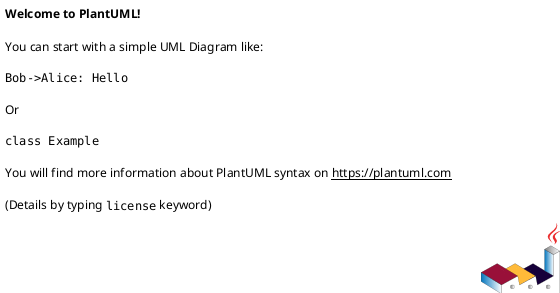

# 20260526t081259z-01-interview Requirement Interview

## 位置づけ
- 用途: 人間から目的、制約、期待、判断基準、未決事項を引き出し、回答を記録する。
- authority default: `raw`。通常は doc type から推定し、例外時だけ front matter の `authority` で override する。
- 技術的に調べられることは先に docs / code / tests / ADR / discussions / primary source を確認する。
- trivial な yes/no は、重要な判断、後続反映、回答証跡が必要なら `interview` を使い、そうでなければ issue comment や `scratch` で足りる。
- 回答から論点整理が必要になったら `disc`、追加調査が必要になったら `research`、長期判断が固まったら `adr` を新規作成する。

## ヒアリング概要 (必須)
- 対象者:
  - iwasawayuuta
- 回答が必要な理由:
  - `iss-00130` は existing approved Epic contract の sibling placement を置き換えるため、env var 名、root creation policy、namespace collision policy を要件として固定してから `requirement.md` へ昇格する必要がある。
- 反映予定先:
  - `requirement.md`:
    - 目的、前提、スコープ、受け入れ条件、例外・エッジケース、未確定事項。
  - `design.md`:
    - env lookup boundary、path derivation、namespace rule、test strategy。
  - `plan.md`:
    - missing env / present env / namespace / collision / docs update の step と closure。
  - `adr`:
    - 必要なら central root adoption の長期判断として昇格する。

## 質問ブロック（必要な数だけ繰り返す） (必須)

### 質問 1
- 質問主題:
  - Environment variable name
- 回答してほしいこと:
  - Required env var name を `SPEC_DOCK_WORKTREE_ROOT` にしてよいか。あるいは generic な `WORKTREE_ROOT` を希望するか。
- なぜ質問するのか:
  - Env var name は CLI contract、error message、docs、tests、local shell setup のすべてに影響する。
- 背景:
  - User wording is "worktree root path as shell environment variable"; current environment has no existing worktree-root variable.
- 詳細説明:
  - Tool-specific name avoids collision. Generic name is shorter but other tools may already use or expect it.
- 事前分析:
  - 確認済みの docs / code / tests / ADR / discussions / primary source:
    - Current `WorktreeCreateRequest` has only `label`.
    - Current shell env and zsh files do not define a worktree-root variable.
  - まだ人間判断が必要な理由:
    - This is user-facing naming and should match the intended convention across the user's development machine.
- 回答案:
  - A:
    - `SPEC_DOCK_WORKTREE_ROOT`
  - B:
    - `WORKTREE_ROOT`
- 選択肢比較:
  - 評価軸:
    - collision risk, readability, cross-tool convention, docs clarity.
- メリット:
  - A:
    - Tool ownership is clear; unlikely to conflict; docs can be exact.
  - B:
    - Short and generic; may be useful if multiple tools share the same root.
- デメリット:
  - A:
    - Longer name; other tools will not naturally share it.
  - B:
    - Collision or ambiguous ownership risk.
- リスク:
  - A generic variable could be accidentally reused by unrelated tooling with a different lifecycle expectation.
- ベストプラクティス分析:
  - Prefer tool-specific env vars when the semantics are part of a tool contract and failure behavior is strict.
- 推奨案:
  - A: `SPEC_DOCK_WORKTREE_ROOT`
- 未回答時の影響:
  - Requirement cannot finalize env contract; error text and tests remain ambiguous.
- 回答欄:
  - 2026-05-26 answer:
    - A: `SPEC_DOCK_WORKTREE_ROOT` を採用する。
- 回答後フォローアップ:
  - 反映先:
    - `requirement.md` の前提 / 非交渉制約 / AC / EC。
    - `design.md` の env lookup boundary。
  - 追加で作る discussion docs:
    - ADR candidate if env var naming becomes a long-lived convention.

### 質問 2
- 質問主題:
  - Env var set but directory missing
- 回答してほしいこと:
  - `SPEC_DOCK_WORKTREE_ROOT=/Users/iwasawayuuta/workspace/worktrees` のように env var は設定済みだが directory が存在しない場合、`worktree create` が root / namespace directory を作成してよいか、それとも fail-fast すべきか。
- なぜ質問するのか:
  - Convenience と typo detection のトレードオフがある。
- 背景:
  - User wording includes "directory を作成し、env var にセットしておく"。Tool が作るのか、事前 setup が作るのかは未確定。
- 詳細説明:
  - 現行実装は sibling container を `mkdir(parents=True, exist_ok=True)` で作る。central root でも同様に作ると初回利用は楽だが、env var typo に気づきにくくなる。
- 事前分析:
  - 確認済みの docs / code / tests / ADR / discussions / primary source:
    - Current implementation creates sibling container.
    - Current tests cover container creation failure when path is a file.
  - まだ人間判断が必要な理由:
    - Central root は machine-wide convention なので、誤 path を自動作成する挙動の是非は operator policy。
- 回答案:
  - A:
    - Env var missing is fatal。Env var set + root missing は command が root and namespace を作成する。
  - B:
    - Env var missing も root missing も fatal。setup command or shell setup must create it first。
- 選択肢比較:
  - 評価軸:
    - first-use convenience, typo detection, current behavior compatibility.
- メリット:
  - A:
    - 初回利用が楽。現在の `mkdir` behavior に近い。
  - B:
    - 誤った env path を早く検出できる。
- デメリット:
  - A:
    - Typoed path に空 directory を作ってしまう。
  - B:
    - Setup 手順が増える。
- リスク:
  - A の場合、誤設定で `/Users/iwasawayuuta/workspace/worktree` のような似た path が作られる可能性。
- ベストプラクティス分析:
  - Required env var で operator intent は明示されているため、directory 作成は許容できる。ただし output / error に resolved root を出すべき。
- 推奨案:
  - A。Missing env var は fatal にしつつ、env var が明示されている場合はその root / namespace を作成してよい。
- 未回答時の影響:
  - Container creation tests and failure contract cannot be finalized.
- 回答欄:
  - 2026-05-26 answer:
    - A: Env var missing is fatal。Env var set + root missing は command が root / namespace directory を作成してよい。
- 回答後フォローアップ:
  - 反映先:
    - `requirement.md` EC / AC
    - `design.md` path creation policy
  - 追加で作る discussion docs:
    - none expected

### 質問 3
- 質問主題:
  - Namespace rule and collision tolerance
- 回答してほしいこと:
  - Central root 配下の namespace は常に Git main worktree basename を使う、でよいか。例: `/Users/.../tools/spec-dock` -> `spec-dock`。
- なぜ質問するのか:
  - Central root では、異なる親 directory に同名 repo があると namespace が衝突する。
- 背景:
  - User preference is "各プロダクトの名前をそのまま適用"; this repo は `spec-dock`。
- 詳細説明:
  - Existing logic already uses main worktree basename as repo basename. The central root can keep that rule for readability, but it loses the parent directory's collision separation.
- 事前分析:
  - 確認済みの docs / code / tests / ADR / discussions / primary source:
    - Current implementation uses `main_worktree.name`.
    - Existing branch/path naming depends on `repo_basename`.
  - まだ人間判断が必要な理由:
    - Product name and directory basename are usually equal but not guaranteed.
- 回答案:
  - A:
    - Default namespace is repo basename only. No override in this issue.
  - B:
    - Default namespace is repo basename, with optional override config/flag/env added now.
  - C:
    - Namespace includes category prefix, e.g. `tools-spec-dock`, to avoid collisions.
- 選択肢比較:
  - 評価軸:
    - readability, collision avoidance, implementation scope, user preference.
- メリット:
  - A:
    - Simple; matches user preference for product name.
  - B:
    - Handles product-name mismatch.
  - C:
    - Avoids same-basename collisions.
- デメリット:
  - A:
    - Same-basename products can collide.
  - B:
    - Adds config surface before a demonstrated need.
  - C:
    - Less aligned with "product name as-is".
- リスク:
  - A can mix worktrees if two products share basename and branch/id names overlap.
- ベストプラクティス分析:
  - Start with a simple default and add override when a concrete collision appears.
- 推奨案:
  - A for this issue. Keep namespace simple and human-readable; add override only if a real collision appears.
- 未回答時の影響:
  - Path contract cannot be finalized.
- 回答欄:
  - 2026-05-26 answer:
    - A: Default namespace is repo basename only. No override in this issue.
    - この repo では `spec-dock` を namespace とする。
- 回答後フォローアップ:
  - 反映先:
    - `requirement.md` path examples
    - `design.md` namespace derivation
  - 追加で作る discussion docs:
    - none expected

### 質問 4
- 質問主題:
  - Scope of local machine setup
- 回答してほしいこと:
  - この issue で実際に `/Users/iwasawayuuta/workspace/worktrees` の作成と `~/.zshrc` or `~/.zprofile` への export 追加まで行うか、それとも spec-dock tool/docs/tests の変更だけに留めるか。
- なぜ質問するのか:
  - Repository change と user-local machine configuration は lifecycle と commit 対象が違う。
- 背景:
  - User says this development environmentでは directory 作成と zsh profile export を行うつもり。
- 回答案:
  - A:
    - This issue includes repo changes only; local shell setup is manual/documented.
  - B:
    - This issue also performs local machine setup, but does not commit shell profile changes to repo.
  - C:
    - Provide a setup command or script in repo that users run manually.
- 推奨案:
  - A for product scope, with optional separate local setup after requirement approval. If local setup is desired, record it as manual evidence, not repo diff.
- 回答欄:
  - 2026-05-26 answer:
    - B: この issue に local machine setup も含める。
    - 設定先は `.zshenv` がよい。`.zprofile` より `.zshenv` の方が適しているという認識。
    - `/Users/iwasawayuuta/workspace/worktrees` の作成と shell env export 追加を含める。
    - Workspace 外編集になるため、必要なタイミングで user approval を求める。
- 回答後フォローアップ:
  - 反映先:
    - `requirement.md` scope / out-of-scope
    - `plan.md` manual verification or docs impact
  - 追加で作る discussion docs:
    - scratch/manual evidence if local setup is performed

### 質問 5
- 質問主題:
  - Legacy sibling worktrees
- 回答してほしいこと:
  - Existing sibling worktrees such as `/Users/iwasawayuuta/workspace/tools/spec-dock-worktrees/spec-dock-delegated-authoring-architecture` should be left untouched, documented as legacy, or migrated manually?
- なぜ質問するのか:
  - Migration behavior affects safety and docs, but automatic moving of Git linked worktrees is riskier than changing future creation.
- 背景:
  - Current `git worktree list` shows an existing sibling worktree.
- 回答案:
  - A:
    - Leave existing sibling worktrees untouched. New behavior applies only to future `worktree create`.
  - B:
    - Add manual migration guidance to docs.
  - C:
    - Implement migration or repair behavior now.
- 推奨案:
  - A。Future creation contract を変えるだけにし、既存 linked worktree は Git 管理下の既存成果物として触らない。
- 回答欄:
  - 2026-05-26 answer:
    - A: Leave existing sibling worktrees untouched.
    - Existing worktree migration / moving is not required.
    - Backward compatibility for existing sibling-placement behavior is not required.
    - New behavior only needs to apply to future worktrees created by the command.
- 回答後フォローアップ:
  - 反映先:
    - `requirement.md` scope / target-out
    - `reference_worktree.md`
  - 追加で作る discussion docs:
    - none expected

### 質問 6
- 質問主題:
  - `.zshenv` export format
- 回答してほしいこと:
  - `.zshenv` に追加する行は、既存 override を尊重する形式でよいか。
- なぜ質問するのか:
  - Literal absolute path と defaultable expression のどちらにするかで、将来の一時 override のしやすさが変わる。
- 背景:
  - `.zshenv` には既に root path 系 env var があり、`WORKSPACE_SECRETS_HOME="${WORKSPACE_SECRETS_HOME:-$HOME/.config/secrets}"` のように既存値を尊重する形式が使われている。
- 回答案:
  - A:
    - `export SPEC_DOCK_WORKTREE_ROOT="${SPEC_DOCK_WORKTREE_ROOT:-$HOME/workspace/worktrees}"`
  - B:
    - `export SPEC_DOCK_WORKTREE_ROOT="/Users/iwasawayuuta/workspace/worktrees"`
- 推奨案:
  - A。既存 `.zshenv` の pattern に合い、必要時に外側から override できる。
- 回答欄:
  - 推奨案 A を前提に要件化する。user が literal absolute path を希望する場合のみ変更する。
- 回答後フォローアップ:
  - 反映先:
    - `requirement.md` local setup example
    - `plan.md` local setup verification
  - 追加で作る discussion docs:
    - none expected

## 図解（任意）

