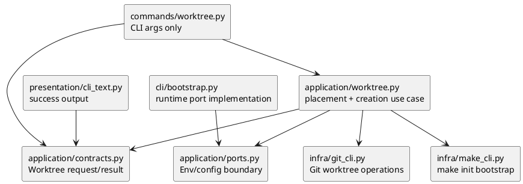

# Central Worktree Root Placement Design Guidance

## 位置づけ
- This is a scope-local flat discussion draft for `iss-00130`.
- It is not canonical `requirement.md`, `design.md`, `plan.md`, or `report.md`.
- Parent orchestrator owns adoption, promotion, and canonical report ledger disposition.

## 設計ゴール
- Change future `spec-dock worktree create` placement from an implicit sibling container to an explicit central root.
- Require `SPEC_DOCK_WORKTREE_ROOT` for `worktree create`; missing env var is fatal and must not fall back to sibling placement.
- Derive namespace from the Git main worktree basename.
- Keep current id, directory basename suffix, and branch naming logic.
- Leave existing sibling worktrees untouched; no migration or backward compatibility path for future sibling placement is required.
- Treat local `.zshenv` setup as verification evidence only. Repository implementation should not edit user shell startup files.

## Current Contract
- `application/worktree.py` currently computes:
  - `main_worktree = records[0].path`
  - `repo_basename = main_worktree.name`
  - `container = main_worktree.parent / f"{repo_basename}-worktrees"`
  - `worktree_path = container / f"{repo_basename}-{worktree_id}"`
  - `branch_name = f"{branch_prefix}-{worktree_id}"`
- `WorktreeCreateRequest` carries only `label`.
- `WorktreeCreateResult` already exposes `container_path` and `worktree_path`.
- `reference_worktree.md` documents sibling placement.
- `tests/cli_runtime/test_worktree.py` asserts sibling placement in CLI integration tests and unit-style fake gateway tests.

## Target Placement Contract
- Required env var:
  - `SPEC_DOCK_WORKTREE_ROOT`
- Missing env var:
  - Fatal precondition failure before any worktree path, branch, Git worktree, or bootstrap side effect.
  - Error text should name `SPEC_DOCK_WORKTREE_ROOT` and state that it is required for `worktree create`.
- Env var present but root directory missing:
  - The command may create the root and namespace directories.
  - Creation should be explicit in the implementation path, not a shell startup side effect.
- Namespace:
  - `namespace = <Git main worktree basename>`
  - For this repo: `spec-dock`.
- Worktree path:
  - `$SPEC_DOCK_WORKTREE_ROOT/<namespace>/<repo-basename>-<id>`
  - For this repo with `id=wt1`: `/Users/iwasawayuuta/workspace/worktrees/spec-dock/spec-dock-wt1`
- Id and branch:
  - Keep existing id rules: `wt1`, `wt2`, ... or `<label>`, `<label>2`, ...
  - Keep existing branch rule: `<current-branch>-<id>`.
- Linked worktree invocation:
  - Continue using Git's main worktree record for `repo_basename` and namespace.
  - Continue using the executing checkout's current branch for `branch_prefix`, matching existing behavior.

## Boundary Recommendation
- Put env lookup behind an application-facing runtime/environment boundary rather than reading `os.environ` directly inside parser or CLI command code.
- Keep `commands/worktree.py` responsible for CLI args only.
- Keep `application/worktree.py` responsible for placement derivation and fatal precondition behavior.
- Add the minimal port or bootstrap-provided value needed so unit tests can simulate missing and present env without relying on process-global environment.
- Do not add a CLI flag for root override in this issue; the accepted contract is env-var based.
- Do not add namespace override in this issue; collision mitigation is a future extension only if a real basename collision appears.

## Suggested Data Flow
```text
CLI parser
  -> WorktreeCreateRequest(label)
  -> application worktree_create
      -> require SPEC_DOCK_WORKTREE_ROOT via environment/config port
      -> git worktree list to find main worktree basename
      -> namespace = main_worktree.name
      -> container = env_root / namespace
      -> worktree_path = container / f"{repo_basename}-{id}"
      -> branch = f"{current_branch}-{id}"
      -> preflight collision
      -> mkdir env_root/namespace as needed
      -> git worktree add
      -> make init bootstrap
```

## Module Dependency Diagram


## File Change Guidance
```text
src/spec_dock/assets/spec_dock/scripts/spec_dock_runtime/
|-- application/
|   |-- worktree.py      # change placement derivation and missing-env failure
|   |-- contracts.py     # add only if request/result/port contract needs a new typed field
|   `-- ports.py         # add a narrow environment/config protocol if no existing port fits
|-- cli/
|   `-- bootstrap.py     # wire real env lookup into Ports
|-- commands/
|   `-- worktree.py      # likely no behavior change beyond keeping args unchanged
`-- presentation/
    `-- cli_text.py      # change only if output should expose root/container explicitly

src/spec_dock/assets/spec_dock/docs/
`-- reference_worktree.md # update shipped user-facing placement docs

tests/
`-- cli_runtime/
    `-- test_worktree.py # update sibling assertions and add env-required coverage
```

## Test Strategy
- CLI integration:
  - Missing `SPEC_DOCK_WORKTREE_ROOT` fails with a clear error and creates no sibling container, no central namespace, no worktree branch, and no bootstrap side effect.
  - Present env var creates worktree under `$SPEC_DOCK_WORKTREE_ROOT/<namespace>/<repo-basename>-<id>`.
  - Present env var with missing root creates root/namespace as needed.
  - Invalid label still fails before placement creation.
  - `make init` success/failure/detection-failure tests use central-root expected paths.
  - Linked worktree invocation normalizes namespace/path from Git main worktree basename while preserving executing checkout branch prefix.
- Application/unit-style tests:
  - Fake environment/config port can return missing and present values.
  - Non-retryable `git worktree add` failures still report artifact state for the central path.
  - Retryable collisions still advance id/branch candidates without changing naming rules.
- Docs verification:
  - `reference_worktree.md` no longer states sibling placement as current behavior.
  - Docs distinguish spec-dock managed central root from Codex app `$CODEX_HOME/worktrees`.
- Local setup evidence:
  - Verification may record that a fresh zsh sees `SPEC_DOCK_WORKTREE_ROOT=/Users/iwasawayuuta/workspace/worktrees`.
  - Verification may record whether `/Users/iwasawayuuta/workspace/worktrees` exists before/after command execution.
  - No repository change should depend on editing `.zshenv` during implementation.

## Canonical Promotion Notes
- Requirement should explicitly supersede the approved Epic sibling-placement contract for future `worktree create`.
- Design should state that existing sibling worktrees remain valid Git worktrees but are not migrated or reused by new placement.
- Plan should include a docs update step because shipped `reference_worktree.md` currently documents sibling placement.
- Report should treat this draft as unreviewed input until the parent orchestrator adopts or rejects it.

## Material Decisions / Open Questions
- No remaining material design question is required to draft the implementation shape from the provided facts.
- The durable decision to promote central-root placement over the Epic's existing sibling-placement contract still belongs to the parent orchestrator and canonical artifacts.
- Optional future follow-up, out of scope for this issue:
  - namespace override for repos with colliding basenames.
  - list/remove/prune commands for centrally placed worktrees.
  - migration guide for existing sibling worktrees.
