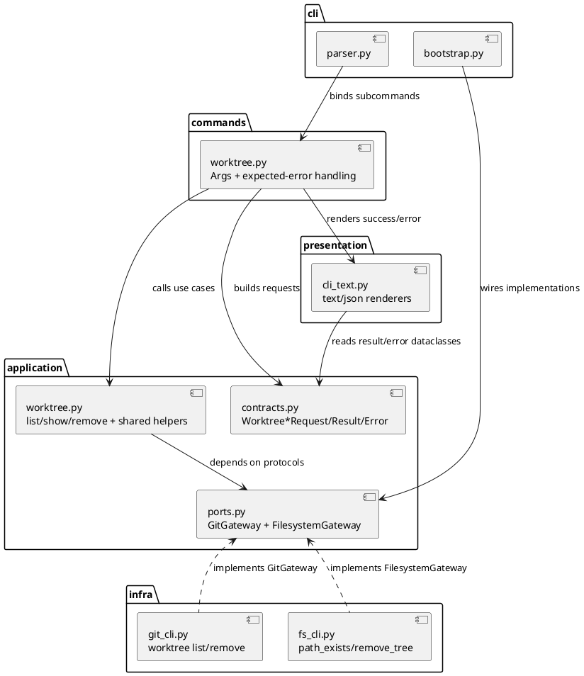
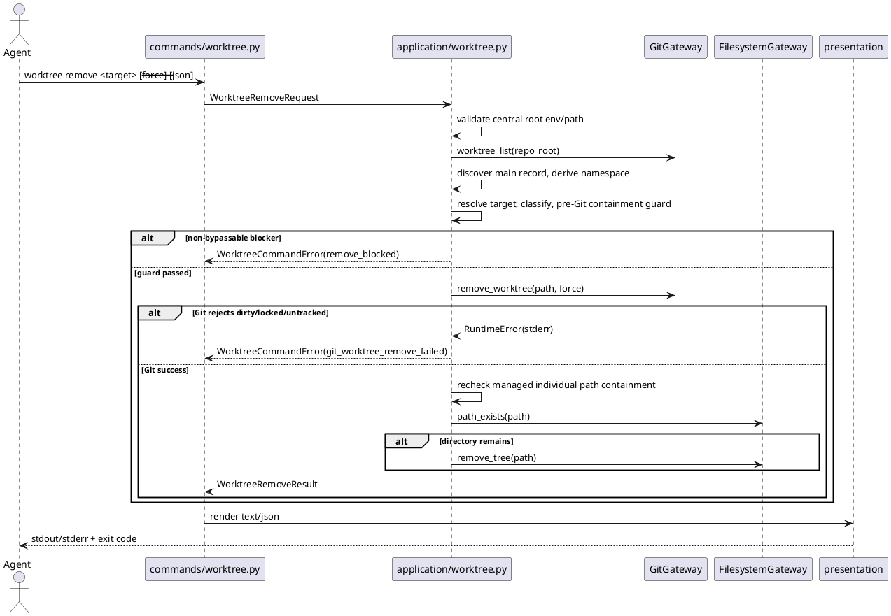

# iss-00137 Worktree list show remove commands — 設計（どう実現するか）

## 親図（Diagram）参照
- Epic 図:
  - `spec-dock/active/epic/design.md` の component / module view と package dependency を再利用する。
  - 本 issue は既存 `worktree create` の command family に `list` / `show` / `remove` を追加する差分であり、親設計の layered runtime boundary を変更しない。
- 再利用する決定:
  - provider-side source of truth は `src/spec_dock/assets/spec_dock/...`。
  - Git linked worktree metadata は Git CLI が source of record。
  - `SPEC_DOCK_WORKTREE_ROOT/<repo-basename>/` を SpecDock managed namespace とする。
  - `remove` は Git `worktree remove` semantics を first authority とし、Git 成功後だけ filesystem cleanup を行う。

## 目的・制約
- 目的:
  - agent が `worktree list --json` で inventory を取得し、`show --json` で詳細確認し、`remove` で managed worktree を安全に削除できるようにする。
  - issue lifecycle と同じ短命 worktree lifecycle を、branch deletion や prune/repair に広げず閉じる。
- 必須 / 禁止:
  - `list` / `show` / `remove` はすべて `--json` を持つ。
  - `remove` は managed worktree のみ許可し、main checkout、current checkout、unmanaged worktree は `--force` でも拒否する。
  - `worktree delete` alias、branch deletion、`worktree prune`、stale repair、orphan cleanup は追加しない。
- 非交渉制約:
  - destructive operation は temp Git repo / temp central root の tests で検証する。
  - live checkout を削除対象にしない。
  - `remove --force` は Git の dirty / locked / untracked refusal を明示的に bypass する用途に限定する。
- 前提:
  - `SPEC_DOCK_WORKTREE_ROOT` は `worktree create` と同じ validation contract を使う。
  - `list/show` の `removable` は planning hint であり、`remove` 実行直前に必ず再検証する。

## 既存実装 / 規約の理解
- 参照した実装 / docs:
  - `src/spec_dock/assets/spec_dock/scripts/spec_dock_runtime/application/worktree.py`
  - `src/spec_dock/assets/spec_dock/scripts/spec_dock_runtime/application/contracts.py`
  - `src/spec_dock/assets/spec_dock/scripts/spec_dock_runtime/application/ports.py`
  - `src/spec_dock/assets/spec_dock/scripts/spec_dock_runtime/commands/worktree.py`
  - `src/spec_dock/assets/spec_dock/scripts/spec_dock_runtime/cli/parser.py`
  - `src/spec_dock/assets/spec_dock/scripts/spec_dock_runtime/cli/bootstrap.py`
  - `src/spec_dock/assets/spec_dock/scripts/spec_dock_runtime/cli/dispatch.py`
  - `src/spec_dock/assets/spec_dock/scripts/spec_dock_runtime/infra/git_cli.py`
  - `src/spec_dock/assets/spec_dock/scripts/spec_dock_runtime/presentation/cli_text.py`
  - `tests/cli_runtime/test_worktree.py`
- 現状理解:
  - `worktree create` は application layer が root validation、main worktree normalization、candidate generation、collision retry、Git add、bootstrap aggregation を所有している。
  - `infra/git_cli.py` は `git worktree list --porcelain` を `GitWorktreeRecord` に変換し、`add_worktree_with_new_branch` を提供している。
  - CLI dispatch は未捕捉 `RuntimeError` を text stderr に畳むため、`--json` の expected failure は command layer で JSON outcome に変換する必要がある。
- 採用するパターン:
  - command layer は argparse と output selection を扱い、Git subprocess を直接呼ばない。
  - application layer が classification、target resolution、remove guard、remove orchestration を所有する。
  - infra layer は Git / filesystem の薄い adapter に留める。
- 採用しないもの:
  - managed worktree registry の新規永続化。
  - spec-node `delete --json` の subtree deletion / post-sync / remote close semantics の流用。
  - pre-clean による Git dirty guard の迂回。
- 影響範囲:
  - provider runtime implementation、provider docs、dogfooding docs、runtime tests。
  - SpecDock tree、active pointer、GitHub issue state、branch lifecycle は対象外。

## 採用方針 / トレードオフ
- D-001 command family:
  - `worktree list` / `show` / `remove` を existing `worktree create` family に追加する。
  - `delete` alias は実装しない。
- D-002 Git-first remove:
  - `remove` は SpecDock guard を通過した後、通常は `git worktree remove <path>` を実行する。`--force` は Git force removal に対応するが、locked worktree など Git がより強い force depth を要求する場合の具体的な Git flag depth は adapter 内部詳細として扱う。
  - Git が dirty / locked / untracked file を理由に拒否した場合は Git error を返し、filesystem cleanup は行わない。
  - Git 成功後に個別 worktree directory が残る場合だけ、cache / generated files ごと directory cleanup する。
  - cleanup 直前にも canonical path containment を確認し、resolved path が managed namespace 配下の個別 directory であることを再検証する。
- D-003 JSON error contract:
  - `--json` 指定時の expected command failure は `status=error` JSON を stdout に返し、exit code は non-zero にする。
  - unexpected exception は既存 dispatch fallback の text stderr でよい。
- D-004 target resolution:
  - stable `id`、absolute path、directory basename を accepted target とする。
  - branch name target は解決しない。
  - accepted target forms に複数一致する場合は candidates 付き `ambiguous_target` とし、削除しない。
- D-005 stable id:
  - managed path が `<repo-basename>-<suffix>` に一致する場合、stable id は `<suffix>` とする。
  - main checkout の stable id は `main` とする。
  - unmanaged path の stable id は directory basename とする。
  - 同一 list 内で id が重複する場合は、各 record に deterministic suffix `~2`, `~3`, ... を付けて JSON record id を一意にする。
  - target 解決では `id`、absolute path、basename の全 accepted forms を評価し、複数 record に一致した場合は `ambiguous_target` とする。単一 record に複数 form が一致することは ambiguity ではない。

## 依存関係分析
- module 依存:
  - `cli/parser.py` -> `commands/worktree.py` -> `application/worktree.py` -> ports -> `infra/git_cli.py` / filesystem adapter
  - `commands/worktree.py` -> `presentation/cli_text.py`
  - `presentation/cli_text.py` -> `application.contracts` result dataclasses
- file 依存:
  - `application.contracts.UseCases` に `worktree_list` / `worktree_show` / `worktree_remove` callable を追加する。
  - `application.ports.GitGateway` に remove method を追加し、filesystem cleanup 用に `FilesystemGateway` を追加する。
  - `cli/bootstrap.py` で new use cases と adapter を wiring する。
- 共通 prerequisite:
  - `list` / `show` / `remove` use case は `SPEC_DOCK_WORKTREE_ROOT` の env value / path validity を最初に validation し、valid central root が確定するまで Git listing、Git remove、filesystem cleanup を呼ばない。
  - repo basename と namespace は Git worktree list で得た main worktree record から導出する。したがって順序は `central root validation -> Git worktree list/main record discovery -> namespace derivation -> managed classification -> target resolution/remove guard` とする。
- 実装起点:
  - request/result/error dataclasses と use case helper を先に固定する。
  - 次に parser/command/presentation の JSON contract を固定する。
  - 最後に Git remove / filesystem cleanup adapter と destructive runtime tests を閉じる。
- 順序への影響:
  - plan は contract/model -> inventory/show -> remove guard/Git integration -> docs/dogfooding parity の順にする。

## モジュール依存図（Module Dependency Diagram）
- タイトル:
  - Worktree list/show/remove runtime delta
- 答える問い:
  - 既存 `worktree create` family に追加する責務と依存方向をどこへ置くか。
- 範囲:
  - CLI parsing から Git list/remove、post-remove cleanup、text/JSON output まで。
- 含めない詳細:
  - exhaustive call graph、全 test helper、SpecDock tree mutation。
- 更新条件:
  - use case boundary、ports、JSON contract、remove safety contract が変わるとき。



## ローカル図の差分（Local Diagram Delta / 必要時）
- 変更する境界 / 責務 / 相互作用:
  - Issue-local module dependency は上記で十分。親 Epic の component / package 図を再掲しない。

## インターフェース契約
- CLI:
  - `spec-dock worktree list [--json]`
  - `spec-dock worktree show <target> [--json]`
  - `spec-dock worktree remove <target> [--force] [--json]`
- Application contracts:
  - `WorktreeListRequest`
  - `WorktreeShowRequest(target: str)`
  - `WorktreeRemoveRequest(target: str, force: bool = False)`
  - `WorktreeRecordView(id, path, basename, branch, head, managed, main, current, path_exists, record_exists, removable, remove_blockers)`
  - `WorktreeListResult(worktrees, warnings)`
  - `WorktreeShowResult(worktree, warnings)`
  - `WorktreeRemoveResult(worktree, removed_record, removed_directory, branch_deleted=False, warnings)`
  - `WorktreeCommandError(code, message, target=None, candidates=None, worktree=None, remove_blockers=None, git_error=None)`
- GitGateway:
  - existing `worktree_list(repo_root) -> list[GitWorktreeRecord]`
  - new `remove_worktree(repo_root, *, path: Path, force: bool) -> None`
- FilesystemGateway:
  - `path_exists(path: Path) -> bool`
  - `remove_tree(path: Path) -> None`
- JSON success payload:
  - common fields: `status: "ok"`, `command`, `warnings`.
  - list: `worktrees[]`.
  - show: `target`, `worktree`.
  - remove: `target`, `resolved_target`, `removed_record`, `removed_directory`, `branch_deleted=false`.
  - remove `resolved_target` must include at least `id`, `path`, `basename`, `branch`, `managed`, `main`, and `current`; it may include the full `WorktreeRecordView` if the renderer keeps one shared shape.
- JSON expected failure payload:
  - common fields: `status: "error"`, `command`, `error`, `warnings`.
  - `error.code` values:
    - `worktree_root_required`
    - `invalid_worktree_root`
    - `target_not_found`
    - `ambiguous_target`
    - `unsupported_branch_target`
    - `remove_blocked`
    - `git_worktree_list_failed`
    - `git_worktree_remove_failed`
    - `post_remove_cleanup_failed`
  - `ambiguous_target` includes `candidates`.
  - `remove_blocked` includes resolved `worktree` and `remove_blockers`.
  - `git_worktree_remove_failed` includes `git_error` and must not claim directory cleanup.

## シーケンス差分（Sequence Delta）
- 変更する相互作用:
  - `remove` は target resolution と guard 後に Git remove を実行し、Git 成功後だけ filesystem cleanup へ進む。
- retry / transaction / external API / queue:
  - retry なし。
  - Git remove 成功後の filesystem cleanup 失敗は partial failure として `removed_record=true`, `removed_directory=false` を JSON/text に出す。



## ドメインモデル差分（Domain Model Delta）
- aggregate / entity / value object 変更:
  - SpecDock persistent domain entity は追加しない。
  - Runtime-only value model として `WorktreeRecordView` と `WorktreeCommandError` を application contract に置く。
- 不変条件:
  - `managed=false`、`main=true`、`current=true` の worktree は remove 不可。
  - `remove --force` は Git force にだけ渡り、SpecDock の non-bypassable guard は bypass しない。
  - branch deletion は常に `false`。
  - Git remove 対象と cleanup 対象は canonicalized path が managed namespace 配下の individual directory に限る。
  - Git remove 対象と cleanup 対象は namespace parent、自 repo_root、main worktree、current worktree、または symlink 解決後に namespace 外へ出る path であってはならない。

## クラス / インターフェース詳細設計
- `WorktreeRecordView`:
  - Git record、central namespace、current repo_root、filesystem existence を合成した agent-facing view。
  - `removable` は `remove_blockers` が空であることから導出する。
- stable id algorithm:
  - main worktree: `main`
  - managed worktree path basename `<repo-basename>-<suffix>`: `<suffix>`
  - managed worktree path basename that does not match the prefix: full basename
  - unmanaged worktree: full basename
  - duplicate ids in one inventory: keep first sorted record as-is, append `~2`, `~3`, ... to later records in deterministic path order.
  - JSON `id` values are unique within one command result. A later command may change disambiguating suffixes if Git records are added/removed, so agents should prefer current `list --json` output before destructive operations.
- `remove_blockers`:
  - `unmanaged`
  - `main_worktree`
  - `current_worktree`
  - `path_missing`
  - `record_missing`
  - `bare_worktree`
  - `locked`（Git porcelain から判定できる場合）
  - `git_remove_would_require_force`（軽量診断できる場合だけ。final authority は Git remove）
- `WorktreeCommandError`:
  - expected failure を command layer が捕捉して text / JSON に出し分けるための application-level exception または result object。
  - implementation では exception と result のどちらでもよいが、`--json` failure が dispatch fallback に落ちないことを test で固定する。
- pre-Git remove containment guard:
  - Use canonical `Path.expanduser().resolve(strict=False)` for namespace, main worktree, current repo root, and target path.
  - Before `GitGateway.remove_worktree`, require all of the following:
    - target canonical path is below canonical managed namespace.
    - target canonical path is not equal to managed namespace.
    - target canonical path is not equal to repo root or main worktree path.
    - target was resolved from a current Git worktree record and classified `managed=true`, `main=false`, `current=false`.
  - If any pre-Git containment condition fails, return `remove_blocked` and do not call Git remove or filesystem cleanup, even with `--force`.
- post-Git cleanup containment guard:
  - Repeat the same canonical containment checks immediately before `FilesystemGateway.remove_tree`.
  - If containment fails after Git remove success, return `post_remove_cleanup_failed` with `removed_record=true` and `removed_directory=false`; do not delete anything.

## ディレクトリ / ファイル変更計画
```text
src/spec_dock/assets/spec_dock/scripts/spec_dock_runtime/
|-- application/
|   |-- contracts.py      # 追加: list/show/remove request/result/error dataclasses
|   |-- ports.py          # 追加: remove_worktree, FilesystemGateway
|   `-- worktree.py       # 変更: shared helpers, classification, target resolution, remove use case
|-- cli/
|   |-- parser.py         # 変更: worktree list/show/remove parser binding
|   `-- bootstrap.py      # 変更: new use cases and filesystem adapter wiring
|-- commands/
|   `-- worktree.py       # 変更: typed args, --json/--force, expected error rendering
|-- infra/
|   |-- git_cli.py        # 変更: git worktree remove adapter, optional locked parsing
|   `-- fs_cli.py         # 追加: path_exists/remove_tree adapter if no existing home fits
`-- presentation/
    `-- cli_text.py       # 変更: worktree list/show/remove text and JSON renderers

tests/
`-- cli_runtime/
    `-- test_worktree.py  # 変更: list/show/remove runtime tests with temp Git repo/root

src/spec_dock/assets/spec_dock/docs/
`-- reference_worktree.md # 変更: shipped command reference

spec-dock/docs/
`-- reference_worktree.md # 反映確認: dogfooding parity
```

## 要件 → 設計マッピング
- AC-001, AC-002 -> `worktree_list`, `WorktreeRecordView`, text/JSON renderers.
- AC-003, AC-004, AC-005 -> target resolver and expected JSON/text errors.
- AC-006, AC-007 -> Git-first remove, post-success cleanup, remove result JSON.
- AC-008, AC-009 -> Git default refusal and `--force` mapping.
- AC-010 -> non-bypassable `remove_blockers`.
- AC-011 -> shared root validation before Git/filesystem side effects.
- AC-012 -> stale diagnostics via `path_exists` / `record_exists` / `remove_blockers`, no prune/repair.
- AC-013 -> parser excludes `delete`.
- EC-001 -> remove revalidation.
- EC-002, EC-003 -> guard classification.
- EC-004 -> ambiguity failure.
- EC-005 -> diagnostic-only stale handling.

## テスト戦略
- Runtime tests:
  - Extend `tests/cli_runtime/test_worktree.py`.
  - Use temp Git repo and temp `SPEC_DOCK_WORKTREE_ROOT` only.
  - Use `git worktree list --porcelain`, filesystem assertions, and branch assertions as observation points.
- Parser/help tests:
  - `list` / `show` / `remove` exist.
  - `delete` does not exist.
  - `--json` exists for all three; `--force` exists only for remove.
- JSON tests:
  - list/show success payload fields.
  - remove success payload fields.
  - expected failure payload for ambiguous target, remove blocked, Git remove failure, env validation under `--json`.
- Destructive safety tests:
  - clean managed remove deletes record and individual directory, leaves branch.
  - dirty/untracked default remove fails and leaves directory.
  - `--force` removes dirty/untracked target when Git allows it.
  - main/current/unmanaged are refused with and without `--force`.
  - namespace parent directory remains.
  - pre-Git containment refuses namespace parent, repo root/main/current path, and symlink-resolved namespace escape before `git worktree remove`.
  - post-Git cleanup containment repeats the same refusal before `remove_tree`.
- Docs/parity tests:
  - provider docs mention create/list/show/remove current scope and status/prune/repair future scope.
  - dogfooding docs are inspected/refreshed according to implementation plan.

## 要件 / 例外 -> 検証マッピング
- AC-001 -> text inventory runtime assertion.
- AC-002 -> JSON inventory assertion.
- AC-003 -> stable id/path/basename resolver assertions, including duplicate-id disambiguation.
- AC-004 -> ambiguous target no-removal assertion.
- AC-005 -> branch-only target failure assertion.
- AC-006 -> clean managed remove record/directory/branch assertions.
- AC-007 -> remove JSON assertion.
- AC-008 -> dirty/untracked default remove failure and directory retained assertion.
- AC-009 -> force remove dirty/untracked assertion.
- AC-010 -> main/current/unmanaged guard assertions.
- destructive containment invariant -> namespace parent/repo root/symlink escape no-Git-remove and no-delete assertions.
- AC-011 -> env fail-fast no Git remove / no filesystem cleanup assertions.
- AC-012 -> stale diagnostic assertion, no prune/repair assertion.
- AC-013 -> parser/help rejection assertion.

## リスク / 移行 / ロールバック
- リスク:
  - JSON expected failure が global dispatch fallback に落ちると agent-first contract が崩れる。
  - Git version によって locked/prunable porcelain field の扱いが異なる可能性がある。
  - post-success filesystem cleanup は destructive なので、managed individual path containment を必ず確認する必要がある。
- 移行:
  - persisted state migration は不要。
  - 既存 `worktree create` は backward-compatible に維持する。
- ロールバック:
  - additive parser binding、use cases、adapters、presentation、tests、docs を戻す。
  - 既に存在する Git linked worktree は通常の Git worktree として残り、SpecDock state migration は不要。

## 未確定事項
- なし。
