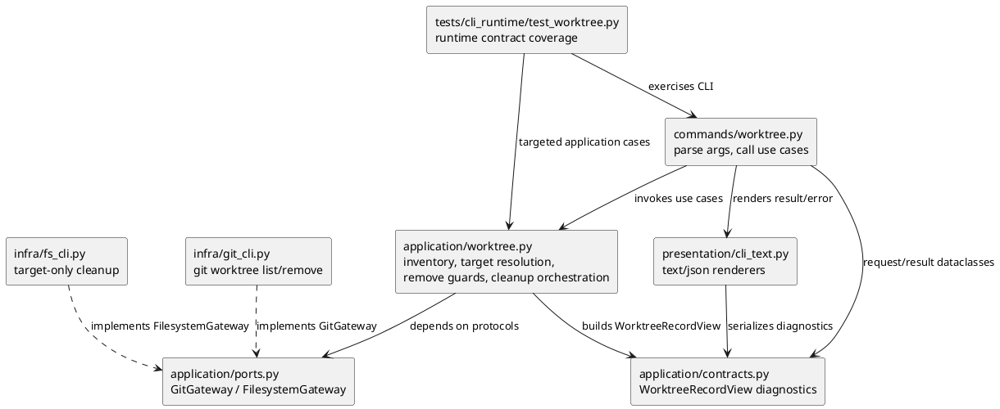
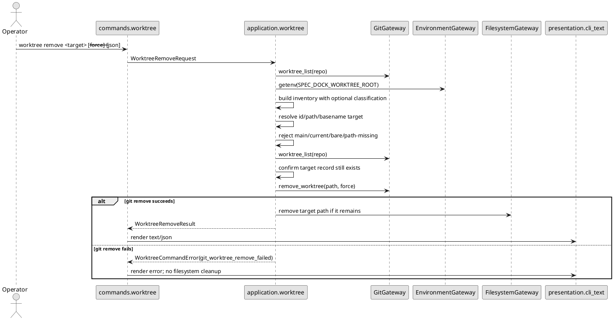

# iss-00143 Manage External Git Worktrees — 設計（どう実現するか）

## 親図（Diagram）参照

- Epic 図:
  - `epic-00107/design.md` の Worktree Create Runtime Components / Package Dependency を参照する。
- 再利用する決定:
  - `commands/worktree.py` は argparse と `CommandOutcome` のみを扱い、Git / filesystem mutation は application / infra layer に置く。
  - `application/worktree.py` は inventory、target resolution、remove guard、Git-first remove、post-remove cleanup を所有する。
  - `infra/git_cli.py` は Git CLI の薄い adapter に留める。
  - provider-side source of truth は `src/spec_dock/assets/spec_dock/...` とする。

## 目的・制約

- 目的:
  - `worktree list` / `show` / `remove` を Git worktree records 正本の all-linked-worktree command に拡張する。
  - `worktree create` の central root placement contract は維持する。
- 必須:
  - `list` / `show` / `remove` は `SPEC_DOCK_WORKTREE_ROOT` 未設定 / invalid でも Git worktree records に基づいて動作する。
  - `managed` は boolean のまま維持する。
  - SpecDock-created managed / external / classification unavailable を machine-readable に診断できる field を追加する。
  - external / unmanaged worktree は remove blocker にしない。
  - main / current / bare / stale record は `--force` でも remove しない。
  - Git remove 成功後の cleanup は resolved target path だけに限定する。
- 禁止:
  - branch deletion、`worktree prune` / repair、orphan directory cleanup。
  - Codex Desktop 固有 path / Handoff / environment setup / metadata detection。
  - command layer から Git / filesystem を直接呼ぶこと。

## 既存実装 / 規約の理解

- 参照した実装 / docs:
  - `src/spec_dock/assets/spec_dock/scripts/spec_dock_runtime/application/worktree.py`
  - `src/spec_dock/assets/spec_dock/scripts/spec_dock_runtime/application/contracts.py`
  - `src/spec_dock/assets/spec_dock/scripts/spec_dock_runtime/commands/worktree.py`
  - `src/spec_dock/assets/spec_dock/scripts/spec_dock_runtime/presentation/cli_text.py`
  - `src/spec_dock/assets/spec_dock/scripts/spec_dock_runtime/infra/git_cli.py`
  - `src/spec_dock/assets/spec_dock/scripts/spec_dock_runtime/infra/fs_cli.py`
  - `src/spec_dock/assets/spec_dock/docs/reference_worktree.md`
  - `tests/cli_runtime/test_worktree.py`
  - delegated draft `discussions/20260530t114245z-draft-design-external-worktree-management.md`
- 現状理解:
  - `_build_inventory()` は Git worktree records 全体を読むが、先に `SPEC_DOCK_WORKTREE_ROOT` を必須検証する。
  - `_remove_blockers()` / `_non_bypassable_remove_blockers()` / `_guard_remove_containment()` は `unmanaged` を remove blocker として扱う。
  - `worktree_remove()` は Git remove 成功後に `filesystem_gateway.remove_tree(worktree.path)` を呼ぶ。
  - JSON payload は `managed: bool`、`removable`、`remove_blockers` を持つが、classification availability / origin diagnostic を持たない。
- 採用するパターン:
  - CLI command は薄く保ち、application contract / use case / presentation を更新する。
  - Git remove の dirty / locked / untracked 判定は Git に任せ、失敗時は cleanup しない。
- 採用しないもの:
  - Codex Desktop 固有 detection。
  - `managed` nullable 化。
  - `unmanaged` を safety blocker として残す設計。

## 採用方針 / トレードオフ

- D-001: `list` / `show` / `remove` の source of truth は Git worktree records とする。
  - `SPEC_DOCK_WORKTREE_ROOT` は create では必須、inventory / remove では classification diagnostic のための optional context とする。
- D-002: `managed` は boolean のまま維持し、追加 field で分類状態を表す。
  - `managed_classification_available: bool`
  - `classification_reason: "root_valid" | "root_missing" | "root_blank" | "root_invalid" | "namespace_symlink"`
  - `origin: "spec_dock_managed" | "external" | "classification_unavailable"`
- D-003: remove の hard blocker から `unmanaged` を外す。
  - hard blocker は `main_worktree`、`current_worktree`、`path_missing`、`record_missing`、`bare_worktree` とする。
  - `locked` は Git force semantics に任せるため planning diagnostic としては残してよいが、`--force` で bypass 可能な Git-level condition として扱う。
- D-004: post-remove cleanup は Git-first / target-only とする。
  - Git remove が成功した後だけ filesystem cleanup を実行する。
  - cleanup は Git record から解決した original target path のみを対象にし、parent directory、central root、namespace directory は削除しない。
  - filesystem port は target-only cleanup を明示する `remove_target(path)` 相当へ拡張する。
  - directory は tree を削除し、symlink は追跡せず symlink 自体を unlink し、regular file は file 自体を unlink する。
  - unsupported file type、`lstat` / `unlink` / `rmtree` failure、race は `post_remove_cleanup_failed` として fail-closed する。
- D-005: invalid root は list/show/remove の fatal error にしない。
  - invalid root は classification unavailable diagnostic として返す。
  - root invalid の詳細は result warning または text diagnostic に含めてよい。

## 依存関係分析

- module 依存:
  - `commands.worktree` -> `application.contracts` / `presentation.cli_text`
  - `application.worktree` -> `application.contracts` / `application.ports`
  - `presentation.cli_text` -> `application.contracts`
  - `infra.git_cli` / `infra.fs_cli` -> ports implementation
- file 依存:
  - `application/contracts.py` の `WorktreeRecordView` 拡張が `application/worktree.py` と `presentation/cli_text.py` に先行する。
  - `application/worktree.py` の optional classification と remove guard 変更が command behavior の中心。
  - `presentation/cli_text.py` は expanded result model に従って JSON/text を更新する。
  - docs/tests は runtime contract 更新後に合わせる。
- 実装起点:
  - まず contract / model を固定し、次に inventory classification、remove guard / cleanup、presentation、tests/docs の順で閉じる。
- 順序への影響:
  - plan では contract/model -> application behavior -> presentation/CLI/docs -> final QA の順に step を組む。

## モジュール依存図（Module Dependency Diagram）

- タイトル:
  - External Worktree Management Dependency Delta
- 答える問い:
  - root optional inventory と external remove をどの layer に置き、どこから実装を始めるか。
- 範囲:
  - `worktree list` / `show` / `remove` の result model、application use case、presentation、infra cleanup。
- 含めない詳細:
  - 全 CLI parser option、Git subprocess stderr、test helper implementation。
- 更新条件:
  - classification field、remove guard、cleanup boundary、layer dependency が変わるとき。



## ローカル図の差分

- 変更する境界 / 責務 / 相互作用:
  - root validation を create-only required path と list/show/remove optional classification path に分ける。
  - remove safety は managed namespace containment ではなく、Git record target identity + main/current/bare/stale blockers + target-only cleanup に移す。

## インターフェース契約

- `WorktreeRecordView` に追加する field:
  - `managed_classification_available: bool`
  - `classification_reason: str`
  - `origin: str`
- `managed` の意味:
  - valid root があり、target path が `$SPEC_DOCK_WORKTREE_ROOT/<repo-basename>/` namespace 配下の individual worktree なら `true`。
  - root missing / blank / invalid / namespace symlink で分類できない場合は `false`。
  - external linked worktree は `false`。
- `origin`:
  - `spec_dock_managed`: valid root により SpecDock-created placement と判定できる。
  - `external`: valid root があり、SpecDock-created placement 外の linked worktree。
  - `classification_unavailable`: root がなく managed placement を判定できない。
- `remove_blockers`:
  - `unmanaged` は削除 blocker から削除する。
  - `main_worktree`、`current_worktree`、`path_missing`、`record_missing`、`bare_worktree` は non-bypassable。
  - `locked` は inventory diagnostic として残る場合があるが、Git `--force` の結果に従う。
- `WorktreeRemoveResult`:
  - `removed_record=true` は Git remove が成功したことを示す。
  - `removed_directory=true` は target path が存在しない状態になったことを示す。
  - `branch_deleted=false` は維持する。

## シーケンス差分

- 変更する相互作用:
  - `list` / `show` / `remove` の inventory 構築時に root resolution failure を fatal にしない。
  - `remove` は target 解決後、Git records を再読込して record existence を確認してから Git remove する。



## ドメインモデル差分

- aggregate / entity / value object 変更:
  - SpecDock persistence domain entity は追加しない。
  - `WorktreeRecordView` を Git worktree record の view model として拡張する。
- 不変条件の変更:
  - `unmanaged` は remove blocker ではなくなる。
  - main/current/bare/stale record は remove blocker のまま維持する。
  - branch deletion は引き続き行わない。

## クラス / インターフェース詳細設計

- `application.worktree._build_inventory`:
  - Git records を先に取得する。
  - main record から repo basename を決める。
  - optional classification context を作る。
  - stable id 生成と duplicate suffix は既存方針を維持する。
- optional classification context:
  - root missing: `available=false`, `reason=root_missing`
  - root blank: `available=false`, `reason=root_blank`
  - root invalid: `available=false`, `reason=root_invalid`
  - namespace symlink: `available=false`, `reason=namespace_symlink`
  - root valid: namespace path を使って `managed` / `external` を分類する。
- `application.worktree._guard_remove_containment` / target cleanup:
  - `not worktree.managed` による拒否を削除する。
  - target path が repo_root / main path と一致しないことを確認する。
  - target が Git record として再確認されていることを前提に、cleanup path は original resolved path のみに限定する。
  - parent path containment は cleanup 範囲の根拠にせず、Git record target identity と main/current/bare/stale blocker を安全境界にする。
  - cleanup は `FilesystemGateway.remove_target(path)` 相当を呼び、parent directory、central root、namespace directory は削除対象にしない。
  - broken symlink も target cleanup の対象にできるよう、existence 判定は `Path.exists()` だけに依存しない。
- `infra.fs_cli`:
  - `remove_target(path)` 相当を実装する。
  - `path.is_symlink()` は `unlink()` し、symlink target は追跡しない。
  - directory は `shutil.rmtree(path)`、regular file は `unlink()` する。
  - broken symlink も cleanup 対象として扱えるよう、existence 判定は `Path.exists()` だけに依存しない。
  - unsupported file type、permission error、race は application に `post_remove_cleanup_failed` として伝播できる error にする。

## ディレクトリ / ファイル変更計画

```text
src/spec_dock/assets/spec_dock/scripts/spec_dock_runtime/
|-- application/
|   |-- contracts.py      # 変更: WorktreeRecordView に classification diagnostics を追加
|   |-- worktree.py       # 変更: root optional inventory、external remove、target-only cleanup guard
|   `-- ports.py          # 変更: filesystem cleanup protocol を target-only に拡張
|-- commands/
|   `-- worktree.py       # 変更: managed-only remove を示す文言があれば更新
|-- cli/
|   `-- parser.py         # 変更: remove/list/show help の managed-only/root-required 文言があれば更新
|-- infra/
|   |-- fs_cli.py         # 変更: symlink non-following target cleanup
|   `-- git_cli.py        # 原則 read-only / Git adapter contract は維持
`-- presentation/
    `-- cli_text.py       # 変更: JSON/text に classification diagnostics を追加

src/spec_dock/assets/spec_dock/docs/
`-- reference_worktree.md # 変更: root optional list/show/remove、external remove、Codex non-scope

spec-dock/docs/
`-- reference_worktree.md # dogfooding parity 反映または検査

tests/cli_runtime/
`-- test_worktree.py      # 変更: root optional、external remove、safety regression tests
```

## 要件 → 設計マッピング

- AC-001 -> Git records 正本の `_build_inventory`、classification diagnostics、JSON renderer。
- AC-002 -> optional classification context、root missing / invalid を fatal にしない error policy。
- AC-003 -> `worktree_create` は既存 `_resolve_worktree_root` 必須 path を維持。
- AC-004 -> `unmanaged` blocker removal、Git-first remove、target-only filesystem cleanup。
- AC-005 -> non-bypassable blockers と pre-remove record refresh。
- AC-006 -> `managed` boolean 維持 + `managed_classification_available` / `classification_reason` / `origin`。
- AC-007 -> provider docs / dogfooding docs / validation step。
- EC-001 -> existing target resolver ambiguity error を維持。
- EC-002 -> branch-only target rejection を維持。
- EC-003 -> Git remove failure path では cleanup しない。
- EC-004 -> invalid root diagnostic。
- EC-005 -> symlink / containment guard。

## テスト戦略

- 単体 / application-level:
  - root missing / blank / invalid / valid の classification context。
  - `unmanaged` が remove blocker に入らないこと。
  - main/current/bare/path_missing/record_missing が non-bypassable blocker であること。
  - symlink cleanup が follow されず、symlink 自体だけ unlink されること。
- CLI/runtime:
  - `SPEC_DOCK_WORKTREE_ROOT` なしで `list --json` / `show --json` / `remove --json` が成功する。
  - valid root がある場合に managed / external を区別する。
  - invalid root が availability error ではなく classification diagnostic になる。
  - external linked worktree の remove が Git record を削除し、remaining directory を cleanup し、branch を残す。
  - create は root missing / invalid で従来通り fail-fast する。
  - ambiguous target / branch target / Git remove failure / main-current-bare-stale refusal を維持する。
- docs / parity:
  - provider-side `reference_worktree.md` と dogfooding `spec-dock/docs/reference_worktree.md` が新 contract を説明する。
  - Codex Desktop は背景であり、Codex-specific lifecycle を実装しないことを明記する。

## 要件 / 例外 -> 検証マッピング

- AC-001, AC-006 -> JSON payload assertion for all records and diagnostics。
- AC-002, EC-004 -> root missing / invalid runtime tests。
- AC-003 -> existing create root-required regression。
- AC-004 -> external remove runtime test。
- AC-005 -> main/current/bare/stale refusal tests。
- EC-001, EC-002 -> target resolver regression tests。
- EC-003 -> Git remove failure prevents filesystem cleanup。
- EC-005 -> symlink / file / directory の target-only cleanup test。

## リスク / 移行 / ロールバック

- リスク:
  - central root 外の path cleanup は破壊範囲が広がる。
  - `managed=false` が external と classification unavailable の両方を表すため、diagnostic field を見ない consumer が誤読する可能性がある。
  - invalid root を warning/diagnostic にすることで、root 設定ミスに気づきにくくなる。
- 緩和:
  - Git record source of truth、pre-remove record refresh、main/current/bare/stale blockers、target-only cleanup、symlink non-following behavior、unsupported target type の fail-closed。
  - `managed_classification_available` / `classification_reason` / `origin` を必ず JSON に含める。
- 移行:
  - persisted SpecDock state migration は不要。
  - JSON は additive field 追加で、`managed` boolean を維持する。
- ロールバック:
  - runtime / docs / tests を revert すれば command contract は従来に戻る。
  - remove 済み worktree / filesystem cleanup は Git/filesystem mutation なのでコード rollback では復元されない。

## 未確定事項

- なし。
  - requirement の Q-001 / Q-002 は本設計で field 名と containment 方針を固定した。
