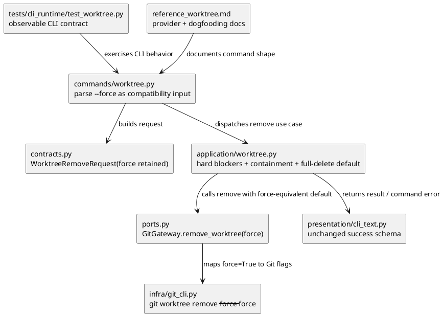

# iss-00153 Default Full Delete For Worktree Remove — 設計（どう実現するか）

## 親図（Diagram）参照
- Epic 図:
  - `epic-00107` の worktree command 設計は、CLI / application / infra / presentation の layered runtime architecture を前提にする。
- 再利用する決定:
  - `worktree remove` は Git worktree records を正本にし、target resolution、hard blocker、containment guard を application layer が所有する。
  - `unmanaged` は remove blocker ではなく classification diagnostic とする。
  - branch deletion は行わず、成功結果の `branch_deleted=false` を維持する。
  - Git remove 成功後だけ resolved target path の target-only filesystem cleanup を行う。
- Issue-local delta:
  - 現行 Epic baseline の「default remove は Git normal remove、`--force` で Git force remove」を、この issue で「eligible target は default で full delete、`--force` は互換入力」に変更する。

## 目的・制約
- 目的:
  - `worktree remove <target>` を、hard blocker がない linked worktree に対して option なしで full delete する command contract にする。
  - 既存 script / agent 手順の `--force` 指定は壊さず、default と同じ成功・失敗契約に丸める。
- 必須:
  - untracked residue と tracked modification の両方を default remove で削除できる。
  - main / current / bare / missing path / record missing / containment guard は default full delete でも bypass しない。
  - success output schema は維持し、`removed_record=true`、`removed_directory=true`、`branch_deleted=false` を返す。
- 禁止:
  - branch deletion、orphan cleanup、`worktree prune`、`repair`、Codex-managed worktree lifecycle cleanup を追加しない。
  - filesystem-first deletion へ変更しない。
  - parent directory、central root、namespace directory、repo root へ cleanup 範囲を広げない。
- 非交渉制約:
  - Provider-side source of truth は `src/spec_dock/assets/spec_dock/...`。
  - Dogfooding docs は provider docs 更新後の parity inspection / refresh 対象。
  - Runtime tests は temp Git repo / temp worktree root を使い、live checkout に worktree を作らない。

## 既存実装 / 規約の理解
- 参照した実装 / docs:
  - `src/spec_dock/assets/spec_dock/scripts/spec_dock_runtime/commands/worktree.py`
  - `src/spec_dock/assets/spec_dock/scripts/spec_dock_runtime/application/worktree.py`
  - `src/spec_dock/assets/spec_dock/scripts/spec_dock_runtime/infra/git_cli.py`
  - `src/spec_dock/assets/spec_dock/scripts/spec_dock_runtime/application/contracts.py`
  - `src/spec_dock/assets/spec_dock/scripts/spec_dock_runtime/application/ports.py`
  - `src/spec_dock/assets/spec_dock/scripts/spec_dock_runtime/presentation/cli_text.py`
  - `tests/cli_runtime/test_worktree.py`
  - `spec-dock/docs/reference_worktree.md`
- 現状理解:
  - `commands.worktree` は `--force` を `WorktreeRemoveRequest(force=...)` に渡す。
  - `application.worktree.worktree_remove` は target 解決、non-bypassable blocker、record refresh、containment guard を通した後に `ports.git_gateway.remove_worktree(..., force=req.force)` を呼ぶ。
  - `infra.git_cli.remove_worktree` は `force=True` のときだけ `git worktree remove --force --force <path>` を実行する。
  - 現行 test は `test_worktree_remove_dirty_default_fails_and_force_removes_directory` で default failure と `--force` success を characterization している。
- 採用するパターン:
  - target resolution / blocker / containment / cleanup の責務は application layer に維持する。
  - Git flag depth は infra adapter の内部詳細として維持し、call site は既存 `force=True` contract を使う。
  - CLI output schema と JSON schema は変更しない。
- 採用しないもの:
  - `WorktreeRemoveRequest` の大規模 rename や enum 化。
  - `remove_worktree_force` など新しい GitGateway API。
  - `--keep-untracked` / `--preserve-untracked` の追加。

## 採用方針 / トレードオフ
- 論点:
  - full delete を default にする一方で、既存 `--force` option をどう扱うか。
- 決定:
  - User interview で採用された Option B に従い、`--force` は互換入力として受け付ける。
  - Application use case は、hard blocker と containment guard を通過した target に対して、request flag に関係なく Git force removal 相当を使う。
  - `WorktreeRemoveRequest.force` は当面残すが、削除強度選択ではなく compatibility input として扱う。
- 理由:
  - 最小変更で requirement を満たし、既存 script の `--force` invocation を壊さない。
  - hard blocker と target-only cleanup は既存 application guard のまま維持できる。
- tradeoff:
  - 内部 field 名 `force` は新 contract 上やや古い意味を持つが、issue-local change で rename すると不要な blast radius が増える。将来の deprecation / rename は別 issue で扱う。

## 依存関係分析
- module 依存:
  - `commands.worktree` -> `application.contracts.WorktreeRemoveRequest`
  - `commands.worktree` -> `application.worktree.worktree_remove`
  - `application.worktree` -> `Ports.git_gateway.remove_worktree`
  - `infra.git_cli` -> Git CLI
  - `presentation.cli_text` -> `WorktreeRemoveResult`
- file 依存:
  - `tests/cli_runtime/test_worktree.py` が public CLI behavior を固定する。
  - `src/spec_dock/assets/spec_dock/docs/reference_worktree.md` が shipped docs の正本。
  - `spec-dock/docs/reference_worktree.md` が dogfooding parity 対象。
- 上流 / 前提:
  - Requirement reviewer pass 済み `requirement.md`。
  - Option B を採用済みの interview artifact。
- 下流 / 依存先:
  - plan は runtime behavior test -> application call change -> CLI help / docs refresh -> final gate の順に組む。
- 実装起点:
  - 既存 dirty/untracked default-fails test を red target として更新する。
  - tracked modification の default full delete test を追加する。
- 順序への影響:
  - 先に tests で default full delete contract を固定し、次に `application.worktree` の Git remove call を force-equivalent default にする。
  - docs/help は runtime behavior が固定された後に更新する。

## モジュール依存図（Module Dependency Diagram）
- タイトル:
  - Worktree remove default full delete dependency delta
- 答える問い:
  - どの layer が削除強度 default を所有し、どこは既存 contract を維持するか。
- 範囲:
  - `worktree remove` の CLI -> application -> infra -> presentation / docs / tests。
- 含めない詳細:
  - 全 method、全 error renderer、Git porcelain parser、create/list/show の詳細。
- 更新条件:
  - request model、GitGateway protocol、hard blocker ownership、output schema、docs source of truth が変わるとき。

### 図表（UML / モジュール依存差分）


## ローカル図の差分（Local Diagram Delta / 必要時）
- 変更する境界 / 責務 / 相互作用:
  - Sequence 図は不要。変更点は単一 application call の default 引数と docs/tests contract に閉じる。

## インターフェース契約
- CLI:
  - Accepted shape remains `spec-dock worktree remove <target> [--force] [--json]`.
  - `--force` は互換入力であり、full delete を有効にする必須 option ではない。
  - help text は「Git force removal を渡す」ではなく、「互換のため受け付ける。remove は eligible target を default で full delete する」趣旨に更新する。
- Application:
  - `WorktreeRemoveRequest.force` は parser 互換の値として保持してよい。
  - `worktree_remove` は hard blocker / refreshed record / containment guard を通過した後、request flag に関係なく Git force removal 相当を呼ぶ。
  - `WorktreeCommandError` の code と schema は変更しない。
- Infra:
  - `GitGateway.remove_worktree(repo_root, path, force)` の signature は変更しない。
  - `force=True` は引き続き `git worktree remove --force --force <path>` に対応する。
- Presentation:
  - Success text / JSON fields は変更しない。
  - Error text / JSON fields は変更しない。

## シーケンス差分（Sequence Delta / 必要時）
- 変更する相互作用:
  - Application -> GitGateway の `force` 値だけが変わる。
- UML:
  - N/A: Module dependency diagram と interface contract で十分に表現でき、複数 component の retry / transaction / external API flow はない。

## ドメインモデル差分（Domain Model Delta / 必要時）
- aggregate / entity / value object 変更:
  - N/A: Worktree inventory / record view の domain model は変更しない。
- domain event / policy / specification 変更:
  - Remove policy の default strength だけを issue-local に変更する。
- 不変条件の変更:
  - hard blocker と branch retention は不変。
  - default remove は eligible target を full delete する。
- UML:
  - N/A: domain model 変更ではなく CLI runtime contract delta。

## クラス / インターフェース詳細設計（必要時）
- Class / Interface:
  - `WorktreeRemoveRequest`
  - `GitGateway.remove_worktree`
- 責務:
  - `WorktreeRemoveRequest.force` は互換入力を保持するが、use case の削除強度を弱めない。
  - `GitGateway.remove_worktree` は既存通り Git flag mapping を持つ。
- UML:
  - N/A: signature 変更を伴わないため文章契約で足りる。

## ディレクトリ / ファイル変更計画
```text
src/spec_dock/assets/spec_dock/scripts/spec_dock_runtime/
|-- commands/
|   `-- worktree.py          # 変更: --force help text を compatibility wording に更新
|-- application/
|   |-- worktree.py          # 変更: eligible remove は request flag に関係なく Git force removal 相当を呼ぶ
|   |-- contracts.py         # 原則変更なし: force field は互換入力として維持
|   `-- ports.py             # 原則変更なし: GitGateway signature 維持
|-- infra/
|   `-- git_cli.py           # 原則変更なし: force=True -> --force --force mapping 維持
`-- presentation/
    `-- cli_text.py          # 原則変更なし: output schema 維持

src/spec_dock/assets/spec_dock/docs/
`-- reference_worktree.md    # 変更: default full delete と --force compatibility を記述

spec-dock/docs/
`-- reference_worktree.md    # dogfooding parity refresh / inspection

tests/cli_runtime/
`-- test_worktree.py         # 変更: untracked / tracked modification default success、--force compatibility、hard blockers を確認
```

## 要件 → 設計マッピング
- AC-001:
  - `application.worktree` が untracked residue を含む eligible target でも force-equivalent Git remove を呼ぶ。
  - Runtime test で Git record removal、target path removal、branch retention、JSON fields を確認する。
- AC-002:
  - tracked modification でも AC-001 と同じ default success contract を確認する。
- AC-003:
  - `commands.worktree` は `--force` parser support を残し、application は default と同じ remove contract を満たす。
- AC-004:
  - `_non_bypassable_remove_blockers`、record refresh、containment guard は Git remove call より前に維持する。
- AC-005:
  - Provider docs、dogfooding docs、CLI help を full delete default / `--force` compatibility に更新する。
- EC-001:
  - Git が force-equivalent removal を拒否した場合は既存 `git_worktree_remove_failed` を返し、filesystem cleanup をしない。
- EC-002:
  - Post-remove target cleanup failure は既存 `post_remove_cleanup_failed` と `removed_record=true` / `removed_directory=false` を維持する。
- EC-003:
  - Unmanaged linked worktree は diagnostic のまま削除可能にし、default full delete contract を適用する。

## テスト戦略
- Runtime / CLI:
  - Existing dirty/untracked test を「default fails」から「default succeeds」に更新する。
  - tracked modification を含む linked worktree の default success test を追加する。
  - `--force` 指定 remove が互換入力として default と同じ成功 contract を満たすことを確認する。
  - hard blocker tests は `--force` 指定あり / なしのどちらでも bypass されないことを維持する。
  - unmanaged remove の default path が blocker にならないことを確認する。
- Docs / help:
  - CLI help に `--force` compatibility wording があることを assertion または inspection で確認する。
  - Provider docs と dogfooding docs が同じ command contract を示すことを inspection する。
- Regression:
  - `python -m unittest tests.cli_runtime.test_worktree.TestCliWorktree -v` を focused verification とする。
  - 最終 gate では `python -m unittest discover -v` または issue-wide affected tests を検討する。
- Manual:
  - live checkout を対象にした manual worktree deletion は不要。temp repo tests で閉じる。

## 要件 / 例外 -> 検証マッピング
- AC-001 -> runtime test: untracked residue default remove success。
- AC-002 -> runtime test: tracked modification default remove success。
- AC-003 -> runtime test: `--force` compatibility success。
- AC-004 -> existing / updated hard blocker runtime tests。
- AC-005 -> docs/help inspection or assertion。
- EC-001 -> locked worktree guarded test or Git refusal path assertion。
- EC-002 -> existing cleanup failure tests。
- EC-003 -> unmanaged remove default behavior test。

## リスク / 移行 / ロールバック
- リスク:
  - default remove が destructive になるため、docs / help に新 default を明確に書かないと operator が旧挙動と誤認する。
  - Git version により locked worktree の force behavior が異なる可能性がある。
  - 内部 `force` field 名が compatibility input として残るため、将来の実装者が再び削除強度選択として解釈するリスクがある。
- 移行:
  - persisted SpecDock state migration は不要。
  - Existing `worktree remove <target> --force` invocation は互換維持。
  - Existing `worktree remove <target>` invocation は dirty / untracked eligible target を削除するようになるため、docs で contract change を明示する。
- ロールバック:
  - `application.worktree` の Git remove call を request-selected force に戻す。
  - tests / docs / help wording を旧 contract に戻す。
  - rollback 前に削除済みの local worktree は SpecDock では自動復元しない。

## 未確定事項
- なし。
