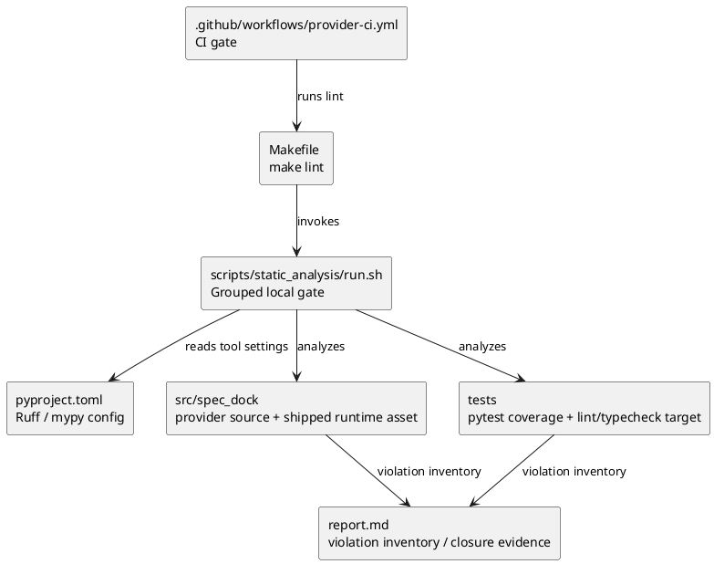

# iss-00225 Configure Ruff And Mypy Static Analysis Cleanup — 設計

## 親図参照
- Epic 図:
  - 本 issue は `epic-00107` 配下にあるが、変更対象は worktree provisioning そのものではなく repository quality gate である。
- Initiative 図:
  - `init-local-00002` の dogfooding / workflow expansion の一部として、SpecDock repository 自体の開発品質を上げる。
- 再利用する決定:
  - provider source of truth は `src/spec_dock/`。
  - dogfooding workspace `spec-dock/` は generated consumer-side workspace であり、直接 implementation source として扱わない。
  - Option B target を採用する。
  - CI enforcement は今回 scope。
  - pre-commit implementation は今回 scope 外。

## 目的・制約
- 目的:
  - Ruff / mypy の設定、実行導線、CI gate、既存違反解消を一つの green baseline として成立させる。
  - 初回導入の修正を小さな rule step に分割し、review 可能な差分へ保つ。
- 必須:
  - `pyproject.toml` に最終目標設定を集約する。
  - `scripts/static_analysis/run.sh` と `Makefile` `lint` target を追加する。
  - `.github/workflows/provider-ci.yml` で static analysis を実行する。
  - 最終的に違反 0 件にする。
- 禁止:
  - dogfooding `spec-dock/` を直接 Ruff / mypy target にしない。
  - broad suppression で error を隠さない。
  - pre-commit を実装しない。
- 前提:
  - Python target は `py310` / `3.10`。
  - reference project の設定は思想として採用し、SpecDock 固有の構成に翻訳する。

## 既存実装 / 規約の理解
- 参照した実装 / docs:
  - `pyproject.toml`
  - `.github/workflows/provider-ci.yml`
  - `.github/workflows/ci.yml`
  - `AGENTS.md`
  - `src/spec_dock/`
  - `tests/`
  - issue `discussions/*.md`
- 現状理解:
  - Runtime architecture は `cli`, `commands`, `application`, `domain`, `infra`, `presentation` の layered structure。
  - `src/spec_dock/assets/spec_dock/scripts/spec_dock_runtime/` は consumer repo にコピーされる shipped runtime asset で、provider 側で lint/typecheck する必要がある。
  - `spec-dock/` は同じような Python runtime copy を含むが、直接 target にすると generated/source-of-truth の境界が曖昧になる。
- 採用するパターン:
  - `pyproject.toml` central config。
  - `make lint` から grouped script を呼ぶ local one-command gate。
  - CI は local gate と同じ entrypoint を呼ぶ。
  - 各 rule step の output は `report.md` に要約して残す。
- 採用しないもの:
  - reference project 固有の FastAPI / SQLAlchemy / Alembic / Celery / import-linter 設定。
  - pre-commit hook。
  - public docstring rule。
  - SpecDock layer-specific `banned-api` policy。今回の `TID` adoption は tidy imports / relative import discipline に限定し、layer boundary rule は別途設計が必要な future scope とする。

## 採用方針 / トレードオフ
- 論点:
  - 一括で最終設定を入れて大量違反をまとめて直すか、rule を小刻みに追加して直すか。
- 決定:
  - 段階的 rule adoption を採用する。
- 理由:
  - SpecDock の issue execution では 1 step / 1 review scope / 1 closure evidence が重要であり、一括導入は違反種別と修正意図が混ざる。
  - 小刻みな rule step により、各違反の分類、修正、0 件化、review が明確になる。
- formatter の扱い:
  - Ruff format は semantic/type fixes から切り離し、後半の独立 step とする。

## Static Analysis Target Design
- 論理 coverage:
  - `src/spec_dock/**/*.py`
  - `tests/**/*.py`
  - `src/spec_dock/assets/spec_dock/scripts/spec_dock_runtime/**/*.py`
- command target:
  - `src/spec_dock`
  - `tests`
- 補足:
  - shipped runtime asset は `src/spec_dock` 配下に含まれるため、command target は重複指定しない。
  - `report.md` では shipped runtime asset が coverage に含まれていることを明示する。
  - `spec-dock/` は `exclude` と command target の双方で直接対象外にする。

## Final Pyproject Configuration Design

### Dev dependencies
- `ruff`: lint / import sort / formatter。
- `mypy`: typecheck。
- `typing-extensions`: 実装時に必要性を再確認し、Python 3.10 で typing helper が必要な場合のみ追加する。

### Ruff global settings
- `target-version = "py310"`
- `line-length = 120`
- `indent-width = 4`
- `preview = true`
- `exclude`:
  - `build/`
  - `dist/`
  - `*.egg-info/`
  - `.git/`
  - `__pycache__/`
  - `.venv/`
  - `venv/`
  - `spec-dock/`

### Ruff lint final select
- `F`: Pyflakes。未定義名、未使用 import など明白な bug。
- `E`: pycodestyle errors。基礎的な Python style / syntax hygiene。
- `I`: import order。
- `UP`: Python 3.10+ 向け modernization。
- `B`: bugbear。
- `C4`: comprehensions。
- `SIM`: simplify。
- `PTH`: pathlib。
- `TC`: type-checking imports。
- `ARG`: unused arguments。
- `RUF`: Ruff-native rules。
- `TID`: tidy imports / import boundary。

### Ruff ignores
- `E501`: 行長は formatter と readability で扱う。
- `SIM108`: if-expression 強制を避ける。
- `RUF010`: explicit conversion を許容する。
- `RUF001`, `RUF002`, `RUF003`: 日本語 docs/comments による ambiguous unicode noise を避ける。

### Ruff sub-settings
- `flake8-unused-arguments.ignore-variadic-names = true`
- `isort.force-sort-within-sections = true`
- `isort.combine-as-imports = true`
- `flake8-tidy-imports.ban-relative-imports = "all"`
- `per-file-ignores`:
  - `tests/**/*`: `ARG`

### Ruff format
- `quote-style = "double"`
- `indent-style = "space"`
- `skip-magic-trailing-comma = false`
- `docstring-code-format = true`
- `line-ending = "auto"`

### Mypy final settings
- `python_version = "3.10"`
- `allow_redefinition = false`
- `check_untyped_defs = true`
- `color_output = true`
- `error_summary = true`
- `show_column_numbers = true`
- `show_error_context = true`
- `show_error_codes = true`
- `pretty = true`
- `ignore_missing_imports = true`
- `exclude`:
  - `^spec-dock/`
  - `^build/`
  - `^dist/`
  - `^\\.venv/`
- `[[tool.mypy.overrides]] module = "tests.*"`:
  - `check_untyped_defs = false`
  - `disallow_untyped_defs = false`

## Local Command Design
- 新規 file:
  - `scripts/static_analysis/run.sh`
- script behavior:
  - repository root から実行されることを前提にする。
  - `uv run ruff check src/spec_dock tests`
  - `uv run ruff format --check src/spec_dock tests`
  - `uv run mypy src/spec_dock tests`
  - 各 command の exit code を保持し、summary を表示する。
  - 1 command が失敗しても可能な限り後続 command を実行する。
  - いずれかが失敗した場合は最終 exit code を non-zero にする。
- Makefile:
  - root `Makefile` に `.PHONY: lint` を追加する。
  - `lint` は `./scripts/static_analysis/run.sh` を呼ぶ。
- staged implementation:
  - 実装中の rule 追加 step では、最終 script だけでなく個別 command `uv run ruff check --select <rule> src/spec_dock tests` も使う。
  - 最終状態の `make lint` は最終 rule set 全体を実行する。

## CI Design
- 対象 workflow:
  - `.github/workflows/provider-ci.yml`
- 変更方針:
  - dependency install 後、pytest と同じ dev environment で `make lint` を実行する。
  - CI と local の command surface を一致させる。
- 既存 `.github/workflows/ci.yml`:
  - `spec-dock sync` / `validate` gate は維持する。
  - 本 issue の primary static-analysis gate は provider CI に置く。

## 依存関係分析
- upstream:
  - dependency / config がないと Ruff / mypy command は成立しない。
  - target boundary が決まらないと違反 inventory の意味が定まらない。
- downstream:
  - CI は local command が成立してから wiring する。
  - final quality gate はすべての rule / mypy / format step の closure 後に実行する。
- 実装起点:
  - `pyproject.toml` dev dependency と最小 Ruff target。
  - `scripts/static_analysis/run.sh` / `Makefile` の skeleton。
- 順序への影響:
  - plan では `F` から始め、1 rule group ごとに 0 件化して進む。

## モジュール依存図


## インターフェース契約
- Command contract:
  - `make lint`
    - input: repository checkout with dev dependencies resolvable through `uv`
    - output: command summary and exit code
    - success: Ruff check, Ruff format check, mypy all pass
  - `./scripts/static_analysis/run.sh`
    - input: no arguments required for final gate
    - output: per-phase exit summary
    - failure: non-zero if any phase fails
- Config contract:
  - `pyproject.toml` is the source of Ruff / mypy settings.
- CI contract:
  - provider CI uses the same `make lint` entrypoint.

## ディレクトリ / ファイル変更計画
```text
.
|-- pyproject.toml                         # 変更: Ruff / mypy dev dependency and config
|-- Makefile                               # 追加: make lint entrypoint
|-- scripts/
|   `-- static_analysis/
|       `-- run.sh                         # 追加: grouped static-analysis script
|-- .github/
|   `-- workflows/
|       `-- provider-ci.yml                # 変更: run make lint in CI
|-- src/
|   `-- spec_dock/**/*.py                  # 変更: rule-by-rule violation fixes
|-- tests/**/*.py                          # 変更: rule-by-rule violation fixes
`-- spec-dock/
    `-- ...                                # 直接 Ruff/mypy target にはしない。validate/inspection 対象
```

## 要件 → 設計マッピング
- AC-001 -> Final Pyproject Configuration Design
- AC-002 -> Static Analysis Target Design
- AC-003 -> Local Command Design
- AC-004 -> CI Design
- AC-005 -> Final Ruff select / staged implementation
- AC-006 -> Mypy final settings
- AC-007 -> Ruff format design
- AC-008 -> Local Command Design / CI Design / final quality gate
- AC-009 -> Ruff ignores / Mypy settings / report evidence
- EC-001 -> staged rule adoption and violation inventory
- EC-002 -> plan amendment trigger
- EC-003 -> `ignore_missing_imports` and targeted override policy
- EC-004 -> command target design and `spec-dock/` exclusion
- EC-005 -> formatter isolation
- EC-006 -> Dogfooding Impact Design

## テスト戦略
- 単体 / 既存 regression:
  - `uv run pytest`
- 静的解析:
  - `uv run ruff check src/spec_dock tests`
  - `uv run ruff format --check src/spec_dock tests`
  - `uv run mypy src/spec_dock tests`
  - `make lint`
- SpecDock validation:
  - `./spec-dock/scripts/spec-dock validate`
- CI:
  - provider CI definition inspection and, when available, workflow result.
- Report evidence:
  - 各 step の violation inventory、修正 summary、0 件確認、command result を `report.md` に記録する。

## Dogfooding Impact Design
- 方針:
  - dogfooding `spec-dock/` copy は Ruff / mypy の direct target にしない。
  - ただし shipped runtime asset under `src/spec_dock/assets/spec_dock/scripts/spec_dock_runtime/` に差分が入った場合、consumer-visible generated copy への影響を無視しない。
- 実装時の確認:
  - shipped runtime asset 差分がある step では、`git diff --name-only` で対象差分を確認する。
  - 必要なら `spec-dock update .` 相当の refresh が必要かを判断する。
  - この issue の静的解析 command target は `src/spec_dock tests` のまま維持する。shipped runtime asset は第三の direct command target ではなく、`src/spec_dock` に含まれる logical coverage / report evidence として扱う。
  - refresh 実施/非実施の判断と理由を `report.md` に残す。
- final gate:
  - `./spec-dock/scripts/spec-dock validate` を実行する。
- shipped runtime asset または installed agent asset 変更がある場合は、dogfooding / installed-copy refresh/inspection evidence が `report.md` に存在することを final review 対象にする。

## リスク / 移行 / ロールバック
- リスク:
  - Ruff rule step が予想以上に大きくなる。
  - mypy が shipped runtime asset に対して package/path noise を出す。
  - format-only churn が review を難しくする。
- shipped runtime asset / installed agent asset 修正後に dogfooding generated copy / installed asset copy の stale risk を見落とす。
- 緩和:
  - rule を一つずつ有効化する。
  - format-only step を隔離する。
  - broad suppression は禁止し、必要な suppression は reason と scope を記録する。
- shipped runtime asset / installed agent asset 差分がある step では dogfooding / installed-copy impact inspection を必須にする。
- ロールバック:
  - 各 step は小さく commit できる単位にする。
  - 問題のある rule は plan amendment / follow-up 化を検討し、最終設定から外す場合は requirement/design へ戻す。

## 未確定事項
- Q-001:
  - 質問: なし。
  - 備考: 実装中に EC-002 の scope expansion が発生した場合のみ、人間判断を求める。
