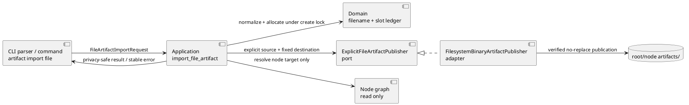
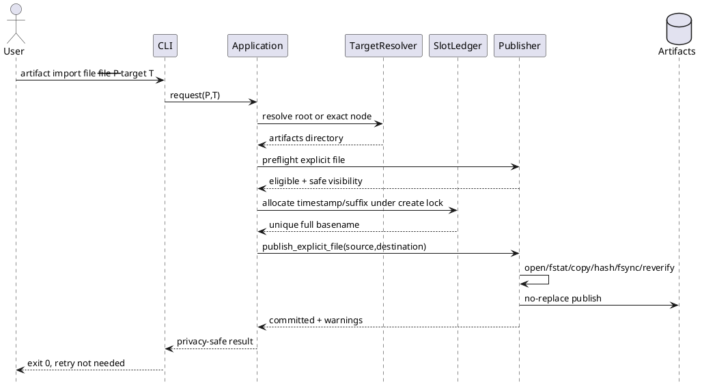
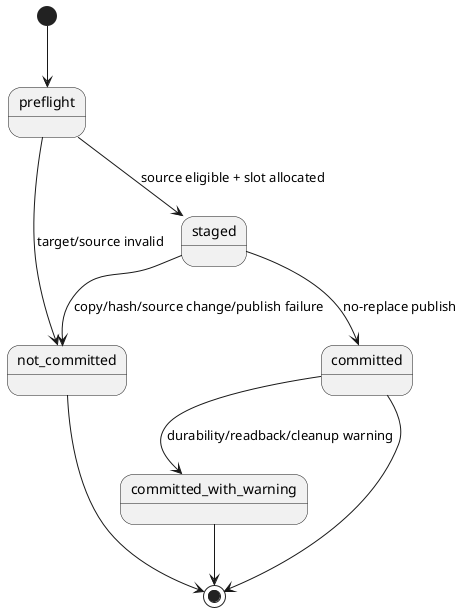

# epic-00343 Workbench Shell And Explicit File Artifact Import — 設計ドラフト証跡

> この文書は`system-architect`による委任設計ドラフトである。正本`design.md`のauthority、採用、phase promotion、reviewer pass、implementation readinessを主張しない。source requirement revisionはSHA-256 `068eda6ba36aadc93884ca8791a40c4f31998bcb47050014f07d0e623391e20c`である。

## 1. Requirement Coverage

| Requirement | 設計上の受け皿 |
|---|---|
| E-RQ-001〜007 | fresh init判定、node template marker、Git ignore rule、既存opaque traversal、manual-only `workbench copy` |
| E-RQ-008〜012 | 独立`artifact import file` command、root/node target resolver、repo-root relative resolution、explicit-file source guard |
| E-RQ-013〜018 | FD identity固定、既存byte-preserving publisher、global slot allocator、generic `--` filename、publication state、privacy mapper |
| E-RQ-019〜020 | no-sidecar/no-canonical mutation、name-only validation、ADR mirrorからのsemantic isolation |
| E-RQ-021〜025 | 既存`chatgpt-output`/`new artifact`/`workbench copy`非変更、provider/package/dogfood parity、public docs |
| E-AC-020 | unit / CLI / installed-consumer / fault-injection / full regressionの実測traceとblocking finding解消 |

主要なE-AC traceは次の通りである。

- E-AC-001〜007: installer fresh-state fixture、node create matrix、`git check-ignore`、no-backfill mutation matrix、opacity、manual copy regression。
- E-AC-008〜016: command/application/domain/infra/presentationのtarget/source/file-form/collision/publication/privacy matrix。
- E-AC-017〜020: validate/sync opacity、compatibility、candidate wheelのfresh/update consumer、dogfood parityとfull regression。

## 2. Existing Context Findings

### 2.1 現行Workbench境界

- `src/spec_dock/assets/spec_dock/.gitignore`は現在`.workbench/`全体をignoreするため、tracked shell markerを再包含できない。
- `src/spec_dock/cli.py::_install_spec_dock`はfresh initとupdateの双方から呼ばれ、`force`だけではfreshかexistingかを表せない。関数冒頭でwrite前の`specdock_dir`存在を観測しなければno-backfillを守れない。
- future Initiative / Epic / Issueは`application/create_node.py::execute_create_plan`からkind別template treeをcopyする。`_scaffold_file_paths`と`infra/template_scaffolder.py::copy_scaffolded_tree`はhidden fileも通常fileとして扱うため、各node templateへの`.workbench/.gitkeep`追加だけでplanned pathと実fileを一致させられる。
- `.workbench`のsemantic opacityは`infra/fs_repo.py`、`application/delegated_authoring.py`、`application/delete_node.py`、authoring source manifestなどでtop-down prune済みである。本Epicはこの境界を緩めない。
- `application/workbench.py::workbench_copy`と`infra/fs_cli.py::copy_workbench`はexplicit one-shot source-wins helperとして存在する。自動hookや同期を追加する必要はない。

### 2.2 現行Artifact import / naming境界

- `commands/artifact_import.py`と`application/import_artifact.py::import_artifact`は`chatgpt-output`専用で、node scope、Workbench内lowercase `.md`、title/slug、blank identityを要求する。
- `infra/binary_artifact_publisher.py::FilesystemBinaryArtifactPublisher`はsource FD identity、stream/staged/source hash、same-directory temp、fsync、no-replace publication、post-publish warningを既に提供する。再実装すべきではない。
- 現行`guard_source`はWorkbench containment、lowercase `.md`、non-symlink ancestryを一体化しており、repository外sourceとancestor symlink許容にはそのまま使えない。
- `domain/artifacts.py`はtyped/blank Markdownだけをparseし、`scan_artifact_duplicate_state`とallocatorは`*.md`だけを見る。generic file familyを別parserで認識し、timestamp/suffix slotだけを共有する必要がある。
- `application/sync_state.py::_collect_adr_mirror_sources`はArtifact basenameがtyped ADRと判定された後だけbodyを読む。generic `--` familyをtyped parserへ混ぜなければ、original basenameが`adr-*.md`でもsemantic parseを回避できる。
- rootはgraph nodeではなく、現在`spec-dock/artifacts/`もroot用rules sourceもない。root targetはnode resolverへ擬似nodeを混ぜず、明示的なroot targetとして扱う必要がある。

## 3. Design Decisions

### D-001 Fresh-only shell generation

`_install_spec_dock`の最初に`fresh_specdock = not os.path.lexists(specdock_dir)`を固定し、managed asset copy後、`fresh_specdock`のときだけ`spec-dock/.workbench/.gitkeep`を作る。`update`、existing workspaceへの`init --force`、通常runtime commandからこの処理を呼ばない。

Initiative / Epic / Issueは、次のprovider templatesへempty `.workbench/.gitkeep`を追加する。

- `src/spec_dock/assets/spec_dock/templates/initiative/.workbench/.gitkeep`
- `src/spec_dock/assets/spec_dock/templates/epic/.workbench/.gitkeep`
- `src/spec_dock/assets/spec_dock/templates/issue/.workbench/.gitkeep`

これによりnew nodeのcreate plan、collision preflight、result pathsがmarkerを自然に含む。既存ancestor/siblingを走査してmarkerを補う処理は作らない。

### D-002 Tracked marker / ignored contents

provider `.gitignore`と`src/spec_dock/cli.py::_DEFAULT_SPEC_DOCK_GITIGNORE`の`.workbench/`を次へ置換する。

```gitignore
**/.workbench/*
!**/.workbench/.gitkeep
```

Workbench directory自体をignoreせず、その直下entryをignoreすることで、top-level `.gitkeep`だけを再包含する。ignored child directoryはそのsubtree全体をignoreする。near-name `.workbench-notes`等は一致しない。updateはignore contractだけを配布し、既存scopeへmarkerを作らない。

### D-003 Generic import is an additive use case

既存`ArtifactImportRequest` / `import_artifact` / `artifact import chatgpt-output`は変更せず、次を追加する。

- `commands/artifact_import.py::ArtifactImportFileArgs`
- `application/contracts.py::FileArtifactImportRequest`
- `application/contracts.py::FileArtifactImportResult`
- `application/contracts.py::FileArtifactImportError`
- `application/import_file_artifact.py::import_file_artifact`
- `UseCases.import_file_artifact`
- parser leaf `artifact import file`

`FileArtifactImportRequest`は`source_path`と`ArtifactTargetSelector`だけを持ち、title、slug、kind catalogを持たない。

### D-004 Target resolver keeps root outside the node graph

`ArtifactTargetSelector`を次のclosed contractとする。

```text
kind: root | initiative | epic | issue
node_id: null for root; full/normalized id for node
```

- `root`は`specdock_dir / "artifacts"`、public target idは`root`。
- nodeはcurrent graphを`validate=False`でloadし、kindとidの一致をexactly oneへ解決する。
- zero/multiple selectorはargparseのrequired mutually-exclusive groupで拒否し、applicationでも再検証する。
- root `artifacts/`初回作成時は`docs/rules/root/artifacts.md`を`rules.md`へsymlinkする。node側は既存`_ensure_artifacts_setup`を再利用し、共通helperはtarget kindとdestinationだけを受ける。

### D-005 Explicit source guard and publication reuse

`FilesystemBinaryArtifactPublisher`のbyte publication本体をprivate `_publish_guarded(...)`へ抽出し、二つのpublic entryを持たせる。

1. 現行`publish(BinaryArtifactPublishRequest)`:
   - 現行Workbench guardを通し、`chatgpt-output`互換を維持する。
2. 新規`publish_explicit_file(ExplicitFileArtifactPublishRequest)`:
   - generic explicit-file guardを通し、同じ`_publish_guarded`を使う。

portは`ExplicitFileArtifactPublisher`として新設し、bootstrapでは現行と同じ`FilesystemBinaryArtifactPublisher` instanceをwireする。generic use caseを`workbench_source_guard`へ依存させない。

Explicit source guardは次を行う。

1. relative inputはrepository root基準でabsolute lexical pathへする。`..`は禁止せず、指定された一fileだけを扱う。
2. `os.open(path, O_RDONLY | O_CLOEXEC | O_NOFOLLOW)`相当でleaf symlinkを拒否し、ancestor symlinkはOS path resolutionに委ねて許容する。
3. `fstat`でreadable regular file、device/inode/modeを固定する。directory/FIFO/socket/deviceは拒否する。
4. publication中は同じFD、または再open後に同じdevice/inode/modeと検証したFDだけを読む。stage後にFD stat/hashとvisible path identityを再検証し、変化時は`source_changed`でpublishしない。
5. sourceの親directoryをenumerateしない。

source visibilityはfail-closedで分類する。lexical pathとstrict-resolved pathの双方がrepo内で、open FD identityとresolved path statが一致する場合だけ`repo_relative`とする。それ以外は`basename_only`とし、resolved absolute pathはapplicationへ返さない。

supported platformでleaf no-followとFD identity検証を満たせない場合、通常path openへdegradeせず`source_guard_unsupported`でpublish前にfail closedとする。

### D-006 Generic filename family and shared slot ledger

generic filenameは次の独立grammarとする。

```text
standard:  <timestamp>--<safe-original-basename>
collision: <timestamp>-<nn>--<safe-original-basename>
nn: 01..99
```

`domain/artifacts.py`へtyped/blank parserとは別の`GenericImportedArtifactFilename`と`parse_generic_imported_artifact_filename(name)`を置く。generic fileは`parse_artifact_filename`でtyped/blank Artifactにしない。stable public identityはdestination basename全体である。

`scan_artifact_duplicate_state`の内部をname-only slot scanへ拡張する。

- direct childだけを`iterdir`し、bodyを開かない。
- typed/blank Markdownは現行parserとmalformed checkを維持する。
- extensionを問わずgeneric `--` basenameを新parserで認識する。
- typed / blank / genericを共通`(timestamp, suffix|standard)` slotへ登録し、family横断duplicateをrejectする。
- generic-shaped symlink/directoryはvalid Artifactとして扱わずfail closedにする。
- その他のgrandfathered/noncandidate fileは現行どおりsemantic対象外にする。

typed/blank allocatorもこの共通slot ledgerを参照する。generic用`allocate_generic_import_filename_for_timestamp`も同じcreate lock内で同じledgerを使う。これにより`new artifact`、`chatgpt-output`、generic importが同一slotを二重使用しない。

### D-007 Minimal basename normalization

`normalize_imported_basename(original, name_max)`をdomainのpure functionとして追加し、次だけを行う。

- empty / `.` / `..`をrejectする。
- path separator、NUL、ASCII control、対象platformで使用不能なcomponent characterを`_`へ一対一置換する。
- trailing dot / spaceを`_`へ置換する。
- reserved componentと衝突する場合は最小の`_`を付与する。
- filesystem `NAME_MAX`から最大prefix`<timestamp>-99--`分を差し引いたbyte budgetへUTF-8 code point境界で切り詰める。可能な限りstemを先に切り詰め、extension chain、case、space、Unicodeは保持する。
- normalization後もemptyなら`source_ineligible`とする。

content、MIME、encoding、titleから名前を作らない。同じinput basenameとname budgetから同じsafe basenameを得る。

### D-008 Publication state and privacy are first-class result contracts

generic public successは次を返す。

```text
status: ok
target_kind: root | initiative | epic | issue
target_id: root | node id
artifact_id: full destination basename
source_visibility: repo_relative | basename_only
source: repo-relative path | basename
destination: repository-relative path
committed: true
publication_state: committed | committed_with_warning
cleanup_state: not_created | removed | retained
warning_codes: [...]
retry_disposition: not_needed
canonical: false
```

generic public outputはsource locationを問わずSHA-256、byte count、body、MIME、encodingを返さない。hash/byte countはpublication verificationとtest evidenceにだけ使う。これによりexternal sourceのcontent-derived valueを漏らさない。既存`chatgpt-output`のresult contractは変更しない。

pre-publication failureはexit 1とし、次だけを返す。

```text
status: error
code: stable content-free code
committed: false
publication_state: not_committed
cleanup_state: not_created | removed | retained
retry_disposition: safe_after_remediation
canonical: false
```

source path/basename、destination path、exception text、hash/countをerrorへ含めない。unknown exceptionは`runtime_failed`へ潰す。publish後のdirectory fsync、destination再読、owned temp cleanup failureはexit 0、`committed_with_warning`、`retry_disposition=not_needed`とし、重複retryを防ぐ。

target/source displayとrepository-relative destinationはpublication前に確定し、publisherが`committed=true`を返した後にfallible path解決を行わない。create lock release failureもpostcommit warningへ変換する。これにより、formal file公開後の内部整形失敗を`committed=false`へ誤分類しない。

### D-009 Opaque lifecycle

- generic fileはcanonical docs、report、EAL、ADR、assurance、sidecarを変更しない。
- `validate`はrootおよびnodeのArtifact directoryでbasename/symlink/slotだけを検証し、bodyをread/decodeしない。
- `sync`のADR mirrorは現行どおりtyped ADR basenameだけを候補にし、generic parserをtyped parserへ接続しない。generic `.md`もbasename判定でskipし、bodyを読まない。
- non-Markdown generic fileはdefault semantic discoveryに追加しない。
- import successは`canonical=false`を明示し、採用は別workflowに委ねる。

## 4. Alternatives Considered

### A. 現行`chatgpt-output`をgeneric modeへ拡張する

- 利点: command/use case数が少ない。
- 棄却理由: Workbench-only `.md`、title/slug、blank identity、既存result contractへ多数のoptional branchが入り、E-RQ-021の互換性とsource policyの局所性を損なう。

### B. generic fileをtyped `file` Artifactとしてcatalogへ追加する

- 利点:現行typed parser/templateへ寄せられる。
- 棄却理由: ユーザーがtyped token/catalogを明示的に不要とし、original basename/extension preservationとも衝突する。

### C. import sourceをrepository内またはnon-symlink ancestryへ制限する

- 利点:現行Workbench guardをそのまま使える。
- 棄却理由: repository外explicit fileとancestor symlink許容というE-RQ-010〜012に反する。

### D. Workbench shellをupdate/syncで一括backfillする

- 利点:既存scopeも見た目が揃う。
- 棄却理由: optional/no-backfill contractに反し、既存tree全走査と不要なGit差分を生む。

### E. rootをsynthetic `SpecNode`としてgraphへ混ぜる

- 利点:node resolverを再利用しやすい。
- 棄却理由:dependency/status/active projectionへroot概念が漏れ、Artifact importだけのためにgraph contractを拡張する。root targetはapplication-level value objectで十分である。

## 5. Boundary / Contract Model



境界ルール:

- CLIはarg cardinalityとpresentationだけを所有し、filesystem処理を行わない。
- Applicationはtarget resolution、create lock、allocation retry、result mappingを所有する。
- Domainはfilename grammar、normalization、slot uniquenessだけを所有し、file bodyを扱わない。
- Infraはsource FD identity、byte copy/hash/fsync/no-replace、cleanupを所有する。
- Sync/validationはgeneric fileのnameだけを知り、bodyの意味を知らない。

Deletion test:

- generic commandを削除しても`chatgpt-output`、`new artifact`、`workbench copy`が残る。
- `workbench copy`を削除してもshell generationとgeneric importが残る。
- generic parserをtyped parserから独立させるため、generic family削除時にADR mirror semanticsへ変更が波及しない。

## 6. Dependency Analysis

依存方向は次に固定する。

```text
commands/artifact_import.py
  -> application/import_file_artifact.py
      -> application/contracts.py
      -> application/create_node.py::_acquire_create_lock / _release_create_lock
      -> application/create_artifact_doc.py のartifact setup共有helper
      -> domain/artifacts.py
      -> application/ports.py::ExplicitFileArtifactPublisher
          <- infra/binary_artifact_publisher.py::FilesystemBinaryArtifactPublisher
presentation/cli_text.py
  <- application/contracts.py
```

- Infraからapplication/domainへの逆依存を追加しない。
- `import_file_artifact`から`application/workbench.py`へ依存しない。
- `domain/artifacts.py`はPath/name/stateless allocationに限定し、OS open/fsyncを持たない。
- create lockの共有はglobal slot coexistenceのため必要である。lock infrastructure自体の再設計はしない。
- root rules/setup共有のため、`create_artifact_doc.py`のprivate helperはtarget-kindを受ける小さなapplication helperへ抽出してよい。template creationとbinary publicationを一つのuse caseへ統合しない。

## 7. Source of Record

- implementation authority:
  - `src/spec_dock/cli.py`
  - `src/spec_dock/assets/spec_dock/**`
- consumer/dogfood projection:
  - `spec-dock/**`
- product contract:
  - fresh-reviewed `epic-00343/requirement.md`
  - fresh-reviewed canonical `design.md` / `plan.md`
  - accepted ADR（作成・採用された場合）
- advisory evidence:
  - 旧`epic-00312` interviews / research / historical design
  - ChatGPT Pro ZIP evidence SHA-256 `ecd4c65a608ee4474fd5e06b0230150ba56106a5eee7418811367c9cbadca371`
  - 本artifact

Providerを先に変更し、dogfood側runtime/docs/templatesの手編集をimplementation authorityにしない。

## 8. Data Flow / Domain Model / Interface Contract

### 8.1 Import flow



### 8.2 State model



Invariant:

- `committed=false`ならformal destinationは存在しない。
- `committed=true`ならverified complete bytesがformal destinationに存在し、自動retryしない。
- sourceは全stateでcommandによりwrite/delete/move/renameされない。
- warningはcommitを巻き戻さない。

### 8.3 Failure code family

- request/target: `target_invalid`, `target_not_found`, `target_ambiguous`
- source: `source_missing`, `source_ineligible`, `source_unreadable`, `source_changed`
- allocation: `create_lock_failed`, `artifact_allocation_failed`, `artifact_slot_exhausted`
- publication: 既存publisherの`temp_create_failed`, `hash_failed`, `hash_mismatch`, `file_fsync_failed`, `destination_exists`, `destination_ineligible`, `filesystem_failed`
- fallback: `runtime_not_configured`, `runtime_failed`

全codeはcontent-freeであり、underlying exception messageを連結しない。

## 9. File / Module Change Plan

```text
src/spec_dock/
├── cli.py                                                     # Modify: fresh root marker判定、default ignore
└── assets/spec_dock/
    ├── .gitignore                                             # Modify: marker再包含とcontents ignore
    ├── docs/
    │   ├── README.md                                          # Modify: public command要約
    │   ├── guide.md                                           # Modify: shell/import/manual-copy境界
    │   ├── reference_naming.md                                # Modify: generic `--` family/global slot
    │   ├── reference_worktree.md                              # Modify: manual-only copy positioning
    │   └── rules/root/artifacts.md                            # Add: root Artifact evidence rules
    ├── templates/
    │   ├── initiative/.workbench/.gitkeep                     # Add: future Initiative shell
    │   ├── epic/.workbench/.gitkeep                           # Add: future Epic shell
    │   └── issue/.workbench/.gitkeep                          # Add: future Issue shell
    └── scripts/spec_dock_runtime/
        ├── cli/
        │   ├── parser.py                                      # Modify: artifact import file leaf
        │   └── bootstrap.py                                   # Modify: use case/publisher wiring
        ├── commands/artifact_import.py                        # Modify: File args/spec/run
        ├── application/
        │   ├── contracts.py                                   # Modify: target/request/result/error
        │   ├── ports.py                                       # Modify: ExplicitFileArtifactPublisher
        │   ├── import_file_artifact.py                        # Add: generic use case
        │   ├── create_artifact_doc.py                         # Modify: shared target setup seam
        │   └── validate_tree.py                               # Modify: root Artifact name-only validation
        ├── domain/artifacts.py                                # Modify: generic grammar/normalizer/slot ledger
        ├── infra/binary_artifact_publisher.py                 # Modify: explicit guard + guarded publication reuse
        └── presentation/cli_text.py                           # Modify: generic privacy-safe text/JSON
tests/
├── unit/
│   ├── infra/
│   │   ├── test_init_update.py                                # Modify: fresh/no-backfill/package marker
│   │   └── test_binary_artifact_publisher.py                  # Modify: external/ancestor symlink/faults
│   ├── domain/test_artifacts.py                               # Modify: generic grammar/global slots/normalization
│   ├── application/test_import_file_artifact.py               # Add: targets/states/privacy
│   ├── commands/test_artifact_import_file.py                  # Add: CLI cardinality
│   └── presentation/test_artifact_import_file.py              # Add: full privacy mapping
└── cli_runtime/
    ├── test_runtime_new_doc_s09.py                            # Modify: future node marker + cross-family slot
    ├── test_artifact_import_chatgpt_output.py                 # Read/verify: compatibility
    ├── test_artifact_import_s04.py                            # Read/verify: publisher compatibility
    └── test_artifact_import_file.py                           # Add: root/node/file-form/opaque lifecycle
```

Exact test file placementは既存suiteの局所命名へ合わせて調整できるが、責務とtest seamは変えない。

## 10. Migration / Compatibility / Rollback

### Migration

- schema/database migrationなし。
- fresh initだけroot markerを作る。
- updateはmanaged templates/runtime/docs/ignoreを更新するが、rootまたはexisting nodeにmarkerを作らない。
- update後に作成するnodeは更新済みtemplateからmarkerを得る。
- existing Workbench bytes/names/mtimesへ触れない。
- root `artifacts/`は最初のroot import時だけ作成する。

### Compatibility

- `artifact import chatgpt-output`: command spelling、Workbench-only lowercase `.md`、title/slug、blank filename、hash/count resultを維持する。
- `new artifact`: typed/blank grammarを維持し、allocatorだけgeneric予約slotを尊重する。
- `workbench copy`: explicit one-shot、source-wins、destination-only preserve、symlink object behaviorを維持する。
- `validate` / `sync`: generic Artifact bodyをdecodeしない。既存typed ADR mirrorを維持する。

### Rollback

- provider runtime/templates/docs/ignore変更を同一Epic commit単位でrevertできる。
- generic import済みArtifactはuser evidenceであり、rollback時に削除・renameしない。新commandがなくても通常tracked fileとして残る。
- `.gitignore` rollbackでWorkbench contentsがuntracked表示され得るため、rollback手順は旧`.workbench/` ignore ruleを先に復元してからruntime/templateを戻す。
- markerは空fileであり、rollbackで自動削除しない。既存repositoryのuser-owned stateとして残してもvalidである。

## 11. Observability

- success text/JSONはtarget、safe source display、destination、full artifact identity、commit/warning/retry/canonical stateを同じ意味で返す。
- precommit errorはstable codeとcommit/cleanup/retry stateだけを返す。
- postcommit warningは`committed=true`を維持し、warning codeを列挙する。
- metrics/database/log sidecarは追加しない。
- debug exception tracebackをpublic resultへ混ぜない。開発時testはexception chainingを内部観測できるが、CLI output snapshotには出さない。
- Workbench shell生成はnew/initの既存created-path resultとfilesystemを照合し、専用telemetryは追加しない。

## 12. Test Strategy

### T1 Workbench shell

- fresh init: root `.workbench/.gitkeep`が存在し、`git add -n`対象。
- future node: Initiative / Epic / Issueのplanned paths、result、filesystemにmarker。
- ignore: root/3 node kindsでmarker以外のtext/binary/nested/symlink entryが`git status`へ出ない。
- no-backfill: markerなしexisting root/3 nodeを用意し、existing init、update、sync、validate、active set、new Artifact、new ADRを実行してmarker/Workbench stat不変。
- new node作成時: new nodeだけmarkerあり、ancestor/sibling不変。
- opacity: fake metadata、ADR-like `.md`、invalid UTF-8、broken subtreeでdiscovery/source manifest不変。

### T2 Domain / allocation

- generic standard/suffix parse、typed parserからのisolation。
- Unicode、space、case、multi-suffix、dotfile、no extension、path-unsafe、long UTF-8 component。
- typed/blank/generic同士のstandard/01..99 slot collisionとexhaustion。
- generic-shaped symlink/directory拒否、grandfathered file維持。
- concurrent importはcreate lock + no-replace retryでunique full basename。

### T3 Source / publication

- repo root/scoped Workbench、repo内non-Workbench、external absolute、repo-root relative `..`、nested cwdから同一source。
- ancestor symlink inside/outside成功、leaf symlink拒否。
- missing、directory、FIFO/socket/device、unreadable。
- empty、invalid UTF-8、NUL、PDF/image/ZIP、large streamのsource=staged=destination bytes/hash。
- stage中source content/identity change、destination ancestry swap、hash mismatch、fsync、publish、readback、cleanup fault injection。
- failure時source stat/bytes不変、formal destinationなし。

### T4 Privacy / state

- external sourceの全success/failure/warningでabsolute path、parent component、body fragment、SHA、byte countがtext/JSON/stderr/tracked fileにない。
- internal source successはrepo-relative、external successはbasenameだけ。
- unknown exceptionは`runtime_failed`へ縮退。
- postpublish warningはexit 0、committed、retry不要。precommit failureはexit 1、not committed。

### T5 Opaque lifecycle / compatibility

- generic `.md` original basenameが`adr-decision.md` / `research-note.md`でもADR mirrorやtyped Artifactにならない。
- binary/invalid UTF-8 import後に`validate`、`sync --no-github`、default discoveryがpassし、bodyをopenしないtest doubleを使う。
- existing `chatgpt-output`、`new artifact`、`workbench copy` suitesを変更なしまたは互換assert追加でpassさせる。

### T6 Distribution / dogfood

- candidate wheelからfresh consumerへinitしroot/future node markerとgeneric importを確認。
- markerなしexisting consumerへupdateしno-backfill、以後new node markerを確認。
- provider asset inventoryとwheel package-dataにhidden `.gitkeep`を確認。
- dogfoodはprovider変更後に正式update経路でprojectionし、existing `epic-00343`へmarkerがbackfillされないことを確認。
- focused suites後に`uv run pytest`、manual external file/root/node import、fresh QA/code/spec reviewを行う。

## 13. ADR Candidates

候補: **Generic imported-file Artifact identity and privacy boundary**

- ADR candidate: yes。
- hard to reverse: yes。`--` filename family、full basename identity、external source非開示、postcommit retry semanticsはtracked fileとpublic CLIへ残る。
- surprising without context: yes。original basenameが`adr-*.md`でもtyped ADRではなく、SHA/countを外部source結果へ出さない。
- real tradeoff: yes。既存typed grammarへの統合より、semantic isolationとprivacyを優先する。
- 推奨: main orchestratorがcanonical designへ採用する際、Epic-local accepted ADRの要否を判断する。ADRを作らない場合もD-006/D-008とEALへ判断理由を残す。

Workbench shellのfresh-only/no-backfillはrequirementで十分に固定され、独立ADRは不要である。

## 14. Risks

| Risk | 影響 | Mitigation |
|---|---|---|
| Git ignore negation誤り | markerまでignore、またはcontents露出 | real Git repoで4 placement、nested entries、near-nameを`git check-ignore -v`検証 |
| hidden `.gitkeep` package-data欠落 | installed consumerだけshellなし | wheel inventoryとcandidate wheel fresh init |
| ancestor symlink race | 指定外file readまたは不整合publish | `O_NOFOLLOW` leaf、FD identity固定、post-stage再検証、content-free fail |
| external path漏洩 | privacy violation | safe result object以外をrendererへ渡さず、全failure/warning snapshotでsecret path sentinel否定 |
| generic `.md` semantic誤認 | invalid UTF-8でsync失敗、ADR誤mirror | typed parserとgeneric parser分離、basename判定後のみbody read |
| family横断slot競合 | duplicate identity / overwrite risk | common name-only slot ledger、shared create lock、infra no-replace |
| filename portability差 | consumer platformごとに異なるsafe name | platform capabilityを明示したpure normalizer、NAME_MAX fixture、original保持優先 |
| root Artifact rule不整合 | rootだけauthoring guidanceなし | `docs/rules/root/artifacts.md`と初回setup symlink、root validate test |
| scanner範囲拡大 | artifact directoryが大きい場合の遅延 | direct child name/statだけ、body/MIME/archiveを読まない |
| rollback後Workbench露出 | untracked scratchが`git status`へ出る | ignore rule先行rollback、user content非削除 |

## 15. Requirement Clarification Requests

- blocking clarification: none。
- requirement gap: none observed。
- design-local choiceとして確定したもの:
  - public generic resultからhash/byte countを一律除外する。
  - root Artifact rulesを追加する。
  - external判定が不確かなsourceは`basename_only`へ倒す。
- main orchestrator判断候補:
  - D-006/D-008をEpic-local ADRへ昇格するか。これはdesign採用のblocking clarificationではない。

## 16. Integration Notes for Main Orchestrator

- canonical `design.md`へはD-001〜D-009、boundary diagram、state model、file tree、test strategyを再記述して採用する。
- 旧`epic-00312` designから採用するのはpublisher/reuse/opacity/manual copyのrepository-confirmed部分だけであり、Workbench lifecycle中心、Workbench-only import、title/slug、旧Issue再利用は採用しない。
- ChatGPT ZIPは3 vertical slicesと高水準structureを参考にするが、self-authorityや旧Epic再利用は採用しない。
- `report.md` EALへ本artifactの採否、source requirement hash、fresh design reviewer結果を記録する。
- fresh `spec-reviewer` pass前にplanへ進めない。
- fallback decision: delegated scope-local artifact authoringが利用可能だったためmanual `/private/tmp` draftは作成しなかった。
- report evidence destination: `spec-dock/active/epic/report.md`のEvidence Adoption Ledger / Delegated Draft Evidence / Spec Authoring Gate。
- adoption ledger note: `adoption_status=unreviewed`。main orchestratorが採否を決めるまで`reflected_to`は空のままにする。
- diff guard: invocation前から存在したcanonical `requirement.md` / `report.md`の変更を除き、本roleが追加・編集したのは本artifact一件だけであることを`git status --short`とpath-targeted diffで確認した。
- leaf evidence used: none。repo factsは本roleが直接確認した。
- forbidden actions avoided: canonical docs、source、tests、package/config、GitHub issue、phase stateを変更していない。

No canonical edit, final authority, promotion, reviewer-pass, or user-dialogue ownership is claimed.
