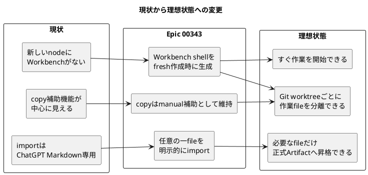
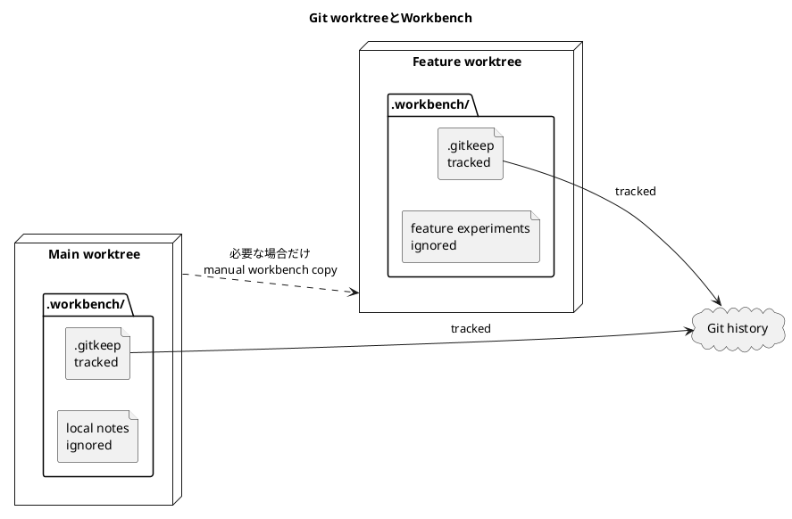
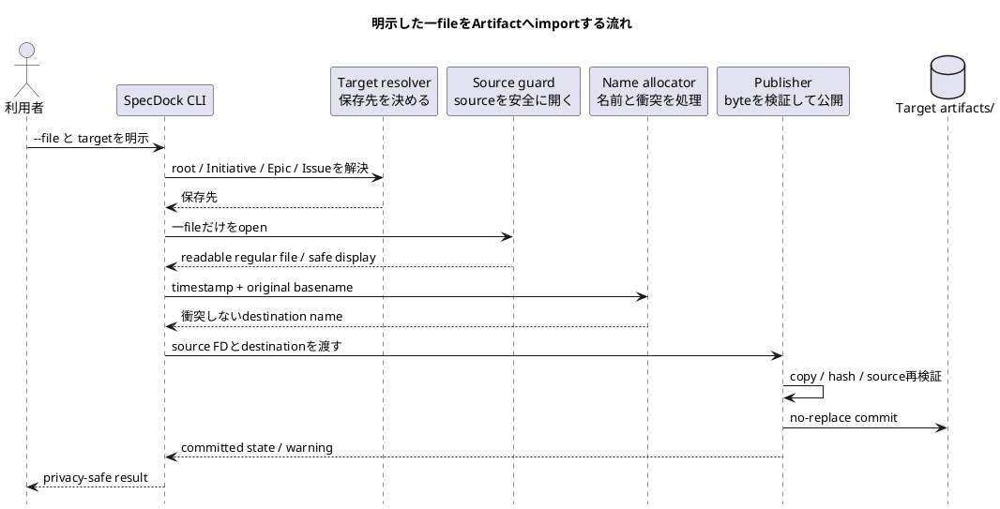
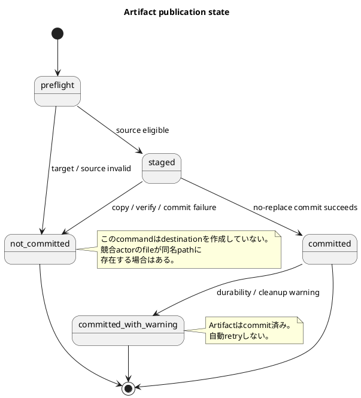
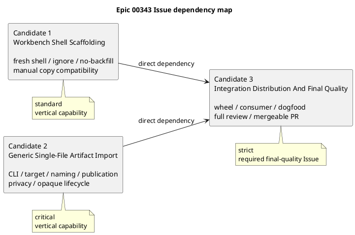

# Epic 00343 チームオンボーディングガイド

## この資料について

この資料は、2026-07-28にチームへ参加したメンバーが、`epic-00343 Workbench Shell And Explicit File Artifact Import`の背景、目標、設計、実装計画を前提知識なしで理解するための説明資料です。

この資料は説明用です。内容に差がある場合の正本は、同じEpicにある次の文書です。

1. `requirement.md`: 何を、なぜ実現するか。
2. `design.md`: どのような構造と契約で実現するか。
3. `plan.md`: どのIssueへ分け、どの順序で実施するか。
4. `report.md`: 調査、判断、レビュー、現在地。
5. `20260728t100038z-adr-generic-imported-file-identity-and-privacy-boundary.md`: 長期間維持する命名・privacy・commit stateの判断。

## 1. 5分で分かる要約

このEpicで実現することは、次の2つです。

### 1.1 作業場所を最初から用意する

新しく作成したSpecDock repositoryと、今後作成するInitiative、Epic、Issueには、`.workbench/`という作業用directoryの「空の器」を自動で用意します。

- `.workbench/.gitkeep`だけをGitで管理します。
- `.workbench/`へ置いた作業中のfileはGitで管理しません。
- 作業fileは正式な仕様や成果物ではありません。
- Git worktreeを閉じれば、そのworktree内の作業fileも一緒に捨てられる前提です。
- 既存repositoryや既存nodeには、後から自動追加しません。
- `.workbench/`がなくてもSpecDockは正常です。

### 1.2 任意の一fileを正式なArtifactへ取り込めるようにする

Workbench内に限らず、repository内外にある明示的な一fileを、root、Initiative、Epic、IssueのArtifactとしてcopyできるcommandを追加します。

```bash
./spec-dock/scripts/spec-dock artifact import file \
  --file <source-path> \
  --epic <epic-id>
```

取り込むfileはMarkdownに限定しません。PDF、image、ZIP、空file、invalid UTF-8などもbyte列のまま保存します。

元fileは削除、移動、変更しません。外部fileのabsolute pathや本文、hash、byte countは通常outputやtracked provenanceへ出しません。

## 2. なぜ必要なのか

### 2.1 当初の期待

チームが期待していたのは、次の単純な利用体験です。

1. 新しい作業対象を作る。
2. すぐ使える`.workbench/`がある。
3. そこで調査資料や生成結果を作る。
4. 残す価値がある一fileだけを、対象のArtifactへimportする。

### 2.2 現在までの問題

- Workbench directoryは新しいroot / Initiative / Epic / Issueへ自動生成されていません。
- 現行importは`artifact import chatgpt-output`という特殊用途に寄っています。
- 現行importはapproved Workbench内のlowercase `.md`を前提とし、任意fileのimportではありません。
- title / slugが必要で、元のbasenameを中心に保存する仕組みではありません。
- 「Workbenchを別worktreeへcopyする補助機能」が中心に見え、本来必要な「最初から空のWorkbenchがある」という体験が弱くなっていました。

### 2.3 このEpicが行う修正



- Title: 現状から理想状態への変更
- Question answered: このEpicが何を修正し、利用者にどのような価値を届けるか。
- Scope: 問題、Epicの対応、利用者価値。
- Excluded details: filesystem primitive、test file、内部class。
- Update trigger: Epicのprimary objectiveまたはscopeが変わるとき。

## 3. 用語をやさしく理解する

| 用語 | この資料での意味 |
|---|---|
| SpecDock | Initiative、Epic、Issueと、それらの仕様・作業記録をrepository内で管理する仕組み |
| Initiative | 複数のEpicをまとめる上位の目的 |
| Epic | 複数Issueで完成させる、まとまった利用者価値 |
| Issue | 実装・検証できる大きさへ分割した作業単位 |
| Workbench | 正式採用前のfileを置く、Git管理外の一時作業directory |
| Workbench shell | Gitで存在だけを保持する`.workbench/.gitkeep` |
| Artifact | 調査、判断、説明資料、外部出力など、対象nodeに紐づけて残すfile |
| canonical / 正本 | 意思決定や実装が従う正式な文書 |
| provider | SpecDockを他repositoryへ配布するsource側 |
| consumer | 配布されたSpecDockを利用するrepository側 |
| dogfood | SpecDock repository自身でSpecDockを利用して検証すること |
| opaque bytes | 内容をMarkdownやtextとして解釈せず、元fileのbyte列をそのまま扱うこと |
| no-backfill | 既存のroot / nodeへ新しいWorkbench shellを後から自動追加しないこと |
| final-quality Issue | 全機能を配布環境で統合し、最終レビューとPR準備を担当するIssue |

## 4. Workbenchのあるべき姿

### 4.1 Directory構造

```text
spec-dock/
├── .workbench/
│   ├── .gitkeep            # Gitで管理する
│   └── ...                 # 作業file。Gitでは管理しない
└── initiatives/
    └── init-xxxxx-.../
        ├── .workbench/
        │   ├── .gitkeep
        │   └── ...
        └── epics/
            └── epic-xxxxx-.../
                ├── .workbench/
                ├── artifacts/
                └── issues/
                    └── iss-xxxxx-.../
                        └── .workbench/
```

### 4.2 生成ルール

| 対象 | fresh作成 | 既存対象へのupdate / sync |
|---|---:|---:|
| SpecDock root | shellを作る | backfillしない |
| Initiative | 今後の新規nodeに作る | 既存nodeへ追加しない |
| Epic | 今後の新規nodeに作る | 既存nodeへ追加しない |
| Issue | 今後の新規nodeに作る | 既存nodeへ追加しない |

Workbench自体は必須ではありません。削除してもSpecDockは壊れず、必要なら手動で作り直せます。

### 4.3 Git worktreeとの関係



- Title: Git worktreeとWorkbench
- Question answered: なぜWorkbench contentsをGit管理せず、copyをmanual補助にするのか。
- Scope: shell marker、local contents、worktree間copy。
- Excluded details: Git worktree作成command、copy conflict algorithm。
- Update trigger: Workbenchのtracking、copy、lifecycle方針が変わるとき。

重要なのは、Workbenchを常時同期することではありません。各worktreeの作業fileは独立します。別worktreeへ必要なfileを持っていく場合だけ、既存の`workbench copy`を明示的に実行します。

## 5. 任意fileのArtifact import

### 5.1 利用者から見た流れ



- Title: 明示した一fileをArtifactへimportする流れ
- Question answered: 入力fileがどの順序で安全にArtifactへ保存されるか。
- Scope: target解決、source guard、命名、publication、result。
- Excluded details: OS syscall、exception class、chunk size。
- Update trigger: import順序、commit point、public resultが変わるとき。

### 5.2 許可するfile

- repository内のfile。
- Workbench内のfile。
- repository外のabsolute path。
- repository rootを基準にしたrelative path。
- Markdown、text、PDF、image、ZIP、空file、invalid UTF-8、NULを含むfile。
- ancestor directoryがsymlinkでも、最終的に解決したregular file。

### 5.3 拒否するもの

- 存在しないpath。
- directory。
- leaf自体がsymlink。
- FIFO、socket、device。
- 読めないfile。
- 一度に複数file、directory、glob、recursive import。

### 5.4 命名規則

元のbasenameを可能な限り維持します。

```text
standard:  <timestamp>--<safe-original-basename>
collision: <timestamp>-<nn>--<safe-original-basename>
```

例:

```text
source:     Customer Interview 01.PDF
artifact:   20260728t123456z--Customer Interview 01.PDF
collision:  20260728t123456z-01--Customer Interview 01.PDF
```

`--`はgeneric imported-fileを既存のtyped Artifactから区別するdelimiterです。`file`というtype tokenではありません。

### 5.5 安全性とprivacy

| 観点 | 保証 |
|---|---|
| 元file | command自身はwrite、delete、move、renameしない |
| byte | staged copyと最終Artifactのhash / byte countを内部検証する |
| overwrite | 既存destinationを置換しない |
| mutation | 検知したsource変更ではsuccess公開しない |
| 外部path | absolute pathやparent directoryをoutputへ出さない |
| content | body、hash、byte countをpublic outputへ出さない |
| authority | importしただけでは正式仕様やADRにならない |
| semantic isolation | `adr-*.md`という元basenameでもtyped ADRとして読まない |

### 5.6 Publication state



- Title: Artifact publication state
- Question answered: failure、success、commit後warningで再試行判断がどう変わるか。
- Scope: public stateとretry disposition。
- Excluded details: OS別primitive、個別error code。
- Update trigger: commit point、warning、retry policyが変わるとき。

## 6. 変えないもの

このEpicは既存機能を置き換えるのではなく、追加します。

- `artifact import chatgpt-output`のWorkbench-only Markdown flow。
- `new artifact`のtyped / blank Artifact。
- `workbench copy`のmanual one-shot behavior。
- 既存root / Initiative / Epic / IssueのWorkbench有無。
- 既存Artifactのfile名とauthority。
- dependency / status / active graph。rootを新しいgraph nodeにはしません。

## 7. 3つの実装Issue

Issue nodeはまだ作成されていません。2026-07-28時点では、正本planのfresh reviewはpassしていますが、Issue作成は人間承認待ちです。



- Title: Epic 00343 Issue dependency map
- Question answered: 3 Issueの責務、依存、最終統合先。
- Scope: Issue candidateとdependency。
- Excluded details: Issue内step、commit cadence、未採番のIssue ID。
- Update trigger: Issue分割、依存、final-quality policyが変わるとき。

### 7.1 Candidate 1 — Workbench Shell Scaffolding

利用者価値:

- fresh repository / future nodeを作成すると、すぐ使えるWorkbench shellがある。
- markerだけGitへ入り、scratch contentsはGitへ出ない。
- 既存nodeは変わらない。

主な変更:

- installerのfresh root判定。
- provider `.gitignore`。
- Initiative / Epic / Issue templates。
- hidden `.gitkeep`のwheel package-data。
- node creationのplanned / result / filesystem parity。
- Workbench / `workbench copy` docs。

主な検証:

- fresh rootと3 node kind。
- real Gitでmarkerだけtracking。
- nested contentsをignore。
- update / sync / validate / active / Artifact / ADRによるno-backfill。
- fake metadata、binary、broken subtreeをsemantic scanしない。
- linked worktree creationでautomatic copyしない。

### 7.2 Candidate 2 — Generic Single-File Artifact Import

利用者価値:

- 明示した一fileを、どこに置かれていても対象Artifactへ安全に保存できる。
- 元file、original basename、privacyを守る。

主な変更:

- CLI、request / result / error、application use case、bootstrap。
- root / node target resolver。
- source guardとstream staging。
- Linux / macOSのFD-bound no-replace publication。
- generic filename parser、minimal normalizer、全family共有slot。
- privacy-safe text / JSON。
- validate / sync / ADR / deps / contextのopaque handling。
- naming / import / privacy docs。

主な検証:

- root / Initiative / Epic / Issue。
- repository内外、Workbench内外、cross-filesystem。
- text / binary / invalid UTF-8 / large file。
- symlink、特殊file、unreadable、source mutation。
- concurrency、collision、slot exhaustion、no-overwrite。
- success / failure / warningのexternal path非漏洩。
- existing `chatgpt-output` / `new artifact`互換。

### 7.3 Candidate 3 — Integration Distribution And Final Quality

利用者価値:

- source checkoutだけでなく、実際に配布されたSpecDockでも2機能を利用できる。
- チームはEpic全体をまとめてreviewしたmergeable PRを受け取れる。

Candidate 1と2の両方に依存します。

主な責務:

- candidate wheelのbuildとinventory。
- fresh consumer。
- pre-feature consumer updateとno-backfill。
- dogfood update。
- manual external-file / no-backfill scenario。
- full regression。
- Epic base/head aggregate diff全体のfresh code review。
- fresh QA / spec / decision review。
- final commit、push、PR Delivery Gate、Merge Preparation Gate。
- 人間merge前で停止。

Candidate 1と2はper-Issue PRを作らず、review済みlocal milestone commitをCandidate 3へ引き渡します。

## 8. 実施順序とゲート

```text
人間が3 Issue作成を承認
        |
        v
Candidate 1をplanning / implementation / review
        |
        v
Candidate 2をplanning / implementation / review
        |
        v
Candidate 3でdistribution / dogfood / full quality / PR
        |
        v
人間がmergeを判断
```

Candidate 1と2に機能上の依存はありませんが、同じprovider filesやdocsを変更するため、同一worktreeでは原則1 Issueずつ実施します。

各Issueは、実装開始前にjust-in-timeでrequirement、design、planを正式化し、fresh reviewを通します。Epic planning時点でIssue-local canonical docsを先回りして作りません。

## 9. CommitとGitHub上の現在地

### 9.1 主要commit

| Commit | 役割 | 内容 |
|---|---|---|
| [`1aa5fd8`](https://github.com/chemitaro/spec-dock/commit/1aa5fd8e7f3cf899bfefa6e1cedb864c2de3dba0) | ChatGPT分析前のcheckpoint | 旧Epicの現状とユーザー判断をGitHubへ共有 |
| [`7baf3a12`](https://github.com/chemitaro/spec-dock/commit/7baf3a12af0031a74be41d5e24c6eab181e75d9d) | successor Epic作成 | Epic #343 scaffold、routing、active branch準備 |
| [`7e867893`](https://github.com/chemitaro/spec-dock/commit/7e867893c1d2fda48db7efee9aac7d69433046ac) | requirement / design checkpoint | 再構成した要件、設計、architecture draft、accepted ADR |
| [`0087af37`](https://github.com/chemitaro/spec-dock/commit/0087af372ac50984f01178600fd64de4d2f91778) | plan checkpoint | 3 vertical slices、fresh plan review、Issue作成前の人間承認gate |

Current branch:

```text
epic-00343-workbench-shell-and-explicit-file-artifact-import
```

GitHub branch:

```text
https://github.com/chemitaro/spec-dock/tree/epic-00343-workbench-shell-and-explicit-file-artifact-import
```

Current planning HEAD:

```text
0087af372ac50984f01178600fd64de4d2f91778
```

GitHub repository:

```text
https://github.com/chemitaro/spec-dock
```

### 9.2 ChatGPT advisory evidence

再計画では、GitHubへcheckpointをpushした後にChatGPT Useの`Pro`を利用し、Markdownのrequirement / design / plan候補と3 Issue候補をZIPで受領しました。

- ZIPと候補validatorはpass。
- ChatGPT outputはadvisory evidenceであり、正本ではありません。
- main orchestratorがrepository factsとユーザー判断へ照合し、正本へ再記述しました。
- requirement、design、planはそれぞれfresh `spec-reviewer`を通過しています。
- UI上は`Pro`を選択しましたが、内部の厳密なmodel versionを`5.6`と独立確認できる証跡はないため、記録上は`ChatGPT Pro`としています。

## 10. レビューで特に磨かれた点

複数回のfresh reviewにより、最初の案から次が明確になりました。

- Workbenchはlifecycleを管理する対象ではなく、optionalでdisposableな作業場所。
- no-backfillはroot / Initiative / Epic / Issueの全種類と既存operationで維持。
- generic fileはtyped Markdown / ADRとして誤認しない。
- external pathはsuccessだけでなく全failure / warning outputでも非開示。
- `not_committed`は「pathが存在しない」ではなく「このcommandが作っていない」。
- sourceの外部変更をどこまで検出できるかと、non-cooperating writerの境界。
- Linux通常権限とmacOS clone-capable filesystemのpublication capability。
- external sourceが別filesystemでも、destination-local stagingにより成功。
- final code reviewはCandidate 3だけでなくEpic base/head全差分を対象とする。
- filename、identity、privacy、retry semanticsはaccepted ADRで固定。

## 11. 新メンバーが最初に読む順序

### まず30分

1. このonboarding guide。
2. `requirement.md`の「Executive Summary」「Scope」「Acceptance Criteria」。
3. `plan.md`の「Issue一覧と実施順序」。

### 実装に参加する前

1. `design.md`のD-001〜D-009。
2. accepted ADR。
3. 自分が担当するCandidateのIssue planning artifacts。
4. `report.md`のEvidence Adoption LedgerとSpec Authoring Gate。
5. 対象sourceとexisting tests。

### Candidate別の主な入口

| Candidate | 最初に見る場所 |
|---|---|
| 1 Workbench Shell | `src/spec_dock/cli.py`、provider `.gitignore`、node templates、installer/runtime Workbench tests |
| 2 Generic Import | `commands/artifact_import.py`、`domain/artifacts.py`、`infra/binary_artifact_publisher.py`、import tests |
| 3 Final Quality | `pyproject.toml` package-data、installer/update tests、dogfood projection、full regression / PR workflow |

## 12. よくある誤解

### Workbenchは必須ですか

いいえ。新しく作る対象には便利なshellを自動生成しますが、Workbenchがなくてもvalidです。

### 既存nodeにも自動生成しますか

いいえ。no-backfillです。既存の状態を勝手に変えません。

### Workbench contentsはGitへ入りますか

入りません。`.gitkeep`だけをtrackingします。

### worktreeを作るとWorkbench contentsもcopyされますか

自動ではcopyしません。必要な場合だけmanual `workbench copy`を使います。

### import対象はWorkbench内だけですか

いいえ。利用者が明示した一fileなら、repository内外からimportできます。

### importしたMarkdownは正式な仕様になりますか

なりません。Artifactとして保存されるだけです。正式採用には正本文書やADRへの反映とレビューが必要です。

### `adr-decision.md`をimportするとADRになりますか

なりません。generic imported-file familyとしてopaqueに扱います。

### 現在すぐ実装を始められますか

まだです。Epicのrequirement / design / plan reviewはpassしていますが、3 Issueの作成には人間承認が必要です。その後、各Issueをjust-in-timeでplanningし、review pass後に実装します。

## 13. チームで説明するときの短い話し方

> このEpicは、SpecDockの各作業対象に最初から使える一時作業場所を用意し、そこで作ったfileや外部fileのうち、残したい一fileだけを正式なArtifact領域へ安全にcopyできるようにします。Workbenchの中身はGit管理せず、既存nodeも勝手に変えません。importはMarkdownに限定せず、元file、名前、privacyを守ります。実装はWorkbench shell、generic file import、配布と最終品質の3 Issueに分け、最後のIssueが前2つを統合してmergeable PRまで責任を持ちます。

## 14. 現在のチェックリスト

- [x] ユーザー意図の再確認。
- [x] successor Epic #343の作成とactive設定。
- [x] GitHubへ分析前checkpointをpush。
- [x] ChatGPT Pro Markdown ZIPの取得・検証。
- [x] requirementの再構成とfresh review pass。
- [x] designの再構成、accepted ADR、fresh review pass。
- [x] planの3 vertical slices化とfresh review pass。
- [x] planning commitsをGitHubへpush。
- [ ] 人間による3 Issue作成の承認。
- [ ] 3 Issueの作成とdependency登録。
- [ ] Issueごとのjust-in-time planning / implementation / review。
- [ ] Candidate 3でdistribution / dogfood / full quality / mergeable PR preparation。
- [ ] 人間によるmerge判断。

## 15. 参照先

- Epic: `epic-00343 Workbench Shell And Explicit File Artifact Import`
- GitHub Issue: `https://github.com/chemitaro/spec-dock/issues/343`
- Parent Initiative: `init-local-00002 Prototype Feature Expansion`
- Canonical requirement: `../requirement.md`
- Canonical design: `../design.md`
- Canonical plan: `../plan.md`
- Progress / evidence: `../report.md`
- Accepted ADR: `20260728t100038z-adr-generic-imported-file-identity-and-privacy-boundary.md`
- Implementation-planner evidence: `20260728t102620z-disc-epic-00343-vertical-issue-plan-draft.md`

## 破棄・更新条件

この資料は説明用Artifactです。requirement、design、plan、accepted ADR、Issue分割、branch HEADのいずれかが変わった場合に更新対象となります。正本文書と矛盾した場合は本資料を正しいものとして扱わず、正本へ合わせて修正またはarchivedにします。
