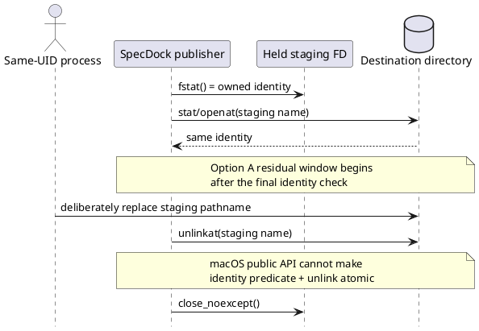

# 20260730t085831z-adr macOS generic import staging cleanup trust boundary

> この文書は `system-architect` draftを入力に、2026-07-30のユーザー明示判断でOption Aを採用したEpic-level ADRである。Epic正本へ反映済みだが、当該amendmentのfresh `spec-reviewer` passとIssue 345への継承は未了である。

## 1. Requirement Coverage

このADRは、`epic-00343` のgeneric single-file importについて、次の既存契約間に実装時に判明したmacOS固有の両立不能点を扱う。

- macOS clone-capable filesystemをsupported success laneとする。
- original sourceがdestinationとは別filesystemでも、destination-side stagingにより成功可能とする。
- formal destinationはFD-bound no-replace commitでのみ公開する。
- normal successではowned staging entryをcleanupする。
- cleanup identityが不確実な場合は非所有entryを削除しない。
- pre-commit failure、clean commit、post-commit warningを機械判定可能にする。

対象trace:

- Epic: `E-RQ-013`, `E-RQ-016`, `E-RQ-017`, `E-AC-015`, `D-005`
- Issue: `I345-RQ-004`, `I345-RQ-008`, `I345-RQ-009`, `I345-CON-006`, `I345-CON-007`, `I345-EC-015`, `I345-EC-016`, `I345-AC-010`〜`I345-AC-012`
- Accepted ADR: Decision 8のFD-bound commit point、`not_committed` / `committed_with_warning`境界

本ADRはfilename、privacy、opaque-byte、source non-mutation、formal destination no-overwriteを変更しない。変更するのは、macOS named staging cleanupにおけるthreat actorの境界だけである。

## 2. Existing Context Findings

### 2.1 判明したplatform制約

macOSの公開・通常権限filesystem APIには、次の双方を同時に満たすprimitiveがない。

1. pathnameが最終確認した`(st_dev, st_ino)`のentryである場合にだけunlinkする。
2. 確認とunlinkを、同一の不可分operationとして実行する。

`fstat(temp_fd)`と`stat/openat(temp_name)`を比較してから`unlinkat`しても、最終identity check後からunlinkまでにpathnameを置換できる。macOSにはLinuxの`O_TMPFILE`相当のanonymous stagingと、FD identity条件付きunlinkがないため、通常権限processだけではこのwindowを完全に閉じられない。

### 2.2 現行契約との不一致

親EpicはmacOSの`fclonefileat`成功laneとnormal cleanupを要求する一方、Issueのfresh code reviewは「identity確認後にtemp pathnameを置換され、別entryをunlinkし得る」点をP1として検出した。既存Epic threat modelはsource最終検証後のsame-inode writeやdestination parent最終確認後のreplacementを限定的に除外しているが、staging cleanup replacementは除外していない。

したがってIssue-localな実装変更や追加identity checkだけでは、既存契約を誠実に満たしたことにならない。Epic ownerがthreat boundaryを変更するか、macOS successを外すか、別security principalを導入する必要がある。

### 2.3 変更しない事実

- formal destination commitは`fclonefileat(temp_fd, destination_parent_fd, name, 0)`のFD-bound no-replace operationであり、問題のcleanup raceとは別である。
- `O_CREAT | O_EXCL | O_NOFOLLOW`、held temp FD、opened destination-parent FD、high-entropy internal name、直前identity checkは攻撃可能性を下げるが、絶対保証にはならない。
- identity mismatchまたは観測不能時にcleanupを行わずretained warningへ落とす設計は、対象内の観測可能な競合に対して有効である。
- capability probe専用pathnameを作ってunlinkする必要はなく、既存owned staged tempに対するnon-mutating probeを維持できる。

## 3. Design Decisions

### 3.1 Decision

**Option Aを採用する。** 2026-07-30にユーザーが、macOS clone-capable / cross-filesystem successを維持するため、限定されたsame-UID final-window exclusionを明示承認した。

採用理由は、通常権限macOS APIにFD-conditional unlinkまたはanonymous stagingがなく、Option Aだけが既存success laneを保ちながら、実現可能なmandatory mitigationsを全て維持できるためである。fresh `spec-reviewer` passは本Decisionの前提ではなく、Epic / Issue execution再開前の後続ゲートである。

### 3.2 Option Aとして採用した契約

Option Aにより、macOS supported laneのthreat modelを次のように限定する。

> generic import processと同一UIDで動作し、destination directoryを変更でき、SpecDock内部のhigh-entropy staging nameを発見または監視し、cleanupの最終identity check後からunlink syscallまでの間に、そのstaging pathnameを意図的に別entryへ置換するactorは、macOS named-staging cleanupの保証対象外とする。

この除外は次を**除外しない**。

- 別UID / 権限境界外actorからの通常のfilesystem protection。
- cooperative writerおよび偶発collision。
- 最終identity checkまでに観測可能なstaging replacement。
- formal destinationに対するno-replace保証。
- source byte identity、source non-mutation、external path privacy。
- destination parent identity、commit point、retry disposition。
- identity mismatch / uncertainty時に非所有entryを削除せずretainedへ落とす義務。

つまり、除外対象は「同一UIDの悪意あるactorによる、最終cleanup check後の意図的な内部staging pathname差し替え」という一つの残存windowだけであり、「same-UIDならどのentryでも削除してよい」という包括的waiverではない。

### 3.3 Option Aの必須mitigation

Option A採用時も、macOS実装は少なくとも次を維持する。

1. destination parentをdescriptor-boundで開き、visible identityをcommit前に検証する。
2. stagingはdestination directory内で、予測困難な内部名を使い、`O_CREAT | O_EXCL | O_NOFOLLOW`相当で作る。
3. staging FDをcopy、verification、`fclonefileat` commit完了まで保持する。
4. cleanup直前にFD identityとpathname identityを比較する。
5. mismatch、missing、unexpected type、stat/open failureその他ownership uncertaintyではunlinkせず、`temp_cleanup_retained`へ落とす。
6. capability probeは別のraceable pathnameを作成・削除せず、owned staged tempに対するnon-mutating EEXIST/no-replace確認を使う。
7. post-commit cleanup uncertaintyは`committed_with_warning`, `committed=true`, `retry_disposition=not_needed`を維持する。
8. pre-commit cleanup uncertaintyはformal destinationを作らず、retained cleanup stateをcontent-freeに返す。
9. public outputへinternal temp name、source absolute path、hash、byte count、raw exceptionを出さない。

## 4. Alternatives Considered

### Option A: same-UID final-window replacementを明示的に対象外とする

- Pros:
  - macOS clone-capable successとcross-filesystem source supportを維持できる。
  - trusted daemon、privileged helper、FD transfer、installer変更を導入しない。
  - 現行Issueのvertical scope内で、既存mitigationを最大限維持して実装を再開できる。
- Cons:
  - 「non-owned entryを絶対に削除しない」という読み方を、限定的なOS trust boundaryへ狭める。
  - malicious same-UID actorが同じdirectoryを自由に操作できる環境では、残存TOCTOUを完全には防げない。
- 推奨理由:
  - 一般的なOS security boundaryでは同一UID processを同一principalとして扱うことが多く、利用者価値と実装規模の均衡が最もよい。
- 状態:
  - **accepted**。本ADRのmandatory mitigations 1〜9を実装・reviewの必須契約とする。

### Option B: macOS generic importをunsupportedとする

- 概要:
  - strong no-non-owned-delete guaranteeを維持し、macOSではformal destination作成前に`publication_unsupported`でfail closedする。
- Pros:
  - adversarial same-UID cleanup raceをsupported contractから完全に排除できる。
  - security guaranteeの説明が最も単純になる。
- Cons:
  - 親EpicのmacOS clone-capable successを失う。
  - 現在の主要開発platformでgeneric importを利用できない。
  - Epic requirement/design/planとIssue acceptance matrixのsupported-platform変更が必要になる。
- 状態:
  - 不採用。Option Aが受容不能となった場合だけ、supported macOS laneを縮小するrollback optionとして再検討する。

### Option C: trusted helper / distinct security principalを導入する

- 概要:
  - directory mutationを別principalまたはtrusted helperへ隔離し、stage ownershipとcleanupを強い境界で管理する。
- Pros:
  - macOS successとadversarial same-UID safetyを両立できる可能性がある。
- Cons:
  - daemon/helper packaging、権限モデル、FD transfer、lifecycle、upgrade、failure recovery、installation trustを新設する。
  - `iss-00345`のscopeを越え、別Epic級のarchitectureと運用surfaceになる。
- 状態:
  - 保留。Option A/Bが不適切で、強保証とmacOS successの両方が必須と決定された場合だけ別Epicとして再検討する。

### Option D: normal successでもnamed tempを常にretainedにする

- Pros:
  - cleanup unlink race自体を避けられる。
- Cons:
  - importごとにtrackedでないpersistent debrisを残す。
  - normal cleanup契約、operator experience、storage hygieneを破る。
  - retained entryの後日cleanupで同じownership問題が再発する。
- 状態:
  - 不採用。normal cleanup契約を満たさず、後日のcleanupにも同じownership問題を持ち込む。

## 5. Boundary / Contract Model

### 5.1 Threat actor matrix

| Actor / event | Option Aでの扱い | 必須control |
|---|---|---|
| cooperative SpecDock writer | 対象内 | shared create lock、unique slot、no-replace |
| accidental same-UID collision | 対象内 | high-entropy name、`O_EXCL`、identity mismatch時retain |
| replacementが最終identity checkまでに観測可能 | 対象内 | FD/path identity比較、unlink禁止、warning |
| formal destination競合 | 対象内 | `fclonefileat` no-replace、next-slot retry |
| source mutation / replace | 対象内（既存限定窓を除く） | FD/hash/count/path/metadata revalidation |
| 別UID actor | OS permission boundary内 | directory ownership/permissions、descriptor-bound operation |
| deliberate same-UID replacement after final cleanup identity check | **対象外** | 残存riskをADRで明示、windowを最小化 |
| arbitrary same-UID deletion outside internal staging name | 対象内 | implementationは該当pathnameを列挙・削除しない |

### 5.2 Guarantee boundary

Option Aはformal destinationのintegrityやno-overwriteを弱めない。弱める可能性があるのは、macOS named stagingのcleanupに限り、「最終identity checkとunlinkがatomicである」という実現不能な仮定だけである。

### 5.3 Sequence and residual window

- Title: macOS named staging cleanup trust boundary
- Question answered: 保証対象内のcleanup検証と、Option Aで対象外となる残存windowはどこか。
- Scope: commit後またはpre-commit abort後のowned staging cleanup。
- Excluded details: source guard、filename allocation、presentation field。
- Update trigger: macOSがFD-conditional unlinkまたはanonymous stagingを提供する、helper設計を採用する、supported platform matrixを変更する場合。



## 6. Dependency Analysis

- Authority dependency:
  - Issue `iss-00345`はparent Epic supported-platform / threat-model契約を独自に変更できない。
  - Option A/B/Cの採用判断はEpic-level ADRとEpic canonical docsが先行する。
- Implementation dependency:
  - S02のcleanup implementationとfresh code reviewは、adopted boundaryを入力として再実行する。
  - S03以降はS02 closureに依存する。
- Review dependency:
  - 先行delegated draftの自己評価はreviewer passではない。
  - adopted Decisionを入力とするfresh `spec-reviewer` passが必要である。
- Cross-Epic dependency:
  - Option Cは新しいsecurity/packaging architectureを必要とし、current Epicへ黙って混在させない。

## 7. Source of Record

現在のsource of recordは次であり、本ADRはmacOS named-staging cleanup trust boundaryのaccepted authorityである。

1. `epic-00343/requirement.md`, `design.md`, `plan.md`
2. accepted `20260728t100038z-adr-generic-imported-file-identity-and-privacy-boundary.md`
3. `iss-00345` approved `requirement.md`, `design.md`, `plan.md`
4. observed implementation/review evidenceである`iss-00345/report.md`
5. synthesis evidence `20260730t085614z-disc-macos-staging-cleanup-threat-model-decision.md`

Inspected source revision:

- Git HEAD: `7d43797c6a1f2206cdffe465f6869e0eb7d59d9a`
- Issue reportはS02作業中のuncommitted observed evidenceを含むため、HEADだけでなく作業treeの現物を参照した。

正本順序は、Epic ADR decision → Epic requirement/design/plan → Issue requirement/design/plan → Issue report adoption ledgerとする。Issue canonical docsは次のplanning amendmentとfresh reviewで継承する。

## 8. Data Flow / Domain Model / Interface Contract

Option Aを採用した場合のcleanup state flow:

```text
owned named staging created
  -> held FD + staged bytes verified
  -> FD-bound no-replace commit or pre-commit abort
  -> final FD/path identity check
     -> match: unlink attempt
        -> success: cleaned
        -> failure/uncertainty: retained warning/state
     -> mismatch/missing/unexpected: do not unlink; retained warning/state
```

Public interfaceは既存の三状態を維持する。

| Timing | Formal destination | Cleanup outcome | Public state |
|---|---|---|---|
| pre-commit failure, cleanup confirmed | absent | cleaned | `not_committed` |
| pre-commit failure, cleanup uncertain | absent | retained | `not_committed` + retained cleanup state |
| commit, cleanup confirmed | present | cleaned | `committed` |
| commit, cleanup uncertain/fails | present | retained | `committed_with_warning`, retry `not_needed` |

internal staging pathname、identity、digest、raw OS errorはpublic resultへ追加しない。

## 9. File / Module Change Plan

このADR自体は実装変更を行わない。Option AのEpic-level contractはcanonical planへ反映済みであり、Issue-level contractとS02 closureはfresh review後に更新する。

- Canonical contracts:
  - Epic `requirement.md`: supported guaranteeとexact threat exclusion。
  - Epic `design.md`: macOS residual TOCTOU、mitigation、platform matrix。
  - Epic `plan.md`: test/review evidenceの対象内・対象外区分。
  - Issue `requirement.md`, `design.md`, `plan.md`: inherited boundaryとS02 closure。
  - Issue `report.md`: D-022 / EAL-004 disposition、fresh review evidence。
- Provider implementation candidate:
  - `src/spec_dock/assets/spec_dock/scripts/spec_dock_runtime/infra/binary_artifact_publisher.py`
- Focused tests:
  - `tests/unit/infra/test_binary_artifact_publisher.py`
  - Issue planが列挙するapplication/command/presentation/CLI regression files。

Option Bではplatform capability matrixとerror contractの変更、Option Cでは別Epicのarchitecture/package surfaceが必要であり、同じfile planとして扱わない。

## 10. Migration / Compatibility / Rollback

### Migration / Compatibility

- database/schema migrationなし。
- generic imported Artifact、typed/blank Artifact、`chatgpt-output`、`workbench copy`の既存dataをrename/deleteしない。
- Option AはmacOS cleanup threat boundaryだけを変更し、CLI grammar、filename、privacy/result fields、formal commit primitiveを維持する。
- Linux supported contractは本判断で縮小しない。

### Rollback

- 実装rollout前:
  - ADR proposalとcanonical amendmentをrevertし、S02をblockedへ戻せる。
- rollout後:
  - featureをdisableしてもcommitted generic Artifactを削除・renameしない。
  - retained tempを自動bulk cleanupしない。ownershipを現在のevidenceで確認できる個別repairだけを許容候補とする。
  - Option Aのriskが受容不能と判明した場合、Option Bへ切り替えて新規macOS importを`publication_unsupported`にできる。

### Revisit conditions

次のいずれかでdecisionを再検討する。

- macOSがFD identity条件付きunlink、anonymous staging、または同等の通常権限primitiveを提供する。
- 実運用でsame-UID staging replacementまたは疑わしいcleanup incidentが観測される。
- destination directoryがuntrusted same-UID processと共有される運用を正式supportする。
- compliance/security requirementがsame-UID actorを別trust principalとして扱う。
- trusted helperの運用コストを正当化する新しい複数use caseが生じる。

## 11. Observability

- Public:
  - existing `cleanup_state`, `warning_codes`, `publication_state`, `committed`, `retry_disposition`だけを使う。
  - external path、body、hash、byte count、internal temp name、raw exceptionを出さない。
- Test/internal:
  - cleanup前identity match/mismatch、unlink attempt count、retained state、sentinel survivalをfault seamで観測する。
  - excluded final-window attackを「防御済み」と表示するmetric/test名を作らない。
- Report:
  - adopted option、risk boundary、review verdict、platform evidenceをIssue `report.md`へ記録する。

## 12. Test Strategy

Option A採用時は、test matrixを保証対象内と明示除外へ分ける。

### Required positive / negative tests

1. macOS clone-capable successでsource/destination bytesが一致し、normal cleanupが完了する。
2. original sourceがcross-filesystemでもdestination-side stageにより成功する。
3. cleanup前のpathname identity mismatchでunlinkを呼ばず、replacement sentinelが残る。
4. staging pathname missing、special entry、open/stat errorでunlinkせずretainedへ落とす。
5. pre-commit cleanup uncertaintyはformal destinationなし、content-free failure、retained stateとなる。
6. post-commit cleanup uncertaintyはformal destinationあり、`committed_with_warning`, retry `not_needed`となる。
7. capability probeはprobe専用entryをunlinkせず、replacement sentinelを削除しない。
8. formal destination competitionはno-replaceを維持し、既存entryを変えない。
9. external source privacy sentinelは全error/warning/resultへ漏れない。
10. legacy `chatgpt-output`、typed/blank allocation、validate/sync opacity regressionsがGreenである。

### Explicit non-claim

「同一UID actorが最終identity check終了を同期的に観測し、unlink直前にstaging pathnameを置換する」testは、Option Aではsupported guaranteeのpass条件にしない。ただし、残存windowが存在することをarchitecture reviewで確認し、test suite名やコメントで完全防御を誤認させない。

### Reviewer focus

- exclusionがcleanup final window以外へ広がっていないか。
- mismatch/uncertaintyでunlinkしていないか。
- formal destination no-replaceとsource/privacy契約が不変か。
- warning/retry semanticsがcommit pointと一致するか。
- platform skipをpassとして扱っていないか。

## 13. ADR Candidates

本件はADR化基準を満たす。

- hard to reverse: yes
  - tracked Artifact publicationのsecurity boundaryとsupported platform contractに長期影響する。
- surprising without context: yes
  - macOS successを維持しつつ、極小のsame-UID cleanup raceだけを対象外にする判断はコードだけでは理解できない。
- real tradeoff: yes
  - macOS usability、強いadversarial safety、実装/運用複雑性の三者を同時最大化できない。
- ADR化しない場合の反映先:
  - Epic requirement/design/planとIssue discussionだけでは長期的な理由とrevisit条件が散逸するため不十分。
- ADRとして残す理由:
  - supported guaranteeの境界を明示し、将来のreviewerが同じ制約を再発見した際の判断根拠、mitigation、rollback、再検討条件を一か所に保つため。

## 14. Risks

| Risk | 影響 | Mitigation / handling |
|---|---|---|
| exclusionの過度な一般化 | same-UID actorによる任意破壊を許容したように読まれる | exact actor、pathname、time windowを固定し、non-excluded guaranteesを列挙 |
| mitigation drift | race windowが不必要に広がる | high-entropy/O_EXCL/held FD/final check/retain-on-uncertaintyをcanonical designとtestsへ固定 |
| false confidence | testが完全安全を主張する | explicit non-claimとreviewer focusをplan/reportへ反映 |
| retained temp accumulation | cleanup uncertainty時にdebrisが残る | warning/stateで観測し、automatic bulk cleanupを禁止 |
| Option Aが運用要件に不適合 | untrusted same-UID multi-tenant環境で危険 | Option Bへfail-closed rollback、またはOption Cを別Epic化 |
| authority混同 | user Decision / canonical反映だけでS02を再開する | fresh spec review完了までblockedを維持 |

## 15. Requirement Clarification Requests

解決済み。2026-07-30にユーザーがOption Aを採用した。未了のmaterial actionは、Epic amendmentとIssue継承に対するfresh `spec-reviewer` reviewであり、追加のproduct decisionではない。

## 16. Integration Notes for Main Orchestrator

採用後の手順:

1. このADRとEpic `requirement.md` / `design.md` / `plan.md`をfresh `spec-reviewer`へ提出する。
2. pass後にIssue `requirement.md` / `design.md` / `plan.md`へ継承境界とS02 closureを再記述する。
3. Issue `report.md`のD-022 / EAL-004へ採否、根拠、adopter、fresh reviewer、next actionを記録する。
4. Issueのfresh review後、runtime execution guidanceがreadyへ戻ったことを確認する。
5. その後だけS02 implementation / code reviewを再開する。

Fallback decision:

- 将来Option Aを見直す場合もmanual authoringは有効である。ただしOption A/B/Cのmaterial decisionとfresh reviewer gateを省略しない。

Report evidence destination:

- `iss-00345/report.md` の Evidence Adoption Ledger、Decision Log、Reviewer Gate Status、S02 Step Contract Closure。

Adoption ledger note:

- `adoption_status: adopted`。ユーザー判断とEpic canonical反映は完了したが、fresh Epic / Issue reviewを完了するまでexecution promotion evidenceには使わない。

Unresolved requirement gaps:

- Epic amendmentとIssue継承のfresh spec review。

ユーザーのDecision、Epic canonical反映、未了review gateを上記のとおり記録する。reviewer-passまたはIssue execution-readyは主張しない。
