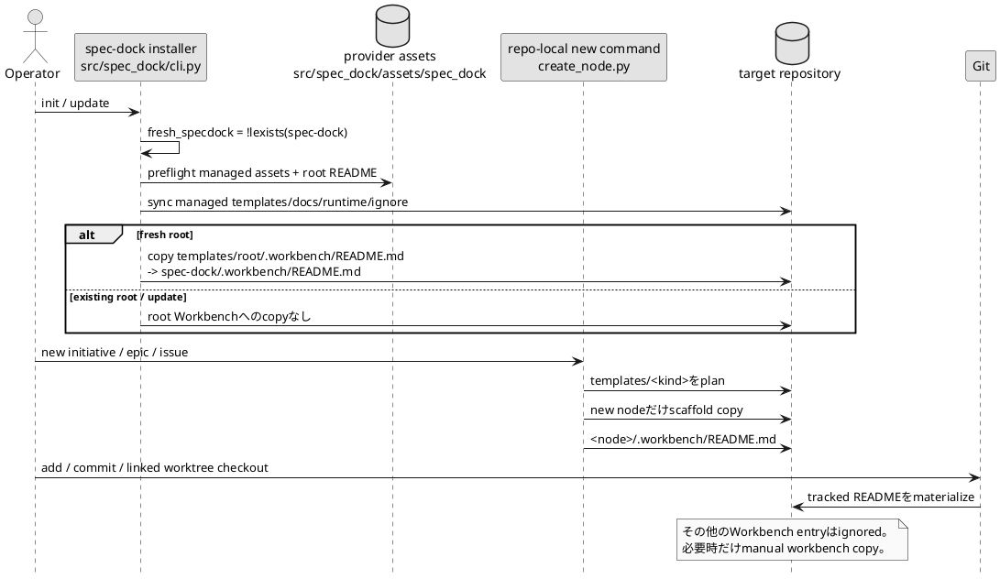

# Issue 344 Planning Candidate

## requirement.md

### 文書メタデータ

| 項目              | 値                                          |
| --------------- | ------------------------------------------ |
| 種別              | 要件定義書（Issue）候補                             |
| ID              | `iss-00344`                                |
| タイトル            | `Workbench Shell Scaffolding`              |
| 関連GitHub        | `#344`                                     |
| 状態              | `draft candidate`                          |
| 親               | `epic-00343`, `init-local-00002`           |
| 対象ブランチ          | `iss-00344-workbench-shell-scaffolding`    |
| 調査基準commit      | `c2c494d56f29912aa262770507e5e61f69cdc025` |
| authority       | `evidence_only`                            |
| adoption_status | `unreviewed`                               |

本候補は、指定されたtask briefを制御入力とし、GitHub上の現行ブランチ、親Epic文書、Issue scaffold、provider実装、package設定、関連テストを照合して作成した。

### 1. 目的

freshなSpecDock root、および今後新規作成されるInitiative、Epic、Issueに、利用方法と権限境界を説明するtracked `.workbench/README.md`を含むoptional Workbench shellを提供する。

Workbenchは引き続き一時的、worktree-local、破棄可能、non-canonicalであり、README以外の内容はGit管理外とする。既存rootおよび既存nodeへのbackfillは行わない。

### 2. 背景と現状

現行Issue 344の`requirement.md`は汎用scaffoldのままであり、目的や受け入れ条件は未具体化である。 `design.md`と`plan.md`もassurance合成待ちのplaceholderで、設計・実装計画本文は存在しない。

親Epicでは、以下が既に固定されている。

* fresh rootとfuture nodeには`.workbench/README.md`を生成する。
* READMEだけをGit tracking可能にする。
* existing root/nodeはbackfillしない。
* Workbenchの存在はvalidity要件にしない。
* Workbench subtreeはsemantic discoveryの対象にしない。
* `workbench copy`は明示的なone-shot operationのままとする。

Issue 344は、このWorkbench shell契約の一次実装とfocused evidenceを所有する。generic single-file Artifact importはIssue 345、candidate wheelを使った統合E2E、dogfood projection、full regression、最終レビュー、PR送達はIssue 346が所有する。

### 3. 観測可能な成果

Issue-localな実装が成立した場合、以下を観測できる。

1. freshなtargetで`spec-dock init`を実行すると、`spec-dock/.workbench/README.md`が生成される。
2. 今後新規作成するInitiative、Epic、Issueの各node直下に`.workbench/README.md`が生成される。
3. rootと3 node kindのREADMEはbyte-identicalである。
4. `.workbench/README.md`はGit tracking対象になり、同じ`.workbench/`内のその他のentryは深さや形式によらずignoreされる。
5. existing root/nodeへはREADMEが追加されない。
6. WorkbenchまたはREADMEがないscopeもvalidである。
7. Workbench READMEおよびその他の内容はdefault semantic discoveryへ参加しない。
8. tracked READMEは通常のGit checkoutにより別worktreeへ現れる。
9. ignoredな作業fileは自動的に別worktreeへ移動せず、必要な場合だけ明示的な`workbench copy`を使う。
10. source treeだけでなく、wheel、sdist、installed resourcesにも4 README assetが収録される。
11. shipped docsがshell、Git境界、manual copy、evidence-only authorityを説明する。

以下は観測されてはならない。

* existing root/nodeへの自動backfill。
* Workbench presenceを要求するvalidation error。
* `.workbench/README.md`以外のWorkbench内容のGit露出。
* automatic copy、watch、sync、copy-back。
* READMEをnode、Artifact、ADR、dependency、authoring sourceとして解釈する挙動。
* Issue 345のgeneric import実装。
* Issue 346が所有するdogfood projection、full regression、PR作成またはmerge。
* `.workbench/.gitkeep`の新規生成。

### 4. 親スコープと継承契約

#### 4.1 継承する親要件

| Issue要件群                          | 親Epic要件                           |
| --------------------------------- | --------------------------------- |
| fresh root shell                  | `E-RQ-001`                        |
| future node shell                 | `E-RQ-002`                        |
| tracked README / ignored contents | `E-RQ-003`                        |
| optional presence                 | `E-RQ-004`                        |
| no-backfill                       | `E-RQ-005`                        |
| opacity / disposable              | `E-RQ-006`                        |
| manual copy only                  | `E-RQ-007`                        |
| Workbench copy compatibility      | `E-RQ-023`                        |
| provider / distribution parity    | Issue-local portion of `E-RQ-024` |
| documentation                     | shell/copy portion of `E-RQ-025`  |

#### 4.2 このIssueで再定義しないもの

* Generic arbitrary-file Artifact importのCLI、source guard、filename、publication、privacy契約。
* `artifact import chatgpt-output`の既存契約。
* Artifact naming grammar。
* root Artifact target。
* Workbench retention、TTL、session model。
* Workbench copyのautomatic lifecycle。
* canonical adoption workflow。
* accepted ADRの内容。
* Epicの3-Issue分割、Issue順序、dependency方向。
* PR Delivery GateおよびMerge Preparation Gateの最終所有者。

### 5. 関係者と代表シナリオ

| Actor              | 役割                                              |
| ------------------ | ----------------------------------------------- |
| SpecDock利用者        | fresh rootまたはfuture nodeを作成し、Workbenchを利用する     |
| 開発agent / model    | READMEから一時作業領域とauthority境界を理解する                 |
| installer CLI      | fresh rootだけにshellを生成する                         |
| repo-local runtime | future Initiative/Epic/Issueをtemplateから生成する     |
| Git                | READMEを通常checkoutし、その他のWorkbench内容をignoreする     |
| package consumer   | wheelまたはsdistからprovider assetを利用する              |
| reviewer           | no-backfill、opacity、package parity、Issue境界を確認する |

#### SC-344-001 Fresh root

* 前提: targetに`spec-dock`が存在しない。
* 操作: `spec-dock init <target>`を実行する。
* 期待結果:

  * `spec-dock/.workbench/README.md`が生成される。
  * READMEはGit tracking候補になる。
  * Workbenchのその他のentryはignoreされる。

#### SC-344-002 Future node

* 前提: provider templateがIssue 344版へ更新されている。
* 操作: `new initiative`、`new epic`、`new issue`のいずれかを実行する。
* 期待結果:

  * 新しいnodeだけに`.workbench/README.md`が生成される。
  * create plan、command result、filesystemのpath集合が一致する。
  * existing ancestorおよびsiblingは変更されない。

#### SC-344-003 Existing workspace update

* 前提: rootおよび既存nodeに`.workbench/README.md`がない。
* 操作: `spec-dock update`または既存workspaceへの対応する更新経路を実行する。
* 期待結果:

  * managed templates、docs、runtime、ignore契約は更新される。
  * existing root/nodeにはREADMEを生成しない。
  * 更新後に新規作成したnodeにはREADMEを生成する。

#### SC-344-004 Linked worktree

* 前提: READMEがcommitされ、source worktreeにignoredな作業fileがある。
* 操作:

  1. Git linked worktreeを作成する。
  2. 必要な場合に限り`workbench copy`を実行する。
* 期待結果:

  * READMEは通常checkoutで新worktreeへ現れる。
  * ignoredな作業fileはcheckoutだけでは現れない。
  * 明示copy後にのみignoredな作業fileが移る。
  * automatic syncまたはcopy-backは発生しない。

#### SC-344-005 Semantic opacity

* 前提: Workbench内にREADME、fake metadata、ADR-like Markdown、binaryまたはinvalid UTF-8がある。
* 操作: validate、sync、dependency check、default discoveryを実行する。
* 期待結果:

  * Workbench subtreeの内容は意味解釈されない。
  * Workbenchの内容を理由とするnode、ADR、dependency、authoring sourceの増減やdecode errorが発生しない。

### 6. 対象範囲

#### 6.1 In scope

* fresh-init-only root Workbench shell。
* future Initiative/Epic/Issue Workbench shell。
* 4つのbyte-identicalなprovider README asset。
* README本文のguidance contract。
* README-only Git tracking契約。
* installer fallback `.gitignore`との一致。
* existing root/node no-backfill。
* optional presence。
* existing semantic opacityのfocused regression。
* existing `workbench copy`のfocused compatibility。
* package-data include/excludeの調整。
* source、wheel、sdist、installed resourceのexact README inventory。
* provider-first docs。
* Issue-local focused testsとevidence destination。
* Issue 346へのdeferred PR delivery record。

#### 6.2 Out of scope

* `spec-dock artifact import file`の実装。
* rootまたはnode Artifact destinationの実装。
* arbitrary-file source validation、publication、naming、privacy。
* existing root/nodeのmigrationまたはbackfill command。
* Workbench自動copy、watch、sync、copy-back。
* Workbench content classifier。
* Workbench retention、expiration、cleanup。
* Workbenchをcanonical sourceにする変更。
* candidate wheelを使ったfull end-to-end product verification。
* dogfood `spec-dock/**`への正式projection。
* full test suite closure。
* Epic-wide final QA/code/spec review。
* push、PR作成、PR Delivery Gate、Merge Preparation Gate、merge。

#### 6.3 変更しないもの

* existing `workbench copy`のsource-wins、destination-only preserve、one-shotという公開挙動。
* existing Workbench内のuser content。
* existing root/nodeのfiles、names、bytes、mtime。
* `validate`、`sync`、dependency、active contextのsemantic input。
* node ID、metadata、dependency topology。
* ArtifactまたはADRの既存contract。
* Git worktree lifecycle。
* GitHub Issueの状態。

### 7. 用語

| ID              | 用語                  | 定義                                                                                     |
| --------------- | ------------------- | -------------------------------------------------------------------------------------- |
| `I344-TERM-001` | Workbench           | exact path component `.workbench`で表される一時的、worktree-local、disposable、non-canonicalな作業領域 |
| `I344-TERM-002` | Workbench shell     | `.workbench/`と、その利用方法を説明するtracked `README.md`                                          |
| `I344-TERM-003` | fresh root          | installer mutation開始時点でtargetの`spec-dock` pathが存在しない状態                                 |
| `I344-TERM-004` | future node         | Issue 344のprovider templateが導入された後に新規作成されるInitiative、Epic、Issue                        |
| `I344-TERM-005` | existing scope      | Issue 344の生成処理より前から存在するrootまたはnode                                                     |
| `I344-TERM-006` | semantic opacity    | Workbench subtreeをnode、Artifact、ADR、dependency、authoring source等として暗黙解釈しない性質           |
| `I344-TERM-007` | normal Git checkout | tracked fileをGit commit/treeから他checkoutまたはlinked worktreeへmaterializeする通常動作            |
| `I344-TERM-008` | ignored work file   | `.workbench/README.md`以外の、Git ignore対象となるWorkbench entry                               |

### 8. 要求される振る舞い

#### I344-RQ-001 Fresh root shell

`spec-dock`が存在しないtargetへのfresh initは、rootに`.workbench/README.md`を生成しなければならない。

* 空placeholderまたは`.gitkeep`を代替として生成してはならない。
* READMEの生成失敗を成功として報告してはならない。
* root WorkbenchまたはREADMEが後から削除されてもworkspaceはvalidでなければならない。

#### I344-RQ-002 Future node shell

今後新規作成されるInitiative、Epic、Issueには、各node直下の`.workbench/README.md`を生成しなければならない。

* 新しいnodeのcreate plan、result、filesystemでREADME pathが一致しなければならない。
* node作成を契機としてancestorまたはsiblingへREADMEを追加してはならない。

#### I344-RQ-003 README guidance

rootおよび各node kindのREADMEはbyte-identicalとし、少なくとも以下を明示しなければならない。

1. Workbenchは一時的、worktree-local、disposable、non-canonicalである。
2. Git trackingを意図するWorkbench fileは`README.md`だけである。
3. その他のWorkbench fileはGitにignoreされる。
4. 保存価値のあるfileは、対象scopeの`artifacts/`へ`spec-dock artifact import file`で明示importする。
5. Workbench fileは自動copyまたはsyncされず、必要な場合だけmanual `workbench copy`を使う。
6. Git ignoreはsecurity boundaryではなく、禁止されたsecretを保存してはならない。
7. fileの明示指定またはimportはread/import authorizationに限られ、import結果はevidence-onlyであり、canonical adoptionには別のreviewed workflowが必要である。
8. tracked READMEは通常のGit checkoutで別worktreeへ現れ、manual copyが必要なのはignoredな作業fileである。
9. 人間、model、toolはREADMEを含むWorkbench contentをcanonical inputとして扱ってはならない。

#### I344-RQ-004 README-only tracking

各scopeの`.workbench/README.md`だけをGit tracking可能とし、同じWorkbench内のその他のentryをignoreしなければならない。

* fileの深さ、extension、encoding、contentによって例外を作ってはならない。
* nested `README.md`をtracking対象にしてはならない。
* case variant `readme.md`をtracking対象にしてはならない。
* `.workbench-notes`等のnear-name directoryへWorkbench用ignore ruleを適用してはならない。

#### I344-RQ-005 Optional presence and no-backfill

WorkbenchおよびREADMEの存在はvalidity要件ではない。

* existing root/nodeへREADMEを追加してはならない。
* update、existing workspaceへのinit/update経路、validate、sync、active切替、Artifact作成、ADR作成等をbackfill契機にしてはならない。
* future node作成時も、新規node以外へREADMEを追加してはならない。
* existing Workbenchのentry、bytes、names、mtimeを変更してはならない。

#### I344-RQ-006 Semantic opacity and disposability

Workbench subtreeはdefault semantic discoveryから除外され続けなければならない。

* READMEをnode metadata、Artifact、ADR、dependency、authoring sourceまたはcanonical guidance sourceとして解釈してはならない。
* Workbenchの削除またはworktree破棄はSpecDock validityを損なってはならない。
* READMEはoperator guidanceであってworkflow authorityではない。

#### I344-RQ-007 Git checkout and manual copy positioning

tracked READMEはGitによる通常checkoutで他worktreeへmaterializeされなければならない。

* linked worktree作成だけでignored work fileを移行してはならない。
* manual `workbench copy`は、ignored work fileを必要時に移すための明示的one-shot operationとして位置づける。
* automatic hook、watch、sync、copy-backを追加してはならない。
* existing `workbench copy`のignored contentに対する公開挙動を壊してはならない。

#### I344-RQ-008 Provider and distribution parity

4つのWorkbench README assetは以下の全surfaceへ収録されなければならない。

* provider source tree。
* built wheel。
* built sdist。
* installed package resources。

source treeだけで成功する状態をIssue-localなpackage evidenceとして十分としてはならない。

package inventoryは以下だけをtemplate README allowlistとする。

* existing `templates/README.md`。
* root Workbench README。
* Initiative Workbench README。
* Epic Workbench README。
* Issue Workbench README。

それ以外のnested template READMEを意図せず配布してはならない。

#### I344-RQ-009 Compatibility

以下を維持しなければならない。

* existing workspaceのvalidity。
* Workbenchのoptional性。
* current semantic opacity。
* current explicit `workbench copy` command surface。
* Workbench copyのone-shot、noncanonical、disposable、no-syncという公開状態。
* existing user Workbench content。
* provider-first source-of-record境界。

#### I344-RQ-010 Documentation

shipped provider docsは以下を一貫して説明しなければならない。

* fresh rootおよびfuture node shell。
* existing scope no-backfill。
* optional presence。
* README-only tracking。
* ignored/disposable/noncanonical content。
* READMEは通常Git checkoutで現れること。
* ignored work fileだけがmanual copyを必要とすること。
* automatic syncを行わないこと。
* Git ignoreがsecurity boundaryではないこと。
* explicit importがevidence-onlyであること。
* generic importの実装はIssue 345が所有すること。

### 9. 制約

| ID             | 種別            | 内容                                                                          | 変更可能性 |
| -------------- | ------------- | --------------------------------------------------------------------------- | ----- |
| `I344-CON-001` | architecture  | primary implementation authorityは`src/spec_dock/`および`pyproject.toml`に置く     | fixed |
| `I344-CON-002` | architecture  | `spec-dock/**`はdogfood projectionであり、Issue 344の独立primary implementationにしない | fixed |
| `I344-CON-003` | scope         | generic importを実装しない                                                        | fixed |
| `I344-CON-004` | scope         | candidate wheel E2E、dogfood、full regression、PR deliveryをIssue 346から奪わない     | fixed |
| `I344-CON-005` | compatibility | existing root/nodeをbackfillしない                                              | fixed |
| `I344-CON-006` | compatibility | Workbenchをrequiredにしない                                                      | fixed |
| `I344-CON-007` | operation     | automatic copy、sync、watch、copy-backを追加しない                                   | fixed |
| `I344-CON-008` | authority     | READMEをcanonical authorityまたはsemantic discovery sourceにしない                  | fixed |
| `I344-CON-009` | security      | Git ignoreをsecret保護手段として表現しない                                               | fixed |
| `I344-CON-010` | delivery      | mergeは人間だけが行う                                                               | fixed |

### 10. 非機能要求

#### 10.1 互換性

* schema migrationは不要である。
* existing scopeはREADMEの有無を問わずvalidである。
* update後に作成したfuture nodeだけが新shellを得る。
* `workbench copy`の既存ignored content behaviorを維持する。
* existing Workbench contentを自動削除、rename、normalizeしない。

#### 10.2 信頼性

* provider README間のdriftを自動検出する。
* create planとfilesystemのpath不一致を自動検出する。
* package include/exclude競合によりinstalled resourcesだけ欠落する状態を自動検出する。
* stale build output由来の意図しないnested READMEをfail-closedで検出する。

#### 10.3 可観測性

* 専用telemetry、database、metricsを追加しない。
* existing init/new command resultとfilesystem observationを証跡にする。
* Git tracking/ignoreはreal temporary Git repositoryで観測する。
* distributionはarchive inventoryとinstalled resourcesで観測する。
* 実測結果はIssue 344の`report.md`へ記録する。

#### 10.4 性能

* 追加するassetは小さい固定Markdown 4件である。
* node作成は既存template traversalを利用し、新しいrepository-wide scanを追加しない。
* no-backfillのため、existing node全走査を追加しない。

#### 10.5 セキュリティ

* Workbenchはsecret storageとして扱わない。
* `.gitignore`はaccidental trackingを減らすだけであり、access control、encryption、retention controlを提供しない。
* READMEにprohibited secretを置かない旨を明記する。
* Issue 344はsecret scanningまたはcontent classificationを追加しない。

### 11. リスク

| ID              | リスク                                           | 影響                                       |
| --------------- | --------------------------------------------- | ---------------------------------------- |
| `I344-RISK-001` | ignore negationが誤り、READMEもignoreされる           | shellがtracking不能になる                      |
| `I344-RISK-002` | ignore negationが広すぎる                          | scratch、binary、nested fileがGitへ露出する      |
| `I344-RISK-003` | installerがfresh/existingをmutation後に判定する       | existing rootへbackfillする                 |
| `I344-RISK-004` | legacy pruneが4 READMEを削除する                    | sourceでは存在してもinstalled consumerで欠落する     |
| `I344-RISK-005` | broad package exclusionが残る                    | wheelまたはinstalled resourcesだけREADMEが欠落する |
| `I344-RISK-006` | 4 README本文がdriftする                            | scope kindごとにguidanceが変わる                |
| `I344-RISK-007` | READMEをsemantic sourceへ接続する                   | noncanonical contentがSpecDock stateへ混入する |
| `I344-RISK-008` | manual copyがtracked READMEに差分を作る              | Git checkoutとcopyの責任分担が崩れる               |
| `I344-RISK-009` | docsがgeneric importをIssue 344の実装済み機能として扱う     | Issue 345との責任境界が崩れる                      |
| `I344-RISK-010` | Issue 344でdogfood/full regression/PRまで閉じようとする | Issue 346のfinal-quality責任が失われる           |

### 12. 受け入れ条件

#### I344-AC-001 Fresh root shell

* 前提: targetに`spec-dock` pathが存在しない。
* 操作: provider sourceまたはinstalled packageから`spec-dock init`を実行する。
* 期待結果:

  * `spec-dock/.workbench/README.md`が存在する。
  * root README bytesがprovider canonical README bytesと一致する。
  * `.workbench/.gitkeep`は存在しない。
  * READMEはGit add対象となる。
* 関連要件: `I344-RQ-001`, `I344-RQ-003`, `I344-RQ-004`

#### I344-AC-002 New-node matrix

* 前提: freshまたはupdated workspaceがある。
* 操作: Initiative、Epic、Issueをそれぞれ新規作成する。
* 期待結果:

  * 各new node直下に`.workbench/README.md`が存在する。
  * planにREADME pathが含まれる。
  * command resultにREADME pathが含まれる。
  * filesystemに同じpathが存在する。
  * existing ancestorとsiblingのWorkbench状態は不変である。
* 関連要件: `I344-RQ-002`, `I344-RQ-005`

#### I344-AC-003 README content and parity

* root、Initiative、Epic、Issueの4 provider READMEと生成結果がbyte-identicalである。
* 4 READMEすべてが`I344-RQ-003`の9項目を説明する。
* template placeholder置換による内容差分がない。
* README本文にcanonical adoptionの自動化を示唆する記述がない。
* 関連要件: `I344-RQ-003`

#### I344-AC-004 Git ignore matrix

temporary Git repositoryのrootと3 node kindすべてで、以下を確認する。

* `.workbench/README.md`はignoreされず、untrackedまたはtracked fileとして観測できる。
* `.workbench/note.txt`はignoreされる。
* `.workbench/data.bin`はignoreされる。
* `.workbench/nested/note.txt`はignoreされる。
* `.workbench/nested/README.md`はignoreされる。
* `.workbench/readme.md`はignoreされる。
* `.workbench/README.MD`はignoreされる。
* `.workbench/linked-entry`がsymlinkであってもREADME例外にならない。
* `.workbench-notes/probe.txt`はWorkbench ruleだけを理由としてignoreされない。
* 関連要件: `I344-RQ-004`

#### I344-AC-005 No-backfill matrix

READMEのないexisting root、Initiative、Epic、Issueを準備し、以下を実行する。

* existing workspaceへのupdate。
* existing workspaceへの対応するforce/update経路。
* validate。
* sync。
* active set/clear。
* existing scopeへのArtifact作成。
* existing scopeへのADR作成。

期待結果:

* どのexisting scopeにもREADMEを生成しない。
* existing Workbenchのbytes、names、mtimeを変更しない。
* update後に新規作成したnodeだけがREADMEを得る。
* new node作成前後でexisting ancestor/siblingのWorkbench snapshotが一致する。
* 関連要件: `I344-RQ-005`

#### I344-AC-006 Optionality and opacity

* Workbenchがないscopeでvalidateとsyncが成功する。
* READMEだけがあるscopeでvalidateとsyncが成功する。
* user-created Workbenchがあるscopeでvalidateとsyncが成功する。
* Workbench内のfake `.meta.json`、legacy `meta.json`、ADR-like Markdown、dependency-like data、binary、invalid UTF-8がdefault discoveryへ影響しない。
* exact `.workbench`はpruneされ、`.workbench-copy`等のnear-nameは従来どおりstrictに扱われる。
* 関連要件: `I344-RQ-006`, `I344-RQ-009`

#### I344-AC-007 Git checkout versus manual copy

* READMEをcommitしたrepositoryからlinked worktreeを作成すると、target worktreeにREADMEが存在する。
* source worktreeのignored work fileはtargetに存在しない。
* `workbench copy`を明示実行した後だけignored work fileがtargetへ移る。
* copy前後でtarget READMEのbytesが変化しない。
* copy後にREADMEのtracked content diffがない。
* linked worktree作成またはcopy後にautomatic sync/copy-backが開始されない。
* 関連要件: `I344-RQ-007`, `I344-RQ-009`

#### I344-AC-008 Distribution inventory

以下の全surfaceで、template README inventoryがexact allowlistと一致する。

* provider source。
* wheel archive。
* sdist archive。
* installed `importlib.resources`。

allowlist:

1. `templates/README.md`
2. `templates/root/.workbench/README.md`
3. `templates/initiative/.workbench/README.md`
4. `templates/epic/.workbench/README.md`
5. `templates/issue/.workbench/README.md`

さらに、4 Workbench READMEのbytesが全surfaceでprovider canonical bytesと一致する。

* 関連要件: `I344-RQ-008`

#### I344-AC-009 Documentation and compatibility

* provider `docs/README.md`、`guide.md`、`reference_worktree.md`、`templates/README.md`が同じshell境界を説明する。
* docsがWorkbench全体をGit管理外とする旧説明を残さない。
* docsがREADMEは通常checkout、ignored work fileはmanual copyと区別する。
* docsがgeneric importの実装をIssue 344の成果として主張しない。
* existing `workbench copy` focused testが公開挙動差分なしで成功する。
* 関連要件: `I344-RQ-007`, `I344-RQ-009`, `I344-RQ-010`

#### I344-AC-010 Issue boundary and evidence handoff

* Issue 344の変更がgeneric import implementationへ入っていない。
* dogfood projection、full regression、PR作成、mergeをIssue 344の完了証跡として主張していない。
* Issue reportに、PR deliveryを`iss-00346`へdeferする理由とdependency edgeを記録する。
* PR Delivery GateとMerge Preparation GateはIssue 346の未実施項目として残す。
* mergeがhuman-onlyであることを記録する。
* 関連制約: `I344-CON-003`, `I344-CON-004`, `I344-CON-010`

### 13. 依存関係

#### 前提

* Issue 344にproduct-level prerequisite Issueはない。
* 親Epic requirement/design/planを境界として継承する。
* Issue 345と論理上parallelizableだが、同一branch上のpackage/docs競合を避けるため、親計画のexecution orderを維持する。

#### 後続

| 後続Issue                                                | 関係                                                                                                         |
| ------------------------------------------------------ | ---------------------------------------------------------------------------------------------------------- |
| `iss-00345 Generic Single-File Artifact Import`        | READMEが案内するgeneric import commandを実装する                                                                     |
| `iss-00346 Integration Distribution And Final Quality` | Issue 344と345の成果を統合し、candidate wheel、fresh/update consumer、dogfood、full regression、最終review、PR deliveryを行う |

`iss-00346 -> iss-00344`のdependencyは、最終統合Issueがshell実装済みrevisionなしに開始されないことを表す。親計画ではこのdirect edgeが登録済みである。

### 14. Issue grade

* 推奨grade: `standard`
* 親Epicの指定: `standard`。

| Risk fact                         |       値 | 理由                                              |
| --------------------------------- | ------: | ----------------------------------------------- |
| `docs_only_change`                | `false` | installer、template、Git ignore、package-dataを変更する |
| `runtime_behavior_change`         |  `true` | fresh initとfuture nodeの生成結果が変わる                 |
| `public_contract_change`          |  `true` | tracked shellとignore contractが追加される             |
| `migration_or_persistence_change` | `false` | existing scopeのmigration/backfillを行わない          |
| `rollback_difficulty_high`        | `false` | provider deltaはrevert可能。ただしignore rollback順序は必要 |
| `security_or_privacy_sensitive`   | `false` | secret処理は追加せず、Git ignore非security boundaryを明記する |
| `explicit_lite_opt_in`            | `false` | runtime/scaffold/package変更のためliteではない           |

### 15. 設計への引き渡し

設計では必ず以下を決定する。

* fresh root判定の観測時点。
* root READMEのprovider sourceとcopy順序。
* 4 README assetのbyte parity。
* node templateによるplanned/result/filesystem parity。
* exact Git ignore rules。
* legacy nested README pruneのexact allowlist。
* package-data include/exclude resolution。
* source/wheel/sdist/installed resource inventory。
* no-backfillを保証するcall boundary。
* semantic opacityとmanual copy compatibilityのtest seam。
* docsとdogfood projectionの責任分担。
* rollback順序。

### 16. 未確定事項

blockingな要件未確定事項はない。

READMEの文章表現には軽微な編集余地があるが、`I344-RQ-003`の意味要素、4 assetのbyte parity、evidence-only authorityを削除または弱める変更は認めない。

---

## design.md

### 文書メタデータ

| 項目              | 値                                |
| --------------- | -------------------------------- |
| 種別              | 設計書（Issue）候補                     |
| ID              | `iss-00344`                      |
| タイトル            | `Workbench Shell Scaffolding`    |
| 状態              | `draft candidate`                |
| 依存              | `requirement.md`                 |
| 親               | `epic-00343`, `init-local-00002` |
| authority       | `evidence_only`                  |
| adoption_status | `unreviewed`                     |

### 1. 設計結論

Issue 344は、既存installerとnode template scaffoldingを拡張するprovider-firstな薄いvertical sliceとして実装する。

新しいWorkbench lifecycle、application use case、domain model、port、adapterは追加しない。主要な変更は以下に限定する。

1. root、Initiative、Epic、Issue用のbyte-identicalな`.workbench/README.md` assetを追加する。
2. installerがmutation前にfresh rootかを固定し、fresh時だけroot READMEをcopyする。
3. existing node creationがkind-specific template treeをcopyする仕組みをそのまま利用する。
4. `.workbench/README.md`だけを再包含するexact Git ignore ruleへ変更する。
5. legacy pruneとpackage-data exclusionをexact README allowlistへ変更する。
6. provider docsとfocused testsを更新する。
7. dogfood projection、candidate wheel E2E、full regression、PR deliveryはIssue 346へ残す。

### 2. GitHubで確認した現行事実

| 現行事実                                                                                      | 設計への含意                                                       |
| ----------------------------------------------------------------------------------------- | ------------------------------------------------------------ |
| installer fallback `_DEFAULT_SPEC_DOCK_GITIGNORE`は`.workbench/`全体をignoreしている。             | provider `.gitignore`とfallback constantを同時変更する               |
| shipped provider `.gitignore`も`.workbench/`全体をignoreしている。                                 | README再包含ruleが必要                                             |
| `_install_spec_dock`はfresh initとforce/update経路を共有し、managed treeを書き始める前にfreshnessを保持していない。 | function entryでfreshnessを固定する                                |
| installerはmanaged sync後に`_prune_legacy_scaffold`を実行する。                                    | pruneが新READMEを削除しないallowlistが必要                              |
| `_prune_legacy_scaffold`は現状、`templates/README.md`以外のnested READMEを一律削除する。                 | 4 Workbench READMEを明示的に保存する                                  |
| create planは`templates/<kind>`をrecursiveに列挙し、planned pathへ含める。                            | hidden `.workbench/README.md`追加だけでplanへ自然に入る                 |
| `execute_create_plan`は同じtemplate treeをcopyし、created pathsをresultへ返す。                      | node creation用の新use caseは不要                                  |
| template scaffolderはhidden subtreeを含むregular fileをrelative pathのままcopyする。                 | READMEにreplacement tokenを含めなければbytesを維持できる                   |
| package-dataの`assets/**/*`はhidden subtreeを明示保証せず、hidden install-rootだけが個別追加されている。         | 4 READMEをexact package-dataとして列挙する                           |
| broad exclude `assets/spec_dock/templates/*/**/README.md`が存在する。                           | broad excludeを削除する                                           |
| exact `.workbench`のmetadata discovery prune testが存在する。                                    | tracked README追加後も同じopacity test seamを使う                     |
| current `workbench copy`はexplicit one-shot commandである。                                    | automatic lifecycleを追加しない                                    |
| copy adapterはWorkbench全entryをopaqueにrecursive mergeする。                                    | README専用filterを追加せず、observable no-diff compatibilityで境界を証明する |
| current docsはWorkbench全体をGit管理外と説明している。                                                   | README-only exceptionとcheckout/copyの区別へ更新する                  |
| `templates/README.md`は「新規nodeにtemplate由来READMEは生成されない」と説明している。                            | `.workbench/README.md`例外を明記する                                |

### 3. Source of recordと変更境界

#### 3.1 Primary source

* `src/spec_dock/cli.py`
* `src/spec_dock/assets/spec_dock/.gitignore`
* `src/spec_dock/assets/spec_dock/templates/**`
* `src/spec_dock/assets/spec_dock/docs/**`
* `pyproject.toml`
* `tests/**`

#### 3.2 Consumer projection

* `spec-dock/**`はdogfooding consumer projectionである。
* Issue 344ではprimary implementationとして手編集しない。
* provider変更後の正式update経路、dogfood parity、existing Epicへのno-backfill確認はIssue 346が所有する。

#### 3.3 原則として変更しないruntime module

以下は現行機構の再利用またはread-only regression対象とする。

* `src/spec_dock/assets/spec_dock/scripts/spec_dock_runtime/application/create_node.py`
* `src/spec_dock/assets/spec_dock/scripts/spec_dock_runtime/infra/template_scaffolder.py`
* `src/spec_dock/assets/spec_dock/scripts/spec_dock_runtime/application/workbench.py`
* `src/spec_dock/assets/spec_dock/scripts/spec_dock_runtime/infra/fs_cli.py`
* `src/spec_dock/assets/spec_dock/scripts/spec_dock_runtime/infra/fs_repo.py`

README専用のcopy filter、新しいWorkBench service、backfill traversalは追加しない。

### 4. 設計判断

#### D344-001 Canonical README asset

以下の4 provider assetを追加する。

```text
src/spec_dock/assets/spec_dock/templates/root/.workbench/README.md
src/spec_dock/assets/spec_dock/templates/initiative/.workbench/README.md
src/spec_dock/assets/spec_dock/templates/epic/.workbench/README.md
src/spec_dock/assets/spec_dock/templates/issue/.workbench/README.md
```

設計不変条件:

* 4 fileはbyte-identicalとする。
* front matterは持たせない。
* node/template replacement tokenを含めない。
* kind固有の説明を入れない。
* root用assetもnode用assetと同じbytesを持つ。
* `.gitkeep`は追加しない。
* README内容をruntime semantic inputにしない。

#### D344-002 README本文

設計上のcanonical candidate bytesは以下とする。表現修正を行う場合も、意味要素を減らさず4 assetを同時更新する。

```markdown
# SpecDock Workbench

このディレクトリは、一時的・worktree-local・破棄可能な non-canonical 作業領域です。
Workbench が存在しなくても、SpecDock workspace とその scope は valid です。

- この `README.md` だけが、Workbench 内で Git tracking を意図する file です。
- その他の Workbench file と directory は Git に ignore されます。
- tracked `README.md` は通常の Git checkout により別の worktree に現れます。
- ignored な作業fileは自動的にcopyまたは同期されません。必要な場合だけ
  `spec-dock workbench copy` を明示実行してください。
- 保存する価値がある一つのfileは、`spec-dock artifact import file` を使い、
  対象scopeの `artifacts/` へ明示的にimportしてください。
- Git ignoreはsecurity boundaryではありません。禁止されたsecret、credential、
  tokenその他の機微情報をWorkbenchへ保存しないでください。
- fileを明示的に指定することは、そのfileのreadまたはimportだけを許可します。
  Workbenchのその他のentryを探索する許可にはなりません。
- importされた出力はevidence-onlyです。canonical adoptionには、別のreviewed
  workflow、採用判断、正本文書への反映が必要です。
- 人間、model、toolは、READMEを含むWorkbench contentをcanonical authority、
  node metadata、Artifact、ADR、dependency、または暗黙のauthoring sourceとして
  扱ってはなりません。
```

このREADMEはIssue 345のcommandを案内するが、そのcommandをIssue 344で実装しない。

#### D344-003 Fresh root detection

対象function:

```text
src/spec_dock/cli.py::_install_spec_dock
```

function entryで、filesystem mutationより前に次の状態を固定する。

```python
fresh_specdock = not os.path.lexists(specdock_dir)
```

`Path.exists()`ではなく`os.path.lexists()`を用いる理由は、broken symlink等をfresh pathとして扱ってbackfill相当のwriteを始めないためである。

処理順:

1. `specdock_dir`を算出する。
2. `fresh_specdock`を固定する。
3. current existing/force validationを行う。
4. provider managed directoriesとroot README sourceをpreflightする。
5. managed directoriesをsync/copyする。
6. provider `.gitignore`またはfallbackを書き込む。
7. `_prune_legacy_scaffold`をREADME allowlist対応版で実行する。
8. `fresh_specdock`がtrueの場合だけ、provider root template READMEを`spec-dock/.workbench/README.md`へcopyする。
9. existing generated directory、active fallback、version file等の現行処理を続ける。

root source:

```text
src_spec_dock/templates/root/.workbench/README.md
```

destination:

```text
specdock_dir/.workbench/README.md
```

既存workspaceでは、force/updateでmanaged `templates/root/.workbench/README.md`自体は更新されるが、rootの`.workbench/README.md`へcopyしない。

root README copyのI/O failureは現行installer failureとして伝播させる。Issue 344ではinstaller全体のtransactional rollbackを新設しない。

#### D344-004 Future node behavior

existing node flowを変更せず、kind-specific templateへREADMEを追加する。

```text
plan_create_node
  -> template_dir = specdock_dir / "templates" / kind
  -> _scaffold_file_paths(template_dir, dest_dir)
  -> execute_create_plan
  -> template_scaffolder.copy_scaffolded_tree(...)
```

設計上の結果:

* `.workbench/README.md`がplanned pathsへ含まれる。
* collision preflightへ含まれる。
* created path resultへ含まれる。
* filesystemへ同じrelative pathで生成される。
* READMEにreplacement tokenがないためprovider bytesを維持する。
* template copyはnew nodeだけを対象とし、ancestor/siblingを探索しない。

`application/create_node.py`または`infra/template_scaffolder.py`の変更は予定しない。focused Red testで現行機構がhidden fileを扱えないことが判明した場合だけ、同じgeneric template-copy責務内の最小修正を許可する。kind固有のWorkbench branchは追加しない。

#### D344-005 Exact Git ignore rules

以下の2箇所を同じ内容へ変更する。

```text
src/spec_dock/assets/spec_dock/.gitignore
src/spec_dock/cli.py::_DEFAULT_SPEC_DOCK_GITIGNORE
```

現行の:

```gitignore
.workbench/
```

を以下へ置換する。

```gitignore
**/.workbench/*
!**/.workbench/README.md
```

意味:

* exact `.workbench`のdirect childをignoreする。
* direct child directoryがignoreされるため、そのsubtreeもignoreされる。
* exact top-level `README.md`だけを再包含する。
* nested `README.md`は再包含しない。
* case variantは再包含しない。
* `.workbench-notes`等のnear-nameへ適用しない。

real Git repositoryで`git check-ignore -v`、`git status --short --untracked-files=all`、`git add -n`を使い、patternの解釈を検証する。Pythonのpattern simulationだけを証跡にしない。

#### D344-006 Legacy template README pruning

対象function:

```text
src/spec_dock/cli.py::_prune_legacy_scaffold
```

現行の「`templates/README.md`以外を全削除」を、relative pathのexact allowlistへ置換する。

```python
_TEMPLATE_README_ALLOWLIST = {
    Path("README.md"),
    Path("root/.workbench/README.md"),
    Path("initiative/.workbench/README.md"),
    Path("epic/.workbench/README.md"),
    Path("issue/.workbench/README.md"),
}
```

prune logic:

```text
templates_dir.rglob("README.md")
  -> relative_to(templates_dir)
  -> allowlistにない場合だけunlink
```

このallowlistは、stale `build/`由来の意図しないnested READMEを削除するdefensive boundaryを維持しつつ、Issue 344の4 fileだけを保存する。

#### D344-007 Package-data contract

`pyproject.toml`の`[tool.setuptools.package-data]`へ以下を明示追加する。

```toml
"assets/spec_dock/templates/root/.workbench/README.md",
"assets/spec_dock/templates/initiative/.workbench/README.md",
"assets/spec_dock/templates/epic/.workbench/README.md",
"assets/spec_dock/templates/issue/.workbench/README.md",
```

`[tool.setuptools.exclude-package-data]`から以下のbroad patternを削除する。

```toml
"assets/spec_dock/templates/*/**/README.md",
```

同等のbroad excludeへ置換してはならない。現行source inventoryに除外が必要なlegacy READMEが見つかった場合は、そのexact pathだけを追加し、allowlist testへ明示する。

package inventory contract:

```text
templates/README.md
templates/root/.workbench/README.md
templates/initiative/.workbench/README.md
templates/epic/.workbench/README.md
templates/issue/.workbench/README.md
```

検証surface:

1. source tree。
2. wheel ZIP entries。
3. sdist TAR entries。
4. installed packageの`importlib.resources.files("spec_dock") / "assets" / ...`。
5. 各surfaceの4 file bytes。

Issue 344ではasset inventoryとinstalled-resource smokeまでを行う。candidate wheelを使ったfresh/update consumerのproduct E2Eとdogfood parityはIssue 346へdeferする。

#### D344-008 Semantic opacity

現行のexact `.workbench` top-down pruneを維持する。

変更しない主要境界:

* node metadata discovery。
* delegated authoring default source collection。
* delete-node traversal。
* ADR mirror discovery。
* dependency graph。
* active context generation。

focused testにはtracked READMEを含むWorkbenchを追加し、以下を確認する。

* README自体がsemantic sourceにならない。
* fake metadataがnodeにならない。
* ADR-like fileがADRにならない。
* dependency-like fileがedgeにならない。
* invalid UTF-8やbinaryをdecodeしない。
* near-nameのstrict behaviorを弱めない。

#### D344-009 Git checkoutと`workbench copy`の互換

current copy adapterはWorkbench tree全体をopaqueにmergeし、entry名によるfilterを持たない。 Issue 344ではこのimplementationを変更しない。

責任分担はobservable behaviorとして次のように固定する。

* tracked READMEの配送主体はGit checkoutである。
* ignored work fileの配送には明示`workbench copy`が必要である。
* manual copyの既存whole-tree merge実装がbyte-identical READMEを再処理しても、README contentのtracked diffを作ってはならない。
* copy前後のREADME bytesと`git diff --exit-code -- <README path>`でno-diffを確認する。
* existing ignored file、directory、symlinkのsource-wins behaviorを維持する。
* READMEを除外する新filterは追加しない。
* automatic copy/sync/copy-backは追加しない。

「manual copy applies only to ignored work files」は、READMEを得るためにmanual copyを必要としないというoperator-facing契約を表す。既存copy adapterのopaque merge semanticsを新しい選別contractへ変更するものではない。

#### D344-010 Documentation

provider-firstに以下を更新する。

```text
src/spec_dock/assets/spec_dock/docs/README.md
src/spec_dock/assets/spec_dock/docs/guide.md
src/spec_dock/assets/spec_dock/docs/reference_worktree.md
src/spec_dock/assets/spec_dock/templates/README.md
```

内容分担:

* `docs/README.md`

  * 最短説明とcommand positioning。
  * tracked README exception。
  * generic commandはIssue 345のcompanion capabilityであること。
* `guide.md`

  * Workbench定義を「READMEだけtracked、その他ignored」へ変更。
  * optional/no-backfill/opacity/evidence-only。
* `reference_worktree.md`

  * tracked READMEはnormal checkout。
  * ignored work fileはmanual one-shot copy。
  * automatic syncなし。
  * current source-wins contract維持。
* `templates/README.md`

  * 「新規nodeにREADMEなし」を「canonical node READMEは追加しないが、`.workbench/README.md` guidance shellは生成する」へ変更。
  * 4 Workbench README exact allowlistを説明する。

Issue 345が所有するgeneric filename、source policy、publication state、privacy detailsは記載しない。

### 5. フロー



### 6. File / module change plan

```text
pyproject.toml
  Modify: hidden Workbench README package-data、broad README exclude削除

src/spec_dock/cli.py
  Modify:
    - fresh root判定
    - fallback Git ignore
    - root README preflight/copy
    - nested README prune allowlist

src/spec_dock/assets/spec_dock/.gitignore
  Modify: README-only re-inclusion

src/spec_dock/assets/spec_dock/templates/
  root/.workbench/README.md
  initiative/.workbench/README.md
  epic/.workbench/README.md
  issue/.workbench/README.md
    Add: byte-identical guidance assets

src/spec_dock/assets/spec_dock/docs/
  README.md
  guide.md
  reference_worktree.md
    Modify: shell/Git/copy/authority boundary

src/spec_dock/assets/spec_dock/templates/README.md
  Modify: Workbench README exceptionとinventory

tests/unit/infra/test_init_update.py
  Modify:
    - fresh/no-backfill
    - README parity/content
    - ignore matrix
    - prune allowlist
    - source/wheel/sdist/installed inventory

tests/cli_runtime/test_runtime_new_doc_s09.py
  Modify:
    - Initiative/Epic/Issue plan/result/filesystem matrix

tests/unit/infra/test_runtime_fs_repo_workbench_opacity.py
  Modify:
    - tracked READMEを含むopacity regression

tests/cli_runtime/test_workbench.py
  Modify:
    - normal checkout README
    - ignored fileはmanual copy後のみ
    - README no-diff
    - current copy compatibility
```

予定しない変更:

```text
src/spec_dock/assets/spec_dock/scripts/spec_dock_runtime/application/import_file_artifact.py
src/spec_dock/assets/spec_dock/scripts/spec_dock_runtime/commands/artifact_import.py
src/spec_dock/assets/spec_dock/scripts/spec_dock_runtime/domain/artifacts.py
spec-dock/**
GitHub Issue / PR state
```

### 7. Test design

| Closure       | Test seam                                            | 主な観測                                                    |
| ------------- | ---------------------------------------------------- | ------------------------------------------------------- |
| `I344-AC-001` | `tests/unit/infra/test_init_update.py`               | fresh root README、bytes、Git add                         |
| `I344-AC-002` | `tests/cli_runtime/test_runtime_new_doc_s09.py`      | 3 node kinds、planned/result/fs parity                   |
| `I344-AC-003` | `test_init_update.py`, `test_runtime_new_doc_s09.py` | 4 asset/generated byte parity、9 guidance要素              |
| `I344-AC-004` | `test_init_update.py` temporary Git repo             | exact ignore/reinclude/near-name matrix                 |
| `I344-AC-005` | `test_init_update.py`, CLI fixtures                  | update/force/no-backfill/new-node-only                  |
| `I344-AC-006` | `test_runtime_fs_repo_workbench_opacity.py`          | metadata prune、near-name、binary/invalid UTF-8           |
| `I344-AC-007` | `test_workbench.py`                                  | checkout README、ignored file、manual copy、README no-diff |
| `I344-AC-008` | `test_init_update.py`                                | source/wheel/sdist/installed exact inventory            |
| `I344-AC-009` | `test_init_update.py`, `test_workbench.py`           | shipped docsとcopy compatibility                         |
| `I344-AC-010` | diff inspection、Issue report                         | 345/346 boundary、deferred delivery                      |

提案する新test名:

```text
TestInitUpdate::test_workbench_readme_assets_are_byte_identical_and_complete
TestInitUpdate::test_fresh_init_creates_tracked_root_workbench_readme
TestInitUpdate::test_update_and_force_init_do_not_backfill_workbench_readme
TestInitUpdate::test_workbench_gitignore_tracks_only_top_level_readme
TestInitUpdate::test_prune_legacy_scaffold_preserves_exact_readme_allowlist
TestInitUpdate::test_workbench_readme_distribution_allowlist

TestRuntimeNewDocS09::test_new_node_workbench_readme_matrix
TestRuntimeNewDocS09::test_new_node_workbench_readme_does_not_touch_existing_scopes

test_workbench_readme_and_payloads_remain_semantically_opaque

TestCliWorkbench::test_linked_worktree_gets_readme_via_checkout_before_manual_copy
TestCliWorkbench::test_manual_copy_preserves_tracked_readme_bytes_and_copies_ignored_files
```

### 8. Migration

* database/schema migrationなし。
* existing root/node backfillなし。
* updateはmanaged templates、docs、runtime、`.gitignore`を更新する。
* update後、existing root/nodeにはREADMEを作らない。
* update後に作成するfuture nodeはREADMEを得る。
* existing user-created `.workbench/README.md`がある場合、新ignore contractによりGit tracking候補になり得るが、内容を自動変更しない。
* existing Workbenchのその他のentryは引き続きignoreする。
* root Workbench READMEの手動作成は許容するが、自動adoptionやsemantic meaningを付与しない。

### 9. Rollback

rollback順序:

1. scratch contentのGit露出を防ぐため、providerとfallbackの旧`.workbench/`全体ignore ruleを先に復元する。
2. root fresh-copy処理をrevertする。
3. 4 template assetとprune allowlistをrevertする。
4. package-data explicit includeをrevertし、必要なら旧broad exclusionを復元する。
5. docsとfocused testsを対応revisionへ戻す。

rollback時に行わないこと:

* 生成済みREADMEの自動削除。
* user Workbench contentの削除、rename、move。
* existing repositoryのhistory rewrite。
* Workbench contentのArtifactへの自動promotion。
* generic imported Artifactの操作。

生成済みtracked READMEはrollback後も通常のuser/repository fileとして残ってよく、その存在はvalidityを損なわない。

### 10. Failure semantics

| Failure                               | 扱い                                           |
| ------------------------------------- | -------------------------------------------- |
| provider root README asset missing    | installer write前のpreflight failure           |
| provider README parity mismatch       | test failure。実行時にkind別補正しない                  |
| root README destination write failure | installer failureとして伝播。成功を返さない               |
| new-node README collision             | existing create-plan collision boundaryでfail |
| package asset欠落                       | wheel/sdist/installed inventory test failure |
| unexpected nested template README     | exact inventoryまたはprune test failure         |
| Git ignore rule mismatch              | real Git integration test failure            |
| existing scopeへREADME生成               | no-backfill test failure                     |
| READMEがsemantic discoveryへ参加          | opacity regression failure                   |
| manual copy後のtracked README content差分 | compatibility test failure                   |

### 11. Alternatives considered

#### `.gitkeep`を残す

棄却する。利用者またはmodelへ目的、Git境界、preservation、authority、security guidanceを提供しない。

#### READMEを一つだけ保存し、runtimeで4場所へ生成する

棄却する。node template path/result/collisionとpackage inventoryから外れ、既存generic template scaffoldingを迂回する。

#### update時にexisting scopeへbackfillする

棄却する。親Epicのoptional/no-backfill contractに反する。

#### Workbench READMEをsemantic discovery入口にする

棄却する。noncanonical/opaque boundaryに反する。

#### `workbench copy`へREADME専用filterを追加する

棄却する。existing opaque whole-tree copy contractへ新しいselection semanticsを導入するためである。READMEの通常配送はGit checkoutで証明し、copy後のtracked content no-diffを互換条件とする。

#### `spec-dock/**`を直接編集する

棄却する。provider/generated source-of-record境界に反する。dogfood projectionはIssue 346で正式update経路を使う。

### 12. 設計上の未検証点

* `tests/unit/infra/test_init_update.py`は非常に大きく、connectorのlarge-file表示が途中で切り詰められた。file、`TestInitUpdate` class、package/archive検証用import群は確認したが、既存test function全件の正確な挿入位置はimplementation開始時に再確認する。
* source、wheel、sdist、installed resourcesの実際のbuild結果は本authoring作業では実行していない。
* candidate wheelでのfresh/update consumer E2Eは意図的に未検証であり、Issue 346の責任である。
* dogfood projection後のno-backfillは意図的に未検証であり、Issue 346の責任である。
* README本文の日本語表現は設計候補である。意味要素とbyte parityを維持する範囲でreview修正できる。

---

## plan.md

### 文書メタデータ

| 項目              | 値                                |
| --------------- | -------------------------------- |
| 種別              | 実装計画書（Issue）候補                   |
| ID              | `iss-00344`                      |
| タイトル            | `Workbench Shell Scaffolding`    |
| 状態              | `draft candidate`                |
| 依存              | `requirement.md`, `design.md`    |
| 親               | `epic-00343`, `init-local-00002` |
| 方式              | Spec-Locked Micro-Batch TDD      |
| authority       | `evidence_only`                  |
| adoption_status | `unreviewed`                     |

### 1. 実行原則

* requirementとdesignをspec lockとする。
* 各micro-batchはRed、Green、Refactor/guardrail、focused review evidenceを持つ。
* 新しく発見したmaterialな仕様判断をworker判断だけで確定しない。
* no-backfill、optional presence、semantic opacity、README-only trackingを常時guardrailとする。
* Issue 345の実装へ入らない。
* Issue 346のintegration/delivery責任を前倒ししない。
* provider sourceを先に変更し、dogfood projectionを手編集しない。
* Issue 344ではper-Issue PRを作成しない。
* mergeは人間だけが行う。

### 2. Spec-Locked Closure Index

| Closure ID   | 対応AC          |  必須 | 証跡レベル          | 主な証跡                                   |
| ------------ | ------------- | --: | -------------- | -------------------------------------- |
| `tc-344-001` | `I344-AC-003` | yes | `red-required` | 4 provider README parity/content       |
| `tc-344-002` | `I344-AC-001` | yes | `red-required` | fresh root init                        |
| `tc-344-003` | `I344-AC-002` | yes | `red-required` | 3 node kind matrix                     |
| `tc-344-004` | `I344-AC-004` | yes | `red-required` | real Git ignore matrix                 |
| `tc-344-005` | `I344-AC-005` | yes | `red-required` | existing no-backfill matrix            |
| `tc-344-006` | `I344-AC-006` | yes | `red-required` | optionality/opacity                    |
| `tc-344-007` | `I344-AC-007` | yes | `red-required` | linked checkout/manual copy            |
| `tc-344-008` | `I344-AC-008` | yes | `red-required` | source/wheel/sdist/installed inventory |
| `tc-344-009` | `I344-AC-009` | yes | `red-required` | docs/copy compatibility                |
| `tc-344-010` | `I344-AC-010` | yes | `inspect-only` | diff scope、report、deferred delivery    |

### 3. 実装ステップ

### S01 — Provider shell、fresh root、future node、README-only tracking

#### Behavioral goal

source-tree providerから、fresh rootとfuture Initiative/Epic/Issueへ同一README shellを生成し、READMEだけをGit tracking可能にする。existing scopeには触れない。

#### Closure

* `tc-344-001`
* `tc-344-002`
* `tc-344-003`
* `tc-344-004`
* `tc-344-005`

#### Changed files/modules

```text
src/spec_dock/cli.py
src/spec_dock/assets/spec_dock/.gitignore
src/spec_dock/assets/spec_dock/templates/root/.workbench/README.md
src/spec_dock/assets/spec_dock/templates/initiative/.workbench/README.md
src/spec_dock/assets/spec_dock/templates/epic/.workbench/README.md
src/spec_dock/assets/spec_dock/templates/issue/.workbench/README.md
tests/unit/infra/test_init_update.py
tests/cli_runtime/test_runtime_new_doc_s09.py
```

`application/create_node.py`と`infra/template_scaffolder.py`は原則read/verifyのみとする。

#### Red test

最初に以下のtestを追加し、少なくともREADME asset不在、fresh root未生成、Git ignore全体適用により失敗することを確認する。

```text
TestInitUpdate::test_workbench_readme_assets_are_byte_identical_and_complete
TestInitUpdate::test_fresh_init_creates_tracked_root_workbench_readme
TestInitUpdate::test_update_and_force_init_do_not_backfill_workbench_readme
TestInitUpdate::test_workbench_gitignore_tracks_only_top_level_readme
TestRuntimeNewDocS09::test_new_node_workbench_readme_matrix
TestRuntimeNewDocS09::test_new_node_workbench_readme_does_not_touch_existing_scopes
```

Red観測:

* 4 assetが存在しない。
* fresh initにroot READMEがない。
* `.workbench/README.md`がignoreされる。
* node templateにREADMEがない。
* existing/new scope差分の期待を満たさない。

#### Green implementation

1. 4 README assetを追加し、bytesを統一する。
2. provider `.gitignore`とfallback constantをexact 2-rule contractへ変更する。
3. `_install_spec_dock` function entryで`fresh_specdock`を固定する。
4. root README sourceをwrite前にpreflightする。
5. fresh時だけroot READMEをcopyする。
6. existing/force/update時はroot copyをskipする。
7. `_prune_legacy_scaffold`を4 README allowlist対応へ変更する。
8. existing generic node template copyで3 node kindにREADMEが生成されることを確認する。
9. create plan/result/filesystem parityをtestで固定する。

#### Focused verification commands

```bash
uv run pytest \
  tests/unit/infra/test_init_update.py::TestInitUpdate::test_workbench_readme_assets_are_byte_identical_and_complete \
  tests/unit/infra/test_init_update.py::TestInitUpdate::test_fresh_init_creates_tracked_root_workbench_readme \
  tests/unit/infra/test_init_update.py::TestInitUpdate::test_update_and_force_init_do_not_backfill_workbench_readme \
  tests/unit/infra/test_init_update.py::TestInitUpdate::test_workbench_gitignore_tracks_only_top_level_readme

uv run pytest \
  tests/cli_runtime/test_runtime_new_doc_s09.py::TestRuntimeNewDocS09::test_new_node_workbench_readme_matrix \
  tests/cli_runtime/test_runtime_new_doc_s09.py::TestRuntimeNewDocS09::test_new_node_workbench_readme_does_not_touch_existing_scopes
```

#### Regression checks

```bash
uv run pytest tests/cli_runtime/test_runtime_new_doc_s09.py
uv run pytest tests/unit/infra/test_init_update.py
uv run ruff check \
  src/spec_dock/cli.py \
  tests/unit/infra/test_init_update.py \
  tests/cli_runtime/test_runtime_new_doc_s09.py
uv run mypy src/spec_dock/cli.py
```

#### Evidence destination

Issue report:

```text
spec-dock/initiatives/init-local-00002-prototype-feature-expansion/
  epics/epic-00343-workbench-shell-and-explicit-file-artifact-import/
  issues/iss-00344-workbench-shell-scaffolding/report.md
```

記録項目:

* Red failure。
* Green command結果。
* 4 README SHA-256またはbyte comparison結果。
* fresh/no-backfill filesystem snapshot。
* Git ignore matrix。
* new-node planned/result/filesystem path。
* changed files。
* closure `tc-344-001`〜`005`。

#### Rollback boundary

S01のprovider assets、installer、ignore、testsを一つのreviewable micro-batchとしてrevert可能にする。

rollback時は、scratch露出を防ぐため旧`.workbench/`全体ignoreを先に戻す。生成済みREADMEやuser Workbench contentは削除しない。

#### Docs impact

このstepではdocs本文を変更せず、S02の必須差分としてreportへ記録する。

#### Delegation target

* primary: `dev-coder`
* read-only specialist: `repo-analyst`によるinstaller/template/package boundary照合

#### Reviewer focus

* freshnessがwrite前に固定されているか。
* existing/force/updateでroot copyされないか。
* exact ignore ruleがnested contentを露出しないか。
* `_prune_legacy_scaffold`が新READMEを削除しないか。
* node-specific branchを追加せずgeneric scaffoldingを再利用しているか。
* `.gitkeep`が残っていないか。

---

### S02 — Semantic opacity、linked-worktree positioning、shipped docs

#### Behavioral goal

tracked READMEが存在してもWorkbenchがsemanticにopaqueであり、READMEはGit checkout、ignored work fileはmanual copyというoperator-facing境界を成立させる。existing copy implementationは変更しない。

#### Closure

* `tc-344-006`
* `tc-344-007`
* `tc-344-009`

#### Changed files/modules

```text
tests/unit/infra/test_runtime_fs_repo_workbench_opacity.py
tests/cli_runtime/test_workbench.py
src/spec_dock/assets/spec_dock/docs/README.md
src/spec_dock/assets/spec_dock/docs/guide.md
src/spec_dock/assets/spec_dock/docs/reference_worktree.md
src/spec_dock/assets/spec_dock/templates/README.md
tests/unit/infra/test_init_update.py
```

以下はread/verifyのみ。

```text
src/spec_dock/assets/spec_dock/scripts/spec_dock_runtime/application/workbench.py
src/spec_dock/assets/spec_dock/scripts/spec_dock_runtime/infra/fs_cli.py
src/spec_dock/assets/spec_dock/scripts/spec_dock_runtime/infra/fs_repo.py
```

#### Red test

以下を先に追加する。

```text
test_workbench_readme_and_payloads_remain_semantically_opaque
TestCliWorkbench::test_linked_worktree_gets_readme_via_checkout_before_manual_copy
TestCliWorkbench::test_manual_copy_preserves_tracked_readme_bytes_and_copies_ignored_files
TestInitUpdate::test_shipped_docs_describe_workbench_readme_boundary
```

Red観測:

* linked worktreeにtracked READMEが存在しない、またはREADME自体が未生成。
* shipped docsがWorkbench全体をGit管理外と説明している。
* `templates/README.md`が「新規nodeにREADMEなし」と説明している。
* existing opacity test fixtureにtracked READMEがない。

#### Green implementation

1. opacity fixtureへtracked README、fake metadata、ADR-like file、binary、invalid UTF-8を配置する。
2. existing top-down pruneにより結果不変であることを固定する。
3. source repositoryでREADMEをcommitしてlinked worktreeを作成する。
4. targetにREADMEがcheckoutされ、ignored work fileが存在しないことを確認する。
5. manual copy後にignored work fileだけが新しいobservable effectとして現れることを確認する。
6. copy前後のREADME bytesとGit content diffが不変であることを確認する。
7. copy adapterへREADME filterを追加しない。
8. provider docs 4件を新contractへ更新する。
9. generic importについてはguidanceに留め、implementation済みとは記載しない。

#### Focused verification commands

```bash
uv run pytest tests/unit/infra/test_runtime_fs_repo_workbench_opacity.py

uv run pytest \
  tests/cli_runtime/test_workbench.py::TestCliWorkbench::test_linked_worktree_gets_readme_via_checkout_before_manual_copy \
  tests/cli_runtime/test_workbench.py::TestCliWorkbench::test_manual_copy_preserves_tracked_readme_bytes_and_copies_ignored_files

uv run pytest tests/cli_runtime/test_workbench.py
uv run pytest tests/unit/infra/test_init_update.py
```

#### Regression checks

```bash
uv run pytest \
  tests/unit/infra/test_runtime_fs_repo_workbench_opacity.py \
  tests/cli_runtime/test_workbench.py

uv run ruff check \
  tests/unit/infra/test_runtime_fs_repo_workbench_opacity.py \
  tests/cli_runtime/test_workbench.py
```

文書inspection:

```bash
grep -RIn \
  -e 'Git 管理外の disposable' \
  -e '新規ノードにはテンプレ由来の `README.md` は生成されません' \
  src/spec_dock/assets/spec_dock/docs \
  src/spec_dock/assets/spec_dock/templates/README.md
```

旧表現が残る場合は、文脈を確認して新contractへ修正する。単純なblind replacementは行わない。

#### Evidence destination

Issue reportへ以下を記録する。

* opacity test結果。
* source/target worktreeのREADME hash。
* manual copy前後のignored file inventory。
* READMEの`git diff --exit-code`結果。
* current `workbench copy` focused regression。
* docs changed-path一覧。
* closure `tc-344-006`, `007`, `009`。

#### Rollback boundary

* docs/test差分はS02単位でrevert可能にする。
* copy runtimeを変更していないことをdiffで確認する。
* rollback時もuser Workbench contentを削除しない。

#### Docs impact

S02で全Issue-local docs impactを解消する。

更新しない文書:

* generic naming reference。
* generic import privacy/publication docs。
* dogfood projection docs。
* Epic final report closure。

これらはIssue 345または346の責任である。

#### Delegation target

* tests: `dev-coder`
* shipped docs: `doc-writer`
* opacity/read-only confirmation: `repo-analyst`

#### Reviewer focus

* READMEがsemantic sourceになっていないか。
* near-name strictnessを壊していないか。
* normal checkoutとmanual copyを混同していないか。
* existing copyのopaque source-wins behaviorを変更していないか。
* README copy後にtracked content diffがないか。
* docsがIssue 345の機能を実装済みと誤記していないか。
* Git ignoreをsecurity boundaryとして表現していないか。

---

### S03 — Packaging、focused distribution evidence、deferred delivery handoff

#### Behavioral goal

4 README assetをsource、wheel、sdist、installed resourcesへ確実に収録し、Issue 344のfocused closure evidenceとIssue 346へのdelivery handoffを記録する。

#### Closure

* `tc-344-008`
* `tc-344-010`
* S01/S02の全closure再確認

#### Changed files/modules

```text
pyproject.toml
tests/unit/infra/test_init_update.py
spec-dock/.../issues/iss-00344-workbench-shell-scaffolding/report.md
```

`report.md`への変更はobserved evidenceだけとし、未実施結果をpassとして記録しない。

#### Red test

以下を先に追加する。

```text
TestInitUpdate::test_workbench_readme_distribution_allowlist
```

Red観測:

* wheelにhidden `.workbench/README.md`がない。
* broad excludeにより4 READMEが除外される。
* source/wheel/sdist/installed inventoryが一致しない。

#### Green implementation

1. `pyproject.toml` package-dataへ4 exact pathを追加する。
2. broad nested README exclusionを削除する。
3. source inventoryを5-file exact allowlistと比較する。
4. wheel entriesをexact allowlistと比較する。
5. sdist entriesをnormalization後のexact allowlistと比較する。
6. temporary environmentへwheelをinstallし、`importlib.resources`で4 fileを読む。
7. 全surfaceで4 README bytesをprovider bytesと比較する。
8. 意図しないnested template READMEが1件でもあれば失敗する。
9. Issue reportへfocused結果と未完のIssue 346項目を分離して記録する。

#### Focused verification commands

```bash
uv run pytest \
  tests/unit/infra/test_init_update.py::TestInitUpdate::test_workbench_readme_distribution_allowlist
```

temporary build:

```bash
tmp_dir="$(mktemp -d)"
trap 'rm -rf "$tmp_dir"' EXIT

uv build --out-dir "$tmp_dir/dist"
python -m zipfile -l "$tmp_dir"/dist/*.whl
python -m tarfile -l "$tmp_dir"/dist/*.tar.gz
```

focused Issue suite:

```bash
uv run pytest \
  tests/unit/infra/test_init_update.py \
  tests/unit/infra/test_runtime_fs_repo_workbench_opacity.py \
  tests/cli_runtime/test_runtime_new_doc_s09.py \
  tests/cli_runtime/test_workbench.py
```

static quality:

```bash
uv run ruff check \
  src/spec_dock/cli.py \
  tests/unit/infra/test_init_update.py \
  tests/unit/infra/test_runtime_fs_repo_workbench_opacity.py \
  tests/cli_runtime/test_runtime_new_doc_s09.py \
  tests/cli_runtime/test_workbench.py

uv run mypy src/spec_dock/cli.py
git diff --check
```

repository consistency:

```bash
./spec-dock/scripts/spec-dock deps check iss-00346
./spec-dock/scripts/spec-dock validate
git status --short
```

Issue 344 closureとして実行・要求しないもの:

```text
uv run pytest                         # full regression
candidate wheel fresh/update E2E
dogfood provider projection
Epic-wide QA/code/spec review
push
PR creation
merge preparation
merge
```

これらはIssue 346へdeferする。

#### Regression checks

* S01/S02のfocused suiteを同じcandidate revisionで再実行する。
* `workbench copy` current focused suiteを全件実行する。
* `test_runtime_new_doc_s09.py`全件を実行する。
* package inventoryで既存`templates/README.md`が失われていないことを確認する。
* `git diff --name-only`にgeneric import implementation fileがないことを確認する。
* `spec-dock/**`に手編集のconsumer implementationがないことを確認する。

#### Evidence destination

Issue reportへ以下を記録する。

* build commandとartifact filenames。
* source/wheel/sdist/installed inventory。
* 4 README byte parity。
* focused suite結果。
* static quality結果。
* `deps check iss-00346`の結果。
* changed file一覧。
* rollback note。
* unresolved finding。
* closure coverage。
* deferred PR delivery record。

#### Deferred PR delivery record

Issue reportには最低限、次を明記する。

```text
delivery_owner: iss-00346
dependency_edge: iss-00346 -> iss-00344
dependency_rationale:
  Issue 346はWorkbench shellとgeneric importの両方を統合し、
  candidate wheel、fresh/update consumer、dogfood、full regression、
  Epic-wide review、PR deliveryを同一revisionで閉じるため。
per_issue_pr: not_created
per_issue_pr_reason:
  親EpicがCandidate 1/2のPR deliveryをCandidate 3へ集約しているため。
pr_delivery_gate: deferred_to_iss-00346
merge_preparation_gate: deferred_to_iss-00346
merge_boundary: human_only
```

dependency edgeを再追加するmutationは行わない。既存edgeをread/validateする。

#### Rollback boundary

* package-dataとdistribution testをS03単位でrevert可能にする。
* rollback時はIssue reportの観測結果も実revisionへ整合させる。
* built temporary artifactsだけを削除し、user repository contentは削除しない。
* generated or committed Workbench READMEを自動削除しない。

#### Docs impact

S02で解消済みであることを確認する。未解消の場合はS03をcloseせずS02へ戻す。

#### Delegation target

* package/build/tests: `dev-coder`
* distribution evidence: `qa-reviewer`またはread-only packaging specialist
* report integration: main orchestrator
* final focused code review: fresh `code-reviewer`
* spec alignment: fresh `spec-reviewer`

#### Reviewer focus

* hidden directory assetがwheelだけ欠落していないか。
* broad excludeが残っていないか。
* exact allowlist外のREADMEを配布していないか。
* sdistとwheelでbytesが一致するか。
* installed resourceから読めるか。
* Issue 344がcandidate wheel E2E/full regressionを完了扱いしていないか。
* reportがPR-ready、merge-ready、Issue finish、Epic completionを主張していないか。
* `iss-00346`へのdeferred gateが明確か。

### 4. Step dependency

```text
S01 Core provider shell
  -> S02 Opacity / worktree / docs
      -> S03 Packaging / evidence / deferred handoff
```

* S02はS01のtracked READMEを前提にする。
* S03はS01の4 provider assetとS02のdocs contractを前提にする。
* 各stepのblocking failureを次stepへ持ち越さない。
* materialなrequirement/design gapをtest workaroundで吸収しない。

### 5. Discovered-test policy

実装またはreview中に新しいriskを発見した場合、Issue reportのDiscovered Testsへ記録する。

plan amendmentが必要な例:

* fresh/existing判定がparent requirementを満たせない。
* package backend上、exact allowlistを成立させるために新しいdistribution mechanismが必要。
* README-only trackingによりexisting public commandが破壊される。
* manual copyの互換維持とtracked READMEが両立しない。
* semantic opacityを維持するために新しいdiscovery ruleが必要。
* Issue 345または346のscopeを前倒ししなければ成立しない。

plan amendment不要の例:

* 同じACを補強する追加platform fixture。
* test function名の局所調整。
  -既存helperのsmall refactorで公開契約が変わらない。
* docsの表現修正で意味要素が変わらない。

### 6. Review gates

Issue 344のreportには、実際に取得した結果だけを記録する。

| Gate                    | 対象                                                                 |
| ----------------------- | ------------------------------------------------------------------ |
| Step code review        | 各micro-batchのsource/test diff                                      |
| Focused QA review       | AC/closure matrix、Git ignore、distribution inventory                |
| Docs/spec review        | README本文、provider docs、parent boundary                             |
| Final Issue code review | Issue 344 aggregate diff                                           |
| Final Issue spec review | requirement/design/plan/report/implementation/tests/docs alignment |

reviewer unavailable、denied、waived、provisionalはpassed gateの代替にしない。blocking findingがある場合は次のpromotionを行わない。

### 7. Milestone boundary

Issue 344の最終milestone候補は以下に限定する。

* focused requirementsを満たすreviewable local commit。
* Issue reportのobserved evidence。
* post-commit clean check。
* Issue 346へのdeferred delivery record。

Issue 344では以下を最終到達点として主張しない。

* implementation-ready。
* reviewer pass。
* PR-ready。
* merge-ready。
* Issue finish。
* Epic completion。
* release-ready。

### 8. Human-only boundary

* merge操作は行わない。
* Issue 346がmergeable PRを準備した後も、人間のmerge判断前で停止する。
* Issue 344のlocal milestoneは、外部公開またはmerge authorityを付与しない。
* ChatGPT authoring結果、test結果、build artifact、review draftはいずれもcanonical adoptionまたはmerge authorizationではない。

---

## Assumptions and uncertainties

### 結論

提示情報とGitHub inspectionから、Issue 344のplanning candidateを作成するためのessential informationは揃っている。`information_insufficient`に該当するblocking gapは確認していない。

### 根拠

* current branchは指定commit `c2c494d56f29912aa262770507e5e61f69cdc025`と同一revisionとしてGitHub connectorで確認した。
* 同commitはIssue 344、345、346とdependency handoffを登録したcommitである。
* GitHub Issue #344はopenで、ローカルspecを`spec-dock/initiatives/`に持つscaffold Issueである。
* provider installer、template copy、Git ignore、package-data、opacity test、workbench copy testは現行ブランチから直接確認した。
* parent EpicはIssue 344をWorkbench shellの一次所有者、Issue 346をintegration/distribution/final PR ownerとしている。

### 仮定

1. README本文は日本語-firstのcandidateとした。親契約は意味要素を固定しているが、exact wordingまでは固定していない。
2. `workbench copy`について、「manual copy applies only to ignored work files」は、READMEを得るためにmanual copyが不要というoperator-facing意味として扱った。現行opaque whole-tree merge implementationへREADME専用filterは追加しない。
3. `pyproject.toml`のbroad nested README exclusionは削除し、代替broad patternを追加しない方針とした。
4. existing user-created `.workbench/README.md`はupdate後にtracking候補になり得るが、そのcontentを自動変更しないことを互換境界とした。
5. focused installed-resource verificationはIssue 344に含める一方、candidate wheelによるfresh/update consumer E2EはIssue 346へ残した。

### 不確実性

1. `tests/unit/infra/test_init_update.py`はconnector上でlarge-file表示が切り詰められたため、提案したtest function名と既存helperの最適な配置はimplementation開始時に再確認が必要である。
2. setuptoolsが現行environmentでhidden READMEをwheel/sdistへ収録する最終挙動は、実際の`uv build`を実行するまで未検証である。
3. READMEの日本語改行とline wrappingはcandidateであり、review時に可読性調整が入る可能性がある。ただし4 assetのbyte parityは維持する。
4. manual copyがbyte-identical READMEのmtimeを更新する可能性はある。Issue-local public compatibilityはcontent no-diffで固定し、manual copy時のREADME mtimeを新しい公開contractにはしない。

### 未検証主張

以下は本回答では実測・完了を主張しない。

* source変更の実装。
* test実行結果。
* wheel/sdist build成功。
* installed resource成功。
* candidate wheel fresh/update consumer成功。
* dogfood projection。
* full regression。
* reviewer verdict。
* local commit。
* push。
* PR作成。
* merge preparation。
* merge。
* Issue 344 finish。
* Epic 343 completion。

## Suggested review focus

1. **Freshness境界**
   `fresh_specdock`がmutation前に`os.path.lexists`で固定され、updateまたはexisting `init --force`でroot READMEをcopyしないか。

2. **Git ignoreの実挙動**
   `**/.workbench/*`と`!**/.workbench/README.md`が、top-level READMEだけを再包含し、nested/case-variant/near-nameを正しく扱うか。

3. **Pruneとpackage-dataの二重境界**
   `_prune_legacy_scaffold`と`exclude-package-data`のどちらか一方が4 READMEを消す状態になっていないか。

4. **Exact distribution allowlist**
   source、wheel、sdist、installed resourcesで、existing `templates/README.md`と4 Workbench READMEだけが存在し、bytesが一致するか。

5. **No-backfillの広さ**
   updateだけでなく、existing init経路、validate、sync、active、Artifact、ADR、新規child作成でもexisting root/ancestor/siblingにREADMEを追加しないか。

6. **README authority wording**
   explicit naming/importがread/import authorizationだけであり、evidence-only outputとcanonical adoptionを明確に分離しているか。

7. **Git checkoutとmanual copyの説明**
   READMEはcheckoutで届き、ignored fileだけがmanual actionを必要とすることを、既存opaque source-wins copy contractを壊さず説明できているか。

8. **Issue境界**
   generic import implementationをIssue 345へ、candidate wheel E2E、dogfood、full regression、final review、PR deliveryをIssue 346へ確実に残しているか。

9. **Rollback順序**
   rollback時にold ignore ruleを先に復元し、scratch contentをGit statusへ露出させないか。

10. **Evidenceの非過大評価**
    focused test、build、review draftをPR-ready、merge-ready、Issue finish、Epic completionとして扱っていないか。
