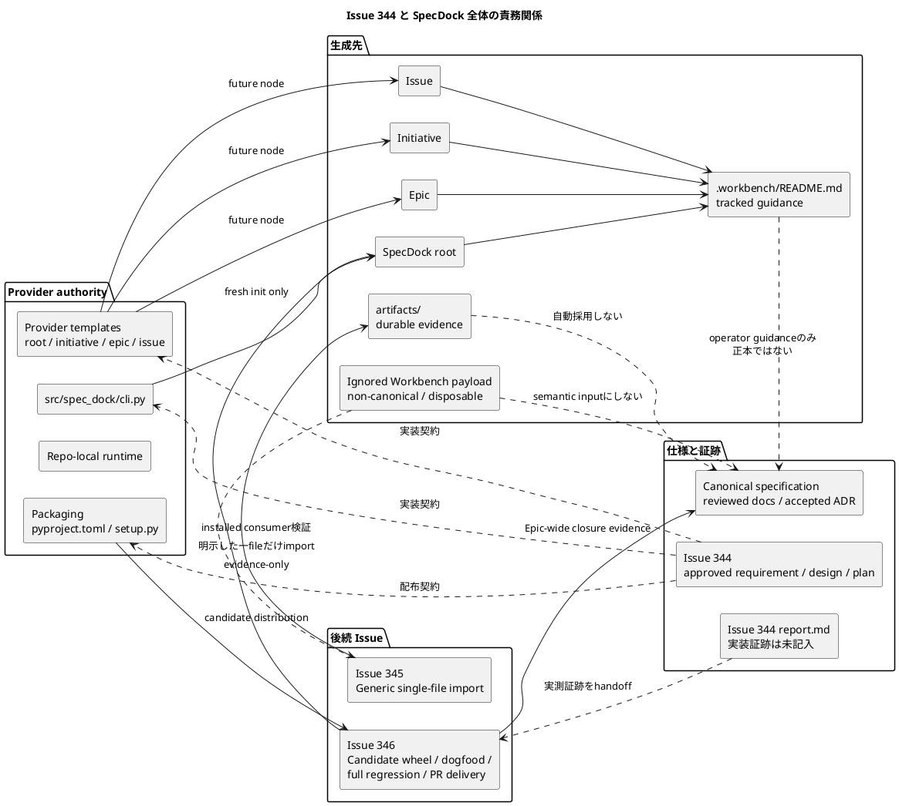
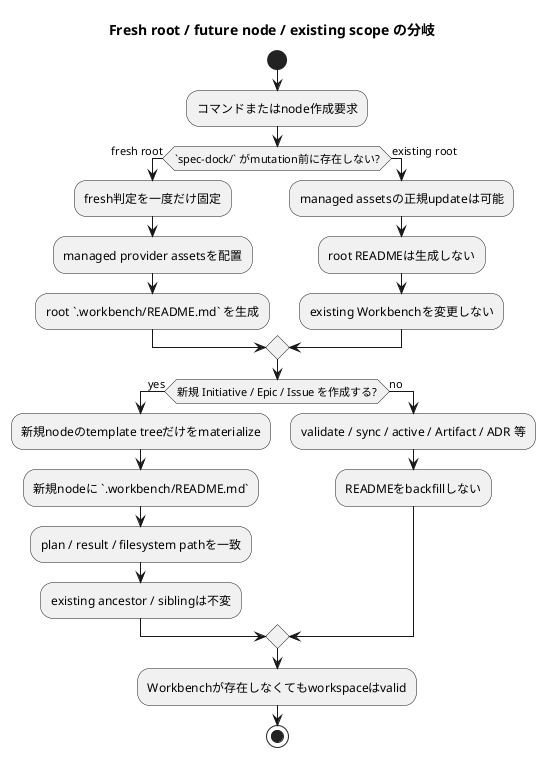
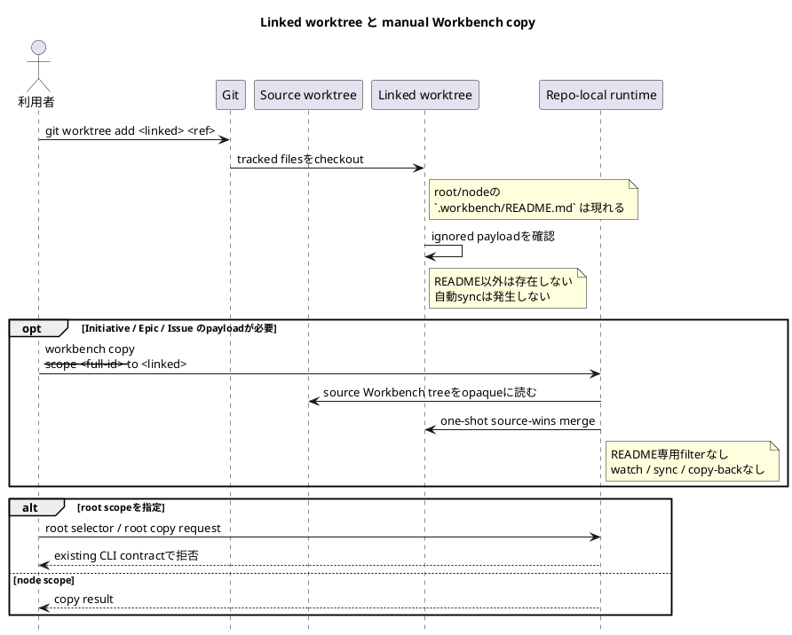
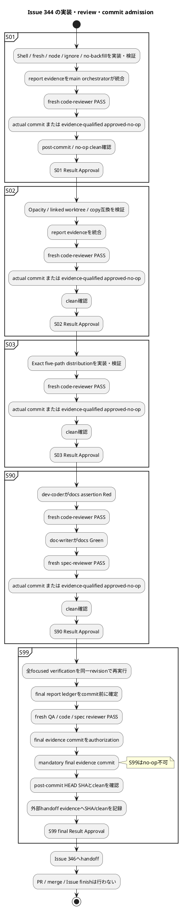

# Issue 344 新メンバー向け説明資料

## Workbench Shell Scaffolding — approved 仕様から実装を開始するための全体像

> **現在地**
>
> Issue `iss-00344` の `requirement.md`、`design.md`、`plan.md` は `approved` です。一方、`report.md` は実装証跡を受け入れるための `draft` scaffold のままで、S01〜S99 の実装、テスト、レビュー、commit、Result Approval はまだ実施されていません。
> したがって、現在は **「仕様と実装計画は承認済み、実装は未開始」** という状態です。実装済み、test 済み、PR-ready、merge-ready、Issue 完了とは扱いません。

---

## 1. Source baseline

| 項目                  | 基準                                                                                   |
| ------------------- | ------------------------------------------------------------------------------------ |
| Repository          | `chemitaro/spec-dock`                                                                |
| Current branch      | `iss-00344-workbench-shell-scaffolding`                                              |
| Default branch      | `main`                                                                               |
| Exact commit        | `bb5d02beb323fa5a44d4b5f66adb60c4aa5651e8`                                           |
| Branch verification | GitHub connector 上で current branch と exact commit が `identical`、ahead/behind ともに `0` |
| Active Issue        | `iss-00344-workbench-shell-scaffolding`                                              |
| Parent Epic         | `epic-00343-workbench-shell-and-explicit-file-artifact-import`                       |
| 基準日                 | 2026-07-29                                                                           |

Exact commit は、Issue 344 の plan を fresh review PASS に昇格し、planning completion を記録した commit です。provider 実装の完了を表す commit ではありません。

### Issue 344 の正本パス

```text
spec-dock/initiatives/init-local-00002-prototype-feature-expansion/
  epics/epic-00343-workbench-shell-and-explicit-file-artifact-import/
    issues/iss-00344-workbench-shell-scaffolding/
      requirement.md
      design.md
      plan.md
      report.md
```

このうち、実装が従う approved 仕様は `requirement.md`、`design.md`、`plan.md` です。`report.md` は、実装後に実測結果を記録する観測証跡台帳です。

### 親 Epic の参照パス

```text
spec-dock/initiatives/init-local-00002-prototype-feature-expansion/
  epics/epic-00343-workbench-shell-and-explicit-file-artifact-import/
    requirement.md
    design.md
    plan.md
```

注意点として、exact commit 時点の親 Epic 3文書は frontmatter 上 `draft` です。本資料はそれらを Issue 344 の親スコープ、責務分割、依存関係の参照元として扱いますが、状態を勝手に `approved` へ読み替えません。

---

## 2. 5分要約

1. **Workbench は一時作業場所です。**
   下書き、調査メモ、model の途中成果などを置けますが、canonical specification ではありません。

2. **Git に残す Workbench file は direct child の `.workbench/README.md` だけです。**
   その他の file、subdirectory、binary、nested README、case variant は Git ignore 対象です。

3. **README shell を自動生成するのは fresh root と今後新規作成する node だけです。**
   既存の root、Initiative、Epic、Issue には backfill しません。

4. **README 以外の Workbench content は opaque です。**
   SpecDock はそれを metadata、ADR、Artifact、dependency、authoring source、canonical input として parse しません。Workbench が削除されても workspace は valid です。

5. **別の linked worktree へ README を移すのは Git checkout の役割です。**
   ignored payload は checkout では移りません。必要な node についてだけ、利用者が明示的に one-shot `workbench copy` を実行します。root Workbench の copy route は提供しません。

6. **Issue 344 は shell の生成と互換性を担当します。**
   任意の一 file を Artifact として保存する generic import は Issue 345、candidate wheel、dogfood、full regression、Epic review、PR delivery は Issue 346 の担当です。

7. **実装順序は `S01 → S02 → S03 → S90 → S99` の一本道です。**
   各 step は review、actual commit または厳格な approved-no-op、clean check、Result Approval を終えるまで次 step を開始できません。S99 だけは mandatory final evidence commit が必要で、no-op は禁止です。

Issue 344 の目的、no-backfill、README-only tracking、semantic opacity、manual-copy-only の境界は approved requirement に固定されています。

---

## 3. 平易な用語集

| 用語                         | この資料での意味                                                                              |
| -------------------------- | ------------------------------------------------------------------------------------- |
| Repository root            | Git checkout の最上位。`spec-dock/` directory の親                                           |
| SpecDock root / root scope | repository 内の `spec-dock/`。Initiative、Epic、Issue より上位の利用者向け scope                     |
| Initiative                 | 複数の Epic を束ねる、大きな目的や投資単位                                                              |
| Epic                       | 複数 Issue で実現する、まとまった利用者価値                                                             |
| Issue                      | 実装、検証、証跡を閉じる最小の作業単位                                                                   |
| Workbench                  | `.workbench/` に置かれる、一時的、worktree-local、破棄可能な作業場所                                      |
| Workbench shell            | Workbench の用途と境界を説明する tracked `.workbench/README.md`                                  |
| Artifact                   | 保存価値のある evidence file を置く `artifacts/` 配下の成果物                                         |
| Canonical specification    | reviewed workflow を経て採用された requirement、design、plan、accepted ADR などの正本                 |
| Evidence-only              | 証拠として保存されているが、仕様への採用や正しさを自動的には意味しない状態                                                 |
| Provider                   | package と consumer workspace を生成する一次実装。主に `src/spec_dock/`                            |
| Dogfood                    | SpecDock repository が自分自身を利用している `spec-dock/**` projection                            |
| Backfill                   | 既存の root や node に、後から自動的に新しい file を追加すること                                             |
| Opaque                     | file 名や内容を業務上の意味に解釈しないこと                                                              |
| Linked worktree            | 同じ Git repository の別 branch・commit を別 directory に checkout する Git worktree            |
| Source-wins                | manual copy 時、source 側と衝突する entry は既存 copy contract に従い source 側が優先されること              |
| Result Approval            | main orchestrator が、evidence、review、commit/no-op、clean state を確認して次 step を許可する判断      |
| Approved-no-op             | 本当に変更が不要な場合だけ、対象、確認 command、clean diff、read-only 確認を証跡化して commit の代わりに認める close state |

Workbench や Artifact は、保存または参照されたというだけでは canonical になりません。明示 import の結果も evidence-only であり、canonical adoption には別の reviewed workflow が必要です。

---

## 4. 全体の関係



### Provider と dogfood の違い

* `src/spec_dock/` は一次実装 authority です。
* `src/spec_dock/assets/spec_dock/**` は、consumer に配布される runtime、template、docs の source です。
* repository 内の `spec-dock/**` は dogfood projection です。
* Issue 344 では dogfood 側を一次実装として手編集しません。
* provider から candidate wheel を作り、正式 update 経路で dogfood へ反映して検証する責任は Issue 346 にあります。

この provider-first 境界は Issue requirement、design、plan のすべてに明記されています。

---

## 5. 現状と理想状態

| 観点                    | Exact commit 時点の現状                             | Issue 344 完了後の理想                                                |
| --------------------- | ---------------------------------------------- | --------------------------------------------------------------- |
| Root Workbench README | fresh init でも生成しない                             | fresh `spec-dock init` だけが `spec-dock/.workbench/README.md` を生成 |
| Node Workbench README | Initiative / Epic / Issue template に asset がない | 今後作成する3種類の node だけが README を持つ                                  |
| Existing scope        | README なし                                      | そのまま。update や通常操作でも backfill しない                                |
| Git ignore            | `.workbench/` 全体を ignore                       | exact top-level `.workbench/README.md` だけ tracking eligible     |
| Workbench contents    | semantic prune は既に存在                           | README が追加されても prune、opacity、optional 性を維持                      |
| Worktree 間移動          | node-scoped one-shot copy が存在                  | README は checkout、ignored payload は必要時だけ manual copy            |
| Package               | hidden Workbench README asset なし               | source、wheel、sdist、installed resources で exact inventory        |
| `setup.py` prune      | nested template README を広く削除                   | exact 5 path を保存し、その他の stale nested README を削除                  |
| Docs                  | 新 shell 契約を説明していない                             | optional、no-backfill、Git、copy、security、authority を説明            |
| Report                | planning ledger と scaffold placeholders        | 実際の Red/Green、tests、reviews、commit、clean、handoff を記録            |

現在の provider installer fallback は、まだ `.workbench/` 全体を ignore する設定です。Issue design も、root README、node asset、package inclusion、build prune が未変更である現状を明示しています。

---

## 6. Issue 344・345・346 の責務

| Issue                                                | 主責務                                | 含むもの                                                                                                                                                          | 含まないもの                                                                                     |
| ---------------------------------------------------- | ---------------------------------- | ------------------------------------------------------------------------------------------------------------------------------------------------------------- | ------------------------------------------------------------------------------------------ |
| **344 — Workbench Shell Scaffolding**                | Workbench shell の生成と既存互換           | fresh root、future nodes、README-only tracking、no-backfill、opacity、linked worktree/copy positioning、exact 5 README distribution、provider docs、focused evidence  | generic import 実装、candidate-wheel consumer E2E、dogfood projection、full regression、PR、merge |
| **345 — Generic Single-File Artifact Import**        | 明示した exactly one file を Artifact 化 | root/node target、repository 内外 source、binary-safe bytes、naming、collision、publication、privacy、evidence-only result                                             | Workbench shell、dogfood、Epic-wide final delivery                                           |
| **346 — Integration Distribution And Final Quality** | 344 と 345 の配布・統合・最終品質・PR delivery  | candidate wheel、fresh consumer、existing consumer update/no-backfill、dogfood、manual scenario、full regression、Epic-wide QA/code/spec review、push、PR preparation | 人間による merge                                                                                |

Issue 344 と 345 は focused milestone commit までを閉じ、per-Issue PR を作りません。Issue 346 が両方の direct dependency を受けて PR Delivery Gate と Merge Preparation Gate を閉じます。merge は一貫して人間のみです。

---

## 7. Fresh と existing の境界

### Fresh root

`spec-dock/` path が mutation 前に存在しない場合だけ fresh と判定します。

```text
<repository-root>/
└── spec-dock/
    └── .workbench/
        └── README.md
```

fresh 判定は、file、directory、symlink の作成前に一度だけ固定します。pre-existing empty `spec-dock/` directory も existing として扱うため、README を追加しません。

### Future node

Issue 344 導入後に新規作成する node だけが README を得ます。

```text
spec-dock/initiatives/<initiative>/.workbench/README.md

spec-dock/initiatives/<initiative>/
  epics/<epic>/.workbench/README.md

spec-dock/initiatives/<initiative>/
  epics/<epic>/
    issues/<issue>/.workbench/README.md
```

新規 child を作成しても、existing ancestor や sibling の Workbench は変更しません。

### Existing root / node

次の操作を backfill trigger にしてはいけません。

* existing workspace に対する `init` または `update`
* `validate`
* `sync`
* active context の切り替え
* Artifact の作成
* ADR の作成
* future child の作成
* README の有無を確認するだけの read-only 操作

existing `.workbench/` 内の entry inventory、file bytes、names、mtime も保全対象です。managed provider assets、docs、runtime、`.gitignore` の通常 update は可能ですが、existing scope に README を追加してはいけません。



---

## 8. README-only tracking と Workbench の不透明性

### 目標 Git ignore contract

provider `.gitignore` と installer fallback の両方を、次の同一 contract にします。

```gitignore
**/.workbench/*
!**/.workbench/README.md
**/.workbench/README.md/**
```

意味は次の通りです。

* exact pathname の `.workbench/README.md` だけを tracking 候補へ戻す。
* `.workbench/subdir/README.md` は対象外。
* `.workbench/readme.md` など case variant は対象外。
* `.workbench/README.md/child` のような descendant は対象外。
* `.workbench-notes/` など near-name directory には影響させない。
* file extension、encoding、depth、content による例外を作らない。

この pathname contract は real Git repository で regular file、symlink、directory、nested path、case variant、near-name を含む matrix として検証する計画です。

### README 以外の Workbench content

README 以外は次の性質を持ちます。

| 性質                       | 意味                                        |
| ------------------------ | ----------------------------------------- |
| Git ignored              | 通常の Git tracking 対象にしない                   |
| Worktree-local           | linked worktree の checkout だけでは移らない       |
| Disposable               | worktree や Workbench を削除してもよい             |
| Non-canonical            | specification や workflow authority にしない   |
| Opaque                   | Markdown、binary、invalid UTF-8 を問わず意味解釈しない |
| Optional                 | `.workbench/` や README がなくても valid        |
| No automatic publication | 自動 upload、import、sync、copy-back をしない      |

Workbench 内に fake `.meta.json`、ADR に見える Markdown、binary、invalid UTF-8 が置かれても、node discovery、dependency、validate、sync、active context、authoring source manifest の結果を変えてはいけません。

### Security 上の注意

Git ignore は security boundary ではありません。secret、credential、private customer data、その他保存禁止情報を Workbench に置いてはいけません。

---

## 9. 通常 checkout・linked worktree・manual copy

### README は Git checkout で移る

`.workbench/README.md` は tracked file なので、commit された後は通常の branch checkout や `git worktree add` によって別 worktree に現れます。

README を得るために `workbench copy` を実行する設計ではありません。

### Ignored payload は自動では移らない

README 以外の Workbench payload は Git ignored なので、linked worktree を作っただけでは現れません。

必要な場合に限り、Initiative、Epic、Issue の full ID を指定して明示的に one-shot copy します。

```bash
./spec-dock/scripts/spec-dock workbench copy \
  --scope <full-id> \
  --to <linked-worktree>
```

### Copy の重要な互換境界

`workbench copy` の利用目的は ignored payload の移動ですが、実装は README 専用 filter を持たない opaque whole-tree copy のままです。

* source / target の README が同じ bytes なら、copy 後も content diff はない。
* README が異なる場合も、README だけを除外する特別処理は追加しない。
* existing source-wins behavior を維持する。
* destination-only entry preservation、collision error、atomicity、symlink-object behavior を維持する。
* root selector、root bulk copy、root path-selection route は追加しない。
* watch、hook、continuous sync、copy-back は追加しない。



この役割分担は、README は checkout、node-scoped ignored payload は optional manual helper、root payload は同 helper の対象外、という形で requirement に固定されています。

---

## 10. README asset と generic scaffolding

### 4つの Workbench README

provider には、次の4 asset を置く計画です。

```text
src/spec_dock/assets/spec_dock/templates/root/.workbench/README.md
src/spec_dock/assets/spec_dock/templates/initiative/.workbench/README.md
src/spec_dock/assets/spec_dock/templates/epic/.workbench/README.md
src/spec_dock/assets/spec_dock/templates/issue/.workbench/README.md
```

4 file は byte-identical でなければなりません。

共通 README は少なくとも次を説明します。

* Workbench は temporary、worktree-local、disposable、non-canonical。
* tracked file は direct child の `README.md` だけ。
* その他の entry は Git ignored。
* Git ignore は security boundary ではない。
* durable に残す一 file は generic Artifact import で明示保存する。
* import は evidence-only。
* canonical adoption は別の reviewed workflow。
* README は Git checkout で別 worktree に現れる。
* node-scoped payload だけ manual `workbench copy` で移せる。
* root Workbench は copy helper の対象外。
* automatic sync、copy-back はない。

### Generic exact-copy と placeholder render

node template を materialize する `copy_scaffolded_tree()` は、README 専用ロジックを持たない generic primitive として修正する計画です。

| 入力 file                                                | 予定挙動                                       |
| ------------------------------------------------------ | ------------------------------------------ |
| Placeholder replacement 後も source bytes と同じ UTF-8 file | text rewrite せず exact byte copy            |
| Placeholder replacement により bytes が変わる file            | 既存の text render/write                      |
| README 以外の unchanged UTF-8 file                        | 同じ exact-copy contract                     |
| CRLF を含む unchanged file                                | newline rewrite を起こさず bytes を維持            |
| Binary や別経路の file                                      | approved generic scaffolder contractを逸脱しない |

重要なのは、`.workbench`、`README.md`、node kind の名前を見て分岐しないことです。path-agnostic な「render 結果が同じなら exact copy、変わるなら render」という契約です。

---

## 11. Exact five README distribution

配布対象の README inventory は、正規化した次の subtree を基準にします。

```text
spec_dock/assets/spec_dock/templates/
```

この subtree 内で許可される README は、exactly 5 paths です。

| 番号 | Normalized relative path          | 用途                      |
| -: | --------------------------------- | ----------------------- |
|  1 | `README.md`                       | template 全体の説明          |
|  2 | `root/.workbench/README.md`       | fresh root shell        |
|  3 | `initiative/.workbench/README.md` | future Initiative shell |
|  4 | `epic/.workbench/README.md`       | future Epic shell       |
|  5 | `issue/.workbench/README.md`      | future Issue shell      |

検証 surface は4つです。

1. provider source tree
2. built wheel
3. normalized sdist
4. installed package resources

4つの Workbench README は、全 surface で provider source と同じ bytes でなければなりません。

### `pyproject.toml`

既存の broad nested README exclusion は、4つの hidden-directory README にも一致する可能性があります。そのため、削除するか exact paths と両立する形へ限定します。

### `setup.py`

custom `build_py` は通常 copy 後に stale build output を prune しています。Issue 344 ではこの prune を次の挙動に変えます。

* exact five-path allowlist を保存する。
* 4つの hidden `.workbench/README.md` を削除しない。
* allowlist 外の stale nested README は引き続き削除する。
* broad pattern を単純に無効化して余計な README を配布することも禁止する。

つまり、「すべて残す」のではなく、**exact 5 paths だけ残す fail-closed contract** です。

---

## 12. 実装順序と gate

### Step の一本道

| Step    | 主な成果                                                                                            | 次へ進む条件                    |
| ------- | ----------------------------------------------------------------------------------------------- | ------------------------- |
| **S01** | 4 README assets、fresh root、future nodes、generic exact-copy、README-only tracking、no-backfill     | S01 Result Approval       |
| **S02** | semantic opacity、linked-worktree checkout、manual copy、source-wins、root rejection                | S02 Result Approval       |
| **S03** | `pyproject.toml`、`setup.py`、exact 5-path distribution、static quality、Issue 346 handoff seed     | S03 Result Approval       |
| **S90** | provider docs と semantic assertion。test は dev-coder、docs は doc-writer                           | S90 Result Approval       |
| **S99** | aggregate verification、fresh QA/code/spec review、final report evidence commit、Issue 346 handoff | S99 final Result Approval |

依存関係は厳密に次の一本です。

```text
S01 → S02 → S03 → S90 → S99
```

S02 は S01 の Result Approval 前に implementation、review、commit を始められません。同じ制約が全 step 間に適用されます。

### S01・S02・S03・S90 の共通 gate

各 step では、概ね次の順序を崩せません。

1. 担当 worker が Red/Green、変更内容、risk、report 転記用 summary を返す。
2. main orchestrator が output を検証し、canonical `report.md` へ統合する。
3. fresh reviewer の blocking finding をすべて閉じる。
4. milestone actual commit を作る。
5. 差分が本当に存在しない場合だけ、厳格な evidence を伴う `approved-no-op` を認める。
6. commit または no-op 確定後に `git status --short` が clean であることを確認する。
7. close state を `committed` または `approved-no-op` に確定する。
8. main orchestrator が Result Approval を与える。
9. その後にだけ次 step を開始する。

S90 はさらに役割を分離します。

* `dev-coder` が docs semantic assertion を追加し、期待どおりの Red を作る。
* fresh `code-reviewer` が test contract を review する。
* `doc-writer` が provider docs 4件だけを変更して Green にする。
* fresh `spec-reviewer` が docs と approved spec の整合を review する。

### S99 の特別な gate

S99 は no-op を認めません。

1. 全 verification、closure、handoff、final report ledger、commit scope、外部 evidence destination を **commit 前** に `report.md` へ記録する。
2. fresh `qa-reviewer`、issue-wide fresh `code-reviewer`、fresh `spec-reviewer` がすべて PASS する。
3. main orchestrator が final evidence commit を authorization する。これはまだ最終 Result Approval ではない。
4. **mandatory final report/review evidence commit** を作る。
5. `git rev-parse HEAD` と `git status --short` を実行する。
6. 実際の SHA と clean result は、宣言済みの外部 handoff evidence に記録する。
7. external SHA/clean evidence と `committed` close state の確認後にだけ S99 final Result Approval を与える。
8. PR、merge preparation、Issue finish はせず、Issue 346 handoff で停止する。

S99 では `approved-no-op` が明示的に禁止されています。



---

## 13. `report-evidence-scaffold` blocker の意味

Exact commit の `report.md` には、次の実装用 placeholder が残っています。

* 実装サマリー

* S01〜S99 の session log

* 実行 command と結果

* Red / Green / Refactor evidence

* test closure

* worker evidence

* reviewer verdict

* milestone commit

* post-commit clean check

* final QA/code/spec gate

* final commit ledger

runtime の report evidence gate は、こうした scaffold marker が残っている場合、次の状態を返します。

```text
status: blocked
reason_code: report-evidence-scaffold
detail: report.md still contains scaffold placeholders.
```

これは source code 上、意図された fail-closed 判定です。

### この blocker が意味しないこと

* approved requirement の欠陥ではない。
* approved design の欠陥ではない。
* approved plan の review failure ではない。
* 実装が失敗したことを意味しない。
* test が失敗したことを意味しない。

### この blocker が意味すること

* 実装証跡を記録すべき欄がまだ未記入。
* 実装開始・完了・review pass・commit clean を証明できない。
* placeholder を残したまま「execution-ready」「completed」と判断してはいけない。
* 実際の作業を行わずに placeholder だけを削除して解除してはいけない。

したがって `report-evidence-scaffold` は、現在の **「planning 完了、implementation 未開始」** と整合する期待された readiness blocker です。plan approval checklist は完了していますが、final execution checklist は未チェックです。

---

## 14. 主要 path

### Approved Issue specifications

```text
spec-dock/initiatives/init-local-00002-prototype-feature-expansion/
  epics/epic-00343-workbench-shell-and-explicit-file-artifact-import/
    issues/iss-00344-workbench-shell-scaffolding/
      requirement.md
      design.md
      plan.md
      report.md
```

### Provider 実装予定 path

| Path                                                                                    | 主責務                                                                            |
| --------------------------------------------------------------------------------------- | ------------------------------------------------------------------------------ |
| `src/spec_dock/cli.py`                                                                  | pre-mutation fresh 判定、root README copy、fallback ignore、legacy README allowlist |
| `src/spec_dock/assets/spec_dock/.gitignore`                                             | exact README-only tracking                                                     |
| `src/spec_dock/assets/spec_dock/templates/root/.workbench/README.md`                    | fresh root asset                                                               |
| `src/spec_dock/assets/spec_dock/templates/initiative/.workbench/README.md`              | future Initiative asset                                                        |
| `src/spec_dock/assets/spec_dock/templates/epic/.workbench/README.md`                    | future Epic asset                                                              |
| `src/spec_dock/assets/spec_dock/templates/issue/.workbench/README.md`                   | future Issue asset                                                             |
| `src/spec_dock/assets/spec_dock/scripts/spec_dock_runtime/infra/template_scaffolder.py` | path-agnostic exact-copy / placeholder render                                  |
| `pyproject.toml`                                                                        | package-data include / broad exclusion の限定                                     |
| `setup.py`                                                                              | custom `build_py` post-build exact allowlist prune                             |

### Provider docs

```text
src/spec_dock/assets/spec_dock/docs/README.md
src/spec_dock/assets/spec_dock/docs/guide.md
src/spec_dock/assets/spec_dock/docs/reference_worktree.md
src/spec_dock/assets/spec_dock/templates/README.md
```

### 原則 read/verify-only

```text
src/spec_dock/assets/spec_dock/scripts/spec_dock_runtime/
  application/workbench.py
  infra/fs_cli.py
  infra/fs_repo.py
```

これらの copy/discovery production source を変更する必要が出た場合、approved design の範囲を超えるため、実装を止めて design amendment と fresh review へ戻ります。

### 主な test path

```text
tests/unit/infra/test_init_update.py
tests/unit/infra/test_runtime_template_scaffolder.py
tests/unit/infra/test_runtime_fs_repo_workbench_opacity.py
tests/cli_runtime/test_runtime_new_doc_s09.py
tests/cli_runtime/test_new.py
tests/cli_runtime/test_workbench.py
```

### Dogfood projection

```text
spec-dock/**
```

Issue 344 では一次実装として変更しません。Issue 346 で candidate wheel と正式 update 経路から検証します。

---

## 15. 主な回帰リスクと検出観点

| Risk                   | 典型的な誤実装                                     | 検出観点                                         |
| ---------------------- | ------------------------------------------- | -------------------------------------------- |
| Existing scope の汚染     | update 後に既存 root/nodeへREADME追加              | before/after inventory、bytes、names、mtime     |
| Fresh 判定の遅延            | directory 作成後にfresh判定し、existingへbackfill    | mutation前の `lexists` 相当判定                    |
| Git payload 漏洩         | README の negation rule が広すぎる                | real Git matrix、nested/case/near-name        |
| README 自体がignore       | `.workbench/` 全体ignoreを残す                   | `git check-ignore -v`、`git status --short`   |
| Semantic opacity の破壊   | READMEやMarkdownをmetadataとして読む               | fake metadata、binary、invalid UTF-8           |
| Exact-copy の破壊         | `read_text` / `write_text` でCRLFをLFへ変更      | unchanged CRLF fixtureのbyte比較                |
| Placeholder render の破壊 | 全fileをcopyしてtokenを残す                        | changed placeholder fixture                  |
| README-specific branch | pathやfilenameでcopy方式を切り替える                  | path-neutral non-README fixture              |
| Workbench copy 互換破壊    | README除外filterやroot routeを追加                | divergent README、root selector rejection     |
| Automatic sync の混入     | linked worktree作成だけでpayload移行               | copy前後 inventory                             |
| Package 欠落             | sourceでは存在するがwheelにない                       | source/wheel/sdist/installed exact inventory |
| Package 過剰収録           | stale nested READMEが残る                      | exact 5-path equality                        |
| `setup.py` prune 誤り    | hidden READMEまで削除、または全README保存              | pre-prune / post-prune snapshot              |
| Scope侵食                | Issue 345/346機能をIssue344で実装                 | changed-path review、report handoff           |
| Gate順序違反               | review前commit、clean前Approval、Approval前次step | report gate、commit history、clean evidence    |
| S99自己循環                | final SHAを同じcommitのreportへ書こうとする            | SHA/cleanを外部 evidence に限定                    |
| Premature completion   | focused testだけでPR/merge-readyを主張            | Issue346/human-only boundary inspection      |

Issue requirement は、backfill、Git exposure、semantic parse、distribution 欠落、Issue 345/346 scope侵食を blocking risk signal として定義しています。

---

## 16. 予定されている検証

以下は **実行済み結果ではなく、approved plan に記載された予定 command** です。

### S01: generation・ignore・no-backfill

```bash
uv run pytest tests/unit/infra/test_init_update.py -k 'workbench or readme'

uv run pytest \
  tests/unit/infra/test_runtime_template_scaffolder.py::test_copy_scaffolded_tree_uses_exact_copy_for_unchanged_utf8_bytes \
  tests/unit/infra/test_runtime_template_scaffolder.py::test_copy_scaffolded_tree_still_renders_changed_placeholder_text \
  tests/unit/infra/test_runtime_template_scaffolder.py::test_copy_scaffolded_tree_exact_copy_is_path_agnostic

uv run pytest tests/cli_runtime/test_runtime_new_doc_s09.py

uv run pytest \
  tests/unit/infra/test_init_update.py::TestInitUpdate::test_update_and_force_init_do_not_backfill_workbench_readme \
  tests/cli_runtime/test_new.py::TestCliNew::test_workbench_no_backfill_preserves_existing_scopes_across_all_triggers

git diff --check
```

### S02: opacity・linked worktree・copy

```bash
uv run pytest tests/unit/infra/test_runtime_fs_repo_workbench_opacity.py
uv run pytest tests/cli_runtime/test_workbench.py
git diff --check
```

### S03: build prune・distribution

```bash
uv run pytest \
  tests/unit/infra/test_init_update.py::TestInitUpdate::test_workbench_readme_build_prune_preserves_allowlist_and_removes_stale_nested_readme \
  tests/unit/infra/test_init_update.py::TestInitUpdate::test_workbench_readme_distribution_inventory_and_bytes_match_all_surfaces

uv run pytest tests/unit/infra/test_init_update.py
```

加えて、changed path に対する scoped Ruff check、Ruff format check、Mypy、`git diff --check` を行います。

### S90: docs

```bash
uv run pytest \
  tests/unit/infra/test_init_update.py::TestInitUpdate::test_shipped_docs_describe_workbench_readme_boundary
```

### S99: same-revision aggregate

* S01〜S90 の exact verification を同一 revision で再実行
* TC-344-001〜010 と report evidence の照合
* fresh QA review
* issue-wide fresh code review
* fresh spec review
* mandatory final evidence commit
* post-commit HEAD と clean status
* Issue 346 handoff

Full repository regression、candidate-wheel consumer E2E、dogfood projection、Epic-wide review は Issue 346 の責任です。ただし、Issue 344 の focused failure を Issue 346 へ先送りすることはできません。

---

## 17. 初日チェックリスト

### 読み始める前

* [ ] repository が `chemitaro/spec-dock` であることを確認する。
* [ ] branch が `iss-00344-workbench-shell-scaffolding` であることを確認する。
* [ ] HEAD が `bb5d02beb323fa5a44d4b5f66adb60c4aa5651e8` であることを確認する。
* [ ] 作業開始前の `git status --short` が意図した状態であることを確認する。

### 仕様の理解

* [ ] Issue 344 `requirement.md` の目的、禁止事項、AC を読む。
* [ ] `design.md` の `DES-344-001`〜`DES-344-009` を読む。
* [ ] `plan.md` の S01〜S99 と step gate を読む。
* [ ] `report.md` は未実装 evidence scaffold であると理解する。
* [ ] Parent Epic の Issue 344/345/346 ownership を確認する。
* [ ] Workbench、Artifact、canonical specification の違いを説明できる。
* [ ] provider と dogfood の違いを説明できる。

### 実装開始時

* [ ] S01 以外の実装を先に始めない。
* [ ] `spec-dock/**` を一次実装として手編集しない。
* [ ] fresh 判定を mutation 前に固定する。
* [ ] existing root/node の snapshot を取る。
* [ ] 4 README の canonical bytes を変更しない。
* [ ] generic exact-copy を README-specific branch にしない。
* [ ] copy/discovery read-only filesを変更しない。
* [ ] Red が期待した理由で失敗することを確認する。
* [ ] 実測結果だけを `report.md` へ記録する。

### Step 終了時

* [ ] fresh reviewer の PASS がある。
* [ ] finding がすべて閉じている。
* [ ] actual commit または証拠付き approved-no-op がある。
* [ ] `git status --short` が clean。
* [ ] close state が確定している。
* [ ] main orchestrator の Result Approval がある。
* [ ] Result Approval 前に次 step を開始していない。

### Delivery 境界

* [ ] Issue 345 の generic import を実装していない。
* [ ] Issue 346 の dogfood/full regression/PR delivery を先取りしていない。
* [ ] Issue 344 で PR-ready、merge-ready、finish を主張していない。
* [ ] merge は人間だけが行うと理解している。

---

## 18. FAQ

### Q1. なぜ existing root や node に README を backfill しないのですか？

既存 workspace の user-owned state と Git diff を予期せず変更しないためです。Workbench は optional なので、既存 scope にないこと自体は不具合ではありません。update 後に新しく作る node から新 contract を適用します。

### Q2. `.workbench/README.md` を削除してもよいですか？

はい。README と Workbench の存在は validity 要件ではありません。削除しても validate や sync が失敗する設計にはしません。

### Q3. README は canonical specification ですか？

いいえ。README は operator guidance です。人間や model が Workbench の用途と境界を理解するための説明であり、workflow authority や canonical input ではありません。

### Q4. README 以外の Workbench file は Git に入れてはいけませんか？

標準 contract では Git ignored です。保存価値がある一 file は、Issue 345 が提供する generic Artifact import で明示的に `artifacts/` へ保存します。

### Q5. Artifact に import すれば canonical になりますか？

なりません。import は evidence-only です。canonical specification へ反映するには別の reviewed adoption workflow が必要です。

### Q6. `workbench copy` は ignored file だけを選んで copy しますか？

利用目的は ignored payload の移動ですが、実装 contract は opaque whole-tree source-wins です。README を特別に除外する selector は追加しません。generated README が同一 bytes なら通常は差分が出ません。

### Q7. root Workbench を `workbench copy` できますか？

できません。helper は Initiative、Epic、Issue の node scope 用です。root selector、root bulk copy、root path-selection route は追加しません。

### Q8. linked worktree を作ると何が移りますか？

tracked README は Git checkout により現れます。その他の ignored payload は現れません。必要な node についてだけ manual one-shot copy を実行します。

### Q9. 自動 sync や copy-back を追加した方が便利ではありませんか？

本 Issue の approved contract に反します。watch、hook、automatic copy、continuous sync、copy-back は明示的に禁止されています。

### Q10. Generic file import はもう使えますか？

Issue 344 の exact baseline では未実装です。Issue 344 の README と docs は、Issue 345 が所有する予定の repo-local command を説明しますが、implemented と記述してはいけません。

### Q11. なぜ README が5個ではなく「4つ byte-identical」なのですか？

Distribution inventory は5 pathsですが、その内訳は通常の `templates/README.md` 1件と、Workbench README 4件です。byte-identical 要件は後者4件に適用されます。

### Q12. `setup.py` の prune を削除すれば簡単ではありませんか？

削除すると stale nested README まで package に混入する恐れがあります。必要なのは prune の廃止ではなく、exact 5-path allowlist を保存しつつ、それ以外を削除することです。

### Q13. `report-evidence-scaffold` は仕様 review をやり直す理由ですか？

通常は違います。現在は実装 evidence が未記入なので、scaffold marker を検知して fail-closed になっています。実装、tests、reviews、commit、clean evidence を実際に記録して解消する状態です。

### Q14. Issue 344 の最後に PR を作りますか？

作りません。Issue 344 は Issue 346 へ evidence を handoff して停止します。Issue 346 が candidate wheel、dogfood、full regression、Epic-wide review、push、PR preparation を担当します。

### Q15. Issue 346 が PR を作れば自動 merge してよいですか？

いいえ。計画上の最終到達点は mergeable PR preparation です。merge は人間だけが行います。

---

## 19. 仮定・不確実性・未検証事項

### 確定していること

* GitHub connector で repository、branch、exact commit、対象7文書へアクセスできた。
* Issue 344 requirement/design/plan は approved。
* Issue 344 report は draft scaffold。
* plan の planning review gate は完了している。
* implementation/final exit checklist は未完了。
* current provider ignore はまだ `.workbench/` 全体 ignore。
* S01〜S99 の実行順序と gate は approved plan に固定されている。

### 現時点で未検証のこと

* 4 README asset が実際に作成されること。
* fresh init と future node 生成が実際に成功すること。
* existing scope の no-backfill が実測で成立すること。
* generic exact-copy が CRLF bytes を保つこと。
* real Git ignore matrix が成立すること。
* source、wheel、sdist、installed resources の exact 5-path inventory。
* `setup.py` post-build prune が allowlist を保存し stale README を除去すること。
* linked worktree と manual copy の新しい tests。
* provider docs semantic assertion。
* Ruff、Mypy、focused pytest、aggregate verification の結果。
* fresh QA/code/spec reviewer verdict。
* milestone commit、final evidence commit、post-commit clean state。
* Issue 346 handoff、PR delivery、merge preparation。
* human merge。

これらは approved target と実装計画であり、exact commit 時点の観測済み成果ではありません。package backend の hidden path behavior も、S03 の build evidence まで未検証です。

---

## 20. 最重要ルール

> **Workbench は作業場所、Artifact は永続 evidence、canonical specification は reviewed adoption の結果です。三者を混同しないでください。**
>
> **Issue 344 は shell を作る Issue です。import は Issue 345、配布統合と PR は Issue 346、merge は人間の責任です。**
>
> **実装は S01 から始め、review → commit/no-op → clean → Result Approval を終えるまで次 step へ進みません。S99 は必ず final evidence commit を作り、no-op では閉じません。**
