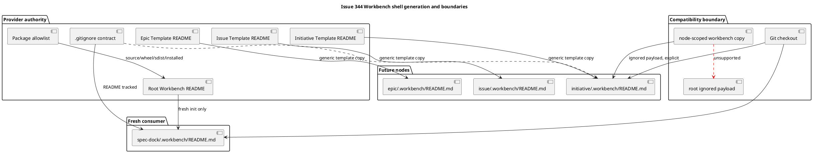

# iss-00344 Workbench Shell Scaffolding — Issue 設計書（Standard）

## 0. 文書の位置づけ

この文書は、approved `requirement.md` を満たす provider-first の設計差分、責任配置、互換境界、失敗時の扱い、検証可能な保証を定義する。実装順序と Red-Green-Refactor は `plan.md` で扱う。

設計タグ:

- `[N]`: 実装が従う normative contract。
- `[P]`: 意味論を維持すれば実装中に変更できる方針。
- `[E]`: 本 Issue では決定しない上位または sibling scope。

## 1. Standard grade と引き上げガード

### 1.1 Standard とする理由

- provider asset、installer freshness 判定、generic node scaffolding、Git ignore、package inventory、docs と focused tests にまたがるが、既存 layer 内で閉じる変更である。
- schema migration、既存 user data 変換、external API、credentialed mutation はない。
- rollback は provider asset / ignore / package configuration / tests の reviewable diff 単位で可能である。

### 1.2 主なリスク

- fresh / existing 判定を mutation 後に行うと既存 root を backfill する。
- README の再包含 rule が nested payload を Git に露出する。
- `_prune_legacy_scaffold` または package exclusion が4 README を落とす。
- node-scoped `workbench copy` の source-wins behavior を README 専用処理で変える。
- root Workbench に未提供の copy route を示唆する。

### 1.3 strict へ引き上げる条件

- root copy selector または global installer CLI dispatch を追加する。
- existing root / node migration または backfill command が必要になる。
- Workbench を semantic source として parse する。
- generic Artifact import を本 Issue へ取り込む。
- existing `workbench copy` の公開 failure / merge semantics を変更する。

## 2. 正本と追跡

| 種別 | パス / ID | 意味 |
|---|---|---|
| Issue requirement | `requirement.md` | `I344-RQ-001`〜`I344-RQ-011`, `AC-344-*` |
| Epic requirement | `../../requirement.md` | shell、optional、no-backfill、opacity、copy compatibility |
| Epic design | `../../design.md` | provider-first、freshness、ignore、package、manual copy |
| Epic plan | `../../plan.md` | Issue 344 / 345 / 346 の vertical ownership |
| External evidence | `artifacts/20260728t153458z-chatgpt-output-chatgpt-issue-00344-planning-candidate.md` | design / plan candidate、advisory |
| Review evidence | `artifacts/20260728t164218z-chatgpt-output-chatgpt-issue-00344-requirement-final-review.md` | requirement advisory PASS |
| Existing installer | `src/spec_dock/cli.py` | fresh root install、asset sync、legacy prune |
| Existing scaffolder | `src/spec_dock/assets/spec_dock/scripts/spec_dock_runtime/infra/template_scaffolder.py` | generic recursive template copy |
| Existing copy | `src/spec_dock/assets/spec_dock/scripts/spec_dock_runtime/application/workbench.py` | node-scoped one-shot orchestration |
| Existing filesystem copy | `src/spec_dock/assets/spec_dock/scripts/spec_dock_runtime/infra/fs_cli.py` | opaque source-wins merge |
| Packaging | `pyproject.toml` | package include / exclude |
| Build output prune | `setup.py` | custom `build_py` post-build cleanup / stale fixture removal |

| Requirement | Design |
|---|---|
| `I344-RQ-001`, `AC-344-001` | `DES-344-001` |
| `I344-RQ-002`, `AC-344-002` | `DES-344-002` |
| `I344-RQ-003`, `AC-344-003` | `DES-344-003` |
| `I344-RQ-004`, `AC-344-004` | `DES-344-004` |
| `I344-RQ-005`, `AC-344-005` | `DES-344-001`, `DES-344-002`, `DES-344-005` |
| `I344-RQ-006`, `AC-344-006` | `DES-344-006` |
| `I344-RQ-007`, `AC-344-007A/B/C` | `DES-344-007` |
| `I344-RQ-008`, `AC-344-008` | `DES-344-008` |
| `I344-RQ-009`, `AC-344-009` | `DES-344-005`, `DES-344-007` |
| `I344-RQ-010`, `AC-344-010` | `DES-344-009` |
| `I344-RQ-011`, `AC-344-011` | `DES-344-010` |

## 3. 設計意図と非目標

### 3.1 採用する設計方針

- `[N]` Workbench shell は新しい runtime subsystem ではなく、provider asset と既存 scaffold seam の組み合わせとして実装する。
- `[N]` root と3 node kind の README は同一 bytes を持つ4つの explicit provider asset とする。
- `[N]` fresh root だけに root README を配置し、node README は既存 generic recursive template copy に載せる。
- `[N]` no-backfill は既存 Workbench / canonical state に限定し、managed provider assets の正規 update は維持する。
- `[N]` `.gitignore` は top-level `.workbench/README.md` だけを再包含し、その他を深さによらず除外する。
- `[N]` Workbench discovery / copy implementation に README-aware semantic branch を追加しない。
- `[N]` package source / wheel / sdist / installed resources は exact five-file README allowlist で検証する。

### 3.2 採用しない方針

| 方針 | 不採用理由 |
|---|---|
| `.gitkeep` | 利用方法と authority 境界を説明できない |
| update 時 backfill | existing scope を変更する |
| README 専用 copy filter | opaque source-wins contract を壊す |
| root `workbench copy` route | 現行 command と Issue ownership の範囲外 |
| Workbench semantic classifier | disposable / non-canonical と矛盾する |
| global installer CLI import dispatch | generic import は Issue 345 の repo-local runtime 責務 |
| broad nested README inclusion | 意図しない template README を配布する |

## 4. 現状

| 対象 | Current |
|---|---|
| provider `.gitignore` | `.workbench/` 全体を ignore |
| installer fallback ignore | provider と同じ全体 ignore |
| root init | root `.workbench/README.md` を配置しない |
| node templates | `.workbench/README.md` asset がない |
| node create | template tree を再帰 copy するため asset 追加で計画・結果・filesystemへ現せる |
| legacy prune | `templates/README.md` 以外の nested README を除去する |
| package exclusion | nested template README を broad pattern で除外する |
| build output prune | custom `build_py` が通常 copy 後に `templates/*/**/README.md` を除去するため、4 Workbench README も build tree から削除する |
| semantic discovery | exact `.workbench` subtree を top-down prune する |
| `workbench copy` | Initiative / Epic / Issue full ID の node scope、opaque one-shot source-wins |

## 5. 目標設計差分

### DES-344-001 Fresh root boundary

- `[N]` installer mutation の前に `fresh_specdock = not os.path.lexists(specdock_dir)` 相当の freshness を一度だけ確定する。
- `[N]` root README copy は `fresh_specdock` の場合だけ実行する。
- `[N]` pre-existing file、directory、symlink、empty directory は existing とみなし backfill しない。
- `[N]` update と existing `init --force` は managed assets と ignore contract を更新できるが root README を生成しない。
- `[P]` copy seam は既存 text asset copy helper を利用する。

### DES-344-002 Future node shell

- `[N]` Initiative / Epic / Issue template の各 root に `.workbench/README.md` を配置する。
- `[N]` `_scaffold_file_paths` と `copy_scaffolded_tree` の generic recursion を利用し、node-kind-specific runtime branch を追加しない。
- `[N]` new node だけを生成し、ancestor / sibling の canonical state と Workbench state を変更しない。
- `[N]` generic scaffolder は、placeholder replacement 後の UTF-8 bytes が source bytes と同一なら text rewrite をせず exact byte copy する。replacement により bytes が変化する通常 template は既存 text rendering を維持する。
- `[N]` この byte-stable primitive は path / README / Workbench を意味解釈しない generic contract とし、README-specific branch を追加しない。
- `[N]` root は existing exact file-copy seam、node は上記 generic exact-copy branchを使い、4 output の bytes を同一にする。

### DES-344-003 Shared README contract

- `[N]` provider authority は4 asset とし、bytes を完全一致させる。
- `[N]` asset encoding は UTF-8、newline は LF、末尾 newline は1つとし、template placeholder tokenを含めない。
- `[P]` maintenance は1つの source text からの mechanical parity check で補助できるが、新しい generation framework は追加しない。
- `[N]` README は requirement の9 guidance elementsを含む。
- `[N]` command は repository root から `./spec-dock/scripts/spec-dock artifact import file ...` と記載する。
- `[N]` root/node とも tracked README は Git checkout で現れる。
- `[N]` `workbench copy` は Initiative / Epic / Issue の node-scoped ignored payload 用 helper と説明し、root は対象外とする。
- `[N]` root の durable one-file preservation は generic Artifact import を案内する。
- `[N]` 次の fenced block 内部（開始行 `# Workbench` から末尾の空行直前まで）を4 asset共通の canonical Markdown bytes とする。wording変更は design amendment と fresh reviewを要する。

~~~markdown
# Workbench

このディレクトリは、一時的で worktree-local、破棄可能、non-canonical な作業領域です。下書き、調査メモ、model の中間成果など、まだ正本へ採用していないファイルを置けます。Workbench がなくても SpecDock workspace は valid であり、worktree を破棄すると内容も失われ得ます。

## Git と安全上の境界

- Git tracking を意図する Workbench path は、この direct child の `README.md` だけです。
- `.workbench/README.md` 以外の Workbench entry は Git に ignore されます。
- Git ignore は security boundary ではありません。secret、credential、private customer data、その他保存を禁止された情報を置かないでください。
- 人間、model、tool は、この README を含む Workbench content を canonical specification、ADR、metadata、dependency、authoring source として扱ってはいけません。

## 残す価値があるファイル

残す価値がある一つのファイルは、repository root から repo-local runtime を使い、対象の root、Initiative、Epic、Issue scope の `artifacts/` へ Artifact として明示的に import します。

`./spec-dock/scripts/spec-dock artifact import file ...`

ファイルの明示指定は、そのファイルを read / import する許可に限られます。import 結果は evidence-only であり、canonical adoption を意味しません。正本へ反映するには、別の reviewed workflow が必要です。

## linked worktree 間の扱い

- tracked `README.md` は root / node とも通常の Git checkout で別 worktree に現れます。
- その他の ignored Workbench file は自動 copy / sync されません。
- Initiative、Epic、Issue の対応する node-scoped ignored payload は、必要な場合だけ full ID を指定して manual one-shot helper を実行します。

`./spec-dock/scripts/spec-dock workbench copy --scope <full-id> --to <linked-worktree>`

- root `.workbench/` の ignored payload はこの helper の対象外です。root で durable に残す一 file は generic Artifact import を使ってください。
- automatic hook、watch、sync、copy-back はありません。
~~~

### DES-344-004 README-only Git tracking

provider と installer fallback の ignore contract を同一にする。

```gitignore
**/.workbench/*
!**/.workbench/README.md
**/.workbench/README.md/**
```

- `[N]` Git tracking eligibility は entry type ではなく exact pathname identity で定義する。fresh / future shell が生成する exact path は regular file である。
- `[N]` nested `README.md`、case variant `readme.md`、other payload は ignore されたままとする。
- `[N]` exact path が pre-existing symlink の場合、Git ignore は file type を区別できないため pathname として再包含され得る。installer はその entryを生成・変更せず、copy security contractも緩和しない。
- `[N]` exact path が directory の場合は descendant ignore rule により配下 entry を再包含しない。Git は directory 自体を tracking object としない。
- `[N]` `.workbench-notes` など near-name path へ rule を拡張しない。
- `[N]` actual Git repository で regular file、symlink、directory、directory descendant、nested / case variant / near-name を含む `git check-ignore` / status matrix を検証する。

### DES-344-005 No-backfill and preservation

- `[N]` root freshness は write 前に固定する。
- `[N]` node creation は新規 node template tree のみを materialize する。
- `[N]` existing `.workbench` entry、bytes、names、mtime を installer / node creation が変更しない。
- `[N]` existing canonical docs / metadata を無関係に変更しない。
- `[N]` managed docs / templates / scripts / system / `.gitignore` の正規 update は許可する。

### DES-344-006 Semantic opacity

- `[N]` existing exact `.workbench` top-down prune を維持する。
- `[N]` README、metadata-like file、ADR-like Markdown、binary、invalid UTF-8 を parse しない。
- `[N]` validate、sync、dependency、active context、authoring source manifest の observation が Workbench 内容で変化しない。
- `[N]` README は operator guidance であり authority source ではない。

### DES-344-007 Git checkout / copy compatibility

- `[N]` README は Git checkout の責務、ignored payload は node-scoped manual helper の責務とする。
- `[N]` CLI は `--root`、`--from`、`--date`、`--path` と local ID を引き続き拒否する。
- `[N]` byte-identical generated README 同士の copy では content diff がない。
- `[N]` divergent README では filter を追加せず、source-wins whole-tree behavior を維持する。
- `[N]` destination-only entry preservation、collision error、symlink-object behavior、no watch / sync / copy-back を維持する。
- `[N]` `application/workbench.py`、`infra/fs_cli.py`、`infra/fs_repo.py` は原則 read / verify only とし、契約を変える必要が出たら design phase に戻る。

### DES-344-008 Distribution exact allowlist

- `[N]` `_prune_legacy_scaffold` の README preserve ruleを exact allowlist にする。
- `[N]` `pyproject.toml` の broad nested README exclusion を削除または exact paths と両立する形へ限定する。
- `[N]` package data に4つの `.workbench/README.md` を explicit に含める。
- `[N]` `setup.py` の custom `build_py` が通常 copy 後に呼ぶ `_prune_stale_build_outputs()` を、下記5 pathの normalized template-root-relative exact allowlistを保存する cleanupへ変更する。broad nested README patternの単純削除ではなく、allowlist外の stale nested READMEは引き続き除去する。
- `[N]` source / wheel / normalized sdist / installed resources の README inventory は、正規化した `spec_dock/assets/spec_dock/templates/` root からの次の exact relative path 5件だけとする。
  - `README.md`
  - `root/.workbench/README.md`
  - `initiative/.workbench/README.md`
  - `epic/.workbench/README.md`
  - `issue/.workbench/README.md`
- `[N]` 4 Workbench README の bytes を全 surface で比較する。
- `[N]` inventory の探索 root は各 surface で正規化した `spec_dock/assets/spec_dock/templates/` subtree とし、package 全体の README inventory とは解釈しない。

### DES-344-009 Shipped documentation

- `[N]` `docs/README.md`、`docs/guide.md`、`docs/reference_worktree.md`、`templates/README.md` を provider-first に更新する。
- `[N]` shell / optional / no-backfill / README-only tracking / semantic opacity / security / Git checkout / node-scoped copy / root exclusion / evidence-only import を一貫して説明する。
- `[N]` generic import は Issue 345 の未実装機能として位置づけ、実装済みと書かない。

### DES-344-010 Issue-local dogfood projection and PR delivery

- `[N]` provider sourceを実装正本とし、S01〜S90のprovider変更後、S95で正式な `uv run spec-dock update .` を一度だけ実行して、変更対象のmanaged assetsをchecked-in dogfood mirrorへ投影する。
- `[N]` dogfood側を先に、または手作業で修正しない。projection diffはprovider変更に由来する既知のmanaged pathだけに限定し、`spec-dock/initiatives/**`、active node、既存Workbench stateを変更してはならない。
- `[N]` S95はmirror parity、no-backfill、`make lint`、default `uv run pytest`を同一candidate revisionでgreenにする。Issue 344自身のready PRを作成し、exact headへのPR observationを完了してhuman merge前で停止する。
- `[E]` candidate wheel consumer E2E、generic importを含むintegrated dogfood、opt-in full regression、cross-feature repair、Epic-wide QA/code/spec/decision review、残余Epic integration PRは`iss-00346`に残す。
- `[N]` Issue 344 PRの本文は`Closes #344`と`Refs #343`を持ち、`#345` / `#346`をcloseしない。merge、auto-merge、branch削除、Issue finishは人間境界の外側に置く。

## 6. 視覚的な設計概要



## 7. 失敗・例外設計

| Failure | 扱い |
|---|---|
| root README asset copy failure on fresh init | init failureとして返し、成功扱いしない |
| existing root | README copyをskipし、managed updateを継続する |
| node template asset missing | planned/result/filesystem parity testで失敗する |
| unintended Workbench payload visible to Git | blocking ignore regression |
| README inventory extra / missing | build / distribution test failure |
| copy collision / unsupported entry | existing failure codeとatomicityを維持する |
| root copy request | existing CLI rejectionを維持する |
| Workbench parse / decode attempt | opacity regressionとして失敗する |

## 8. セキュリティ・プライバシー・authority

- Git ignore は security boundary ではない。
- Workbench に secret、credential、禁止データを保存しない。
- README 以外の content を automatic upload / import / parse しない。
- explicit file naming は read/import authorization に限られる。
- Artifact import output は evidence-only で canonical adoption を意味しない。
- symlink security と unsupported entry failure は既存 copy contractを維持する。

## 9. 変更責任とファイル境界

| 対象 | 設計責任 |
|---|---|
| `src/spec_dock/cli.py` | fresh root 判定、root README copy、legacy README exact allowlist、fallback ignore |
| `src/spec_dock/assets/spec_dock/.gitignore` | README-only tracking |
| root / Initiative / Epic / Issue `.workbench/README.md` assets | shared guidance bytes |
| Initiative / Epic / Issue templates | future node shell |
| `pyproject.toml` | explicit package include / broad exclusion解消 |
| `setup.py` | custom `build_py` post-build pruneをexact allowlist-awareにし、4 Workbench READMEを保存しつつallowlist外のstale nested READMEを除去 |
| provider docs 4件 | operator contract |
| installer/runtime tests | fresh/existing、node paths、ignore、opacity、copy、distribution |
| changed managed dogfood assets | S95でprovider-first `uv run spec-dock update .`から一度だけ投影する。`spec-dock/initiatives/**`と既存Workbench stateは変更しない |
| integrated dogfood / candidate wheel | Issue 346でgeneric importを含む統合検証を扱う |

## 10. 検証設計

| Closure | 必須 evidence |
|---|---|
| `TC-344-001` | fresh root README生成と existing root no-backfill |
| `TC-344-002` | Initiative/Epic/Issue planned/result/filesystem path parity |
| `TC-344-003` | 4 README byte parity と9 guidance elements |
| `TC-344-004` | real Git ignore matrix |
| `TC-344-005` | existing Workbench bytes/names/mtime preservation |
| `TC-344-006` | validate/sync/deps/active/source-manifest opacity |
| `TC-344-007A` | checkout と identical README copy no-diff |
| `TC-344-007B` | divergent README source-wins compatibility |
| `TC-344-007C` | root route rejection と guidance scope |
| `TC-344-008` | custom `build_py` post-build pruneを実際に通し、4 allowlisted hidden READMEが残り、allowlist外のstale nested READMEが除去され、source/wheel/normalized sdist/installed resourcesのexact inventory / bytesが一致することを `tests/unit/infra/test_init_update.py` で検証 |
| `TC-344-009` | existing `workbench copy` focused suite |
| `TC-344-010` | shipped docs semantic assertions |
| `TC-344-011` | provider-first projection allowlist、mirror parity、no-backfill、default PR lane、exact-head PR observation |

## 11. Rollback

- ignore contract の rollback を最初に行い、ignored payload が Git status に露出する時間を作らない。
- provider README assets、installer freshness branch、`pyproject.toml`、`setup.py` のbuild prune、tests、docs を同一 Issue diff として revert 可能にする。
- rollback で generated / existing Workbench README や user content を自動削除しない。
- temporary build artifacts だけを repository 外で破棄する。

## 12. sibling handoff

- `iss-00345`: repo-local generic single-file Artifact import、root/node destination、naming、privacy。
- `iss-00346`: candidate wheel consumer E2E、generic importを含むintegrated dogfood、opt-in full regression、cross-feature repair、Epic-wide final review、残余Epic integration PR。
- Issue 344 は自身が変更したmanaged assetsのprovider-first projection、default PR lane、Issue-local ready PRとexact-head observationを所有するが、Epic全体のdistribution closureは主張しない。

## 13. Open questions

blocking open question はない。

- package backend の hidden path挙動は implementation evidence で閉じる。
- README wording の可読性調整を含むすべての本文変更は、design amendment、4 asset canonical bytes の更新、fresh design reviewを要する。
- design delta が existing copy implementation変更を要求した場合は実装せず design reviewへ戻る。
