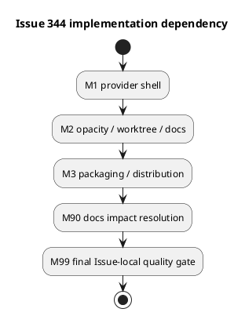

# iss-00344 Workbench Shell Scaffolding — Issue 実装計画書（Standard / TDD）

この文書は、approved `requirement.md` と `design.md` を、3つの検証可能なvertical micro-batchへ変換する。実装結果、Red / Green、逸脱、command outputは `report.md` にのみ記録する。

計画タグ:

- `assurance_profile: standard`
- `execution_style: spec-locked-micro-batch-tdd`
- `provider_first: true`
- `per_issue_pr: false`
- `delivery_owner: iss-00346`

## 0. 文書の位置づけ

- 本計画はIssue 344のWorkbench shellだけを実装する。
- generic single-file Artifact importはIssue 345、candidate wheel consumer E2E・dogfood projection・full regression・PR deliveryはIssue 346が所有する。
- provider sourceを先に変更し、consumer側 `spec-dock/**` を実装正本として手編集しない。
- 実装開始後も、requirement/designのnormative contractをworker判断で変更しない。
- merge、Issue finish、Epic completionは本計画の自動実行範囲外である。

## 1. 計画開始条件（Plan Readiness）

| 入力 | 状態 | 根拠 |
|---|---|---|
| `requirement.md` | approved | ChatGPT advisory PASS、fresh `spec-reviewer` PASS |
| `design.md` | approved | ChatGPT post-B-006 advisory PASS、fresh `spec-reviewer` PASS |
| `report.md` | exists | EAL、OAL、Spec Authoring Gateを保持 |
| Parent Epic | reviewed | Issue 344/345/346 ownershipとdeferred deliveryを固定 |
| Assurance | standard | `.assurance.json` のauthorized profile |

開始条件:

- [x] blocking open questionがない。
- [x] no-backfill、README-only tracking、semantic opacity、copy compatibility、distribution exact allowlistが設計で固定されている。
- [x] `setup.py` custom `build_py` post-build pruneが既知の変更面に含まれる。
- [x] report evidence destinationがある。
- [ ] 本計画のChatGPT reviewとfresh `spec-reviewer` reviewがPASSするまでは実装へ進まない。

## 2. 実装戦略（Implementation Strategy）

3つのmicro-batchを順番に実行する。

1. S01: fresh rootとfuture nodeを同じREADME shellで生成し、README-only trackingを成立させる。
2. S02: semantic opacity、linked-worktree時のcheckout/manual copy境界、shipped docsを同一観測で閉じる。
3. S03: installer pruneとbuild pruneを含むdistribution exact allowlistを成立させ、Issue 346へ証跡を引き渡す。

各micro-batchは次の順序を守る。

```text
Red test
  -> expected failure確認
  -> minimal Green
  -> focused regression
  -> behavior-preserving refactor
  -> report evidence
  -> reviewable commit
```

Red方針:

| 対象 | Red分類 | 期待 |
|---|---|---|
| shell generation / ignore | red-required | asset不在、root未生成、READMEがignoreされる理由で失敗 |
| opacity / copy / docs | characterization-first + red-required |既存互換を固定後、新README/docs期待で失敗 |
| package distribution | red-required | broad excludeまたはpost-build pruneによるREADME欠落で失敗 |
| static document consistency | inspect-only | canonical wordingとdeprecated wordingを検索・照合 |

想定外のRed、既存regression、production change前からのGreenは即時停止し、test defectかplan/design gapかを判定する。

## 3. 範囲と変更面（Scope and Change Surface）

### 3.1 許可変更面

| 種別 | Path / Target | 責任 |
|---|---|---|
| installer | `src/spec_dock/cli.py` | fresh root判定、root README copy、legacy README exact allowlist、fallback ignore |
| provider ignore | `src/spec_dock/assets/spec_dock/.gitignore` | top-level `.workbench/README.md` だけをtracking eligibilityへ戻す |
| provider templates | `src/spec_dock/assets/spec_dock/templates/{root,initiative,epic,issue}/.workbench/README.md` | 4つのbyte-identical guidance asset |
| package config | `pyproject.toml` | broad nested README exclusionを狭め、4 assetをpackage dataへ含める |
| build cleanup | `setup.py` | custom `build_py` post-build pruneをexact allowlist-awareにする |
| shipped docs | `src/spec_dock/assets/spec_dock/docs/{README.md,guide.md,reference_worktree.md}`、`src/spec_dock/assets/spec_dock/templates/README.md` | operator boundaryを説明 |
| installer tests | `tests/unit/infra/test_init_update.py` | fresh/existing、ignore、asset parity、build/distribution |
| node tests | `tests/cli_runtime/test_runtime_new_doc_s09.py` | Initiative/Epic/Issue planned/result/filesystem parity |
| opacity tests | `tests/unit/infra/test_runtime_fs_repo_workbench_opacity.py` | Workbench semantic opacity |
| copy tests | `tests/cli_runtime/test_workbench.py` | checkout/manual copy/source-wins compatibility |
| Issue evidence | Issue 344 `report.md` | observed execution/review evidence |

### 3.2 原則read/verify-only

- `src/spec_dock/assets/spec_dock/scripts/spec_dock_runtime/application/workbench.py`
- `src/spec_dock/assets/spec_dock/scripts/spec_dock_runtime/infra/fs_cli.py`
- `src/spec_dock/assets/spec_dock/scripts/spec_dock_runtime/infra/fs_repo.py`
- `src/spec_dock/assets/spec_dock/scripts/spec_dock_runtime/infra/template_scaffolder.py`

これらのruntime contract変更が必要なら実装を停止し、design amendmentとfresh reviewへ戻る。

### 3.3 禁止変更

| 対象 | 禁止理由 | 必要時 |
|---|---|---|
| generic `artifact import file` implementation | Issue 345 ownership | Issue 345へ残す |
| root `workbench copy` route | approved design外 | design amendmentまたは別Issue |
| automatic hook/watch/sync/copy-back | manual-only契約違反 | 親Epicへ再提案 |
| existing nodeへのbackfill/migration | no-backfill違反 | 別migration Issue |
| Workbench semantic parser/discovery | opacity違反 | requirement amendment |
| dogfood `spec-dock/**` implementation projection | Issue 346 ownership | Issue 346でcandidate wheelから反映 |
| per-Issue PR/merge/finish | delivery boundary違反 | Issue 346/human gate |

## 4. 実行概要（Execution Overview）

| Milestone | 成果 | Behaviors | Gate | 状態 |
|---|---|---|---|---|
| M1 / S01 | provider shell、fresh root、future nodes、README-only tracking | B-001〜B-004 | shell/ignore/no-backfill focused suite | planned |
| M2 / S02 | opacity、checkout/manual copy、shipped docs | B-005〜B-007 | opacity/copy/docs focused suite | planned |
| M3 / S03 | source/wheel/sdist/installed exact inventory | B-008〜B-009 | custom build prune + distribution suite | planned |
| M90 | docs/template impact resolution | B-007 | semantic assertionとdeprecated wording inspection | planned |
| M99 | Issue-local final quality | all | closure、focused regression、review、handoff | planned |



M2はM1のtracked READMEを、M3はM1の4 assetとM2のoperator contractを前提とする。blocking failureは次へ持ち越さない。

## 5. 受け入れ範囲（Acceptance Envelope）

| Outcome | 内容 | AC | Design | Evidence |
|---|---|---|---|---|
| OUT-001 | fresh rootとfuture 3 nodeだけに同じREADME shellが生成される | AC-344-001〜003、005 | DES-344-001〜003、005 | EVD-001〜003 |
| OUT-002 | READMEだけがtracking eligibleで、その他payloadはignoreされる | AC-344-004 | DES-344-004 | EVD-004 |
| OUT-003 | Workbenchがopaqueで、checkout/manual copyの役割が維持される | AC-344-006、007A/B/C、009 | DES-344-006、007 | EVD-005〜006 |
| OUT-004 | exact 5 README inventoryと4 asset byte parityが全surfaceで成立する | AC-344-008 | DES-344-008 | EVD-007 |
| OUT-005 | shipped docsがsecurity/authority/Issue境界を正しく説明する | AC-344-010 | DES-344-009 | EVD-008 |

Must not happen:

| ID | 内容 | 検出 |
|---|---|---|
| MNH-001 | existing root/node Workbenchのentry、bytes、names、mtimeを変更する | before/after filesystem snapshot |
| MNH-002 | nested/case-variant/other payloadをGitへ露出する | real repository ignore/status matrix |
| MNH-003 | README専用copy filterやroot copy routeを追加する | diff review + existing rejection tests |
| MNH-004 | allowlist外nested READMEをwheel/sdist/installed resourcesへ配布する | normalized inventory exact equality |
| MNH-005 | Issue 345/346の完了やPR/mergeを本Issueで主張する | report/review inspection |

## 6. Spec-Locked Closure Index

| Closure ID | Requirement | Design | 閉じる内容 | Verification | Report |
|---|---|---|---|---|---|
| TC-344-001 | AC-344-001 | DES-344-001 | fresh root生成 / existing no-backfill | installer unit | EVD-001 |
| TC-344-002 | AC-344-002 | DES-344-002 | future 3 node path parity | runtime CLI | EVD-002 |
| TC-344-003 | AC-344-003 | DES-344-003 | 4 README bytesと9 guidance elements | asset unit + byte hash | EVD-003 |
| TC-344-004 | AC-344-004 | DES-344-004 | exact pathname ignore matrix | real Git repository | EVD-004 |
| TC-344-005 | AC-344-005 | DES-344-001/002/005 | existing state不変 | snapshot/mtime test | EVD-001/002 |
| TC-344-006 | AC-344-006 | DES-344-006 | semantic opacity | infra/CLI regression | EVD-005 |
| TC-344-007A | AC-344-007A | DES-344-007 | checkoutとidentical README copy no-diff | linked-worktree test | EVD-006 |
| TC-344-007B | AC-344-007B | DES-344-007 | divergent README source-wins維持 | copy regression | EVD-006 |
| TC-344-007C | AC-344-007C | DES-344-003/007/009 | root route拒否とguidance scope | CLI/docs assertion | EVD-006/008 |
| TC-344-008 | AC-344-008 | DES-344-008 | post-build pruneを含むexact distribution inventory | build/unit/resource inspection | EVD-007 |
| TC-344-009 | AC-344-009 | DES-344-005/007 | existing copy focused regression | CLI suite | EVD-006 |
| TC-344-010 | AC-344-010 | DES-344-009 | shipped docs consistency | semantic assertion/inspection | EVD-008 |

## 7. Behavior Backlog

| Behavior | Milestone | 保証 | Closure | 依存 | 状態 |
|---|---|---|---|---|---|
| B-001 | M1 | 4 provider READMEがbyte-identicalでcanonical guidanceを持つ | TC-344-003 | none | ready |
| B-002 | M1 | fresh rootだけがroot READMEを得る | TC-344-001/005 | B-001 | planned |
| B-003 | M1 | future Initiative/Epic/Issueがgeneric recursionでREADMEを得る | TC-344-002/005 | B-001 | planned |
| B-004 | M1 | exact top-level READMEだけがtracking eligible | TC-344-004 | B-001 | planned |
| B-005 | M2 | README/payloadがsemantic observationを変えない | TC-344-006 | B-001 | planned |
| B-006 | M2 | checkout/manual copy/source-wins/root rejectionを維持 | TC-344-007A/B/C、009 | B-003/004 | planned |
| B-007 | M2/M90 | shipped docsが新しいoperator boundaryを説明 | TC-344-010 | B-005/006 | planned |
| B-008 | M3 | installer/build pruneがexact 5 pathsだけを保存 | TC-344-008 | B-001 | planned |
| B-009 | M3 | source/wheel/sdist/installed inventoryとbytesが一致 | TC-344-008 | B-008 | planned |

## 8. Active Behavior

- Behavior: `B-001`
- Milestone: M1
- Closure: `TC-344-003`
- Design: `DES-344-003`
- 次に行う理由: 全生成面、ignore、copy、distributionが参照するcanonical bytesを先に固定するため。
- 分割判断: one-cycle

Given provider template treeにWorkbench README assetがない

When 4 node-kind assetとcontent/parity testを追加する

Then 4 assetがUTF-8/LF/末尾newline 1つでbyte-identicalとなり、9 guidance elementsとexact repo-local commandを含む。

| 項目 | 内容 |
|---|---|
| Allowed paths | 4 README assets、`tests/unit/infra/test_init_update.py` |
| Forbidden paths | runtime copy/import implementation、dogfood projection |
| Required checks | asset existence、byte equality、guidance assertions、`git diff --check` |
| Report destination | `report.md` EVD-003 / session log |
| Stop conditions | canonical text変更がapproved designのfenced blockを外れる |

## 9. Active TDD Cycle

- Cycle ID: `TDD-344-001`
- Parent: B-001
- Type: red-green-refactor
- Status: planned

Behavioral hypothesis:

```text
4つのexplicit provider assetをapproved designのcanonical bytesで配置すれば、
root/node kind固有のruntime branchなしに全shell surfaceの共通authorityを固定できる。
```

Red:

- `TestInitUpdate::test_workbench_readme_assets_are_byte_identical_and_complete` を先に追加する。
- asset missingまたはguidance mismatchで失敗することを確認する。
- production change前から成功、または別理由で失敗した場合は停止してtestを修正する。

Minimal Green:

- 4 exact assetだけを追加する。
- generation framework、README parser、placeholder tokenは追加しない。
- designのcanonical fenced blockからwordingを変更しない。

Focused verification:

```bash
uv run pytest tests/unit/infra/test_init_update.py -k workbench_readme
git diff --check
```

Green後、重複bytesを抽象化せず、test helperの局所整理だけを許可する。

## 10. Milestone Plans

### M1 / S01 — Provider shell、fresh root、future node、README-only tracking

成果:

- 4 byte-identical README assets。
- pre-mutation freshnessに基づくfresh root生成。
- generic template recursionによるfuture 3 node生成。
- exact pathname ignore contract。
- existing scope no-backfill/preservation。

Red test seeds:

- `test_workbench_readme_assets_are_byte_identical_and_complete`
- `test_fresh_init_creates_tracked_root_workbench_readme`
- `test_update_and_force_init_do_not_backfill_workbench_readme`
- `test_workbench_gitignore_tracks_only_top_level_readme`
- `test_new_node_workbench_readme_matrix`
- `test_new_node_workbench_readme_does_not_touch_existing_scopes`

Green sequence:

1. B-001の4 assetsとcontent parityを成立させる。
2. `fresh_specdock = not os.path.lexists(specdock_dir)` 相当をmutation前に固定し、fresh rootだけへcopyする。
3. `_prune_legacy_scaffold` をexact allowlist-awareにする。
4. node template recursionで3 kindのplanned/result/filesystem path parityを成立させる。
5. provider/fallback ignoreを同じ3-rule contractへ変更する。

Gate:

```bash
uv run pytest tests/unit/infra/test_init_update.py -k 'workbench or readme'
uv run pytest tests/cli_runtime/test_runtime_new_doc_s09.py -k workbench
uv run pytest tests/cli_runtime/test_runtime_new_doc_s09.py
git diff --check
```

ReportへRed、Green、4 README SHA-256、fresh/existing snapshot、ignore matrix、node path parityを記録する。M1差分だけをreviewable commitにする。

### M2 / S02 — Semantic opacity、linked-worktree positioning、shipped docs

成果:

- tracked README、fake metadata、ADR-like Markdown、binary、invalid UTF-8を含めてもsemantic observationが不変。
- linked worktreeではREADMEがcheckoutされ、ignored payloadはmanual copy後だけ現れる。
- identical/divergent READMEとも既存opaque source-winsを維持。
- shipped docs 4件がoptional/no-backfill/security/authority/Issue境界を説明。

Red/characterization seeds:

- `test_workbench_readme_and_payloads_remain_semantically_opaque`
- `test_linked_worktree_gets_readme_via_checkout_before_manual_copy`
- `test_manual_copy_preserves_tracked_readme_bytes_and_copies_ignored_files`
- divergent README source-winsとroot selector rejectionの既存test
- `test_shipped_docs_describe_workbench_readme_boundary`

Green sequence:

1. existing opacity/copy testsで現在契約をcharacterizeする。
2. READMEを含むfixtureでもexact `.workbench` top-down pruneが維持されることを固定する。
3. Git checkoutとmanual copyのobservable差をtestする。
4. copy implementationにはREADME-aware branchを追加しない。
5. provider docs 4件をapproved designの用語へ更新し、generic importをIssue 345の未実装機能として記載する。

Gate:

```bash
uv run pytest tests/unit/infra/test_runtime_fs_repo_workbench_opacity.py
uv run pytest tests/cli_runtime/test_workbench.py
uv run pytest tests/unit/infra/test_init_update.py -k 'workbench and docs'
git diff --check
```

Reportへopacity result、worktree README hash、copy前後inventory、README content diff、copy regression、docs changed pathsを記録する。

### M3 / S03 — Packaging、focused distribution evidence、deferred handoff

成果:

- installer pruneとcustom `build_py` post-build pruneが同じexact 5-path contractを保存。
- allowlist外のstale nested READMEは引き続き削除。
- source、wheel、normalized sdist、installed resourcesのinventoryと4 README bytesが一致。
- Issue 346へのdelivery handoffがreportに残る。

Red seed:

- `TestInitUpdate::test_workbench_readme_distribution_allowlist`
- custom `build_py` prune後のallowlisted/legacy README区別test

Green sequence:

1. `pyproject.toml` のbroad nested README exclusionを4 assetsと両立する形へ狭める。
2. package dataに4 exact pathsを含める。
3. `setup.py` のpost-build pruneでnormalized exact 5 pathsを保存し、それ以外のnested READMEを削除する。
4. custom build pathを実際に通してwheel/sdistを生成する。
5. temporary installから`importlib.resources`で4 assetsを読み、source bytesと比較する。
6. reportにfocused結果とIssue 346 deferred boundaryを分けて記録する。

Gate:

```bash
uv run pytest tests/unit/infra/test_init_update.py -k 'workbench_readme or stale_build'
uv build
uv run pytest tests/unit/infra/test_init_update.py
git diff --check
```

build artifact inspectionはrepository外のtemporary directoryで行う。allowlist外README、surface欠落、byte mismatchのいずれかでM3は失敗する。

### M90 — Docs / Template Impact Resolution

- provider docs 4件: update required。
- Workbench README templates: update required。
- skills/workflow docs: semantic contract変更なし。変更不要をreportに記録。
- dogfood workspace: Issue 346でcandidate wheelから検証。直接変更しない。
- deprecated wordingはcontext-awareに検索し、blind replacementしない。

### M99 — Final Issue-local Quality Gate

- TC-344-001〜010をreport evidenceへ対応づける。
- S01〜S03 focused suiteを同じrevisionで再実行する。
- fresh `code-reviewer`、`qa-reviewer`、`spec-reviewer` のblocking findingを閉じる。
- clean status、commit SHA、Issue 346 handoffを記録する。
- PR作成、merge preparation、Issue finishは行わない。

## 11. Verification Ladder

| Level | 目的 | Command / Evidence |
|---|---|---|
| L1 | Active cycle | `uv run pytest tests/unit/infra/test_init_update.py -k workbench_readme` |
| L2 | Installer/node local | `uv run pytest tests/unit/infra/test_init_update.py tests/cli_runtime/test_runtime_new_doc_s09.py` |
| L3 | Opacity/copy local | `uv run pytest tests/unit/infra/test_runtime_fs_repo_workbench_opacity.py tests/cli_runtime/test_workbench.py` |
| L4 | Build/distribution | `uv build` と exact inventory/resource inspection tests |
| L5 | Static/diff | repositoryで設定済みの対象file lint/type check、`git diff --check` |
| L6 | Docs/template | semantic assertions、deprecated wording inspection、4 asset byte equality |
| L7 | Issue final | focused aggregate、closure inspection、fresh code/QA/spec reviews |

full repository regression、candidate wheel consumer E2E、dogfood projection、Epic-wide reviewはIssue 346のL7で実施する。本Issueのfocused failureをIssue 346へ先送りしない。

## 12. Delegation Contract

| Step | Role | Allowed Paths | Reviewer Focus | Report |
|---|---|---|---|---|
| B-001〜004 | `dev-coder` | installer、assets、ignore、近接tests | freshness/no-backfill/ignore/generic recursion | M1 session |
| B-005〜006 | `dev-coder` | opacity/copy testsのみ。copy sourceはread-only | semantic opacity/source-wins/root rejection | M2 session |
| B-007 | `doc-writer` | provider docs 4件 | authority/security/Issue境界 | M90 |
| B-008〜009 | `dev-coder` | `pyproject.toml`、`setup.py`、distribution tests | dual prune/exclude/exact inventory | M3 session |
| M99 code | fresh `code-reviewer` | read-only | aggregate implementation risks | review gate |
| M99 QA | fresh `qa-reviewer` | read-only | AC/TC evidence and commands | review gate |
| M99 spec | fresh `spec-reviewer` | read-only | requirement/design/plan/report alignment | review gate |

各委任は一つのBehaviorまたはMilestoneに限定し、canonical adoption、phase completion、merge authorityを自己宣言させない。

## 13. Report Evidence Mapping

| Evidence | 対象 | Report記録 |
|---|---|---|
| EVD-001 | fresh/existing root | Red/Green、filesystem snapshot、mtime |
| EVD-002 | future node matrix | planned/result/filesystem paths、ancestor/sibling不変 |
| EVD-003 | README contract | 4 hashes、bytes、guidance assertions |
| EVD-004 | ignore matrix | regular/symlink/directory/nested/case/near-name結果 |
| EVD-005 | opacity | validate/sync/deps/active/source-manifest observations |
| EVD-006 | checkout/copy | source/target hashes、copy前後inventory、root rejection |
| EVD-007 | distribution | build filenames、5-path inventories、installed bytes、stale removal |
| EVD-008 | docs | changed paths、semantic assertions、deprecated wording disposition |
| EVD-009 | reviews | finding、採否、fix commit、fresh verdict |
| EVD-010 | handoff | dependency edge、deferred gates、delivery owner |

planには実測値を書かない。未実施commandをPASSと記録せず、failureと代替確認もreportへ残す。

## 14. Amendment and Stop Rules

即時停止:

- Red理由が想定外、またはproduction change前からGreen。
- existing regression failure。
- freshnessをmutation前に確定できない。
- no-backfillを守るためにmigrationが必要。
- copy runtime/public CLI変更が必要。
- exact 5-path contractに新しいdistribution mechanismが必要。
- semantic opacityを維持するためにdiscovery rule変更が必要。
- generic import、dogfood projection、PR deliveryを前倒ししないと成立しない。
- security/privacy影響またはsecret exposureを発見。

対応:

| 状況 | 戻り先 |
|---|---|
| test defect | test修正後にRed再確認 |
| requirement ambiguity | requirement amendment + fresh review |
| normative design変更 | design amendment + ChatGPT/fresh spec review |
| scope外change | Issue 345/346または新Issue |
| assurance grade不適合 | re-classify / human gate |

## 15. Docs / Template / Skill Impact Resolution

| 対象 | 影響 | 対応 |
|---|---|---|
| provider docs 4件 | yes | S02で新operator contractへ更新 |
| 4 Workbench README templates | yes | S01でcanonical bytesを追加 |
| template root README | yes | new node behavior説明を更新 |
| skills | no known semantic change | M90で再確認しreportへN/A根拠 |
| workflow docs | no known semantic change | import/copy workflow変更がないことを確認 |
| dogfood workspace | deferred | Issue 346のcandidate wheel検証 |

M90未解決のままM99へ進まない。

## 16. Final Quality Gate

| Check | Command / Evidence | Expected |
|---|---|---|
| Requirement closure | TC-344-001〜010とreport照合 | all closed |
| Design compliance | DES-344-001〜009とdiff照合 | deviationなし |
| Installer/node | `uv run pytest tests/unit/infra/test_init_update.py tests/cli_runtime/test_runtime_new_doc_s09.py` | pass |
| Opacity/copy | `uv run pytest tests/unit/infra/test_runtime_fs_repo_workbench_opacity.py tests/cli_runtime/test_workbench.py` | pass |
| Distribution | `uv build` + exact inventory/resource tests | pass |
| Static/diff | configured focused lint/type checks、`git diff --check` | pass |
| Docs/templates | semantic assertions、4-byte parity | pass |
| Reviews | fresh code/QA/spec reviewer | blocking finding 0 |
| Handoff | report EVD-010 | Issue 346 owner/deps明記 |

Final exit:

- [ ] 全Closure完了。
- [ ] M1〜M3、M90、M99完了。
- [ ] unresolved blocking findingなし。
- [ ] reportに実測evidenceと未実施理由を記録。
- [ ] Issue 345/346 scopeを実装していない。
- [ ] per-Issue PR、merge、finishを行っていない。
- [ ] reviewable commitとclean statusを記録。

## 17. Follow-up Candidates

| ID | 内容 | 推奨先 |
|---|---|---|
| FU-001 | generic one-file Artifact import | iss-00345 |
| FU-002 | candidate wheel consumer E2E、dogfood projection、full regression、Epic-wide review、PR delivery | iss-00346 |
| FU-003 | root Workbench copy routeが将来必要になった場合の新しい公開契約 | separate Issue / Epic amendment |

## 18. Plan Approval Checklist

- [x] AC-344-001〜010がClosure Indexへ対応する。
- [x] DES-344-001〜009がMilestone/Behaviorへ対応する。
- [x] 3つのvertical micro-batchが独立検証可能である。
- [x] Active TDD CycleはB-001だけに限定される。
- [x] Red、Minimal Green、Refactor guardrailがある。
- [x] allowed/read-only/forbidden pathが区別される。
- [x] `setup.py` post-build pruneがM3に含まれる。
- [x] report evidence destinationとstop conditionがある。
- [x] Issue 346へのdeferred deliveryとhuman-only merge境界がある。
- [ ] ChatGPT plan review PASS。
- [ ] fresh `spec-reviewer` plan review PASS。

## 19. 変更履歴

| Date | Change | Reason | Author |
|---|---|---|---|
| 2026-07-29 | Standard plan初稿 | ChatGPT planning candidateをapproved requirement/designとB-006修正へ正規化 | Codex orchestrator |
