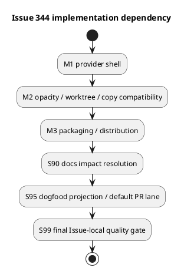

# iss-00344 Workbench Shell Scaffolding — Issue 実装計画書（Standard / TDD）

この文書は、approved `requirement.md` と `design.md` を、3つの検証可能なvertical micro-batchへ変換する。実装結果、Red / Green、逸脱、command outputは `report.md` にのみ記録する。

計画タグ:

- `assurance_profile: standard`
- `execution_style: spec-locked-micro-batch-tdd`
- `provider_first: true`
- `per_issue_pr: true`
- `issue_pr_delivery_owner: iss-00344`
- `epic_integration_delivery_owner: iss-00346`

## 0. 文書の位置づけ

- 本計画はIssue 344のWorkbench shellだけを実装する。
- generic single-file Artifact importはIssue 345が所有する。本Issueは、自身が変更したmanaged assetsのchecked-in dogfood projection、default PR lane、Issue-local ready PRとexact-head observationを所有する。candidate wheel consumer E2E、generic importを含むintegrated dogfood、opt-in full regression、Epic-wide review、残余Epic integration PRはIssue 346が所有する。
- provider sourceを先に変更し、consumer側 `spec-dock/**` を実装正本として手編集しない。
- 実装開始後も、requirement/designのnormative contractをworker判断で変更しない。
- merge、auto-merge、branch削除、Issue finish、Epic completionは本計画の自動実行範囲外である。

## 1. 計画開始条件（Plan Readiness）

| 入力 | 状態 | 根拠 |
|---|---|---|
| `requirement.md` | approved | ChatGPT advisory PASS、fresh `spec-reviewer` PASS |
| `design.md` | approved | ChatGPT post-B-006 advisory PASS、fresh `spec-reviewer` PASS |
| `report.md` | exists | EAL、OAL、Spec Authoring Gateを保持 |
| Parent Epic | reviewed | Issue 344/345/346 ownershipとdeferred deliveryを固定 |
| Assurance | standard | `.assurance.json` のauthorized profile |

開始条件:

- [x] blocking open questionがない。
- [x] no-backfill、README-only tracking、semantic opacity、copy compatibility、distribution exact allowlistが設計で固定されている。
- [x] `setup.py` custom `build_py` post-build pruneが既知の変更面に含まれる。
- [x] report evidence destinationがある。
- [x] 本計画のChatGPT reviewとfresh `spec-reviewer` reviewがPASSするまでは実装へ進まない。

### 1.1 ChatGPT-First execution overlay

本Issueの実装では、ユーザーの2026-07-29の明示指示により、各stepへ次のcheckpoint順序を適用する。このoverlayはrequirement、design、step scope、locked expectation、closure id、step間の依存順序を変更しない。各step内のreview / commit順序はこのsectionを正本とし、後続のstep gateはこの順序を具体化する。

1. step開始前にworktreeをcleanにし、現在branchをGitHubへpushする。
2. SpecDock `authoring preflight github-sync` でlocal/remote HEAD一致を確認する。
3. ChatGPT-Useへexact commit、approved specs、step contract、current source/testsを参照させ、最小実装方針、Red/Green、具体テストケース、過剰実装回避、stop conditionをMarkdownで具体化させる。
4. 完全回答を`artifact import chatgpt-output`でIssue Artifactへ保存し、main orchestratorがapproved specsとlocal sourceに照らして採否を記録する。
5. 採用したArtifactとstep contractを、そのstepの実装担当へ共有してbounded implementationを委任する。S01/S02/S03/S95は`dev-coder`、S90はtest laneを`dev-coder`、docs laneを`doc-writer`が担当する。
6. 実装、focused verification、pre-review report統合を完了し、review candidate commitを作成してbranchをGitHubへpushする。このcommitを`review_target_sha`とする。
7. planに記載された`code-reviewer`、`spec-reviewer`、`qa-reviewer`はreview責務契約として維持し、その責務をSub-agentではなくChatGPT-Useへプロンプトとして渡す。ChatGPT-Useはpush済み`review_target_sha`だけをreviewする。
8. blocking / major findingを採用した場合は同じstepの担当へbounded fixを戻し、新しいcandidate commitをpushして、その新しいSHAへfresh re-reviewを行う。
9. PASS後にreview Artifact、採否、final verdictを`report.md`へ記録し、Issue Artifactと`report.md`だけのpost-review evidence commitを作る。このcommitを`closure_head_sha`とする。`closure_head_sha`はreview済み実装を変更してはならず、main orchestratorがallowed path、diff、validation、clean状態を確認する。evidence-only commitを再reviewして新しいArtifactを作る循環は行わない。
10. ChatGPT-Useのreview結果は次のJSON形で受け取る。`review_status=pass`はblocking / major findingがともに0件で、`reviewed_commit`が`review_target_sha`とexact一致し、required responsibility scopeを満たし、採用した修正へのfresh re-reviewが完了し、main orchestratorがfindingをlocal sourceとtestsで検証した場合だけstep gateへ採用する。

```json
{
  "review_status": "pass | fail",
  "reviewed_commit": "40-character commit SHA",
  "review_scope": "step and responsibility contract",
  "findings": [
    {
      "id": "stable finding id",
      "severity": "blocking | major | minor",
      "location": "path or contract section",
      "summary": "concise finding",
      "evidence": "source-grounded evidence",
      "recommended_action": "smallest sufficient action"
    }
  ],
  "overreach_check": {
    "scope_expansion_requested": false,
    "unnecessary_abstraction_requested": false,
    "reason": "brief reason"
  },
  "residual_risks": [],
  "next_action": "proceed | bounded_fix_and_rereview | return_to_planning"
}
```

Reviewの運用条件:

- ChatGPT出力はadvisory evidenceであり、main orchestratorが各findingを`adopted`、`partially_adopted`、`rejected`、`deferred`のいずれかへ分類する。
- requirement/design/plan外の機能、sibling Issueの責務、新framework、将来拡張だけを理由とする抽象化は、blocking defectの根拠がない限り採用しない。
- finding修正は同じstepのallowed pathsとclosure contractに限定し、必要なら同じ`dev-coder`へbounded follow-upとして戻す。
- canonical contract変更が必要なfindingは実装で吸収せず、planning amendmentへ戻る。
- review Artifact、採否、修正、再review、`review_target_sha`、`closure_head_sha`、final verdictを`report.md`へ記録する。
- `major`は従来の`material`と同じ実行ブロッカーとして扱う。`minor`だけを残したPASSは、非ブロック理由と採否をreportへ記録した場合に限る。

## 2. 実装戦略（Implementation Strategy）

3つのmicro-batchと2つのrelease closure stepを順番に実行する。

1. S01: fresh rootとfuture nodeを同じREADME shellで生成し、README-only trackingを成立させる。
2. S02: semantic opacityとlinked-worktree時のcheckout/manual copy境界を同一観測で閉じる。
3. S03: installer pruneとbuild pruneを含むdistribution exact allowlistを成立させる。
4. S90: shipped operator docsを実挙動へ整合させる。
5. S95: provider-first dogfood projection、default PR lane、no-backfillを閉じる。
6. S99: Issue-wide review、ready PR作成、exact-head observationを閉じ、human merge前で停止する。

各micro-batchは次の順序を守る。

```text
Red test
  -> expected failure確認
  -> minimal Green
  -> focused regression
  -> behavior-preserving refactor
  -> report evidence
  -> reviewable commit
```

Red方針:

| 対象 | Red分類 | 期待 |
|---|---|---|
| shell generation / ignore | red-required | asset不在、root未生成、READMEがignoreされる理由で失敗 |
| opacity / copy / docs | characterization-first + red-required |既存互換を固定後、新README/docs期待で失敗 |
| package distribution | red-required | broad excludeまたはpost-build pruneによるREADME欠落で失敗 |
| static document consistency | inspect-only | canonical wordingとdeprecated wordingを検索・照合 |

想定外のRed、既存regression、production change前からのGreenは即時停止し、test defectかplan/design gapかを判定する。

## 3. 範囲と変更面（Scope and Change Surface）

### 3.1 許可変更面

| 種別 | Path / Target | 責任 |
|---|---|---|
| installer | `src/spec_dock/cli.py` | fresh root判定、root README copy、legacy README exact allowlist、fallback ignore |
| generic scaffolder | `src/spec_dock/assets/spec_dock/scripts/spec_dock_runtime/infra/template_scaffolder.py` | replacement後もbytes不変なUTF-8 fileをexact-copyし、通常placeholder templateはrenderするpath-agnostic primitive |
| provider ignore | `src/spec_dock/assets/spec_dock/.gitignore` | top-level `.workbench/README.md` だけをtracking eligibilityへ戻す |
| provider templates | `src/spec_dock/assets/spec_dock/templates/{root,initiative,epic,issue}/.workbench/README.md` | 4つのbyte-identical guidance asset |
| package config | `pyproject.toml` | broad nested README exclusionを狭め、4 assetをpackage dataへ含める |
| build cleanup | `setup.py` | custom `build_py` post-build pruneをexact allowlist-awareにする |
| shipped docs | `src/spec_dock/assets/spec_dock/docs/{README.md,guide.md,reference_worktree.md}`、`src/spec_dock/assets/spec_dock/templates/README.md` | operator boundaryを説明 |
| installer tests | `tests/unit/infra/test_init_update.py` | fresh/existing、ignore、asset parity、build/distribution |
| scaffolder tests | `tests/unit/infra/test_runtime_template_scaffolder.py` | real provider exact-copy、placeholder render、path-agnostic guardrail |
| node tests | `tests/cli_runtime/test_runtime_new_doc_s09.py` | Initiative/Epic/Issue planned/result/filesystem parity |
| lifecycle no-backfill tests | `tests/cli_runtime/test_new.py` | validate、sync、active switching、Artifact/ADR作成、future child作成を通したexisting Workbench保存 |
| opacity tests | `tests/unit/infra/test_runtime_fs_repo_workbench_opacity.py` | Workbench semantic opacity |
| copy tests | `tests/cli_runtime/test_workbench.py` | checkout/manual copy/source-wins compatibility |
| Issue evidence | Issue 344 `report.md` | observed execution/review evidence |

### 3.2 原則read/verify-only

- `src/spec_dock/assets/spec_dock/scripts/spec_dock_runtime/application/workbench.py`
- `src/spec_dock/assets/spec_dock/scripts/spec_dock_runtime/infra/fs_cli.py`
- `src/spec_dock/assets/spec_dock/scripts/spec_dock_runtime/infra/fs_repo.py`

これら3つのcopy/discovery contract変更が必要なら実装を停止し、design amendmentとfresh reviewへ戻る。`template_scaffolder.py` のgeneric exact-copy branchはapproved `DES-344-002` の実装対象であり、このread-only boundaryには含めない。

### 3.3 禁止変更

| 対象 | 禁止理由 | 必要時 |
|---|---|---|
| generic `artifact import file` implementation | Issue 345 ownership | Issue 345へ残す |
| root `workbench copy` route | approved design外 | design amendmentまたは別Issue |
| automatic hook/watch/sync/copy-back | manual-only契約違反 | 親Epicへ再提案 |
| existing nodeへのbackfill/migration | no-backfill違反 | 別migration Issue |
| Workbench semantic parser/discovery | opacity違反 | requirement amendment |
| dogfood `spec-dock/**` manual-first edit | provider-first違反 | S95の正式なupdate経路だけを使う |
| `spec-dock/initiatives/**` / existing Workbench mutation | no-backfill / evidence保全違反 | 即時停止してplanningへ戻す |
| candidate wheel / integrated dogfood / opt-in full regression / Epic-wide review | Issue 346 ownership | Issue 346へ残す |
| merge/auto-merge/branch削除/finish | human boundary違反 | human gate |

## 4. 実行概要（Execution Overview）

| Milestone | 成果 | Behaviors | Gate | 状態 |
|---|---|---|---|---|
| M1 / S01 | provider shell、fresh root、future nodes、README-only tracking | B-001〜B-004 | shell/ignore/no-backfill focused suite | planned |
| M2 / S02 | opacity、checkout/manual copy | B-005〜B-006 | opacity/copy focused suite | planned |
| M3 / S03 | source/wheel/sdist/installed exact inventory | B-008〜B-009 | custom build prune + distribution suite | planned |
| S90 | docs/template impact resolution | B-007 | semantic assertionとdeprecated wording inspection | planned |
| S95 | provider-first projection / default PR lane | B-010 | allowlist、mirror parity、no-backfill、lint/default suite | planned |
| S99 | Issue-local final quality / PR observation | all | closure、review、ready PR、exact-head observation | planned |



M2はM1のtracked READMEを、M3はM1の4 assetとM2のoperator contractを前提とする。blocking failureは次へ持ち越さない。

### 4.4 この計画で満たす要件ID

`I344-RQ-001`〜`I344-RQ-011`、`AC-344-001`〜`AC-344-006`、`AC-344-007A/B/C`、`AC-344-008`〜`AC-344-011`をすべて対象とする。

### 4.5 依存関係から導く実装順序

1. S01でprovider asset、installer、generic scaffolder、Git trackingという生成経路を先に成立させる。
2. S02でS01の生成物を使い、semantic opacityとlinked-worktree copy compatibilityをcharacterizeする。
3. S03でS01のprovider assetsをpackage surfaceへ配布し、S02 regressionを同revisionで再確認する。
4. S90でS01/S02の実測contractをoperator docsへ反映する。
5. S95でprovider-first projectionとdefault PR laneを同一HEADで閉じる。
6. S99で全stepのevidenceとreviewを同一HEADに収束させ、ready PRを作成・観測する。

### 4.6 ステップ一覧と要件 ↔ ステップ対応

| Step | Vertical behavior slice | Requirements / AC | Depends on | Unblocks |
|---|---|---|---|---|
| S01 | fresh root/future nodesへtracked README shellを生成 | RQ-001〜005 / AC-001〜005 | none | S02 |
| S02 | Workbench opacityとcheckout/manual copy互換を観測 | RQ-006/007/009 / AC-006、007A/B/C、009 | S01 Result Approval | S03 |
| S03 | exact five-path distributionを4 surfacesで観測 | RQ-008 / AC-008 | S02 Result Approval | S90 |
| S90 | shipped operator docsを実挙動へ整合 | RQ-003/007/010 / AC-007C、010 | S03 Result Approval | S99 |
| S95 | changed managed assetsをprovider-first投影しdefault laneをgreenにする | RQ-011 / AC-011 | S90 Result Approval | S99 |
| S99 | 全AC/TC、review、ready PR、observationを同一HEADで閉じる | RQ-001〜011 / 全AC | S01〜S95 | human merge / Issue 346 handoff |

## 5. 受け入れ範囲（Acceptance Envelope）

| Outcome | 内容 | AC | Design | Evidence |
|---|---|---|---|---|
| OUT-001 | fresh rootとfuture 3 nodeだけに同じREADME shellが生成される | AC-344-001〜003、005 | DES-344-001〜003、005 | EVD-001〜003 |
| OUT-002 | READMEだけがtracking eligibleで、その他payloadはignoreされる | AC-344-004 | DES-344-004 | EVD-004 |
| OUT-003 | Workbenchがopaqueで、checkout/manual copyの役割が維持される | AC-344-006、007A/B/C、009 | DES-344-006、007 | EVD-005〜006 |
| OUT-004 | exact 5 README inventoryと4 asset byte parityが全surfaceで成立する | AC-344-008 | DES-344-008 | EVD-007 |
| OUT-005 | shipped docsがsecurity/authority/Issue境界を正しく説明する | AC-344-010 | DES-344-009 | EVD-008 |
| OUT-006 | provider-first projectionとdefault laneをgreenにし、ready PRをexact headで観測する | AC-344-011 | DES-344-010 | EVD-012/013 |

Must not happen:

| ID | 内容 | 検出 |
|---|---|---|
| MNH-001 | existing root/node Workbenchのentry、bytes、names、mtimeを変更する | before/after filesystem snapshot |
| MNH-002 | nested/case-variant/other payloadをGitへ露出する | real repository ignore/status matrix |
| MNH-003 | README専用copy filterやroot copy routeを追加する | diff review + existing rejection tests |
| MNH-004 | allowlist外nested READMEをwheel/sdist/installed resourcesへ配布する | normalized inventory exact equality |
| MNH-005 | Issue 345/346の完了やPR/mergeを本Issueで主張する | report/review inspection |

## 6. Spec-Locked Closure Index

全rowは`required=yes`であり、locked expectationまたはrequired値を変える場合はplan amendmentとfresh reviewを要する。

| ID | Required | Spec link | Owner | Observable input / state | Locked expectation | Bug class guarded | Evidence level | Closure evidence |
|---|---|---|---|---|---|---|---|---|
| TC-344-001 | yes | AC-344-001 / DES-344-001 | S01 | fresh rootとpre-existing root | freshだけREADME生成、existingはno-backfill | freshness判定の遅延・既存汚染 | installer unit + real Git | EVD-001 |
| TC-344-002A | yes | AC-344-002 / DES-344-002 | S01 | new Initiative/Epic/Issue plan/result/filesystem | 3 node kindのpath parity | node-kind漏れ・ancestor変更 | runtime CLI | EVD-002 |
| TC-344-002B | yes | AC-344-002/003 / DES-344-002 | S01 | unchanged CRLF UTF-8とplaceholder template | unchangedはpath非依存exact-copy、changedはrender | text rewrite・README専用分岐 | real provider unit | EVD-002/003 |
| TC-344-003 | yes | AC-344-003 / DES-344-003 | S01 | 4 provider README bytes | byte-identical、9 guidance elements、exact command | wording drift・placeholder混入 | asset byte/hash assertion | EVD-003 |
| TC-344-004 | yes | AC-344-004 / DES-344-004 | S01 | regular/symlink/directory/nested/case/near-name paths | exact top-level README pathnameだけtracking eligible | payload露出・過剰再包含 | real Git matrix | EVD-004 |
| TC-344-005 | yes | AC-344-005 / DES-344-001/002/005 | S01 | existing rootと代表的なexisting Initiative/Epic/Issue Workbenchのbefore/after、existing init/update、validate、sync、active switching、Artifact作成、ADR作成、future child作成 | 全existing scopeのentry inventory、file bytes、names、mtime不変。future child作成時は新規childだけREADMEを得てancestor/siblingは不変 | backfill・既存状態破壊・read-only commandの副作用 | exact 2 pytest nodesのsnapshot/mtime regression | EVD-001/002 |
| TC-344-006 | yes | AC-344-006 / DES-344-006 | S02 | README、fake metadata、ADR-like、binary、invalid UTF-8 | validate/sync/deps/active/source observation不変 | semantic source化 | infra/CLI regression | EVD-005 |
| TC-344-007A | yes | AC-344-007A / DES-344-007 | S02 | linked worktreeとidentical README | READMEはcheckout、ignored payloadはmanual copy、content diffなし | checkout/copy混同 | linked-worktree Git test | EVD-006 |
| TC-344-007B | yes | AC-344-007B / DES-344-007 | S02 | divergent source/target node README | existing opaque whole-tree source-wins | README filterによる互換破壊 | copy regression | EVD-006 |
| TC-344-007C | yes | AC-344-007C / DES-344-003/007/009 | S02/S90 | root selectorと4 README guidance | root route拒否、node helper scope明示 |未提供root機能の示唆 | CLI rejection + docs assertion | EVD-006/008 |
| TC-344-008 | yes | AC-344-008 / DES-344-008 | S03 | source/wheel/sdist/installed template subtree | exact 5 paths、4 bytes一致、stale nested READMEなし | package exclude/prune欠落 | custom build + installed resource | EVD-007 |
| TC-344-009 | yes | AC-344-009 / DES-344-005/007 | S02 | existing `workbench copy` suite |公開failure/source-wins/atomicity不変 | copy regression | CLI suite | EVD-006 |
| TC-344-010 | yes | AC-344-010 / DES-344-009 | S90 | shipped docs 4件 | shell/Git/copy/security/authority/sibling境界が一致 | operator誤誘導 | docs semantic assertion | EVD-008 |
| TC-344-011 | yes | AC-344-011 / DES-344-010 | S95/S99 | provider authority、managed mirror、default lane、ready PR | allowlisted projection、no-backfill、lint/default suite、exact-head observation | manual mirror drift、scope侵食、stale PR review | update diff inspection + tests + PR observation | EVD-012/013 |

## 7. Behavior Backlog

| Behavior | Milestone | 保証 | Closure | 依存 | 状態 |
|---|---|---|---|---|---|
| B-001 | M1 | 4 provider READMEがbyte-identicalでcanonical guidanceを持つ | TC-344-003 | none | planned |
| B-002 | M1 | fresh initを通すとroot READMEが生成され、Gitではexact pathnameだけがtracking eligibleになる | TC-344-001/003/004/005 | none | ready |
| B-003 | M1 | future Initiative/Epic/Issueがgeneric recursionでREADMEを得て、unchanged bytesはgeneric exact-copy、placeholder bytesはrenderされる | TC-344-002A/002B/005 | B-001 | planned |
| B-004 | M1 | exact top-level READMEだけがtracking eligible | TC-344-004 | B-001 | planned |
| B-005 | M2 | README/payloadがsemantic observationを変えない | TC-344-006 | B-001 | planned |
| B-006 | M2 | checkout/manual copy/source-wins/root rejectionを維持 | TC-344-007A/B/C、009 | B-003/004 | planned |
| B-007 | S90 | shipped docsが新しいoperator boundaryを説明 | TC-344-010 | B-005/006 | planned |
| B-010 | S95 | changed managed assetsを正式経路で投影しdefault PR laneをgreenにする | TC-344-011 | B-007/008/009 | planned |
| B-008 | M3 | installer/build pruneがexact 5 pathsだけを保存 | TC-344-008 | B-001 | planned |
| B-009 | M3 | source/wheel/sdist/installed inventoryとbytesが一致 | TC-344-008 | B-008 | planned |

## 8. Active Behavior

- Behavior: `B-002`
- Milestone: M1
- Closure: `TC-344-001`, `TC-344-003`, `TC-344-004`, `TC-344-005`
- Design: `DES-344-001`, `DES-344-003`, `DES-344-004`, `DES-344-005`
- 次に行う理由: provider assetからinstaller、filesystem、real Git observationまでを薄く通す最小vertical tracer bulletだから。
- 分割判断: one-cycle

Given freshなtemporary Git repositoryにSpecDock rootがまだ存在しない

When provider assetを含むcurrent checkoutから`spec-dock init`相当を実行する

Then root `.workbench/README.md` がcanonical bytesで生成され、そのexact pathnameだけがGit tracking eligibleになり、other payloadはignoreされる。

| 項目 | 内容 |
|---|---|
| Allowed paths | root README asset、provider/fallback ignore、`src/spec_dock/cli.py`、`tests/unit/infra/test_init_update.py` |
| Forbidden paths | runtime copy/import implementation、dogfood projection |
| Required checks | fresh init output bytes、real `git check-ignore`/status、other payload ignore、existing root no-backfill |
| Report destination | `report.md` EVD-001/EVD-003/EVD-004 / S01 session log |
| Stop conditions | fresh判定がmutation前に固定できない、canonical textがapproved designを外れる、payloadがGitへ露出する |

## 9. Active TDD Cycle

- Cycle ID: `TDD-344-001`
- Parent: B-002
- Type: red-green-refactor
- Status: planned

Behavioral hypothesis:

```text
fresh initのpublic installer pathを通してroot READMEを生成し、
real Git observationでREADME-only trackingを確認できれば、最小のend-to-end shell価値が成立する。
```

Red:

- `tests/unit/infra/test_init_update.py::TestInitUpdate::test_fresh_init_creates_only_tracked_root_workbench_readme` を先に追加する。
- root README asset不在、installer未生成、またはREADMEを含むWorkbench全体ignoreのいずれかで失敗することを確認する。
- production change前から成功、または別理由で失敗した場合は停止してtestを修正する。

Minimal Green:

- root exact asset、pre-mutation freshness branch、root copy、3-rule provider/fallback ignoreだけを追加する。
- generation framework、README parser、placeholder tokenは追加しない。
- designのcanonical fenced blockからwordingを変更しない。
- remaining 3 node assets、generic exact-copy、full ignore matrixは同じS01の後続cycleで広げる。

Focused verification:

```bash
uv run pytest tests/unit/infra/test_init_update.py::TestInitUpdate::test_fresh_init_creates_only_tracked_root_workbench_readme
git diff --check
```

Green後、重複bytesを抽象化せず、test helperの局所整理だけを許可する。

## 10. Milestone Plans

### M1 / S01 — Provider shell、fresh root、future node、README-only tracking

成果:

- 4 byte-identical README assets。
- pre-mutation freshnessに基づくfresh root生成。
- generic template recursionによるfuture 3 node生成。
- exact pathname ignore contract。
- existing scope no-backfill/preservation。

Red test seeds:

- `test_workbench_readme_assets_are_byte_identical_and_complete`
- `test_fresh_init_creates_only_tracked_root_workbench_readme`
- `test_update_and_force_init_do_not_backfill_workbench_readme`
- `test_workbench_gitignore_tracks_only_top_level_readme`
- `test_new_node_workbench_readme_matrix`
- `test_new_node_workbench_readme_does_not_touch_existing_scopes`
- `tests/cli_runtime/test_new.py::TestCliNew::test_workbench_no_backfill_preserves_existing_scopes_across_all_triggers`
- `tests/unit/infra/test_runtime_template_scaffolder.py::test_copy_scaffolded_tree_uses_exact_copy_for_unchanged_utf8_bytes`
- `tests/unit/infra/test_runtime_template_scaffolder.py::test_copy_scaffolded_tree_still_renders_changed_placeholder_text`
- `tests/unit/infra/test_runtime_template_scaffolder.py::test_copy_scaffolded_tree_exact_copy_is_path_agnostic`

Green sequence:

1. B-001の4 assetsとcontent parityを成立させる。
2. `fresh_specdock = not os.path.lexists(specdock_dir)` 相当をmutation前に固定し、fresh rootだけへcopyする。
3. `_prune_legacy_scaffold` をexact allowlist-awareにする。
4. `copy_scaffolded_tree()` でrender後bytesがsource bytesと同じUTF-8 fileは`shutil.copy2`相当のexact-copy seamを通し、bytesが変わるplaceholder templateは従来のrender/writeを維持する。
5. CRLFを含むpath-neutral UTF-8 fixtureでtext rewriteを検出し、README/path-specific branchがないことを固定する。
6. node template recursionで3 kindのplanned/result/filesystem path parityを成立させる。
7. provider/fallback ignoreを同じ3-rule contractへ変更する。

Gate:

```bash
uv run pytest tests/unit/infra/test_init_update.py -k 'workbench or readme'
uv run pytest \
  tests/unit/infra/test_runtime_template_scaffolder.py::test_copy_scaffolded_tree_uses_exact_copy_for_unchanged_utf8_bytes \
  tests/unit/infra/test_runtime_template_scaffolder.py::test_copy_scaffolded_tree_still_renders_changed_placeholder_text \
  tests/unit/infra/test_runtime_template_scaffolder.py::test_copy_scaffolded_tree_exact_copy_is_path_agnostic
uv run pytest tests/cli_runtime/test_runtime_new_doc_s09.py -k workbench
uv run pytest tests/cli_runtime/test_runtime_new_doc_s09.py
uv run pytest \
  tests/unit/infra/test_init_update.py::TestInitUpdate::test_update_and_force_init_do_not_backfill_workbench_readme \
  tests/cli_runtime/test_new.py::TestCliNew::test_workbench_no_backfill_preserves_existing_scopes_across_all_triggers
git diff --check
```

ReportのEVD-002/003へexact-copy Red/Green、CRLF fixture bytes、placeholder render result、path-agnostic assertionを記録する。あわせて4 README SHA-256、fresh/existing snapshot、ignore matrix、node path parityを記録し、M1差分だけをreviewable commitにする。

#### S01 behavior slice execution

- depends on: approved requirement/design/plan。
- unblocks: S02のcheckout/opacityだけ。
- target files: installer、provider/fallback ignore、4 README assets、generic scaffolder、S01 tests。
- integration checkpoint: fresh rootとnew nodeをpublic command seamからmaterializeし、filesystemとreal Gitで観測する。
- annotation: AFK。ただしcanonical README wording変更はHITL amendment。

Planned contract:

- scope: TC-344-001〜005をthin root tracerから3 node/full matrixへ拡張する。
- test obligation: fresh/existing、3 node kinds、unchanged/changed bytes、negative ignore paths、preservation invariants。
- red evidence: 各caseでasset missing、未生成、rewrite、過剰ignore/no-ignoreの想定failureを確認する。
- green verification: 上記Gateのexact pytest/Git evidence。
- refactor guardrail: README/path-specific abstraction、node-kind branch、new frameworkを追加しない。
- amendment trigger: pre-mutation freshness、generic exact-copy、3-rule ignoreのいずれかを満たせない場合。

#### S01 delegation contract

- delegated role: `dev-coder`
- input docs: approved `requirement.md`、`design.md`、本`plan.md`、`workflow_issue.md`、`authoring/issue-plan.md`、S01 target source/tests。
- allowed paths: Section 3.1のinstaller、provider ignore、4 README assets、generic scaffolder、installer/node/scaffolder/lifecycle no-backfill tests。
- forbidden changes: copy/discovery read-only 3 files、generic import、root copy route、dogfood projection、S02/S03/S90 files。
- acceptance criteria: TC-344-001〜005のlocked expectationをすべて満たす。
- required tests: S01 Gateのexact commandsとreal Git ignore/status matrix。
- reviewer focus: fresh `code-reviewer` がfreshness/no-backfill、generic exact-copy/render、ignore exposure、node parityを確認する。
- stop conditions: allowed path外変更、unexpected Red、existing regression、approved canonical wording/contract変更が必要。
- output required: changed files、Red/Green/refactor結果、unresolved risks、EVD-001〜004へ転記するworker summary、`No material implementation decisions beyond the approved plan.` または判断を含むLedger Note。

#### S01 具体テストケース一覧

- `tc-s01-001` acceptance / vertical tracer: fresh initでroot READMEだけをtracking可能にする
  - 前提: `spec-dock/` が存在しないtemporary Git repositoryと、README以外のWorkbench payloadを用意する。
  - 操作: current providerからfresh initを実行し、生成bytes、`git check-ignore`、`git status --short`を観測する。
  - 期待結果: root READMEがcanonical bytesで生成されtracking eligible、other payloadはignoreされる。
  - 失敗検出: assetだけ存在してinstaller/public observationが未接続、またはpayloadがGitへ露出する回帰を検出する。
  - 検証方法: `TestInitUpdate::test_fresh_init_creates_only_tracked_root_workbench_readme`。
  - 関連 closure id: TC-344-001、TC-344-003、TC-344-004。

- `tc-s01-002` negative: existing scopeをbackfill/変更しない
  - 前提: file、directory、symlink、empty directoryのexisting rootと、代表的なexisting Initiative/Epic/Issue Workbenchについてentry inventory、file bytes、names、mtimeのsnapshotを用意する。
  - 操作: existing init/update、validate、sync、active switching、Artifact作成、ADR作成、future child creationを順に実行し、各操作後に同じsnapshotを取得する。
  - 期待結果: 全existing root/nodeはREADMEをbackfillせず、各操作後もexisting Workbench snapshotが不変で、future child creationでは新規childだけREADMEを得てancestor/siblingは不変である。
  - 失敗検出: freshnessの遅延判定、read-only/creation commandの副作用、ancestor/sibling mutation、bytes/name/mtime変更を検出する。
  - 検証方法: `uv run pytest tests/unit/infra/test_init_update.py::TestInitUpdate::test_update_and_force_init_do_not_backfill_workbench_readme tests/cli_runtime/test_new.py::TestCliNew::test_workbench_no_backfill_preserves_existing_scopes_across_all_triggers`。
  - 関連 closure id: TC-344-001、TC-344-002A、TC-344-005。

- `tc-s01-003` invariant: generic exact-copyとplaceholder renderを両立する
  - 前提: CRLFを含むunchanged UTF-8 fixture、placeholderによりbytesが変わるfixture、READMEでないpath-neutral fixtureを用意する。
  - 操作: real provider `copy_scaffolded_tree()` を3 fixtureへ実行する。
  - 期待結果: unchanged bytesは完全一致、placeholderはrenderされ、同じ挙動がpath名に依存しない。
  - 失敗検出: `read_text`/`write_text` newline rewrite、render停止、README/path-specific分岐を検出する。
  - 検証方法: S01 Gateの3 exact `test_runtime_template_scaffolder.py` node。
  - 関連 closure id: TC-344-002B、TC-344-003。

- `tc-s01-004` matrix: exact pathnameだけをGit tracking対象へ戻す
  - 前提: regular file、symlink、directory/descendant、nested README、case variant、near-nameをtemporary Git repositoryへ配置する。
  - 操作: provider/fallback 3-rule ignoreを適用して`git check-ignore -v`とstatusを観測する。
  - 期待結果: exact top-level `.workbench/README.md` pathnameだけが再包含され、その他はignoreまたはGit非objectのまま。
  - 失敗検出: nested/case/near-nameの露出、directory descendantの再包含を検出する。
  - 検証方法: `TestInitUpdate::test_workbench_gitignore_tracks_only_top_level_readme`。
  - 関連 closure id: TC-344-004。

#### S01 step closure contract

| Closure | Required | Close condition | Planned evidence |
|---|---|---|---|
| TC-344-001 | yes | fresh/existing全root variantがlocked expectationどおり | EVD-001 + exact pytest |
| TC-344-002A/B | yes | 3 node parityとreal generic copy/renderがPASS | EVD-002/003 + exact nodes |
| TC-344-003 | yes | 4 bytes/guidanceとtracer output一致 | EVD-003 + hashes |
| TC-344-004 | yes | full real Git matrix一致 | EVD-004 |
| TC-344-005 | yes | exact 2 pytest nodesが全trigger後のroot/Initiative/Epic/Issue snapshotとancestor/sibling不変を証明 | EVD-001/002 |

S01 step gate:

1. Section 1.1のpre-step clean / push / sync、具体化Artifact、採否を完了し、採用内容を`dev-coder`へ共有する。
2. `dev-coder` がRed/Green/refactor、changed files、unresolved risks、EVD転記用summary、Ledger Noteまたはno-decision declarationをmain orchestratorへ返す。
3. main orchestratorがworker outputを検証し、delegation evidenceとclosure deltaをcanonical `report.md`へ統合する。
4. review candidate commit `feat(workbench): Workbench README shellを生成` を作成してpushし、exact `review_target_sha`へChatGPT-Useがfresh `code-reviewer`責務reviewを行う。差分が本当にない場合も、no-op確認対象、diff-clean command、read-only confirmationをreportへ記録したpush済みSHAをreview対象とする。
5. blocking / major findingを閉じ、修正時は新しいcandidate commitをpushしてfresh re-reviewする。
6. PASS後にreview Artifact、採否、`review_target_sha`を統合し、Artifactとreportだけのpost-review evidence commitを`closure_head_sha`として作成する。
7. `git status --short`とevidence-only diff boundaryを確認してclose stateを`committed`または`approved-no-op`へ確定する。
8. main orchestratorがStep / Milestone Result Approvalを与える。
9. Result Approval前はS02のimplementation、review、commitを開始しない。S03以降はS02以降の各Result Approvalを順に待つ。

### M2 / S02 — Semantic opacity、linked-worktree positioning、copy compatibility

成果:

- tracked README、fake metadata、ADR-like Markdown、binary、invalid UTF-8を含めてもsemantic observationが不変。
- linked worktreeではREADMEがcheckoutされ、ignored payloadはmanual copy後だけ現れる。
- identical/divergent READMEとも既存opaque source-winsを維持。

Red/characterization seeds:

- `test_workbench_readme_and_payloads_remain_semantically_opaque`
- `test_linked_worktree_gets_readme_via_checkout_before_manual_copy`
- `test_manual_copy_preserves_tracked_readme_bytes_and_copies_ignored_files`
- divergent README source-winsとroot selector rejectionの既存test

Green sequence:

1. existing opacity/copy testsで現在契約をcharacterizeする。
2. READMEを含むfixtureでもexact `.workbench` top-down pruneが維持されることを固定する。
3. Git checkoutとmanual copyのobservable差をtestする。
4. copy implementationにはREADME-aware branchを追加しない。
5. docsで必要になる観測語とdeprecated wording inventoryをEVD-008候補として記録し、実際のdocs変更はS90へ渡す。

Gate:

```bash
uv run pytest tests/unit/infra/test_runtime_fs_repo_workbench_opacity.py
uv run pytest tests/cli_runtime/test_workbench.py
git diff --check
```

Reportへopacity result、worktree README hash、copy前後inventory、README content diff、copy regression、S90へ渡すdeprecated wording inventoryを記録する。

#### S02 behavior slice execution

- depends on: S01 Result Approval。
- unblocks: S03のdistributionだけ。
- target files: opacity tests、copy tests。copy/discovery production filesはread-only。canonical report統合はmain orchestratorだけが行う。
- integration checkpoint: committed READMEを含むsource repoからlinked worktreeを作り、checkoutとmanual copyを一続きに観測する。
- annotation: AFK。public copy semantics変更が必要ならHITL amendment。

Planned contract:

- scope: TC-344-006、007A/B/C、009を既存runtime変更なしで閉じる。
- test obligation: opaque inputs、linked checkout、identical/divergent copy、root rejection、existing failure/atomicity regression。
- red/alternative evidence: existing behaviorはcharacterization-first、README checkout接続はred-required。
- green verification: S02 Gateのexact suitesとGit content diff。
- refactor guardrail: copy/discovery production sourceを変更しない。
- amendment trigger: README filter、root selector、new semantic exclusionが必要になる場合。

#### S02 delegation contract

- delegated role: `dev-coder`
- input docs: approved specs、本plan、S01 report evidence、`workflow_issue.md`、copy/opacity sourceとtests。
- allowed paths: `tests/unit/infra/test_runtime_fs_repo_workbench_opacity.py`、`tests/cli_runtime/test_workbench.py`。
- forbidden changes: `application/workbench.py`、`infra/fs_cli.py`、`infra/fs_repo.py`、docs、package config、generic import、dogfood projection。
- acceptance criteria: TC-344-006、007A/B/C、009のlocked expectation。
- required tests: S02 Gateの2 suites、temporary linked-worktree Git diff、root selector rejection。
- reviewer focus: fresh `code-reviewer` がsemantic opacity、source-wins、collision/atomicity、root rejectionを確認する。
- stop conditions: read-only production change、unexpected existing regression、S01 evidence不成立、allowed path外変更。
- output required: test-only diff、characterization/Red/Green結果、copy inventory/hashes、EVD-005/006へ転記するsummaryとLedger Note。

#### S02 具体テストケース一覧

- `tc-s02-001` invariant: Workbench内容はsemantic observationを変えない
  - 前提: README、fake metadata、ADR-like Markdown、binary、invalid UTF-8を同じ`.workbench`へ配置する。
  - 操作: validate、sync、deps、active context、authoring source manifestの既存observation seamを実行する。
  - 期待結果: Workbenchなしbaselineと結果が一致し、parse/decode errorを出さない。
  - 失敗検出: READMEをauthority/sourceとして読む回帰とbinary decode回帰を検出する。
  - 検証方法: `tests/unit/infra/test_runtime_fs_repo_workbench_opacity.py`。
  - 関連 closure id: TC-344-006。

- `tc-s02-002` acceptance: linked worktreeではcheckout後にmanual payloadだけcopyする
  - 前提: tracked READMEとignored payloadを持つsource node、同commitのlinked worktreeを用意する。
  - 操作: linked worktree作成前後とnode-scoped `workbench copy` 後のinventory/hash/Git diffを観測する。
  - 期待結果: READMEはcheckoutで存在し、payloadはcopy後だけ現れ、README content diffはない。
  - 失敗検出: payload自動同期、README欠落、copyによるtracked diffを検出する。
  - 検証方法: `tests/cli_runtime/test_workbench.py` のlinked-worktree exact tests。
  - 関連 closure id: TC-344-007A、TC-344-009。

- `tc-s02-003` compatibility / negative: divergent source-winsとroot rejectionを維持する
  - 前提: source/target README bytesが異なるnode pair、root/local-id/unsupported selectorsを用意する。
  - 操作: node copyと各invalid invocationを実行する。
  - 期待結果: node copyはwhole-tree source-wins、invalid selectorは既存errorで拒否され、destination-only/collision/atomicity契約は不変。
  - 失敗検出: README filter、root route追加、failure semantics driftを検出する。
  - 検証方法: `tests/cli_runtime/test_workbench.py` 全suite。
  - 関連 closure id: TC-344-007B、TC-344-007C、TC-344-009。

#### S02 step closure contract

| Closure | Required | Close condition | Planned evidence |
|---|---|---|---|
| TC-344-006 | yes | 全opaque fixtureでbaseline observation一致 | EVD-005 |
| TC-344-007A | yes | checkout/manual copy/no-diff観測一致 | EVD-006 |
| TC-344-007B/C | yes | divergent source-winsとroot rejectionが既存contractどおり | EVD-006 |
| TC-344-009 | yes | existing copy suite全件PASS | EVD-006 |

S02 step gate:

1. Section 1.1のpre-step clean / push / sync、具体化Artifact、採否を完了し、採用内容を`dev-coder`へ共有する。
2. `dev-coder` がcharacterization/Red/Green、changed files、unresolved risks、EVD転記用summary、Ledger Noteまたはno-decision declarationをmain orchestratorへ返す。
3. main orchestratorがworker outputを検証し、delegation evidenceとclosure deltaをcanonical `report.md`へ統合する。
4. review candidate commit `test(workbench): README shellのopacityとcopy互換を固定` を作成してpushし、exact `review_target_sha`へChatGPT-Useがfresh `code-reviewer`責務reviewを行う。差分が本当にない場合もpush済みSHAをreview対象とする。
5. blocking / major findingを閉じ、修正時は新しいcandidate commitをpushしてfresh re-reviewする。
6. PASS後にreview Artifact、採否、`review_target_sha`を統合し、Artifactとreportだけのpost-review evidence commitを`closure_head_sha`として作成する。
7. `git status --short`とevidence-only diff boundaryを確認してclose stateを`committed`または`approved-no-op`へ確定する。
8. main orchestratorがStep / Milestone Result Approvalを与える。
9. Result Approval前はS03のimplementation、review、commitを開始しない。S90以降はS03以降の各Result Approvalを順に待つ。

### M3 / S03 — Packaging、focused distribution evidence、deferred handoff

成果:

- installer pruneとcustom `build_py` post-build pruneが同じexact 5-path contractを保存。
- allowlist外のstale nested READMEは引き続き削除。
- source、wheel、normalized sdist、installed resourcesのinventoryと4 README bytesが一致。
- Issue 346へのdelivery handoffがreportに残る。

Red seed:

- `tests/unit/infra/test_init_update.py::TestInitUpdate::test_workbench_readme_build_prune_preserves_allowlist_and_removes_stale_nested_readme`
- `tests/unit/infra/test_init_update.py::TestInitUpdate::test_workbench_readme_distribution_inventory_and_bytes_match_all_surfaces`

Green sequence:

1. `pyproject.toml` のbroad nested README exclusionを4 assetsと両立する形へ狭める。
2. package dataに4 exact pathsを含める。
3. `setup.py` のpost-build pruneでnormalized exact 5 pathsを保存し、それ以外のnested READMEを削除する。
4. `TestInitUpdate` の既存local-wheelhouse build helperを再利用し、repository外の`tempfile.TemporaryDirectory()`下へbuild context、wheel、sdist、venvを作る。helper内部のexact invocationは`python -m build --wheel --sdist --no-isolation --outdir <temporary-dist>`とする。
5. build-prune testは`SPEC_DOCK_BUILD_PY_SEED_STALE_FIXTURES=1`と`SPEC_DOCK_BUILD_PY_PRE_PRUNE_SNAPSHOT=<temporary-json>`を設定し、pre-pruneでallowlist/stale fixtureが存在し、post-prune wheelで5 pathsが残りstale nested READMEだけが消えることを確認する。
6. distribution testはwheel ZIP、sdist TARのpackage-root prefixを除去し、installed resourceでは`spec_dock/assets/spec_dock/templates/`をrootとして、すべて同じtemplate-root-relative pathへ正規化する。
7. temporary wheel installから`importlib.resources.files("spec_dock").joinpath("assets/spec_dock/templates/...")`で4 assetsを読み、source bytesと比較する。
8. reportにfocused結果とIssue 346 deferred boundaryを分けて記録する。

Gate:

```bash
uv run pytest \
  tests/unit/infra/test_init_update.py::TestInitUpdate::test_workbench_readme_build_prune_preserves_allowlist_and_removes_stale_nested_readme \
  tests/unit/infra/test_init_update.py::TestInitUpdate::test_workbench_readme_distribution_inventory_and_bytes_match_all_surfaces
uv run pytest tests/unit/infra/test_init_update.py
uv run ruff check \
  src/spec_dock/cli.py \
  src/spec_dock/assets/spec_dock/scripts/spec_dock_runtime/infra/template_scaffolder.py \
  setup.py \
  tests/unit/infra/test_init_update.py \
  tests/unit/infra/test_runtime_template_scaffolder.py \
  tests/unit/infra/test_runtime_fs_repo_workbench_opacity.py \
  tests/cli_runtime/test_runtime_new_doc_s09.py \
  tests/cli_runtime/test_new.py \
  tests/cli_runtime/test_workbench.py
uv run ruff format --check \
  src/spec_dock/cli.py \
  src/spec_dock/assets/spec_dock/scripts/spec_dock_runtime/infra/template_scaffolder.py \
  setup.py \
  tests/unit/infra/test_init_update.py \
  tests/unit/infra/test_runtime_template_scaffolder.py \
  tests/unit/infra/test_runtime_fs_repo_workbench_opacity.py \
  tests/cli_runtime/test_runtime_new_doc_s09.py \
  tests/cli_runtime/test_new.py \
  tests/cli_runtime/test_workbench.py
uv run mypy \
  src/spec_dock/cli.py \
  src/spec_dock/assets/spec_dock/scripts/spec_dock_runtime/infra/template_scaffolder.py
git diff --check
```

上記2つのexact pytest nodeがrepository外temporary build、custom post-build prune、wheel/sdist extraction、temporary install、installed-resource inspectionを所有する。inventory rootは各surfaceでnormalized `spec_dock/assets/spec_dock/templates/` subtreeとする。allowlist外README、surface欠落、byte mismatchのいずれかでM3は失敗し、結果をEVD-007へ、static command結果をEVD-011へ記録する。

#### S03 behavior slice execution

- depends on: S02 Result Approval。
- unblocks: S90のoperator docsだけ。
- target files: `pyproject.toml`、`setup.py`、`tests/unit/infra/test_init_update.py`、Issue report。
- integration checkpoint: same temporary buildからwheel/sdist/installed resourcesを比較する。
- annotation: AFK。exact five-path変更またはnew backend mechanismはHITL amendment。

Planned contract:

- scope: TC-344-008とEVD-010/011 handoffを閉じる。
- test obligation: declarative exclusion、post-build prune、pre/post stale fixture、4 surfaces、bytes、extra/missing inventory、static quality。
- red evidence: broad exclusion/post-build pruneにより4 hidden READMEが欠落する既知Redを確認する。
- green verification: M3 Gateの2 exact build nodesとscoped static commands。
- refactor guardrail:既存local-wheelhouse helperを再利用し、新しいbuild frameworkを作らない。
- amendment trigger: 5 paths以外を保存する必要、Issue 346 E2E前倒し、backend contract変更が必要な場合。

#### S03 delegation contract

- delegated role: `dev-coder`
- input docs: approved specs、本plan、S01 evidence、`setup.py`、`pyproject.toml`、existing Issue 69 build helpers、`workflow_issue.md`。
- allowed paths: `pyproject.toml`、`setup.py`、`tests/unit/infra/test_init_update.py`。
- forbidden changes: runtime copy/import、provider docs、dogfood projection、dependency mutation、PR/merge/finish。
- acceptance criteria: TC-344-008のexact five-path/byte/stale-removal contractとEVD-010 handoffを満たす。
- required tests: M3 Gateに列挙した2 exact nodes、full installer test file、scoped Ruff/format/Mypy/diff。
- reviewer focus: fresh `code-reviewer` がdual exclusion/prune、normalization、temporary isolation、false-positive inventoryを確認する。
- stop conditions: network dependency、repository内build output、allowlist緩和、surface未検証、allowed path外変更。
- output required: build filenames/inventories/hashes、pre/post snapshot、static results、EVD-007/010/011へ転記するsummaryとLedger Note。

#### S03 具体テストケース一覧

- `tc-s03-001` regression: custom build pruneはallowlistを保存しstale READMEを除去する
  - 前提: `SPEC_DOCK_BUILD_PY_SEED_STALE_FIXTURES=1`で5 READMEと`issue/legacy/README.md`をbuild treeへ存在させる。
  - 操作: pre-prune snapshotを保存してcustom `build_py`を通すwheel buildをtemporary directoryで実行する。
  - 期待結果: pre-pruneにはallowlist/stale双方があり、post-prune wheelには5 pathsだけが残る。
  - 失敗検出: broad pruneによるhidden README削除、またはstale nested README残留を検出する。
  - 検証方法: `TestInitUpdate::test_workbench_readme_build_prune_preserves_allowlist_and_removes_stale_nested_readme`。
  - 関連 closure id: TC-344-008。

- `tc-s03-002` acceptance: 全distribution surfaceのinventoryとbytesを一致させる
  - 前提: local wheelhouseを使うisolated build contextとexpected normalized five pathsを用意する。
  - 操作: wheel/sdistをbuildし、ZIP/TAR inventoryをnormalizeし、temporary wheel installから4 resource bytesを読む。
  - 期待結果: source/wheel/sdist/installed inventoryがexact five paths、4 Workbench README bytesがsourceと一致する。
  - 失敗検出: package-data/exclude、sdist prefix、hidden directory、installed resourceのmissing/extra/byte driftを検出する。
  - 検証方法: `TestInitUpdate::test_workbench_readme_distribution_inventory_and_bytes_match_all_surfaces`。
  - 関連 closure id: TC-344-008。

- `tc-s03-003` quality: scoped static contractを満たす
  - 前提: S01〜S03のchanged Python/test pathsが確定している。
  - 操作: M3 GateのRuff check、Ruff format、Mypy、`git diff --check`をexact path listで実行する。
  - 期待結果: 全commandがexit 0で、未対象changed Python pathがない。
  - 失敗検出: style/type/format error、path list漏れ、whitespace errorを検出する。
  - 検証方法: M3 Gate exact commands（Ruff check/formatは`tests/cli_runtime/test_new.py`を含む同一path list）と`git diff --name-only`照合。
  - 関連 closure id: TC-344-008。

#### S03 step closure contract

| Closure | Required | Close condition | Planned evidence |
|---|---|---|---|
| TC-344-008 | yes | dual prune/exclude、4-surface exact inventory/bytes、stale removalが同revisionでPASS | EVD-007 |
| static quality | yes | scoped Ruff/format/Mypy/diff全PASS | EVD-011 |
| Issue 346 handoff | yes | owner/dependency/deferred gatesをreportへ記録 | EVD-010 |

S03 step gate:

1. Section 1.1のpre-step clean / push / sync、具体化Artifact、採否を完了し、採用内容を`dev-coder`へ共有する。
2. `dev-coder` がRed/Green/build/static、changed files、unresolved risks、EVD転記用summary、Ledger Noteまたはno-decision declarationをmain orchestratorへ返す。
3. main orchestratorがworker outputを検証し、delegation evidenceとclosure deltaをcanonical `report.md`へ統合する。
4. review candidate commit `build(workbench): README assetsの配布契約を固定` を作成してpushし、exact `review_target_sha`へChatGPT-Useがfresh `code-reviewer`責務reviewを行う。差分が本当にない場合もpush済みSHAをreview対象とする。
5. blocking / major findingを閉じ、修正時は新しいcandidate commitをpushしてfresh re-reviewする。
6. PASS後にreview Artifact、採否、`review_target_sha`を統合し、Artifactとreportだけのpost-review evidence commitを`closure_head_sha`として作成する。
7. `git status --short`とevidence-only diff boundaryを確認してclose stateを`committed`または`approved-no-op`へ確定する。
8. main orchestratorがStep / Milestone Result Approvalを与える。
9. Result Approval前はS90のimplementation、review、commitを開始しない。S95はS90 Result Approvalを待つ。

### S90 — Docs / Template Impact Resolution

- provider docs 4件: update required。
- 4 Workbench README templates: S01-owned implementation。S90ではread-only parity/reference。
- skills/workflow docs: semantic contract変更なし。変更不要をreportに記録。
- dogfood workspace: S90では変更しない。S95で正式なprovider-first update経路からchanged managed assetsだけを投影する。
- deprecated wordingはcontext-awareに検索し、blind replacementしない。

#### S90 behavior slice execution

- depends on: S03 Result Approval。
- unblocks: S95。
- target files: provider docs 3件、`templates/README.md`、`tests/unit/infra/test_init_update.py` のdocs semantic assertion、Issue report。4 canonical `.workbench/README.md` はread-only reference。
- integration checkpoint: S01/S02のobserved shell/copy boundaryと4 canonical READMEをshipped docsへ照合する。
- annotation: AFK。canonical README wording変更はHITL design amendment。

Planned contract:

- scope: TC-344-007C/010をdocs-only vertical sliceとして閉じる。
- test obligation: 9 guidance elements、deprecated wording、root/node copy差、security/authority、Issue 345/346 boundary。
- alternative evidence: docs semantic assertionは`dev-coder`がRedを作成し、docs変更は`doc-writer`がGreenにする。production runtime code Redは要求しない。
- green verification: `tests/unit/infra/test_init_update.py::TestInitUpdate::test_shipped_docs_describe_workbench_readme_boundary`、docs diff、canonical README parity inspection。
- refactor guardrail:意味を変えない局所wording整理だけを許可し、canonical READMEを変更しない。
- report evidence destination: EVD-008/010とS90 session log。
- amendment trigger: canonical README wording、runtime behavior、Issue ownershipの変更が必要な場合。

#### S90 delegation contract

S90は同じvertical slice内で、test contractとdocs変更の責務を次の順序で分離する。

1. `dev-coder` が `tests/unit/infra/test_init_update.py::TestInitUpdate::test_shipped_docs_describe_workbench_readme_boundary` のみを追加し、現行docsに対する期待どおりのRedを記録する。fresh `code-reviewer` がassertionの要件追跡、過剰拘束、対象path、Red理由を確認する。
2. `doc-writer` がprovider docs 4件だけを変更し、既に存在するsemantic assertionをGreenにする。fresh `spec-reviewer` がauthority/security/copy/root/sibling境界とapproved specsへの整合を確認する。

- input docs: approved specs、本plan、S01/S02 observed evidence、canonical README bytes、provider docs 4件、`workflow_issue.md`。
- `dev-coder` allowed paths: `tests/unit/infra/test_init_update.py` のみ。
- `doc-writer` allowed paths: `src/spec_dock/assets/spec_dock/docs/{README.md,guide.md,reference_worktree.md}`、`src/spec_dock/assets/spec_dock/templates/README.md` のみ。
- forbidden changes: runtime/installer/package config、canonical Issue specs、dogfood projection、Issue 345/346 implementation。`doc-writer`によるPython test編集と`dev-coder`によるdocs編集も禁止する。
- acceptance criteria: TC-344-007CとTC-344-010のoperator guidanceを満たし、generic importをimplementedと誤記せず、semantic assertionが期待したRedからGreenになる。
- required docs verification: exact semantic assertion node、deprecated wording inspection、docs diff、4 canonical READMEとの用語照合。
- reviewer focus: fresh `code-reviewer` がtest contract、fresh `spec-reviewer` がdocs/spec contractをそれぞれ確認する。
- stop conditions: test Redがdocs contract以外の理由、wordingがapproved designの意味を変える、runtime changeが必要、deprecated wordingの文脈判断不能。
- output required: test Red/Green、changed test/docs、両review verdict、inspection results、unresolved wording、EVD-008へ転記するsummaryとLedger Note。

#### S90 具体テストケース一覧

- `tc-s90-001` docs acceptance: operator boundaryを一貫して説明する
  - 前提: provider docs 4件とcanonical READMEの9 guidance elementsを用意する。
  - 操作: shell/optional/no-backfill/README-only tracking/opacity/security/checkout/node copy/root exclusion/evidence-only importをsemantic assertionする。
  - 期待結果: 4 docsが同じ境界を説明し、Issue 345のgeneric importを未実装として位置づける。
  - 失敗検出: Workbench全体をGit管理外とする旧説明、root copy示唆、import implemented claimを検出する。
  - 検証方法: `uv run pytest tests/unit/infra/test_init_update.py::TestInitUpdate::test_shipped_docs_describe_workbench_readme_boundary` とdocs diff inspection。
  - 関連 closure id: TC-344-007C、TC-344-010。

- `tc-s90-002` inspect-only: skills/workflow/dogfood影響を誤って変更しない
  - 前提: changed-path一覧とS95/Issue 346 ownershipを用意する。
  - 操作: skills/workflow docsのsemantic change不要、dogfood projectionがS95まで未実行であることをinspectionする。
  - 期待結果:不要な変更がなく、N/A/S95 handoff根拠がreportへ記録される。
  - 失敗検出: one-off consumer edit、Issue 345/346 scope侵食を検出する。
  - 検証方法: `git diff --name-only` とEVD-008/010 inspection。
  - 関連 closure id: TC-344-010。

#### S90 step closure contract

| Closure | Required | Close condition | Planned evidence |
|---|---|---|---|
| TC-344-007C | yes | root/node checkout/helper scopeが4 docsで正しい | EVD-008 |
| TC-344-010 | yes | shipped docs semantic assertionsとdeprecated wording disposition完了 | EVD-008 |

S90 step gate:

1. Section 1.1のpre-step clean / push / sync、具体化Artifact、採否を完了する。test laneの採用内容は`dev-coder`、docs laneの採用内容は`doc-writer`へ共有する。
2. `dev-coder` がexact semantic assertion testだけを追加し、期待どおりのRed、changed files、unresolved risks、EVD転記用summary、Ledger Noteまたはno-decision declarationをmain orchestratorへ返す。
3. main orchestratorがRed evidenceを`report.md`へ統合し、test review candidate commitをpushする。ChatGPT-Useがexact `review_target_sha`へfresh `code-reviewer`責務reviewを行い、blocking / major findingを閉じ、修正時は新SHAへfresh re-reviewする。
4. `doc-writer` がdocs 4件だけを変更してexact assertionをGreenにし、docs inspection、changed files、unresolved wording、EVD転記用summary、Ledger Noteまたはno-decision declarationをmain orchestratorへ返す。
5. main orchestratorがGreen/delegation/closure delta evidenceを`report.md`へ統合し、docs review candidate commit `docs(workbench): README shellの運用境界を更新` をpushする。差分が本当にない場合もsemantic assertionとno-op evidenceを含むpush済みSHAをreview対象とする。
6. ChatGPT-Useがexact `review_target_sha`へfresh `spec-reviewer`責務reviewを行い、blocking / major findingを閉じ、修正時は新SHAへfresh re-reviewする。
7. 両PASS後にreview Artifacts、採否、各`review_target_sha`を統合し、Artifactとreportだけのpost-review evidence commitを`closure_head_sha`として作成する。
8. `git status --short`とevidence-only diff boundaryを確認してclose stateを`committed`または`approved-no-op`へ確定する。
9. main orchestratorが両reviewを含むStep / Milestone Result Approvalを与える。
10. Result Approval前はS95のimplementation、review、commitを開始しない。

### S95 — Provider-first Dogfood Projection / Default PR Lane

- provider sourceを正本とし、S90までのreview済み変更を正式な `uv run spec-dock update .` でchecked-in dogfood mirrorへ一度だけ投影する。
- projection前後で`spec-dock/initiatives/**`と既存Workbench stateのexact snapshotを比較し、no-backfillを証明する。
- changed pathをmanaged mirror allowlistへ限定し、mirror parity、`make lint`、default `uv run pytest`をgreenにする。
- candidate wheel consumer E2E、generic importを含むintegrated dogfood、opt-in full regression、Epic-wide reviewはIssue 346へ残す。

#### S95 behavior slice execution

- depends on: S90 Result Approval。
- unblocks: S99。
- target files: provider変更に対応するchecked-in managed mirror、projection/no-backfill/default-lane tests、Issue report。`spec-dock/initiatives/**`とexisting Workbench contentsはread-only snapshot。
- integration checkpoint: providerとchecked-in mirrorを同一revisionで照合し、通常PR laneをgreenにする。
- annotation: AFK。allowlist外のprojection、existing scope mutation、cross-feature failureはHITL planning amendment。

Planned contract:

- scope: TC-344-011のprojection/default-lane部分を閉じる。
- test obligation: exact before/after snapshot、managed path allowlist、provider/mirror parity、default `uv run pytest`、`make lint`。
- green verification: `uv run spec-dock update .`、mirror parity nodes、no-backfill snapshot、`make lint`、`uv run pytest`。
- refactor guardrail: projectionを成立させる最小修正だけを許可し、generic import/candidate wheel/Epic-wide integrationへ広げない。
- report evidence destination: EVD-012、S95 session log。
- amendment trigger: `spec-dock/initiatives/**`またはexisting Workbench mutation、allowlist外diff、default failureがIssue 344以外の変更を要求する場合。

#### S95 delegation contract

- delegated role: `dev-coder`。
- input docs: approved specs、本plan、S01〜S90 evidence、provider/mirror paths、default test contract。
- allowed paths: checked-in managed mirrorのprovider対応path、Issue 344 tests、Issue report用worker summary。
- forbidden changes: `spec-dock/initiatives/**`、existing Workbench contents、generic import、candidate wheel、Epic-wide docs/review、canonical docs直接編集。
- acceptance criteria: TC-344-011のprojection/no-backfill/default-lane部分がpassする。
- required verification: exact changed-path allowlist、snapshot、parity、lint、default test。
- stop conditions: unexpected projection、existing state mutation、unrelated default failure、source-of-truth inversion。
- output required: before/after inventory、update output、changed files、commands/results、unresolved risks、EVD-012 summary、Ledger Noteまたはno-decision declaration。

#### S95 step closure contract

| Closure | Required | Close condition | Planned evidence |
|---|---|---|---|
| TC-344-011 projection | yes | provider-first allowlisted projection、no-backfill、mirror parity、lint/default suite PASS | EVD-012 |

S95 step gate:

1. Section 1.1のpre-step clean / push / sync、具体化Artifact、採否を完了し、`dev-coder`へ共有する。
2. pre-projection snapshotを保存し、`dev-coder`が正式なupdate経路、allowlist inspection、必要最小限のtest/fix、default laneを実行する。
3. main orchestratorがworker outputとsnapshotを検証し、delegation evidenceとclosure deltaを`report.md`へ統合する。
4. review candidate commitを作成・pushし、exact `review_target_sha`へChatGPT-Useがfresh `code-reviewer`責務reviewを行う。
5. blocking / major findingを閉じ、修正時は新SHAへfresh re-reviewする。
6. PASS後にreview Artifact、採否、`review_target_sha`を統合し、Artifactとreportだけのpost-review evidence commitを作成する。
7. cleanとevidence-only diff boundaryを確認し、close stateを`committed`へ確定する。
8. main orchestratorがStep / Milestone Result Approvalを与える。Result Approval前はS99を開始しない。

### S99 — Final Issue-local Quality Gate

- TC-344-001〜011をreport evidenceへ対応づける。
- S01〜S03 focused suiteを同じrevisionで再実行する。
- fresh `code-reviewer`、`qa-reviewer`、`spec-reviewer` のblocking / major findingを閉じる。
- final evidence commit前にreport ledger、commit scope、post-commit external evidence destination、Issue 346への残余integration handoffを記録し、commit後のclean statusとHEAD SHAはPR/外部引き渡し証跡に記録する。
- ready PRを作成し、exact headへのPR observationと必要なbounded repairを完了してmerge-preparedで停止する。merge、auto-merge、branch削除、Issue finishは行わない。

#### S99 behavior slice execution

- depends on: S01、S02、S03、S90、S95がすべてResult Approval済み、かつ各close stateが`committed`または正当な`approved-no-op`。S99自身はmandatory final evidence commit、ready PR、exact-head observation後の`committed` close stateでのみ閉じる。
- unblocks: human merge後のIssue 345 startと、将来のIssue 346 dependency admission。Issue finish/mergeを自動実行しない。
- target files: Issue reportとreview evidenceのみ。review finding修正はowner stepへ戻す。
- integration checkpoint: 全exact verificationと三者reviewを同一HEADへ固定する。
- annotation: HITL result approval。mergeは常にhuman-only。

Planned contract:

- scope: 全TC/EVD、aggregate verification、fresh QA/code/spec review、Issue 346への残余integration handoff、ready PR、exact-head observationを閉じる。
- test obligation: 全step gateのsame-revision再実行、stale evidence検出、reviewer independence、clean commit。
- alternative evidence: review/governance部分はinspect-only、aggregate commandはcovered-existingとして再実行する。
- green verification: Section 16 exact gates、three fresh reviewer PASS、post-commit `git status --short` empty。
- refactor guardrail: S99で実装refactorを行わず、findingは該当stepへ戻す。
- report evidence destination: EVD-009/010/013、Final Quality Gate、Step/Test Contract Closure、final commit scope、post-commit external evidence destination、ready/blocked。実際のHEAD SHAとclean resultはPR/外部引き渡し証跡へ記録する。
- amendment trigger: required closure変更、new bug class、reviewer scope変更、Issue 346 ownership変更が必要な場合。

#### S99 delegation contract

- delegated role: fresh `qa-reviewer`、issue-wide fresh `code-reviewer`、fresh `spec-reviewer`（全てread-only）。
- input docs: approved requirement/design/plan、report、S01〜S95 commits/evidence、aggregate diff、exact command outputs。
- allowed paths: read-only review。修正はfinding採用後に該当stepの`dev-coder`/`doc-writer`へ戻す。
- forbidden changes: reviewer自身のsource/spec edit、waiver/provisional pass、merge/auto-merge/branch削除/finish、Issue 346 evidenceの先取り。
- acceptance criteria: 全required closureとstep gateがclosed、blocking / major finding 0、handoff complete、ready PRのexact head observation完了。
- required verification: Section 16 exact final gateとreviewer mapping。
- reviewer focus: QA=test sufficiency、code=aggregate implementation、spec=requirement/design/plan/report alignment。
- stop conditions: missing report evidence、stale review、failure、dirty/uncommitted implementation、assurance invalid。
- output required:各review verdict/findings/scope、採否とfix commit、EVD-009/010、`No material implementation decisions beyond the approved plan.` またはLedger Note。

#### S99 具体テストケース一覧

- `tc-s99-001` aggregate verification: 全focused obligationを同revisionで再実行する
  - 前提: S01〜S95がstep gateを通過しaggregate diffがcommit済み。
  - 操作: Section 16のinstaller/node/exact-copy、opacity/copy、distribution、static/docs commandsを実行する。
  - 期待結果: 全required closureのplanned evidenceが同一HEADでPASSしreportに対応する。
  - 失敗検出: stale/異なるrevisionのevidence、未実施gate、cross-step regressionを検出する。
  - 検証方法: exact commands、HEAD SHA、report closure inspection。
  - 関連 closure id: TC-344-001〜011。

- `tc-s99-002` governance: review、Issue-local PR、残余integration境界を閉じる
  - 前提: aggregate evidenceとIssue 346 dependency edgeが存在する。
  - 操作: fresh QA/code/spec review、ready PR作成、exact-head PR observationを行い、reportのhandoff/human-only fieldsをinspectionする。
  - 期待結果: blocking / major finding 0、Issue-local PR delivery ownerがIssue 344、残余Epic integration ownerがIssue 346、merge/finish claimなし。
  - 失敗検出: stale reviewer、missing handoff、premature delivery/completion claimを検出する。
  - 検証方法: EVD-009/010とGit/dependency status inspection。
  - 関連 closure id: TC-344-001〜011。

#### S99 step closure contract

- required: TC-344-001〜011、EVD-001〜013、S01/S02/S03/S90/S95 step gate。
- close condition:全exact verification PASS、fresh QA/code/spec reviewer blocking / major finding 0、report/handoff complete、ready PR exact-head observation完了。
- evidence: report Step Contract Closure、Test Contract Closure、reviewer gate、EVD-009/010/012/013、final commit scope、post-commit external evidence destination、ready/blocked。実際のHEAD SHAとclean resultはPR/外部引き渡し証跡とする。
- commit候補: final report/review evidence commit。実装差分を混在させない。

S99 step gate:

1. aggregate verification、全closure evidence、Issue 346 handoff、final report ledger、final commit scope、post-commit external evidence destination、ready/blockedをfinal commit前に`report.md`へ記録する。
2. fresh `qa-reviewer`、issue-wide fresh `code-reviewer`、fresh `spec-reviewer` が全てPASSするまで、findingをowner stepへ戻して修正・再レビューする。
3. reviewer verdict/fix commit/採否をreportへ追記し、main orchestratorがfinal evidence commitをauthorizationする。この判断はS99の最終Result Approvalではない。
4. final report/review evidence commitを作成する。S99ではapproved-no-opを認めない。
5. commit後に`git rev-parse HEAD`と`git status --short`を実行し、HEAD SHAとclean resultを確認する。
6. 実際のHEAD SHAとclean resultを確認し、base `main`、本文`Closes #344` / `Refs #343`のready PRを作成する。`#345` / `#346`はcloseしない。
7. exact headに対してPR observationを実行する。blocking P0/P1、CI failure、conflictがあればfresh ChatGPT consultation後にbounded repairへ戻し、新headをpushして再観測する。P2/P3だけなら採否を記録し、不要なbranch mutationを行わない。
8. main orchestratorがPR observation、external HEAD SHA/clean evidence、`committed` close stateを確認し、merge-preparedのStep / Milestone Result Approvalを与える。
9. merge、auto-merge、branch削除、Issue finishを実行せず、human merge前で停止する。Issue 345はhuman merge後のupdated `main`から開始する。

## 11. Verification Ladder

| Level | 目的 | Command / Evidence |
|---|---|---|
| L1 | Active cycle | `uv run pytest tests/unit/infra/test_init_update.py -k workbench_readme` |
| L2 | Installer/node/exact-copy/no-backfill local | `uv run pytest tests/unit/infra/test_init_update.py tests/unit/infra/test_runtime_template_scaffolder.py tests/cli_runtime/test_runtime_new_doc_s09.py tests/cli_runtime/test_new.py::TestCliNew::test_workbench_no_backfill_preserves_existing_scopes_across_all_triggers` |
| L3 | Opacity/copy local | `uv run pytest tests/unit/infra/test_runtime_fs_repo_workbench_opacity.py tests/cli_runtime/test_workbench.py` |
| L4 | Build/distribution | M3記載の2つのexact `TestInitUpdate` node |
| L5 | Static/diff | M3記載のscoped Ruff check/format、Mypy、`git diff --check` |
| L6 | Docs/template | semantic assertions、deprecated wording inspection、4 asset byte equality |
| L7 | Issue final | focused aggregate、default lane、closure inspection、fresh code/QA/spec reviews、ready PR observation |

default `uv run pytest`とchanged managed assetsのchecked-in projectionはIssue 344 S95で実施する。opt-in full regression、candidate wheel consumer E2E、generic importを含むintegrated dogfood、Epic-wide reviewはIssue 346で実施する。本IssueのfailureをIssue 346へ先送りしない。

## 12. Delegation Contract

| Step | Role | Allowed Paths | Reviewer Focus | Report |
|---|---|---|---|---|
| B-001〜004 | `dev-coder` | installer、assets、ignore、generic scaffolder、近接tests | freshness/no-backfill/ignore/generic exact-copy/render | M1 session |
| B-005〜006 | `dev-coder` | opacity/copy testsのみ。copy sourceはread-only | semantic opacity/source-wins/root rejection | M2 session |
| B-007 test contract | `dev-coder` | `tests/unit/infra/test_init_update.py`のexact semantic assertionのみ | fresh `code-reviewer`: requirement trace/過剰拘束/Red理由 | S90 |
| B-007 docs | `doc-writer` | provider docs 4件 | fresh `spec-reviewer`: authority/security/Issue境界 | S90 |
| B-008〜009 | `dev-coder` | `pyproject.toml`、`setup.py`、distribution tests | dual prune/exclude/exact inventory | M3 session |
| B-010 | `dev-coder` | checked-in managed mirror、projection/default-lane tests | source authority、allowlist、no-backfill、default lane | S95 |
| S99 code | fresh `code-reviewer` | read-only | aggregate implementation risks | review gate |
| S99 QA | fresh `qa-reviewer` | read-only | AC/TC evidence and commands | review gate |
| S99 spec | fresh `spec-reviewer` | read-only | requirement/design/plan/report alignment | review gate |

各委任は一つのBehaviorまたはMilestoneに限定し、canonical adoption、phase completion、merge authorityを自己宣言させない。

## 13. Report Evidence Mapping

| Evidence | 対象 | Report記録 |
|---|---|---|
| EVD-001 | fresh/existing root | Red/Green、filesystem snapshot、mtime |
| EVD-002 | future node matrix | planned/result/filesystem paths、ancestor/sibling不変 |
| EVD-003 | README contract | 4 hashes、bytes、guidance assertions |
| EVD-004 | ignore matrix | regular/symlink/directory/nested/case/near-name結果 |
| EVD-005 | opacity | validate/sync/deps/active/source-manifest observations |
| EVD-006 | checkout/copy | source/target hashes、copy前後inventory、root rejection |
| EVD-007 | distribution | build filenames、5-path inventories、installed bytes、stale removal |
| EVD-008 | docs | changed paths、semantic assertions、deprecated wording disposition |
| EVD-009 | reviews | finding、採否、fix commit、fresh verdict |
| EVD-010 | handoff | dependency edge、deferred gates、delivery owner |
| EVD-011 | static quality | scoped Ruff check/format、Mypy、diff checkのexact command/result |
| EVD-012 | projection/default lane | before/after snapshot、managed diff allowlist、mirror parity、lint/default suite |
| EVD-013 | PR delivery | PR URL/number、base/head、Closes/Refs、observation head、blocking status、merge-prepared判定 |

planには実測値を書かない。未実施commandをPASSと記録せず、failureと代替確認もreportへ残す。

## 14. Amendment and Stop Rules

即時停止:

- Red理由が想定外、またはproduction change前からGreen。
- existing regression failure。
- freshnessをmutation前に確定できない。
- no-backfillを守るためにmigrationが必要。
- copy runtime/public CLI変更が必要。
- exact 5-path contractに新しいdistribution mechanismが必要。
- semantic opacityを維持するためにdiscovery rule変更が必要。
- generic import、candidate wheel、integrated dogfood、Epic-wide reviewを前倒ししないと成立しない。
- S95 projectionが`spec-dock/initiatives/**`またはexisting Workbench stateを変更する。
- security/privacy影響またはsecret exposureを発見。

対応:

| 状況 | 戻り先 |
|---|---|
| test defect | test修正後にRed再確認 |
| requirement ambiguity | requirement amendment + fresh review |
| normative design変更 | design amendment + ChatGPT/fresh spec review |
| scope外change | Issue 345/346または新Issue |
| S95 allowlist / no-backfill違反 | projectionを停止し、provider/source契約とplan amendmentへ戻る |
| assurance grade不適合 | re-classify / human gate |

## 15. Docs / Template / Skill Impact Resolution

| 対象 | 影響 | 対応 |
|---|---|---|
| provider docs 3件 + `templates/README.md` | yes | S90でnew operator contractへ更新 |
| 4 Workbench README templates | yes | S01でcanonical bytesを追加。S90はread-only parity/reference |
| template root README | yes | new node behavior説明を更新 |
| skills | no known semantic change | S90で再確認しreportへN/A根拠 |
| workflow docs | no known semantic change | import/copy workflow変更がないことを確認 |
| changed managed dogfood assets | yes | S95でprovider-first update経路から投影 |
| integrated dogfood / candidate wheel | deferred | Issue 346で検証 |

S90未解決のままS95へ進まず、S95未解決のままS99へ進まない。

## 16. Final Quality Gate

| Check | Command / Evidence | Expected |
|---|---|---|
| Requirement closure | TC-344-001〜011とreport照合 | all closed |
| Design compliance | DES-344-001〜010とdiff照合 | deviationなし |
| Installer/node/exact-copy/no-backfill | `uv run pytest tests/unit/infra/test_init_update.py tests/unit/infra/test_runtime_template_scaffolder.py tests/cli_runtime/test_runtime_new_doc_s09.py tests/cli_runtime/test_new.py::TestCliNew::test_workbench_no_backfill_preserves_existing_scopes_across_all_triggers` | pass |
| Opacity/copy | `uv run pytest tests/unit/infra/test_runtime_fs_repo_workbench_opacity.py tests/cli_runtime/test_workbench.py` | pass |
| Distribution | M3の2 exact `TestInitUpdate` node | pass |
| Static/diff | M3のscoped Ruff check/format、Mypy、`git diff --check` | pass |
| Docs/templates | semantic assertions、4-byte parity | pass |
| Projection/default lane | provider-first update diff allowlist、no-backfill snapshot、mirror parity、`make lint`、default `uv run pytest` | pass |
| Reviews | fresh code/QA/spec reviewer | blocking / major finding 0 |
| Milestone admission | S01/S02/S03/S90/S95 report gateとGit evidence | 各stepが`committed`または正当な`approved-no-op`、post-commit/no-op clean、Result Approval済み |
| Handoff | report EVD-010 | Issue 346の残余integration owner/deps明記 |
| PR delivery | EVD-013 | ready PR、exact-head observation、merge-prepared、人間merge前 |

Final exit:

- [ ] 全Closure完了。
- [ ] M1〜M3、S90、S95、S99完了。
- [ ] S01/S02/S03/S90/S95が`committed`または正当な`approved-no-op`、clean、Result Approval済み。
- [ ] unresolved blocking / major findingなし。
- [ ] reportに実測evidenceと未実施理由を記録。
- [ ] Issue 345/346 scopeを実装していない。
- [ ] ready PRを作成・exact-head観測し、merge/auto-merge/branch削除/finishを行っていない。
- [ ] final commit前のreportにcommit scopeとpost-commit external evidence destinationを記録し、commit後のHEAD SHAとclean statusを外部引き渡し証跡に記録。

## 17. Follow-up Candidates

| ID | 内容 | 推奨先 |
|---|---|---|
| FU-001 | generic one-file Artifact import | iss-00345 |
| FU-002 | candidate wheel consumer E2E、generic importを含むintegrated dogfood、opt-in full regression、Epic-wide review、残余Epic integration PR | iss-00346 |
| FU-003 | root Workbench copy routeが将来必要になった場合の新しい公開契約 | separate Issue / Epic amendment |

## 18. Plan Approval Checklist

- [x] AC-344-001〜010がClosure Indexへ対応する。
- [ ] AC-344-011がTC-344-011 / S95 / S99へ対応し、fresh reviewで承認される。
- [x] DES-344-001〜009がMilestone/Behaviorへ対応する。
- [ ] DES-344-010がS95/S99へ対応し、fresh reviewで承認される。
- [x] 3つのvertical micro-batchが独立検証可能である。
- [x] Active TDD CycleはB-002のfresh-init vertical tracerだけに限定される。
- [x] Red、Minimal Green、Refactor guardrailがある。
- [x] allowed/read-only/forbidden pathが区別される。
- [x] `setup.py` post-build pruneがM3に含まれる。
- [x] report evidence destinationとstop conditionがある。
- [ ] Issue 344のready PR deliveryとIssue 346への残余integration handoff、人間merge境界がfresh reviewされる。
- [x] prior ChatGPT plan review PASS（ChatGPT-First amendmentによりstale）。
- [x] prior fresh `spec-reviewer` plan review PASS（ChatGPT-First amendmentによりstale）。
- [x] ChatGPT-First amendment後のpush済みexact commit `a0b99765f7fac5ad384f4f81c85b50990f017fc9`に対するfresh `spec-reviewer`責務review PASS。

## 19. 変更履歴

| Date | Change | Reason | Author |
|---|---|---|---|
| 2026-07-29 | Standard plan初稿 | ChatGPT planning candidateをapproved requirement/designとB-006修正へ正規化 | Codex orchestrator |
| 2026-07-29 | Issue-local PR delivery amendment | ユーザーのIssue完了・mergeable PR要求を、provider-first projection/default laneとIssue 346の残余integration境界へ正規化 | Codex orchestrator |
