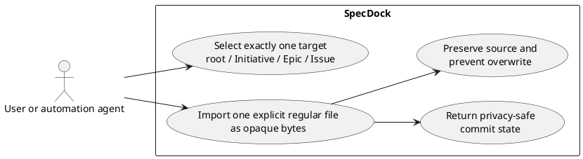
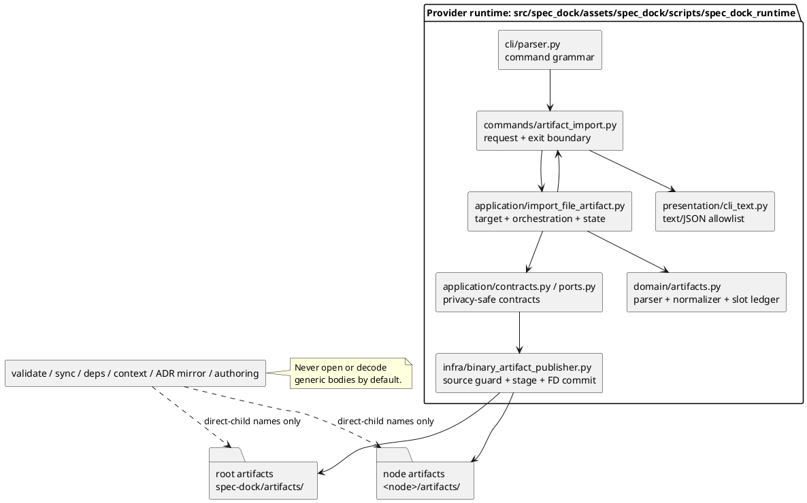
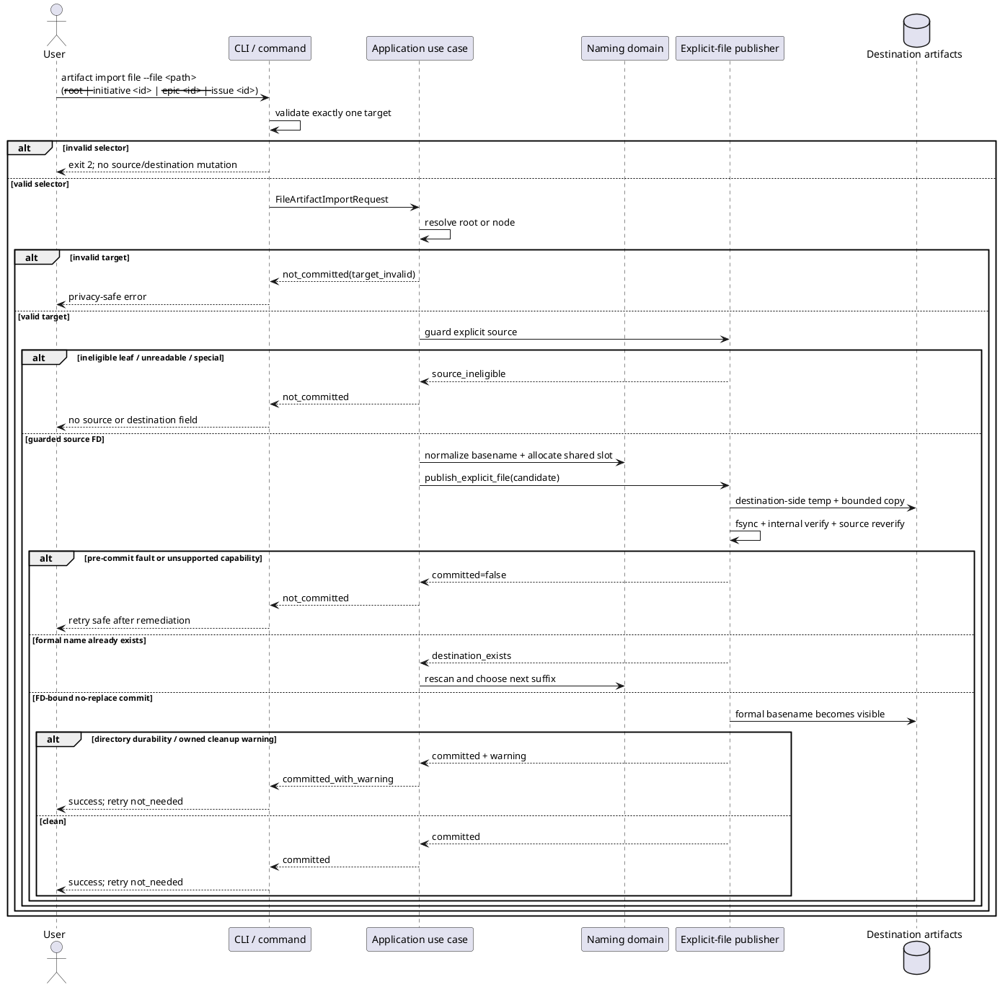
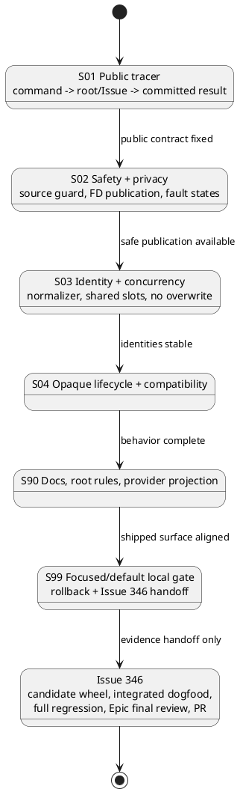

# Generic Single-File Artifact Import — 初日オンボーディング

> **位置づけ（evidence / proposed）**: 本資料は ChatGPT による作成原稿を、Issue の検討材料として保持するためのアーティファクトです。canonical requirement / design / plan ではなく、review pass や実装開始可否を主張しません。採用・実行判断は canonical docs と fresh review に従います。
>
> **Provenance**: source ZIP SHA-256 `4c3317e697b7fe68b91bfc04401f36b8407b20631460b8ee4199ebf2c4d20eba`。修正版 authoring pack content digest `4da06f4a19034d6dcf8d0d24550298604a97096c1f2d18d56473297ad76ff573`。

## 0. 最初に知っておくこと

この文書は、本日参加したengineerまたはagentが、対象機能の利用者価値、責務分割、安全境界、test strategy、実装順序を一日目に理解するための説明資料である。本文で使うプロジェクト固有語は、次の§1で先に定義する。

## 1. Project-specific terms

この節で用語を定義してから、以降で使用する。

### 1.1 SpecDock

仕様とagent-native implementation workflowを管理するtool。repository自身もSpecDockを使ってSpecDockを開発しており、この自家利用をdogfoodingと呼ぶ。

### 1.2 Provider と consumer workspace

- **provider**: shipped sourceの正本。`src/spec_dock/`、特に`src/spec_dock/assets/spec_dock/`。
- **consumer workspace**: providerから生成された実利用面。本repositoryでは`spec-dock/`。
- **dogfood projection**: provider assetが本repositoryのconsumer workspaceへ投影されたもの。

原則はprovider-firstである。似たfileが両方にあっても、implementation authorityはprovider側にある。

### 1.3 Initiative、Epic、Issue、node

- **Initiative**:複数Epicを束ねる目的・投資単位。
- **Epic**:複数Issueを束ねるcapability/delivery単位。
- **Issue**:implementationの最小execution単位。
- **node**:上記三種類のgraph参加要素。`.meta.json`を持つ。

SpecDock rootはnodeではない。本機能ではexplicit targetにはなるが、graphへ追加しない。

### 1.4 Artifact

rootまたはnodeの`artifacts/`直下へ保存されるevidence file。Artifactが存在しても、canonical specificationへ採用されたとは限らない。

### 1.5 Typed、blank、generic family

- **typed Artifact**: filenameに`adr`、`research`等のtype tokenを持つ既存Markdown Artifact。
- **blank Artifact**: type tokenを持たない既存Markdown Artifact。`chatgpt-output`はこのfamilyへ保存する。
- **generic Artifact**:本Issueで追加するfamily。`--` delimiterの後ろにsafe original basenameを置き、内容形式を分類しない。

### 1.6 Workbench

`.workbench/`の一時作業領域。non-canonicalで、原則Git管理外のpayloadを置く。Issue `iss-00344`がshellを整備した。

### 1.7 `artifact import chatgpt-output`

approved Workbench内のlowercase `.md`一件を、title/slugに基づくblank Artifactとして保存する既存command。generic arbitrary-file importとは目的とcontractが異なる。

### 1.8 Opaque bytes と semantic opacity

- **opaque bytes**:text decode、newline変換、MIME判定、content classifierを行わず、そのまま扱うbyte sequence。
- **semantic opacity**:保存後もdefault lifecycleがbodyを仕様、ADR、dependency、contextとして解釈しないこと。

### 1.9 File descriptor

operating systemがopened fileを識別するhandle。本資料では**FD**と略す。path文字列が後から別fileを指しても、FDはopenしたobjectへ結び付く。この性質をsource verificationとcommitに使う。

### 1.10 No-replace publication

formal destination nameが既に存在するとき、置換せず失敗するpublication。check-then-writeだけではraceに弱いため、final commit primitive自体がno-replaceでなければならない。

### 1.11 Commit point

opened destination-side temp FDを、FD-bound no-replace primitiveでformal destination basenameへ公開した瞬間。この時点より前は`not_committed`、以後は`committed`または`committed_with_warning`である。

### 1.12 Time-of-check to time-of-use race

fileを確認した時点と実際に使う時点の間に対象が差し替わるrace。本資料では略語を使う場合、**TOCTOU race**と表記する。source path、ancestor symlink、destination pathで対策が必要である。

### 1.13 `NAME_MAX`

一つのfilesystem filename componentに許される最大byte数。Unicodeは一文字が複数byteになるため、character countではなくUTF-8 byte budgetで扱う。

### 1.14 Evidence-only と canonical

- **evidence-only**:採否判断の入力。保存されても正本ではない。
- **canonical**:repository workflowにより正式採用されたspecification/decision。


### 1.15 この資料の authority

この文書と、その生成元であるChatGPT outputは **evidence-only** であり、canonical authorityではない。保存されたこと、ZIPに入っていること、内容が詳細であることは、canonical adoption、reviewer pass、assurance classification、execution-ready、PR-ready、merge-ready、Issue finish、Epic completion、PR deliveryを意味しない。正本化と実行判断は、repository workflow、main orchestrator、fresh reviewに残る。

参照したrepository snapshotは次のとおりである。

- repository: `chemitaro/spec-dock`
- branch: `iss-00345-generic-single-file-artifact-import`
- commit: `3699e8d23628304a95165e8dd024ab63941ed2ae`


## 2. First day reading guide

次の順に読むと、contextを最短で組み立てられる。

1. **この文書の§1と§3〜§5**: 用語、user problem、既存commandとの境界を理解する。
2. **Issue `requirement.md`候補**: observable contract、privacy、acceptance criteriaを確認する。
3. **parent Epic `epic-00343/requirement.md`**: `E-RQ-008`〜`E-RQ-025`と`E-AC-008`以降を読む。
4. **accepted ADR**: `20260728t100038z-adr-generic-imported-file-identity-and-privacy-boundary.md`を読む。filename、privacy、commit/retryを再判断しないためである。
5. **Issue `design.md`候補**: layer責務、interfaces、state、stop conditionsを読む。
6. **current implementation**: `artifact_import.py` → `import_artifact.py` → `binary_artifact_publisher.py` → testsの順に読む。
7. **Issue `plan.md`候補**: closure indexとS01〜S99を読む。
8. **Issue 344/346 docs**:前提と後続ownershipだけを確認する。
9. **authoring workflow docs**: canonical adoption / reviewer / execution authorityを確認する。

初日に避けるべきこと:

- current `chatgpt-output` commandをそのままgeneralizeする。
- generic bodyをMarkdownとして読む。
- external source path/hash/countを“便利だから”出力する。
- rootをgraph nodeとして追加する。
- Issue 346のdistribution/final-quality workをIssue 345へ持ち込む。
- `authorized_profile`をこの資料から推測して書き換える。

## 3. User problem

利用者は、SpecDock repositoryの内外にある **任意の単一file** を、Initiative、Epic、Issue、またはSpecDock rootのArtifactとして保存したい。fileはMarkdownとは限らない。例えば次がある。

- PDFの調査報告書
- 画像
- ZIP archive
- binary dump
- invalid UTF-8を含むtool output
- extensionのないfile
- original case、spaces、Unicode、multi-suffixを持つfile

利用者が求めているのは「内容を理解して仕様へ変換すること」ではなく、「明示した一件を安全にevidenceとして残すこと」である。

成功とは次の状態である。

- sourceを一切変更しない。
- destinationにはbyte-identicalな一fileだけが現れる。
- existing Artifactを上書きしない。
- original basenameを可能な限り保つ。
- external sourceのdirectoryやcontent-derived metadataを漏らさない。
- commitしたか、commitしていないか、commit後warningかを利用者が判断できる。
- generic fileをtyped ArtifactやADRとして自動解釈しない。
- current `artifact import chatgpt-output`を壊さない。


## 4. Why this is separate from Workbench and `chatgpt-output`

generic commandを既存commandへ統合しない理由は、単なる実装好みではなくpublic contractの違いである。

| Concern | `artifact import chatgpt-output` | `artifact import file` |
|---|---|---|
| Source | approved Workbench内 | repository内外のexplicit path |
| File kind | lowercase `.md` | readable regular fileならextension/content不問 |
| Identity input | title + optional slug | original basename |
| Family | blank Markdown | generic opaque file |
| Filename | existing blank grammar | `<timestamp>--<safe-basename>` |
| Source symlink ancestry | reject | leaf reject、stable ancestor allow |
| Result metadata | existing source/hash/count fields | external basename-only、hash/countなし |
| Semantic meaning | external ChatGPT output evidence | arbitrary evidence file、内容不問 |
| Compatibility |既存workflow | additive、既存commandを変更しない |

既存commandをgeneralizeすると、次の問題が起きる。

- binaryをMarkdownとして扱う。
- title/slugでoriginal basenameを失う。
- `adr-*.md`をtyped ADRと誤認する。
- external path/hash/countを漏らす。
- post-commit warning後にretryし、duplicate importを作る。

## 5. User/system context

次の図は、誰が何を指定し、SpecDockが何を保証し、何をしないかを示す。利用者は一fileと一targetだけを明示し、SpecDockは保存するが内容のauthority判定はしない。



図の要点:

- inputは一targetと一sourceだけ。
- outputはcommit stateとsafe identity。
- **非スコープ**: MIME/content の分類、canonical spec/ADR への昇格、source の移動・削除・同期、bulk / recursive import はこの use case に含めない。

## 6. Public command and examples

### 6.1 Command shape

```text
./spec-dock/scripts/spec-dock artifact import file \
  --file <path> \
  (--root | --initiative <id> | --epic <id> | --issue <id>) \
  [--json]
```

### 6.2 Repository-internal example

```bash
./spec-dock/scripts/spec-dock artifact import file \
  --issue iss-00345 \
  --file evidence/Report FINAL.PDF \
  --json
```

relative sourceはshellのcurrent directoryではなくrepository rootを基準にする。

### 6.3 Explicit external relative example

```bash
./spec-dock/scripts/spec-dock artifact import file \
  --root \
  --file ../evidence/archive.tar.gz
```

この場合、success outputへ出してよいsource identityは`archive.tar.gz`だけである。`..`、parent directory、absolute locationは出さない。

### 6.4 Absolute external example

absolute pathもexplicit authorizationとして受け付ける。ただしdocumentationやtest fixtureではhost-specific absolute pathをhard-codeせず、temp fixtureから構築する。public outputはbasenameだけである。

### 6.5 Not accepted

```text
--title
--slug
--mime
--encoding
--directory
--glob
--recursive
--move
--delete-source
--overwrite
```

## 7. Architecture by layer

### 7.1 Component/layer diagram

次の図は、各layerの責務と、generic bodyがsemantic consumersへ流れないことを示す。provider source pathsが一次実装面である。



### 7.2 Layer responsibilities

#### CLI

- `file` subcommandを登録する。
- exactly one targetをargparseで要求する。
- invalid argvでuse caseを呼ばない。

#### Command handler

- parsed argumentsをgeneric requestへ変換する。
- known generic errorだけをgeneric rendererへ渡す。
- unexpected exceptionのraw message/pathを捨て、stable `runtime_failed`へ正規化する。

#### Application

- root/node targetを解決する。
- source preflightをdestination setupより先に行う。
- create lock、Artifact setup、shared slot allocation、publisher call、bounded race retryを調整する。
- commit後warningをfailureへ変えない。
- public resultからinternal hash/count/pathを除く。

#### Domain

- generic filenameをtyped/blankとは別grammarでparseする。
- original basenameをminimal normalizeする。
- typed/blank/generic共通slot ledgerをname-onlyで構築する。
- body、MIME、encodingを知らない。

#### Infrastructure

- repository-root-relative pathを解決する。
- regular leaf/readability/leaf symlink/ancestor symlink/identityをguardする。
- destination-side tempへbounded stream copyする。
- hash/countをinternal verificationにだけ使う。
- source stabilityとdestination parent identityを再確認する。
- safe capabilityをprobeし、FD-bound no-replaceでcommitする。

#### Presentation

- text/JSONのexact allowlistだけを出す。
- external sourceはbasenameだけ。
- errorはsource/destination/raw exceptionなし。
- `not_committed`, `committed`, `committed_with_warning`とretry dispositionを出す。

#### Lifecycle consumers

- generic nameをinventory/slotのために見ることはある。
- generic bodyはdefaultでopen/decodeしない。
- typed ADR mirror、dependency、context、authoring candidateへ入れない。

## 8. Full import path

### 8.1 Before opening the source

1. CLIがtarget selector countを確認する。
2. applicationがrootまたはnode targetを解決する。
3. invalid targetならsourceをopenせず、destination setupを作らず失敗する。

### 8.2 Source admission

1. relative pathはrepository root基準でabsolute working pathへ変換する。
2. leafを`lstat`し、leaf symlinkを拒否する。
3. read-only + no-followでopenする。
4. `fstat`でregular fileを確認する。
5. opened FDとvisible leaf identityを照合する。
6. ancestor symlinkは存在してよいが、後段再検証に通る必要がある。

### 8.3 Naming and allocation

1. explicit pathのoriginal leaf basenameを取る。
2. unsafe componentと`NAME_MAX`超過だけをminimal normalizeする。
3. target `artifacts/`のdirect child namesをscanする。
4. typed/blank/generic全familyのsame timestamp slotをledgerへ入れる。
5. standard slot、次に`01..99`の最初のfree slotを選ぶ。

### 8.4 Staging and verification

1. destination directory内にowned hidden tempをexclusive createする。
2. source FDからfixed-size chunkでcopyする。
3. temp fileをfsyncする。
4. internal hash/countでstreamとstaged bytesを照合する。
5. source FDを再読し、hash/count/metadata/path identityを照合する。
6. destination parent FDとvisible directory identityを照合する。

### 8.5 Commit and cleanup

1. supported descriptor-bound no-replace primitiveを使う。
2. formal destinationが既にあれば置換せず、applicationがnext slotを再選択する。
3. commit後にdirectory fsyncとowned temp cleanupを行う。
4. commit後のdurability/cleanup failureはwarningであり、retryは不要。

## 9. Import sequence, including rejection and warning branches

次の図は、reject、pre-commit failure、race retry、clean commit、commit後warningを時系列で示す。最重要点は、formal destinationが見えた後に`not_committed`へ戻らないことである。



## 10. Naming grammar

### 10.1 Standard and collision forms

```text
<timestamp>--<safe-original-basename>
<timestamp>-<nn>--<safe-original-basename>
```

Examples:

```text
20260730t010203z--Report FINAL.PDF
20260730t010203z-01--archive.tar.gz
20260730t010203z-02--解析 結果.bin
```

### 10.2 Meaning of `--`

`--`はgeneric family delimiterである。`file`というtyped tokenの省略形ではない。

Wrong mental model:

```text
20260730t010203z-file-report.pdf
```

Correct model:

```text
20260730t010203z--report.pdf
```

### 10.3 Full destination basename identity

public `artifact_id`はtimestamp部分だけではなく、full destination basenameである。

```text
artifact_id = 20260730t010203z--Report FINAL.PDF
```

### 10.4 Shared slot ledger

同じtimestampに次が存在するとする。

```text
20260730t010203z-adr-decision.md       # typed, standard slot
20260730t010203z-01-notes.md           # blank, suffix 01
20260730t010203z-02--scan.bin           # generic, suffix 02
```

次のgeneric importは`<timestamp>-03--<safe-original-basename>`を使う。familyごとに`-01`を重複使用しない。

### 10.5 Minimal normalization

保持するもの:

- case
- spaces
- Unicode
- extension chain
- original basenameの意味

変更してよいもの:

- path separator
- NUL/control characters
- platform-reserved component
- unsafe trailing component
- `NAME_MAX`超過部分

行わないもの:

- slugification
- lowercasing
- title生成
- MIME-based extension追加
- content hash prefix

### 10.6 `NAME_MAX` example

filename budgetは最大collision prefix`<timestamp>-99--`を先に引いてからbasenameへ配分する。UnicodeをUTF-8 byteの途中で切らない。`archive.tar.gz`のようなextension chainは、budgetが許す限り右側に保持する。

## 11. Privacy model

### 11.1 Internal source

repository内sourceはrepository-relative pathをsuccess outputへ出せる。

```text
source=evidence/Report FINAL.PDF
source_visibility=repo_relative
```

absolute host pathへ変換して出さない。

### 11.2 External source

repository外sourceはbasenameだけ。

```text
source=Report FINAL.PDF
source_visibility=basename_only
```

出してはいけないもの:

- absolute path
- `..`やparent directory
- body/content preview
- hash
- byte count
- MIME
- encoding
- content-derived count/value
- raw exception message

### 11.3 Error privacy

pre-commit errorはsource fieldもdestination fieldも持たない。理由は、source classificationやtarget resolutionが失敗した時点でsafe displayを推測すると、private pathを誤って公開し得るためである。

### 11.4 Tracked provenance

commandはsource provenance catalogを作らない。external path/hash/countをreport、sidecar、frontmatter、indexへ自動記録しない。

## 12. Publication state machine

### 12.1 States

| State | Meaning | Formal file | Exit | Retry |
|---|---|---|---|---|
| `not_committed` | commit point前のfailure | このattemptではなし | failure | repair後はsafe |
| `committed` | commitとdurability/cleanup完了 | あり | success |不要 |
| `committed_with_warning` | commit後にdurability/owned cleanup warning | あり | success with warning |不要 |

### 12.2 Why warning is still success

formal filenameが既にvisibleなのにcommandをfailure扱いすると、callerは同じsourceをretryし、別suffixのduplicateを作る可能性がある。したがって、commit後warningは`committed=true`と`retry_disposition=not_needed`を必ず返す。

### 12.3 Typical pre-commit failures

- invalid target
- ineligible source
- source changed
- basename invalid
- unsafe Artifact setup
- slot exhaustion
- temp create/copy/file fsync/hash failure
- unsupported publication capability
- destination parent identity failure

### 12.4 Typical post-commit warnings

- directory fsync failed
- owned temp cleanup retained
- create lock release failed

## 13. Why destination-side staging matters

sourceが別filesystemにあっても、destination directoryにtempを作り、source bytesをcopyすればcross-filesystemを支援できる。sourceをformal destinationへrenameまたはhard-linkすると、device boundaryで失敗し、source mutationの危険も増える。

重要な不変条件:

- sourceはread-only。
- tempはdestination side。
- commitするのはtemp FD。
- existing formal nameは置換しない。
- capabilityがなければfail closed。

## 14. Source symlink policy

### 14.1 Leaf symlink: reject

利用者が指定したleaf自体がsymlinkなら拒否する。明示したpathのidentityと実際に読まれるfileのidentityがずれるためである。

### 14.2 Ancestor symlink: allow with verification

parent directoryのどこかがsymlinkでも、leaf regular fileをopenし、FD/path identityがstableで、stage後の再検証に通れば許可する。

### 14.3 Retarget race

ancestor symlinkがstage中に別directoryへ向き直された場合、open FDからcopyしたbytesとvisible path identityの不一致を検知し、commit前に`source_changed`で失敗する。

## 15. Semantic opacity after import

保存後のgeneric fileはevidenceではあるが、default semanticsを持たない。

### 15.1 `validate`

filename/rules/directory safetyを見ることはできる。bodyをschema/frontmatterとして検証しない。

### 15.2 `sync`

node/index/tree/dashboardへbodyを取り込まない。generic `.md`をdecodeしない。

### 15.3 Dependency and context-pack

bodyからdependencyやactive contextを抽出しない。

### 15.4 ADR mirror

basenameがgeneric grammarなら、bodyにADR風frontmatterがあってもtyped ADR mirrorへ入れない。

### 15.5 Authoring discovery

generic bodyをdraft requirement/design/plan、delegated artifact、canonical candidateとして自動発見しない。

## 16. Compatibility boundary

### 16.1 Existing `chatgpt-output`

次を維持する。

- approved Workbench only
- lowercase `.md`
- `--title` required
- `--slug` optional
- blank Artifact identity
- existing source/hash/byte_count result
- current warning codes

### 16.2 Existing typed/blank Artifact

- current parser return contractを維持する。
- existing filesをrename/migrateしない。
- shared slot ledgerにslotを提供するだけ。

### 16.3 Workbench shell

Issue 344のpremiseを再実装しない。generic importはWorkbenchを経由しなくてもよいが、Workbench copy/watch/syncを追加しない。

## 17. Test strategy

### 17.1 Test levels

#### Domain tests

- generic parser/formatter
- minimal normalizer
- `NAME_MAX`
- shared slot ledger
- suffix exhaustion

#### Application tests

- target resolution
- root non-node
- source preflight ordering
- state/error mapping
- lock warning merge
- destination race retry

#### Infrastructure tests

- source-kind matrix
- leaf/ancestor symlinks
- byte preservation
- bounded streaming
- source mutation
- cross-filesystem
- capability probe
- fault injection
- no-replace race

#### Presentation tests

- exact text/JSON fields
- basename-only external output
- no hash/count/MIME/encoding/raw error
- publication/retry state

#### CLI runtime tests

- full public command
- four targets
- nested current directory
- internal/external path
- binary/invalid UTF-8
- concurrency
- lifecycle opacity
- legacy compatibility

### 17.2 Why existing tests matter

current `artifact import chatgpt-output` tests are not “old tests to update away.” They are compatibility constraints. Refactoring publisher coreがlegacy behaviorを変えていないことを証明するcharacterization testsである。

### 17.3 Focused/default vs full regression

Issue 345はfocused testsとordinary default laneを所有する。explicit `--run-full-regression`、candidate wheel consumer test、integrated dogfood、Epic-wide final reviewはIssue 346が所有する。

### 17.4 Important test sentinels

- private parent directory token
- secret-like body token
- raw exception token
- known hash/count
- invalid UTF-8
- ADR-like frontmatter

これらがstdout、stderr、warning、JSON、tracked diffへ現れないことを確認する。

## 18. Implementation milestones and dependencies

次の図は、implementationをlayer別にまとめず、observable behaviorの縦切りで進める順序を示す。各milestoneの後にreview可能なcommit候補を置く。



図の要点:

- S01は最小end-to-end tracerであり、layer scaffoldだけを先に作らない。
- S02/S03でsafetyとidentityを閉じる。
- S04でsemantic isolationとlegacy compatibilityを閉じる。
- S90はprovider-first docs/projection。
- S99はIssue 345 local gateであり、Epic final deliveryではない。
- Issue 346へ進む矢印はhandoffであり、完了claimではない。

## 19. Issue 344 / 345 / 346 relationship

### Issue 344: Workbench shell premise

- `.workbench/` shellとREADME/ignore premiseを整える。
- provider-first projection boundaryを確立する。
- arbitrary generic importは所有しない。

### Issue 345: This issue

- arbitrary single-file generic import。
- source preservation、naming、privacy、publication、opaque lifecycle。
- focused/default tests、docs、provider/dogfood parity。

### Issue 346: Final integration and delivery

- candidate wheel consumer end-to-end test。
- integrated dogfood for the Epic slice。
- opt-in full regression。
- Epic-wide code/spec/quality/decision reviews。
- residual Epic integration pull request and delivery gates。

覚え方:

```text
344 = place to work
345 = safe one-file evidence import
346 = distributed integrated proof and final Epic delivery
```

## 20. Concrete scenarios

### 20.1 Root PDF import

Input:

```bash
./spec-dock/scripts/spec-dock artifact import file \
  --root \
  --file evidence/Report FINAL.PDF \
  --json
```

Expected concepts:

- `spec-dock/artifacts/` destination。
- root rules setup exists。
- filename preserves`Report FINAL.PDF`。
- root graph node is not created。
- result has no hash/count。

### 20.2 External ZIP import

Input concept:

```bash
./spec-dock/scripts/spec-dock artifact import file \
  --epic epic-00343 \
  --file ../external/archive.tar.gz
```

Expected concepts:

- source display is`archive.tar.gz` only。
- destination retains`.tar.gz`。
- source remains unchanged。
- no parent path/provenance。

### 20.3 Invalid UTF-8 generic Markdown

Source basename:

```text
raw-output.md
```

Body contains invalid UTF-8 and ADR-looking bytes。Expected:

- import succeeds as opaque bytes。
- generic filename uses`--raw-output.md`。
- `validate`/`sync`do notdecode it。
- ADR mirror unchanged。

### 20.4 Same-second collision

Existing:

```text
20260730t010203z-adr-decision.md
20260730t010203z-01-notes.md
```

New generic:

```text
20260730t010203z-02--scan.bin
```

### 20.5 Post-commit directory fsync warning

Expected result concepts:

```text
committed=true
publication_state=committed_with_warning
warning_codes=directory_fsync_failed
retry_disposition=not_needed
```

Do not retry automatically。

## 21. Common misunderstandings

### Misunderstanding 1: “generic Markdown is still a Markdown Artifact”

違う。extensionが`.md`でもgeneric familyはopaque。typed/blank grammarに昇格しない。

### Misunderstanding 2: “`--` means type=file”

違う。`--`はgeneric family delimiter。typed tokenではない。

### Misunderstanding 3: “hash and byte count are useful, so output them”

generic external privacy contractでは禁止。internal verification/testでだけ使う。

### Misunderstanding 4: “post-commit warning means command failed”

違う。formal fileは存在するためsuccess with warning。retry不要。

### Misunderstanding 5: “ancestor symlink is always unsafe”

leaf symlinkはrejectだが、ancestor symlinkはFD/path identity verificationに通ればallowする。legacy Workbench policyとは異なる。

### Misunderstanding 6: “root needs a new `.meta.json` node”

違う。rootはexplicit target descriptorであり、graph nodeではない。

### Misunderstanding 7: “shared slot means same filename stem”

違う。sharedなのはtimestamp/suffix slot。typed、blank、genericが同じslotを使わない。

### Misunderstanding 8: “source path is authorization to inspect its directory”

違う。authorizationは指定leaf一件だけ。parent/siblingsをenumerateしない。

### Misunderstanding 9: “Issue 345 must run full regression and ship the PR”

違う。それらはIssue 346 ownership。本Issueはfocused/default local evidenceとhandoffまで。

### Misunderstanding 10: “this onboarding document settles the assurance grade”

違う。runtime guidanceの`strict`とparent recommendationの`critical`はpending classification input。この文書はauthorityを変更しない。

## 22. Review checklist

### Public command

- [ ] `artifact import file` is additive。
- [ ] exactly one root/Initiative/Epic/Issue。
- [ ] no title/slug/MIME/encoding/bulk/move/overwrite options。

### Target and setup

- [ ] root is not a graph node。
- [ ] root/node Artifact rules are safe and correct。
- [ ] invalid source does not create fresh setup。

### Source safety

- [ ] regular readable leaf only。
- [ ] leaf symlink reject。
- [ ] stable ancestor symlink allow。
- [ ] source mutation/replacement/retarget detected。
- [ ] source never modified/deleted。

### Naming

- [ ] fixed `--` grammar。
- [ ] full destination basename identity。
- [ ] case/spaces/Unicode/extension chain preserved where safe。
- [ ] max `-99--` prefix fits `NAME_MAX`。
- [ ] typed/blank/generic shared slot ledger。

### Publication

- [ ] destination-side staging。
- [ ] bounded streaming。
- [ ] FD-bound no-replace commit。
- [ ] cross-filesystem source supported。
- [ ] unsupported capability fails closed。
- [ ] pre/post commit states honest。

### Privacy

- [ ] external source output basename-only。
- [ ] failures have no source/destination fields。
- [ ] no body/hash/count/MIME/encoding/raw exception。
- [ ] no tracked external provenance。

### Semantic boundary

- [ ] generic body not read by validate/sync/deps/context/ADR/authoring。
- [ ] generic `.md` not typed/ADR。
- [ ] root generic not added to graph projections。

### Compatibility

- [ ] current `chatgpt-output` tests pass。
- [ ] typed/blank/new Artifact behavior unchanged。
- [ ] Workbench shell/copy unchanged。

### Delivery boundary

- [ ] provider-first changes。
- [ ] managed dogfood projection inspected。
- [ ] focused/default lane only in Issue 345。
- [ ] candidate-wheel/integrated/full/Epic final/PR explicitly deferred to Issue 346。
- [ ] no authority/readiness/merge claim。

## 23. Where to find authoritative sources

### Repository policy

- `AGENTS.md`
  - provider vs dogfood authority
  - layered runtime
  - test lanes
  - provider-first workflow

### Parent Epic

- `spec-dock/initiatives/init-local-00002-prototype-feature-expansion/epics/epic-00343-workbench-shell-and-explicit-file-artifact-import/requirement.md`
  - `E-RQ-008`〜`E-RQ-025`
  - `E-AC-008`以降
- same directory `design.md`
  - `D-003`〜`D-009`
- same directory `plan.md`
  - Candidate 2 / Candidate 3 ownership

### Accepted architecture decision

- `spec-dock/initiatives/init-local-00002-prototype-feature-expansion/epics/epic-00343-workbench-shell-and-explicit-file-artifact-import/artifacts/20260728t100038z-adr-generic-imported-file-identity-and-privacy-boundary.md`

### Issue 345 current sources

- `spec-dock/initiatives/init-local-00002-prototype-feature-expansion/epics/epic-00343-workbench-shell-and-explicit-file-artifact-import/issues/iss-00345-generic-single-file-artifact-import/requirement.md`
- `design.md`
- `plan.md`
- `report.md`
- clarification artifacts under `artifacts/`

指定 revision では、Issue の R/D/P files は complete canonical specifications ではなく、scaffold / awaiting-compose の状態である。この onboarding pack は候補であり、それらへの採用済み状態を主張しない。

### Current runtime

- `src/spec_dock/assets/spec_dock/scripts/spec_dock_runtime/cli/parser.py`
- `src/spec_dock/assets/spec_dock/scripts/spec_dock_runtime/commands/artifact_import.py`
- `src/spec_dock/assets/spec_dock/scripts/spec_dock_runtime/application/import_artifact.py`
- `src/spec_dock/assets/spec_dock/scripts/spec_dock_runtime/application/contracts.py`
- `src/spec_dock/assets/spec_dock/scripts/spec_dock_runtime/application/ports.py`
- `src/spec_dock/assets/spec_dock/scripts/spec_dock_runtime/application/create_artifact_doc.py`
- `src/spec_dock/assets/spec_dock/scripts/spec_dock_runtime/domain/artifacts.py`
- `src/spec_dock/assets/spec_dock/scripts/spec_dock_runtime/infra/binary_artifact_publisher.py`
- `src/spec_dock/assets/spec_dock/scripts/spec_dock_runtime/presentation/cli_text.py`
- `src/spec_dock/assets/spec_dock/scripts/spec_dock_runtime/cli/bootstrap.py`
- lifecycle consumers such as `src/spec_dock/assets/spec_dock/scripts/spec_dock_runtime/application/sync_state.py`

### Current tests

- `tests/unit/commands/test_artifact_import_chatgpt_output.py`
- `tests/unit/presentation/test_artifact_import_chatgpt_output.py`
- `tests/unit/application/test_binary_artifact_import_ports.py`
- `tests/unit/infra/test_binary_artifact_publisher.py`
- `tests/cli_runtime/test_artifact_import_chatgpt_output.py`
- `tests/cli_runtime/test_artifact_import_s04.py`
- generic Issue 345 test files named in the parent plan are expected additions where absent。

### Authoring and execution rules

- `spec-dock/docs/workflow_issue.md`
- `spec-dock/docs/workflow_spec_authoring.md`
- `spec-dock/docs/phase_plan_issue.md`
- `spec-dock/docs/authoring/issue-plan.md`

## 24. Pending inputs and escalation

### Assurance classification

runtime guidance reports `authorized_profile=strict`; parent Candidate 2 recommends `critical`。この文書から assurance state を編集して解決してはならない。runtime-owned classification と authoring gates を使用する。

### Root rules and new tests

commit `3699e8d23628304a95165e8dd024ab63941ed2ae` では、root Artifact rules source と複数の generic-specific test files はまだ存在しない。これらは実装済み事実ではなく、planned implementation outputs として扱う。

### Escalate rather than improvise when

- filename delimiter/identity must change。
- external path/hash/count must become public。
- generic body must be parsed。
- source must be moved/deleted。
- safe no-replace capability cannot be provided。
- postcommit warning must become retry-required。
- root must become a graph node。
- legacy `chatgpt-output` contract must change。
- Issue 346 scope must move into Issue 345。

## 25. First-day practical orientation

初日に実施する順序は次のとおり。

1. 記憶上の実装状態ではなく、exact branch と commit を checkout / inspect する。
2. existing `chatgpt-output` focused tests を実行し、legacy baseline を固定する。
3. `FilesystemBinaryArtifactPublisher` を読み、Workbench guard と reusable stage / verify / commit core の境界を特定する。
4. `domain/artifacts.py` を読み、current scan / parser が Markdown-oriented であることを確認する。
5. `create_artifact_doc.py` を読み、Artifact setup / create lock / slot allocation の seam を特定する。
6. 全 layer を一度に変更せず、各 planned change を S01〜S04 のいずれかへ対応付ける。
7. failing public CLI test から S01 を開始する。
8. material deviation はすべて report evidence に記録し、fixed decision を黙って変更しない。

The key sentence to remember:

> This feature safely preserves one explicit file as opaque evidence; it does not understand, adopt, or authorize that file.
